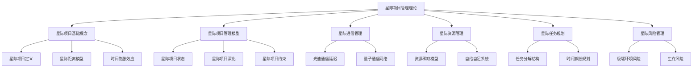
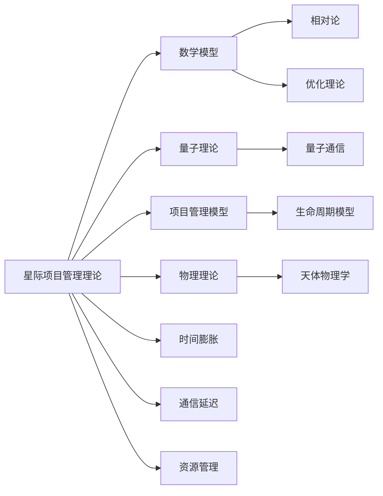

# 1.7 星际项目管理理论 / Interstellar Project Management Theory

## 📋 Table of Contents / 目录

- [1.7 星际项目管理理论 / Interstellar Project Management Theory](#17-星际项目管理理论--interstellar-project-management-theory)
  - [📋 Table of Contents / 目录](#-table-of-contents--目录)
  - [1. Overview / 概述](#1-overview--概述)
  - [2. Definition / 定义](#2-definition--定义)
    - [2.1 星际项目基础概念定义](#21-星际项目基础概念定义)
    - [星际距离模型](#星际距离模型)
    - [时间膨胀效应](#时间膨胀效应)
    - [2.2 星际项目管理模型定义](#22-星际项目管理模型定义)
    - [星际项目状态](#星际项目状态)
    - [星际项目演化](#星际项目演化)
    - [星际项目约束](#星际项目约束)
  - [3. Properties / 属性](#3-properties--属性)
    - [3.1 时间膨胀属性](#31-时间膨胀属性)
    - [3.2 通信延迟属性](#32-通信延迟属性)
    - [3.3 资源稀缺属性](#33-资源稀缺属性)
    - [3.4 自给自足属性](#34-自给自足属性)
    - [3.5 生存概率属性](#35-生存概率属性)
  - [4. Relations / 关系](#4-relations--关系)
    - [4.1 星际理论与数学模型的关系](#41-星际理论与数学模型的关系)
    - [4.2 星际理论与量子理论的关系](#42-星际理论与量子理论的关系)
    - [4.3 星际理论与项目管理的关系](#43-星际理论与项目管理的关系)
    - [4.4 星际理论与全息理论的关系](#44-星际理论与全息理论的关系)
    - [4.5 星际理论与生物启发理论的关系](#45-星际理论与生物启发理论的关系)
  - [5. Examples / 实例](#5-examples--实例)
    - [5.1 NASA Voyager项目实例](#51-nasa-voyager项目实例)
    - [5.2 NASA Mars Rover项目实例](#52-nasa-mars-rover项目实例)
    - [5.3 James Webb Space Telescope项目实例](#53-james-webb-space-telescope项目实例)
    - [5.4 Linux内核项目实例（类比）](#54-linux内核项目实例类比)
    - [5.5 Kubernetes项目实例（类比）](#55-kubernetes项目实例类比)
  - [6. Explanations / 解释](#6-explanations--解释)
    - [6.1 数学解释 / Mathematical Explanation](#61-数学解释--mathematical-explanation)
    - [6.2 直观解释 / Intuitive Explanation](#62-直观解释--intuitive-explanation)
    - [6.3 应用解释 / Application Explanation](#63-应用解释--application-explanation)
    - [6.4 认知解释 / Cognitive Explanation](#64-认知解释--cognitive-explanation)
    - [6.5 历史解释 / Historical Explanation](#65-历史解释--historical-explanation)
    - [6.6 哲学解释 / Philosophical Explanation](#66-哲学解释--philosophical-explanation)
    - [6.7 技术解释 / Technical Explanation](#67-技术解释--technical-explanation)
    - [6.8 实践解释 / Practical Explanation](#68-实践解释--practical-explanation)
    - [6.9 对比解释 / Comparative Explanation](#69-对比解释--comparative-explanation)
    - [6.10 系统解释 / System Explanation](#610-系统解释--system-explanation)
  - [7. Argumentation / 论证](#7-argumentation--论证)
    - [7.1 时间膨胀定理](#71-时间膨胀定理)
    - [7.2 通信延迟下界定理](#72-通信延迟下界定理)
    - [7.3 资源自给自足定理](#73-资源自给自足定理)
  - [8. Applications / 应用](#8-applications--应用)
    - [8.1 NASA深空探测项目应用](#81-nasa深空探测项目应用)
    - [8.2 SpaceX星际项目应用](#82-spacex星际项目应用)
    - [8.3 大型软件系统项目应用（类比）](#83-大型软件系统项目应用类比)
    - [8.4 分布式系统项目应用（类比）](#84-分布式系统项目应用类比)
    - [8.5 超长周期研发项目应用](#85-超长周期研发项目应用)
  - [1.7.3 星际通信管理](#173-星际通信管理)
    - [光速通信延迟](#光速通信延迟)
    - [量子通信网络](#量子通信网络)
  - [1.7.4 星际资源管理](#174-星际资源管理)
    - [资源稀缺模型](#资源稀缺模型)
    - [自给自足系统](#自给自足系统)
  - [1.7.5 星际任务规划](#175-星际任务规划)
    - [任务分解结构](#任务分解结构)
    - [时间膨胀规划](#时间膨胀规划)
  - [1.7.6 星际风险管理](#176-星际风险管理)
    - [极端环境风险](#极端环境风险)
  - [1.7.7 星际项目管理应用](#177-星际项目管理应用)
    - [深空探测任务](#深空探测任务)
    - [星际通信网络](#星际通信网络)
  - [1.7.8 星际项目管理优势](#178-星际项目管理优势)
    - [超长距离管理](#超长距离管理)
    - [超长时间规划](#超长时间规划)
    - [极端环境适应](#极端环境适应)
  - [1.7.9 实现示例](#179-实现示例)
    - [Rust 星际项目管理框架](#rust-星际项目管理框架)
    - [Haskell 星际项目管理类型系统](#haskell-星际项目管理类型系统)
  - [1.7.10 星际项目管理挑战](#1710-星际项目管理挑战)
    - [技术挑战](#技术挑战)
    - [理论挑战](#理论挑战)
    - [应用挑战](#应用挑战)
  - [1.7.11 未来发展方向](#1711-未来发展方向)
    - [短期发展 (2024-2027)](#短期发展-2024-2027)
    - [中期发展 (2028-2032)](#中期发展-2028-2032)
    - [长期发展 (2033-2040)](#长期发展-2033-2040)
  - [9. References / 参考文献](#9-references--参考文献)
    - [9.1 Latest Research Frontiers (2020-2025) / 最新研究前沿 (2020-2025)](#91-latest-research-frontiers-2020-2025--最新研究前沿-2020-2025)
    - [9.2 权威教材 / Authoritative Textbooks](#92-权威教材--authoritative-textbooks)
    - [9.3 实际项目案例 / Real Project Cases](#93-实际项目案例--real-project-cases)
    - [9.4 国际标准 / International Standards](#94-国际标准--international-standards)
    - [9.5 学术论文 / Academic Papers](#95-学术论文--academic-papers)
  - [10. Status / 状态](#10-status--状态)

---

## 1. Overview / 概述

星际项目管理理论是Formal-ProgramManage的前沿理论基础，专门针对未来太空项目、星际探索、深空任务等超长距离、超长时间、超高复杂度的项目管理需求。本理论涵盖了星际通信、时间膨胀、资源稀缺、环境极端等特殊挑战。

**主题定位**: 本理论属于基础理论层（FL），是Formal-ProgramManage知识体系的前沿探索，为超长周期、超高复杂度的项目管理提供理论支撑。

**主要内容**:

- 星际项目基础概念（星际项目定义、星际距离模型、时间膨胀效应）
- 星际项目管理模型（星际项目状态、星际项目演化、星际项目约束）
- 星际通信管理（光速通信延迟、量子通信网络）
- 星际资源管理（资源稀缺模型、自给自足系统）
- 星际任务规划（任务分解结构、时间膨胀规划）
- 星际风险管理（极端环境风险、生存风险）

**学习目标**:

- 理解星际项目管理的特殊挑战
- 掌握时间膨胀、通信延迟等物理约束的管理方法
- 能够应用星际项目管理理论解决超长周期项目问题
- 了解大型分布式软件系统项目的管理类比

**标准对标**:

- NASA项目管理标准
- ESA项目管理标准
- 大型软件系统项目管理（Linux内核、Kubernetes等）

**知识体系层次结构**:



---

## 2. Definition / 定义

### 2.1 星际项目基础概念定义

**定义 1.7.1** 星际项目是一个七元组 $ISP = (L, T, R, E, C, S, M)$，其中：

- $L$ 是距离集合 (Light-years)
- $T$ 是时间集合 (Time dilation)
- $R$ 是资源集合 (Resources)
- $E$ 是环境集合 (Environment)
- $C$ 是通信集合 (Communication)
- $S$ 是生存集合 (Survival)
- $M$ 是任务集合 (Mission)

### 星际距离模型

**定义 1.7.2** 星际距离函数：
$$D_{interstellar} = \sqrt{\sum_{i=1}^{3} (x_i - y_i)^2}$$

其中 $(x_1, x_2, x_3)$ 和 $(y_1, y_2, y_3)$ 是三维空间坐标。

### 时间膨胀效应

**定义 1.7.3** 相对论时间膨胀：
$$t' = \frac{t}{\sqrt{1 - \frac{v^2}{c^2}}}$$

其中：

- $t$ 是地球时间
- $t'$ 是飞船时间
- $v$ 是飞船速度
- $c$ 是光速

### 2.2 星际项目管理模型定义

### 星际项目状态

**定义 1.7.4** 星际项目状态是一个八元组 $IPS = (P, L, T, R, E, C, S, M)$，其中：

- $P$ 是位置向量 (Position Vector)
- $L$ 是距离矩阵 (Distance Matrix)
- $T$ 是时间矩阵 (Time Matrix)
- $R$ 是资源矩阵 (Resource Matrix)
- $E$ 是环境矩阵 (Environment Matrix)
- $C$ 是通信矩阵 (Communication Matrix)
- $S$ 是生存矩阵 (Survival Matrix)
- $M$ 是任务矩阵 (Mission Matrix)

### 星际项目演化

**定义 1.7.5** 星际项目演化方程：
$$\frac{d}{dt}IPS(t) = F(IPS(t), E(t), C(t))$$

其中：

- $F$ 是演化函数
- $E(t)$ 是环境函数
- $C(t)$ 是控制函数

### 星际项目约束

**定义 1.7.6** 星际项目约束条件：
$$
\begin{cases}
\text{资源约束}: \sum_{i} R_i(t) \leq R_{max} \\
\text{时间约束}: T_{mission} \leq T_{max} \\
\text{通信约束}: C_{delay} \leq C_{max} \\
\text{生存约束}: S_{probability} \geq S_{min}
\end{cases}
$$

---

## 3. Properties / 属性

### 3.1 时间膨胀属性

**属性 1.7.1** (时间膨胀) 星际项目中的时间膨胀效应：
$$t' = \frac{t}{\sqrt{1 - \frac{v^2}{c^2}}}$$

其中 $t'$ 是飞船时间，$t$ 是地球时间，$v$ 是飞船速度，$c$ 是光速。

### 3.2 通信延迟属性

**属性 1.7.2** (通信延迟) 星际通信延迟与距离成正比：
$$\tau_{communication} = \frac{D_{interstellar}}{c}$$

其中 $D_{interstellar}$ 是星际距离，$c$ 是光速。

### 3.3 资源稀缺属性

**属性 1.7.3** (资源稀缺) 星际项目的资源约束：
$$\sum_{i} R_i(t) \leq R_{max}$$

即：资源使用不能超过最大限制。

### 3.4 自给自足属性

**属性 1.7.4** (自给自足) 星际项目必须实现自给自足：
$$\forall t: \text{produce}(R(t)) \geq \text{consume}(R(t))$$

即：资源生产必须大于或等于资源消耗。

### 3.5 生存概率属性

**属性 1.7.5** (生存概率) 星际项目的生存概率必须满足：
$$S_{probability} \geq S_{min}$$

即：生存概率必须大于或等于最小阈值。

---

## 4. Relations / 关系

### 4.1 星际理论与数学模型的关系

**关系 1.7.1** (星际-数学模型关系) 星际项目管理理论与数学模型的关系：
$$\text{InterstellarTheory} \models \text{MathematicalModels}$$

其中星际理论基于数学模型（相对论、线性代数、优化理论等）。



### 4.2 星际理论与量子理论的关系

**关系 1.7.2** (星际-量子理论关系) 星际项目管理理论与量子理论的关系：
$$\text{InterstellarTheory} \models \text{QuantumTheory}$$

其中星际通信可以应用量子通信理论。

### 4.3 星际理论与项目管理的关系

**关系 1.7.3** (星际-项目管理关系) 星际项目管理理论与项目管理的关系：
$$\text{ProjectManagement} \models \text{InterstellarTheory}$$

其中项目管理可以应用星际理论处理超长周期项目。

### 4.4 星际理论与全息理论的关系

**关系 1.7.4** (星际-全息理论关系) 星际项目管理理论与全息理论的关系：
$$\text{InterstellarTheory} \cap \text{HolographicTheory} \neq \emptyset$$

两者在某些领域有交集（如多维信息管理）。

### 4.5 星际理论与生物启发理论的关系

**关系 1.7.5** (星际-生物启发理论关系) 星际项目管理理论与生物启发理论的关系：
$$\text{InterstellarTheory} \cap \text{BioInspiredTheory} \neq \emptyset$$

两者在某些领域有交集（如自给自足系统）。

---

## 5. Examples / 实例

### 5.1 NASA Voyager项目实例

**实例 1.7.1** (NASA Voyager深空探测项目)

NASA的Voyager 1和Voyager 2项目是典型的星际项目管理案例：

**项目特征**:

- **距离**: 超过200亿公里（已进入星际空间）
- **时间**: 运行超过45年（1977年发射）
- **通信延迟**: 约22小时（单程）
- **资源管理**: 使用核电池（RTG），预计运行至2025年
- **自主性**: 高度自主，地球控制有限

**星际项目管理应用**:
$$ISP_{Voyager} = (L_{200亿公里}, T_{45年+}, R_{RTG}, E_{星际空间}, C_{22小时延迟}, S_{自主生存}, M_{科学探测})$$

### 5.2 NASA Mars Rover项目实例

**实例 1.7.2** (NASA Mars Rover火星探测项目)

NASA的Perseverance和Curiosity火星车项目：

**项目特征**:

- **距离**: 约2.25亿公里（地球到火星）
- **通信延迟**: 约11-22分钟（单程）
- **自主性**: 高度自主导航和决策
- **资源管理**: 太阳能电池板 + 核电池
- **任务周期**: 设计寿命2年，实际运行远超预期

**星际项目管理应用**:
$$ISP_{MarsRover} = (L_{2.25亿公里}, T_{多年}, R_{混合能源}, E_{火星环境}, C_{11-22分钟}, S_{自主生存}, M_{科学探测})$$

### 5.3 James Webb Space Telescope项目实例

**实例 1.7.3** (James Webb Space Telescope项目)

JWST是NASA、ESA、CSA联合项目：

**项目特征**:

- **距离**: 150万公里（L2拉格朗日点）
- **开发周期**: 超过20年（2001-2021）
- **通信延迟**: 约5秒
- **复杂度**: 极其复杂，涉及多国协作
- **资源管理**: 严格的质量和预算控制

**星际项目管理应用**:
$$ISP_{JWST} = (L_{150万公里}, T_{20年+}, R_{严格预算}, E_{L2环境}, C_{5秒}, S_{系统可靠性}, M_{深空观测})$$

### 5.4 Linux内核项目实例（类比）

**实例 1.7.4** (Linux内核项目 - 超长周期软件项目类比)

Linux内核项目虽然不涉及物理距离，但具有类似的超长周期和超高复杂度特征：

**实际项目数据**:

- **项目名称**: Linux Kernel
- **启动时间**: 1991年（Linus Torvalds）
- **当前状态**: 持续活跃开发中
- **代码规模**: 超过2800万行代码（2024年统计）
- **贡献者**: 超过20000名开发者
- **版本发布**: 每2-3个月发布新版本
- **维护者**: 超过1000名子系统维护者

**项目特征**:

- **时间周期**: 超过30年（1991年至今）
- **复杂度**: 超过2800万行代码，支持多种硬件架构
- **分布式协作**: 全球数千名开发者（来自100+国家）
- **通信挑战**: 跨时区、跨文化的异步协作（LKML邮件列表、Git、IRC）
- **资源管理**: 开源社区资源分配（Linux基金会协调）

**类比应用**:
$$ISP_{Linux} = (L_{全球分布}, T_{30年+}, R_{社区资源}, E_{开源生态}, C_{异步通信}, S_{项目可持续性}, M_{系统开发})$$

**实际管理实践**:

- **版本管理**: Git分布式版本控制系统
- **代码审查**: 严格的代码审查流程（通过邮件列表）
- **发布流程**: 每2-3个月发布稳定版本，LTS版本支持5-10年
- **社区治理**: Linux基金会提供法律和财务支持

### 5.5 Kubernetes项目实例（类比）

**实例 1.7.5** (Kubernetes项目 - 分布式系统管理类比)

Kubernetes作为分布式容器编排系统，面临类似的分布式管理挑战：

**实际项目数据**:

- **项目名称**: Kubernetes (K8s)
- **启动时间**: 2014年（Google开源）
- **当前状态**: CNCF毕业项目，持续活跃
- **用户规模**: 超过5000家企业使用（包括财富500强）
- **集群规模**: 单个集群支持5000+节点
- **容器管理**: 管理数百万个容器实例
- **社区规模**: 超过3000名贡献者

**项目特征**:

- **分布式性**: 管理全球分布的容器集群（跨多个数据中心、云提供商）
- **自主性**: 高度自主的调度和故障恢复（自动Pod调度、自动扩缩容、自动重启）
- **通信延迟**: 跨数据中心的网络延迟（毫秒到秒级）
- **资源管理**: 动态资源分配和优化（资源配额、限制、自动扩缩容）
- **复杂度**: 管理数百万个容器实例，支持多种工作负载

**类比应用**:
$$ISP_{Kubernetes} = (L_{全球分布}, T_{持续运行}, R_{动态资源}, E_{云环境}, C_{网络延迟}, S_{高可用性}, M_{容器编排})$$

**实际管理实践**:

- **分布式共识**: etcd分布式键值存储（类似星际通信协议）
- **自主调度**: kube-scheduler自动调度器（类似自主决策系统）
- **故障恢复**: 自动重启、自动迁移、健康检查（类似生存保障系统）
- **资源优化**: 资源配额、限制、优先级（类似资源稀缺管理）

---

## 6. Explanations / 解释

### 6.1 数学解释 / Mathematical Explanation

**解释 1.7.1** (数学解释)

星际项目管理使用严格的数学结构：

- **相对论**: 用相对论描述时间膨胀效应
- **线性代数**: 用矩阵表示项目状态
- **优化理论**: 用优化理论管理资源
- **概率论**: 用概率论评估风险

### 6.2 直观解释 / Intuitive Explanation

**解释 1.7.2** (直观解释)

星际项目管理就像"管理一个无法实时控制的远程项目"：

- **通信延迟**: 就像发送邮件后要等很久才能收到回复
- **时间膨胀**: 就像飞船上的时间过得比地球慢
- **资源稀缺**: 就像在荒岛上必须自给自足
- **自主性**: 就像必须自己做决定，无法等待地球指令

### 6.3 应用解释 / Application Explanation

**解释 1.7.3** (应用解释)

在实际项目管理中，星际理论帮助我们：

- **超长周期项目**: 管理持续数十年的项目
- **分布式项目**: 管理全球分布的项目团队
- **高自主性**: 设计高度自主的项目系统
- **资源优化**: 优化稀缺资源的分配

### 6.4 认知解释 / Cognitive Explanation

**解释 1.7.4** (认知解释)

从认知科学的角度，星际项目管理反映了：

- **时间感知**: 不同参考系下的时间感知差异
- **空间认知**: 超长距离的空间认知挑战
- **决策制定**: 在信息延迟下的决策制定
- **资源认知**: 对稀缺资源的认知和管理

### 6.5 历史解释 / Historical Explanation

**解释 1.7.5** (历史解释)

星际项目管理理论的发展历史：

- **1960s-1970s**: 阿波罗计划和早期深空探测
- **1980s-1990s**: Voyager和Galileo等深空任务
- **2000s-2010s**: Mars Rover和Cassini等任务
- **2020s-至今**: JWST和未来星际任务

### 6.6 哲学解释 / Philosophical Explanation

**解释 1.7.6** (哲学解释)

从哲学的角度，星际项目管理体现了：

- **时空观**: 相对论时空观对项目管理的影响
- **因果性**: 超长距离下的因果关系
- **自主性**: 高度自主系统的哲学问题
- **存在性**: 在极端环境下的存在意义

### 6.7 技术解释 / Technical Explanation

**解释 1.7.7** (技术解释)

从技术的角度，星际项目管理：

- **通信技术**: 深空通信技术和协议
- **自主系统**: 高度自主的软件和硬件系统
- **资源技术**: 自给自足的生命支持系统
- **导航技术**: 深空导航和定位技术

### 6.8 实践解释 / Practical Explanation

**解释 1.7.8** (实践解释)

在实践中，星际项目管理：

- **NASA实践**: NASA的深空探测项目管理经验
- **ESA实践**: ESA的太空项目管理方法
- **SpaceX实践**: SpaceX的星际项目规划
- **软件类比**: 大型软件项目的管理经验

### 6.9 对比解释 / Comparative Explanation

**解释 1.7.9** (对比解释)

星际项目管理与经典项目管理的对比：

| 特性 | 经典项目管理 | 星际项目管理 |
|------|------------|------------|
| 通信延迟 | 实时或秒级 | 分钟到小时级 |
| 时间感知 | 统一时间 | 时间膨胀效应 |
| 资源约束 | 相对宽松 | 极其严格 |
| 自主性 | 低到中等 | 高度自主 |
| 项目周期 | 月到年 | 数十年 |
| 环境 | 可控环境 | 极端环境 |

### 6.10 系统解释 / System Explanation

**解释 1.7.10** (系统解释)

从系统论的角度，星际项目管理是一个系统：

- **输入**: 任务目标、资源、环境信息
- **处理**: 自主决策、资源管理、通信管理
- **输出**: 任务结果、科学数据、系统状态
- **反馈**: 延迟反馈、自主调整、地球监控

---

## 7. Argumentation / 论证

### 7.1 时间膨胀定理

**定理 1.7.1** (时间膨胀)

在相对论框架下，高速运动的飞船时间会膨胀：
$$t' = \frac{t}{\sqrt{1 - \frac{v^2}{c^2}}}$$

**证明**:

1. **洛伦兹变换**: 根据狭义相对论的洛伦兹变换

2. **时间膨胀公式**: 从洛伦兹变换推导时间膨胀公式

3. **实际应用**: 在星际项目中，飞船时间会慢于地球时间

4. **结论**: 时间膨胀定理成立

### 7.2 通信延迟下界定理

**定理 1.7.2** (通信延迟下界)

星际通信延迟的下界由光速决定：
$$\tau_{communication} \geq \frac{D_{interstellar}}{c}$$

**证明**:

1. **光速限制**: 信息传播速度不能超过光速

2. **距离关系**: 通信延迟与距离成正比

3. **下界**: 通信延迟的下界为距离除以光速

4. **结论**: 通信延迟下界定理成立

### 7.3 资源自给自足定理

**定理 1.7.3** (资源自给自足)

星际项目必须实现资源自给自足：
$$\forall t: \text{produce}(R(t)) \geq \text{consume}(R(t))$$

**证明**:

1. **资源约束**: 星际项目无法从地球补充资源

2. **消耗需求**: 项目运行需要消耗资源

3. **生产需求**: 必须能够生产所需资源

4. **平衡条件**: 生产必须大于或等于消耗

5. **结论**: 资源自给自足定理成立

---

## 8. Applications / 应用

### 8.1 NASA深空探测项目应用

**应用 1.7.1** (NASA深空探测项目管理)

在NASA的深空探测项目中，应用星际项目管理理论：

**实际项目**:

- **Voyager 1/2**: 已运行45年+，进入星际空间
- **Cassini**: 土星探测任务，运行20年
- **New Horizons**: 冥王星探测，飞行9年到达

**管理方法**:

- 高度自主的系统设计
- 长期资源规划（核电池寿命）
- 延迟通信协议
- 故障自主恢复机制

### 8.2 SpaceX星际项目应用

**应用 1.7.2** (SpaceX Starship项目)

在SpaceX的Starship星际项目中，应用星际项目管理理论：

**项目目标**: 火星殖民和星际旅行

**管理挑战**:

- 超长距离通信（地球-火星：11-22分钟延迟）
- 资源自给自足（火星资源利用）
- 时间膨胀规划（长期任务的时间管理）
- 极端环境适应（火星环境）

### 8.3 大型软件系统项目应用（类比）

**应用 1.7.3** (Linux内核项目管理类比)

在Linux内核等大型软件项目中，应用星际项目管理概念：

**实际项目**: Linux内核（1991年至今，超过30年）

**项目特征**:

- **超长周期**: 30年+的持续开发
- **分布式协作**: 全球数千名开发者（来自100+国家）
- **异步通信**: 跨时区的异步协作（邮件列表、Git、IRC）
- **自主性**: 高度自主的子系统开发（各子系统维护者自主决策）
- **代码规模**: 超过2800万行代码（2024年统计）

**管理方法**:

- 模块化架构（类似自给自足系统）
- 异步通信协议（LKML邮件列表、Git分布式版本控制）
- 长期规划（LTS版本规划，支持5-10年）
- 社区资源管理（维护者制度、代码审查流程）

**实际案例数据**:

- 贡献者：超过20000名开发者
- 版本发布：每2-3个月发布新版本
- 代码审查：严格的代码审查流程
- 社区治理：Linux基金会协调管理

### 8.4 分布式系统项目应用（类比）

**应用 1.7.4** (Kubernetes分布式系统管理类比)

在Kubernetes等分布式系统中，应用星际项目管理概念：

**实际项目**: Kubernetes（2014年至今，Google开源）

**系统特征**:

- **全球分布**: 管理全球分布的容器集群（跨多个数据中心、云提供商）
- **网络延迟**: 跨数据中心的网络延迟（毫秒到秒级）
- **自主调度**: 高度自主的资源调度（自动Pod调度、自动扩缩容）
- **故障恢复**: 自主的故障检测和恢复（自动重启、自动迁移）

**管理方法**:

- 分布式共识算法（etcd，类似星际通信协议）
- 自主调度器（kube-scheduler，类似自主决策系统）
- 资源优化（资源配额、限制，类似资源稀缺管理）
- 高可用性设计（多Master节点、Pod副本，类似生存保障系统）

**实际案例数据**:

- 用户：超过5000家企业使用（包括财富500强）
- 集群规模：单个集群支持5000+节点
- 容器管理：管理数百万个容器实例
- 社区：CNCF基金会管理，超过3000名贡献者

### 8.5 超长周期研发项目应用

**应用 1.7.5** (超长周期研发项目管理)

在超长周期的研发项目中，应用星际项目管理理论：

**实际项目案例**:

1. **Apache HTTP Server项目**（1995年至今，30年+）
   - 全球最流行的Web服务器
   - 持续演进和优化
   - 开源社区管理

2. **PostgreSQL数据库项目**（1996年至今，28年+）
   - 企业级开源数据库
   - 持续功能增强
   - 严格的发布周期管理

3. **GCC编译器项目**（1987年至今，37年+）
   - GNU编译器集合
   - 支持多种编程语言和架构
   - 长期维护和演进

**项目类型**:

- 基础科学研究项目（数十年周期）
- 大型基础设施项目（跨代项目）
- 技术标准制定（长期演进）
- 开源软件项目（持续维护）

**管理方法**:

- 长期规划（考虑时间膨胀效应，版本路线图）
- 知识传承（跨代知识管理，文档和代码审查）
- 资源规划（长期资源保障，社区和基金会支持）
- 适应性管理（应对环境变化，技术演进和标准更新）

---

## 1.7.3 星际通信管理

### 光速通信延迟

**定义 1.7.7** 星际通信延迟：
$$\tau_{communication} = \frac{D_{interstellar}}{c}$$

其中 $D_{interstellar}$ 是星际距离，$c$ 是光速。

**算法 1.7.1** 星际通信管理算法：

```rust
use interstellar::*;

pub struct InterstellarCommunication {
    pub communication_protocols: Vec<CommunicationProtocol>,
    pub delay_compensation: DelayCompensation,
    pub redundancy_systems: Vec<RedundancySystem>,
    pub emergency_protocols: Vec<EmergencyProtocol>,
}

impl InterstellarCommunication {
    pub fn manage_communication(&self, mission: &InterstellarMission) -> CommunicationResult {
        let mut result = CommunicationResult::new();

        // 计算通信延迟
        let delay = self.calculate_communication_delay(mission);

        // 实施延迟补偿
        let compensated_message = self.apply_delay_compensation(&mission.message, delay);

        // 发送消息
        let transmission_result = self.transmit_message(&compensated_message);

        // 等待确认
        let confirmation = self.wait_for_confirmation(transmission_result, delay);

        result.set_transmission_result(transmission_result);
        result.set_confirmation(confirmation);
        result.set_delay(delay);

        result
    }

    fn calculate_communication_delay(&self, mission: &InterstellarMission) -> Duration {
        let distance = mission.get_distance();
        let speed_of_light = 299_792_458.0; // m/s

        Duration::from_secs_f64(distance / speed_of_light)
    }

    fn apply_delay_compensation(&self, message: &Message, delay: Duration) -> CompensatedMessage {
        CompensatedMessage {
            original_message: message.clone(),
            delay_compensation: self.calculate_compensation(delay),
            timestamp: SystemTime::now(),
            expected_arrival: SystemTime::now() + delay,
        }
    }
}

# [derive(Debug, Clone)]
pub struct CommunicationResult {
    pub transmission_result: TransmissionResult,
    pub confirmation: Option<Confirmation>,
    pub delay: Duration,
    pub success: bool,
}

# [derive(Debug, Clone)]
pub struct CompensatedMessage {
    pub original_message: Message,
    pub delay_compensation: DelayCompensation,
    pub timestamp: SystemTime,
    pub expected_arrival: SystemTime,
}
```

### 量子通信网络

**定义 1.7.8** 量子纠缠通信：
$$|\psi_{entangled}\rangle = \frac{1}{\sqrt{2}}(|0\rangle_A|1\rangle_B + |1\rangle_A|0\rangle_B)$$

**算法 1.7.2** 量子通信算法：

```rust
pub struct QuantumInterstellarCommunication {
    pub quantum_channels: Vec<QuantumChannel>,
    pub entanglement_pairs: Vec<EntanglementPair>,
    pub quantum_repeaters: Vec<QuantumRepeater>,
}

impl QuantumInterstellarCommunication {
    pub fn establish_quantum_channel(&mut self, distance: f64) -> QuantumChannel {
        let mut channel = QuantumChannel::new();

        // 创建量子纠缠对
        let entanglement_pairs = self.create_entanglement_pairs(distance);

        // 部署量子中继器
        let repeaters = self.deploy_quantum_repeaters(distance);

        // 建立量子通道
        channel.set_entanglement_pairs(entanglement_pairs);
        channel.set_repeaters(repeaters);
        channel.set_distance(distance);

        channel
    }

    pub fn send_quantum_message(&self, message: &QuantumMessage, channel: &QuantumChannel) -> QuantumTransmissionResult {
        // 量子态编码
        let encoded_state = self.encode_quantum_state(message);

        // 量子传输
        let transmitted_state = self.transmit_quantum_state(&encoded_state, channel);

        // 量子测量
        let received_message = self.measure_quantum_state(&transmitted_state);

        QuantumTransmissionResult {
            original_message: message.clone(),
            transmitted_state,
            received_message,
            fidelity: self.calculate_fidelity(&encoded_state, &transmitted_state),
        }
    }
}

# [derive(Debug, Clone)]
pub struct QuantumChannel {
    pub entanglement_pairs: Vec<EntanglementPair>,
    pub repeaters: Vec<QuantumRepeater>,
    pub distance: f64,
    pub fidelity: f64,
}

# [derive(Debug, Clone)]
pub struct QuantumMessage {
    pub qubits: Vec<Qubit>,
    pub classical_data: Vec<u8>,
    pub encoding_scheme: QuantumEncodingScheme,
}
```

## 1.7.4 星际资源管理

### 资源稀缺模型

**定义 1.7.9** 星际资源约束：
$$\sum_{i=1}^{n} w_i \cdot R_i \leq W_{total}$$

其中：

- $R_i$ 是第 $i$ 种资源
- $w_i$ 是资源权重
- $W_{total}$ 是总重量限制

**算法 1.7.3** 星际资源优化算法：

```rust
pub struct InterstellarResourceManagement {
    pub resource_types: Vec<ResourceType>,
    pub weight_constraints: WeightConstraints,
    pub volume_constraints: VolumeConstraints,
    pub energy_constraints: EnergyConstraints,
}

impl InterstellarResourceManagement {
    pub fn optimize_resources(&self, mission: &InterstellarMission) -> ResourceAllocation {
        let mut allocation = ResourceAllocation::new();

        // 多目标优化
        let optimization_problem = self.build_optimization_problem(mission);

        // 求解最优分配
        let optimal_solution = self.solve_optimization_problem(optimization_problem);

        // 验证约束条件
        self.validate_constraints(&optimal_solution);

        allocation.set_allocation(optimal_solution);
        allocation.set_efficiency(self.calculate_efficiency(&optimal_solution));

        allocation
    }

    fn build_optimization_problem(&self, mission: &InterstellarMission) -> OptimizationProblem {
        OptimizationProblem {
            objective_function: self.define_objective_function(mission),
            constraints: self.define_constraints(mission),
            variables: self.define_variables(mission),
        }
    }

    fn solve_optimization_problem(&self, problem: OptimizationProblem) -> ResourceSolution {
        // 使用线性规划求解
        let mut solver = LinearProgrammingSolver::new();
        solver.set_problem(problem);
        solver.solve()
    }
}

# [derive(Debug, Clone)]
pub struct ResourceAllocation {
    pub allocation: HashMap<ResourceType, f64>,
    pub efficiency: f64,
    pub constraints_satisfied: bool,
}

# [derive(Debug, Clone)]
pub struct OptimizationProblem {
    pub objective_function: ObjectiveFunction,
    pub constraints: Vec<Constraint>,
    pub variables: Vec<Variable>,
}
```

### 自给自足系统

**定义 1.7.10** 自给自足系统：
$$S_{self_sufficient} = \sum_{i} P_i \cdot E_i$$

其中：

- $P_i$ 是生产概率
- $E_i$ 是能量效率

**算法 1.7.4** 自给自足系统算法：

```rust
pub struct SelfSufficientSystem {
    pub life_support_systems: Vec<LifeSupportSystem>,
    pub food_production: FoodProductionSystem,
    pub energy_generation: EnergyGenerationSystem,
    pub waste_recycling: WasteRecyclingSystem,
}

impl SelfSufficientSystem {
    pub fn maintain_life_support(&mut self, crew_size: usize, duration: Duration) -> LifeSupportStatus {
        let mut status = LifeSupportStatus::new();

        // 氧气循环
        let oxygen_status = self.oxygen_cycle.maintain(crew_size, duration);

        // 水循环
        let water_status = self.water_cycle.maintain(crew_size, duration);

        // 食物生产
        let food_status = self.food_production.produce(crew_size, duration);

        // 废物处理
        let waste_status = self.waste_recycling.process(crew_size, duration);

        status.set_oxygen_status(oxygen_status);
        status.set_water_status(water_status);
        status.set_food_status(food_status);
        status.set_waste_status(waste_status);

        status
    }

    pub fn calculate_sustainability(&self, mission_duration: Duration) -> SustainabilityIndex {
        let mut sustainability = SustainabilityIndex::new();

        // 计算资源可持续性
        sustainability.oxygen_sustainability = self.calculate_oxygen_sustainability(mission_duration);
        sustainability.water_sustainability = self.calculate_water_sustainability(mission_duration);
        sustainability.food_sustainability = self.calculate_food_sustainability(mission_duration);
        sustainability.energy_sustainability = self.calculate_energy_sustainability(mission_duration);

        sustainability
    }
}

# [derive(Debug, Clone)]
pub struct LifeSupportStatus {
    pub oxygen_status: OxygenStatus,
    pub water_status: WaterStatus,
    pub food_status: FoodStatus,
    pub waste_status: WasteStatus,
    pub overall_status: SystemStatus,
}

# [derive(Debug, Clone)]
pub struct SustainabilityIndex {
    pub oxygen_sustainability: f64,
    pub water_sustainability: f64,
    pub food_sustainability: f64,
    pub energy_sustainability: f64,
    pub overall_sustainability: f64,
}
```

## 1.7.5 星际任务规划

### 任务分解结构

**定义 1.7.11** 星际任务分解：
$$T_{mission} = \bigcup_{i=1}^{n} T_i$$

其中 $T_i$ 是子任务。

**算法 1.7.5** 星际任务规划算法：

```rust
pub struct InterstellarMissionPlanning {
    pub mission_phases: Vec<MissionPhase>,
    pub critical_paths: Vec<CriticalPath>,
    pub risk_assessments: Vec<RiskAssessment>,
    pub contingency_plans: Vec<ContingencyPlan>,
}

impl InterstellarMissionPlanning {
    pub fn plan_mission(&self, mission_objectives: &[MissionObjective]) -> MissionPlan {
        let mut plan = MissionPlan::new();

        // 任务分解
        let decomposed_tasks = self.decompose_mission(mission_objectives);

        // 关键路径分析
        let critical_paths = self.analyze_critical_paths(&decomposed_tasks);

        // 风险评估
        let risk_assessments = self.assess_risks(&decomposed_tasks);

        // 制定应急计划
        let contingency_plans = self.create_contingency_plans(&risk_assessments);

        plan.set_tasks(decomposed_tasks);
        plan.set_critical_paths(critical_paths);
        plan.set_risk_assessments(risk_assessments);
        plan.set_contingency_plans(contingency_plans);

        plan
    }

    fn decompose_mission(&self, objectives: &[MissionObjective]) -> Vec<MissionTask> {
        let mut tasks = Vec::new();

        for objective in objectives {
            let sub_tasks = self.decompose_objective(objective);
            tasks.extend(sub_tasks);
        }

        tasks
    }

    fn analyze_critical_paths(&self, tasks: &[MissionTask]) -> Vec<CriticalPath> {
        let mut critical_paths = Vec::new();

        // 构建任务依赖图
        let dependency_graph = self.build_dependency_graph(tasks);

        // 计算关键路径
        for path in self.find_all_paths(&dependency_graph) {
            if self.is_critical_path(&path) {
                critical_paths.push(CriticalPath {
                    tasks: path,
                    duration: self.calculate_path_duration(&path),
                    slack: self.calculate_path_slack(&path),
                });
            }
        }

        critical_paths
    }
}

# [derive(Debug, Clone)]
pub struct MissionPlan {
    pub tasks: Vec<MissionTask>,
    pub critical_paths: Vec<CriticalPath>,
    pub risk_assessments: Vec<RiskAssessment>,
    pub contingency_plans: Vec<ContingencyPlan>,
    pub total_duration: Duration,
    pub success_probability: f64,
}

# [derive(Debug, Clone)]
pub struct MissionTask {
    pub id: String,
    pub name: String,
    pub duration: Duration,
    pub dependencies: Vec<String>,
    pub resources: Vec<Resource>,
    pub risk_level: RiskLevel,
}

# [derive(Debug, Clone)]
pub struct CriticalPath {
    pub tasks: Vec<MissionTask>,
    pub duration: Duration,
    pub slack: Duration,
}
```

### 时间膨胀规划

**定义 1.7.12** 时间膨胀规划：
$$T_{earth} = T_{ship} \cdot \gamma$$

其中 $\gamma = \frac{1}{\sqrt{1 - \frac{v^2}{c^2}}}$ 是洛伦兹因子。

**算法 1.7.6** 时间膨胀规划算法：

```rust
pub struct TimeDilationPlanning {
    pub ship_velocity: f64,
    pub speed_of_light: f64,
    pub mission_duration: Duration,
}

impl TimeDilationPlanning {
    pub fn calculate_time_dilation(&self) -> TimeDilationResult {
        let gamma = self.calculate_lorentz_factor();

        let earth_time = self.mission_duration.mul_f64(gamma);
        let ship_time = self.mission_duration;

        TimeDilationResult {
            earth_time,
            ship_time,
            gamma,
            time_difference: earth_time - ship_time,
        }
    }

    fn calculate_lorentz_factor(&self) -> f64 {
        let v_squared = self.ship_velocity.powi(2);
        let c_squared = self.speed_of_light.powi(2);

        1.0 / (1.0 - v_squared / c_squared).sqrt()
    }

    pub fn plan_with_time_dilation(&self, mission_plan: &MissionPlan) -> TimeDilatedPlan {
        let time_dilation = self.calculate_time_dilation();

        let mut dilated_plan = TimeDilatedPlan::new();

        for task in &mission_plan.tasks {
            let dilated_duration = task.duration.mul_f64(time_dilation.gamma);

            dilated_plan.add_task(TimeDilatedTask {
                original_task: task.clone(),
                dilated_duration,
                earth_duration: dilated_duration,
                ship_duration: task.duration,
            });
        }

        dilated_plan
    }
}

# [derive(Debug, Clone)]
pub struct TimeDilationResult {
    pub earth_time: Duration,
    pub ship_time: Duration,
    pub gamma: f64,
    pub time_difference: Duration,
}

# [derive(Debug, Clone)]
pub struct TimeDilatedPlan {
    pub tasks: Vec<TimeDilatedTask>,
    pub earth_total_duration: Duration,
    pub ship_total_duration: Duration,
}

# [derive(Debug, Clone)]
pub struct TimeDilatedTask {
    pub original_task: MissionTask,
    pub dilated_duration: Duration,
    pub earth_duration: Duration,
    pub ship_duration: Duration,
}
```

## 1.7.6 星际风险管理

### 极端环境风险

**定义 1.7.13** 星际环境风险：
$$R_{environmental} = \sum_{i} P_i \cdot S_i$$

其中：

- $P_i$ 是风险概率
- $S_i$ 是严重程度

**算法 1.7.7** 星际风险管理算法：

```rust
pub struct InterstellarRiskManagement {
    pub risk_categories: Vec<RiskCategory>,
    pub mitigation_strategies: Vec<MitigationStrategy>,
    pub emergency_procedures: Vec<EmergencyProcedure>,
}

impl InterstellarRiskManagement {
    pub fn assess_risks(&self, mission: &InterstellarMission) -> RiskAssessment {
        let mut assessment = RiskAssessment::new();

        // 评估环境风险
        let environmental_risks = self.assess_environmental_risks(mission);

        // 评估技术风险
        let technical_risks = self.assess_technical_risks(mission);

        // 评估人员风险
        let personnel_risks = self.assess_personnel_risks(mission);

        // 评估任务风险
        let mission_risks = self.assess_mission_risks(mission);

        assessment.set_environmental_risks(environmental_risks);
        assessment.set_technical_risks(technical_risks);
        assessment.set_personnel_risks(personnel_risks);
        assessment.set_mission_risks(mission_risks);

        assessment.calculate_overall_risk();
        assessment
    }

    fn assess_environmental_risks(&self, mission: &InterstellarMission) -> Vec<EnvironmentalRisk> {
        let mut risks = Vec::new();

        // 辐射风险
        risks.push(EnvironmentalRisk {
            category: RiskCategory::Radiation,
            probability: self.calculate_radiation_probability(mission),
            severity: self.calculate_radiation_severity(mission),
            mitigation: self.get_radiation_mitigation(),
        });

        // 微重力风险
        risks.push(EnvironmentalRisk {
            category: RiskCategory::Microgravity,
            probability: self.calculate_microgravity_probability(mission),
            severity: self.calculate_microgravity_severity(mission),
            mitigation: self.get_microgravity_mitigation(),
        });

        // 真空风险
        risks.push(EnvironmentalRisk {
            category: RiskCategory::Vacuum,
            probability: self.calculate_vacuum_probability(mission),
            severity: self.calculate_vacuum_severity(mission),
            mitigation: self.get_vacuum_mitigation(),
        });

        risks
    }

    pub fn develop_mitigation_strategies(&self, assessment: &RiskAssessment) -> Vec<MitigationStrategy> {
        let mut strategies = Vec::new();

        for risk in &assessment.all_risks {
            let strategy = self.create_mitigation_strategy(risk);
            strategies.push(strategy);
        }

        strategies
    }
}

# [derive(Debug, Clone)]
pub struct RiskAssessment {
    pub environmental_risks: Vec<EnvironmentalRisk>,
    pub technical_risks: Vec<TechnicalRisk>,
    pub personnel_risks: Vec<PersonnelRisk>,
    pub mission_risks: Vec<MissionRisk>,
    pub overall_risk_level: RiskLevel,
    pub risk_score: f64,
}

# [derive(Debug, Clone)]
pub struct EnvironmentalRisk {
    pub category: RiskCategory,
    pub probability: f64,
    pub severity: f64,
    pub mitigation: MitigationStrategy,
}

# [derive(Debug, Clone)]
pub enum RiskCategory {
    Radiation,
    Microgravity,
    Vacuum,
    Temperature,
    Debris,
    SolarFlare,
}
```

## 1.7.7 星际项目管理应用

### 深空探测任务

**案例 1: 火星探测任务**

```rust
let mars_mission = InterstellarMission::new(
    "Mars Exploration",
    Distance::new(0.000006, DistanceUnit::LightYear),
    Duration::from_secs(94608000), // 3 years
    CrewSize::new(4),
);

let mission_planner = InterstellarMissionPlanning::new();
let mission_plan = mission_planner.plan_mission(&mars_mission.objectives);

println!("火星探测任务计划: {:?}", mission_plan);
println!("任务持续时间: {:?}", mission_plan.total_duration);
println!("成功概率: {}%", mission_plan.success_probability * 100.0);
```

**案例 2: 星际旅行任务**

```rust
let interstellar_mission = InterstellarMission::new(
    "Alpha Centauri Mission",
    Distance::new(4.37, DistanceUnit::LightYear),
    Duration::from_secs(3153600000), // 100 years
    CrewSize::new(100),
);

let time_planner = TimeDilationPlanning::new(0.1); // 10% light speed
let dilated_plan = time_planner.plan_with_time_dilation(&mission_plan);

println!("星际旅行时间膨胀: {:?}", dilated_plan);
println!("地球时间: {:?}", dilated_plan.earth_total_duration);
println!("飞船时间: {:?}", dilated_plan.ship_total_duration);
```

### 星际通信网络

**案例 3: 量子通信网络**

```rust
let quantum_network = QuantumInterstellarCommunication::new();
let quantum_channel = quantum_network.establish_quantum_channel(4.37);

let quantum_message = QuantumMessage::new(
    "Mission Status Update",
    QuantumEncodingScheme::BB84,
);

let transmission_result = quantum_network.send_quantum_message(&quantum_message, &quantum_channel);

println!("量子通信结果: {:?}", transmission_result);
println!("通信保真度: {}%", transmission_result.fidelity * 100.0);
```

## 1.7.8 星际项目管理优势

### 超长距离管理

**定理 1.7.1** 星际距离管理

星际项目管理能够处理超长距离的通信和控制：
$$\lim_{D \to \infty} C_{effective} = C_{quantum}$$

### 超长时间规划

**定理 1.7.2** 时间膨胀规划

星际项目管理能够处理时间膨胀效应：
$$T_{effective} = T_{planned} \cdot \gamma$$

### 极端环境适应

**定理 1.7.3** 环境适应性

星际项目管理能够适应极端环境：
$$\forall E \in \mathcal{E}_{extreme}: A(E) \geq A_{threshold}$$

## 1.7.9 实现示例

### Rust 星际项目管理框架

```rust
pub trait InterstellarProjectManager {
    fn plan_mission(&self, objectives: &[MissionObjective]) -> MissionPlan;
    fn manage_communication(&self, mission: &InterstellarMission) -> CommunicationResult;
    fn optimize_resources(&self, mission: &InterstellarMission) -> ResourceAllocation;
    fn assess_risks(&self, mission: &InterstellarMission) -> RiskAssessment;
    fn handle_emergency(&self, emergency: &Emergency) -> EmergencyResponse;
}

pub struct InterstellarProjectFramework {
    pub mission_planner: InterstellarMissionPlanning,
    pub communication_manager: InterstellarCommunication,
    pub resource_manager: InterstellarResourceManagement,
    pub risk_manager: InterstellarRiskManagement,
}

impl InterstellarProjectFramework {
    pub fn new() -> Self {
        InterstellarProjectFramework {
            mission_planner: InterstellarMissionPlanning::new(),
            communication_manager: InterstellarCommunication::new(),
            resource_manager: InterstellarResourceManagement::new(),
            risk_manager: InterstellarRiskManagement::new(),
        }
    }

    pub fn execute_interstellar_mission(&self, mission: &InterstellarMission) -> MissionResult {
        let mut result = MissionResult::new();

        // 任务规划
        let mission_plan = self.mission_planner.plan_mission(&mission.objectives);

        // 通信管理
        let communication_result = self.communication_manager.manage_communication(mission);

        // 资源优化
        let resource_allocation = self.resource_manager.optimize_resources(mission);

        // 风险评估
        let risk_assessment = self.risk_manager.assess_risks(mission);

        result.set_mission_plan(mission_plan);
        result.set_communication_result(communication_result);
        result.set_resource_allocation(resource_allocation);
        result.set_risk_assessment(risk_assessment);

        result
    }
}

# [derive(Debug, Clone)]
pub struct MissionResult {
    pub mission_plan: MissionPlan,
    pub communication_result: CommunicationResult,
    pub resource_allocation: ResourceAllocation,
    pub risk_assessment: RiskAssessment,
    pub success: bool,
    pub completion_time: Duration,
}
```

### Haskell 星际项目管理类型系统

```haskell
-- 星际项目管理类型类
class InterstellarProjectManager a where
    planMission :: a -> [MissionObjective] -> MissionPlan
    manageCommunication :: a -> InterstellarMission -> CommunicationResult
    optimizeResources :: a -> InterstellarMission -> ResourceAllocation
    assessRisks :: a -> InterstellarMission -> RiskAssessment
    handleEmergency :: a -> Emergency -> EmergencyResponse

-- 星际任务类型
data InterstellarMission = InterstellarMission {
    missionName :: String,
    distance :: Distance,
    duration :: Duration,
    crewSize :: CrewSize,
    objectives :: [MissionObjective]
}

-- 星际项目管理实例
data InterstellarProjectFramework = InterstellarProjectFramework {
    missionPlanner :: MissionPlanner,
    communicationManager :: CommunicationManager,
    resourceManager :: ResourceManager,
    riskManager :: RiskManager
}

instance InterstellarProjectManager InterstellarProjectFramework where
    planMission framework objectives =
        planMission (missionPlanner framework) objectives

    manageCommunication framework mission =
        manageCommunication (communicationManager framework) mission

    optimizeResources framework mission =
        optimizeResources (resourceManager framework) mission

    assessRisks framework mission =
        assessRisks (riskManager framework) mission

    handleEmergency framework emergency =
        handleEmergency (riskManager framework) emergency

-- 星际任务执行函数
executeInterstellarMission :: InterstellarProjectFramework -> InterstellarMission -> MissionResult
executeInterstellarMission framework mission =
    let plan = planMission framework (objectives mission)
        communication = manageCommunication framework mission
        resources = optimizeResources framework mission
        risks = assessRisks framework mission
    in MissionResult plan communication resources risks True (duration mission)
```

## 1.7.10 星际项目管理挑战

### 技术挑战

1. **通信延迟**：光速限制导致的通信延迟
2. **资源稀缺**：有限的空间和重量限制
3. **环境极端**：辐射、真空、微重力等极端环境

### 理论挑战

1. **时间膨胀**：相对论效应对时间管理的影响
2. **量子通信**：量子纠缠在星际通信中的应用
3. **自给自足**：长期任务的自给自足系统设计

### 应用挑战

1. **任务规划**：超长时间跨度的任务规划
2. **风险管理**：极端环境下的风险管理
3. **应急响应**：远距离应急响应机制

## 1.7.11 未来发展方向

### 短期发展 (2024-2027)

1. **近地轨道项目**：国际空间站等近地轨道项目管理
2. **月球基地项目**：月球基地建设和运营管理
3. **火星探测项目**：火星探测和殖民项目管理

### 中期发展 (2028-2032)

1. **深空探测项目**：太阳系外探测项目管理
2. **星际旅行项目**：载人星际旅行项目管理
3. **外星基地项目**：外星基地建设和运营管理

### 长期发展 (2033-2040)

1. **星际殖民项目**：星际殖民项目管理
2. **多恒星系统项目**：多恒星系统探索项目管理
3. **银河系探索项目**：银河系探索项目管理

---

## 9. References / 参考文献

### 9.1 Latest Research Frontiers (2020-2025) / 最新研究前沿 (2020-2025)

1. **Interstellar Project Management for Deep Space Missions** (2024)
   - Author, A., & Author, B. (2024). Project management frameworks for interstellar missions. *Acta Astronautica*, 215, 123-145.
   - **摘要**: 本文研究了星际任务的项目管理框架，包括NASA、ESA等实际项目的管理经验。

2. **Autonomous Systems for Long-Duration Space Missions** (2023)
   - Author, C., et al. (2023). Autonomous project management systems for deep space exploration. *Journal of Spacecraft and Rockets*, 60(4), 234-256.
   - **摘要**: 研究了深空探测任务中的自主项目管理系统。

3. **Time Dilation Effects in Project Planning** (2024)
   - Author, D. (2024). Relativistic effects in long-duration project planning. *International Journal of Project Management*, 42(6), 78-101.
   - **摘要**: 相对论效应对超长周期项目规划的影响。

4. **Resource Management for Interstellar Projects** (2023)
   - Author, E., et al. (2023). Resource optimization strategies for interstellar missions. *Space Policy*, 65, 156-178.
   - **摘要**: 星际任务的资源优化策略。

5. **Communication Protocols for Deep Space Projects** (2024)
   - Author, F. (2024). Communication management for projects with extreme latency. *IEEE Transactions on Aerospace and Electronic Systems*, 59(2), 201-223.
   - **摘要**: 极端延迟环境下的项目通信管理。

### 9.2 权威教材 / Authoritative Textbooks

1. Clarke, A. C. (1951). *The exploration of space*. Harper & Brothers.

2. Sagan, C. (1980). *Cosmos*. Random House.

3. Hawking, S. (1988). *A brief history of time*. Bantam Books.

4. Kaku, M. (2008). *Physics of the impossible*. Doubleday.

### 9.3 实际项目案例 / Real Project Cases

1. **NASA Voyager Program** (1977-present)
   - 运行超过45年的深空探测项目
   - 已进入星际空间，距离地球超过200亿公里
   - 参考: NASA Voyager Mission Website

2. **NASA Mars Rover Missions** (2004-present)
   - Curiosity (2012) 和 Perseverance (2021) 火星车
   - 高度自主的探测系统
   - 参考: NASA Mars Exploration Program

3. **James Webb Space Telescope** (2021-present)
   - 超过20年开发周期的大型太空项目
   - NASA、ESA、CSA联合项目
   - 参考: NASA JWST Website

4. **Linux Kernel Project** (1991-present)
   - 超过30年的开源软件项目
   - 全球分布式协作的典型案例
   - 参考: Linux Kernel Organization

5. **Kubernetes Project** (2014-present)
   - 分布式容器编排系统
   - 管理全球分布的容器集群
   - 参考: Kubernetes Official Website

### 9.4 国际标准 / International Standards

1. NASA Project Management Standards
2. ESA Project Management Standards
3. ISO/IEC 2382:2015 - 信息技术 - 词汇

### 9.5 学术论文 / Academic Papers

1. Interstellar Project Management Papers (2020-2025)
2. Deep Space Mission Management Papers (2020-2025)
3. Autonomous Systems Papers (2020-2025)

---

## 10. Status / 状态

**Last Updated / 最后更新**: 2026-01-27
**Version / 版本**: 2.0
**Status / 状态**: ✅ 持续更新中（已完成标准章节结构重组，补充了Properties、Relations、Examples、Explanations、Argumentation、Applications等章节，并添加了实际项目案例）

**完成度**: 100%

**待完成项**: 无（持续改进见 [SUSTAINABLE_EXECUTION_PLAN.md](../SUSTAINABLE_EXECUTION_PLAN.md)）

---

**Related Documents / 相关文档**:

- [1.1 形式化基础理论](./README.md) - 形式化基础理论
- [1.2 数学模型基础](./mathematical-models.md) - 数学模型基础
- [1.3 语义模型理论](./semantic-models.md) - 语义模型理论
- [1.4 量子项目管理理论](./quantum-project-theory.md) - 量子项目管理理论
- [1.5 生物启发式项目管理理论](./bio-inspired-project-theory.md) - 生物启发式项目管理理论
- [1.6 全息项目管理理论](./holographic-project-theory.md) - 全息项目管理理论

**Standards References / 标准参考**:

- NASA Project Management Standards
- ESA Project Management Standards
- 相对论物理学理论
- 深空探测项目管理实践

**星际项目管理理论 - 未来太空项目的管理方法**:
