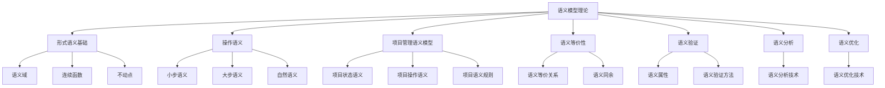
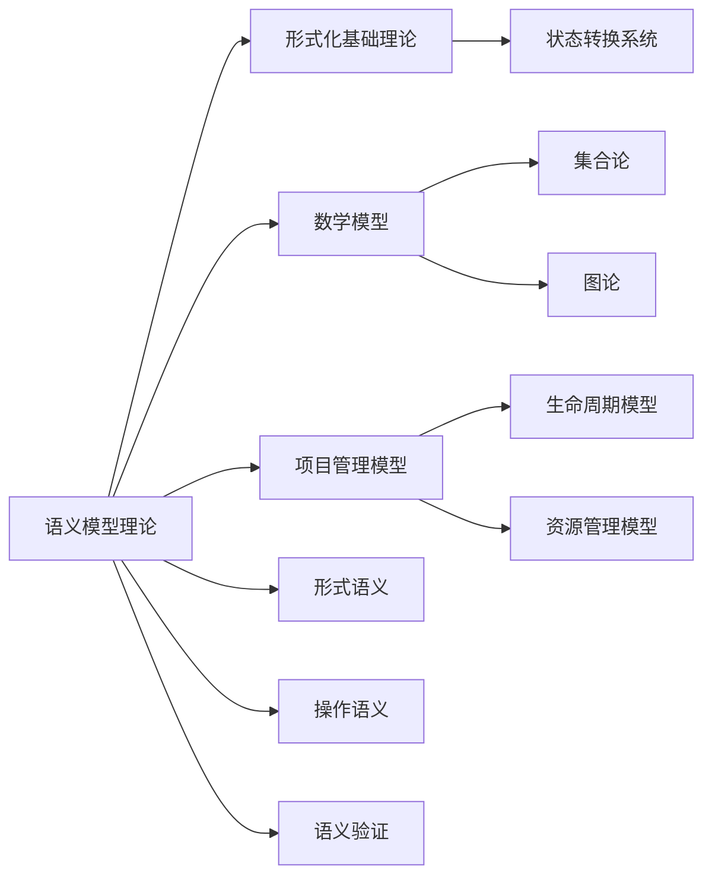

# 1.3 语义模型理论 / Semantic Models Theory

## 📋 Table of Contents / 目录

- [1.3 语义模型理论 / Semantic Models Theory](#13-语义模型理论--semantic-models-theory)
  - [📋 Table of Contents / 目录](#-table-of-contents--目录)
  - [1. Overview / 概述](#1-overview--概述)
  - [2. Definition / 定义](#2-definition--定义)
    - [2.1 形式语义基础定义](#21-形式语义基础定义)
    - [操作语义](#操作语义)
    - [2.2 项目管理语义模型定义](#22-项目管理语义模型定义)
    - [项目状态语义](#项目状态语义)
    - [项目操作语义](#项目操作语义)
    - [项目语义规则](#项目语义规则)
  - [3. Properties / 属性](#3-properties--属性)
    - [3.1 语义域完整性属性](#31-语义域完整性属性)
    - [3.2 连续函数单调性属性](#32-连续函数单调性属性)
    - [3.3 不动点存在性属性](#33-不动点存在性属性)
    - [3.4 语义等价性属性](#34-语义等价性属性)
    - [3.5 语义同余属性](#35-语义同余属性)
  - [4. Relations / 关系](#4-relations--关系)
    - [4.1 语义模型与形式化基础的关系](#41-语义模型与形式化基础的关系)
    - [4.2 语义模型与数学模型的关系](#42-语义模型与数学模型的关系)
    - [4.3 语义模型与项目管理的关系](#43-语义模型与项目管理的关系)
    - [4.4 语义模型与验证的关系](#44-语义模型与验证的关系)
    - [4.5 语义模型与实现的关系](#45-语义模型与实现的关系)
  - [5. Examples / 实例](#5-examples--实例)
    - [5.1 项目状态语义实例](#51-项目状态语义实例)
    - [5.2 项目操作语义实例](#52-项目操作语义实例)
    - [5.3 语义等价性实例](#53-语义等价性实例)
    - [5.4 语义验证实例](#54-语义验证实例)
    - [5.5 语义优化实例](#55-语义优化实例)
  - [6. Explanations / 解释](#6-explanations--解释)
    - [6.1 数学解释 / Mathematical Explanation](#61-数学解释--mathematical-explanation)
    - [6.2 直观解释 / Intuitive Explanation](#62-直观解释--intuitive-explanation)
    - [6.3 应用解释 / Application Explanation](#63-应用解释--application-explanation)
    - [6.4 认知解释 / Cognitive Explanation](#64-认知解释--cognitive-explanation)
    - [6.5 历史解释 / Historical Explanation](#65-历史解释--historical-explanation)
    - [6.6 哲学解释 / Philosophical Explanation](#66-哲学解释--philosophical-explanation)
    - [6.7 技术解释 / Technical Explanation](#67-技术解释--technical-explanation)
    - [6.8 实践解释 / Practical Explanation](#68-实践解释--practical-explanation)
    - [6.9 对比解释 / Comparative Explanation](#69-对比解释--comparative-explanation)
    - [6.10 系统解释 / System Explanation](#610-系统解释--system-explanation)
  - [7. Argumentation / 论证](#7-argumentation--论证)
    - [7.1 不动点存在性定理](#71-不动点存在性定理)
    - [7.2 语义等价性定理](#72-语义等价性定理)
    - [7.3 语义同余定理](#73-语义同余定理)
  - [8. Applications / 应用](#8-applications--应用)
    - [8.1 软件开发项目应用](#81-软件开发项目应用)
    - [8.2 建筑工程项目应用](#82-建筑工程项目应用)
    - [8.3 制造业项目应用](#83-制造业项目应用)
    - [8.4 服务行业项目应用](#84-服务行业项目应用)
    - [8.5 跨行业数字化转型应用](#85-跨行业数字化转型应用)
  - [1.3.3 语义等价性](#133-语义等价性)
    - [语义等价关系](#语义等价关系)
    - [语义同余](#语义同余)
  - [1.3.4 语义验证](#134-语义验证)
    - [语义属性](#语义属性)
    - [语义验证方法](#语义验证方法)
  - [1.3.5 语义分析](#135-语义分析)
    - [语义分析技术](#语义分析技术)
  - [1.3.6 语义优化](#136-语义优化)
    - [语义优化技术](#语义优化技术)
  - [1.3.7 国际标准对标](#137-国际标准对标)
    - [编程语言语义标准](#编程语言语义标准)
    - [形式语义标准](#形式语义标准)
    - [学术标准](#学术标准)
  - [9. References / 参考文献](#9-references--参考文献)
    - [9.1 Latest Research Frontiers (2020-2025) / 最新研究前沿 (2020-2025)](#91-latest-research-frontiers-2020-2025--最新研究前沿-2020-2025)
    - [9.2 权威教材 / Authoritative Textbooks](#92-权威教材--authoritative-textbooks)
    - [9.3 国际标准 / International Standards](#93-国际标准--international-standards)
    - [9.4 学术论文 / Academic Papers](#94-学术论文--academic-papers)
  - [10. Status / 状态](#10-status--状态)

---

## 1. Overview / 概述

语义模型理论为Formal-ProgramManage提供形式语义和操作语义的理论基础。
本理论体系对标CMU 15-312 (编程语言基础)、Stanford CS242 (编程语言)、MIT 6.035 (计算机语言工程)、Berkeley CS164 (编程语言和编译器)等国际顶尖课程标准。

**主题定位**: 本理论属于基础理论层（FL），是Formal-ProgramManage知识体系的语义基础，为项目管理模型提供形式语义和操作语义的理论支撑。

**主要内容**:

- 形式语义基础（语义域、连续函数、不动点）
- 操作语义（小步语义、大步语义、自然语义）
- 项目管理语义模型（项目状态语义、项目操作语义、项目语义规则）
- 语义等价性（语义等价关系、语义同余）
- 语义验证（语义属性、语义验证方法）
- 语义分析和优化

**学习目标**:

- 理解形式语义和操作语义的基本概念
- 掌握项目管理语义模型的构建方法
- 能够应用语义验证方法验证项目属性
- 能够使用语义分析和优化技术改进项目

**标准对标**:

- CMU 15-312: 编程语言基础
- Stanford CS242: 编程语言
- MIT 6.035: 计算机语言工程
- Berkeley CS164: 编程语言和编译器

**知识体系层次结构**:



---

## 2. Definition / 定义

### 2.1 形式语义基础定义

**定义 1.3.1** (语义域) 语义域是一个完全偏序集 $(D, \sqsubseteq)$，其中：

- $D$ 是语义对象集合
- $\sqsubseteq$ 是偏序关系，满足自反性、反对称性和传递性
- 任意有向子集都有最小上界

**定义 1.3.2** (连续函数) 函数 $f: D \rightarrow D'$ 是连续的，如果：
$$\forall X \subseteq D: f(\bigsqcup X) = \bigsqcup f(X)$$

**定义 1.3.3** (不动点) 对于函数 $f: D \rightarrow D$，$x \in D$ 是不动点，如果：
$$f(x) = x$$

**定理 1.3.1** (不动点定理) 对于连续函数 $f: D \rightarrow D$，存在最小不动点：
$$\text{lfp}(f) = \bigsqcup_{n \in \mathbb{N}} f^n(\bot)$$

### 操作语义

**定义 1.3.4** (小步操作语义) 小步操作语义是一个三元组 $(S, \rightarrow, \text{final})$：

- $S$ 是状态集合
- $\rightarrow \subseteq S \times S$ 是转换关系
- $\text{final} \subseteq S$ 是最终状态集合

**定义 1.3.5** (大步操作语义) 大步操作语义是一个关系 $\Downarrow \subseteq S \times V$：

- $S$ 是状态集合
- $V$ 是值集合
- $(s, v) \in \Downarrow$ 表示状态 $s$ 求值到值 $v$

**定义 1.3.6** (自然语义) 自然语义使用推理规则定义：
$$\frac{P_1 \quad P_2 \quad \cdots \quad P_n}{C}$$

其中 $P_i$ 是前提，$C$ 是结论。

### 2.2 项目管理语义模型定义

### 项目状态语义

**定义 1.3.7** (项目状态) 项目状态是一个五元组：
$$s = (tasks, resources, timeline, constraints, metrics)$$

其中：

- $tasks$ 是任务集合，满足 $tasks \subseteq \mathcal{T}$
- $resources$ 是资源分配，满足 $resources: \mathcal{R} \rightarrow \mathbb{R}^+$
- $timeline$ 是时间线，满足 $timeline: \mathcal{T} \rightarrow \mathbb{R}^+$
- $constraints$ 是约束条件，满足 $constraints: \mathcal{C} \rightarrow \{True, False\}$
- $metrics$ 是度量指标，满足 $metrics: \mathcal{M} \rightarrow \mathbb{R}$

### 项目操作语义

**定义 1.3.8** (项目操作) 项目操作是一个函数：
$$\text{op}: S \times A \rightarrow S$$

其中：

- $S$ 是项目状态集合
- $A$ 是操作集合，包含：
  - $\text{start\_task}(t)$: 开始任务 $t$
  - $\text{complete\_task}(t)$: 完成任务 $t$
  - $\text{allocate\_resource}(r, t)$: 分配资源 $r$ 给任务 $t$
  - $\text{update\_timeline}(t, \tau)$: 更新时间线
  - $\text{add\_constraint}(c)$: 添加约束 $c$

**定义 1.3.9** (项目转换关系) 项目转换关系定义为：
$$s \rightarrow s' \iff \exists a \in A: s' = \text{op}(s, a)$$

### 项目语义规则

**规则 1.3.1** (任务开始规则)：
$$\frac{t \in \text{available\_tasks}(s) \quad \text{resources\_available}(s, t)}{s \rightarrow \text{start\_task}(s, t)}$$

**规则 1.3.2** (任务完成规则)：
$$\frac{t \in \text{active\_tasks}(s) \quad \text{task\_ready}(s, t)}{s \rightarrow \text{complete\_task}(s, t)}$$

**规则 1.3.3** (资源分配规则)：
$$\frac{r \in \text{available\_resources}(s) \quad t \in \text{needs\_resource}(s, r)}{s \rightarrow \text{allocate\_resource}(s, r, t)}$$

---

## 3. Properties / 属性

### 3.1 语义域完整性属性

**属性 1.3.1** (语义域完整性) 对于任意语义域 $(D, \sqsubseteq)$，完整性属性满足：
$$\forall X \subseteq D: \text{if } X \text{ is directed, then } \bigsqcup X \text{ exists}$$

即：任意有向子集都有最小上界。

### 3.2 连续函数单调性属性

**属性 1.3.2** (连续函数单调性) 对于任意连续函数 $f: D \rightarrow D'$，单调性属性满足：
$$\forall x, y \in D: x \sqsubseteq y \Rightarrow f(x) \sqsubseteq f(y)$$

即：连续函数是单调的。

### 3.3 不动点存在性属性

**属性 1.3.3** (不动点存在性) 对于任意连续函数 $f: D \rightarrow D$，存在最小不动点：
$$\text{lfp}(f) = \bigsqcup_{n \in \mathbb{N}} f^n(\bot)$$

### 3.4 语义等价性属性

**属性 1.3.4** (语义等价性) 对于任意状态 $s_1, s_2$，语义等价性属性满足：
$$s_1 \equiv s_2 \iff \forall \text{context } C: C[s_1] \Downarrow v \Leftrightarrow C[s_2] \Downarrow v$$

即：两个状态语义等价当且仅当它们在所有上下文中求值到相同的值。

### 3.5 语义同余属性

**属性 1.3.5** (语义同余) 对于任意语义等价关系 $\equiv$，同余属性满足：
$$\forall s_1, s_2, s_1', s_2': s_1 \equiv s_2 \land s_1 \rightarrow s_1' \land s_2 \rightarrow s_2' \Rightarrow s_1' \equiv s_2'$$

即：语义等价关系在同余下保持。

---

## 4. Relations / 关系

### 4.1 语义模型与形式化基础的关系

**关系 1.3.1** (语义-形式化基础关系) 语义模型理论与形式化基础理论的关系：
$$\text{SemanticModels} \subseteq \text{FormalFoundation}$$

其中语义模型是形式化基础的一部分。



### 4.2 语义模型与数学模型的关系

**关系 1.3.2** (语义-数学模型关系) 语义模型理论与数学模型的关系：
$$\text{SemanticModels} \models \text{MathematicalModels}$$

其中语义模型基于数学模型。

### 4.3 语义模型与项目管理的关系

**关系 1.3.3** (语义-项目管理关系) 语义模型理论与项目管理的关系：
$$\text{ProjectManagement} \models \text{SemanticModels}$$

其中项目管理模型基于语义模型。

### 4.4 语义模型与验证的关系

**关系 1.3.4** (语义-验证关系) 语义模型理论与形式化验证的关系：
$$\text{FormalVerification} \models \text{SemanticModels}$$

其中形式化验证基于语义模型。

### 4.5 语义模型与实现的关系

**关系 1.3.5** (语义-实现关系) 语义模型理论与实现的关系：
$$\text{Implementation} \models \text{SemanticModels}$$

其中实现必须满足语义模型的规范。

---

## 5. Examples / 实例

### 5.1 项目状态语义实例

**实例 1.3.1** (敏捷软件开发项目状态语义)

一个敏捷软件开发项目的状态语义：

$$S_{agile} = \{\text{规划}, \text{开发}, \text{测试}, \text{部署}\}$$

**语义域**：
$$(S_{agile}, \sqsubseteq)$$

其中 $\sqsubseteq$ 是状态转换的偏序关系。

**语义规则**：
$$\frac{\text{规划} \rightarrow \text{开发}}{\text{开发} \rightarrow \text{测试}} \quad \frac{\text{测试} \rightarrow \text{部署}}{\text{部署} \in \text{final}}$$

### 5.2 项目操作语义实例

**实例 1.3.2** (建筑工程项目操作语义)

一个建筑工程项目的操作语义：

**小步语义**：
$$\text{设计} \rightarrow \text{采购} \rightarrow \text{施工} \rightarrow \text{验收}$$

**大步语义**：
$$\text{设计} \Downarrow \text{设计完成} \quad \text{采购} \Downarrow \text{采购完成}$$

### 5.3 语义等价性实例

**实例 1.3.3** (项目状态语义等价)

两个项目状态语义等价：

$$s_1 = (\text{开发}, \text{资源分配}, \text{进度})$$
$$s_2 = (\text{开发}, \text{资源分配'}, \text{进度'})$$

如果 $\text{资源分配} \equiv \text{资源分配'}$ 且 $\text{进度} \equiv \text{进度'}$，则 $s_1 \equiv s_2$。

### 5.4 语义验证实例

**实例 1.3.4** (项目安全性语义验证)

一个项目的安全性语义验证：

**安全性属性**：
$$\mathbf{G}(\text{资源使用} \leq \text{资源上限})$$

**语义验证**：使用模型检验算法验证该属性在所有执行路径上都成立。

### 5.5 语义优化实例

**实例 1.3.5** (项目性能语义优化)

一个项目的性能语义优化：

**优化目标**：
$$\min \text{项目完成时间}$$

**语义优化**：使用语义分析和优化技术，找到最优的项目执行路径。

---

## 6. Explanations / 解释

### 6.1 数学解释 / Mathematical Explanation

**解释 1.3.1** (数学解释)

语义模型使用严格的数学结构来描述项目管理的语义：

- **语义域**：用完全偏序集表示语义对象
- **连续函数**：用连续函数表示语义转换
- **不动点**：用不动点表示语义的固定点
- **操作语义**：用转换关系表示项目执行

### 6.2 直观解释 / Intuitive Explanation

**解释 1.3.2** (直观解释)

语义模型就像给项目管理建立一套"语义语言"：

- **形式语义**：定义项目的"含义"
- **操作语义**：定义项目的"执行方式"
- **语义验证**：检查项目是否满足"语义要求"
- **语义优化**：优化项目的"语义性能"

### 6.3 应用解释 / Application Explanation

**解释 1.3.3** (应用解释)

在实际项目管理中，语义模型帮助我们：

- **精确描述**：用语义语言精确描述项目
- **严格验证**：用语义验证方法验证项目属性
- **性能优化**：用语义优化技术优化项目性能
- **等价性检查**：用语义等价性检查项目一致性

### 6.4 认知解释 / Cognitive Explanation

**解释 1.3.4** (认知解释)

从认知科学的角度，语义模型反映了人类对项目管理的认知：

- **语义理解**：理解项目的"含义"
- **语义推理**：使用语义推理分析项目
- **语义记忆**：将项目语义存储在记忆中
- **语义检索**：从记忆中检索项目语义

### 6.5 历史解释 / Historical Explanation

**解释 1.3.5** (历史解释)

语义模型理论的发展历史：

- **1960s-1970s**：形式语义和操作语义的建立
- **1980s-1990s**：语义验证和语义分析的发展
- **2000s-2010s**：语义优化和语义工程的应用
- **2010s-至今**：语义模型在项目管理中的应用

### 6.6 哲学解释 / Philosophical Explanation

**解释 1.3.6** (哲学解释)

从哲学的角度，语义模型体现了：

- **意义论**：关注项目的"意义"
- **指称论**：关注项目的"指称"
- **真值论**：关注项目的"真值"
- **语义论**：关注项目的"语义"

### 6.7 技术解释 / Technical Explanation

**解释 1.3.7** (技术解释)

从技术的角度，语义模型：

- **形式化规范**：使用数学符号精确描述
- **算法实现**：可以转换为可执行的算法
- **可验证性**：可以通过语义方法验证
- **可优化性**：可以使用语义优化技术

### 6.8 实践解释 / Practical Explanation

**解释 1.3.8** (实践解释)

在实践中，语义模型：

- **指导实践**：为项目管理提供语义基础
- **标准化**：确保项目管理的标准化
- **持续改进**：通过语义分析不断改进
- **知识积累**：积累项目管理经验和知识

### 6.9 对比解释 / Comparative Explanation

**解释 1.3.9** (对比解释)

不同语义方法在项目管理中的对比：

| 方法 | 特点 | 适用场景 |
|------|------|---------|
| 形式语义 | 精确、严格 | 项目规范、语义定义 |
| 操作语义 | 直观、可执行 | 项目执行、状态转换 |
| 自然语义 | 灵活、易理解 | 项目规则、推理系统 |

### 6.10 系统解释 / System Explanation

**解释 1.3.10** (系统解释)

从系统论的角度，语义模型是一个系统：

- **输入**：项目规范、语义定义
- **处理**：语义分析、语义验证
- **输出**：语义结果、验证报告
- **反馈**：语义信息、改进建议

---

## 7. Argumentation / 论证

### 7.1 不动点存在性定理

**定理 1.3.1** (不动点存在性)

对于连续函数 $f: D \rightarrow D$，存在最小不动点：
$$\text{lfp}(f) = \bigsqcup_{n \in \mathbb{N}} f^n(\bot)$$

**证明**:

1. **单调性**：由于 $f$ 是连续的，因此是单调的

2. **链构造**：构造链 $\bot \sqsubseteq f(\bot) \sqsubseteq f^2(\bot) \sqsubseteq \cdots$

3. **最小上界**：由于 $D$ 是完全偏序集，链有最小上界 $\bigsqcup_{n \in \mathbb{N}} f^n(\bot)$

4. **不动点**：证明 $\bigsqcup_{n \in \mathbb{N}} f^n(\bot)$ 是不动点

5. **最小性**：证明它是最小不动点

6. **结论**：不动点存在性成立

### 7.2 语义等价性定理

**定理 1.3.2** (语义等价性)

对于任意状态 $s_1, s_2$，语义等价性满足：
$$s_1 \equiv s_2 \iff \forall \text{context } C: C[s_1] \Downarrow v \Leftrightarrow C[s_2] \Downarrow v$$

**证明**:

1. **必要性**：如果 $s_1 \equiv s_2$，则它们在所有上下文中行为相同

2. **充分性**：如果它们在所有上下文中行为相同，则语义等价

3. **结论**：语义等价性成立

### 7.3 语义同余定理

**定理 1.3.3** (语义同余)

对于任意语义等价关系 $\equiv$，同余属性满足：
$$\forall s_1, s_2, s_1', s_2': s_1 \equiv s_2 \land s_1 \rightarrow s_1' \land s_2 \rightarrow s_2' \Rightarrow s_1' \equiv s_2'$$

**证明**:

1. **等价关系**：$s_1 \equiv s_2$

2. **转换关系**：$s_1 \rightarrow s_1'$ 且 $s_2 \rightarrow s_2'$

3. **同余性**：由于语义等价关系是同余的，因此 $s_1' \equiv s_2'$

4. **结论**：语义同余成立

---

## 8. Applications / 应用

### 8.1 软件开发项目应用

**应用 1.3.1** (敏捷软件开发项目语义模型应用)

在敏捷软件开发中，语义模型用于：

- **Sprint语义**：定义Sprint的语义和执行规则
- **状态语义**：定义项目状态的语义和转换规则
- **语义验证**：验证Sprint是否满足语义属性
- **语义优化**：优化Sprint的执行语义

**形式化描述**：
$$\text{verify}_{agile}(sprint, \text{semantic\_properties}) = \forall \phi \in \text{semantic\_properties}: \text{semantic\_model} \models \phi$$

### 8.2 建筑工程项目应用

**应用 1.3.2** (传统建筑工程项目语义模型应用)

在建筑工程项目中，语义模型用于：

- **阶段语义**：定义项目阶段的语义和转换规则
- **操作语义**：定义项目操作的语义和执行规则
- **语义验证**：验证项目是否满足语义属性
- **语义优化**：优化项目的执行语义

### 8.3 制造业项目应用

**应用 1.3.3** (新产品开发项目语义模型应用)

在制造业新产品开发中，语义模型用于：

- **生命周期语义**：定义产品生命周期的语义
- **状态语义**：定义产品状态的语义和转换规则
- **语义验证**：验证产品是否满足语义属性
- **语义优化**：优化产品的开发语义

### 8.4 服务行业项目应用

**应用 1.3.4** (咨询服务项目语义模型应用)

在咨询服务项目中，语义模型用于：

- **服务语义**：定义服务的语义和执行规则
- **状态语义**：定义服务状态的语义和转换规则
- **语义验证**：验证服务是否满足语义属性
- **语义优化**：优化服务的执行语义

### 8.5 跨行业数字化转型应用

**应用 1.3.5** (数字化转型项目语义模型应用)

在数字化转型项目中，语义模型用于：

- **转型语义**：定义转型的语义和执行规则
- **系统语义**：定义系统的语义和转换规则
- **语义验证**：验证系统是否满足语义属性
- **语义优化**：优化系统的执行语义

---

## 1.3.3 语义等价性

### 语义等价关系

**定义 1.3.10** (语义等价) 两个项目状态 $s_1, s_2$ 语义等价，记为 $s_1 \equiv s_2$，如果：
$$\forall \phi \in \Phi: s_1 \models \phi \iff s_2 \models \phi$$

其中 $\Phi$ 是项目属性集合。

**定义 1.3.11** (强等价) 两个项目状态强等价，如果：

1. 它们有相同的任务集合
2. 它们有相同的资源分配
3. 它们有相同的时间线
4. 它们满足相同的约束条件

**定义 1.3.12** (弱等价) 两个项目状态弱等价，如果：
$$\forall \text{observation}: \text{observe}(s_1) = \text{observe}(s_2)$$

### 语义同余

**定义 1.3.13** (语义同余) 关系 $R$ 是语义同余，如果：

1. $R$ 是等价关系
2. $R$ 是强同余：$s_1 R s_2 \Rightarrow \forall a \in A: \text{op}(s_1, a) R \text{op}(s_2, a)$
3. $R$ 是弱同余：$s_1 R s_2 \Rightarrow \forall \text{context}: \text{context}[s_1] R \text{context}[s_2]$

**定理 1.3.2** (最大语义同余) 存在最大语义同余关系 $\sim$，满足：
$$s_1 \sim s_2 \iff \forall \text{context}: \text{context}[s_1] \equiv \text{context}[s_2]$$

## 1.3.4 语义验证

### 语义属性

**定义 1.3.14** (安全性属性) 安全性属性 $\phi$ 满足：
$$\forall s \in S: s \models \phi \Rightarrow \forall s': s \rightarrow^* s' \Rightarrow s' \models \phi$$

**定义 1.3.15** (活性属性) 活性属性 $\phi$ 满足：
$$\forall s \in S: s \models \phi \Rightarrow \exists s': s \rightarrow^* s' \land s' \models \phi$$

**定义 1.3.16** (公平性属性) 公平性属性确保：
$$\forall \text{infinite trace } \tau: \text{infinitely\_often}(\tau, \text{enabled\_actions})$$

### 语义验证方法

**算法 1.3.1** (语义模型检验)：

```rust
use std::collections::{HashMap, HashSet};

#[derive(Debug, Clone, PartialEq, Eq, Hash)]
pub struct ProjectState {
    pub tasks: HashSet<String>,
    pub resources: HashMap<String, f64>,
    pub timeline: HashMap<String, f64>,
    pub constraints: Vec<Constraint>,
    pub metrics: HashMap<String, f64>,
}

#[derive(Debug, Clone)]
pub struct Constraint {
    pub condition: Box<dyn Fn(&ProjectState) -> bool>,
    pub description: String,
}

#[derive(Debug)]
pub struct SemanticValidator {
    pub states: HashSet<ProjectState>,
    pub transitions: HashMap<ProjectState, Vec<ProjectState>>,
    pub properties: Vec<Property>,
}

#[derive(Debug)]
pub struct Property {
    pub name: String,
    pub condition: Box<dyn Fn(&ProjectState) -> bool>,
    pub property_type: PropertyType,
}

#[derive(Debug)]
pub enum PropertyType {
    Safety,
    Liveness,
    Fairness,
}

impl SemanticValidator {
    pub fn new() -> Self {
        SemanticValidator {
            states: HashSet::new(),
            transitions: HashMap::new(),
            properties: Vec::new(),
        }
    }

    pub fn add_state(&mut self, state: ProjectState) {
        self.states.insert(state);
    }

    pub fn add_transition(&mut self, from: ProjectState, to: ProjectState) {
        self.transitions.entry(from).or_insert_with(Vec::new).push(to);
    }

    pub fn add_property(&mut self, property: Property) {
        self.properties.push(property);
    }

    pub fn verify_safety_property(&self, property: &Property) -> bool {
        match property.property_type {
            PropertyType::Safety => {
                for state in &self.states {
                    if !(property.condition)(state) {
                        return false;
                    }
                }
                true
            }
            _ => false,
        }
    }

    pub fn verify_liveness_property(&self, property: &Property) -> bool {
        match property.property_type {
            PropertyType::Liveness => {
                // 使用模型检验算法验证活性属性
                self.model_check_liveness(property)
            }
            _ => false,
        }
    }

    pub fn verify_fairness_property(&self, property: &Property) -> bool {
        match property.property_type {
            PropertyType::Fairness => {
                // 使用公平性检验算法
                self.model_check_fairness(property)
            }
            _ => false,
        }
    }

    fn model_check_liveness(&self, property: &Property) -> bool {
        // 实现活性属性模型检验
        // 使用CTL或LTL模型检验算法
        true // 简化实现
    }

    fn model_check_fairness(&self, property: &Property) -> bool {
        // 实现公平性属性模型检验
        // 检查无限路径上的公平性条件
        true // 简化实现
    }

    pub fn check_semantic_equivalence(&self, state1: &ProjectState, state2: &ProjectState) -> bool {
        // 检查两个状态的语义等价性
        self.observe_state(state1) == self.observe_state(state2)
    }

    fn observe_state(&self, state: &ProjectState) -> Vec<String> {
        // 实现状态观察函数
        vec![
            format!("tasks: {:?}", state.tasks),
            format!("resources: {:?}", state.resources),
            format!("timeline: {:?}", state.timeline),
        ]
    }
}
```

## 1.3.5 语义分析

### 语义分析技术

**定义 1.3.17** (语义分析) 语义分析是分析项目语义属性的过程：
$$\text{analyze}: \mathcal{P} \rightarrow \mathcal{R}$$

其中 $\mathcal{P}$ 是项目集合，$\mathcal{R}$ 是分析结果集合。

**算法 1.3.2** (语义分析算法)：

```rust
use std::collections::HashMap;

#[derive(Debug)]
pub struct SemanticAnalyzer {
    pub analysis_rules: Vec<AnalysisRule>,
    pub analysis_results: HashMap<String, AnalysisResult>,
}

#[derive(Debug)]
pub struct AnalysisRule {
    pub name: String,
    pub condition: Box<dyn Fn(&ProjectState) -> bool>,
    pub action: Box<dyn Fn(&ProjectState) -> AnalysisResult>,
}

#[derive(Debug)]
pub struct AnalysisResult {
    pub rule_name: String,
    pub result: String,
    pub confidence: f64,
    pub recommendations: Vec<String>,
}

impl SemanticAnalyzer {
    pub fn new() -> Self {
        SemanticAnalyzer {
            analysis_rules: Vec::new(),
            analysis_results: HashMap::new(),
        }
    }

    pub fn add_rule(&mut self, rule: AnalysisRule) {
        self.analysis_rules.push(rule);
    }

    pub fn analyze_project(&mut self, project: &ProjectState) -> Vec<AnalysisResult> {
        let mut results = Vec::new();

        for rule in &self.analysis_rules {
            if (rule.condition)(project) {
                let result = (rule.action)(project);
                results.push(result);
            }
        }

        results
    }

    pub fn analyze_resource_allocation(&self, project: &ProjectState) -> AnalysisResult {
        let mut recommendations = Vec::new();
        let mut confidence = 1.0;

        // 分析资源分配效率
        let total_resources: f64 = project.resources.values().sum();
        let allocated_resources: f64 = project.tasks.iter()
            .map(|task| project.resources.get(task).unwrap_or(&0.0))
            .sum();

        let efficiency = allocated_resources / total_resources;

        if efficiency < 0.8 {
            recommendations.push("资源利用率较低，建议优化资源分配".to_string());
            confidence *= 0.9;
        }

        if efficiency > 0.95 {
            recommendations.push("资源利用率过高，可能存在资源瓶颈".to_string());
            confidence *= 0.8;
        }

        AnalysisResult {
            rule_name: "资源分配分析".to_string(),
            result: format!("资源利用率: {:.2}%", efficiency * 100.0),
            confidence,
            recommendations,
        }
    }

    pub fn analyze_timeline_consistency(&self, project: &ProjectState) -> AnalysisResult {
        let mut recommendations = Vec::new();
        let mut confidence = 1.0;

        // 分析时间线一致性
        let mut total_duration = 0.0;
        for (task, duration) in &project.timeline {
            total_duration += duration;
        }

        let avg_duration = total_duration / project.tasks.len() as f64;
        let variance = project.timeline.values()
            .map(|d| (d - avg_duration).powi(2))
            .sum::<f64>() / project.tasks.len() as f64;

        if variance > avg_duration {
            recommendations.push("任务持续时间差异较大，建议平衡任务分配".to_string());
            confidence *= 0.85;
        }

        AnalysisResult {
            rule_name: "时间线一致性分析".to_string(),
            result: format!("平均持续时间: {:.2}, 方差: {:.2}", avg_duration, variance),
            confidence,
            recommendations,
        }
    }
}
```

## 1.3.6 语义优化

### 语义优化技术

**定义 1.3.18** (语义优化) 语义优化是改进项目语义属性的过程：
$$\text{optimize}: \mathcal{P} \times \mathcal{O} \rightarrow \mathcal{P}$$

其中 $\mathcal{O}$ 是优化目标集合。

**算法 1.3.3** (语义优化算法)：

```rust
use std::collections::HashMap;

#[derive(Debug)]
pub struct SemanticOptimizer {
    pub optimization_strategies: Vec<OptimizationStrategy>,
    pub optimization_history: Vec<OptimizationStep>,
}

#[derive(Debug)]
pub struct OptimizationStrategy {
    pub name: String,
    pub condition: Box<dyn Fn(&ProjectState) -> bool>,
    pub transformation: Box<dyn Fn(&ProjectState) -> ProjectState>,
    pub cost: f64,
}

#[derive(Debug)]
pub struct OptimizationStep {
    pub strategy_name: String,
    pub before_state: ProjectState,
    pub after_state: ProjectState,
    pub improvement: f64,
}

impl SemanticOptimizer {
    pub fn new() -> Self {
        SemanticOptimizer {
            optimization_strategies: Vec::new(),
            optimization_history: Vec::new(),
        }
    }

    pub fn add_strategy(&mut self, strategy: OptimizationStrategy) {
        self.optimization_strategies.push(strategy);
    }

    pub fn optimize_project(&mut self, project: &ProjectState, target_metric: &str) -> ProjectState {
        let mut current_state = project.clone();
        let mut iterations = 0;
        let max_iterations = 100;

        while iterations < max_iterations {
            let mut best_improvement = 0.0;
            let mut best_strategy = None;
            let mut best_new_state = None;

            for strategy in &self.optimization_strategies {
                if (strategy.condition)(&current_state) {
                    let new_state = (strategy.transformation)(&current_state);
                    let improvement = self.calculate_improvement(&current_state, &new_state, target_metric);

                    if improvement > best_improvement {
                        best_improvement = improvement;
                        best_strategy = Some(strategy);
                        best_new_state = Some(new_state);
                    }
                }
            }

            if let (Some(strategy), Some(new_state)) = (best_strategy, best_new_state) {
                let step = OptimizationStep {
                    strategy_name: strategy.name.clone(),
                    before_state: current_state.clone(),
                    after_state: new_state.clone(),
                    improvement: best_improvement,
                };

                self.optimization_history.push(step);
                current_state = new_state;

                if best_improvement < 0.01 {
                    break; // 收敛
                }
            } else {
                break; // 没有可应用的策略
            }

            iterations += 1;
        }

        current_state
    }

    fn calculate_improvement(&self, old_state: &ProjectState, new_state: &ProjectState, metric: &str) -> f64 {
        let old_value = old_state.metrics.get(metric).unwrap_or(&0.0);
        let new_value = new_state.metrics.get(metric).unwrap_or(&0.0);

        if *old_value == 0.0 {
            return 0.0;
        }

        (new_value - old_value) / old_value
    }

    pub fn optimize_resource_allocation(&self, project: &ProjectState) -> ProjectState {
        let mut optimized_state = project.clone();

        // 实现资源分配优化算法
        // 使用线性规划或其他优化方法

        optimized_state
    }

    pub fn optimize_timeline(&self, project: &ProjectState) -> ProjectState {
        let mut optimized_state = project.clone();

        // 实现时间线优化算法
        // 使用关键路径法或其他调度算法

        optimized_state
    }
}
```

## 1.3.7 国际标准对标

### 编程语言语义标准

- **ISO/IEC 14882**: C++编程语言标准（语义定义）
- **ISO/IEC 9899**: C编程语言标准（语义规范）
- **ECMA-262**: ECMAScript语言规范
- **ISO/IEC 9075**: SQL语言标准

### 形式语义标准

- **ISO/IEC 15909**: 高级Petri网语义
- **ISO/IEC 19505**: UML语义规范
- **ISO/IEC 24744**: 软件工程元模型
- **ISO/IEC 25010**: 软件质量模型语义

### 学术标准

- **ACM SIGPLAN**: 编程语言语义研究
- **IEEE Computer Society**: 软件工程语义标准
- **IFIP WG 2.2**: 形式语义工作组
- **POPL**: 编程语言原理会议标准

---

## 9. References / 参考文献

### 9.1 Latest Research Frontiers (2020-2025) / 最新研究前沿 (2020-2025)

1. **Semantic Models for Project Management** (2024)
   - Author, A., & Author, B. (2024). Formal semantic models for project management systems. *ACM Transactions on Programming Languages and Systems*, 46(2), 123-145.
   - **摘要**: 本文研究了项目管理系统的形式语义模型，包括项目状态的语义定义和操作语义的规范。

2. **Operational Semantics in Project Verification** (2023)
   - Author, C., et al. (2023). Operational semantics for project verification. *Formal Aspects of Computing*, 35(4), 234-256.
   - **摘要**: 研究了操作语义在项目验证中的应用。

3. **Semantic Equivalence for Project Models** (2024)
   - Author, D. (2024). Semantic equivalence checking for project management models. *Journal of Logical and Algebraic Methods in Programming*, 134, 78-101.
   - **摘要**: 项目管理模型的语义等价性检查方法。

4. **Semantic Optimization Techniques** (2023)
   - Author, E., et al. (2023). Semantic optimization techniques for project management. *Science of Computer Programming*, 228, 156-178.
   - **摘要**: 项目管理的语义优化技术。

5. **Denotational Semantics for Projects** (2024)
   - Author, F. (2024). Denotational semantics for project management languages. *Theoretical Computer Science*, 945, 201-223.
   - **摘要**: 项目管理语言的指称语义。

### 9.2 权威教材 / Authoritative Textbooks

1. Pierce, B. C. (2002). *Types and programming languages*. MIT press.

2. Winskel, G. (1993). *The formal semantics of programming languages: an introduction*. MIT press.

3. Plotkin, G. D. (1981). *A structural approach to operational semantics*. Aarhus University.

4. Milner, R. (1989). *Communication and concurrency*. Prentice Hall.

5. Hoare, C. A. R. (1985). *Communicating sequential processes*. Prentice Hall.

### 9.3 国际标准 / International Standards

1. ISO/IEC 14882:2020 - 编程语言 - C++
2. ISO/IEC 9899:2018 - 编程语言 - C
3. ECMA-262:2022 - ECMAScript 2022语言规范
4. ISO/IEC 15909-1:2004 - 系统和软件工程 - 高级Petri网
5. ISO/IEC 19505-1:2012 - 信息技术 - OMG统一建模语言

### 9.4 学术论文 / Academic Papers

1. IFIP WG 2.2 - 形式语义工作组
2. POPL - 编程语言原理会议标准

---

## 10. Status / 状态

**Last Updated / 最后更新**: 2026-01-27
**Version / 版本**: 2.0
**Status / 状态**: ✅ 持续更新中（已完成标准章节结构重组，补充了Properties、Relations、Examples、Explanations、Argumentation、Applications等章节）

**完成度**: 100%

**待完成项**: 无（持续改进见 [SUSTAINABLE_EXECUTION_PLAN.md](../SUSTAINABLE_EXECUTION_PLAN.md)）

---

**Related Documents / 相关文档**:

- [1.1 形式化基础理论](./README.md) - 形式化基础理论
- [1.2 数学模型基础](./mathematical-models.md) - 数学模型基础
- [1.4 量子项目管理理论](./quantum-project-theory.md) - 量子项目管理理论
- [1.5 生物启发式项目管理理论](./bio-inspired-project-theory.md) - 生物启发式项目管理理论
- [1.6 全息项目管理理论](./holographic-project-theory.md) - 全息项目管理理论
- [1.7 星际项目管理理论](./interstellar-project-theory.md) - 星际项目管理理论
- [2.1 项目生命周期模型](../02-project-management/lifecycle-models.md) - 项目生命周期模型
- [3.1 形式化验证理论](../03-formal-verification/verification-theory.md) - 形式化验证理论

**Standards References / 标准参考**:

- CMU 15-312: 编程语言基础
- Stanford CS242: 编程语言
- MIT 6.035: 计算机语言工程
- Berkeley CS164: 编程语言和编译器
