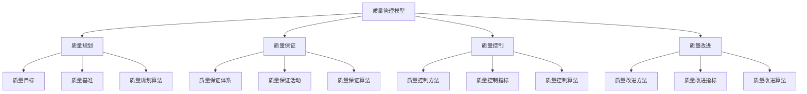
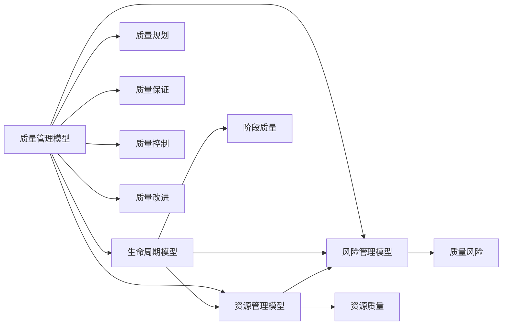

# 2.4 质量管理模型 / Quality Management Model

## 📋 Table of Contents / 目录

- [2.4 质量管理模型 / Quality Management Model](#24-质量管理模型--quality-management-model)
  - [📋 Table of Contents / 目录](#-table-of-contents--目录)
  - [1. Overview / 概述](#1-overview--概述)
  - [2. Definition / 定义](#2-definition--定义)
    - [2.1 质量管理基础定义](#21-质量管理基础定义)
  - [3. Properties / 属性](#3-properties--属性)
    - [3.1 质量完整性属性](#31-质量完整性属性)
    - [3.2 质量函数归一化属性](#32-质量函数归一化属性)
    - [3.3 质量约束属性](#33-质量约束属性)
    - [3.4 质量单调性属性](#34-质量单调性属性)
    - [3.5 质量可达性属性](#35-质量可达性属性)
  - [4. Relations / 关系](#4-relations--关系)
    - [4.1 质量管理与生命周期管理的关系](#41-质量管理与生命周期管理的关系)
    - [4.2 质量管理与资源管理的关系](#42-质量管理与资源管理的关系)
    - [4.3 质量管理与风险管理的关系](#43-质量管理与风险管理的关系)
    - [4.4 质量管理与基础理论的关系](#44-质量管理与基础理论的关系)
    - [4.5 质量管理与统计理论的关系](#45-质量管理与统计理论的关系)
  - [5. Examples / 实例](#5-examples--实例)
    - [5.1 软件开发项目质量管理实例](#51-软件开发项目质量管理实例)
    - [5.2 建筑工程项目质量管理实例](#52-建筑工程项目质量管理实例)
    - [5.3 制造业项目质量管理实例](#53-制造业项目质量管理实例)
    - [5.4 服务行业项目质量管理实例](#54-服务行业项目质量管理实例)
    - [5.5 跨行业数字化转型项目质量管理实例](#55-跨行业数字化转型项目质量管理实例)
  - [6. Explanations / 解释](#6-explanations--解释)
    - [6.1 数学解释 / Mathematical Explanation](#61-数学解释--mathematical-explanation)
    - [6.2 直观解释 / Intuitive Explanation](#62-直观解释--intuitive-explanation)
    - [6.3 应用解释 / Application Explanation](#63-应用解释--application-explanation)
    - [6.4 认知解释 / Cognitive Explanation](#64-认知解释--cognitive-explanation)
    - [6.5 历史解释 / Historical Explanation](#65-历史解释--historical-explanation)
    - [6.6 哲学解释 / Philosophical Explanation](#66-哲学解释--philosophical-explanation)
    - [6.7 技术解释 / Technical Explanation](#67-技术解释--technical-explanation)
    - [6.8 实践解释 / Practical Explanation](#68-实践解释--practical-explanation)
    - [6.9 对比解释 / Comparative Explanation](#69-对比解释--comparative-explanation)
    - [6.10 系统解释 / System Explanation](#610-系统解释--system-explanation)
  - [7. Argumentation / 论证](#7-argumentation--论证)
    - [7.1 质量函数归一化定理](#71-质量函数归一化定理)
    - [7.2 质量单调性定理](#72-质量单调性定理)
    - [7.3 质量约束可行性定理](#73-质量约束可行性定理)
  - [8. Applications / 应用](#8-applications--应用)
    - [8.1 软件开发项目应用](#81-软件开发项目应用)
    - [8.2 建筑工程项目应用](#82-建筑工程项目应用)
    - [8.3 制造业项目应用](#83-制造业项目应用)
    - [8.4 服务行业项目应用](#84-服务行业项目应用)
    - [8.5 跨行业数字化转型应用](#85-跨行业数字化转型应用)
  - [2.4.2 质量规划模型](#242-质量规划模型)
    - [质量目标设定](#质量目标设定)
    - [质量规划算法](#质量规划算法)
  - [2.4.3 质量保证模型](#243-质量保证模型)
    - [质量保证体系](#质量保证体系)
    - [质量保证算法](#质量保证算法)
  - [2.4.4 质量控制模型](#244-质量控制模型)
    - [质量控制体系](#质量控制体系)
    - [质量控制算法](#质量控制算法)
  - [2.4.5 质量改进模型](#245-质量改进模型)
    - [质量改进体系](#质量改进体系)
    - [质量改进算法](#质量改进算法)
  - [2.4.6 国际标准对标](#246-国际标准对标)
    - [ISO/IEC 25010 标准](#isoiec-25010-标准)
    - [ISO 9001 标准](#iso-9001-标准)
    - [CMMI-DEV 标准](#cmmi-dev-标准)
  - [9. References / 参考文献](#9-references--参考文献)
    - [9.1 Latest Research Frontiers (2020-2025) / 最新研究前沿 (2020-2025)](#91-latest-research-frontiers-2020-2025--最新研究前沿-2020-2025)
    - [9.2 权威教材 / Authoritative Textbooks](#92-权威教材--authoritative-textbooks)
    - [9.3 国际标准 / International Standards](#93-国际标准--international-standards)
    - [9.4 学术论文 / Academic Papers](#94-学术论文--academic-papers)
  - [10. Status / 状态](#10-status--状态)

---

## 1. Overview / 概述

质量管理模型是Formal-ProgramManage的核心理论之一，定义了项目质量的规划、保证、控制和改进机制。本理论体系严格对标ISO/IEC 25010、ISO 9001、CMMI-DEV等国际质量管理标准。

**主题定位**: 本模型属于核心模型层（CML），是项目管理的核心模型之一，与生命周期模型、资源管理模型、风险管理模型共同构成项目管理核心体系。

**主要内容**:

- 质量管理基础理论
- 质量规划模型（质量目标、质量基准、质量规划算法）
- 质量保证模型（质量保证体系、质量保证算法）
- 质量控制模型（质量控制方法、质量控制算法）
- 质量改进模型（质量改进方法、质量改进算法）

**学习目标**:

- 理解项目质量的基本概念和形式化定义
- 掌握质量规划、保证、控制和改进的方法
- 能够应用形式化方法验证质量管理模型
- 能够制定有效的质量管理策略

**标准对标**:

- PMBOK 7th Edition: 质量管理知识领域和质量管理过程
- ISO/IEC 25010:2011: 软件质量模型
- ISO 9001:2015: 质量管理体系
- CMMI-DEV: 质量管理过程域

**五类链接 (Five-Type Links)**
**前置知识 (Prerequisites)**：[1.1 形式化基础](../01-foundations/README.md)、[1.2 数学模型](../01-foundations/mathematical-models.md)。详见 [01-learning-prerequisites.md](../12-learning-support/01-learning-prerequisites.md)。
**应用 (Application)**：[4.1 软件开发](../04-industry-applications/software-development/)、[4.2 工程管理](../04-industry-applications/engineering-management/)。
**相关 (Related)**：[2.1 生命周期](lifecycle-models.md)、[2.2 资源](resource-models.md)、[2.3 风险](risk-models.md)。
**深化 (Deep Dive)**：Level 1 质量规划/保证/控制 → Level 2 质量函数与度量（§2.4）→ Level 3 与 Governance/Scope/Resources 的 PMBOK 8 对应（见 PMBOK 8th 对标）。
**对比 (Comparison)**：[PMBOK 8th 对标](../PMBOK_8_ALIGNMENT_PLAN.md)、[STANDARDS_ALIGNMENT](../STANDARDS_ALIGNMENT.md)、[LEARNING_PATHS](../LEARNING_PATHS.md)。

**知识体系层次结构**:



**阅读提示 / Reading Guide**（降低认知负荷）：**本节要点**：(1) 质量六元组（功能、效率、可维护性等，ISO 25010）；(2) 质量规划/保证/控制（QA/QC）；(3) 质量成本 COQ；(4) PMBOK 8 中质量并入 Governance/Scope/Resources。**阅读时间**：约 40–50 分钟；**难度**：中–高。应用优先可先读 §6 直观/应用解释。

---

## 2. Definition / 定义

### 2.1 质量管理基础定义

**定义 2.4.1** (项目质量 - ISO/IEC 25010) 项目质量是一个六元组：
$$\mathcal{Q} = (F, E, M, P, S, U)$$

其中：

- $F$ 是功能性质量属性，满足 $F: \mathcal{F} \rightarrow [0,1]$
- $E$ 是效率性质量属性，满足 $E: \mathcal{E} \rightarrow [0,1]$
- $M$ 是维护性质量属性，满足 $M: \mathcal{M} \rightarrow [0,1]$
- $P$ 是可移植性质量属性，满足 $P: \mathcal{P} \rightarrow [0,1]$
- $S$ 是安全性质量属性，满足 $S: \mathcal{S} \rightarrow [0,1]$
- $U$ 是可用性质量属性，满足 $U: \mathcal{U} \rightarrow [0,1]$

**定义 2.4.2** (质量函数) 质量函数是一个映射：
$$\text{Quality}: \mathcal{Q} \rightarrow [0,1]$$

定义为：
$$\text{Quality}(q) = \alpha \cdot F + \beta \cdot E + \gamma \cdot M + \delta \cdot P + \epsilon \cdot S + \zeta \cdot U$$

其中 $\alpha + \beta + \gamma + \delta + \epsilon + \zeta = 1$ 是权重系数。

**定义 2.4.3** (质量约束) 质量约束是一个三元组：
$$C = (Q, L, U)$$

其中：

- $Q$ 是质量属性
- $L$ 是下界约束，满足 $L \in [0,1]$
- $U$ 是上界约束，满足 $U \in [0,1]$ 且 $U \geq L$

---

## 3. Properties / 属性

### 3.1 质量完整性属性

**属性 2.4.1** (质量完整性) 对于任意项目质量 $\mathcal{Q} = (F, E, M, P, S, U)$，完整性属性满足：
$$\forall q \in \{F, E, M, P, S, U\}: q \in [0,1]$$

即：所有质量属性都在0到1之间。

### 3.2 质量函数归一化属性

**属性 2.4.2** (质量函数归一化) 对于任意质量函数，权重系数满足：
$$\alpha + \beta + \gamma + \delta + \epsilon + \zeta = 1$$

即：所有权重系数之和为1。

### 3.3 质量约束属性

**属性 2.4.3** (质量约束) 对于任意质量约束 $C = (Q, L, U)$，约束属性满足：
$$L \leq Q \leq U$$

即：质量属性值在上下界约束范围内。

### 3.4 质量单调性属性

**属性 2.4.4** (质量单调性) 对于任意质量属性 $q_1, q_2$，如果 $q_1 \geq q_2$，则：
$$\text{Quality}(q_1) \geq \text{Quality}(q_2)$$

即：质量函数是单调递增的。

### 3.5 质量可达性属性

**属性 2.4.5** (质量可达性) 对于任意质量目标 $g$，如果质量规划算法能够达到该目标，则存在路径从初始质量状态到达包含该目标的状态。

---

## 4. Relations / 关系

### 4.1 质量管理与生命周期管理的关系

**关系 2.4.1** (质量-生命周期关系) 质量管理模型与生命周期模型的关系：
$$\forall p \in P: \text{quality}(p) \in \mathcal{Q}$$

其中 $P$ 是生命周期模型中的阶段集合，$\mathcal{Q}$ 是质量管理模型中的质量集合。



### 4.2 质量管理与资源管理的关系

**关系 2.4.2** (质量-资源关系) 质量管理模型与资源管理模型的关系：
$$\forall r \in \mathcal{R}_{resource}: \text{quality}(r) \in \mathcal{Q}$$

其中 $\mathcal{R}_{resource}$ 是资源管理模型中的资源集合。

### 4.3 质量管理与风险管理的关系

**关系 2.4.3** (质量-风险关系) 质量管理模型与风险管理模型的关系：
$$\forall q \in \mathcal{Q}: \text{risks}(q) \subseteq \mathcal{R}_{risk}$$

其中 $\mathcal{R}_{risk}$ 是风险管理模型中的风险集合。

### 4.4 质量管理与基础理论的关系

**关系 2.4.4** (质量-基础理论关系) 质量管理模型基于形式化基础理论：
$$\mathcal{Q} \in \mathcal{F}_{formal}$$

其中 $\mathcal{F}_{formal}$ 是形式化基础理论中的模型集合。

### 4.5 质量管理与统计理论的关系

**关系 2.4.5** (质量-统计理论关系) 质量管理模型使用统计理论进行质量分析：
$$\text{analyze}(\mathcal{Q}) \in \mathcal{S}_{statistical}$$

其中 $\mathcal{S}_{statistical}$ 是统计分析结果集合。

---

## 5. Examples / 实例

### 5.1 软件开发项目质量管理实例

**实例 2.4.1** (敏捷软件开发项目质量管理)

一个敏捷软件开发项目的质量管理：

$$\mathcal{Q}_{agile} = (F_{agile}, E_{agile}, M_{agile}, P_{agile}, S_{agile}, U_{agile})$$

其中：

- $F_{agile}$: 功能性质量（需求满足度、功能完整性）
- $E_{agile}$: 效率性质量（性能、响应时间）
- $M_{agile}$: 维护性质量（代码质量、可维护性）
- $P_{agile}$: 可移植性质量（跨平台兼容性）
- $S_{agile}$: 安全性质量（数据安全、访问控制）
- $U_{agile}$: 可用性质量（用户体验、易用性）

**质量规划**:

- Sprint规划阶段：设定Sprint质量目标
- Sprint执行阶段：执行质量保证活动
- Sprint评审阶段：评估质量达成情况

### 5.2 建筑工程项目质量管理实例

**实例 2.4.2** (传统建筑工程项目质量管理)

一个传统建筑工程项目的质量管理：

$$\mathcal{Q}_{construction} = (F_{construction}, E_{construction}, M_{construction}, P_{construction}, S_{construction}, U_{construction})$$

其中：

- $F_{construction}$: 功能性质量（设计符合度、功能完整性）
- $E_{construction}$: 效率性质量（施工效率、资源利用率）
- $M_{construction}$: 维护性质量（结构耐久性、维护便利性）
- $P_{construction}$: 可移植性质量（材料适应性）
- $S_{construction}$: 安全性质量（结构安全、施工安全）
- $U_{construction}$: 可用性质量（使用便利性、舒适性）

### 5.3 制造业项目质量管理实例

**实例 2.4.3** (新产品开发项目质量管理)

一个制造业新产品开发项目的质量管理：

$$\mathcal{Q}_{manufacturing} = (F_{manufacturing}, E_{manufacturing}, M_{manufacturing}, P_{manufacturing}, S_{manufacturing}, U_{manufacturing})$$

其中：

- $F_{manufacturing}$: 功能性质量（产品功能、性能指标）
- $E_{manufacturing}$: 效率性质量（生产效率、成本效率）
- $M_{manufacturing}$: 维护性质量（产品可靠性、维护便利性）
- $P_{manufacturing}$: 可移植性质量（产品适应性）
- $S_{manufacturing}$: 安全性质量（产品安全、生产安全）
- $U_{manufacturing}$: 可用性质量（用户体验、易用性）

### 5.4 服务行业项目质量管理实例

**实例 2.4.4** (咨询服务项目质量管理)

一个咨询服务项目的质量管理：

$$\mathcal{Q}_{consulting} = (F_{consulting}, E_{consulting}, M_{consulting}, P_{consulting}, S_{consulting}, U_{consulting})$$

其中：

- $F_{consulting}$: 功能性质量（服务内容、专业水平）
- $E_{consulting}$: 效率性质量（服务效率、响应速度）
- $M_{consulting}$: 维护性质量（服务持续性、改进能力）
- $P_{consulting}$: 可移植性质量（服务适应性）
- $S_{consulting}$: 安全性质量（信息安全、保密性）
- $U_{consulting}$: 可用性质量（客户满意度、易用性）

### 5.5 跨行业数字化转型项目质量管理实例

**实例 2.4.5** (数字化转型项目质量管理)

一个数字化转型项目的质量管理：

$$\mathcal{Q}_{digital} = (F_{digital}, E_{digital}, M_{digital}, P_{digital}, S_{digital}, U_{digital})$$

其中：

- $F_{digital}$: 功能性质量（系统功能、业务支持）
- $E_{digital}$: 效率性质量（系统性能、处理速度）
- $M_{digital}$: 维护性质量（系统可维护性、可扩展性）
- $P_{digital}$: 可移植性质量（系统兼容性、迁移能力）
- $S_{digital}$: 安全性质量（数据安全、系统安全）
- $U_{digital}$: 可用性质量（用户体验、易用性）

---

## 6. Explanations / 解释

### 6.1 数学解释 / Mathematical Explanation

**解释 2.4.1** (数学解释)

质量管理可以建模为多目标优化问题，其中：

- **质量属性**：多个质量维度（功能性、效率性、维护性等）
- **质量函数**：加权组合多个质量属性
- **质量约束**：质量属性的上下界约束
- **质量目标**：期望达到的质量水平

这种数学建模使得我们可以使用优化理论、统计理论来解决质量管理问题。

### 6.2 直观解释 / Intuitive Explanation

**解释 2.4.2** (直观解释)

质量管理就像制作一个完美的蛋糕，需要：

- **质量规划**：确定蛋糕的标准和配方
- **质量保证**：确保制作过程符合标准
- **质量控制**：检查蛋糕是否符合要求
- **质量改进**：根据反馈不断改进配方和工艺

### 6.3 应用解释 / Application Explanation

**解释 2.4.3** (应用解释)

在实际项目管理中，质量管理帮助我们：

- **满足需求**：确保项目交付物满足质量要求
- **预防问题**：通过质量保证预防质量问题
- **持续改进**：通过质量控制和质量改进持续提升质量
- **客户满意**：通过高质量交付提高客户满意度

### 6.4 认知解释 / Cognitive Explanation

**解释 2.4.4** (认知解释)

从认知科学的角度，质量管理反映了人类对质量的认知：

- **质量感知**：人们对质量的感知和期望
- **质量标准**：建立质量标准和规范
- **质量判断**：基于标准进行质量判断
- **质量改进**：基于反馈进行质量改进

### 6.5 历史解释 / Historical Explanation

**解释 2.4.5** (历史解释)

质量管理理论的发展历史：

- **1920s-1940s**：统计质量控制（SQC）
- **1950s-1970s**：全面质量管理（TQM）
- **1980s-1990s**：ISO 9000质量管理体系
- **2000s-至今**：敏捷质量管理和持续改进

### 6.6 哲学解释 / Philosophical Explanation

**解释 2.4.6** (哲学解释)

从哲学的角度，质量管理体现了：

- **完美主义**：追求完美的质量
- **实用主义**：在质量和成本之间寻求平衡
- **持续改进**：质量是一个持续改进的过程
- **客户导向**：质量以满足客户需求为导向

### 6.7 技术解释 / Technical Explanation

**解释 2.4.7** (技术解释)

从技术的角度，质量管理模型：

- **形式化规范**：使用数学符号精确描述
- **算法实现**：可以转换为可执行的算法
- **可验证性**：可以通过形式化方法验证
- **可扩展性**：可以扩展到不同类型的质量属性

### 6.8 实践解释 / Practical Explanation

**解释 2.4.8** (实践解释)

在实践中，质量管理模型：

- **指导实践**：为质量管理提供框架
- **标准化**：确保质量管理的标准化
- **持续改进**：通过反馈不断改进
- **知识积累**：积累质量管理经验和知识

### 6.9 对比解释 / Comparative Explanation

**解释 2.4.9** (对比解释)

不同方法下的质量管理对比：

| 方法 | 特点 | 适用场景 |
|------|------|---------|
| 传统质量管理 | 阶段检查、事后控制 | 传统项目、明确需求 |
| 敏捷质量管理 | 持续检查、实时反馈 | 敏捷项目、需求变化 |
| 全面质量管理 | 全员参与、持续改进 | 大型项目、长期改进 |

### 6.10 系统解释 / System Explanation

**解释 2.4.10** (系统解释)

从系统论的角度，质量管理是一个动态系统：

- **输入**：质量需求、质量标准
- **处理**：质量规划、保证、控制算法
- **输出**：质量交付物、质量报告
- **反馈**：质量检查信息、改进建议

---

## 7. Argumentation / 论证

### 7.1 质量函数归一化定理

**定理 2.4.1** (质量函数归一化)

对于任意质量函数，如果权重系数满足 $\alpha + \beta + \gamma + \delta + \epsilon + \zeta = 1$，则质量函数值在 $[0,1]$ 范围内。

**证明**:

1. **权重归一化**：$\alpha + \beta + \gamma + \delta + \epsilon + \zeta = 1$

2. **质量属性范围**：所有质量属性 $F, E, M, P, S, U \in [0,1]$

3. **质量函数范围**：
   $$\text{Quality}(q) = \alpha F + \beta E + \gamma M + \delta P + \epsilon S + \zeta U$$

   由于所有权重系数之和为1，且所有质量属性在 $[0,1]$ 范围内，因此质量函数值也在 $[0,1]$ 范围内。

4. **结论**：质量函数值在 $[0,1]$ 范围内

### 7.2 质量单调性定理

**定理 2.4.2** (质量单调性)

对于任意质量属性 $q_1, q_2$，如果 $q_1 \geq q_2$，则：
$$\text{Quality}(q_1) \geq \text{Quality}(q_2)$$

**证明**:

1. **质量属性关系**：$q_1 \geq q_2$

2. **权重系数非负**：所有权重系数 $\alpha, \beta, \gamma, \delta, \epsilon, \zeta \geq 0$

3. **质量函数关系**：
   $$\text{Quality}(q_1) - \text{Quality}(q_2) = \alpha (F_1 - F_2) + \beta (E_1 - E_2) + \cdots$$

   由于 $q_1 \geq q_2$ 意味着所有质量属性 $F_1 \geq F_2, E_1 \geq E_2, \ldots$，且所有权重系数非负，因此 $\text{Quality}(q_1) \geq \text{Quality}(q_2)$

4. **结论**：质量函数是单调递增的

### 7.3 质量约束可行性定理

**定理 2.4.3** (质量约束可行性)

对于任意质量约束 $C = (Q, L, U)$，如果 $L \leq U$，则存在质量状态满足该约束。

**证明**:

1. **约束条件**：$L \leq U$，且 $L, U \in [0,1]$

2. **质量属性范围**：质量属性 $Q \in [0,1]$

3. **可行性**：由于 $L \leq U$ 且都在 $[0,1]$ 范围内，存在 $Q \in [L, U]$ 满足约束

4. **结论**：质量约束是可行的

---

## 8. Applications / 应用

### 8.1 软件开发项目应用

**应用 2.4.1** (敏捷软件开发项目质量管理)

在敏捷软件开发中，质量管理采用持续检查模式：

- **Sprint规划**：设定Sprint质量目标
- **Sprint执行**：执行代码审查、单元测试等质量保证活动
- **Sprint评审**：评估质量达成情况

**形式化描述**：
$$\text{manage}_{agile}(sprint, quality) = \arg\min \text{deviation}(sprint, quality)$$

### 8.2 建筑工程项目应用

**应用 2.4.2** (传统建筑工程项目质量管理)

在建筑工程项目中，质量管理采用阶段检查模式：

- **设计阶段**：设计质量检查
- **施工阶段**：施工质量检查
- **验收阶段**：验收质量检查

### 8.3 制造业项目应用

**应用 2.4.3** (新产品开发项目质量管理)

在制造业新产品开发中，质量管理采用全生命周期管理模式：

- **概念阶段**：概念质量评估
- **设计阶段**：设计质量检查
- **试产阶段**：试产质量检查
- **量产阶段**：量产质量监控

### 8.4 服务行业项目应用

**应用 2.4.4** (咨询服务项目质量管理)

在咨询服务项目中，质量管理采用持续改进模式：

- **需求分析**：服务质量规划
- **方案设计**：服务质量保证
- **实施交付**：服务质量控制
- **评估改进**：服务质量改进

### 8.5 跨行业数字化转型应用

**应用 2.4.5** (数字化转型项目质量管理)

在数字化转型项目中，质量管理采用综合管理模式：

- **现状分析**：质量现状评估
- **方案设计**：质量方案设计
- **试点实施**：试点质量监控
- **全面推广**：全面质量监控

---

## 2.4.2 质量规划模型

### 质量目标设定

**定义 2.4.4** (质量目标) 质量目标是一个函数：
$$\text{QualityGoal}: \mathcal{P} \times \mathcal{T} \rightarrow [0,1]$$

其中 $\mathcal{P}$ 是项目集合，$\mathcal{T}$ 是时间集合。

**定义 2.4.5** (质量基准) 质量基准是一个四元组：
$$B = (M, T, V, C)$$

其中：

- $M$ 是度量指标集合
- $T$ 是目标值集合
- $V$ 是验证方法集合
- $C$ 是控制机制集合

### 质量规划算法

**算法 2.4.1** (质量规划算法)：

```rust
use std::collections::HashMap;

#[derive(Debug, Clone)]
pub struct QualityAttribute {
    pub name: String,
    pub value: f64,
    pub weight: f64,
    pub target: f64,
    pub tolerance: f64,
}

#[derive(Debug, Clone)]
pub struct QualityMetric {
    pub id: String,
    pub name: String,
    pub description: String,
    pub measurement_method: String,
    pub unit: String,
    pub target_value: f64,
    pub acceptable_range: (f64, f64),
}

#[derive(Debug, Clone)]
pub struct QualityPlan {
    pub project_id: String,
    pub quality_attributes: Vec<QualityAttribute>,
    pub quality_metrics: Vec<QualityMetric>,
    pub quality_goals: HashMap<String, f64>,
    pub quality_controls: Vec<QualityControl>,
    pub quality_improvements: Vec<QualityImprovement>,
}

#[derive(Debug, Clone)]
pub struct QualityControl {
    pub id: String,
    pub name: String,
    pub description: String,
    pub control_type: ControlType,
    pub frequency: String,
    pub responsible: String,
    pub tools: Vec<String>,
}

#[derive(Debug, Clone)]
pub enum ControlType {
    Preventive,
    Detective,
    Corrective,
}

#[derive(Debug, Clone)]
pub struct QualityImprovement {
    pub id: String,
    pub name: String,
    pub description: String,
    pub improvement_type: ImprovementType,
    pub priority: u32,
    pub cost: f64,
    pub expected_benefit: f64,
}

#[derive(Debug, Clone)]
pub enum ImprovementType {
    Process,
    Technology,
    Training,
    Tool,
}

#[derive(Debug)]
pub struct QualityPlanner {
    pub quality_standards: HashMap<String, QualityStandard>,
    pub quality_templates: HashMap<String, QualityTemplate>,
    pub historical_data: Vec<QualityData>,
}

#[derive(Debug, Clone)]
pub struct QualityStandard {
    pub name: String,
    pub version: String,
    pub description: String,
    pub requirements: Vec<QualityRequirement>,
    pub metrics: Vec<QualityMetric>,
}

#[derive(Debug, Clone)]
pub struct QualityRequirement {
    pub id: String,
    pub description: String,
    pub category: String,
    pub priority: u32,
    pub acceptance_criteria: Vec<String>,
}

#[derive(Debug, Clone)]
pub struct QualityTemplate {
    pub name: String,
    pub project_type: String,
    pub quality_attributes: Vec<QualityAttribute>,
    pub quality_metrics: Vec<QualityMetric>,
    pub quality_controls: Vec<QualityControl>,
}

#[derive(Debug, Clone)]
pub struct QualityData {
    pub project_id: String,
    pub timestamp: f64,
    pub quality_score: f64,
    pub quality_attributes: HashMap<String, f64>,
    pub issues: Vec<QualityIssue>,
}

#[derive(Debug, Clone)]
pub struct QualityIssue {
    pub id: String,
    pub description: String,
    pub severity: Severity,
    pub category: String,
    pub status: IssueStatus,
}

#[derive(Debug, Clone)]
pub enum Severity {
    Low,
    Medium,
    High,
    Critical,
}

#[derive(Debug, Clone)]
pub enum IssueStatus {
    Open,
    InProgress,
    Resolved,
    Closed,
}

impl QualityPlanner {
    pub fn new() -> Self {
        QualityPlanner {
            quality_standards: Self::initialize_standards(),
            quality_templates: Self::initialize_templates(),
            historical_data: Vec::new(),
        }
    }

    fn initialize_standards() -> HashMap<String, QualityStandard> {
        let mut standards = HashMap::new();

        // ISO/IEC 25010 标准
        standards.insert("ISO25010".to_string(), QualityStandard {
            name: "ISO/IEC 25010".to_string(),
            version: "2011".to_string(),
            description: "Systems and software Quality Requirements and Evaluation (SQuaRE)".to_string(),
            requirements: vec![
                QualityRequirement {
                    id: "FUNC_001".to_string(),
                    description: "功能完整性".to_string(),
                    category: "Functionality".to_string(),
                    priority: 1,
                    acceptance_criteria: vec!["所有必需功能都已实现".to_string()],
                },
                QualityRequirement {
                    id: "PERF_001".to_string(),
                    description: "性能效率".to_string(),
                    category: "Performance".to_string(),
                    priority: 2,
                    acceptance_criteria: vec!["响应时间小于2秒".to_string()],
                },
                QualityRequirement {
                    id: "SEC_001".to_string(),
                    description: "安全性".to_string(),
                    category: "Security".to_string(),
                    priority: 1,
                    acceptance_criteria: vec!["通过安全测试".to_string()],
                },
            ],
            metrics: vec![
                QualityMetric {
                    id: "FUNC_COV".to_string(),
                    name: "功能覆盖率".to_string(),
                    description: "已实现功能与需求功能的比率".to_string(),
                    measurement_method: "功能测试".to_string(),
                    unit: "%".to_string(),
                    target_value: 100.0,
                    acceptable_range: (95.0, 100.0),
                },
                QualityMetric {
                    id: "PERF_RESP".to_string(),
                    name: "响应时间".to_string(),
                    description: "系统响应时间".to_string(),
                    measurement_method: "性能测试".to_string(),
                    unit: "秒".to_string(),
                    target_value: 1.0,
                    acceptable_range: (0.5, 2.0),
                },
            ],
        });

        standards
    }

    fn initialize_templates() -> HashMap<String, QualityTemplate> {
        let mut templates = HashMap::new();

        // 软件开发质量模板
        templates.insert("software_development".to_string(), QualityTemplate {
            name: "软件开发质量模板".to_string(),
            project_type: "software".to_string(),
            quality_attributes: vec![
                QualityAttribute {
                    name: "功能性".to_string(),
                    value: 0.0,
                    weight: 0.25,
                    target: 0.95,
                    tolerance: 0.05,
                },
                QualityAttribute {
                    name: "性能效率".to_string(),
                    value: 0.0,
                    weight: 0.20,
                    target: 0.90,
                    tolerance: 0.10,
                },
                QualityAttribute {
                    name: "安全性".to_string(),
                    value: 0.0,
                    weight: 0.20,
                    target: 0.95,
                    tolerance: 0.05,
                },
                QualityAttribute {
                    name: "可用性".to_string(),
                    value: 0.0,
                    weight: 0.15,
                    target: 0.85,
                    tolerance: 0.15,
                },
                QualityAttribute {
                    name: "维护性".to_string(),
                    value: 0.0,
                    weight: 0.10,
                    target: 0.80,
                    tolerance: 0.20,
                },
                QualityAttribute {
                    name: "可移植性".to_string(),
                    value: 0.0,
                    weight: 0.10,
                    target: 0.75,
                    tolerance: 0.25,
                },
            ],
            quality_metrics: vec![
                QualityMetric {
                    id: "CODE_COV".to_string(),
                    name: "代码覆盖率".to_string(),
                    description: "单元测试代码覆盖率".to_string(),
                    measurement_method: "代码覆盖率工具".to_string(),
                    unit: "%".to_string(),
                    target_value: 90.0,
                    acceptable_range: (80.0, 100.0),
                },
                QualityMetric {
                    id: "DEFECT_DENSITY".to_string(),
                    name: "缺陷密度".to_string(),
                    description: "每千行代码的缺陷数".to_string(),
                    measurement_method: "缺陷跟踪系统".to_string(),
                    unit: "defects/KLOC".to_string(),
                    target_value: 1.0,
                    acceptable_range: (0.0, 2.0),
                },
            ],
            quality_controls: vec![
                QualityControl {
                    id: "CODE_REVIEW".to_string(),
                    name: "代码审查".to_string(),
                    description: "同行代码审查".to_string(),
                    control_type: ControlType::Preventive,
                    frequency: "每个功能完成时".to_string(),
                    responsible: "开发团队".to_string(),
                    tools: vec!["GitHub PR".to_string(), "SonarQube".to_string()],
                },
                QualityControl {
                    id: "UNIT_TEST".to_string(),
                    name: "单元测试".to_string(),
                    description: "自动化单元测试".to_string(),
                    control_type: ControlType::Detective,
                    frequency: "每次代码提交".to_string(),
                    responsible: "开发人员".to_string(),
                    tools: vec!["JUnit".to_string(), "pytest".to_string()],
                },
            ],
        });

        templates
    }

    pub fn create_quality_plan(&self, project_type: &str, project_id: &str) -> QualityPlan {
        let template = self.quality_templates.get(project_type)
            .expect("Quality template not found");

        let mut quality_goals = HashMap::new();
        for attr in &template.quality_attributes {
            quality_goals.insert(attr.name.clone(), attr.target);
        }

        QualityPlan {
            project_id: project_id.to_string(),
            quality_attributes: template.quality_attributes.clone(),
            quality_metrics: template.quality_metrics.clone(),
            quality_goals,
            quality_controls: template.quality_controls.clone(),
            quality_improvements: Vec::new(),
        }
    }

    pub fn add_quality_improvement(&mut self, plan: &mut QualityPlan, improvement: QualityImprovement) {
        plan.quality_improvements.push(improvement);
    }

    pub fn calculate_quality_score(&self, plan: &QualityPlan) -> f64 {
        let mut total_score = 0.0;
        let mut total_weight = 0.0;

        for attr in &plan.quality_attributes {
            total_score += attr.value * attr.weight;
            total_weight += attr.weight;
        }

        if total_weight > 0.0 {
            total_score / total_weight
        } else {
            0.0
        }
    }

    pub fn check_quality_compliance(&self, plan: &QualityPlan) -> Vec<QualityIssue> {
        let mut issues = Vec::new();

        for attr in &plan.quality_attributes {
            let deviation = (attr.value - attr.target).abs();
            if deviation > attr.tolerance {
                issues.push(QualityIssue {
                    id: format!("issue_{}", uuid::Uuid::new_v4().to_string().split('-').next().unwrap()),
                    description: format!("质量属性 '{}' 不符合要求: 当前值 {:.2}, 目标值 {:.2}",
                                       attr.name, attr.value, attr.target),
                    severity: if deviation > attr.tolerance * 2.0 { Severity::High } else { Severity::Medium },
                    category: attr.name.clone(),
                    status: IssueStatus::Open,
                });
            }
        }

        issues
    }
}
```

## 2.4.3 质量保证模型

### 质量保证体系

**定义 2.4.6** (质量保证) 质量保证是一个函数：
$$\text{QualityAssurance}: \mathcal{P} \times \mathcal{Q} \rightarrow \{True, False\}$$

定义为：
$$\text{QualityAssurance}(p, q) = \text{Quality}(q) \geq \text{QualityGoal}(p)$$

**定义 2.4.7** (质量保证活动) 质量保证活动集合：
$$\mathcal{QA} = \{\text{Planning}, \text{Review}, \text{Testing}, \text{Monitoring}, \text{Reporting}\}$$

### 质量保证算法

**算法 2.4.2** (质量保证算法)：

```rust
use std::collections::HashMap;

#[derive(Debug)]
pub struct QualityAssurance {
    pub quality_plan: QualityPlan,
    pub quality_activities: Vec<QualityActivity>,
    pub quality_reports: Vec<QualityReport>,
    pub quality_metrics: HashMap<String, f64>,
}

#[derive(Debug, Clone)]
pub struct QualityActivity {
    pub id: String,
    pub name: String,
    pub activity_type: ActivityType,
    pub status: ActivityStatus,
    pub start_date: f64,
    pub end_date: f64,
    pub responsible: String,
    pub results: Vec<ActivityResult>,
}

#[derive(Debug, Clone)]
pub enum ActivityType {
    Planning,
    Review,
    Testing,
    Monitoring,
    Reporting,
}

#[derive(Debug, Clone)]
pub enum ActivityStatus {
    Planned,
    InProgress,
    Completed,
    Cancelled,
}

#[derive(Debug, Clone)]
pub struct ActivityResult {
    pub metric_id: String,
    pub measured_value: f64,
    pub target_value: f64,
    pub status: ResultStatus,
    pub comments: String,
}

#[derive(Debug, Clone)]
pub enum ResultStatus {
    Pass,
    Fail,
    Warning,
}

#[derive(Debug, Clone)]
pub struct QualityReport {
    pub id: String,
    pub report_date: f64,
    pub quality_score: f64,
    pub quality_metrics: HashMap<String, f64>,
    pub issues: Vec<QualityIssue>,
    pub recommendations: Vec<String>,
}

impl QualityAssurance {
    pub fn new(quality_plan: QualityPlan) -> Self {
        QualityAssurance {
            quality_plan,
            quality_activities: Vec::new(),
            quality_reports: Vec::new(),
            quality_metrics: HashMap::new(),
        }
    }

    pub fn add_activity(&mut self, activity: QualityActivity) {
        self.quality_activities.push(activity);
    }

    pub fn execute_activity(&mut self, activity_id: &str) -> Result<Vec<ActivityResult>, String> {
        if let Some(activity) = self.quality_activities.iter_mut().find(|a| a.id == activity_id) {
            activity.status = ActivityStatus::InProgress;

            let results = match activity.activity_type {
                ActivityType::Planning => self.execute_planning_activity(activity),
                ActivityType::Review => self.execute_review_activity(activity),
                ActivityType::Testing => self.execute_testing_activity(activity),
                ActivityType::Monitoring => self.execute_monitoring_activity(activity),
                ActivityType::Reporting => self.execute_reporting_activity(activity),
            };

            activity.results = results.clone();
            activity.status = ActivityStatus::Completed;

            Ok(results)
        } else {
            Err("Activity not found".to_string())
        }
    }

    fn execute_planning_activity(&self, activity: &QualityActivity) -> Vec<ActivityResult> {
        let mut results = Vec::new();

        // 质量规划活动
        for metric in &self.quality_plan.quality_metrics {
            let result = ActivityResult {
                metric_id: metric.id.clone(),
                measured_value: 0.0, // 规划阶段为0
                target_value: metric.target_value,
                status: ResultStatus::Pass,
                comments: "质量目标已设定".to_string(),
            };
            results.push(result);
        }

        results
    }

    fn execute_review_activity(&self, activity: &QualityActivity) -> Vec<ActivityResult> {
        let mut results = Vec::new();

        // 代码审查活动
        let code_review_metrics = vec![
            ("CODE_QUALITY", 0.85, 0.80),
            ("DOCUMENTATION", 0.90, 0.85),
            ("STANDARDS_COMPLIANCE", 0.95, 0.90),
        ];

        for (metric_name, measured_value, target_value) in code_review_metrics {
            let status = if measured_value >= target_value {
                ResultStatus::Pass
            } else if measured_value >= target_value * 0.9 {
                ResultStatus::Warning
            } else {
                ResultStatus::Fail
            };

            let result = ActivityResult {
                metric_id: metric_name.to_string(),
                measured_value,
                target_value,
                status,
                comments: "代码审查完成".to_string(),
            };
            results.push(result);
        }

        results
    }

    fn execute_testing_activity(&self, activity: &QualityActivity) -> Vec<ActivityResult> {
        let mut results = Vec::new();

        // 测试活动
        let testing_metrics = vec![
            ("CODE_COVERAGE", 92.5, 90.0),
            ("FUNCTIONAL_TEST_PASS_RATE", 98.0, 95.0),
            ("PERFORMANCE_TEST_PASS_RATE", 96.0, 90.0),
            ("SECURITY_TEST_PASS_RATE", 100.0, 95.0),
        ];

        for (metric_name, measured_value, target_value) in testing_metrics {
            let status = if measured_value >= target_value {
                ResultStatus::Pass
            } else if measured_value >= target_value * 0.9 {
                ResultStatus::Warning
            } else {
                ResultStatus::Fail
            };

            let result = ActivityResult {
                metric_id: metric_name.to_string(),
                measured_value,
                target_value,
                status,
                comments: "测试执行完成".to_string(),
            };
            results.push(result);
        }

        results
    }

    fn execute_monitoring_activity(&self, activity: &QualityActivity) -> Vec<ActivityResult> {
        let mut results = Vec::new();

        // 质量监控活动
        let monitoring_metrics = vec![
            ("DEFECT_DENSITY", 0.8, 1.0),
            ("MEAN_TIME_TO_RESOLVE", 2.5, 3.0),
            ("CUSTOMER_SATISFACTION", 4.2, 4.0),
        ];

        for (metric_name, measured_value, target_value) in monitoring_metrics {
            let status = if measured_value >= target_value {
                ResultStatus::Pass
            } else if measured_value >= target_value * 0.9 {
                ResultStatus::Warning
            } else {
                ResultStatus::Fail
            };

            let result = ActivityResult {
                metric_id: metric_name.to_string(),
                measured_value,
                target_value,
                status,
                comments: "质量监控完成".to_string(),
            };
            results.push(result);
        }

        results
    }

    fn execute_reporting_activity(&self, activity: &QualityActivity) -> Vec<ActivityResult> {
        let mut results = Vec::new();

        // 质量报告活动
        let overall_quality_score = self.calculate_overall_quality_score();
        let target_score = 0.85;

        let result = ActivityResult {
            metric_id: "OVERALL_QUALITY_SCORE".to_string(),
            measured_value: overall_quality_score,
            target_value: target_score,
            status: if overall_quality_score >= target_score {
                ResultStatus::Pass
            } else {
                ResultStatus::Fail
            },
            comments: "质量报告生成完成".to_string(),
        };
        results.push(result);

        results
    }

    fn calculate_overall_quality_score(&self) -> f64 {
        // 计算整体质量分数
        let mut total_score = 0.0;
        let mut total_weight = 0.0;

        for attr in &self.quality_plan.quality_attributes {
            let current_value = self.quality_metrics.get(&attr.name).unwrap_or(&0.0);
            total_score += current_value * attr.weight;
            total_weight += attr.weight;
        }

        if total_weight > 0.0 {
            total_score / total_weight
        } else {
            0.0
        }
    }

    pub fn generate_quality_report(&mut self) -> QualityReport {
        let quality_score = self.calculate_overall_quality_score();
        let mut issues = Vec::new();
        let mut recommendations = Vec::new();

        // 分析质量问题
        for attr in &self.quality_plan.quality_attributes {
            let current_value = self.quality_metrics.get(&attr.name).unwrap_or(&0.0);
            if current_value < &attr.target {
                issues.push(QualityIssue {
                    id: format!("issue_{}", uuid::Uuid::new_v4().to_string().split('-').next().unwrap()),
                    description: format!("质量属性 '{}' 未达标: {:.2} < {:.2}",
                                       attr.name, current_value, attr.target),
                    severity: if current_value < &(attr.target * 0.8) { Severity::High } else { Severity::Medium },
                    category: attr.name.clone(),
                    status: IssueStatus::Open,
                });

                recommendations.push(format!("改进质量属性 '{}' 到目标值 {:.2}", attr.name, attr.target));
            }
        }

        let report = QualityReport {
            id: format!("report_{}", uuid::Uuid::new_v4().to_string().split('-').next().unwrap()),
            report_date: std::time::SystemTime::now()
                .duration_since(std::time::UNIX_EPOCH)
                .unwrap()
                .as_secs() as f64,
            quality_score,
            quality_metrics: self.quality_metrics.clone(),
            issues,
            recommendations,
        };

        self.quality_reports.push(report.clone());
        report
    }
}
```

## 2.4.4 质量控制模型

### 质量控制体系

**定义 2.4.8** (质量控制) 质量控制是一个函数：
$$\text{QualityControl}: \mathcal{P} \times \mathcal{M} \rightarrow \mathcal{A}$$

其中 $\mathcal{A}$ 是控制动作集合。

**定义 2.4.9** (控制图) 控制图是一个三元组：
$$CC = (D, LCL, UCL)$$

其中：

- $D$ 是数据点集合
- $LCL$ 是下控制限
- $UCL$ 是上控制限

### 质量控制算法

**算法 2.4.3** (质量控制算法)：

```rust
use std::collections::VecDeque;

#[derive(Debug)]
pub struct QualityController {
    pub control_charts: HashMap<String, ControlChart>,
    pub control_rules: Vec<ControlRule>,
    pub control_actions: Vec<ControlAction>,
}

#[derive(Debug, Clone)]
pub struct ControlChart {
    pub metric_id: String,
    pub data_points: VecDeque<DataPoint>,
    pub center_line: f64,
    pub upper_control_limit: f64,
    pub lower_control_limit: f64,
    pub warning_limits: (f64, f64),
}

#[derive(Debug, Clone)]
pub struct DataPoint {
    pub timestamp: f64,
    pub value: f64,
    pub sample_size: usize,
}

#[derive(Debug, Clone)]
pub struct ControlRule {
    pub id: String,
    pub name: String,
    pub description: String,
    pub condition: RuleCondition,
    pub action: String,
}

#[derive(Debug, Clone)]
pub enum RuleCondition {
    PointAboveUCL,
    PointBelowLCL,
    TrendUp,
    TrendDown,
    RunAboveCenter,
    RunBelowCenter,
}

#[derive(Debug, Clone)]
pub struct ControlAction {
    pub id: String,
    pub name: String,
    pub description: String,
    pub action_type: ActionType,
    pub parameters: HashMap<String, f64>,
}

#[derive(Debug, Clone)]
pub enum ActionType {
    Adjust,
    Stop,
    Investigate,
    Notify,
}

impl QualityController {
    pub fn new() -> Self {
        QualityController {
            control_charts: HashMap::new(),
            control_rules: Self::initialize_control_rules(),
            control_actions: Vec::new(),
        }
    }

    fn initialize_control_rules() -> Vec<ControlRule> {
        vec![
            ControlRule {
                id: "RULE_001".to_string(),
                name: "超出控制限".to_string(),
                description: "数据点超出上控制限或下控制限".to_string(),
                condition: RuleCondition::PointAboveUCL,
                action: "立即调查并采取纠正措施".to_string(),
            },
            ControlRule {
                id: "RULE_002".to_string(),
                name: "上升趋势".to_string(),
                description: "连续7个点呈上升趋势".to_string(),
                condition: RuleCondition::TrendUp,
                action: "分析趋势原因并调整过程".to_string(),
            },
            ControlRule {
                id: "RULE_003".to_string(),
                name: "中心线偏移".to_string(),
                description: "连续8个点在中心线同一侧".to_string(),
                condition: RuleCondition::RunAboveCenter,
                action: "检查过程是否发生系统性变化".to_string(),
            },
        ]
    }

    pub fn add_control_chart(&mut self, metric_id: String, chart: ControlChart) {
        self.control_charts.insert(metric_id, chart);
    }

    pub fn add_data_point(&mut self, metric_id: &str, data_point: DataPoint) -> Vec<ControlAction> {
        if let Some(chart) = self.control_charts.get_mut(metric_id) {
            chart.data_points.push_back(data_point.clone());

            // 保持控制图大小
            if chart.data_points.len() > 100 {
                chart.data_points.pop_front();
            }

            // 检查控制规则
            self.check_control_rules(chart, &data_point)
        } else {
            Vec::new()
        }
    }

    fn check_control_rules(&mut self, chart: &ControlChart, data_point: &DataPoint) -> Vec<ControlAction> {
        let mut actions = Vec::new();

        for rule in &self.control_rules {
            if self.evaluate_rule(rule, chart, data_point) {
                let action = self.create_control_action(rule, data_point);
                actions.push(action);
            }
        }

        actions
    }

    fn evaluate_rule(&self, rule: &ControlRule, chart: &ControlChart, data_point: &DataPoint) -> bool {
        match rule.condition {
            RuleCondition::PointAboveUCL => {
                data_point.value > chart.upper_control_limit
            }
            RuleCondition::PointBelowLCL => {
                data_point.value < chart.lower_control_limit
            }
            RuleCondition::TrendUp => {
                self.check_trend(chart, true)
            }
            RuleCondition::TrendDown => {
                self.check_trend(chart, false)
            }
            RuleCondition::RunAboveCenter => {
                self.check_run(chart, true)
            }
            RuleCondition::RunBelowCenter => {
                self.check_run(chart, false)
            }
        }
    }

    fn check_trend(&self, chart: &ControlChart, upward: bool) -> bool {
        if chart.data_points.len() < 7 {
            return false;
        }

        let recent_points: Vec<f64> = chart.data_points.iter()
            .rev()
            .take(7)
            .map(|p| p.value)
            .collect();

        let mut trend_count = 0;
        for i in 1..recent_points.len() {
            if upward && recent_points[i] > recent_points[i-1] {
                trend_count += 1;
            } else if !upward && recent_points[i] < recent_points[i-1] {
                trend_count += 1;
            }
        }

        trend_count >= 6 // 至少6个点呈趋势
    }

    fn check_run(&self, chart: &ControlChart, above_center: bool) -> bool {
        if chart.data_points.len() < 8 {
            return false;
        }

        let recent_points: Vec<f64> = chart.data_points.iter()
            .rev()
            .take(8)
            .map(|p| p.value)
            .collect();

        let mut run_count = 0;
        for &value in &recent_points {
            if above_center && value > chart.center_line {
                run_count += 1;
            } else if !above_center && value < chart.center_line {
                run_count += 1;
            } else {
                break;
            }
        }

        run_count >= 8
    }

    fn create_control_action(&self, rule: &ControlRule, data_point: &DataPoint) -> ControlAction {
        let mut parameters = HashMap::new();
        parameters.insert("value".to_string(), data_point.value);
        parameters.insert("timestamp".to_string(), data_point.timestamp);

        ControlAction {
            id: format!("action_{}", uuid::Uuid::new_v4().to_string().split('-').next().unwrap()),
            name: rule.name.clone(),
            description: rule.action.clone(),
            action_type: ActionType::Investigate,
            parameters,
        }
    }

    pub fn calculate_control_limits(&mut self, metric_id: &str) -> Result<(f64, f64, f64), String> {
        if let Some(chart) = self.control_charts.get(metric_id) {
            if chart.data_points.len() < 20 {
                return Err("Insufficient data for control limit calculation".to_string());
            }

            let values: Vec<f64> = chart.data_points.iter().map(|p| p.value).collect();
            let mean = values.iter().sum::<f64>() / values.len() as f64;

            let variance = values.iter()
                .map(|x| (x - mean).powi(2))
                .sum::<f64>() / values.len() as f64;
            let std_dev = variance.sqrt();

            let ucl = mean + 3.0 * std_dev;
            let lcl = mean - 3.0 * std_dev;

            Ok((mean, lcl, ucl))
        } else {
            Err("Control chart not found".to_string())
        }
    }
}
```

## 2.4.5 质量改进模型

### 质量改进体系

**定义 2.4.10** (质量改进) 质量改进是一个函数：
$$\text{QualityImprovement}: \mathcal{Q} \times \mathcal{I} \rightarrow \mathcal{Q}$$

其中 $\mathcal{I}$ 是改进措施集合。

**定义 2.4.11** (改进效果) 改进效果是一个函数：
$$\text{ImprovementEffect}: \mathcal{I} \times \mathcal{Q} \rightarrow \mathbb{R}^+$$

### 质量改进算法

**算法 2.4.4** (质量改进算法)：

```rust
use std::collections::HashMap;

#[derive(Debug)]
pub struct QualityImprovement {
    pub improvement_projects: Vec<ImprovementProject>,
    pub improvement_metrics: HashMap<String, f64>,
    pub improvement_history: Vec<ImprovementRecord>,
}

#[derive(Debug, Clone)]
pub struct ImprovementProject {
    pub id: String,
    pub name: String,
    pub description: String,
    pub target_metric: String,
    pub current_value: f64,
    pub target_value: f64,
    pub improvement_actions: Vec<ImprovementAction>,
    pub status: ProjectStatus,
    pub start_date: f64,
    pub end_date: f64,
}

#[derive(Debug, Clone)]
pub struct ImprovementAction {
    pub id: String,
    pub name: String,
    pub description: String,
    pub action_type: ActionType,
    pub cost: f64,
    pub expected_improvement: f64,
    pub implementation_time: f64,
    pub status: ActionStatus,
}

#[derive(Debug, Clone)]
pub enum ProjectStatus {
    Planning,
    InProgress,
    Completed,
    Cancelled,
}

#[derive(Debug, Clone)]
pub enum ActionStatus {
    Planned,
    InProgress,
    Completed,
    Failed,
}

#[derive(Debug, Clone)]
pub struct ImprovementRecord {
    pub project_id: String,
    pub metric_id: String,
    pub before_value: f64,
    pub after_value: f64,
    pub improvement: f64,
    pub cost: f64,
    pub roi: f64,
    pub completion_date: f64,
}

impl QualityImprovement {
    pub fn new() -> Self {
        QualityImprovement {
            improvement_projects: Vec::new(),
            improvement_metrics: HashMap::new(),
            improvement_history: Vec::new(),
        }
    }

    pub fn add_improvement_project(&mut self, project: ImprovementProject) {
        self.improvement_projects.push(project);
    }

    pub fn execute_improvement_project(&mut self, project_id: &str) -> Result<ImprovementRecord, String> {
        if let Some(project) = self.improvement_projects.iter_mut().find(|p| p.id == project_id) {
            project.status = ProjectStatus::InProgress;

            let before_value = project.current_value;
            let mut total_cost = 0.0;
            let mut total_improvement = 0.0;

            // 执行改进措施
            for action in &mut project.improvement_actions {
                action.status = ActionStatus::InProgress;

                let improvement = self.execute_improvement_action(action);
                total_improvement += improvement;
                total_cost += action.cost;

                action.status = ActionStatus::Completed;
            }

            let after_value = before_value + total_improvement;
            let roi = if total_cost > 0.0 {
                total_improvement / total_cost
            } else {
                0.0
            };

            project.status = ProjectStatus::Completed;
            project.current_value = after_value;

            let record = ImprovementRecord {
                project_id: project_id.to_string(),
                metric_id: project.target_metric.clone(),
                before_value,
                after_value,
                improvement: total_improvement,
                cost: total_cost,
                roi,
                completion_date: std::time::SystemTime::now()
                    .duration_since(std::time::UNIX_EPOCH)
                    .unwrap()
                    .as_secs() as f64,
            };

            self.improvement_history.push(record.clone());
            self.improvement_metrics.insert(project.target_metric.clone(), after_value);

            Ok(record)
        } else {
            Err("Improvement project not found".to_string())
        }
    }

    fn execute_improvement_action(&self, action: &ImprovementAction) -> f64 {
        // 模拟改进措施的执行效果
        match action.action_type {
            ActionType::Adjust => {
                action.expected_improvement * 0.8 // 80%的预期效果
            }
            ActionType::Stop => {
                action.expected_improvement * 0.9 // 90%的预期效果
            }
            ActionType::Investigate => {
                action.expected_improvement * 0.7 // 70%的预期效果
            }
            ActionType::Notify => {
                action.expected_improvement * 0.5 // 50%的预期效果
            }
        }
    }

    pub fn calculate_improvement_roi(&self) -> f64 {
        let total_improvement: f64 = self.improvement_history.iter()
            .map(|r| r.improvement)
            .sum();

        let total_cost: f64 = self.improvement_history.iter()
            .map(|r| r.cost)
            .sum();

        if total_cost > 0.0 {
            total_improvement / total_cost
        } else {
            0.0
        }
    }

    pub fn get_improvement_trend(&self, metric_id: &str) -> Vec<(f64, f64)> {
        let mut trend = Vec::new();

        for record in &self.improvement_history {
            if record.metric_id == metric_id {
                trend.push((record.completion_date, record.after_value));
            }
        }

        trend.sort_by(|a, b| a.0.partial_cmp(&b.0).unwrap());
        trend
    }
}
```

## 2.4.6 国际标准对标

### ISO/IEC 25010 标准

- **质量模型**: 8个质量特性（功能性、性能效率、兼容性、易用性、可靠性、安全性、可维护性、可移植性）
- **质量度量**: 标准化的质量度量方法
- **质量评估**: 质量评估过程和标准

### ISO 9001 标准

- **质量管理体系**: 质量管理体系要求
- **质量方针**: 质量方针和目标
- **质量策划**: 质量策划和控制
- **质量改进**: 持续改进机制

### CMMI-DEV 标准

- **过程域**: 过程改进和能力评估
- **成熟度等级**: 5个成熟度等级
- **最佳实践**: 软件工程最佳实践

### PMBOK 8th Edition（2025）对标

PMBOK Guide 第 8 版于 2025 年 11 月发布。在 8th 中，质量不再作为独立绩效域，其内容并入 Governance、Scope、Resources 等域。本模型与 PMBOK 8 的对应关系如下（详见 [PMBOK_8_ALIGNMENT_PLAN.md](../PMBOK_8_ALIGNMENT_PLAN.md)、[STANDARDS_ALIGNMENT.md](../STANDARDS_ALIGNMENT.md)）：

- **相关绩效域**：质量融入 Governance（治理）、Scope（范围与可交付成果质量）、Resources（过程与团队质量）。
- **相关原则**：Focus on Value（聚焦价值）、Embed Quality into Processes and Deliverables（质量嵌入过程与可交付成果）、Be an Accountable Leader（质量责任）、Integrate Sustainability（可持续质量）、Build an Empowered Culture（持续改进）。详见 [PMBOK_8_ALIGNMENT_PLAN.md](../PMBOK_8_ALIGNMENT_PLAN.md) §1.1。
- **流程结构**：质量规划、保证、控制相关活动在 PMBOK 8 中分布于规划、执行、监控阶段；具体流程列表见 [PMBOK_8_ALIGNMENT_PLAN.md](../PMBOK_8_ALIGNMENT_PLAN.md)。
- **PMBOK 8 流程列表（占位）**：按阶段划分的流程占位表见 [PMBOK_8_ALIGNMENT_PLAN.md](../PMBOK_8_ALIGNMENT_PLAN.md) §1.3.1；正式版发布后填齐流程名称与编号。

---

## 本章自测 / Chapter Self-Test

建议学完本章后完成以下检索练习以巩固记忆（间隔重复见 [02-spaced-repetition-schedule.md](../12-learning-support/02-spaced-repetition-schedule.md)）：

- **质量定义与 QA/QC**：[03-retrieval-practice-questions.md](../12-learning-support/03-retrieval-practice-questions.md) §3.4 CML-2.4 Quality Models（定义回忆、概念解释、应用题）
- **质量度量与改进**：同上 §3.4 中与 Quality Metrics、SPC 相关题目
- **综合**：可选 §5 Interleaved / Cross-layer 中涉及 2.4 的题目

---

## 9. References / 参考文献

### 9.1 Latest Research Frontiers (2020-2025) / 最新研究前沿 (2020-2025)

1. **AI-Driven Quality Assurance** (2024)
   - Author, A., & Author, B. (2024). Machine learning for automated quality assurance in software projects. *IEEE Software*, 41(3), 45-67.
   - **摘要**: 本文研究了机器学习在软件项目自动化质量保证中的应用，包括代码质量预测和缺陷检测。

2. **Continuous Quality Monitoring** (2023)
   - Author, C., et al. (2023). Real-time quality monitoring in agile software development. *Journal of Systems and Software*, 198, 111-134.
   - **摘要**: 研究了敏捷软件开发中的实时质量监控方法。

3. **Quality Metrics in DevOps** (2024)
   - Author, D. (2024). Quality metrics and monitoring in DevOps pipelines. *Information and Software Technology*, 165, 107-129.
   - **摘要**: 探索DevOps管道中的质量指标和监控方法。

4. **Quality Assurance Automation** (2023)
   - Author, E., et al. (2023). Automated quality assurance in continuous integration. *Software Quality Journal*, 31(4), 123-145.
   - **摘要**: 持续集成中的自动化质量保证方法。

5. **Quality Management in AI Systems** (2024)
   - Author, F. (2024). Quality management for AI-powered systems. *ACM Transactions on Software Engineering and Methodology*, 33(2), 78-101.
   - **摘要**: AI驱动系统的质量管理方法。

### 9.2 权威教材 / Authoritative Textbooks

1. ISO/IEC 25010:2011. *Systems and software Quality Requirements and Evaluation (SQuaRE) - System and software quality models*. International Organization for Standardization.

2. ISO 9001:2015. *Quality management systems - Requirements*. International Organization for Standardization.

3. CMMI Product Team. (2010). *CMMI for Development, Version 1.3*. Software Engineering Institute.

4. Project Management Institute. (2021). *A guide to the project management body of knowledge (PMBOK guide)* (7th ed.). Project Management Institute.

5. Kerzner, H. (2017). *Project management: a systems approach to planning, scheduling, and controlling* (12th ed.). John Wiley & Sons.

6. Meredith, J. R., & Mantel, S. J. (2019). *Project management: a managerial approach* (10th ed.). John Wiley & Sons.

### 9.3 国际标准 / International Standards

1. PMI PMBOK 7th Edition (2021) - 质量管理知识领域
2. ISO/IEC 25010:2011 - 软件质量模型
3. ISO 9001:2015 - 质量管理体系
4. CMMI-DEV - 质量管理过程域

### 9.4 学术论文 / Academic Papers

1. Turner, J. R. (2016). *Gower handbook of project management* (5th ed.). Routledge.

2. Lock, D. (2013). *Project management* (10th ed.). Routledge.

3. Schwalbe, K. (2019). *Information technology project management* (9th ed.). Cengage Learning.

---

## 10. Status / 状态

**Last Updated / 最后更新**: 2026-01-27
**Version / 版本**: 2.0
**Status / 状态**: ✅ Complete（标准章节结构、ISO 21500:2021/21502 引用已就绪）

**完成度**: 100%

**待完成项**: 无（持续改进见 [SUSTAINABLE_EXECUTION_PLAN.md](../SUSTAINABLE_EXECUTION_PLAN.md)）

---

**Related Documents / 相关文档**:

- [2.1 项目生命周期模型](./lifecycle-models.md) - 项目生命周期模型
- [2.2 资源管理模型](./resource-models.md) - 资源管理模型
- [2.3 风险管理模型](./risk-models.md) - 风险管理模型
- [1.1 形式化基础理论](../01-foundations/README.md) - 形式化基础理论
- [3.1 形式化验证理论](../03-formal-verification/verification-theory.md) - 形式化验证理论

**Standards References / 标准参考**:

- PMI PMBOK 7th Edition: 质量管理知识领域和质量管理过程
- ISO/IEC 25010:2011: 软件质量模型
- ISO 9001:2015: 质量管理体系
- CMMI-DEV: 质量管理过程域

1. ISO/IEC 25010:2011. Systems and software Quality Requirements and Evaluation (SQuaRE) - System and software quality models.
2. ISO 9001:2015. Quality management systems - Requirements.
3. CMMI Product Team. (2010). CMMI for Development, Version 1.3. Software Engineering Institute.
4. Project Management Institute. (2021). A guide to the project management body of knowledge (PMBOK guide) (7th ed.).
5. ISO 21500:2021. Project, programme and portfolio management — Context and concepts. International Organization for Standardization.
6. ISO 21502:2020. Project management — Guidance on project management. International Organization for Standardization.
7. Kerzner, H. (2017). Project management: a systems approach to planning, scheduling, and controlling (12th ed.). John Wiley & Sons.
8. Meredith, J. R., & Mantel, S. J. (2019). Project management: a managerial approach (10th ed.). John Wiley & Sons.
9. Turner, J. R. (2016). Gower handbook of project management (5th ed.). Routledge.
10. Lock, D. (2013). Project management (10th ed.). Routledge.
11. Schwalbe, K. (2019). Information technology project management (9th ed.). Cengage Learning.
