# 4. 行业应用模型 / Industry Application Models

## 📋 Table of Contents / 目录

- [4.1 概述](#41-概述)
- [4.2 目录结构](#42-目录结构)
- [4.3 形式化规范](#43-形式化规范)
- [4.4 实现要求](#44-实现要求)
- [4.5 思维导图](#45-思维导图)
- [4.6 多维矩阵对比](#46-多维矩阵对比)
- [9. References / 参考文献](#9-references--参考文献)
- [10. Status / 状态](#10-status--状态)

---

## 4.1 概述

本章节整合截至2025年所有最成熟的行业应用模型，涵盖软件开发、工程管理、商业管理等各个领域的项目管理形式化模型。

## 4.2 目录结构

### 4.2.1 软件开发模型

- [4.1.1 敏捷开发模型](./software-development/agile-models.md) - 对标Scrum Alliance、PMI Agile、SAFe
- [4.1.2 瀑布模型](./software-development/waterfall-models.md) - 传统开发方法
- [4.1.3 螺旋模型](./software-development/spiral-models.md) - 迭代风险控制
- [4.1.4 迭代模型](./software-development/iterative-models.md) - 增量开发
- [4.1.5 DevOps模型](./software-development/devops-models.md) - 开发运维一体化

### 4.2.2 工程管理模型

- [4.2.1 系统工程模型](./engineering-management/systems-engineering.md) - 系统思维方法
- [4.2.2 建筑工程模型](./engineering-management/construction-engineering.md) - 建筑项目管理
- [4.2.3 机械工程模型](./engineering-management/mechanical-engineering.md) - 机械设计管理
- [4.2.4 电气工程模型](./engineering-management/electrical-engineering.md) - 电气系统管理

### 4.2.3 商业管理模型

- [4.3.1 战略管理模型](./business-management/strategic-management.md) - 战略规划与执行
- [4.3.2 运营管理模型](./business-management/operational-management.md) - 日常运营管理
- [4.3.3 财务管理模型](./business-management/financial-management.md) - 财务资源管理
- [4.3.4 人力资源管理模型](./business-management/human-resource-management.md) - 人才管理
- [4.3.5 创新管理模型](./business-management/innovation-management.md) - 创新流程管理
- [4.3.6 知识管理模型](./business-management/knowledge-management.md) - 知识资产管理
- [4.3.7 变革管理模型](./business-management/change-management.md) - 组织变革管理

### 4.2.4 专业领域模型

- [4.4.1 医疗健康管理模型](./healthcare-management/healthcare-management.md) - 医疗项目管理
- [4.4.2 教育管理模型](./education-management/education-management.md) - 教育项目管理
- [4.4.3 金融科技管理模型](./fintech-management/fintech-management.md) - 金融项目管理
- [4.4.4 物流供应链管理模型](./logistics-management/logistics-management.md) - 供应链管理
- [4.4.5 能源管理模型](./energy-management/energy-management.md) - 能源项目管理

### 4.2.5 新兴技术模型

- [4.5.1 人工智能管理模型](./ai-management/ai-management.md) - AI项目管理
- [4.5.2 区块链管理模型](./blockchain-management/blockchain-management.md) - 区块链项目管理
- [4.5.3 物联网管理模型](./iot-management/iot-management.md) - IoT项目管理
- [4.5.4 量子计算管理模型](./quantum-management/quantum-management.md) - 量子项目管理

### 4.2.6 跨域整合

- [4.6.1 跨域整合模型](./cross-domain-integration.md) - 多领域协同管理

## 4.3 形式化规范

### 4.3.1 数学模型基础

所有行业应用模型基于以下数学基础：

**定义 4.3.1** (行业模型) 行业应用模型是一个五元组：
$$\mathcal{M}_{industry} = (S, A, T, R, \gamma)$$

其中：

- $S$ 是状态空间
- $A$ 是动作空间
- $T: S \times A \times S \rightarrow [0,1]$ 是转移函数
- $R: S \times A \rightarrow \mathbb{R}$ 是奖励函数
- $\gamma \in [0,1]$ 是折扣因子

### 4.3.2 验证规范

每个行业模型必须满足：

**公理 4.3.1** (一致性) 对于任意行业模型 $\mathcal{M}$：
$$\forall s \in S, \forall a \in A: \sum_{s'} T(s,a,s') = 1$$

**公理 4.3.2** (可达性) 对于任意状态 $s \in S$：
$$\exists \pi: S \rightarrow A \text{ s.t. } P(s \text{ is reachable}) > 0$$

## 4.4 实现要求

### 4.4.1 代码规范

所有实现必须包含：

- 形式化定义的结构体
- 验证函数
- 测试用例
- 文档注释

### 4.4.2 验证要求

每个模型必须通过：

- 模型检验
- 定理证明
- 静态分析
- 动态测试

## 4.5 思维导图

```mermaid
graph TB
    A[4. 行业应用模型] --> B[4.1 软件开发模型]
    A --> C[4.2 工程管理模型]
    A --> D[4.3 商业管理模型]
    A --> E[4.4 专业领域模型]
    A --> F[4.5 新兴技术模型]
    A --> G[4.6 跨域整合]

    B --> B1[4.1.1 敏捷开发]
    B --> B2[4.1.2 瀑布模型]
    B --> B3[4.1.3 螺旋模型]
    B --> B4[4.1.4 迭代模型]
    B --> B5[4.1.5 DevOps]

    C --> C1[4.2.1 系统工程]
    C --> C2[4.2.2 建筑工程]
    C --> C3[4.2.3 机械工程]
    C --> C4[4.2.4 电气工程]

    D --> D1[4.3.1 战略管理]
    D --> D2[4.3.2 运营管理]
    D --> D3[4.3.3 财务管理]
    D --> D4[4.3.4 人力资源管理]
    D --> D5[4.3.5 创新管理]
    D --> D6[4.3.6 知识管理]
    D --> D7[4.3.7 变革管理]

    E --> E1[4.4.1 医疗健康]
    E --> E2[4.4.2 教育]
    E --> E3[4.4.3 金融科技]
    E --> E4[4.4.4 物流供应链]
    E --> E5[4.4.5 能源]

    F --> F1[4.5.1 AI管理]
    F --> F2[4.5.2 区块链]
    F --> F3[4.5.3 IoT]
    F --> F4[4.5.4 量子计算]
```

## 4.6 多维矩阵对比

### 4.6.1 模型复杂度对比

| 模型类别 | 状态空间复杂度 | 验证难度 | 实现复杂度 | 应用成熟度 |
|---------|--------------|---------|-----------|-----------|
| 软件开发模型 | 中等 | 中等 | 中等 | 高 |
| 工程管理模型 | 高 | 高 | 高 | 高 |
| 商业管理模型 | 中等 | 中等 | 低 | 高 |
| 专业领域模型 | 高 | 高 | 高 | 中等 |
| 新兴技术模型 | 很高 | 很高 | 很高 | 低 |

### 4.6.2 验证方法对比

| 模型类别 | 模型检验 | 定理证明 | 静态分析 | 动态测试 |
|---------|---------|---------|---------|---------|
| 软件开发模型 | ✓ | ✓ | ✓ | ✓ |
| 工程管理模型 | ✓ | ✓ | ✓ | ✓ |
| 商业管理模型 | ✓ | - | ✓ | ✓ |
| 专业领域模型 | ✓ | ✓ | ✓ | ✓ |
| 新兴技术模型 | ✓ | ✓ | ✓ | - |

## 9. References / 参考文献

### Latest Research Frontiers (2020–2025)

PMBOK 7th, SAFe 5.0, Scrum Guide 2020, 及各行业应用与形式化验证、标准演进。

### 参见 / See Also

- [1.1 形式化基础理论](../01-foundations/README.md) | [2.1 项目生命周期](../02-project-management/lifecycle-models.md) | [3.1 形式化验证](../03-formal-verification/verification-theory.md) | [5.1 Rust](../05-implementations/rust-examples.md) | [6.1 CI 验证](../06-ci-verification/automated-verification.md)

### 权威教材与标准

PMI PMBOK 7th; ISO 21500; Schwaber & Sutherland (2020) Scrum; Leffingwell (2020) SAFe; ISO/IEC 25010.

---

## 10. Status / 状态

| 项目 | 内容 |
|------|------|
| **完成度** | 应用层 25/25 文档已按 10 节标准补齐 |
| **最后更新** | 2026-01 |

---

返回 [项目主页](../../README.md)
