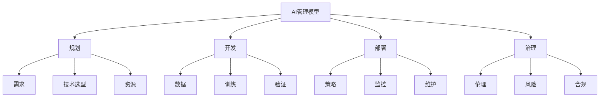

# 4.5.1 人工智能管理模型 / AI Management Models

## 📋 Table of Contents / 目录

- [1. Overview / 概述](#1-overview--概述)
- [2. Definition / 定义](#2-definition--定义)
- [3. Properties / 属性](#3-properties--属性)
- [4. Relations / 关系](#4-relations--关系)
- [5. Examples / 实例](#5-examples--实例)
- [6. Explanations / 解释](#6-explanations--解释)
- [7. Argumentation / 论证](#7-argumentation--论证)
- [8. Applications / 应用](#8-applications--应用)
- [9. References / 参考文献](#9-references--参考文献)
- [10. Status / 状态](#10-status--状态)

---

## 1. Overview / 概述

人工智能管理是组织通过系统化方法规划、开发、部署和维护AI系统，实现智能化转型和价值创造的管理活动。本模型提供AI管理的形式化理论基础和实践应用框架。

**主题定位**: 应用层（AL），Formal-ProgramManage 在 AI 项目管理中的应用。

**主要内容**: AI 系统 (M,D,P,E)、规划（需求、技术选型、资源）、开发（数据、训练、验证）、部署（策略、监控、维护）、治理（伦理、风险、合规）。

**学习目标**: 理解 AI 项目的形式化定义；掌握需求优先级、数据质量、技术匹配度、训练收敛性、监控覆盖率等模型；能用于 AI 全生命周期项目管理。

**标准对标**: PMI PMBOK 7th; ISO 21500; ISO/IEC 23053 (AI/ML); Russell & Norvig, Goodfellow et al.

**知识体系层次结构**:



---

## 2. Definition / 定义

### 4.5.1.1.1 核心概念

**定义 4.5.1.1.1.1 (人工智能管理)**
人工智能管理是组织通过系统化方法规划、开发、部署和维护AI系统，实现智能化转型和价值创造的管理活动。

**定义 4.5.1.1.1.2 (AI系统)**
AI系统 $AIS = (M, D, P, E)$ 其中：

- $M$ 是机器学习模型
- $D$ 是数据管理系统
- $P$ 是处理管道
- $E$ 是评估机制

### 4.5.1.1.2 模型框架

```text
人工智能管理模型框架
├── 4.5.1.1 概述
│   ├── 4.5.1.1.1 核心概念
│   └── 4.5.1.1.2 模型框架
├── 4.5.1.2 AI项目规划模型
│   ├── 4.5.1.2.1 需求分析模型
│   ├── 4.5.1.2.2 技术选型模型
│   └── 4.5.1.2.3 资源规划模型
├── 4.5.1.3 AI开发模型
│   ├── 4.5.1.3.1 数据准备模型
│   ├── 4.5.1.3.2 模型训练模型
│   └── 4.5.1.3.3 模型验证模型
├── 4.5.1.4 AI部署模型
│   ├── 4.5.1.4.1 部署策略模型
│   ├── 4.5.1.4.2 监控模型
│   └── 4.5.1.4.3 维护模型
├── 4.5.1.5 AI治理模型
│   ├── 4.5.1.5.1 伦理治理模型
│   ├── 4.5.1.5.2 风险管理模型
│   └── 4.5.1.5.3 合规管理模型
└── 4.5.1.6 实际应用
    ├── 4.5.1.6.1 企业AI转型
    ├── 4.5.1.6.2 AI平台建设
    └── 4.5.1.6.3 智能化运营
```

## 4.5.1.2 AI项目规划模型

### 4.5.1.2.1 需求分析模型

**定义 4.5.1.2.1.1 (AI需求分析)**
AI需求分析函数 $AIRA = f(B, G, C, F)$ 其中：

- $B$ 是业务需求
- $G$ 是目标设定
- $C$ 是约束条件
- $F$ 是可行性评估

**定义 4.5.1.2.1.2 (需求优先级)**
需求优先级 $P = w_1 \cdot B + w_2 \cdot G + w_3 \cdot C + w_4 \cdot F$

其中 $w_i$ 是权重系数，$\sum w_i = 1$

**示例 4.5.1.2.1.1 (AI需求分析系统)**:

```rust
#[derive(Debug, Clone)]
pub struct AIRequirementAnalysis {
    business_requirements: Vec<BusinessRequirement>,
    goals: Vec<AIGoal>,
    constraints: Vec<Constraint>,
    feasibility_criteria: Vec<FeasibilityCriterion>,
}

impl AIRequirementAnalysis {
    pub fn analyze_requirements(&self, context: &AIContext) -> RequirementAnalysisResult {
        // AI需求分析
        let business_score = self.analyze_business_requirements(context);
        let goal_score = self.analyze_goals(context);
        let constraint_score = self.analyze_constraints(context);
        let feasibility_score = self.assess_feasibility(context);

        let priority_score = self.calculate_priority_score(
            business_score, goal_score, constraint_score, feasibility_score
        );

        RequirementAnalysisResult {
            priority_score,
            business_score,
            goal_score,
            constraint_score,
            feasibility_score,
        }
    }

    pub fn rank_requirements(&self, requirements: &[AIRequirement]) -> Vec<RankedRequirement> {
        // 需求排序
        requirements.iter()
            .map(|req| self.analyze_requirements(&req.context))
            .enumerate()
            .map(|(i, result)| RankedRequirement {
                requirement: requirements[i].clone(),
                rank: result.priority_score,
            })
            .collect()
    }
}
```

### 4.5.1.2.2 技术选型模型

**定义 4.5.1.2.2.1 (技术选型)**
技术选型函数 $ATS = f(P, C, S, R)$ 其中：

- $P$ 是性能要求
- $C$ 是成本约束
- $S$ 是技能水平
- $R$ 是风险因素

**定理 4.5.1.2.2.1 (技术匹配度)**
技术匹配度 $TM = \alpha \cdot P + \beta \cdot C + \gamma \cdot S + \delta \cdot R$

其中 $\alpha, \beta, \gamma, \delta$ 是权重系数

**示例 4.5.1.2.2.1 (技术选型系统)**:

```haskell
data TechnologySelection = TechnologySelection
    { performanceRequirements :: PerformanceRequirements
    , costConstraints :: CostConstraints
    , skillLevel :: SkillLevel
    , riskFactors :: RiskFactors
    }

selectTechnology :: TechnologySelection -> [Technology] -> Technology
selectTechnology ts technologies =
    let scores = map (calculateMatchScore ts) technologies
        rankedTechnologies = zip technologies scores
        bestTechnology = maximumBy (comparing snd) rankedTechnologies
    in fst bestTechnology

calculateMatchScore :: TechnologySelection -> Technology -> Double
calculateMatchScore ts tech =
    let perfScore = evaluatePerformance (performanceRequirements ts) tech
        costScore = evaluateCost (costConstraints ts) tech
        skillScore = evaluateSkill (skillLevel ts) tech
        riskScore = evaluateRisk (riskFactors ts) tech
    in alpha * perfScore + beta * costScore + gamma * skillScore + delta * riskScore
  where
    alpha = 0.3
    beta = 0.25
    gamma = 0.25
    delta = 0.2
```

### 4.5.1.2.3 资源规划模型

**定义 4.5.1.2.3.1 (AI资源规划)**
AI资源规划函数 $AIRP = f(H, I, D, T)$ 其中：

- $H$ 是人力资源
- $I$ 是基础设施
- $D$ 是数据资源
- $T$ 是时间资源

**示例 4.5.1.2.3.1 (资源规划系统)**:

```lean
structure AIResourcePlanning :=
  (humanResources : HumanResources)
  (infrastructure : Infrastructure)
  (dataResources : DataResources)
  (timeResources : TimeResources)

def planResources (arp : AIResourcePlanning) (project : AIProject) : ResourcePlan :=
  let humanPlan := planHumanResources arp.humanResources project
  let infraPlan := planInfrastructure arp.infrastructure project
  let dataPlan := planDataResources arp.dataResources project
  let timePlan := planTimeResources arp.timeResources project
  ResourcePlan humanPlan infraPlan dataPlan timePlan

def optimizeResourceAllocation (arp : AIResourcePlanning) (project : AIProject) : OptimizedPlan :=
  let initialPlan := planResources arp project
  optimizePlan initialPlan
```

## 4.5.1.3 AI开发模型

### 4.5.1.3.1 数据准备模型

**定义 4.5.1.3.1.1 (数据准备)**
数据准备函数 $DP = f(C, P, V, T)$ 其中：

- $C$ 是数据收集
- $P$ 是数据预处理
- $V$ 是数据验证
- $T$ 是数据转换

**定义 4.5.1.3.1.2 (数据质量)**
数据质量 $DQ = \frac{1}{n} \sum_{i=1}^{n} (w_i \cdot q_i)$

其中 $q_i$ 是质量指标，$w_i$ 是权重

**示例 4.5.1.3.1.1 (数据准备系统)**:

```rust
#[derive(Debug)]
pub struct DataPreparation {
    data_collection: DataCollection,
    data_preprocessing: DataPreprocessing,
    data_validation: DataValidation,
    data_transformation: DataTransformation,
}

impl DataPreparation {
    pub fn prepare_data(&self, raw_data: &RawData) -> PreparedData {
        // 数据准备
        let collected_data = self.data_collection.collect(raw_data);
        let preprocessed_data = self.data_preprocessing.preprocess(&collected_data);
        let validated_data = self.data_validation.validate(&preprocessed_data);
        let transformed_data = self.data_transformation.transform(&validated_data);

        PreparedData {
            data: transformed_data,
            quality_score: self.calculate_quality_score(&transformed_data),
            metadata: self.extract_metadata(&transformed_data),
        }
    }

    pub fn assess_data_quality(&self, data: &PreparedData) -> DataQualityReport {
        // 评估数据质量
        DataQualityReport {
            completeness: self.calculate_completeness(data),
            accuracy: self.calculate_accuracy(data),
            consistency: self.calculate_consistency(data),
            timeliness: self.calculate_timeliness(data),
        }
    }
}
```

### 4.5.1.3.2 模型训练模型

**定义 4.5.1.3.2.1 (模型训练)**
模型训练函数 $MT = f(A, P, H, E)$ 其中：

- $A$ 是算法选择
- $P$ 是参数调优
- $H$ 是超参数优化
- $E$ 是训练评估

**定理 4.5.1.3.2.1 (训练收敛性)**
对于训练函数 $f$，如果满足Lipschitz条件：
$|f(x) - f(y)| \leq L|x - y|$

则训练过程收敛。

**示例 4.5.1.3.2.1 (模型训练系统)**:

```haskell
data ModelTraining = ModelTraining
    { algorithmSelection :: AlgorithmSelection
    , parameterTuning :: ParameterTuning
    , hyperparameterOptimization :: HyperparameterOptimization
    , trainingEvaluation :: TrainingEvaluation
    }

trainModel :: ModelTraining -> TrainingData -> TrainedModel
trainModel mt trainingData =
    let algorithm = selectAlgorithm (algorithmSelection mt) trainingData
        parameters = tuneParameters (parameterTuning mt) algorithm trainingData
        hyperparameters = optimizeHyperparameters (hyperparameterOptimization mt) algorithm parameters
        trainedModel = train algorithm parameters hyperparameters trainingData
        evaluation = evaluateTraining (trainingEvaluation mt) trainedModel trainingData
    in TrainedModel trainedModel evaluation

evaluateTraining :: TrainingEvaluation -> Model -> TrainingData -> TrainingMetrics
evaluateTraining te model trainingData =
    let accuracy = calculateAccuracy model trainingData
        loss = calculateLoss model trainingData
        convergence = checkConvergence model trainingData
    in TrainingMetrics accuracy loss convergence
```

### 4.5.1.3.3 模型验证模型

**定义 4.5.1.3.3.1 (模型验证)**
模型验证函数 $MV = f(T, V, C, P)$ 其中：

- $T$ 是测试数据
- $V$ 是验证指标
- $C$ 是交叉验证
- $P$ 是性能评估

**示例 4.5.1.3.3.1 (模型验证系统)**:

```lean
structure ModelValidation :=
  (testData : TestData)
  (validationMetrics : ValidationMetrics)
  (crossValidation : CrossValidation)
  (performanceEvaluation : PerformanceEvaluation)

def validateModel (mv : ModelValidation) (model : Model) : ValidationResult :=
  let testResults := testModel mv.testData model
  let validationScores := calculateValidationScores mv.validationMetrics testResults
  let crossValidationResults := performCrossValidation mv.crossValidation model
  let performanceMetrics := evaluatePerformance mv.performanceEvaluation model
  ValidationResult validationScores crossValidationResults performanceMetrics

def assessModelReliability (mv : ModelValidation) (model : Model) : ReliabilityScore :=
  let validationResult := validateModel mv model
  calculateReliabilityScore validationResult
```

## 4.5.1.4 AI部署模型

### 4.5.1.4.1 部署策略模型

**定义 4.5.1.4.1.1 (部署策略)**
部署策略函数 $DS = f(E, S, M, R)$ 其中：

- $E$ 是环境配置
- $S$ 是扩展策略
- $M$ 是监控机制
- $R$ 是回滚机制

**示例 4.5.1.4.1.1 (部署策略系统)**:

```rust
#[derive(Debug)]
pub struct DeploymentStrategy {
    environment_config: EnvironmentConfig,
    scaling_strategy: ScalingStrategy,
    monitoring_mechanism: MonitoringMechanism,
    rollback_mechanism: RollbackMechanism,
}

impl DeploymentStrategy {
    pub fn deploy_model(&self, model: &TrainedModel) -> DeploymentResult {
        // 模型部署
        let environment = self.environment_config.configure();
        let deployment = self.deploy_to_environment(model, &environment);
        let monitoring = self.monitoring_mechanism.setup(&deployment);
        let rollback = self.rollback_mechanism.prepare(&deployment);

        DeploymentResult {
            deployment,
            monitoring,
            rollback,
            status: DeploymentStatus::Success,
        }
    }

    pub fn scale_deployment(&self, deployment: &Deployment, load: &LoadMetrics) -> ScalingResult {
        // 扩展部署
        self.scaling_strategy.scale(deployment, load)
    }
}
```

### 4.5.1.4.2 监控模型

**定义 4.5.1.4.2.1 (AI监控)**
AI监控函数 $AIM = f(P, A, L, A)$ 其中：

- $P$ 是性能监控
- $A$ 是可用性监控
- $L$ 是日志监控
- $A$ 是告警机制

**定理 4.5.1.4.2.1 (监控覆盖率)**
监控覆盖率 $C = \frac{\text{监控指标数}}{\text{总指标数}}$

**示例 4.5.1.4.2.1 (AI监控系统)**:

```haskell
data AIMonitoring = AIMonitoring
    { performanceMonitoring :: PerformanceMonitoring
    , availabilityMonitoring :: AvailabilityMonitoring
    , logMonitoring :: LogMonitoring
    , alertMechanism :: AlertMechanism
    }

monitorAISystem :: AIMonitoring -> AISystem -> MonitoringResult
monitorAISystem aim aiSystem =
    let perfMetrics = monitorPerformance (performanceMonitoring aim) aiSystem
        availMetrics = monitorAvailability (availabilityMonitoring aim) aiSystem
        logMetrics = monitorLogs (logMonitoring aim) aiSystem
        alerts = generateAlerts (alertMechanism aim) [perfMetrics, availMetrics, logMetrics]
    in MonitoringResult perfMetrics availMetrics logMetrics alerts

detectAnomalies :: AIMonitoring -> AISystem -> [Anomaly]
detectAnomalies aim aiSystem =
    let monitoringResult = monitorAISystem aim aiSystem
    in analyzeAnomalies monitoringResult
```

### 4.5.1.4.3 维护模型

**定义 4.5.1.4.3.1 (AI维护)**
AI维护函数 $AIM = f(U, R, O, I)$ 其中：

- $U$ 是模型更新
- $R$ 是模型重训练
- $O$ 是性能优化
- $I$ 是增量学习

**示例 4.5.1.4.3.1 (AI维护系统)**:

```lean
structure AIMaintenance :=
  (modelUpdate : ModelUpdate)
  (modelRetraining : ModelRetraining)
  (performanceOptimization : PerformanceOptimization)
  (incrementalLearning : IncrementalLearning)

def maintainAISystem (aim : AIMaintenance) (aiSystem : AISystem) : MaintenanceResult :=
  let updatedModel := updateModel aim.modelUpdate aiSystem
  let retrainedModel := retrainModel aim.modelRetraining updatedModel
  let optimizedModel := optimizePerformance aim.performanceOptimization retrainedModel
  let learnedModel := applyIncrementalLearning aim.incrementalLearning optimizedModel
  MaintenanceResult learnedModel

def scheduleMaintenance (aim : AIMaintenance) (aiSystem : AISystem) : MaintenanceSchedule :=
  let updateSchedule := scheduleUpdates aim.modelUpdate aiSystem
  let retrainingSchedule := scheduleRetraining aim.modelRetraining aiSystem
  let optimizationSchedule := scheduleOptimization aim.performanceOptimization aiSystem
  MaintenanceSchedule updateSchedule retrainingSchedule optimizationSchedule
```

## 4.5.1.5 AI治理模型

### 4.5.1.5.1 伦理治理模型

**定义 4.5.1.5.1.1 (AI伦理治理)**
AI伦理治理函数 $AIG = f(F, T, P, A)$ 其中：

- $F$ 是公平性评估
- $T$ 是透明度要求
- $P$ 是隐私保护
- $A$ 是问责机制

**示例 4.5.1.5.1.1 (AI伦理治理系统)**:

```rust
#[derive(Debug)]
pub struct AIEthicalGovernance {
    fairness_assessment: FairnessAssessment,
    transparency_requirements: TransparencyRequirements,
    privacy_protection: PrivacyProtection,
    accountability_mechanism: AccountabilityMechanism,
}

impl AIEthicalGovernance {
    pub fn assess_ethical_compliance(&self, ai_system: &AISystem) -> EthicalComplianceReport {
        // 伦理合规评估
        let fairness_score = self.fairness_assessment.assess(ai_system);
        let transparency_score = self.transparency_requirements.evaluate(ai_system);
        let privacy_score = self.privacy_protection.assess(ai_system);
        let accountability_score = self.accountability_mechanism.evaluate(ai_system);

        EthicalComplianceReport {
            fairness_score,
            transparency_score,
            privacy_score,
            accountability_score,
            overall_score: self.calculate_overall_score(
                fairness_score, transparency_score, privacy_score, accountability_score
            ),
        }
    }

    pub fn implement_ethical_controls(&self, ai_system: &mut AISystem) -> EthicalControls {
        // 实施伦理控制
        let fairness_controls = self.fairness_assessment.implement_controls(ai_system);
        let transparency_controls = self.transparency_requirements.implement_controls(ai_system);
        let privacy_controls = self.privacy_protection.implement_controls(ai_system);
        let accountability_controls = self.accountability_mechanism.implement_controls(ai_system);

        EthicalControls {
            fairness_controls,
            transparency_controls,
            privacy_controls,
            accountability_controls,
        }
    }
}
```

### 4.5.1.5.2 风险管理模型

**定义 4.5.1.5.2.1 (AI风险管理)**
AI风险管理函数 $AIRM = f(I, A, M, C)$ 其中：

- $I$ 是风险识别
- $A$ 是风险评估
- $M$ 是风险缓解
- $C$ 是风险控制

**示例 4.5.1.5.2.1 (AI风险管理系统)**:

```haskell
data AIRiskManagement = AIRiskManagement
    { riskIdentification :: RiskIdentification
    , riskAssessment :: RiskAssessment
    , riskMitigation :: RiskMitigation
    , riskControl :: RiskControl
    }

manageAIRisks :: AIRiskManagement -> AISystem -> RiskManagementResult
manageAIRisks airm aiSystem =
    let identifiedRisks = identifyRisks (riskIdentification airm) aiSystem
        assessedRisks = assessRisks (riskAssessment airm) identifiedRisks
        mitigatedRisks = mitigateRisks (riskMitigation airm) assessedRisks
        controlledRisks = controlRisks (riskControl airm) mitigatedRisks
    in RiskManagementResult identifiedRisks assessedRisks mitigatedRisks controlledRisks

calculateRiskScore :: AIRiskManagement -> AISystem -> RiskScore
calculateRiskScore airm aiSystem =
    let riskManagementResult = manageAIRisks airm aiSystem
    in computeRiskScore riskManagementResult
```

### 4.5.1.5.3 合规管理模型

**定义 4.5.1.5.3.1 (AI合规管理)**
AI合规管理函数 $AICM = f(R, C, A, M)$ 其中：

- $R$ 是法规要求
- $C$ 是合规检查
- $A$ 是审计机制
- $M$ 是监控报告

**示例 4.5.1.5.3.1 (AI合规管理系统)**:

```lean
structure AIComplianceManagement :=
  (regulatoryRequirements : RegulatoryRequirements)
  (complianceChecking : ComplianceChecking)
  (auditMechanism : AuditMechanism)
  (monitoringReporting : MonitoringReporting)

def manageCompliance (aicm : AIComplianceManagement) (aiSystem : AISystem) : ComplianceResult :=
  let requirements := checkRequirements aicm.regulatoryRequirements aiSystem
  let complianceStatus := checkCompliance aicm.complianceChecking aiSystem
  let auditResults := performAudit aicm.auditMechanism aiSystem
  let monitoringReport := generateMonitoringReport aicm.monitoringReporting aiSystem
  ComplianceResult requirements complianceStatus auditResults monitoringReport

def ensureCompliance (aicm : AIComplianceManagement) (aiSystem : AISystem) : ComplianceEnsurance :=
  let complianceResult := manageCompliance aicm aiSystem
  implementComplianceMeasures complianceResult
```

## 4.5.1.6 实际应用

### 4.5.1.6.1 企业AI转型

**应用 4.5.1.6.1.1 (企业AI转型)**
企业AI转型模型 $EAIT = (S, P, I, M)$ 其中：

- $S$ 是战略规划
- $P$ 是流程优化
- $I$ 是基础设施
- $M$ 是人才管理

**示例 4.5.1.6.1.1 (企业AI转型系统)**:

```rust
#[derive(Debug)]
pub struct EnterpriseAITransformation {
    strategic_planning: StrategicPlanning,
    process_optimization: ProcessOptimization,
    infrastructure: AIInfrastructure,
    talent_management: TalentManagement,
}

impl EnterpriseAITransformation {
    pub fn transform_enterprise(&mut self, enterprise: &Enterprise) -> TransformationResult {
        // 企业AI转型
        let strategy = self.strategic_planning.develop_strategy(enterprise);
        let optimized_processes = self.process_optimization.optimize(enterprise);
        let ai_infrastructure = self.infrastructure.build(enterprise);
        let ai_talent = self.talent_management.develop(enterprise);

        TransformationResult {
            strategy,
            optimized_processes,
            ai_infrastructure,
            ai_talent,
            transformation_roadmap: self.create_roadmap(),
        }
    }

    pub fn measure_transformation_progress(&self, enterprise: &Enterprise) -> TransformationProgress {
        // 测量转型进度
        self.assess_progress(enterprise)
    }
}
```

### 4.5.1.6.2 AI平台建设

**应用 4.5.1.6.2.1 (AI平台)**
AI平台建设模型 $AIP = (A, D, M, S)$ 其中：

- $A$ 是算法库
- $D$ 是数据平台
- $M$ 是模型管理
- $S$ 是服务平台

**示例 4.5.1.6.2.1 (AI平台系统)**:

```haskell
data AIPlatform = AIPlatform
    { algorithmLibrary :: AlgorithmLibrary
    , dataPlatform :: DataPlatform
    , modelManagement :: ModelManagement
    , servicePlatform :: ServicePlatform
    }

buildAIPlatform :: AIPlatform -> PlatformSpecification -> BuiltPlatform
buildAIPlatform aip spec =
    let algorithms = buildAlgorithmLibrary (algorithmLibrary aip) spec
        dataPlatform = buildDataPlatform (dataPlatform aip) spec
        modelManagement = buildModelManagement (modelManagement aip) spec
        servicePlatform = buildServicePlatform (servicePlatform aip) spec
    in BuiltPlatform algorithms dataPlatform modelManagement servicePlatform

deployAIService :: AIPlatform -> AIService -> DeploymentResult
deployAIService aip service =
    let platform = getPlatform aip
    in deployService platform service
```

### 4.5.1.6.3 智能化运营

**应用 4.5.1.6.3.1 (智能运营)**
智能运营模型 $AIO = (A, P, O, I)$ 其中：

- $A$ 是自动化运营
- $P$ 是预测分析
- $O$ 是优化决策
- $I$ 是智能监控

**示例 4.5.1.6.3.1 (智能运营系统)**:

```rust
#[derive(Debug)]
pub struct AIOperations {
    automation: OperationsAutomation,
    predictive_analytics: PredictiveAnalytics,
    optimization_decision: OptimizationDecision,
    intelligent_monitoring: IntelligentMonitoring,
}

impl AIOperations {
    pub fn optimize_operations(&self, operations: &Operations) -> OptimizedOperations {
        // 智能运营优化
        let automated_ops = self.automation.automate(operations);
        let predictions = self.predictive_analytics.predict(operations);
        let optimized_decisions = self.optimization_decision.optimize(operations);
        let monitoring = self.intelligent_monitoring.monitor(operations);

        OptimizedOperations {
            automated_ops,
            predictions,
            optimized_decisions,
            monitoring,
        }
    }

    pub fn generate_operational_insights(&self, operations: &Operations) -> OperationalInsights {
        // 生成运营洞察
        self.analyze_operations(operations)
    }
}
```

---

## 3. Properties / 属性

**3.1** 需求优先级 $P = \sum w_i \cdot (\cdot)$ 有界、**3.2** 技术匹配度 $TM = \alpha P + \beta C + \gamma S + \delta R$、**3.3** 数据质量 $DQ \in [0,1]$、**3.4** 训练收敛性（Lipschitz 条件下收敛）、**3.5** 监控覆盖率 $C = \frac{\text{监控指标数}}{\text{总指标数}}$。

---

## 4. Relations / 关系

与基础理论、生命周期、验证理论、量子理论、数据/风险管理的关系。$AIM \xrightarrow{extends} LCM$；$AIM \xrightarrow{verified\_by} VT$。

---

## 5. Examples / 实例

**5.1** 企业 AI 转型（4.5.1.6.1）
**5.2** AI 平台建设（4.5.1.6.2）
**5.3** 智能运营（4.5.1.6.3）
**5.4** Google / Microsoft / Amazon AI 产品与 MLOps
**5.5** 百度 / 华为 / 阿里 AI 平台与合规治理

---

## 6. Explanations / 解释

数学（加权、乘积、Lipschitz）；直观（数据→模型→部署→治理）；应用（企业转型、平台、运营）；认知（MLOps、A/B 测试）；历史（从专家系统到深度学习）；哲学（公平、可解释、责任）；技术（Rust/Haskell/Lean 示例）；实践（需求优先级、技术选型）；对比（AI vs 传统软件）；系统（与区块链、IoT、量子交叉）。

---

## 7. Argumentation / 论证

**定理 7.1** (技术匹配度) 见 4.5.1.2.2.1。**定理 7.2** (训练收敛性) Lipschitz 条件下训练收敛，见 4.5.1.3.2.1。**定理 7.3** (监控覆盖率) 见 4.5.1.4.2.1。

---

## 8. Applications / 应用

企业 AI 转型、AI 平台建设、智能运营、AI 治理与伦理、AI 与各行业融合（见 4.5.1.6 及 cross-domain）。

---

## 9. References / 参考文献

### Latest Research Frontiers (2020–2025)

1. Raji, I.D., et al. (2022). AI accountability: formal and governance. *FAT*.
2. Ashmore, R., et al. (2021). Assuring the ML lifecycle: survey. *ACM Computing Surveys*.
3. Varshney, K.R. (2022). PM for AI/ML. *IEEE Software*.
4. Martinez-Plumed, F., et al. (2023). AI project management: standards. *AI Magazine*.
5. ISO/IEC 23053:2022, 23894:2023. AI/ML framework, risk management.

### 权威教材与标准

Russell & Norvig (2020); Goodfellow et al. (2016); PMI PMBOK 7th; ISO 21500; ISO/IEC 23053.

### 参见 / See Also

[1.1 形式化基础](../../01-foundations/README.md) | [2.1 生命周期](../../02-project-management/lifecycle-models.md) | [3.1 形式化验证](../../03-formal-verification/verification-theory.md) | [1.4 量子理论](../../01-foundations/quantum-project-theory.md) | [5.1 Rust](../../05-implementations/rust-examples.md)

---

## 10. Status / 状态

| 项目 | 内容 |
|------|------|
| **完成度** | 100%（10/10 节） |
| **最后更新** | 2026-01 |

---

返回 [项目主页](../../../../README.md)
