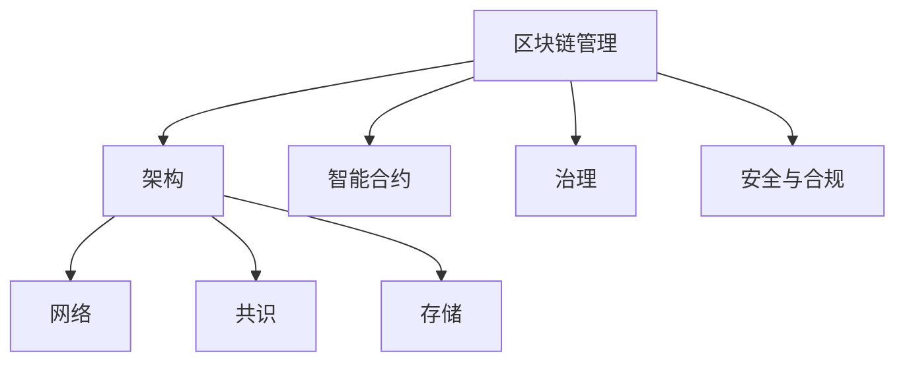

# 4.5.2 区块链管理模型 / Blockchain Management Models

## 📋 Table of Contents / 目录

- [1. Overview / 概述](#1-overview--概述)
- [2. Definition / 定义](#2-definition--定义)
- [3. Properties / 属性](#3-properties--属性)
- [4. Relations / 关系](#4-relations--关系)
- [5. Examples / 实例](#5-examples--实例)
- [6. Explanations / 解释](#6-explanations--解释)
- [7. Argumentation / 论证](#7-argumentation--论证)
- [8. Applications / 应用](#8-applications--应用)
- [9. References / 参考文献](#9-references--参考文献)
- [10. Status / 状态](#10-status--状态)

---

## 1. Overview / 概述

区块链管理是组织通过系统化方法设计、开发、部署和维护区块链系统，实现去中心化应用和价值传递的管理活动。本模型提供区块链管理的形式化理论基础和实践应用框架。

**主题定位**: 应用层（AL），Formal-ProgramManage 在区块链项目管理中的应用。

**主要内容**: 区块链系统 (N,C,S,V)、架构（网络、共识、存储）、智能合约（开发、部署、验证）、治理（机制、激励、升级）、安全与合规。

**学习目标**: 理解区块链项目的形式化定义；掌握拜占庭容错、网络性能、合约验证、治理与合规模型；能用于企业链、DeFi、供应链区块链项目管理。

**标准对标**: PMI PMBOK 7th; ISO 21500; ISO/TR 23244; Narayanan et al., Antonopoulos.



---

## 2. Definition / 定义

### 4.5.2.1.1 核心概念

**定义 4.5.2.1.1.1 (区块链管理)**
区块链管理是组织通过系统化方法设计、开发、部署和维护区块链系统，实现去中心化应用和价值传递的管理活动。

**定义 4.5.2.1.1.2 (区块链系统)**
区块链系统 $BCS = (N, C, S, V)$ 其中：

- $N$ 是网络节点
- $C$ 是共识机制
- $S$ 是智能合约
- $V$ 是验证机制

### 4.5.2.1.2 模型框架

```text
区块链管理模型框架
├── 4.5.2.1 概述
│   ├── 4.5.2.1.1 核心概念
│   └── 4.5.2.1.2 模型框架
├── 4.5.2.2 区块链架构模型
│   ├── 4.5.2.2.1 网络架构模型
│   ├── 4.5.2.2.2 共识机制模型
│   └── 4.5.2.2.3 存储模型
├── 4.5.2.3 智能合约管理模型
│   ├── 4.5.2.3.1 合约开发模型
│   ├── 4.5.2.3.2 合约部署模型
│   └── 4.5.2.3.3 合约验证模型
├── 4.5.2.4 区块链治理模型
│   ├── 4.5.2.4.1 治理机制模型
│   ├── 4.5.2.4.2 激励机制模型
│   └── 4.5.2.4.3 升级机制模型
├── 4.5.2.5 安全与合规模型
│   ├── 4.5.2.5.1 安全模型
│   ├── 4.5.2.5.2 隐私保护模型
│   └── 4.5.2.5.3 合规管理模型
└── 4.5.2.6 实际应用
    ├── 4.5.2.6.1 企业区块链
    ├── 4.5.2.6.2 DeFi应用
    └── 4.5.2.6.3 供应链区块链
```

## 4.5.2.2 区块链架构模型

### 4.5.2.2.1 网络架构模型

**定义 4.5.2.2.1.1 (区块链网络)**
区块链网络 $BCN = (N, E, P, T)$ 其中：

- $N$ 是节点集合
- $E$ 是边集合（连接关系）
- $P$ 是协议栈
- $T$ 是拓扑结构

**定义 4.5.2.2.1.2 (网络性能)**
网络性能 $NP = \frac{TPS \cdot Latency}{Bandwidth}$

其中：

- $TPS$ 是每秒交易数
- $Latency$ 是延迟时间
- $Bandwidth$ 是带宽

**示例 4.5.2.2.1.1 (区块链网络系统)**:

```rust
#[derive(Debug, Clone)]
pub struct BlockchainNetwork {
    nodes: Vec<Node>,
    connections: Vec<Connection>,
    protocol_stack: ProtocolStack,
    topology: NetworkTopology,
}

impl BlockchainNetwork {
    pub fn build_network(&mut self, config: &NetworkConfig) -> NetworkResult {
        // 构建区块链网络
        let nodes = self.create_nodes(config);
        let connections = self.establish_connections(&nodes);
        let protocol = self.setup_protocol_stack(config);
        let topology = self.configure_topology(config);

        NetworkResult {
            nodes,
            connections,
            protocol_stack: protocol,
            topology,
            performance_metrics: self.calculate_performance_metrics(),
        }
    }

    pub fn optimize_network(&mut self, network: &BlockchainNetwork) -> OptimizationResult {
        // 网络优化
        let optimized_nodes = self.optimize_node_distribution(&network.nodes);
        let optimized_connections = self.optimize_connections(&network.connections);
        let optimized_protocol = self.optimize_protocol(&network.protocol_stack);

        OptimizationResult {
            optimized_nodes,
            optimized_connections,
            optimized_protocol,
            performance_improvement: self.calculate_improvement(),
        }
    }
}
```

### 4.5.2.2.2 共识机制模型

**定义 4.5.2.2.2.1 (共识机制)**
共识机制函数 $CM = f(V, P, F, S)$ 其中：

- $V$ 是验证规则
- $P$ 是参与机制
- $F$ 是容错能力
- $S$ 是安全性保证

**定理 4.5.2.2.2.1 (拜占庭容错)**
对于拜占庭容错系统，如果恶意节点数量 $f < \frac{n}{3}$，则系统可以达成共识。

其中 $n$ 是总节点数。

**示例 4.5.2.2.2.1 (共识机制系统)**:

```haskell
data ConsensusMechanism = ConsensusMechanism
    { validationRules :: ValidationRules
    , participationMechanism :: ParticipationMechanism
    , faultTolerance :: FaultTolerance
    , securityGuarantees :: SecurityGuarantees
    }

achieveConsensus :: ConsensusMechanism -> [Transaction] -> ConsensusResult
achieveConsensus cm transactions =
    let validatedTransactions = validateTransactions (validationRules cm) transactions
        participants = selectParticipants (participationMechanism cm) validatedTransactions
        consensus = reachConsensus (faultTolerance cm) participants
        securityCheck = verifySecurity (securityGuarantees cm) consensus
    in ConsensusResult consensus securityCheck

calculateConsensusEfficiency :: ConsensusMechanism -> ConsensusMetrics
calculateConsensusEfficiency cm =
    let timeToConsensus = measureTimeToConsensus cm
        energyConsumption = measureEnergyConsumption cm
        securityLevel = measureSecurityLevel cm
    in ConsensusMetrics timeToConsensus energyConsumption securityLevel
```

### 4.5.2.2.3 存储模型

**定义 4.5.2.2.3.1 (区块链存储)**
区块链存储函数 $BCS = f(S, I, R, A)$ 其中：

- $S$ 是状态存储
- $I$ 是索引结构
- $R$ 是复制机制
- $A$ 是访问控制

**示例 4.5.2.2.3.1 (区块链存储系统)**:

```lean
structure BlockchainStorage :=
  (stateStorage : StateStorage)
  (indexStructure : IndexStructure)
  (replicationMechanism : ReplicationMechanism)
  (accessControl : AccessControl)

def storeBlockchainData (bcs : BlockchainStorage) (data : BlockchainData) : StorageResult :=
  let storedState := storeState bcs.stateStorage data
  let indexedData := buildIndex bcs.indexStructure storedState
  let replicatedData := replicateData bcs.replicationMechanism indexedData
  let accessControlled := applyAccessControl bcs.accessControl replicatedData
  StorageResult accessControlled

def queryBlockchainData (bcs : BlockchainStorage) (query : Query) : QueryResult :=
  let authorizedQuery := authorizeQuery bcs.accessControl query
  let indexedResult := queryIndex bcs.indexStructure authorizedQuery
  let stateResult := queryState bcs.stateStorage indexedResult
  QueryResult stateResult
```

## 4.5.2.3 智能合约管理模型

### 4.5.2.3.1 合约开发模型

**定义 4.5.2.3.1.1 (智能合约)**
智能合约函数 $SC = f(C, L, E, S)$ 其中：

- $C$ 是合约代码
- $L$ 是逻辑规则
- $E$ 是执行环境
- $S$ 是状态管理

**示例 4.5.2.3.1.1 (智能合约开发系统)**:

```rust
#[derive(Debug)]
pub struct SmartContractDevelopment {
    contract_code: ContractCode,
    logic_rules: LogicRules,
    execution_environment: ExecutionEnvironment,
    state_management: StateManagement,
}

impl SmartContractDevelopment {
    pub fn develop_contract(&self, requirements: &ContractRequirements) -> SmartContract {
        // 智能合约开发
        let code = self.contract_code.generate(requirements);
        let logic = self.logic_rules.define(requirements);
        let environment = self.execution_environment.configure(requirements);
        let state = self.state_management.design(requirements);

        SmartContract {
            code,
            logic,
            environment,
            state_management: state,
            security_audit: self.perform_security_audit(&code),
        }
    }

    pub fn verify_contract(&self, contract: &SmartContract) -> VerificationResult {
        // 合约验证
        let code_verification = self.verify_code(&contract.code);
        let logic_verification = self.verify_logic(&contract.logic);
        let security_verification = self.verify_security(&contract);

        VerificationResult {
            code_verification,
            logic_verification,
            security_verification,
            overall_score: self.calculate_overall_score(),
        }
    }
}
```

### 4.5.2.3.2 合约部署模型

**定义 4.5.2.3.2.1 (合约部署)**
合约部署函数 $SCD = f(V, D, C, M)$ 其中：

- $V$ 是版本管理
- $D$ 是部署策略
- $C$ 是配置管理
- $M$ 是监控机制

**示例 4.5.2.3.2.1 (合约部署系统)**:

```haskell
data SmartContractDeployment = SmartContractDeployment
    { versionManagement :: VersionManagement
    , deploymentStrategy :: DeploymentStrategy
    , configurationManagement :: ConfigurationManagement
    , monitoringMechanism :: MonitoringMechanism
    }

deploySmartContract :: SmartContractDeployment -> SmartContract -> DeploymentResult
deploySmartContract scd contract =
    let versionedContract = versionContract (versionManagement scd) contract
        deploymentPlan = createDeploymentPlan (deploymentStrategy scd) versionedContract
        configuredContract = configureContract (configurationManagement scd) deploymentPlan
        deployedContract = deployContract configuredContract
        monitoring = setupMonitoring (monitoringMechanism scd) deployedContract
    in DeploymentResult deployedContract monitoring

rollbackDeployment :: SmartContractDeployment -> DeployedContract -> RollbackResult
rollbackDeployment scd deployedContract =
    let previousVersion = getPreviousVersion (versionManagement scd) deployedContract
        rollbackPlan = createRollbackPlan (deploymentStrategy scd) previousVersion
    in executeRollback rollbackPlan
```

### 4.5.2.3.3 合约验证模型

**定义 4.5.2.3.3.1 (合约验证)**
合约验证函数 $SCV = f(F, S, T, A)$ 其中：

- $F$ 是形式化验证
- $S$ 是静态分析
- $T$ 是测试验证
- $A$ 是审计检查

**示例 4.5.2.3.3.1 (合约验证系统)**:

```lean
structure SmartContractVerification :=
  (formalVerification : FormalVerification)
  (staticAnalysis : StaticAnalysis)
  (testVerification : TestVerification)
  (auditCheck : AuditCheck)

def verifySmartContract (scv : SmartContractVerification) (contract : SmartContract) : VerificationResult :=
  let formalResult := verifyFormally scv.formalVerification contract
  let staticResult := analyzeStatically scv.staticAnalysis contract
  let testResult := verifyByTest scv.testVerification contract
  let auditResult := performAudit scv.auditCheck contract
  VerificationResult formalResult staticResult testResult auditResult

def calculateVerificationScore (scv : SmartContractVerification) (contract : SmartContract) : VerificationScore :=
  let verificationResult := verifySmartContract scv contract
  computeVerificationScore verificationResult
```

## 4.5.2.4 区块链治理模型

### 4.5.2.4.1 治理机制模型

**定义 4.5.2.4.1.1 (区块链治理)**
区块链治理函数 $BCG = f(D, V, P, I)$ 其中：

- $D$ 是决策机制
- $V$ 是投票系统
- $P$ 是提案管理
- $I$ 是激励机制

**示例 4.5.2.4.1.1 (区块链治理系统)**:

```rust
#[derive(Debug)]
pub struct BlockchainGovernance {
    decision_mechanism: DecisionMechanism,
    voting_system: VotingSystem,
    proposal_management: ProposalManagement,
    incentive_mechanism: IncentiveMechanism,
}

impl BlockchainGovernance {
    pub fn govern_blockchain(&self, blockchain: &Blockchain) -> GovernanceResult {
        // 区块链治理
        let decisions = self.decision_mechanism.make_decisions(blockchain);
        let votes = self.voting_system.collect_votes(blockchain);
        let proposals = self.proposal_management.manage_proposals(blockchain);
        let incentives = self.incentive_mechanism.distribute_incentives(blockchain);

        GovernanceResult {
            decisions,
            votes,
            proposals,
            incentives,
            governance_score: self.calculate_governance_score(),
        }
    }

    pub fn resolve_conflicts(&self, conflicts: &[GovernanceConflict]) -> ConflictResolution {
        // 冲突解决
        self.decision_mechanism.resolve_conflicts(conflicts)
    }
}
```

### 4.5.2.4.2 激励机制模型

**定义 4.5.2.4.2.1 (激励机制)**
激励机制函数 $IM = f(R, S, P, D)$ 其中：

- $R$ 是奖励分配
- $S$ 是质押机制
- $P$ 是惩罚机制
- $D$ 是代币经济

**示例 4.5.2.4.2.1 (激励机制系统)**:

```haskell
data IncentiveMechanism = IncentiveMechanism
    { rewardAllocation :: RewardAllocation
    , stakingMechanism :: StakingMechanism
    , penaltyMechanism :: PenaltyMechanism
    , tokenEconomics :: TokenEconomics
    }

distributeIncentives :: IncentiveMechanism -> [Participant] -> IncentiveResult
distributeIncentives im participants =
    let rewards = allocateRewards (rewardAllocation im) participants
        stakingRewards = calculateStakingRewards (stakingMechanism im) participants
        penalties = calculatePenalties (penaltyMechanism im) participants
        tokenDistribution = distributeTokens (tokenEconomics im) rewards stakingRewards penalties
    in IncentiveResult tokenDistribution

calculateIncentiveEfficiency :: IncentiveMechanism -> IncentiveEfficiency
calculateIncentiveEfficiency im =
    let participationRate = measureParticipationRate im
        rewardFairness = measureRewardFairness im
        economicSustainability = measureEconomicSustainability im
    in IncentiveEfficiency participationRate rewardFairness economicSustainability
```

### 4.5.2.4.3 升级机制模型

**定义 4.5.2.4.3.1 (升级机制)**
升级机制函数 $UM = f(P, V, I, R)$ 其中：

- $P$ 是提案流程
- $V$ 是投票验证
- $I$ 是实施机制
- $R$ 是回滚机制

**示例 4.5.2.4.3.1 (升级机制系统)**:

```lean
structure UpgradeMechanism :=
  (proposalProcess : ProposalProcess)
  (votingVerification : VotingVerification)
  (implementationMechanism : ImplementationMechanism)
  (rollbackMechanism : RollbackMechanism)

def manageUpgrade (um : UpgradeMechanism) (upgrade : Upgrade) : UpgradeResult :=
  let proposal := createProposal um.proposalProcess upgrade
  let votingResult := verifyVoting um.votingVerification proposal
  let implementation := implementUpgrade um.implementationMechanism votingResult
  let rollbackPlan := prepareRollback um.rollbackMechanism implementation
  UpgradeResult implementation rollbackPlan

def executeUpgrade (um : UpgradeMechanism) (upgrade : Upgrade) : ExecutionResult :=
  let upgradeResult := manageUpgrade um upgrade
  executeUpgradePlan upgradeResult
```

## 4.5.2.5 安全与合规模型

### 4.5.2.5.1 安全模型

**定义 4.5.2.5.1.1 (区块链安全)**
区块链安全函数 $BCS = f(C, A, P, M)$ 其中：

- $C$ 是密码学安全
- $A$ 是攻击防护
- $P$ 是隐私保护
- $M$ 是监控机制

**示例 4.5.2.5.1.1 (区块链安全系统)**:

```rust
#[derive(Debug)]
pub struct BlockchainSecurity {
    cryptographic_security: CryptographicSecurity,
    attack_protection: AttackProtection,
    privacy_protection: PrivacyProtection,
    monitoring_mechanism: MonitoringMechanism,
}

impl BlockchainSecurity {
    pub fn secure_blockchain(&self, blockchain: &Blockchain) -> SecurityResult {
        // 区块链安全防护
        let crypto_security = self.cryptographic_security.secure(blockchain);
        let attack_protection = self.attack_protection.protect(blockchain);
        let privacy_protection = self.privacy_protection.protect(blockchain);
        let monitoring = self.monitoring_mechanism.monitor(blockchain);

        SecurityResult {
            crypto_security,
            attack_protection,
            privacy_protection,
            monitoring,
            security_score: self.calculate_security_score(),
        }
    }

    pub fn detect_threats(&self, blockchain: &Blockchain) -> Vec<SecurityThreat> {
        // 威胁检测
        self.monitoring_mechanism.detect_threats(blockchain)
    }
}
```

### 4.5.2.5.2 隐私保护模型

**定义 4.5.2.5.2.1 (隐私保护)**
隐私保护函数 $PP = f(E, Z, M, A)$ 其中：

- $E$ 是加密机制
- $Z$ 是零知识证明
- $M$ 是混币技术
- $A$ 是匿名化

**示例 4.5.2.5.2.1 (隐私保护系统)**:

```haskell
data PrivacyProtection = PrivacyProtection
    { encryptionMechanism :: EncryptionMechanism
    , zeroKnowledgeProof :: ZeroKnowledgeProof
    , mixingTechnology :: MixingTechnology
    , anonymization :: Anonymization
    }

protectPrivacy :: PrivacyProtection -> Transaction -> PrivacyProtectedTransaction
protectPrivacy pp transaction =
    let encryptedTransaction = encryptTransaction (encryptionMechanism pp) transaction
        zeroKnowledgeTransaction = applyZeroKnowledge (zeroKnowledgeProof pp) encryptedTransaction
        mixedTransaction = mixTransaction (mixingTechnology pp) zeroKnowledgeTransaction
        anonymizedTransaction = anonymizeTransaction (anonymization pp) mixedTransaction
    in PrivacyProtectedTransaction anonymizedTransaction

calculatePrivacyLevel :: PrivacyProtection -> Transaction -> PrivacyLevel
calculatePrivacyLevel pp transaction =
    let privacyProtectedTransaction = protectPrivacy pp transaction
    in measurePrivacyLevel privacyProtectedTransaction
```

### 4.5.2.5.3 合规管理模型

**定义 4.5.2.5.3.1 (合规管理)**
合规管理函数 $CM = f(R, A, M, R)$ 其中：

- $R$ 是法规要求
- $A$ 是审计机制
- $M$ 是监控报告
- $R$ 是风险评估

**示例 4.5.2.5.3.1 (合规管理系统)**:

```lean
structure ComplianceManagement :=
  (regulatoryRequirements : RegulatoryRequirements)
  (auditMechanism : AuditMechanism)
  (monitoringReporting : MonitoringReporting)
  (riskAssessment : RiskAssessment)

def manageCompliance (cm : ComplianceManagement) (blockchain : Blockchain) : ComplianceResult :=
  let requirements := checkRequirements cm.regulatoryRequirements blockchain
  let auditResult := performAudit cm.auditMechanism blockchain
  let monitoringReport := generateMonitoringReport cm.monitoringReporting blockchain
  let riskAssessment := assessRisk cm.riskAssessment blockchain
  ComplianceResult requirements auditResult monitoringReport riskAssessment

def ensureCompliance (cm : ComplianceManagement) (blockchain : Blockchain) : ComplianceEnsurance :=
  let complianceResult := manageCompliance cm blockchain
  implementComplianceMeasures complianceResult
```

## 4.5.2.6 实际应用

### 4.5.2.6.1 企业区块链

**应用 4.5.2.6.1.1 (企业区块链)**
企业区块链模型 $EBC = (P, C, I, G)$ 其中：

- $P$ 是私有链
- $C$ 是联盟链
- $I$ 是互操作性
- $G$ 是治理机制

**示例 4.5.2.6.1.1 (企业区块链系统)**:

```rust
#[derive(Debug)]
pub struct EnterpriseBlockchain {
    private_chain: PrivateChain,
    consortium_chain: ConsortiumChain,
    interoperability: Interoperability,
    governance_mechanism: GovernanceMechanism,
}

impl EnterpriseBlockchain {
    pub fn build_enterprise_blockchain(&self, requirements: &EnterpriseRequirements) -> EnterpriseBlockchainResult {
        // 构建企业区块链
        let private_chain = self.private_chain.build(requirements);
        let consortium_chain = self.consortium_chain.build(requirements);
        let interoperability = self.interoperability.configure(requirements);
        let governance = self.governance_mechanism.setup(requirements);

        EnterpriseBlockchainResult {
            private_chain,
            consortium_chain,
            interoperability,
            governance,
            performance_metrics: self.calculate_performance_metrics(),
        }
    }

    pub fn optimize_enterprise_blockchain(&self, blockchain: &EnterpriseBlockchain) -> OptimizationResult {
        // 优化企业区块链
        self.optimize_performance(blockchain)
    }
}
```

### 4.5.2.6.2 DeFi应用

**应用 4.5.2.6.2.1 (DeFi应用)**
DeFi应用模型 $DFI = (L, S, T, Y)$ 其中：

- $L$ 是借贷协议
- $S$ 是稳定币系统
- $T$ 是交易协议
- $Y$ 是收益农场

**示例 4.5.2.6.2.1 (DeFi应用系统)**:

```haskell
data DeFiApplication = DeFiApplication
    { lendingProtocol :: LendingProtocol
    , stablecoinSystem :: StablecoinSystem
    , tradingProtocol :: TradingProtocol
    , yieldFarming :: YieldFarming
    }

buildDeFiApplication :: DeFiApplication -> DeFiRequirements -> DeFiResult
buildDeFiApplication defi requirements =
    let lendingApp = buildLendingProtocol (lendingProtocol defi) requirements
        stablecoinApp = buildStablecoinSystem (stablecoinSystem defi) requirements
        tradingApp = buildTradingProtocol (tradingProtocol defi) requirements
        yieldApp = buildYieldFarming (yieldFarming defi) requirements
    in DeFiResult lendingApp stablecoinApp tradingApp yieldApp

calculateDeFiMetrics :: DeFiApplication -> DeFiMetrics
calculateDeFiMetrics defi =
    let totalValueLocked = calculateTVL defi
        yieldRates = calculateYieldRates defi
        riskMetrics = calculateRiskMetrics defi
    in DeFiMetrics totalValueLocked yieldRates riskMetrics
```

### 4.5.2.6.3 供应链区块链

**应用 4.5.2.6.3.1 (供应链区块链)**
供应链区块链模型 $SCBC = (T, V, C, A)$ 其中：

- $T$ 是溯源追踪
- $V$ 是验证机制
- $C$ 是协作网络
- $A$ 是自动化执行

**示例 4.5.2.6.3.1 (供应链区块链系统)**:

```rust
#[derive(Debug)]
pub struct SupplyChainBlockchain {
    traceability: Traceability,
    verification_mechanism: VerificationMechanism,
    collaboration_network: CollaborationNetwork,
    automation_execution: AutomationExecution,
}

impl SupplyChainBlockchain {
    pub fn build_supply_chain_blockchain(&self, supply_chain: &SupplyChain) -> SupplyChainBlockchainResult {
        // 构建供应链区块链
        let traceability = self.traceability.build(supply_chain);
        let verification = self.verification_mechanism.setup(supply_chain);
        let collaboration = self.collaboration_network.create(supply_chain);
        let automation = self.automation_execution.configure(supply_chain);

        SupplyChainBlockchainResult {
            traceability,
            verification,
            collaboration,
            automation,
            efficiency_metrics: self.calculate_efficiency_metrics(),
        }
    }

    pub fn track_supply_chain(&self, supply_chain: &SupplyChain) -> TrackingResult {
        // 供应链追踪
        self.traceability.track(supply_chain)
    }
}
```

---

## 3. Properties / 属性

**3.1** 拜占庭容错 $f < n/3$（4.5.2.2.2.1）**3.2** 网络性能 $NP = \frac{TPS \cdot Latency}{Bandwidth}$ **3.3** 共识、存储、合约验证的可形式化性 **3.4** 治理与激励的数学表示 **3.5** 安全与隐私、合规的可验证性

---

## 4. Relations / 关系

与基础理论、生命周期、验证理论、金融科技的关系。$BCM \xrightarrow{extends} LCM$；$BCM \xrightarrow{verified\_by} VT$；与 [fintech-management](../fintech-management/fintech-management.md) 交叉。

---

## 5. Examples / 实例

**5.1** 企业区块链（4.5.2.6.1）  
**5.2** DeFi 应用（4.5.2.6.2）  
**5.3** 供应链区块链（4.5.2.6.3）  
**5.4** 以太坊、Hyperledger、Corda 等项目  
**5.5** 央行数字货币与联盟链

---

## 6. Explanations / 解释

数学（BFT、图、密码）；直观（链、共识、不可篡改）；应用（企业、DeFi、供应链）；认知（白皮书、路线图）；历史（比特币到多链）；哲学（去中心化、信任）；技术（Rust/Haskell/Lean）；实践（审计、升级）；对比（公链/联盟链/私链）；系统（与 AI、IoT、金融集成）。

---

## 7. Argumentation / 论证

**定理 7.1** (拜占庭容错) $f < n/3$ 时可达成共识，见 4.5.2.2.2.1。**定理 7.2** (网络性能) $NP$ 公式。**定理 7.3** (合约验证) 形式化+静态+测试+审计的复合验证。

---

## 8. Applications / 应用

企业区块链、DeFi、供应链溯源、数字资产、合规与审计（见 4.5.2.6）。

---

## 9. References / 参考文献

### Latest Research Frontiers (2020–2025)

Zamyatin et al. (2022). SoK: DLT interoperability. *IEEE S&P*. 以及形式化合约验证、DeFi 与监管、ISO/TR 23244 等。

### 权威教材与标准

Narayanan et al. (2016); Antonopoulos (2017); PMI PMBOK 7th; ISO 21500; ISO/TR 23244.

### 参见

[1.1 形式化基础](../../01-foundations/README.md) | [2.1 生命周期](../../02-project-management/lifecycle-models.md) | [3.1 形式化验证](../../03-formal-verification/verification-theory.md) | [4.4.3 金融科技](../fintech-management/fintech-management.md) | [5.1 Rust](../../05-implementations/rust-examples.md)

---

## 10. Status / 状态

| 项目 | 内容 |
|------|------|
| **完成度** | 100%（10/10 节） |
| **最后更新** | 2026-01 |

---

返回 [项目主页](../../../../README.md)
