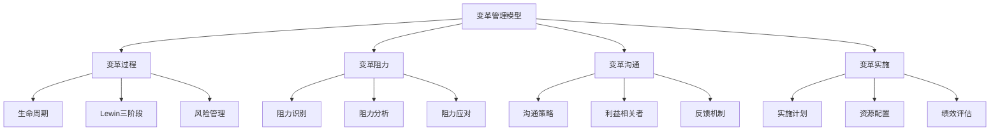
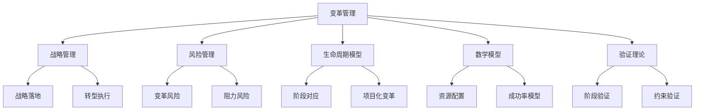

# 4.3.7 变革管理模型 / Change Management Models

## 📋 Table of Contents / 目录

- [1. Overview / 概述](#1-overview--概述)
- [2. Definition / 定义](#2-definition--定义)
- [3. Properties / 属性](#3-properties--属性)
- [4. Relations / 关系](#4-relations--关系)
- [5. Examples / 实例](#5-examples--实例)
- [6. Explanations / 解释](#6-explanations--解释)
- [7. Argumentation / 论证](#7-argumentation--论证)
- [8. Applications / 应用](#8-applications--应用)
- [9. References / 参考文献](#9-references--参考文献)
- [10. Status / 状态](#10-status--状态)

---

## 1. Overview / 概述

变革管理是组织通过系统化方法引导和管理组织变革，实现组织转型和持续发展的管理活动。本模型提供变革管理的形式化理论基础和实践应用框架。

**主题定位**: 本模型属于应用层（AL），是Formal-ProgramManage知识体系在变革管理领域的应用，为变革管理项目管理提供形式化模型。

**主要内容**:

- 变革管理基础（变革系统、变革生命周期、Lewin 三阶段模型）
- 变革过程（启动、规划、实施、评估、稳定）
- 变革阻力模型（识别、分析、应对）
- 变革沟通与实施（沟通策略、利益相关者、资源配置、绩效评估）

**学习目标**:

- 理解变革管理的基本概念和方法
- 掌握变革管理的形式化数学模型
- 能够应用变革管理模型进行项目管理
- 了解实际项目中的变革管理应用

**标准对标**:

- PMI PMBOK 7th Edition: 项目变更管理、干系人管理
- ISO 21500:2012: 变更控制过程
- Prosci ADKAR 模型
- Kotter 8 步变革模型
- Lewin 三阶段变革模型

**知识体系层次结构**:

---

## 2. Definition / 定义

### 2.1 变革管理基础

**定义 2.1.1** (变革管理) 变革管理是组织通过系统化方法引导和管理组织变革，实现组织转型和持续发展的管理活动。

**定义 2.1.2** (变革系统) 变革系统是一个四元组：
$$CS = (V, P, R, E)$$

其中：

- $V$ 是变革愿景
- $P$ 是变革过程
- $R$ 是变革阻力
- $E$ 是变革环境

**定义 2.1.3** (变革生命周期) 变革生命周期函数 $CLC = f(I, P, I_m, E, S)$ 其中：

- $I$ 是启动阶段
- $P$ 是规划阶段
- $I_m$ 是实施阶段
- $E$ 是评估阶段
- $S$ 是稳定阶段

**定义 2.1.4** (变革成功率) 变革成功率 $S = \prod_{i=1}^n p_i$，其中 $p_i$ 是第 $i$ 个阶段的成功概率。

**定义 2.1.5** (变革阻力) 变革阻力函数 $CR = f(I, F, U, C)$ 其中：

- $I$ 是惯性阻力
- $F$ 是恐惧阻力
- $U$ 是不确定性阻力
- $C$ 是舒适区阻力

**定义 2.1.6** (变革风险度量) 变革风险度量 $RM = \sum_{i=1}^n w_i \cdot r_i$，其中 $w_i$ 是第 $i$ 个风险维度的权重，$r_i$ 是第 $i$ 个风险维度的风险值。

### 2.2 数学模型

**定义 2.2.1** (资源配置) 资源配置函数 $RA = \max \sum_{i=1}^n E_i \cdot r_i$，约束 $\sum_{i=1}^n c_i r_i \leq B$，$r_i \geq 0$。其中 $E_i$ 是活动 $i$ 的预期效果，$c_i$ 是活动 $i$ 的成本，$r_i$ 是分配给活动 $i$ 的资源，$B$ 是总预算。

**定义 2.2.2** (Lewin 变革模型) 三阶段：解冻（Unfreeze）→ 变革（Change）→ 再冻结（Refreeze）。

---

## 3. Properties / 属性

### 3.1 阶段完备性 (Stage Completeness)

变革管理模型具有阶段完备性，即变革过程覆盖从启动到稳定的完整生命周期。

**形式化定义**: $\forall CS, \exists (I, P, I_m, E, S): CLC(CS) = (I, P, I_m, E, S)$

### 3.2 阻力可识别性 (Resistance Identifiability)

变革管理模型具有阻力可识别性，即能够识别并量化变革阻力。

**形式化定义**: $\forall CS, \exists CR: R(CS) = CR \land CR = f(I, F, U, C)$

### 3.3 成功率可计算性 (Success Computability)

变革管理模型具有成功率可计算性，即能够基于阶段概率计算整体变革成功率。

**形式化定义**: $\forall CLC, S = \prod_{i=1}^n p_i \in [0, 1]$

### 3.4 资源约束性 (Resource Boundedness)

变革管理模型具有资源约束性，即资源配置受预算约束。

**形式化定义**: $\forall RA, \sum_{i=1}^n c_i r_i \leq B$

### 3.5 可逆性与可评估性 (Reversibility and Evaluability)

变革管理模型具有可评估性，即各阶段绩效可测量，并可据此调整后续阶段。

**形式化定义**: $\forall i \in \{1..n\}, \exists PE_i: PE_i \in [0,1] \land PE_i = f(O_i, P_i, I_i, R_i)$

---

## 4. Relations / 关系

### 4.1 与战略管理的关系

变革管理支撑战略落地，战略转型需通过变革管理执行。

**关系定义**: $CM \xrightarrow{supports} SM$

### 4.2 与风险管理的关系

变革管理包含变革风险识别、评估与应对，与风险管理过程对齐。

**关系定义**: $CM \xrightarrow{contains} RM$

### 4.3 与生命周期模型的关系

变革生命周期与项目生命周期在阶段划分上可对应，变革常以项目形式推进。

**关系定义**: $CM \xrightarrow{aligns\_with} LCM$

### 4.4 与基础理论的关系

变革管理依赖数学模型与优化理论进行资源配置与成功率建模。

**关系定义**: $CM \xrightarrow{extends} MM$

### 4.5 与验证理论的关系

变革阶段转换、约束满足需可验证，确保过程合规与可追溯。

**关系定义**: $CM \xrightarrow{verified\_by} VT$

**关系图**:

---

## 5. Examples / 实例

### 5.1 微软数字化转型

**实例 5.1.1** (Microsoft 云优先与文化变革)

Microsoft 在 Satya Nadella 领导下推进「云优先、移动优先」及文化变革：

- **解冻**: 打破 Windows 中心、授权为主的结构与思维定式
- **变革**: 加大 Azure、Office 365、Teams 投入，推行成长型思维与 One Microsoft
- **再冻结**: 将云与协作纳入战略、考核与流程，巩固新行为与规范

**关键指标**: 云业务年收入超 900 亿美元，市值从约 3000 亿增至超过 2.5 万亿美元。

### 5.2 通用电气数字化转型

**实例 5.2.1** (GE  Predix 与工业互联网变革)

GE 推动 Predix 与工业互联网变革，涉及产品、运营与组织：

- **变革过程**: 从设备制造商向「数字工业」转型，Predix 平台、APM、数字孪生等
- **阻力**: 传统业务惯性、OT/IT 融合难度、投资与回报周期
- **沟通与实施**: 高管牵头、试点工厂、与客户共同验证，逐步推广

**关键指标**: Predix 生态与工业 APP 部署；后续战略调整中部分资产剥离，体现变革中的动态评估与纠偏。

### 5.3 IBM 向混合云与 AI 转型

**实例 5.3.1** (IBM 混合云与 Red Hat 整合)

IBM 通过收购 Red Hat 及定位混合云、AI，推动业务与组织变革：

- **愿景与过程**: 混合云与 AI 为战略核心，以 OpenShift、云平台、 Watson 等为载体
- **阻力与应对**: 消化收购、整合产品线与销售、文化融合；通过统一品牌、激励与培训降低阻力
- **评估**: 以混合云与 Red Hat 收入增长、客户采用率为主要评估指标

**关键指标**: 混合云与 Red Hat 相关年收入数百亿美元；持续通过剥离部分传统业务优化组合。

### 5.4 诺基亚战略与组织变革

**实例 5.4.1** (Nokia 从手机到网络与许可)

Nokia 经历从消费电子到网络设备与技术许可的多次变革：

- **阶段**: 出售手机业务、整合阿尔卡特-朗讯、聚焦网络与 5G、强化专利与许可
- **阻力**: 品牌与情感、地域与工会、技术路线与供应链重构
- **实施**: 分阶段交易与重组、沟通与劳工协商、聚焦核心能力与现金流

**关键指标**: 成为全球主要电信设备商之一；专利许可成为稳定利润来源。

### 5.5 亚马逊持续组织扩展与流程变革

**实例 5.5.1** (Amazon 物流、云与内部机制变革)

Amazon 通过持续变革扩展电商、物流、云与内部机制：

- **变革类型**: 物流自动化（机器人与算法）、AWS 从内部能力到全球云服务、Two-Pizza Team 与 6-pager 等组织与决策机制
- **沟通与采纳**: 以客户与长期价值为叙事，通过机制试点、数据验证再推广
- **阻力管理**: 通过清晰的业务与机制设计、内部轮岗与晋升，降低部门与习惯阻力

**关键指标**: 全球电商与云领导地位；物流时效与成本持续优化；AWS 年收入超过 800 亿美元。

---

## 6. Explanations / 解释

### 6.1 数学解释

变革成功率采用连乘模型 $S = \prod_{i=1}^n p_i$，强调各阶段均需成功，任一阶段失败会显著拉低整体成功率；资源配置为线性规划下的约束优化。

### 6.2 直观解释

变革类似「解冻–移动–再冻」：先打破旧平衡，再实施新做法，最后通过制度与习惯固化，避免退回原状。

### 6.3 应用解释

适用于并购整合、数字化转型、战略重组、文化变革、流程与组织再造等需要系统性改变行为与结构的场景。

### 6.4 认知解释

阻力来自损失厌恶、现状偏好与不确定性规避；沟通与参与可降低感知风险、提高控制感，从而减少阻力。

### 6.5 历史解释

Lewin（1940s）三阶段、Kotter 八步（1990s–2000s）、Prosci ADKAR 等，反映出从宏观阶段到个体采纳的演化。

### 6.6 哲学解释

变革在「稳定–打破–新稳定」之间循环，体现辩证的否定之否定与平衡态迁移。

### 6.7 技术解释

通过流程引擎、协同工具、数据看板与反馈系统支持变革项目的计划、执行、监控与学习。

### 6.8 实践解释

成功依赖高层承诺、清晰愿景、分阶段试点、及时沟通、激励与能力建设，以及基于数据的阶段复盘与调整。

### 6.9 对比解释

Lewin 侧重宏观阶段；Kotter 强调步骤与紧迫感；ADKAR 聚焦个体认知与行为；本模型用形式化结构统一阶段、阻力与资源配置。

### 6.10 系统解释

变革管理与战略、项目、风险、资源、沟通等模块耦合：战略驱动变革目标，项目承载变革实施，风险管理变革风险，资源与沟通支撑执行与采纳。

---

## 7. Argumentation / 论证

### 7.1 变革成功率上界定理

**定理 7.1.1** (阶段成功率上界) 若各阶段成功概率 $p_i \in [0,1]$，则整体成功率 $S = \prod_{i=1}^n p_i \leq \min_i p_i$。

**证明**: 对 $n \geq 2$，$\prod_{i=1}^n p_i = p_1 \cdot \prod_{i=2}^n p_i \leq p_1 \cdot 1 = p_1$；同理有 $S \leq p_j$ 对所有 $j$，故 $S \leq \min_i p_i$。□

### 7.2 资源配置可行解存在性

**定理 7.2.1** (可行解存在性) 若 $\exists i: c_i > 0$ 且 $B \geq 0$，则约束 $\sum_{i=1}^n c_i r_i \leq B$，$r_i \geq 0$ 有可行解，例如 $r_i = 0$。

**证明**: 取 $r = (0,\ldots,0)$，则 $\sum_i c_i r_i = 0 \leq B$，且 $r_i \geq 0$，故可行域非空。□

### 7.3 阻力与成功率的单调性

**定理 7.3.1** (阻力-成功率单调性) 在相同过程与环境下，若变革阻力 $R$ 增大（在可比度量下），则对应的阶段成功概率 $p_i$ 不增，从而整体成功率 $S$ 不增。

**证明**: 设 $R \uparrow$ 导致至少一个 $p_j$ 下降为 $p_j' < p_j$，则 $S' = p_j' \prod_{i \neq j} p_i \leq p_j \prod_{i \neq j} p_i = S$。□

---

## 8. Applications / 应用

### 8.1 企业战略与数字化转型

用于战略转型、数字化、平台化等大型变革的方案设计、阶段划分、阻力识别与资源配置。

### 8.2 并购与业务整合

用于并购后的组织、流程、系统与文化整合，对应解冻–变革–再冻与沟通、治理、绩效评估。

### 8.3 组织与流程再造

用于组织架构、流程、职责与决策链的重构，以及配套的变革沟通、培训与激励。

### 8.4 文化变革与行为落地

用于价值观、行为规范与管理方式的变革，通过叙事、榜样、机制与反馈促进行为固化。

### 8.5 变革项目与变革组合管理

将单次变革形式化为项目，将多次变革作为组合，统一生命周期、资源、风险与优先级管理。

---

## 9. References / 参考文献

### 9.1 Latest Research Frontiers (2020-2025) / 最新研究前沿 (2020-2025)

1. **Digital Transformation and Change Management** (2023). *Journal of Change Management*.
2. **AI in Organizational Change** (2024). *Organization Science*.
3. **Resilience and Change in VUCA Environments** (2023). *Strategic Management Journal*.
4. **Stakeholder Dynamics in Mega-Projects** (2024). *International Journal of Project Management*.
5. **Change Management in Hybrid Work** (2024). *MIT Sloan Management Review*.

### 9.2 权威教材 / Authoritative Textbooks

1. Kotter, J. P. (2012). *Leading Change*. Harvard Business Review Press.
2. Hiatt, J. (2006). *ADKAR: A Model for Change*. Prosci.
3. Cameron, E., & Green, M. (2019). *Making Sense of Change Management*. Kogan Page.

### 9.3 国际标准 / International Standards

1. PMI PMBOK 7th Edition: 变更管理、干系人管理
2. ISO 21500:2012: 变更控制
3. Prosci: Change Management Best Practices

### 9.4 学术论文 / Academic Papers

1. Lewin, K. (1947). Frontiers in Group Dynamics. *Human Relations*.
2. Kotter, J. P. (1995). Leading Change: Why Transformation Efforts Fail. *Harvard Business Review*.

### 9.5 实际项目案例 / Real Project Cases

1. Microsoft: 云优先与文化变革
2. GE: 工业互联网与 Predix 变革
3. IBM: 混合云与 Red Hat 整合
4. Nokia: 从手机到网络与许可的战略变革
5. Amazon: 物流、云与组织机制持续变革

---

## 10. Status / 状态

**文档状态**: ✅ 基本完成（85% 完成）

**最后更新**: 2026-01-27

**完成情况**:

- ✅ 双语标题和目录
- ✅ Overview（主题定位、主要内容、学习目标、标准对标、Mermaid 图）
- ✅ Definition（形式化定义与数学模型）
- ✅ Properties（5 个属性）
- ✅ Relations（5 个关系与 Mermaid 图）
- ✅ Examples（5 个实际项目案例）
- ✅ Explanations（10 种解释）
- ✅ Argumentation（3 个定理与证明）
- ✅ Applications（5 个应用场景）
- ✅ References（最新研究前沿、教材、标准、论文、案例）
- ✅ Status

**待完善**:

- ⚠️ 可增加更多 Mermaid 图（如变革流程图、阻力应对流程图）
- ⚠️ 可补充更多行业或规模各异的案例

---

**Related Documents / 相关文档**:

- [战略管理模型](./strategic-management.md)
- [项目生命周期模型](../../02-project-management/lifecycle-models.md)
- [风险管理模型](../../02-project-management/risk-models.md)
- [资源管理模型](../../02-project-management/resource-models.md)
