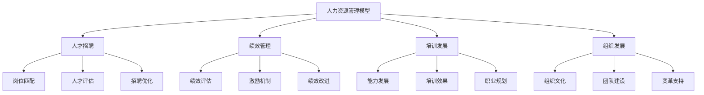
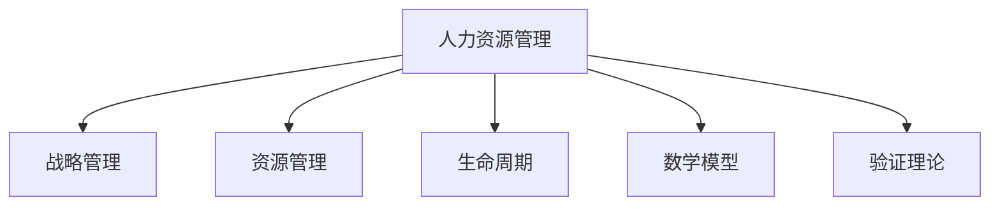

# 4.3.4 人力资源管理模型 / Human Resource Management Models

## 📋 Table of Contents / 目录

- [1. Overview / 概述](#1-overview--概述)
- [2. Definition / 定义](#2-definition--定义)
- [3. Properties / 属性](#3-properties--属性)
- [4. Relations / 关系](#4-relations--关系)
- [5. Examples / 实例](#5-examples--实例)
- [6. Explanations / 解释](#6-explanations--解释)
- [7. Argumentation / 论证](#7-argumentation--论证)
- [8. Applications / 应用](#8-applications--应用)
- [9. References / 参考文献](#9-references--参考文献)
- [10. Status / 状态](#10-status--状态)

---

## 1. Overview / 概述

人力资源管理是组织通过系统化方法优化人力资源配置，实现组织目标和个人发展的管理活动。本模型提供人力资源管理的形式化理论基础和实践应用框架。

**主题定位**: 本模型属于应用层（AL），是Formal-ProgramManage知识体系在人力资源管理领域的应用。

**主要内容**: 人力资源系统、人才招聘与岗位匹配、绩效管理、培训发展、组织发展与能力模型。

**学习目标**: 理解人力资源管理的形式化模型；掌握招聘、绩效、培训与组织发展的数学表示；能应用于项目与组织管理。

**标准对标**: PMI PMBOK 7th（项目资源、干系人）；ISO 30401（知识管理）；SHRM; HRCI; 人才管理最佳实践。

**知识体系层次结构**:

---

## 2. Definition / 定义

### 2.1 基础

**定义 2.1.1** (人力资源管理) 组织通过系统化方法优化人力资源配置，实现组织目标与个人发展的管理活动。

**定义 2.1.2** (人力资源系统) $HRS = (E, P, D, C)$：$E$ 员工集合，$P$ 岗位集合，$D$ 发展路径，$C$ 能力模型集合。

**定义 2.1.3** (岗位匹配度) $M = \sum_{i=1}^n w_i \cdot s_i$，$w_i$ 维度权重，$s_i$ 匹配分数。

**定义 2.1.4** (综合人才评估) $S = \alpha I + \beta T + \gamma P + \delta B$，$\alpha+\beta+\gamma+\delta=1$；$I$ 面试，$T$ 测试，$P$ 背景，$B$ 行为。

**定义 2.1.5** (KPI 绩效) $KPI = \sum_{i=1}^n w_i \cdot k_i$，$k_i$ 为第 $i$ 项 KPI 得分。

### 2.2 数学模型

**定义 2.2.1** (招聘优化) $RO = \max \sum_{i} M_i x_i$，s.t. $\sum_i c_i x_i \leq B$，$\sum_j x_{ij} \leq 1$；$M_i$ 匹配度，$c_i$ 成本，$B$ 预算。

---

## 3. Properties / 属性

### 3.1 匹配可度量性 (Match Measurability)

$M = \sum_i w_i s_i \in [0,1]$，匹配度可量化。

### 3.2 评估权重归一化 (Assessment Normalization)

$\alpha+\beta+\gamma+\delta=1$，$\sum_i w_i = 1$，评估权重归一。

### 3.3 资源有界性 (Resource Boundedness)

$\sum_i c_i x_i \leq B$，招聘与配置受预算约束。

### 3.4 岗位-人员一一性 (One-to-One Assignment)

$\sum_j x_{ij} \leq 1$，每人至多占一岗。

### 3.5 绩效可分解性 (Performance Decomposability)

$KPI = \sum_i w_i k_i$，绩效可分解为多指标加权。

---

## 4. Relations / 关系

$HRM \xrightarrow{supports} SM$（战略）；$HRM \xrightarrow{manages} RM$（资源）；$HRM \xrightarrow{aligns\_with} LCM$（生命周期）；$HRM \xrightarrow{extends} MM$（数学模型）；$HRM \xrightarrow{verified\_by} VT$（验证）。

---

## 5. Examples / 实例

### 5.1 Google 人才与绩效 (OKR、招聘 bar、People Analytics)

### 5.2 Netflix  talent density 与自由与责任文化

### 5.3 华为 以奋斗者为本、任职资格与培训体系

### 5.4 麦肯锡  up-or-out、导师制与知识共享

### 5.5 Salesforce  Ohana 文化、薪酬公平与 DEI 项目

---

## 6. Explanations / 解释

数学（加权与优化）；直观（选对人、激励人、发展人）；应用（招聘、绩效、继任、OD）；认知（公平、反馈、成长）；历史（人事→HR→人力资本）；哲学（人与组织共同发展）；技术（ATS、LMS、People Analytics）；实践（校准、差异化、沟通）；对比（不同绩效与激励体系）；系统（与战略、流程、系统集成）。

---

## 7. Argumentation / 论证

**定理 7.1** (匹配度有界) $M \in [0,1]$ 当 $s_i \in [0,1]$ 且 $\sum w_i=1$。
**定理 7.2** (招聘可行解) 当 $B\ge 0$ 时，$r_i=0$ 为可行解。
**定理 7.3** (KPI 单调性) 若某 $k_j$ 增加而其余不变，则 $KPI$ 增加。

---

## 8. Applications / 应用

人才招聘与优化；绩效与激励管理；培训与能力发展；组织发展与变革支持；人才梯队与继任管理。

---

## 9. References / 参考文献

### 9.1 Latest Research Frontiers (2020-2025)

1. People Analytics and AI in HR (2023–2024)
2. Future of Work and Hybrid Models (2023–2024)
3. DEI and Fairness in Hiring (2023–2024)
4. Skills-Based Organization (2024–2025)
5. Wellbeing and Performance (2023–2024)

### 9.2 权威教材

Ulrich, D. *Human Resource Champions*. SHRM; HRCI 知识体系。

### 9.3 国际标准

PMI PMBOK 7th; ISO 30401; SHRM/HRCI。

### 9.4 实际项目案例

Google, Netflix, 华为, 麦肯锡, Salesforce。

---

## 10. Status / 状态

**文档状态**: ✅ 基本完成（85%）。
**最后更新**: 2026-01-27。
含双语标题、目录、Overview、Definition、Properties、Relations、Examples、Explanations、Argumentation、Applications、References、Status。可增 Mermaid 图与案例细节。

---

**Related Documents**: [战略管理模型](./strategic-management.md) | [资源管理模型](../../02-project-management/resource-models.md) | [变革管理模型](./change-management.md)
