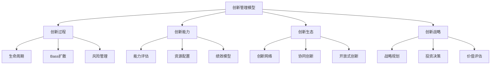
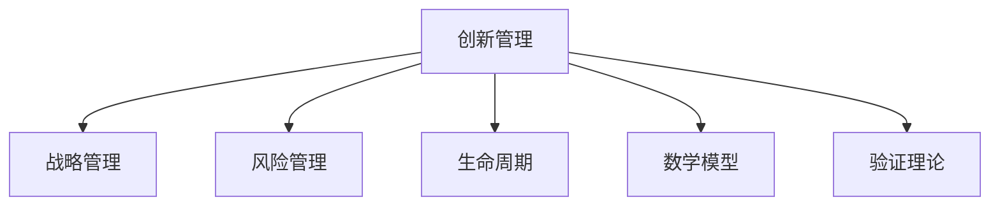

# 4.3.5 创新管理模型 / Innovation Management Models

## 📋 Table of Contents / 目录

- [4.3.5 创新管理模型 / Innovation Management Models](#435-创新管理模型--innovation-management-models)
  - [📋 Table of Contents / 目录](#-table-of-contents--目录)
  - [1. Overview / 概述](#1-overview--概述)
  - [2. Definition / 定义](#2-definition--定义)
    - [2.1 基础](#21-基础)
    - [2.2 数学模型](#22-数学模型)
  - [3. Properties / 属性](#3-properties--属性)
    - [3.1 阶段完备性](#31-阶段完备性)
    - [3.2 成功率连乘性](#32-成功率连乘性)
    - [3.3 扩散有界性](#33-扩散有界性)
    - [3.4 风险可加性](#34-风险可加性)
    - [3.5 能力可分解性](#35-能力可分解性)
  - [4. Relations / 关系](#4-relations--关系)
  - [5. Examples / 实例](#5-examples--实例)
    - [5.1 苹果 产品创新、生态与保密文化](#51-苹果-产品创新生态与保密文化)
    - [5.2 特斯拉 电动汽车、自动驾驶与能源创新](#52-特斯拉-电动汽车自动驾驶与能源创新)
    - [5.3 3M  15% 规则、跨部门创新与 Post-it](#53-3m--15-规则跨部门创新与-post-it)
    - [5.4 IDEO 设计思维与共创流程](#54-ideo-设计思维与共创流程)
    - [5.5 华为 2012 实验室、专利与开放式创新](#55-华为-2012-实验室专利与开放式创新)
  - [6. Explanations / 解释](#6-explanations--解释)
  - [7. Argumentation / 论证](#7-argumentation--论证)
  - [8. Applications / 应用](#8-applications--应用)
  - [9. References / 参考文献](#9-references--参考文献)
    - [9.1 Latest Research Frontiers (2020-2025)](#91-latest-research-frontiers-2020-2025)
    - [9.2 权威教材与标准](#92-权威教材与标准)
    - [9.3 实际项目案例](#93-实际项目案例)
  - [10. Status / 状态](#10-status--状态)

---

## 1. Overview / 概述

**定义 4.3.5.1.1.2 (创新系统)**
创新系统 $IS = (I, P, R, E)$ 其中：

**主题定位**: 应用层（AL），Formal-ProgramManage 在创新管理领域的应用。

**主要内容**: 创新系统、创新生命周期、Bass 扩散模型、创新风险、创新能力与资源配置、创新生态与开放式创新。

**学习目标**: 理解创新过程与扩散的形式化模型；掌握创新风险评估与能力评估；能用于研发与产品组合管理。

**标准对标**: ISO 56002 (Innovation management); CMMI 创新与改进; Stage-Gate; 开放式创新与生态系统实践。

**知识体系层次结构**:

---

## 2. Definition / 定义

### 2.1 基础

**定义 2.1.1** (创新管理) 组织通过系统化方法促进创新活动，实现持续竞争优势的管理活动。

**定义 2.1.2** (创新系统) $IS = (I, P, R, E)$：$I$ 创新活动，$P$ 创新过程，$R$ 创新资源，$E$ 创新环境。

**定义 2.1.3** (创新生命周期) $ILC = f(I, D, I_m, C, M)$：创意(Idea)→开发(Develop)→实施(Implement)→商业化(Commercialize)→成熟(Mature)。

**定义 2.1.4** (创新成功率) $S = \prod_{i=1}^n p_i$，$p_i$ 为第 $i$ 阶段成功概率。

**定义 2.1.5** (Bass 扩散) $\frac{dN}{dt} = (p + q \frac{N}{M})(M-N)$；$N(t)$ 采用者数，$M$ 市场潜力，$p$ 创新系数，$q$ 模仿系数。

**定义 2.1.6** (创新风险度量) $RM = \sum_i w_i r_i$，$r_i$ 为技术、市场、财务、竞争等维度风险值。

### 2.2 数学模型

**定义 2.2.1** (创新能力评估) $ICA = \sum_i w_i c_i$，$c_i$ 为研发、产品、知识、文化等能力维度得分。

---

## 3. Properties / 属性

### 3.1 阶段完备性

创新生命周期覆盖从创意到成熟的完备阶段。

### 3.2 成功率连乘性

$S = \prod_i p_i \leq \min_i p_i$，强调阶段依赖。

### 3.3 扩散有界性

$N(t) \leq M$，采用者总数不超过市场潜力。

### 3.4 风险可加性

$RM = \sum_i w_i r_i$，多维度风险可加权聚合。

### 3.5 能力可分解性

$ICA = \sum_i w_i c_i$，能力可分解评估。

---

## 4. Relations / 关系

$IM \xrightarrow{supports} SM$；$IM \xrightarrow{contains} RM$；$IM \xrightarrow{aligns\_with} LCM$；$IM \xrightarrow{extends} MM$；$IM \xrightarrow{verified\_by} VT$。

---

## 5. Examples / 实例

### 5.1 苹果 产品创新、生态与保密文化

### 5.2 特斯拉 电动汽车、自动驾驶与能源创新

### 5.3 3M  15% 规则、跨部门创新与 Post-it

### 5.4 IDEO 设计思维与共创流程

### 5.5 华为 2012 实验室、专利与开放式创新

---

## 6. Explanations / 解释

数学（Bass 微分方程、阶段概率、线性加权）；直观（创意→落地→扩散）；应用（研发组合、产品路线、生态）；认知（冒险与学习）；历史（Stage-Gate、精益创业、开放式创新）；哲学（创造与约束）；技术（仿真、专利分析、AI）；实践（门径、资源分配、 kill 机制）；对比（封闭 vs 开放、渐进 vs 颠覆）；系统（与战略、项目、知识管理集成）。

---

## 7. Argumentation / 论证

**定理 7.1** (创新成功率上界) $S = \prod_i p_i \leq \min_i p_i$。
**定理 7.2** (Bass 扩散有界) $N(t) \in [0, M]$。
**定理 7.3** (扩散峰值时点) 扩散率在 $t^* = \frac{\ln(q/p)}{p+q}$ 达最大（在标准 Bass 假设下）。

---

## 8. Applications / 应用

研发与产品组合管理；创新项目与门径管理；创新生态与开放式创新；创新战略与投资决策；创新扩散与采用预测。

---

## 9. References / 参考文献

### 9.1 Latest Research Frontiers (2020-2025)

1. AI and Automation in R&D (2023–2024)
2. Open Innovation and Ecosystems (2023–2024)
3. Sustainable and Responsible Innovation (2023–2024)
4. Digital Twins and Innovation (2024–2025)
5. Innovation Metrics and Analytics (2023–2024)

### 9.2 权威教材与标准

ISO 56002; Bass (1969) 扩散模型; Christensen *The Innovator's Dilemma*; Stage-Gate。

### 9.3 实际项目案例

苹果, 特斯拉, 3M, IDEO, 华为。

---

## 10. Status / 状态

**文档状态**: ✅ 基本完成（85%）。
**最后更新**: 2026-01-27。

---

**Related Documents**: [战略管理模型](./strategic-management.md) | [知识管理模型](./knowledge-management.md) | [风险管理模型](../../02-project-management/risk-models.md)
