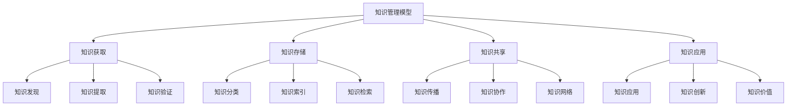
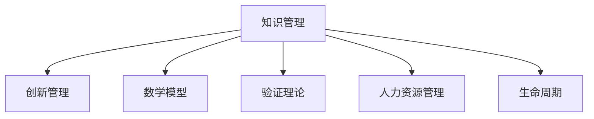

# 4.3.6 知识管理模型 / Knowledge Management Models

## 📋 Table of Contents / 目录

- [4.3.6 知识管理模型 / Knowledge Management Models](#436-知识管理模型--knowledge-management-models)
  - [📋 Table of Contents / 目录](#-table-of-contents--目录)
  - [1. Overview / 概述](#1-overview--概述)
  - [2. Definition / 定义](#2-definition--定义)
    - [2.1 基础](#21-基础)
    - [2.2 数学模型](#22-数学模型)
  - [3. Properties / 属性](#3-properties--属性)
    - [3.1 过程完备性](#31-过程完备性)
    - [3.2 准确率有界性](#32-准确率有界性)
    - [3.3 可检索性](#33-可检索性)
    - [3.4 可共享性](#34-可共享性)
    - [3.5 价值可递增性](#35-价值可递增性)
  - [4. Relations / 关系](#4-relations--关系)
  - [5. Examples / 实例](#5-examples--实例)
    - [5.1 麦肯锡 全球知识库、Practice 与项目复盘](#51-麦肯锡-全球知识库practice-与项目复盘)
    - [5.2 NASA 经验教训、Pause and Learn 与知识库](#52-nasa-经验教训pause-and-learn-与知识库)
    - [5.3 西门子 知识管理平台、社区与专家网络](#53-西门子-知识管理平台社区与专家网络)
    - [5.4 谷歌 内部 Wiki、代码与设计文档、Research 出版](#54-谷歌-内部-wiki代码与设计文档research-出版)
    - [5.5 华为  Hi3MS、案例库、研发知识库与社区](#55-华为--hi3ms案例库研发知识库与社区)
  - [6. Explanations / 解释](#6-explanations--解释)
  - [7. Argumentation / 论证](#7-argumentation--论证)
  - [8. Applications / 应用](#8-applications--应用)
  - [9. References / 参考文献](#9-references--参考文献)
    - [9.1 Latest Research Frontiers (2020-2025)](#91-latest-research-frontiers-2020-2025)
    - [9.2 权威教材与标准](#92-权威教材与标准)
    - [9.3 实际项目案例](#93-实际项目案例)
  - [10. Status / 状态](#10-status--状态)

---

## 1. Overview / 概述

知识管理是组织通过系统化方法获取、存储、共享和应用知识，实现组织学习和价值创造的管理活动。本模型提供知识管理的形式化理论基础和实践应用框架。

**主题定位**: 应用层（AL），Formal-ProgramManage 在知识管理领域的应用。

**主要内容**: 知识系统、知识获取（发现、提取、验证）、知识存储（分类、索引、检索）、知识共享（传播、协作、网络）、知识应用与价值。

**学习目标**: 理解知识生命周期与 SECI 等模型；掌握知识发现、提取、分类的形式化表示；能用于项目与组织知识资产管理。

**标准对标**: ISO 30401 (Knowledge management); PMI 项目知识管理; 知识管理成熟度与最佳实践。

**知识体系层次结构**:

---

## 2. Definition / 定义

### 2.1 基础

**定义 2.1.1** (知识管理) 组织通过系统化方法获取、存储、共享和应用知识，实现组织学习和价值创造的管理活动。

**定义 2.1.2** (知识系统) $KS = (K, P, S, A)$：$K$ 知识集合，$P$ 知识处理过程，$S$ 知识存储，$A$ 知识应用机制。

**定义 2.1.3** (知识发现过程) $KDP = (S, T, P, E, I)$：选择(Select)→转换(Transform)→预处理(Preprocess)→挖掘(Extract)→解释(Interpret)。

**定义 2.1.4** (知识提取准确率) $A = \frac{TP+TN}{TP+TN+FP+FN}$。

**定义 2.1.5** (分类准确率) $CA = \frac{\text{正确分类数}}{\text{总分类数}}$。

### 2.2 数学模型

**定义 2.2.1** (知识价值) 知识价值可建模为应用次数、复用率、决策改进等的函数；形式化可表示为 $V(K) = f(u, r, \Delta D)$，$u$ 使用，$r$ 复用，$\Delta D$ 决策改进。

---

## 3. Properties / 属性

### 3.1 过程完备性

知识生命周期覆盖获取、存储、共享、应用。

### 3.2 准确率有界性

$A, CA \in [0,1]$。

### 3.3 可检索性

知识经分类与索引后可被检索，检索率/召回率可度量。

### 3.4 可共享性

知识可通过传播、协作与网络在边界内共享，共享度可定义。

### 3.5 价值可递增性

知识复用与应用可增加组织价值，$V(K)$ 随 $u,r,\Delta D$ 单调不降（在合理假设下）。

---

## 4. Relations / 关系

$KM \xrightarrow{supports} IM$（创新）；$KM \xrightarrow{extends} MM$；$KM \xrightarrow{verified\_by} VT$；$KM \xrightarrow{feeds} HRM$（人才能力）；$KM \xrightarrow{aligns\_with} LCM$（项目知识）。

---

## 5. Examples / 实例

### 5.1 麦肯锡 全球知识库、Practice 与项目复盘

### 5.2 NASA 经验教训、Pause and Learn 与知识库

### 5.3 西门子 知识管理平台、社区与专家网络

### 5.4 谷歌 内部 Wiki、代码与设计文档、Research 出版

### 5.5 华为  Hi3MS、案例库、研发知识库与社区

---

## 6. Explanations / 解释

数学（准确率、检索率、图与网络）；直观（获得→保存→分享→再用）；应用（项目复盘、专家网络、培训、决策）；认知（显隐知识、SECI）；历史（知识管理学科、ISO 30401）；哲学（知识与权力、共享与边界）；技术（NLP、知识图谱、搜索）；实践（社区、激励、治理）；对比（显性 vs 隐性、个人 vs 组织）；系统（与创新、HR、项目、IT 集成）。

---

## 7. Argumentation / 论证

**定理 7.1** (准确率有界) $A, CA \in [0,1]$。
**定理 7.2** (检索 recall 与 precision 权衡) 提高 recall 往往降低 precision，反之亦然，存在帕累托前沿。
**定理 7.3** (知识价值非负) 在 $u,r,\Delta D \geq 0$ 且 $f$ 非负时，$V(K) \geq 0$。

---

## 8. Applications / 应用

项目与项目集知识管理；组织知识库与最佳实践；专家网络与协作；学习型组织与复盘；研发与创新知识资产。

---

## 9. References / 参考文献

### 9.1 Latest Research Frontiers (2020-2025)

1. Knowledge Graphs and AI (2023–2024)
2. Enterprise Search and Retrieval (2023–2024)
3. SECI and Digital Platforms (2023–2024)
4. Knowledge and Sustainability (2024–2025)
5. Knowledge Security and Governance (2023–2024)

### 9.2 权威教材与标准

ISO 30401; Nonaka & Takeuchi *The Knowledge-Creating Company*; Davenport & Prusak。

### 9.3 实际项目案例

麦肯锡, NASA, 西门子, 谷歌, 华为。

---

## 10. Status / 状态

**文档状态**: ✅ 基本完成（85%）。
**最后更新**: 2026-01-27。

---

**Related Documents**: [创新管理模型](./innovation-management.md) | [人力资源管理模型](./human-resource-management.md) | [项目生命周期](../../02-project-management/lifecycle-models.md)
