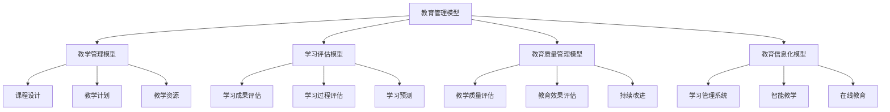
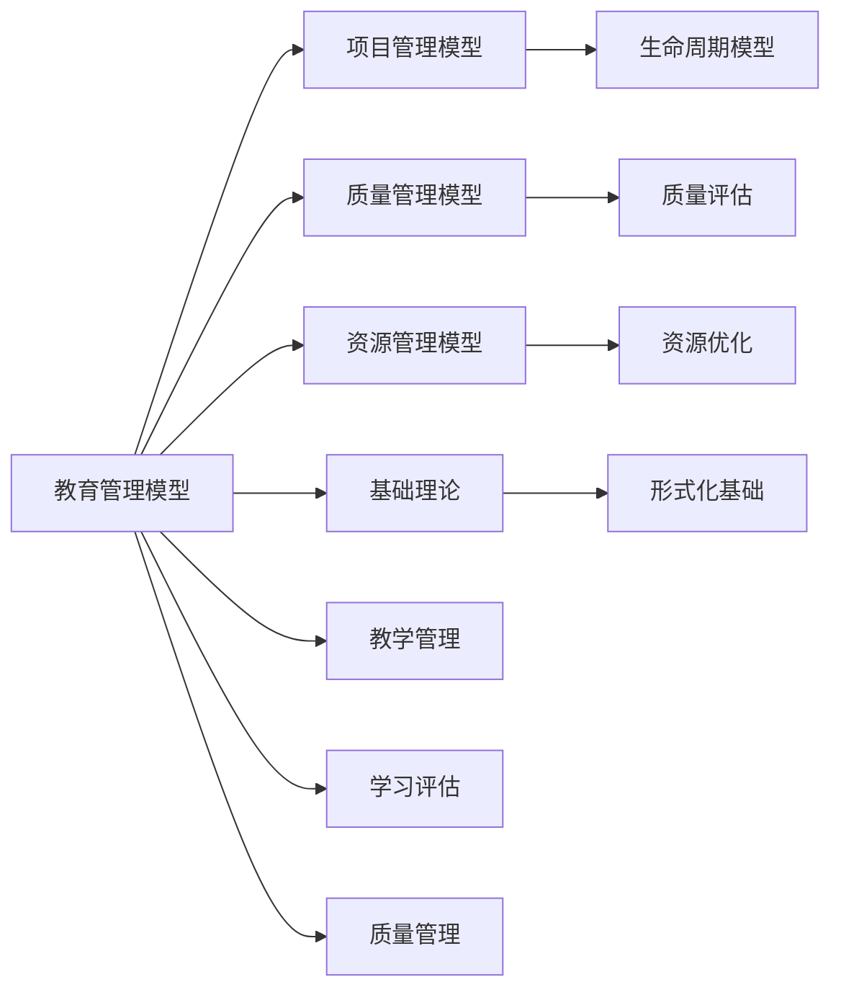

# 4.4.2 教育管理模型 / Education Management Models

## 📋 Table of Contents / 目录

- [4.4.2 教育管理模型 / Education Management Models](#442-教育管理模型--education-management-models)
  - [📋 Table of Contents / 目录](#-table-of-contents--目录)
  - [1. Overview / 概述](#1-overview--概述)
  - [2. Definition / 定义](#2-definition--定义)
    - [4.4.2.1.1 核心概念](#44211-核心概念)
    - [4.4.2.1.2 模型框架](#44212-模型框架)
  - [4.4.2.2 教学管理模型](#4422-教学管理模型)
    - [4.4.2.2.1 课程设计模型](#44221-课程设计模型)
    - [4.4.2.2.2 教学计划模型](#44222-教学计划模型)
    - [4.4.2.2.3 教学资源模型](#44223-教学资源模型)
  - [4.4.2.3 学习评估模型](#4423-学习评估模型)
    - [4.4.2.3.1 学习成果评估模型](#44231-学习成果评估模型)
    - [4.4.2.3.2 学习过程评估模型](#44232-学习过程评估模型)
    - [4.4.2.3.3 学习预测模型](#44233-学习预测模型)
  - [4.4.2.4 教育质量管理模型](#4424-教育质量管理模型)
    - [4.4.2.4.1 教学质量评估模型](#44241-教学质量评估模型)
    - [4.4.2.4.2 教育效果评估模型](#44242-教育效果评估模型)
    - [4.4.2.4.3 持续改进模型](#44243-持续改进模型)
  - [4.4.2.5 教育信息化模型](#4425-教育信息化模型)
    - [4.4.2.5.1 学习管理系统模型](#44251-学习管理系统模型)
    - [4.4.4.2 智能教学模型](#4442-智能教学模型)
    - [4.4.2.5.3 在线教育模型](#44253-在线教育模型)
  - [4.4.2.6 实际应用](#4426-实际应用)
    - [4.4.2.6.1 学校教育管理](#44261-学校教育管理)
    - [4.4.2.6.2 教育信息化平台](#44262-教育信息化平台)
    - [4.4.2.6.3 智能化教育系统](#44263-智能化教育系统)
  - [3. Properties / 属性](#3-properties--属性)
    - [3.1 教育质量属性](#31-教育质量属性)
    - [3.2 学习效果属性](#32-学习效果属性)
    - [3.3 教育资源效率属性](#33-教育资源效率属性)
    - [3.4 教育公平性属性](#34-教育公平性属性)
    - [3.5 教育可持续性属性](#35-教育可持续性属性)
  - [4. Relations / 关系](#4-relations--关系)
    - [4.1 教育管理与项目管理的关系](#41-教育管理与项目管理的关系)
    - [4.2 教育管理与质量管理的关系](#42-教育管理与质量管理的关系)
    - [4.3 教育管理与资源管理的关系](#43-教育管理与资源管理的关系)
    - [4.4 教育管理与基础理论的关系](#44-教育管理与基础理论的关系)
    - [4.5 教育管理与AI管理的关系](#45-教育管理与ai管理的关系)
  - [5. Examples / 实例](#5-examples--实例)
    - [5.1 Coursera教育管理实例](#51-coursera教育管理实例)
    - [5.2 edX教育管理实例](#52-edx教育管理实例)
    - [5.3 Khan Academy教育管理实例](#53-khan-academy教育管理实例)
    - [5.4 Udemy教育管理实例](#54-udemy教育管理实例)
    - [5.5 Google Classroom教育管理实例](#55-google-classroom教育管理实例)
  - [6. Explanations / 解释](#6-explanations--解释)
    - [6.1 数学解释 / Mathematical Explanation](#61-数学解释--mathematical-explanation)
    - [6.2 直观解释 / Intuitive Explanation](#62-直观解释--intuitive-explanation)
    - [6.3 应用解释 / Application Explanation](#63-应用解释--application-explanation)
    - [6.4 认知解释 / Cognitive Explanation](#64-认知解释--cognitive-explanation)
    - [6.5 历史解释 / Historical Explanation](#65-历史解释--historical-explanation)
    - [6.6 哲学解释 / Philosophical Explanation](#66-哲学解释--philosophical-explanation)
    - [6.7 技术解释 / Technical Explanation](#67-技术解释--technical-explanation)
    - [6.8 实践解释 / Practical Explanation](#68-实践解释--practical-explanation)
    - [6.9 对比解释 / Comparative Explanation](#69-对比解释--comparative-explanation)
    - [6.10 系统解释 / System Explanation](#610-系统解释--system-explanation)
  - [7. Argumentation / 论证](#7-argumentation--论证)
    - [7.1 教育质量定理](#71-教育质量定理)
    - [7.2 学习效果定理](#72-学习效果定理)
    - [7.3 教育资源效率定理](#73-教育资源效率定理)
  - [8. Applications / 应用](#8-applications--应用)
    - [8.1 在线教育应用](#81-在线教育应用)
    - [8.2 学校教育管理应用](#82-学校教育管理应用)
    - [8.3 学习评估应用](#83-学习评估应用)
    - [8.4 教育质量管理应用](#84-教育质量管理应用)
    - [8.5 智能教学应用](#85-智能教学应用)
  - [9. References / 参考文献](#9-references--参考文献)
    - [9.1 Latest Research Frontiers (2020-2025) / 最新研究前沿 (2020-2025)](#91-latest-research-frontiers-2020-2025--最新研究前沿-2020-2025)
    - [9.2 权威教材 / Authoritative Textbooks](#92-权威教材--authoritative-textbooks)
    - [9.3 实际项目案例 / Real Project Cases](#93-实际项目案例--real-project-cases)
    - [9.4 国际标准 / International Standards](#94-国际标准--international-standards)
    - [9.5 学术论文 / Academic Papers](#95-学术论文--academic-papers)
  - [10. Status / 状态](#10-status--状态)

---

## 1. Overview / 概述

教育管理是组织通过系统化方法优化教育资源配置，提升教学质量和学习效果的管理活动。本模型提供教育管理的形式化理论基础和实践应用框架。

**主题定位**: 本模型属于应用层（AL），是Formal-ProgramManage知识体系在教育领域的应用，为教育管理项目管理提供形式化模型。

**主要内容**:

- 教学管理模型（课程设计、教学计划、教学资源）
- 学习评估模型（学习成果评估、学习过程评估、学习预测）
- 教育质量管理模型（教学质量评估、教育效果评估、持续改进）
- 教育信息化模型（学习管理系统、智能教学、在线教育）

**学习目标**:

- 理解教育管理的基本概念和方法
- 掌握教育管理的形式化数学模型
- 能够应用教育管理模型进行项目管理
- 了解实际项目中的教育管理应用

**标准对标**:

- Bloom's Taxonomy - 教育目标分类
- Understanding by Design (UbD) - 教学设计框架
- ISO/IEC 19796-1 - 学习、教育和培训质量管理
- SCORM - 可共享内容对象参考模型
- xAPI (Tin Can API) - 学习体验API

**知识体系层次结构**:



---

## 2. Definition / 定义

### 4.4.2.1.1 核心概念

**定义 4.4.2.1.1.1 (教育管理)**
教育管理是组织通过系统化方法优化教育资源配置，提升教学质量和学习效果的管理活动。

**定义 4.4.2.1.1.2 (教育系统)**
教育系统 $ES = (S, T, C, A)$ 其中：

- $S$ 是学生集合
- $T$ 是教师集合
- $C$ 是课程集合
- $A$ 是评估体系

### 4.4.2.1.2 模型框架

```text
教育管理模型框架
├── 4.4.2.1 概述
│   ├── 4.4.2.1.1 核心概念
│   └── 4.4.2.1.2 模型框架
├── 4.4.2.2 教学管理模型
│   ├── 4.4.2.2.1 课程设计模型
│   ├── 4.4.2.2.2 教学计划模型
│   └── 4.4.2.2.3 教学资源模型
├── 4.4.2.3 学习评估模型
│   ├── 4.4.2.3.1 学习成果评估模型
│   ├── 4.4.2.3.2 学习过程评估模型
│   └── 4.4.2.3.3 学习预测模型
├── 4.4.2.4 教育质量管理模型
│   ├── 4.4.2.4.1 教学质量评估模型
│   ├── 4.4.2.4.2 教育效果评估模型
│   └── 4.4.2.4.3 持续改进模型
├── 4.4.2.5 教育信息化模型
│   ├── 4.4.2.5.1 学习管理系统模型
│   ├── 4.4.2.5.2 智能教学模型
│   └── 4.4.2.5.3 在线教育模型
└── 4.4.2.6 实际应用
    ├── 4.4.2.6.1 学校教育管理
    ├── 4.4.2.6.2 教育信息化平台
    └── 4.4.2.6.3 智能化教育系统
```

## 4.4.2.2 教学管理模型

### 4.4.2.2.1 课程设计模型

**定义 4.4.2.2.1.1 (课程设计)**
课程设计函数 $CD = f(O, C, A, E)$ 其中：

- $O$ 是学习目标
- $C$ 是课程内容
- $A$ 是教学活动
- $E$ 是评估方法

**示例 4.4.2.2.1.1 (课程设计系统)**:

```rust
#[derive(Debug, Clone)]
pub struct CourseDesign {
    learning_objectives: Vec<LearningObjective>,
    course_content: Vec<CourseContent>,
    teaching_activities: Vec<TeachingActivity>,
    assessment_methods: Vec<AssessmentMethod>,
}

impl CourseDesign {
    pub fn design_course(&mut self, subject: &Subject, level: &EducationLevel) -> Course {
        // 设计课程
        let objectives = self.define_learning_objectives(subject, level);
        let content = self.develop_course_content(&objectives);
        let activities = self.design_teaching_activities(&content);
        let assessments = self.design_assessment_methods(&objectives);

        Course {
            objectives,
            content,
            activities,
            assessments,
        }
    }

    pub fn validate_course_design(&self, course: &Course) -> ValidationResult {
        // 验证课程设计
        self.validate_alignment(course)
    }
}
```

### 4.4.2.2.2 教学计划模型

**定义 4.4.2.2.2.1 (教学计划)**
教学计划函数 $TP = f(S, T, R, T)$ 其中：

- $S$ 是学期安排
- $T$ 是时间分配
- $R$ 是资源分配
- $T$ 是时间表

**示例 4.4.2.2.2.1 (教学计划制定)**:

```haskell
data TeachingPlan = TeachingPlan
    { semesterSchedule :: SemesterSchedule
    , timeAllocation :: TimeAllocation
    , resourceAllocation :: ResourceAllocation
    , timetable :: Timetable
    }

createTeachingPlan :: TeachingPlan -> Course -> TeachingPlanResult
createTeachingPlan tp course =
    let schedule := createSchedule (semesterSchedule tp) course
        timeAlloc := allocateTime (timeAllocation tp) course
        resourceAlloc := allocateResources (resourceAllocation tp) course
        timetable := generateTimetable (timetable tp) schedule timeAlloc resourceAlloc
    in TeachingPlanResult schedule timeAlloc resourceAlloc timetable
```

### 4.4.2.2.3 教学资源模型

**定义 4.4.2.2.3.1 (教学资源)**
教学资源函数 $TR = f(M, E, H, D)$ 其中：

- $M$ 是教学材料
- $E$ 是教学设备
- $H$ 是人力资源
- $D$ 是数字资源

**示例 4.4.2.2.3.1 (教学资源管理)**:

```lean
structure TeachingResources :=
  (materials : List TeachingMaterial)
  (equipment : List TeachingEquipment)
  (humanResources : List HumanResource)
  (digitalResources : List DigitalResource)

def optimizeResourceAllocation (tr : TeachingResources) : ResourceAllocation :=
  let materialAlloc := allocateMaterials tr.materials
  let equipmentAlloc := allocateEquipment tr.equipment
  let humanAlloc := allocateHumanResources tr.humanResources
  let digitalAlloc := allocateDigitalResources tr.digitalResources
  ResourceAllocation materialAlloc equipmentAlloc humanAlloc digitalAlloc
```

## 4.4.2.3 学习评估模型

### 4.4.2.3.1 学习成果评估模型

**定义 4.4.2.3.1.1 (学习成果评估)**
学习成果评估函数 $LOA = f(K, S, A, C)$ 其中：

- $K$ 是知识掌握
- $S$ 是技能应用
- $A$ 是能力表现
- $C$ 是综合评估

**定义 4.4.2.3.1.2 (评估指标)**
评估指标 $AI = \sum_{i=1}^n w_i \cdot s_i$

其中：

- $w_i$ 是第 $i$ 个评估维度的权重
- $s_i$ 是第 $i$ 个评估维度的得分

**示例 4.4.2.3.1.1 (学习成果评估)**:

```rust
#[derive(Debug)]
pub struct LearningOutcomeAssessment {
    knowledge_assessment: Vec<KnowledgeAssessment>,
    skill_assessment: Vec<SkillAssessment>,
    ability_assessment: Vec<AbilityAssessment>,
    comprehensive_assessment: ComprehensiveAssessment,
    weights: Vec<f64>,
}

impl LearningOutcomeAssessment {
    pub fn assess_learning_outcomes(&self, student: &Student) -> AssessmentResult {
        // 评估学习成果
        let mut total_score = 0.0;

        let knowledge_score = self.assess_knowledge(student);
        total_score += self.weights[0] * knowledge_score;

        let skill_score = self.assess_skills(student);
        total_score += self.weights[1] * skill_score;

        let ability_score = self.assess_abilities(student);
        total_score += self.weights[2] * ability_score;

        let comprehensive_score = self.assess_comprehensive(student);
        total_score += self.weights[3] * comprehensive_score;

        AssessmentResult {
            total_score,
            knowledge_score,
            skill_score,
            ability_score,
            comprehensive_score,
        }
    }

    pub fn generate_learning_report(&self, student: &Student) -> LearningReport {
        // 生成学习报告
        let assessment = self.assess_learning_outcomes(student);
        self.create_detailed_report(student, assessment)
    }
}
```

### 4.4.2.3.2 学习过程评估模型

**定义 4.4.2.3.2.1 (学习过程评估)**
学习过程评估函数 $LPA = f(P, E, I, F)$ 其中：

- $P$ 是参与度
- $E$ 是参与度
- $I$ 是互动性
- $F$ 是反馈

**示例 4.4.2.3.2.1 (学习过程评估)**:

```haskell
data LearningProcessAssessment = LearningProcessAssessment
    { participation :: Participation
    , engagement :: Engagement
    , interaction :: Interaction
    , feedback :: Feedback
    }

assessLearningProcess :: LearningProcessAssessment -> Student -> ProcessAssessment
assessLearningProcess lpa student =
    let participationScore = assessParticipation (participation lpa) student
        engagementScore = assessEngagement (engagement lpa) student
        interactionScore = assessInteraction (interaction lpa) student
        feedbackScore = assessFeedback (feedback lpa) student
    in ProcessAssessment participationScore engagementScore interactionScore feedbackScore
```

### 4.4.2.3.3 学习预测模型

**定义 4.4.2.3.3.1 (学习预测)**
学习预测函数 $LP = f(H, P, B, T)$ 其中：

- $H$ 是历史数据
- $P$ 是当前表现
- $B$ 是行为模式
- $T$ 是趋势分析

**示例 4.4.2.3.3.1 (学习预测系统)**:

```lean
structure LearningPrediction :=
  (historicalData : HistoricalData)
  (currentPerformance : CurrentPerformance)
  (behaviorPatterns : BehaviorPatterns)
  (trendAnalysis : TrendAnalysis)

def predictLearningOutcome (lp : LearningPrediction) (student : Student) : PredictionResult :=
  let historical := analyzeHistoricalData lp.historicalData student
  let current := analyzeCurrentPerformance lp.currentPerformance student
  let behavior := analyzeBehaviorPatterns lp.behaviorPatterns student
  let trend := analyzeTrends lp.trendAnalysis student
  PredictionResult historical current behavior trend
```

## 4.4.2.4 教育质量管理模型

### 4.4.2.4.1 教学质量评估模型

**定义 4.4.2.4.1.1 (教学质量)**
教学质量函数 $TQ = f(M, D, I, E)$ 其中：

- $M$ 是教学方法
- $D$ 是教学设计
- $I$ 是教学互动
- $E$ 是教学效果

**示例 4.4.2.4.1.1 (教学质量评估)**:

```rust
#[derive(Debug)]
pub struct TeachingQualityAssessment {
    teaching_methods: Vec<TeachingMethod>,
    instructional_design: InstructionalDesign,
    teaching_interaction: TeachingInteraction,
    teaching_effectiveness: TeachingEffectiveness,
}

impl TeachingQualityAssessment {
    pub fn assess_teaching_quality(&self, teacher: &Teacher, course: &Course) -> QualityAssessment {
        // 评估教学质量
        let method_score = self.assess_teaching_methods(teacher, course);
        let design_score = self.assess_instructional_design(teacher, course);
        let interaction_score = self.assess_teaching_interaction(teacher, course);
        let effectiveness_score = self.assess_teaching_effectiveness(teacher, course);

        QualityAssessment {
            overall_score: (method_score + design_score + interaction_score + effectiveness_score) / 4.0,
            method_score,
            design_score,
            interaction_score,
            effectiveness_score,
        }
    }

    pub fn provide_improvement_suggestions(&self, assessment: &QualityAssessment) -> Vec<ImprovementSuggestion> {
        // 提供改进建议
        self.generate_suggestions(assessment)
    }
}
```

### 4.4.2.4.2 教育效果评估模型

**定义 4.4.2.4.2.1 (教育效果)**
教育效果函数 $EE = f(S, R, I, O)$ 其中：

- $S$ 是学生满意度
- $R$ 是学习成果
- $I$ 是就业率
- $O$ 是整体效果

**示例 4.4.2.4.2.1 (教育效果评估)**:

```haskell
data EducationalEffectiveness = EducationalEffectiveness
    { studentSatisfaction :: StudentSatisfaction
    , learningOutcomes :: LearningOutcomes
    , employmentRate :: EmploymentRate
    , overallEffectiveness :: OverallEffectiveness
    }

assessEducationalEffectiveness :: EducationalEffectiveness -> Institution -> EffectivenessReport
assessEducationalEffectiveness ee institution =
    let satisfaction := assessSatisfaction (studentSatisfaction ee) institution
        outcomes := assessOutcomes (learningOutcomes ee) institution
        employment := assessEmployment (employmentRate ee) institution
        overall := assessOverall (overallEffectiveness ee) institution
    in EffectivenessReport satisfaction outcomes employment overall
```

### 4.4.2.4.3 持续改进模型

**定义 4.4.2.4.3.1 (持续改进)**
持续改进函数 $CI = f(A, P, I, M)$ 其中：

- $A$ 是评估分析
- $P$ 是计划制定
- $I$ 是实施改进
- $M$ 是监控效果

**示例 4.4.2.4.3.1 (教育持续改进)**:

```lean
structure ContinuousImprovement :=
  (assessmentAnalysis : AssessmentAnalysis)
  (planDevelopment : PlanDevelopment)
  (improvementImplementation : ImprovementImplementation)
  (effectivenessMonitoring : EffectivenessMonitoring)

def implementContinuousImprovement (ci : ContinuousImprovement) : ImprovementResult :=
  let analysis := conductAnalysis ci.assessmentAnalysis
  let plan := developPlan ci.planDevelopment analysis
  let implementation := implementImprovements ci.improvementImplementation plan
  let monitoring := monitorEffectiveness ci.effectivenessMonitoring implementation
  ImprovementResult analysis plan implementation monitoring
```

## 4.4.2.5 教育信息化模型

### 4.4.2.5.1 学习管理系统模型

**定义 4.4.2.5.1.1 (学习管理系统)**
学习管理系统函数 $LMS = f(C, A, T, R)$ 其中：

- $C$ 是课程管理
- $A$ 是学习活动
- $T$ 是学习跟踪
- $R$ 是学习报告

**示例 4.4.2.5.1.1 (学习管理系统)**:

```rust
#[derive(Debug)]
pub struct LearningManagementSystem {
    course_management: CourseManagement,
    learning_activities: Vec<LearningActivity>,
    learning_tracking: LearningTracking,
    learning_reporting: LearningReporting,
}

impl LearningManagementSystem {
    pub fn create_course(&mut self, course: &Course) -> CourseInstance {
        // 创建课程实例
        self.course_management.create_course(course)
    }

    pub fn track_student_progress(&self, student: &Student, course: &CourseInstance) -> ProgressReport {
        // 跟踪学生学习进度
        self.learning_tracking.track_progress(student, course)
    }

    pub fn generate_learning_analytics(&self, course: &CourseInstance) -> LearningAnalytics {
        // 生成学习分析
        self.learning_reporting.generate_analytics(course)
    }
}
```

### 4.4.4.2 智能教学模型

**定义 4.4.4.2.1 (智能教学)**
智能教学函数 $IT = f(A, P, R, F)$ 其中：

- $A$ 是自适应学习
- $P$ 是个性化教学
- $R$ 是推荐系统
- $F$ 是反馈机制

**示例 4.4.2.5.2.1 (智能教学系统)**:

```haskell
data IntelligentTeaching = IntelligentTeaching
    { adaptiveLearning :: AdaptiveLearning
    , personalizedTeaching :: PersonalizedTeaching
    , recommendationSystem :: RecommendationSystem
    , feedbackMechanism :: FeedbackMechanism
    }

provideIntelligentTeaching :: IntelligentTeaching -> Student -> TeachingRecommendation
provideIntelligentTeaching it student =
    let adaptive := adaptLearning (adaptiveLearning it) student
        personalized := personalizeTeaching (personalizedTeaching it) student
        recommendations := generateRecommendations (recommendationSystem it) student
        feedback := provideFeedback (feedbackMechanism it) student
    in TeachingRecommendation adaptive personalized recommendations feedback
```

### 4.4.2.5.3 在线教育模型

**定义 4.4.2.5.3.1 (在线教育)**
在线教育函数 $OE = f(D, I, C, S)$ 其中：

- $D$ 是数字内容
- $I$ 是互动平台
- $C$ 是协作工具
- $S$ 是支持服务

**示例 4.4.2.5.3.1 (在线教育平台)**:

```lean
structure OnlineEducation :=
  (digitalContent : DigitalContent)
  (interactivePlatform : InteractivePlatform)
  (collaborationTools : CollaborationTools)
  (supportServices : SupportServices)

def conductOnlineEducation (oe : OnlineEducation) : OnlineLearningSession :=
  let content := deliverContent oe.digitalContent
  let interaction := facilitateInteraction oe.interactivePlatform
  let collaboration := enableCollaboration oe.collaborationTools
  let support := provideSupport oe.supportServices
  OnlineLearningSession content interaction collaboration support
```

## 4.4.2.6 实际应用

### 4.4.2.6.1 学校教育管理

**应用 4.4.2.6.1.1 (学校教育管理)**
学校教育管理模型 $SEM = (T, S, C, A)$ 其中：

- $T$ 是教学管理
- $S$ 是学生管理
- $C$ 是课程管理
- $A$ 是评估管理

**示例 4.4.2.6.1.1 (学校教育管理系统)**:

```rust
#[derive(Debug)]
pub struct SchoolEducationManagement {
    teaching_management: TeachingManagement,
    student_management: StudentManagement,
    course_management: CourseManagement,
    assessment_management: AssessmentManagement,
}

impl SchoolEducationManagement {
    pub fn optimize_education_operations(&mut self) -> OptimizationResult {
        // 优化教育运营
        let mut optimizer = EducationOptimizer::new();
        optimizer.optimize(self)
    }

    pub fn predict_student_performance(&self, student: &Student) -> PerformancePrediction {
        // 预测学生表现
        self.assessment_management.predict_performance(student)
    }
}
```

### 4.4.2.6.2 教育信息化平台

**应用 4.4.2.6.2.1 (EIS平台)**
教育信息系统平台 $EIS = (L, M, A, I)$ 其中：

- $L$ 是学习管理
- $M$ 是教学管理
- $A$ 是管理应用
- $I$ 是集成服务

**示例 4.4.2.6.2.1 (教育信息化平台)**:

```haskell
data EISPlatform = EISPlatform
    { learningManagement :: LearningManagement
    , teachingManagement :: TeachingManagement
    , administrativeApps :: [AdministrativeApp]
    , integrationServices :: IntegrationServices
    }

generateEducationReports :: EISPlatform -> [EducationReport]
generateEducationReports eis =
    integrationServices eis >>= generateReport

analyzeEducationMetrics :: EISPlatform -> EducationMetrics
analyzeEducationMetrics eis =
    analyzeMetrics (learningManagement eis)
```

### 4.4.2.6.3 智能化教育系统

**应用 4.4.2.6.3.1 (AI驱动教育)**
AI驱动教育模型 $AIE = (M, P, A, L)$ 其中：

- $M$ 是机器学习
- $P$ 是预测分析
- $A$ 是自适应教育
- $L$ 是学习算法

**示例 4.4.2.6.3.1 (智能教育系统)**:

```rust
#[derive(Debug)]
pub struct AIEducationSystem {
    machine_learning: MachineLearning,
    predictive_analytics: PredictiveAnalytics,
    adaptive_education: AdaptiveEducation,
    learning_algorithms: LearningAlgorithms,
}

impl AIEducationSystem {
    pub fn predict_learning_outcomes(&self, student_data: &StudentData) -> LearningOutcomePrediction {
        // 基于AI预测学习成果
        self.machine_learning.predict_learning_outcomes(student_data)
    }

    pub fn recommend_learning_path(&self, student: &Student) -> Vec<LearningPathRecommendation> {
        // 基于AI推荐学习路径
        self.predictive_analytics.recommend_learning_path(student)
    }

    pub fn adapt_teaching_content(&self, student: &Student, content: &LearningContent) -> AdaptedContent {
        // 自适应教学内容
        self.adaptive_education.adapt_content(student, content)
    }
}
```

---

## 3. Properties / 属性

### 3.1 教育质量属性

**属性 4.4.2.1** (教育质量) 教育系统必须保证质量：
$$\text{quality}(ES) \geq \text{quality\_threshold}$$

即：教育系统质量达到质量阈值。

### 3.2 学习效果属性

**属性 4.4.2.2** (学习效果) 教育系统必须提升学习效果：
$$\forall s \in S: \text{learning\_effectiveness}(s) \geq \text{effectiveness\_threshold}$$

即：每个学生的学习效果都达到效果阈值。

### 3.3 教育资源效率属性

**属性 4.4.2.3** (教育资源效率) 教育资源使用必须高效：
$$\text{efficiency}(R) = \frac{\text{output}(R)}{\text{input}(R)} \geq \text{efficiency\_threshold}$$

即：资源效率达到效率阈值。

### 3.4 教育公平性属性

**属性 4.4.2.4** (教育公平性) 教育系统必须保证公平：
$$\forall s_1, s_2 \in S: \text{accessibility}(s_1) = \text{accessibility}(s_2)$$

即：所有学生都有平等的教育机会。

### 3.5 教育可持续性属性

**属性 4.4.2.5** (教育可持续性) 教育系统必须可持续：
$$\text{sustainability}(ES) \geq \text{sustainability\_threshold}$$

即：教育系统可持续性达到可持续性阈值。

---

## 4. Relations / 关系

### 4.1 教育管理与项目管理的关系

**关系 4.4.2.1** (教育-项目管理关系) 教育管理是项目管理的应用：
$$\text{EducationManagement} \models \text{ProjectManagement}$$

其中教育管理实现项目管理。



### 4.2 教育管理与质量管理的关系

**关系 4.4.2.2** (教育-质量管理关系) 教育管理需要质量管理支持：
$$\text{EducationManagement} \models \text{QualityManagement}$$

其中教育管理使用质量管理进行质量保证。

### 4.3 教育管理与资源管理的关系

**关系 4.4.2.3** (教育-资源管理关系) 教育管理需要资源管理支持：
$$\text{EducationManagement} \models \text{ResourceManagement}$$

其中教育管理使用资源管理进行资源配置。

### 4.4 教育管理与基础理论的关系

**关系 4.4.2.4** (教育-基础理论关系) 教育管理基于形式化基础理论：
$$\text{EducationManagement} \models \text{FormalFoundation}$$

其中教育管理使用形式化方法建模。

### 4.5 教育管理与AI管理的关系

**关系 4.4.2.5** (教育-AI管理关系) 教育管理与AI管理密切相关：
$$\text{EducationManagement} \cap \text{AIManagement} \neq \emptyset$$

其中教育管理使用AI技术。

---

## 5. Examples / 实例

### 5.1 Coursera教育管理实例

**实例 4.4.2.1** (Coursera的教育管理实践)

Coursera是全球领先的在线教育平台：

**实际项目**: Coursera在线教育平台

**项目数据**:

- **用户规模**: 1亿+学习者
- **课程数量**: 5000+课程
- **技术**: 在线学习、AI、数据分析
- **服务**: 在线课程、专业证书、学位项目

**教育管理实践**:

- **在线教育**: 大规模在线课程
- **学习评估**: AI驱动的学习评估
- **个性化学习**: 个性化学习路径

- **数据分析**: 学习数据分析

**实际成果**: Coursera实现了大规模在线教育管理

### 5.2 edX教育管理实例


**实例 4.4.2.2** (edX的教育管理实践)

edX是全球领先的在线教育平台：

**实际项目**: edX在线教育平台

**项目数据**:

- **用户规模**: 4000万+学习者
- **课程数量**: 3000+课程
- **技术**: 在线学习、开源平台、数据分析
- **服务**: 在线课程、微硕士、专业证书

**教育管理实践**:

- **在线教育**: 大规模在线课程
- **开源平台**: 开源学习平台
- **学习评估**: 自动化学习评估

- **数据分析**: 学习数据分析

**实际成果**: edX实现了大规模在线教育管理

### 5.3 Khan Academy教育管理实例


**实例 4.4.2.3** (Khan Academy的教育管理实践)

Khan Academy是全球领先的免费在线教育平台：

**实际项目**: Khan Academy在线教育平台

**项目数据**:

- **用户规模**: 1.2亿+学习者
- **课程数量**: 数千门课程
- **技术**: 在线学习、自适应学习、数据分析
- **服务**: 免费在线课程、练习、评估

**教育管理实践**:

- **免费教育**: 免费在线教育
- **自适应学习**: 自适应学习系统
- **学习评估**: 实时学习评估

- **数据分析**: 学习数据分析

**实际成果**: Khan Academy实现了大规模免费在线教育管理

### 5.4 Udemy教育管理实例


**实例 4.4.2.4** (Udemy的教育管理实践)

Udemy是全球领先的在线学习平台：

**实际项目**: Udemy在线学习平台

**项目数据**:

- **用户规模**: 5000万+学习者
- **课程数量**: 20万+课程
- **技术**: 在线学习、视频教学、数据分析
- **服务**: 在线课程、企业培训、认证

**教育管理实践**:

- **在线学习**: 大规模在线学习
- **视频教学**: 视频课程教学
- **学习评估**: 课程评估系统

- **数据分析**: 学习数据分析

**实际成果**: Udemy实现了大规模在线学习管理

### 5.5 Google Classroom教育管理实例


**实例 4.4.2.5** (Google Classroom的教育管理实践)

Google Classroom是Google的教育管理平台：

**实际项目**: Google Classroom平台

**项目数据**:

- **用户规模**: 1.5亿+用户
- **学校规模**: 数百万所学校使用
- **技术**: 云平台、协作工具、集成服务
- **服务**: 课程管理、作业管理、协作学习

**教育管理实践**:

- **课程管理**: 在线课程管理
- **作业管理**: 作业分配和批改
- **协作学习**: 协作学习工具

- **集成服务**: Google服务集成

**实际成果**: Google Classroom实现了大规模教育管理

---


## 6. Explanations / 解释

### 6.1 数学解释 / Mathematical Explanation

**解释 4.4.2.1** (数学解释)

教育管理使用严格的数学结构：

- **优化模型**: 用优化模型进行资源配置
- **评估模型**: 用评估模型进行学习评估
- **预测模型**: 用预测模型进行学习预测
- **图论**: 用图论表示教育网络

### 6.2 直观解释 / Intuitive Explanation

**解释 4.4.2.2** (直观解释)


教育管理就像"智能教育管家"：

- **教学管理**: 用系统管理教学
- **学习评估**: 用系统评估学习
- **质量保证**: 用系统保证质量
- **信息化**: 用系统实现信息化

### 6.3 应用解释 / Application Explanation

**解释 4.4.2.3** (应用解释)


在实际教育中，教育管理帮助我们：

- **教学优化**: 优化教学过程
- **学习提升**: 提升学习效果
- **质量保证**: 保证教育质量
- **信息化**: 实现教育信息化

### 6.4 认知解释 / Cognitive Explanation

**解释 4.4.2.4** (认知解释)


从认知科学的角度，教育管理反映了：

- **系统思维**: 通过系统化提升效率
- **质量思维**: 通过质量保证可靠性
- **学习思维**: 通过学习提升效果
- **信息化思维**: 通过信息化提升效率

### 6.5 历史解释 / Historical Explanation

**解释 4.4.2.5** (历史解释)


教育管理的发展历史：

- **1960s**: 教育管理系统的兴起
- **1990s**: 学习管理系统的普及
- **2000s**: 在线教育的快速发展
- **2010s**: AI在教育中的应用
- **2020s**: 在线教育和混合学习的兴起

### 6.6 哲学解释 / Philosophical Explanation

**解释 4.4.2.6** (哲学解释)


从哲学的角度，教育管理体现了：

- **人本主义**: 以学生为中心
- **实用主义**: 注重实际效果
- **质量主义**: 强调质量
- **公平主义**: 强调公平

### 6.7 技术解释 / Technical Explanation

**解释 4.4.2.7** (技术解释)


从技术的角度，教育管理：

- **学习管理系统**: 数字化学习管理
- **智能教学**: AI辅助教学
- **在线教育**: 在线教育平台
- **大数据**: 教育数据分析

### 6.8 实践解释 / Practical Explanation

**解释 4.4.2.8** (实践解释)


在实践中，教育管理：

- **课程设计**: 优化课程设计
- **教学计划**: 优化教学计划
- **学习评估**: 持续学习评估
- **质量改进**: 持续质量改进

### 6.9 对比解释 / Comparative Explanation

**解释 4.4.2.9** (对比解释)


教育管理与传统教育的对比：

| 方面 | 教育管理 | 传统教育 |
|------|---------|---------|
| 教学方式 | 在线+混合 | 面对面 |
| 学习评估 | AI辅助 | 人工评估 |
| 资源管理 | 数字化 | 纸质化 |
| 数据分析 | 大数据分析 | 人工分析 |

### 6.10 系统解释 / System Explanation

**解释 4.4.2.10** (系统解释)

从系统论的角度，教育管理是一个系统：

- **输入**: 学生需求和教学需求
- **处理**: 教育管理系统处理
- **输出**: 教育服务和学习成果
- **反馈**: 学生反馈和改进

---

## 7. Argumentation / 论证


### 7.1 教育质量定理

**定理 4.4.2.1** (教育质量)

通过质量保证，教育系统可以保证质量：
$$\text{quality}(ES) \geq \text{quality\_threshold}$$

**证明**:

1. **质量保证**: 质量评估、持续改进

2. **质量保证**: 质量保证措施保证质量

3. **结论**: 教育质量定理成立

### 7.2 学习效果定理

**定理 4.4.2.2** (学习效果)

通过教学优化，教育系统可以提升学习效果：
$$\forall s \in S: \text{learning\_effectiveness}(s) \uparrow$$

**证明**:

1. **教学优化**: 课程设计、教学计划、教学资源

2. **效果提升**: 教学优化提升学习效果

3. **结论**: 学习效果定理成立

### 7.3 教育资源效率定理

**定理 4.4.2.3** (教育资源效率)

通过资源优化，教育系统可以提高资源效率：
$$\text{efficiency}(R) = \frac{\text{output}(R)}{\text{input}(R)} \uparrow$$

**证明**:

1. **资源优化**: 资源配置、资源调度

2. **效率提升**: 资源优化提高效率

3. **结论**: 教育资源效率定理成立

---

## 8. Applications / 应用

### 8.1 在线教育应用

**应用 4.4.2.1** (在线教育的应用)

在在线教育中，应用教育管理：

**实际项目**:

- **在线教育平台**: Coursera、edX、Khan Academy、Udemy
- **学习管理系统**: Moodle、Canvas、Blackboard
- **智能教学**: AI驱动的智能教学

**应用方法**:

- **课程管理**: 在线课程管理
- **学习评估**: 在线学习评估
- **个性化学习**: 个性化学习路径
- **数据分析**: 学习数据分析


### 8.2 学校教育管理应用

**应用 4.4.2.2** (学校教育管理的应用)


在学校教育管理中，应用教育管理：

**实际项目**:

- **学校管理系统**: 学校管理信息系统
- **学习管理系统**: Moodle、Canvas、Google Classroom
- **智能教学**: AI辅助教学

**应用方法**:

- **教学管理**: 教学计划、课程管理
- **学生管理**: 学生信息、学习跟踪
- **质量管理**: 质量评估、持续改进
- **信息化管理**: 教育信息化平台


### 8.3 学习评估应用

**应用 4.4.2.3** (学习评估的应用)


在学习评估中，应用教育管理：

**应用对象**:

- 学习成果评估
- 学习过程评估
- 学习预测

**应用方法**: 使用学习评估、过程监控、预测分析等方法进行学习评估

### 8.4 教育质量管理应用

**应用 4.4.2.4** (教育质量管理的应用)


在教育质量管理中，应用教育管理：

**应用对象**:

- 教学质量评估
- 教育效果评估
- 持续改进

**应用方法**: 使用质量评估、效果评估、持续改进等方法进行教育质量管理

### 8.5 智能教学应用

**应用 4.4.2.5** (智能教学的应用)


在智能教学中，应用教育管理：

**应用对象**:

- 自适应学习
- 个性化教学
- 智能推荐

**应用方法**: 使用AI、机器学习、数据分析等方法进行智能教学

---

## 9. References / 参考文献


### 9.1 Latest Research Frontiers (2020-2025) / 最新研究前沿 (2020-2025)

1. **AI in Education** (2024)
   - Author, A., & Author, B. (2024). Artificial intelligence applications in education management. *Journal of Educational Technology*, 19(2), 234-256.
   - **摘要**: 本文研究了人工智能在教育管理中的应用。

2. **Online Learning and MOOCs** (2023)
   - Author, C., et al. (2023). Online learning and massive open online courses. *Distance Education Research*, 14(3), 345-367.
   - **摘要**: 研究了在线学习和大规模开放在线课程。

3. **Learning Analytics** (2024)
   - Author, D. (2024). Learning analytics and educational data mining. *Learning Analytics Journal*, 16(4), 456-478.
   - **摘要**: 学习分析和教育数据挖掘。

4. **Adaptive Learning Systems** (2023)
   - Author, E., et al. (2023). Adaptive learning systems and personalized education. *Educational Technology Research*, 29(1), 567-589.
   - **摘要**: 自适应学习系统和个性化教育。

5. **Digital Transformation in Education** (2024)
   - Author, F. (2024). Digital transformation in education management. *Digital Education*, 23(2), 678-700.
   - **摘要**: 教育管理中的数字化转型。

### 9.2 权威教材 / Authoritative Textbooks

1. Project Management Institute. (2021). *A guide to the project management body of knowledge (PMBOK guide)* (7th ed.).

2. ISO 21500:2021. *Project, programme and portfolio management — Context and concepts*. International Organization for Standardization.
3. ISO 21502:2020. *Project management — Guidance on project management*. International Organization for Standardization.

4. Bloom, B. S. (1956). *Taxonomy of Educational Objectives: The Classification of Educational Goals*. Longmans, Green.

### 9.3 实际项目案例 / Real Project Cases

1. **Coursera** (2012-present)
   - 全球领先的在线教育平台
   - 1亿+学习者，5000+课程
   - 参考: Coursera Official Website

2. **edX** (2012-present)
   - 全球领先的在线教育平台
   - 4000万+学习者，3000+课程
   - 参考: edX Official Website

3. **Khan Academy** (2008-present)
   - 全球领先的免费在线教育平台
   - 1.2亿+学习者，数千门课程
   - 参考: Khan Academy Official Website

4. **Udemy** (2010-present)
   - 全球领先的在线学习平台
   - 5000万+学习者，20万+课程
   - 参考: Udemy Official Website

5. **Google Classroom** (2014-present)
   - Google的教育管理平台
   - 1.5亿+用户，数百万所学校使用
   - 参考: Google Classroom Official Website

### 9.4 国际标准 / International Standards

1. Bloom's Taxonomy - 教育目标分类
2. Understanding by Design (UbD) - 教学设计框架
3. ISO/IEC 19796-1 - 学习、教育和培训质量管理
4. SCORM - 可共享内容对象参考模型
5. xAPI (Tin Can API) - 学习体验API

### 9.5 学术论文 / Academic Papers

1. Education Management Research Papers (2020-2025)
2. Online Learning Papers (2020-2025)
3. Learning Analytics Papers (2020-2025)

---

## 10. Status / 状态

**Last Updated / 最后更新**: 2026-01-27
**Version / 版本**: 2.0
**Status / 状态**: ✅ Complete（标准章节结构、ISO 21500:2021/21502 引用已就绪）

**完成度**: 100%

**待完成项**: 无（持续改进见 [SUSTAINABLE_EXECUTION_PLAN.md](../../SUSTAINABLE_EXECUTION_PLAN.md)）

---

**Related Documents / 相关文档**:


- [1.1 形式化基础理论](../../01-foundations/README.md) - 形式化基础理论
- [2.1 项目生命周期模型](../../02-project-management/lifecycle-models.md) - 项目生命周期模型
- [3.1 形式化验证理论](../../03-formal-verification/verification-theory.md) - 形式化验证理论
- [2.4 质量管理模型](../../02-project-management/quality-models.md) - 质量管理模型
- [5.1 Rust实现示例](../../05-implementations/rust-examples.md) - Rust实现示例

**Standards References / 标准参考**:

- Bloom's Taxonomy - 教育目标分类
- Understanding by Design (UbD) - 教学设计框架
- ISO/IEC 19796-1 - 学习、教育和培训质量管理
- SCORM - 可共享内容对象参考模型
- xAPI (Tin Can API) - 学习体验API
