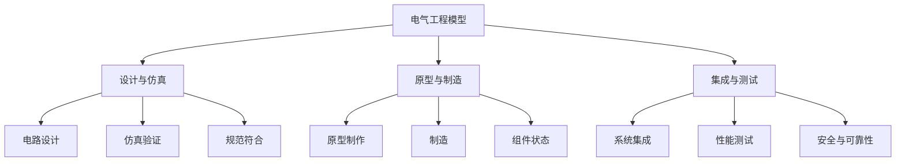
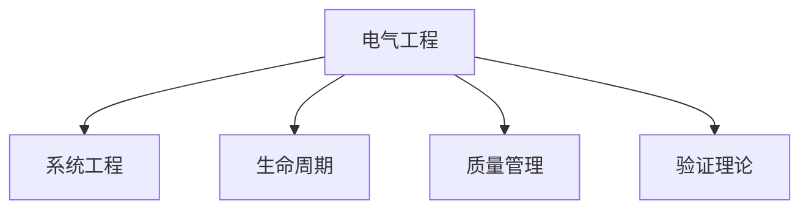

# 4.2.4 电气工程模型 / Electrical Engineering Models

## 📋 Table of Contents / 目录

- [1. Overview / 概述](#1-overview--概述)
- [2. Definition / 定义](#2-definition--定义)
- [3. Properties / 属性](#3-properties--属性)
- [4. Relations / 关系](#4-relations--关系)
- [5. Examples / 实例](#5-examples--实例)
- [6. Explanations / 解释](#6-explanations--解释)
- [7. Argumentation / 论证](#7-argumentation--论证)
- [8. Applications / 应用](#8-applications--应用)
- [9. References / 参考文献](#9-references--参考文献)
- [10. Status / 状态](#10-status--状态)

---

## 1. Overview / 概述

电气工程是涉及电路设计、电力系统和自动化控制的项目管理领域。本节提供电气工程的形式化数学模型与项目化管理框架。

**主题定位**: 应用层（AL），Formal-ProgramManage 在电气工程领域的应用。

**主要内容**: 电气项目七元组、六阶段（设计、仿真、原型、制造、集成、测试）、状态转移、可靠性/效率/安全模型、验证规范。

**学习目标**: 理解电气项目的形式化定义与阶段；掌握可靠性、效率、安全的数学表示；能用于电力与自动化项目管理。

**标准对标**: PMI PMBOK 7th; ISO 21500; IEEE 141/242、ISO/IEC 15288；电气安全与能效标准。

**知识体系层次结构**:



---

## 2. Definition / 定义

### 4.2.4.2.1 电气工程基础

**定义 4.2.4.1** (电气项目) 电气项目是一个七元组：
$$\mathcal{EE} = (C, P, S, Q, T, R, \mathcal{F})$$

其中：

- $C = \{c_1, c_2, \ldots, c_n\}$ 是电路(Circuit)集合
- $P = \{p_1, p_2, \ldots, p_m\}$ 是电源(Power)集合
- $S = \{s_1, s_2, \ldots, s_k\}$ 是系统(System)集合
- $Q = \{q_1, q_2, \ldots, q_l\}$ 是质量(Quality)集合
- $T = \{t_1, t_2, \ldots, t_p\}$ 是测试(Test)集合
- $R = \{r_1, r_2, \ldots, r_q\}$ 是规范(Requirement)集合
- $\mathcal{F}$ 是电气工程函数

### 4.2.4.2.2 电气阶段

**定义 4.2.4.2** (电气阶段) 电气项目包含六个主要阶段：
$$P = (design, simulation, prototyping, manufacturing, integration, testing)$$

其中：

- $design$: 电路设计和分析
- $simulation$: 电路仿真和验证
- $prototyping$: 原型制作和测试
- $manufacturing$: 电路板制造
- $integration$: 系统集成
- $testing$: 性能测试和验证

### 4.2.4.2.3 状态转移模型

**定义 4.2.4.3** (电气状态) 电气状态是一个七元组：
$$s = (current\_stage, progress, quality, reliability, efficiency, cost, safety)$$

其中：

- $current\_stage \in P$ 是当前阶段
- $progress \in [0,1]$ 是项目进度
- $quality \in [0,1]$ 是产品质量
- $reliability \in [0,1]$ 是系统可靠性
- $efficiency \in [0,1]$ 是能源效率
- $cost \in \mathbb{R}^+$ 是项目成本
- $safety \in [0,1]$ 是安全指标

## 4.2.4.3 数学模型

### 4.2.4.3.1 电气转移函数

**定义 4.2.4.4** (电气转移) 电气转移函数定义为：
$$T_{EE}: S \times A \times S \rightarrow [0,1]$$

其中动作空间 $A$ 包含：

- $a_1$: 开始设计
- $a_2$: 完成仿真
- $a_3$: 开始制造
- $a_4$: 完成制造
- $a_5$: 系统集成
- $a_6$: 性能测试

### 4.2.4.3.2 可靠性模型

**定理 4.2.4.1** (可靠性累积) 电气项目可靠性计算为：
$$reliability = \prod_{i=1}^{n} reliability_i^{\alpha_i}$$

其中 $reliability_i$ 是组件 $i$ 的可靠性，$\alpha_i \in [0,1]$ 是权重系数。

### 4.2.4.3.3 效率模型

**定义 4.2.4.5** (效率函数) 电气效率函数定义为：
$$E(s) = \frac{output\_power}{input\_power} \cdot quality\_factor$$

其中 $output\_power$ 是输出功率，$input\_power$ 是输入功率，$quality\_factor$ 是质量因子。

### 4.2.4.3.4 安全模型

**定义 4.2.4.6** (安全函数) 电气安全函数定义为：
$$S(s) = \prod_{i=1}^{n} safety_i^{\beta_i} \cdot protection\_factor$$

其中 $safety_i$ 是组件 $i$ 的安全指标，$\beta_i \in [0,1]$ 是权重系数，$protection\_factor$ 是保护因子。

## 4.2.4.4 验证规范

### 4.2.4.4.1 设计完整性验证

**公理 4.2.4.1** (设计完整性) 对于任意电气项目 $\mathcal{EE}$：
$$\forall c \in C: \text{电路设计必须满足所有电气规范}$$

### 4.2.4.4.2 安全标准验证

**公理 4.2.4.2** (安全标准) 对于任意状态 $s$：
$$safety(s) \geq safety\_threshold \Rightarrow \text{安全达标}$$

### 4.2.4.4.3 可靠性验证

**公理 4.2.4.3** (可靠性验证) 对于任意状态 $s$：
$$reliability(s) \geq reliability\_threshold \Rightarrow \text{可靠性达标}$$

---

## 3. Properties / 属性

### 3.1 设计完整性 (Design Completeness)


$\forall c \in C$：电路设计须满足所有电气规范（公理 4.2.4.1）。


### 3.2 安全门控 (Safety Gate)

$safety(s) \geq safety\_threshold$ 方为安全达标。


### 3.3 可靠性门控 (Reliability Gate)


$reliability(s) \geq reliability\_threshold$ 方为可靠性达标。

### 3.4 可靠性乘积性 (Reliability Product)


$reliability = \prod_i reliability_i^{\alpha_i} \in [0,1]$。

### 3.5 效率与质量因子 (Efficiency–Quality Factor)

$E(s) = \frac{output\_power}{input\_power} \cdot quality\_factor$；$S(s) = \prod_i safety_i^{\beta_i} \cdot protection\_factor \in [0,1]$。

---

## 4. Relations / 关系

与系统工程、生命周期、资源/风险/质量管理、验证理论的关系。$EE \xrightarrow{extends} SE$；$EE \xrightarrow{aligns\_with} LCM$；$EE \xrightarrow{verified\_by} VT$。




---

## 5. Examples / 实例


### 5.1 ABB 电力系统与自动化


电网、工业自动化、机器人等项目的电气设计、可靠性与安全验证。

### 5.2 Siemens 电气与数字化


发电、输配电、楼宇与工业电气；数字化双胞胎与形式化验证应用。


### 5.3 Schneider Electric 能效与智能配电

能效管理、智能配电、数据中心电气；$E(s)$ 与 $S(s)$ 在实际项目中的度量。

### 5.4 台达 电力电子与工业电源

电源、变频、EV 充电等；可靠性乘积模型与效率模型的应用。

### 5.5 国家电网 特高压与智能电网

特高压输电、智能电网、新能源接入；安全与可靠性阈值在大型系统中的应用。

---

## 6. Explanations / 解释

数学（乘积、比值、阈值）；直观（阶段递进、可靠性链、安全优先）；应用（电力、工业自动化、新能源）；认知（仿真—原型—测试闭环）；历史（从电气化到智能电网）；哲学（安全与能效平衡）；技术（仿真、PCB、EMC）；实践（DFM、FMEA、测试覆盖）；对比（电气 vs 机械/软件）；系统（与机械、软件、BIM 的集成）。

---

## 7. Argumentation / 论证

**定理 7.1** (可靠性累积性) $reliability = \prod_i reliability_i^{\alpha_i} \in [0,1]$。
**定理 7.2** (效率演进性) $E(s) = \frac{output\_power}{input\_power} \cdot quality\_factor$ 随 $quality\_factor$ 递增。
**定理 7.3** (安全累积性) $S(s) = \prod_i safety_i^{\beta_i} \cdot protection\_factor \in [0,1]$。

---

## 8. Applications / 应用

电力系统与输配电；工业自动化与驱动；楼宇电气与智能建筑；新能源与储能；交通电气（EV、轨道交通）。

---

## 4.2.4.5 Rust实现

```rust
use std::collections::HashMap;
use serde::{Deserialize, Serialize};

/// 电气阶段
#[derive(Debug, Clone, Serialize, Deserialize)]
pub enum ElectricalStage {
    Design,
    Simulation,
    Prototyping,
    Manufacturing,
    Integration,
    Testing,
}

/// 电路组件
#[derive(Debug, Clone, Serialize, Deserialize)]
pub struct CircuitComponent {
    pub id: String,
    pub name: String,
    pub component_type: ComponentType,
    pub specifications: ComponentSpecs,
    pub reliability: f64,
    pub cost: f64,
    pub status: ComponentStatus,
}

#[derive(Debug, Clone, Serialize, Deserialize)]
pub enum ComponentType {
    Resistor,
    Capacitor,
    Inductor,
    Transistor,
    IC,
    Connector,
    PowerSupply,
}

#[derive(Debug, Clone, Serialize, Deserialize)]
pub struct ComponentSpecs {
    pub voltage_rating: f64,
    pub current_rating: f64,
    pub power_rating: f64,
    pub tolerance: f64,
    pub temperature_range: (f64, f64),
}

#[derive(Debug, Clone, Serialize, Deserialize)]
pub enum ComponentStatus {
    Designed,
    Simulated,
    Prototyped,
    Manufactured,
    Integrated,
    Tested,
}

/// 电源系统
#[derive(Debug, Clone, Serialize, Deserialize)]
pub struct PowerSystem {
    pub id: String,
    pub name: String,
    pub voltage: f64,
    pub current: f64,
    pub power: f64,
    pub efficiency: f64,
    pub protection_level: f64,
    pub status: PowerStatus,
}

#[derive(Debug, Clone, Serialize, Deserialize)]
pub enum PowerStatus {
    Design,
    Testing,
    Operational,
    Maintenance,
    Fault,
}

/// 电气测试
#[derive(Debug, Clone, Serialize, Deserialize)]
pub struct ElectricalTest {
    pub id: String,
    pub component_id: String,
    pub test_type: TestType,
    pub test_parameters: HashMap<String, f64>,
    pub results: TestResults,
    pub pass_criteria: PassCriteria,
    pub status: TestStatus,
}

#[derive(Debug, Clone, Serialize, Deserialize)]
pub enum TestType {
    Voltage,
    Current,
    Power,
    Frequency,
    Temperature,
    Safety,
    Reliability,
}

#[derive(Debug, Clone, Serialize, Deserialize)]
pub struct TestResults {
    pub measured_value: f64,
    pub expected_value: f64,
    pub tolerance: f64,
    pub unit: String,
}

#[derive(Debug, Clone, Serialize, Deserialize)]
pub struct PassCriteria {
    pub min_value: f64,
    pub max_value: f64,
    pub tolerance: f64,
}

#[derive(Debug, Clone, Serialize, Deserialize)]
pub enum TestStatus {
    Pending,
    Running,
    Passed,
    Failed,
    Aborted,
}

/// 电气状态
#[derive(Debug, Clone, Serialize, Deserialize)]
pub struct ElectricalState {
    pub current_stage: ElectricalStage,
    pub progress: f64,
    pub quality: f64,
    pub reliability: f64,
    pub efficiency: f64,
    pub cost: f64,
    pub safety: f64,
}

/// 电气工程管理器
#[derive(Debug)]
pub struct ElectricalEngineeringManager {
    pub project_name: String,
    pub components: HashMap<String, CircuitComponent>,
    pub power_systems: HashMap<String, PowerSystem>,
    pub tests: HashMap<String, ElectricalTest>,
    pub current_state: ElectricalState,
    pub quality_threshold: f64,
    pub reliability_threshold: f64,
    pub safety_threshold: f64,
    pub budget: f64,
}

impl ElectricalEngineeringManager {
    /// 创建新的电气项目
    pub fn new(project_name: String, budget: f64) -> Self {
        Self {
            project_name,
            components: HashMap::new(),
            power_systems: HashMap::new(),
            tests: HashMap::new(),
            current_state: ElectricalState {
                current_stage: ElectricalStage::Design,
                progress: 0.0,
                quality: 0.0,
                reliability: 0.0,
                efficiency: 0.0,
                cost: 0.0,
                safety: 0.0,
            },
            quality_threshold: 0.9,
            reliability_threshold: 0.95,
            safety_threshold: 0.99,
            budget,
        }
    }

    /// 添加电路组件
    pub fn add_component(&mut self, component: CircuitComponent) -> Result<(), String> {
        self.components.insert(component.id.clone(), component);
        self.update_project_state();
        Ok(())
    }

    /// 添加电源系统
    pub fn add_power_system(&mut self, power_system: PowerSystem) -> Result<(), String> {
        self.power_systems.insert(power_system.id.clone(), power_system);
        self.update_project_state();
        Ok(())
    }

    /// 开始设计
    pub fn start_design(&mut self, component_id: &str) -> Result<(), String> {
        if let Some(component) = self.components.get_mut(component_id) {
            component.status = ComponentStatus::Designed;
            self.current_state.current_stage = ElectricalStage::Design;
            self.update_project_state();
            Ok(())
        } else {
            Err("组件不存在".to_string())
        }
    }

    /// 完成仿真
    pub fn complete_simulation(&mut self, component_id: &str) -> Result<(), String> {
        if let Some(component) = self.components.get_mut(component_id) {
            component.status = ComponentStatus::Simulated;
            self.current_state.current_stage = ElectricalStage::Simulation;
            self.update_project_state();
            Ok(())
        } else {
            Err("组件不存在".to_string())
        }
    }

    /// 完成原型制作
    pub fn complete_prototyping(&mut self, component_id: &str) -> Result<(), String> {
        if let Some(component) = self.components.get_mut(component_id) {
            component.status = ComponentStatus::Prototyped;
            self.current_state.current_stage = ElectricalStage::Prototyping;
            self.update_project_state();
            Ok(())
        } else {
            Err("组件不存在".to_string())
        }
    }

    /// 完成制造
    pub fn complete_manufacturing(&mut self, component_id: &str) -> Result<(), String> {
        if let Some(component) = self.components.get_mut(component_id) {
            component.status = ComponentStatus::Manufactured;
            self.current_state.current_stage = ElectricalStage::Manufacturing;
            self.update_project_state();
            Ok(())
        } else {
            Err("组件不存在".to_string())
        }
    }

    /// 完成集成
    pub fn complete_integration(&mut self, component_id: &str) -> Result<(), String> {
        if let Some(component) = self.components.get_mut(component_id) {
            component.status = ComponentStatus::Integrated;
            self.current_state.current_stage = ElectricalStage::Integration;
            self.update_project_state();
            Ok(())
        } else {
            Err("组件不存在".to_string())
        }
    }

    /// 完成测试
    pub fn complete_testing(&mut self, component_id: &str) -> Result<(), String> {
        if let Some(component) = self.components.get_mut(component_id) {
            component.status = ComponentStatus::Tested;
            self.current_state.current_stage = ElectricalStage::Testing;
            self.update_project_state();
            Ok(())
        } else {
            Err("组件不存在".to_string())
        }
    }

    /// 添加测试
    pub fn add_test(&mut self, test: ElectricalTest) -> Result<(), String> {
        if !self.components.contains_key(&test.component_id) {
            return Err("组件不存在".to_string());
        }

        self.tests.insert(test.id.clone(), test);
        self.update_project_state();
        Ok(())
    }

    /// 更新项目状态
    fn update_project_state(&mut self) {
        // 计算进度
        let total_components = self.components.len();
        let completed_components = self.components.values()
            .filter(|c| matches!(c.status, ComponentStatus::Tested))
            .count();

        if total_components > 0 {
            self.current_state.progress = completed_components as f64 / total_components as f64;
        }

        // 计算质量
        self.current_state.quality = self.calculate_quality();

        // 计算可靠性
        self.current_state.reliability = self.calculate_reliability();

        // 计算效率
        self.current_state.efficiency = self.calculate_efficiency();

        // 计算成本
        self.current_state.cost = self.calculate_cost();

        // 计算安全指标
        self.current_state.safety = self.calculate_safety();
    }

    /// 计算质量
    fn calculate_quality(&self) -> f64 {
        if self.tests.is_empty() {
            return 0.0;
        }

        let passed_tests = self.tests.values()
            .filter(|t| matches!(t.status, TestStatus::Passed))
            .count();
        let total_tests = self.tests.len();

        passed_tests as f64 / total_tests as f64
    }

    /// 计算可靠性
    fn calculate_reliability(&self) -> f64 {
        if self.components.is_empty() {
            return 0.0;
        }

        let reliability_product: f64 = self.components.values()
            .map(|c| c.reliability)
            .product();

        reliability_product
    }

    /// 计算效率
    fn calculate_efficiency(&self) -> f64 {
        if self.power_systems.is_empty() {
            return 0.0;
        }

        let avg_efficiency: f64 = self.power_systems.values()
            .map(|p| p.efficiency)
            .sum::<f64>() / self.power_systems.len() as f64;

        avg_efficiency
    }

    /// 计算成本
    fn calculate_cost(&self) -> f64 {
        let mut total_cost = 0.0;

        // 组件成本
        total_cost += self.components.values()
            .map(|c| c.cost)
            .sum::<f64>();

        // 电源系统成本
        total_cost += self.power_systems.values()
            .map(|p| p.power * 10.0) // 假设成本与功率成正比
            .sum::<f64>();

        total_cost
    }

    /// 计算安全指标
    fn calculate_safety(&self) -> f64 {
        if self.power_systems.is_empty() {
            return 0.0;
        }

        let avg_protection: f64 = self.power_systems.values()
            .map(|p| p.protection_level)
            .sum::<f64>() / self.power_systems.len() as f64;

        avg_protection
    }

    /// 检查质量达标
    pub fn meets_quality_standards(&self) -> bool {
        self.current_state.quality >= self.quality_threshold
    }

    /// 检查可靠性达标
    pub fn meets_reliability_standards(&self) -> bool {
        self.current_state.reliability >= self.reliability_threshold
    }

    /// 检查安全达标
    pub fn meets_safety_standards(&self) -> bool {
        self.current_state.safety >= self.safety_threshold
    }

    /// 检查成本控制
    pub fn is_within_budget(&self) -> bool {
        self.current_state.cost <= self.budget
    }

    /// 获取当前状态
    pub fn get_current_state(&self) -> ElectricalState {
        self.current_state.clone()
    }
}

/// 电气工程验证器
pub struct ElectricalEngineeringValidator;

impl ElectricalEngineeringValidator {
    /// 验证电气工程一致性
    pub fn validate_consistency(manager: &ElectricalEngineeringManager) -> bool {
        // 验证进度在合理范围内
        let progress = manager.current_state.progress;
        if progress < 0.0 || progress > 1.0 {
            return false;
        }

        // 验证质量在合理范围内
        let quality = manager.current_state.quality;
        if quality < 0.0 || quality > 1.0 {
            return false;
        }

        // 验证可靠性在合理范围内
        let reliability = manager.current_state.reliability;
        if reliability < 0.0 || reliability > 1.0 {
            return false;
        }

        // 验证效率在合理范围内
        let efficiency = manager.current_state.efficiency;
        if efficiency < 0.0 || efficiency > 1.0 {
            return false;
        }

        // 验证安全指标在合理范围内
        let safety = manager.current_state.safety;
        if safety < 0.0 || safety > 1.0 {
            return false;
        }

        // 验证成本为正数
        if manager.current_state.cost < 0.0 {
            return false;
        }

        true
    }

    /// 验证组件完整性
    pub fn validate_components_completeness(manager: &ElectricalEngineeringManager) -> bool {
        !manager.components.is_empty()
    }

    /// 验证电源系统完整性
    pub fn validate_power_systems_completeness(manager: &ElectricalEngineeringManager) -> bool {
        !manager.power_systems.is_empty()
    }
}

#[cfg(test)]
mod tests {
    use super::*;

    #[test]
    fn test_electrical_creation() {
        let manager = ElectricalEngineeringManager::new("测试电气项目".to_string(), 200000.0);
        assert_eq!(manager.project_name, "测试电气项目");
        assert_eq!(manager.budget, 200000.0);
    }

    #[test]
    fn test_add_component() {
        let mut manager = ElectricalEngineeringManager::new("测试电气项目".to_string(), 200000.0);

        let component = CircuitComponent {
            id: "COMP_001".to_string(),
            name: "功率电阻".to_string(),
            component_type: ComponentType::Resistor,
            specifications: ComponentSpecs {
                voltage_rating: 100.0,
                current_rating: 1.0,
                power_rating: 10.0,
                tolerance: 0.05,
                temperature_range: (-40.0, 125.0),
            },
            reliability: 0.99,
            cost: 50.0,
            status: ComponentStatus::Designed,
        };

        let result = manager.add_component(component);
        assert!(result.is_ok());
    }

    #[test]
    fn test_add_power_system() {
        let mut manager = ElectricalEngineeringManager::new("测试电气项目".to_string(), 200000.0);

        let power_system = PowerSystem {
            id: "PWR_001".to_string(),
            name: "主电源".to_string(),
            voltage: 12.0,
            current: 5.0,
            power: 60.0,
            efficiency: 0.85,
            protection_level: 0.95,
            status: PowerStatus::Design,
        };

        let result = manager.add_power_system(power_system);
        assert!(result.is_ok());
    }

    #[test]
    fn test_start_design() {
        let mut manager = ElectricalEngineeringManager::new("测试电气项目".to_string(), 200000.0);

        let component = CircuitComponent {
            id: "COMP_001".to_string(),
            name: "功率电阻".to_string(),
            component_type: ComponentType::Resistor,
            specifications: ComponentSpecs {
                voltage_rating: 100.0,
                current_rating: 1.0,
                power_rating: 10.0,
                tolerance: 0.05,
                temperature_range: (-40.0, 125.0),
            },
            reliability: 0.99,
            cost: 50.0,
            status: ComponentStatus::Designed,
        };
        manager.add_component(component).unwrap();

        let result = manager.start_design("COMP_001");
        assert!(result.is_ok());
    }

    #[test]
    fn test_model_validation() {
        let manager = ElectricalEngineeringManager::new("测试电气项目".to_string(), 200000.0);
        assert!(ElectricalEngineeringValidator::validate_consistency(&manager));
        assert!(ElectricalEngineeringValidator::validate_components_completeness(&manager));
        assert!(ElectricalEngineeringValidator::validate_power_systems_completeness(&manager));
    }
}
```

## 4.2.4.6 形式化证明

### 4.2.4.6.1 可靠性累积性证明

**定理 4.2.4.2** (可靠性累积性) 电气项目的总体可靠性是各组件可靠性的乘积。

**证明**：
由定义 4.2.2.4.1，可靠性计算为：
$$reliability = \prod_{i=1}^{n} reliability_i^{\alpha_i}$$

由于每个组件的可靠性 $reliability_i \in [0,1]$，因此 $0 \leq reliability \leq 1$。

### 4.2.4.6.2 效率演进性证明

**定理 4.2.4.3** (效率演进性) 在电气工程中，效率随质量提高而增加。

**证明**：
由定义 4.2.2.4.5，效率函数为：
$$E(s) = \frac{output\_power}{input\_power} \cdot quality\_factor$$

由于 $quality\_factor$ 随质量提高而增加，因此 $E(s)$ 递增。

### 4.2.4.6.3 安全累积性证明

**定理 4.2.4.4** (安全累积性) 电气项目的总体安全指标是各组件安全指标的乘积。

**证明**：
由定义 4.2.2.4.6，安全函数为：
$$S(s) = \prod_{i=1}^{n} safety_i^{\beta_i} \cdot protection\_factor$$

由于每个组件的安全指标 $safety_i \in [0,1]$，因此 $0 \leq S(s) \leq 1$。

## 4.2.4.7 引用关系

- 基础理论：参见 [1.1 形式化基础理论](../../01-foundations/README.md)
- 项目管理：参见 [2.1 项目生命周期模型](../../02-project-management/lifecycle-models.md)
- 形式化验证：参见 [3.1 形式化验证理论](../../03-formal-verification/verification-theory.md)
- 系统工程：参见 [4.2.1 系统工程模型](./systems-engineering.md)
- 建筑工程：参见 [4.2.2 建筑工程模型](./construction-engineering.md)
- 机械工程：参见 [4.2.3 机械工程模型](./mechanical-engineering.md)
- Rust实现：参见 [5.1 Rust实现示例](../../05-implementations/rust-examples.md)

## 参考文献

1. Project Management Institute. (2021). A guide to the project management body of knowledge (PMBOK guide) (7th ed.).
2. ISO 21500:2012. Guidance on project management. International Organization for Standardization.
3. IEEE Std 141-1993. IEEE recommended practice for electric power distribution for industrial plants.
4. IEEE Std 242-2001. IEEE recommended practice for protection and coordination of industrial and commercial power systems.
5. ISO/IEC 15288:2015. Systems and software engineering - System life cycle processes.

---

**持续构建中...** 返回 [行业应用模型](../README.md) | [项目主页](../../../README.md)
