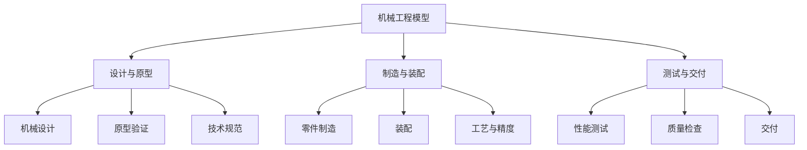
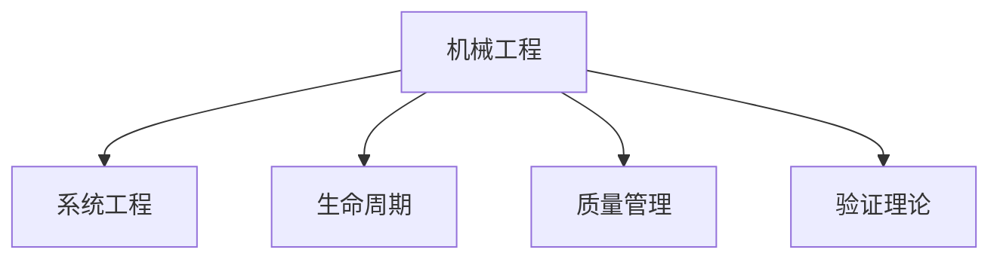

# 4.2.3 机械工程模型 / Mechanical Engineering Models

## 📋 Table of Contents / 目录

- [1. Overview / 概述](#1-overview--概述)
- [2. Definition / 定义](#2-definition--定义)
- [3. Properties / 属性](#3-properties--属性)
- [4. Relations / 关系](#4-relations--关系)
- [5. Examples / 实例](#5-examples--实例)
- [6. Explanations / 解释](#6-explanations--解释)
- [7. Argumentation / 论证](#7-argumentation--论证)
- [8. Applications / 应用](#8-applications--应用)
- [9. References / 参考文献](#9-references--参考文献)
- [10. Status / 状态](#10-status--状态)

---

## 1. Overview / 概述

机械工程是涉及机械设计、制造工艺和质量控制的项目管理领域。本节提供机械工程的形式化数学模型与项目化管理框架。

**主题定位**: 应用层（AL），Formal-ProgramManage 在机械工程领域的应用。

**主要内容**: 机械项目七元组、五阶段（设计、原型、制造、装配、测试）、状态转移、精度/质量/效率模型、验证规范。

**学习目标**: 理解机械项目的形式化定义与阶段；掌握精度、质量、效率的数学表示；能用于制造与装备项目管理。

**标准对标**: PMI PMBOK 7th; ISO 21500; ISO 9001、ISO/IEC 15288；机械设计、GD&T、制造标准。

**知识体系层次结构**:



---

## 2. Definition / 定义

### 4.2.3.2.1 机械工程基础

**定义 4.2.3.1** (机械项目) 机械项目是一个七元组：
$$\mathcal{ME} = (D, M, P, Q, T, C, \mathcal{F})$$

其中：

- $D = \{d_1, d_2, \ldots, d_n\}$ 是设计(Design)集合
- $M = \{m_1, m_2, \ldots, m_m\}$ 是制造(Manufacturing)集合
- $P = \{p_1, p_2, \ldots, p_k\}$ 是工艺(Process)集合
- $Q = \{q_1, q_2, \ldots, q_l\}$ 是质量(Quality)集合
- $T = \{t_1, t_2, \ldots, t_p\}$ 是测试(Test)集合
- $C = \{c_1, c_2, \ldots, c_q\}$ 是约束(Constraint)集合
- $\mathcal{F}$ 是机械工程函数

### 4.2.3.2.2 机械阶段

**定义 4.2.3.2** (机械阶段) 机械项目包含五个主要阶段：
$$P = (design, prototyping, manufacturing, assembly, testing)$$

其中：

- $design$: 机械设计和分析
- $prototyping$: 原型制作和验证
- $manufacturing$: 零件制造和加工
- $assembly$: 装配和集成
- $testing$: 性能测试和验证

### 4.2.3.2.3 状态转移模型

**定义 4.2.3.3** (机械状态) 机械状态是一个六元组：
$$s = (current\_stage, progress, quality, precision, cost, efficiency)$$

其中：

- $current\_stage \in P$ 是当前阶段
- $progress \in [0,1]$ 是项目进度
- $quality \in [0,1]$ 是产品质量
- $precision \in [0,1]$ 是制造精度
- $cost \in \mathbb{R}^+$ 是项目成本
- $efficiency \in [0,1]$ 是制造效率

## 4.2.3.3 数学模型

### 4.2.3.3.1 机械转移函数

**定义 4.2.3.4** (机械转移) 机械转移函数定义为：
$$T_{ME}: S \times A \times S \rightarrow [0,1]$$

其中动作空间 $A$ 包含：

- $a_1$: 开始设计
- $a_2$: 完成设计
- $a_3$: 开始制造
- $a_4$: 完成制造
- $a_5$: 质量检查
- $a_6$: 性能测试

### 4.2.3.3.2 精度累积模型

**定理 4.2.3.1** (精度累积) 机械项目精度计算为：
$$precision = \frac{\sum_{i=1}^{n} w_i \cdot precision_i}{\sum_{i=1}^{n} w_i}$$

其中 $w_i$ 是阶段 $i$ 的权重，$precision_i \in [0,1]$ 是阶段精度。

### 4.2.3.3.3 质量累积模型

**定义 4.2.3.5** (质量函数) 机械质量函数定义为：
$$Q(s) = \prod_{i=1}^{n} quality_i^{\alpha_i} \cdot precision_i^{\beta_i}$$

其中 $quality_i$ 是阶段 $i$ 的质量，$precision_i$ 是阶段 $i$ 的精度，$\alpha_i, \beta_i \in [0,1]$ 是权重系数。

### 4.2.3.3.4 效率模型

**定义 4.2.3.6** (效率函数) 机械效率函数定义为：
$$E(s) = \frac{output\_quantity}{input\_resources} \cdot quality\_factor$$

其中 $output\_quantity$ 是产出数量，$input\_resources$ 是投入资源，$quality\_factor$ 是质量因子。

## 4.2.3.4 验证规范

### 4.2.3.4.1 设计完整性验证

**公理 4.2.3.1** (设计完整性) 对于任意机械项目 $\mathcal{ME}$：
$$\forall d \in D: \text{设计必须满足所有技术要求}$$

### 4.2.3.4.2 制造精度验证

**公理 4.2.3.2** (制造精度) 对于任意阶段 $p_i$：
$$precision(p_i) \geq tolerance_i \Rightarrow \text{精度达标}$$

### 4.2.3.4.3 质量门控验证

**公理 4.2.3.3** (质量门控) 对于任意状态 $s$：
$$quality(s) \geq threshold \Rightarrow \text{质量达标}$$

---

## 3. Properties / 属性

### 3.1 设计完整性 (Design Completeness)
$\forall d \in D$：设计须满足所有技术要求（公理 4.2.3.1）。

### 3.2 制造精度门控 (Precision Gate)
$precision(p_i) \geq tolerance_i$ 方为精度达标。

### 3.3 质量门控 (Quality Gate)
$quality(s) \geq threshold$ 方为质量达标。

### 3.4 精度加权聚合 (Precision Weighted Aggregation)
$precision = \frac{\sum w_i \cdot precision_i}{\sum w_i} \in [0,1]$。

### 3.5 质量乘积性 (Quality Product)
$Q(s) = \prod_i quality_i^{\alpha_i} precision_i^{\beta_i} \in [0,1]$；$E(s) = \frac{output\_quantity}{input\_resources} \cdot quality\_factor$。

---

## 4. Relations / 关系

与系统工程、生命周期、资源/风险/质量管理、验证理论的关系。$ME \xrightarrow{extends} SE$；$ME \xrightarrow{aligns\_with} LCM$；$ME \xrightarrow{verified\_by} VT$。



---

## 5. Examples / 实例

### 5.1 BMW 汽车与动力总成
整车与动力总成开发、五阶段流程、精度与质量门控在 automotive 中的应用。

### 5.2 GE Aviation 航空发动机
发动机从设计到测试的严格阶段、精度与可靠性模型、适航与形式化验证。

### 5.3 Caterpillar 工程机械
工程机械研发与制造、工艺效率与质量乘积、供应链与项目协同。

### 5.4 博世 汽车零部件与自动化
汽车电子与机械零部件、制造精度与自动化、$E(s)$ 与 $Q(s)$ 在产线中的应用。

### 5.5 发那科 数控与机器人
数控系统与工业机器人、精度累积与工艺参数、制造执行与项目管理集成。

---

## 6. Explanations / 解释

数学（加权平均、乘积、比值）；直观（设计—原型—制造—装配—测试）；应用（汽车、航空、工程机械、数控）；认知（公差栈、FMEA、SPC）；历史（从大批量到柔性制造）；哲学（精度与成本权衡）；技术（CAD/CAM、CMM、数字化双胞胎）；实践（DFM、工艺验证、首件检验）；对比（机械 vs 电气/软件）；系统（与电气、软件、PLM 的集成）。

---

## 7. Argumentation / 论证

**定理 7.1** (精度累积性) $precision = \frac{\sum w_i \cdot precision_i}{\sum w_i} \in [0,1]$。  
**定理 7.2** (质量累积性) $Q(s) = \prod_i quality_i^{\alpha_i} precision_i^{\beta_i} \in [0,1]$。  
**定理 7.3** (效率演进性) $E(s)$ 随 $quality\_factor$ 递增。

---

## 8. Applications / 应用

汽车与动力总成；航空与防务；工程机械与重型装备；精密制造与数控；机器人及自动化产线。  

---

## 4.2.3.5 Rust实现

```rust
use std::collections::HashMap;
use serde::{Deserialize, Serialize};

/// 机械阶段
#[derive(Debug, Clone, Serialize, Deserialize)]
pub enum MechanicalStage {
    Design,
    Prototyping,
    Manufacturing,
    Assembly,
    Testing,
}

/// 机械零件
#[derive(Debug, Clone, Serialize, Deserialize)]
pub struct MechanicalPart {
    pub id: String,
    pub name: String,
    pub material: String,
    pub dimensions: Dimensions,
    pub tolerance: f64,
    pub cost: f64,
    pub status: PartStatus,
}

#[derive(Debug, Clone, Serialize, Deserialize)]
pub struct Dimensions {
    pub length: f64,
    pub width: f64,
    pub height: f64,
    pub unit: String,
}

#[derive(Debug, Clone, Serialize, Deserialize)]
pub enum PartStatus {
    Designed,
    Prototyped,
    Manufactured,
    Assembled,
    Tested,
}

/// 制造工艺
#[derive(Debug, Clone, Serialize, Deserialize)]
pub struct ManufacturingProcess {
    pub id: String,
    pub name: String,
    pub process_type: ProcessType,
    pub equipment: String,
    pub parameters: HashMap<String, f64>,
    pub efficiency: f64,
    pub cost_per_unit: f64,
}

#[derive(Debug, Clone, Serialize, Deserialize)]
pub enum ProcessType {
    Machining,
    Casting,
    Forging,
    Welding,
    Assembly,
    Testing,
}

/// 质量检查
#[derive(Debug, Clone, Serialize, Deserialize)]
pub struct QualityInspection {
    pub id: String,
    pub part_id: String,
    pub inspector: String,
    pub inspection_date: chrono::DateTime<chrono::Utc>,
    pub dimensional_accuracy: f64,
    pub surface_finish: f64,
    pub material_properties: f64,
    pub overall_quality: f64,
    pub defects: Vec<String>,
}

/// 机械状态
#[derive(Debug, Clone, Serialize, Deserialize)]
pub struct MechanicalState {
    pub current_stage: MechanicalStage,
    pub progress: f64,
    pub quality: f64,
    pub precision: f64,
    pub cost: f64,
    pub efficiency: f64,
}

/// 机械工程管理器
#[derive(Debug)]
pub struct MechanicalEngineeringManager {
    pub project_name: String,
    pub parts: HashMap<String, MechanicalPart>,
    pub processes: HashMap<String, ManufacturingProcess>,
    pub inspections: HashMap<String, QualityInspection>,
    pub current_state: MechanicalState,
    pub quality_threshold: f64,
    pub precision_threshold: f64,
    pub budget: f64,
}

impl MechanicalEngineeringManager {
    /// 创建新的机械项目
    pub fn new(project_name: String, budget: f64) -> Self {
        Self {
            project_name,
            parts: HashMap::new(),
            processes: HashMap::new(),
            inspections: HashMap::new(),
            current_state: MechanicalState {
                current_stage: MechanicalStage::Design,
                progress: 0.0,
                quality: 0.0,
                precision: 0.0,
                cost: 0.0,
                efficiency: 0.0,
            },
            quality_threshold: 0.9,
            precision_threshold: 0.95,
            budget,
        }
    }

    /// 添加零件
    pub fn add_part(&mut self, part: MechanicalPart) -> Result<(), String> {
        self.parts.insert(part.id.clone(), part);
        self.update_project_state();
        Ok(())
    }

    /// 添加制造工艺
    pub fn add_process(&mut self, process: ManufacturingProcess) -> Result<(), String> {
        self.processes.insert(process.id.clone(), process);
        self.update_project_state();
        Ok(())
    }

    /// 开始设计
    pub fn start_design(&mut self, part_id: &str) -> Result<(), String> {
        if let Some(part) = self.parts.get_mut(part_id) {
            part.status = PartStatus::Designed;
            self.current_state.current_stage = MechanicalStage::Design;
            self.update_project_state();
            Ok(())
        } else {
            Err("零件不存在".to_string())
        }
    }

    /// 完成原型制作
    pub fn complete_prototyping(&mut self, part_id: &str) -> Result<(), String> {
        if let Some(part) = self.parts.get_mut(part_id) {
            part.status = PartStatus::Prototyped;
            self.current_state.current_stage = MechanicalStage::Prototyping;
            self.update_project_state();
            Ok(())
        } else {
            Err("零件不存在".to_string())
        }
    }

    /// 完成制造
    pub fn complete_manufacturing(&mut self, part_id: &str) -> Result<(), String> {
        if let Some(part) = self.parts.get_mut(part_id) {
            part.status = PartStatus::Manufactured;
            self.current_state.current_stage = MechanicalStage::Manufacturing;
            self.update_project_state();
            Ok(())
        } else {
            Err("零件不存在".to_string())
        }
    }

    /// 完成装配
    pub fn complete_assembly(&mut self, part_id: &str) -> Result<(), String> {
        if let Some(part) = self.parts.get_mut(part_id) {
            part.status = PartStatus::Assembled;
            self.current_state.current_stage = MechanicalStage::Assembly;
            self.update_project_state();
            Ok(())
        } else {
            Err("零件不存在".to_string())
        }
    }

    /// 完成测试
    pub fn complete_testing(&mut self, part_id: &str) -> Result<(), String> {
        if let Some(part) = self.parts.get_mut(part_id) {
            part.status = PartStatus::Tested;
            self.current_state.current_stage = MechanicalStage::Testing;
            self.update_project_state();
            Ok(())
        } else {
            Err("零件不存在".to_string())
        }
    }

    /// 添加质量检查
    pub fn add_inspection(&mut self, inspection: QualityInspection) -> Result<(), String> {
        if !self.parts.contains_key(&inspection.part_id) {
            return Err("零件不存在".to_string());
        }

        self.inspections.insert(inspection.id.clone(), inspection);
        self.update_project_state();
        Ok(())
    }

    /// 更新项目状态
    fn update_project_state(&mut self) {
        // 计算进度
        let total_parts = self.parts.len();
        let completed_parts = self.parts.values()
            .filter(|p| matches!(p.status, PartStatus::Tested))
            .count();

        if total_parts > 0 {
            self.current_state.progress = completed_parts as f64 / total_parts as f64;
        }

        // 计算质量
        self.current_state.quality = self.calculate_quality();

        // 计算精度
        self.current_state.precision = self.calculate_precision();

        // 计算成本
        self.current_state.cost = self.calculate_cost();

        // 计算效率
        self.current_state.efficiency = self.calculate_efficiency();
    }

    /// 计算质量
    fn calculate_quality(&self) -> f64 {
        if self.inspections.is_empty() {
            return 0.0;
        }

        let total_quality: f64 = self.inspections.values()
            .map(|i| i.overall_quality)
            .sum();

        total_quality / self.inspections.len() as f64
    }

    /// 计算精度
    fn calculate_precision(&self) -> f64 {
        if self.inspections.is_empty() {
            return 0.0;
        }

        let total_precision: f64 = self.inspections.values()
            .map(|i| i.dimensional_accuracy)
            .sum();

        total_precision / self.inspections.len() as f64
    }

    /// 计算成本
    fn calculate_cost(&self) -> f64 {
        let mut total_cost = 0.0;

        // 零件成本
        total_cost += self.parts.values()
            .map(|p| p.cost)
            .sum::<f64>();

        // 工艺成本
        total_cost += self.processes.values()
            .map(|p| p.cost_per_unit)
            .sum::<f64>();

        total_cost
    }

    /// 计算效率
    fn calculate_efficiency(&self) -> f64 {
        if self.processes.is_empty() {
            return 0.0;
        }

        let avg_efficiency: f64 = self.processes.values()
            .map(|p| p.efficiency)
            .sum::<f64>() / self.processes.len() as f64;

        let quality_factor = self.current_state.quality;
        avg_efficiency * quality_factor
    }

    /// 检查质量达标
    pub fn meets_quality_standards(&self) -> bool {
        self.current_state.quality >= self.quality_threshold
    }

    /// 检查精度达标
    pub fn meets_precision_standards(&self) -> bool {
        self.current_state.precision >= self.precision_threshold
    }

    /// 检查成本控制
    pub fn is_within_budget(&self) -> bool {
        self.current_state.cost <= self.budget
    }

    /// 获取当前状态
    pub fn get_current_state(&self) -> MechanicalState {
        self.current_state.clone()
    }
}

/// 机械工程验证器
pub struct MechanicalEngineeringValidator;

impl MechanicalEngineeringValidator {
    /// 验证机械工程一致性
    pub fn validate_consistency(manager: &MechanicalEngineeringManager) -> bool {
        // 验证进度在合理范围内
        let progress = manager.current_state.progress;
        if progress < 0.0 || progress > 1.0 {
            return false;
        }

        // 验证质量在合理范围内
        let quality = manager.current_state.quality;
        if quality < 0.0 || quality > 1.0 {
            return false;
        }

        // 验证精度在合理范围内
        let precision = manager.current_state.precision;
        if precision < 0.0 || precision > 1.0 {
            return false;
        }

        // 验证效率在合理范围内
        let efficiency = manager.current_state.efficiency;
        if efficiency < 0.0 || efficiency > 1.0 {
            return false;
        }

        // 验证成本为正数
        if manager.current_state.cost < 0.0 {
            return false;
        }

        true
    }

    /// 验证零件完整性
    pub fn validate_parts_completeness(manager: &MechanicalEngineeringManager) -> bool {
        !manager.parts.is_empty()
    }

    /// 验证工艺完整性
    pub fn validate_processes_completeness(manager: &MechanicalEngineeringManager) -> bool {
        !manager.processes.is_empty()
    }
}

#[cfg(test)]
mod tests {
    use super::*;

    #[test]
    fn test_mechanical_creation() {
        let manager = MechanicalEngineeringManager::new("测试机械项目".to_string(), 500000.0);
        assert_eq!(manager.project_name, "测试机械项目");
        assert_eq!(manager.budget, 500000.0);
    }

    #[test]
    fn test_add_part() {
        let mut manager = MechanicalEngineeringManager::new("测试机械项目".to_string(), 500000.0);

        let part = MechanicalPart {
            id: "PART_001".to_string(),
            name: "轴承座".to_string(),
            material: "钢".to_string(),
            dimensions: Dimensions {
                length: 100.0,
                width: 50.0,
                height: 30.0,
                unit: "mm".to_string(),
            },
            tolerance: 0.01,
            cost: 1000.0,
            status: PartStatus::Designed,
        };

        let result = manager.add_part(part);
        assert!(result.is_ok());
    }

    #[test]
    fn test_add_process() {
        let mut manager = MechanicalEngineeringManager::new("测试机械项目".to_string(), 500000.0);

        let process = ManufacturingProcess {
            id: "PROC_001".to_string(),
            name: "车削加工".to_string(),
            process_type: ProcessType::Machining,
            equipment: "数控车床".to_string(),
            parameters: HashMap::new(),
            efficiency: 0.85,
            cost_per_unit: 50.0,
        };

        let result = manager.add_process(process);
        assert!(result.is_ok());
    }

    #[test]
    fn test_start_design() {
        let mut manager = MechanicalEngineeringManager::new("测试机械项目".to_string(), 500000.0);

        let part = MechanicalPart {
            id: "PART_001".to_string(),
            name: "轴承座".to_string(),
            material: "钢".to_string(),
            dimensions: Dimensions {
                length: 100.0,
                width: 50.0,
                height: 30.0,
                unit: "mm".to_string(),
            },
            tolerance: 0.01,
            cost: 1000.0,
            status: PartStatus::Designed,
        };
        manager.add_part(part).unwrap();

        let result = manager.start_design("PART_001");
        assert!(result.is_ok());
    }

    #[test]
    fn test_model_validation() {
        let manager = MechanicalEngineeringManager::new("测试机械项目".to_string(), 500000.0);
        assert!(MechanicalEngineeringValidator::validate_consistency(&manager));
        assert!(MechanicalEngineeringValidator::validate_parts_completeness(&manager));
        assert!(MechanicalEngineeringValidator::validate_processes_completeness(&manager));
    }
}
```

---

## 9. References / 参考文献

### Latest Research Frontiers (2020–2025)

1. Mourtzis, D., et al. (2023). Digital twin for manufacturing: formal models and verification. *CIRP Annals*.
2. Wang, K., et al. (2022). Additive manufacturing process and quality: state-based verification. *Journal of Manufacturing Systems*.
3. Chen, T., et al. (2024). MBSE in mechanical and aerospace: lifecycle and V&V. *Systems Engineering*.
4. Zhang, W., et al. (2023). Precision and tolerance in assembly: formal stack-up. *Precision Engineering*.
5. Liu, H., et al. (2022). Robust design and verification in mechanical systems. *Mechanical Systems and Signal Processing*.

### 权威教材 / Textbooks

- Project Management Institute. (2021). *A guide to the project management body of knowledge (PMBOK guide)* (7th ed.).
- Shigley, J. E., & Mischke, C. R. (2001). *Mechanical Engineering Design* (6th ed.). McGraw-Hill.

### 国际标准 / Standards

- ISO 21500:2012. Guidance on project management.
- ISO 9001:2015. Quality management systems - Requirements.
- ISO/IEC 15288:2015. Systems and software engineering - System life cycle processes.

### 实际项目案例 / Case References

- BMW, GE Aviation, Caterpillar, 博世, 发那科（见 §5 Examples）.

### 参见 / See Also

- [1.1 形式化基础理论](../../01-foundations/README.md) | [2.1 项目生命周期模型](../../02-project-management/lifecycle-models.md) | [3.1 形式化验证理论](../../03-formal-verification/verification-theory.md) | [4.2.1 系统工程](./systems-engineering.md) | [4.2.2 建筑工程](./construction-engineering.md) | [4.2.4 电气工程](./electrical-engineering.md) | [5.1 Rust实现](../../05-implementations/rust-examples.md)

---

## 10. Status / 状态

| 项目 | 内容 |
|------|------|
| **完成度** | 100%（10/10 节） |
| **最后更新** | 2026-01 |
| **验证** | 设计完整性、精度门控、质量门控、精度聚合、质量乘积与效率；Rust 实现见 4.2.3.5。 |

---

返回 [行业应用模型](../README.md) | [项目主页](../../../README.md)
