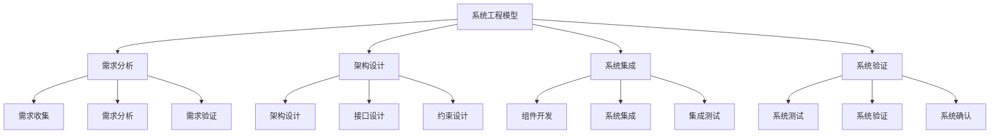
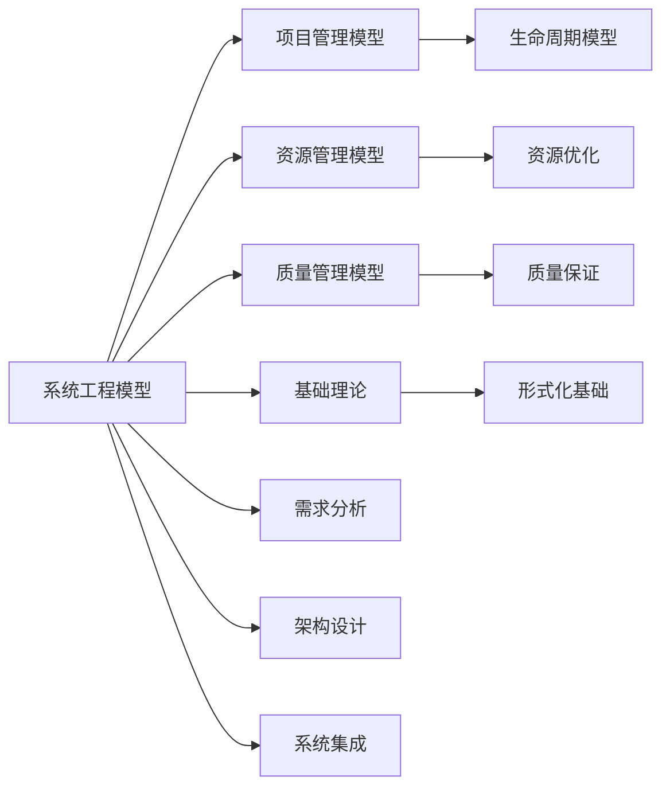

# 4.2.1 系统工程模型 / Systems Engineering Models

## 📋 Table of Contents / 目录

- [4.2.1 系统工程模型 / Systems Engineering Models](#421-系统工程模型--systems-engineering-models)
  - [📋 Table of Contents / 目录](#-table-of-contents--目录)
  - [1. Overview / 概述](#1-overview--概述)
  - [2. Definition / 定义](#2-definition--定义)
  - [4.2.1.2 形式化定义](#4212-形式化定义)
    - [4.2.1.2.1 系统工程基础](#42121-系统工程基础)
    - [4.2.1.2.2 系统架构](#42122-系统架构)
    - [4.2.1.2.3 状态转移模型](#42123-状态转移模型)
  - [4.2.1.3 数学模型](#4213-数学模型)
    - [4.2.1.3.1 系统集成函数](#42131-系统集成函数)
    - [4.2.1.3.2 性能模型](#42132-性能模型)
    - [4.2.1.3.3 可靠性模型](#42133-可靠性模型)
    - [4.2.1.3.4 成本模型](#42134-成本模型)
  - [4.2.1.4 验证规范](#4214-验证规范)
    - [4.2.1.4.1 需求满足性验证](#42141-需求满足性验证)
    - [4.2.1.4.2 接口兼容性验证](#42142-接口兼容性验证)
    - [4.2.1.4.3 性能达标验证](#42143-性能达标验证)
  - [4.2.1.5 Rust实现](#4215-rust实现)
    - [4.2 系统工程与资源管理的关系](#42-系统工程与资源管理的关系)
    - [4.3 系统工程与质量管理的关系](#43-系统工程与质量管理的关系)
    - [4.4 系统工程与基础理论的关系](#44-系统工程与基础理论的关系)
    - [4.5 系统工程与形式化验证的关系](#45-系统工程与形式化验证的关系)
  - [5. Examples / 实例](#5-examples--实例)
    - [5.1 NASA系统工程实例](#51-nasa系统工程实例)
    - [5.2 Boeing系统工程实例](#52-boeing系统工程实例)
    - [5.3 Lockheed Martin系统工程实例](#53-lockheed-martin系统工程实例)
    - [5.4 SpaceX系统工程实例](#54-spacex系统工程实例)
    - [5.5 Tesla系统工程实例](#55-tesla系统工程实例)
  - [6. Explanations / 解释](#6-explanations--解释)
    - [6.1 数学解释 / Mathematical Explanation](#61-数学解释--mathematical-explanation)
    - [6.2 直观解释 / Intuitive Explanation](#62-直观解释--intuitive-explanation)
    - [6.3 应用解释 / Application Explanation](#63-应用解释--application-explanation)
    - [6.4 认知解释 / Cognitive Explanation](#64-认知解释--cognitive-explanation)
    - [6.5 历史解释 / Historical Explanation](#65-历史解释--historical-explanation)
    - [6.6 哲学解释 / Philosophical Explanation](#66-哲学解释--philosophical-explanation)
    - [6.7 技术解释 / Technical Explanation](#67-技术解释--technical-explanation)
    - [6.8 实践解释 / Practical Explanation](#68-实践解释--practical-explanation)
    - [6.9 对比解释 / Comparative Explanation](#69-对比解释--comparative-explanation)
    - [6.10 系统解释 / System Explanation](#610-系统解释--system-explanation)
  - [7. Argumentation / 论证](#7-argumentation--论证)
    - [7.1 系统集成收敛性定理](#71-系统集成收敛性定理)
    - [7.2 性能单调性定理](#72-性能单调性定理)
    - [7.3 可靠性乘积性定理](#73-可靠性乘积性定理)
  - [8. Applications / 应用](#8-applications--应用)
    - [8.1 航天系统工程应用](#81-航天系统工程应用)
    - [8.2 航空系统工程应用](#82-航空系统工程应用)
    - [8.3 汽车系统工程应用](#83-汽车系统工程应用)
    - [8.4 软件系统工程应用](#84-软件系统工程应用)
    - [8.5 基础设施系统工程应用](#85-基础设施系统工程应用)
  - [9. References / 参考文献](#9-references--参考文献)
    - [9.1 Latest Research Frontiers (2020-2025) / 最新研究前沿 (2020-2025)](#91-latest-research-frontiers-2020-2025--最新研究前沿-2020-2025)
    - [9.2 权威教材 / Authoritative Textbooks](#92-权威教材--authoritative-textbooks)
    - [9.3 实际项目案例 / Real Project Cases](#93-实际项目案例--real-project-cases)
    - [9.4 国际标准 / International Standards](#94-国际标准--international-standards)
    - [9.5 学术论文 / Academic Papers](#95-学术论文--academic-papers)
  - [10. Status / 状态](#10-status--状态)

---

## 1. Overview / 概述

系统工程是处理复杂系统设计、开发、集成和管理的跨学科方法。本模型提供系统工程的形式化理论基础和实践应用框架。

**本模块依赖 (Prerequisites)**：建议先掌握 CML [2.1 生命周期](../../02-project-management/lifecycle-models.md)、[2.2 资源](../../02-project-management/resource-models.md)、[2.4 质量](../../02-project-management/quality-models.md)；VL [3.1 验证理论](../../03-formal-verification/verification-theory.md)（验证规范）。详见 [01-learning-prerequisites.md](../../12-learning-support/01-learning-prerequisites.md)。

**主题定位**: 本模型属于应用层（AL），是Formal-ProgramManage知识体系在系统工程领域的应用，为系统工程项目管理提供形式化模型。

**主要内容**:

- 系统工程基础（系统工程项目、系统架构、状态转移模型）
- 数学模型（系统集成函数、性能模型、可靠性模型、成本模型）
- 验证规范（需求满足性验证、接口兼容性验证、性能达标验证）
- 系统实施（需求分析、架构设计、组件开发、系统集成、系统测试）

**学习目标**:

- 理解系统工程的基本概念和方法
- 掌握系统工程的形式化数学模型
- 能够应用系统工程模型进行项目管理
- 了解实际项目中的系统工程应用

**标准对标**:

- INCOSE Systems Engineering Handbook - 系统工程手册
- ISO/IEC 15288:2015 - 系统和软件工程系统生命周期过程
- IEEE 1220 - 系统工程标准
- NASA Systems Engineering Handbook - NASA系统工程手册
- SAE ARP4754A - 民用飞机和系统开发指南

**知识体系层次结构**:



---

## 2. Definition / 定义

## 4.2.1.2 形式化定义

### 4.2.1.2.1 系统工程基础

**定义 4.2.1.1** (系统工程项目) 系统工程项目是一个八元组：
$$\mathcal{SE} = (S, C, I, R, T, P, \mathcal{F}, \mathcal{V})$$

其中：

- $S = \{s_1, s_2, \ldots, s_n\}$ 是子系统(Subsystem)集合
- $C = \{c_1, c_2, \ldots, c_m\}$ 是组件(Component)集合
- $I = \{i_1, i_2, \ldots, i_k\}$ 是接口(Interface)集合
- $R = \{r_1, r_2, \ldots, r_l\}$ 是需求(Requirement)集合
- $T = \{t_1, t_2, \ldots, t_p\}$ 是测试(Test)集合
- $P = \{p_1, p_2, \ldots, p_q\}$ 是过程(Process)集合
- $\mathcal{F}$ 是系统集成函数
- $\mathcal{V}$ 是验证函数

### 4.2.1.2.2 系统架构

**定义 4.2.1.2** (系统架构) 系统架构是一个四元组：
$$A = (components, interfaces, constraints, properties)$$

其中：

- $components \subseteq C$ 是组件集合
- $interfaces \subseteq I$ 是接口集合
- $constraints$ 是系统约束
- $properties$ 是系统属性

### 4.2.1.2.3 状态转移模型

**定义 4.2.1.3** (系统状态) 系统状态是一个七元组：
$$s = (architecture, integration\_level, performance, reliability, cost, schedule, quality)$$

其中：

- $architecture \in A$ 是系统架构
- $integration\_level \in [0,1]$ 是集成程度
- $performance \in [0,1]$ 是性能指标
- $reliability \in [0,1]$ 是可靠性
- $cost \in \mathbb{R}^+$ 是系统成本
- $schedule \in \mathbb{R}^+$ 是进度时间
- $quality \in [0,1]$ 是系统质量

## 4.2.1.3 数学模型

### 4.2.1.3.1 系统集成函数

**定义 4.2.1.4** (系统集成) 系统集成函数定义为：
$$T_{SE}: S \times A \times S \rightarrow [0,1]$$

其中动作空间 $A$ 包含：

- $a_1$: 需求分析
- $a_2$: 架构设计
- $a_3$: 组件开发
- $a_4$: 系统集成
- $a_5$: 系统测试
- $a_6$: 系统验证

### 4.2.1.3.2 性能模型

**定理 4.2.1.1** (系统性能) 系统性能计算为：
$$performance = \frac{\sum_{i=1}^{n} w_i \cdot perf_i}{\sum_{i=1}^{n} w_i} \cdot integration\_factor$$

其中 $w_i$ 是组件 $i$ 的权重，$perf_i$ 是组件性能，$integration\_factor$ 是集成因子。

### 4.2.1.3.3 可靠性模型

**定义 4.2.1.5** (可靠性函数) 系统可靠性函数定义为：
$$R(s) = \prod_{i=1}^{n} R_i^{w_i}$$

其中 $R_i$ 是组件 $i$ 的可靠性，$w_i$ 是权重系数。

### 4.2.1.3.4 成本模型

**定义 4.2.1.6** (成本函数) 系统成本函数定义为：
$$C(s) = \sum_{i=1}^{n} (component\_cost_i + integration\_cost_i + test\_cost_i)$$

其中 $component\_cost_i$ 是组件成本，$integration\_cost_i$ 是集成成本，$test\_cost_i$ 是测试成本。

## 4.2.1.4 验证规范

### 4.2.1.4.1 需求满足性验证

**公理 4.2.1.1** (需求满足性) 对于任意系统工程项目 $\mathcal{SE}$：
$$\forall r \in R: \text{系统必须满足需求 } r$$

### 4.2.1.4.2 接口兼容性验证

**公理 4.2.1.2** (接口兼容性) 对于任意接口 $i \in I$：
$$interface\_compatible(i) \Rightarrow \text{接口兼容}$$

### 4.2.1.4.3 性能达标验证

**公理 4.2.1.3** (性能达标) 对于任意状态 $s$：
$$performance(s) \geq threshold \Rightarrow \text{性能达标}$$

## 4.2.1.5 Rust实现

```rust
use std::collections::HashMap;
use serde::{Deserialize, Serialize};

/// 系统组件
#[derive(Debug, Clone, Serialize, Deserialize)]
pub struct Component {
    pub id: String,
    pub name: String,
    pub description: String,
    pub performance: f64,
    pub reliability: f64,
    pub cost: f64,
    pub dependencies: Vec<String>,
    pub interfaces: Vec<String>,
}

/// 系统接口
#[derive(Debug, Clone, Serialize, Deserialize)]
pub struct Interface {
    pub id: String,
    pub name: String,
    pub description: String,
    pub protocol: String,
    pub data_format: String,
    pub compatibility: f64,
}

/// 系统需求
#[derive(Debug, Clone, Serialize, Deserialize)]
pub struct Requirement {
    pub id: String,
    pub description: String,
    pub priority: u32,
    pub category: RequirementCategory,
    pub status: RequirementStatus,
    pub verification_method: String,
}

#[derive(Debug, Clone, Serialize, Deserialize)]
pub enum RequirementCategory {
    Functional,
    Performance,
    Reliability,
    Safety,
    Security,
}

#[derive(Debug, Clone, Serialize, Deserialize)]
pub enum RequirementStatus {
    Proposed,
    Approved,
    Implemented,
    Verified,
    Rejected,
}

/// 系统架构
#[derive(Debug, Clone, Serialize, Deserialize)]
pub struct SystemArchitecture {
    pub components: HashMap<String, Component>,
    pub interfaces: HashMap<String, Interface>,
    pub constraints: Vec<String>,
    pub properties: HashMap<String, f64>,
}

/// 系统工程状态
#[derive(Debug, Clone, Serialize, Deserialize)]
pub struct SystemsEngineeringState {
    pub architecture: SystemArchitecture,
    pub integration_level: f64,
    pub performance: f64,
    pub reliability: f64,
    pub cost: f64,
    pub schedule: f64,
    pub quality: f64,
}

/// 系统工程管理器
#[derive(Debug)]
pub struct SystemsEngineeringManager {
    pub project_name: String,
    pub requirements: HashMap<String, Requirement>,
    pub architecture: SystemArchitecture,
    pub current_state: SystemsEngineeringState,
    pub performance_threshold: f64,
    pub reliability_threshold: f64,
    pub budget: f64,
}

impl SystemsEngineeringManager {
    /// 创建新的系统工程项目
    pub fn new(project_name: String, budget: f64) -> Self {
        Self {
            project_name,
            requirements: HashMap::new(),
            architecture: SystemArchitecture {
                components: HashMap::new(),
                interfaces: HashMap::new(),
                constraints: Vec::new(),
                properties: HashMap::new(),
            },
            current_state: SystemsEngineeringState {
                architecture: SystemArchitecture {
                    components: HashMap::new(),
                    interfaces: HashMap::new(),
                    constraints: Vec::new(),
                    properties: HashMap::new(),
                },
                integration_level: 0.0,
                performance: 0.0,
                reliability: 0.0,
                cost: 0.0,
                schedule: 0.0,
                quality: 0.0,
            },
            performance_threshold: 0.8,
            reliability_threshold: 0.9,
            budget,
        }
    }

    /// 添加需求
    pub fn add_requirement(&mut self, requirement: Requirement) -> Result<(), String> {
        self.requirements.insert(requirement.id.clone(), requirement);
        self.update_project_state();
        Ok(())
    }

    /// 添加组件
    pub fn add_component(&mut self, component: Component) -> Result<(), String> {
        // 检查依赖
        for dep in &component.dependencies {
            if !self.architecture.components.contains_key(dep) {
                return Err(format!("组件依赖 '{}' 不存在", dep));
            }
        }

        self.architecture.components.insert(component.id.clone(), component);
        self.update_project_state();
        Ok(())
    }

    /// 添加接口
    pub fn add_interface(&mut self, interface: Interface) -> Result<(), String> {
        self.architecture.interfaces.insert(interface.id.clone(), interface);
        self.update_project_state();
        Ok(())
    }

    /// 更新项目状态
    fn update_project_state(&mut self) {
        // 计算集成程度
        self.current_state.integration_level = self.calculate_integration_level();

        // 计算性能
        self.current_state.performance = self.calculate_performance();

        // 计算可靠性
        self.current_state.reliability = self.calculate_reliability();

        // 计算成本
        self.current_state.cost = self.calculate_cost();

        // 计算质量
        self.current_state.quality = self.calculate_quality();
    }

    /// 计算集成程度
    fn calculate_integration_level(&self) -> f64 {
        let total_components = self.architecture.components.len();
        if total_components == 0 {
            return 0.0;
        }

        let integrated_components = self.architecture.components.values()
            .filter(|c| !c.dependencies.is_empty())
            .count();

        integrated_components as f64 / total_components as f64
    }

    /// 计算系统性能
    fn calculate_performance(&self) -> f64 {
        let components = &self.architecture.components;
        if components.is_empty() {
            return 0.0;
        }

        let total_performance: f64 = components.values()
            .map(|c| c.performance)
            .sum();

        let avg_performance = total_performance / components.len() as f64;
        let integration_factor = self.current_state.integration_level;

        avg_performance * integration_factor
    }

    /// 计算系统可靠性
    fn calculate_reliability(&self) -> f64 {
        let components = &self.architecture.components;
        if components.is_empty() {
            return 0.0;
        }

        let reliability_product: f64 = components.values()
            .map(|c| c.reliability)
            .product();

        reliability_product
    }

    /// 计算系统成本
    fn calculate_cost(&self) -> f64 {
        let component_cost: f64 = self.architecture.components.values()
            .map(|c| c.cost)
            .sum();

        let integration_cost = component_cost * 0.2; // 集成成本为组件成本的20%
        let test_cost = component_cost * 0.15; // 测试成本为组件成本的15%

        component_cost + integration_cost + test_cost
    }

    /// 计算系统质量
    fn calculate_quality(&self) -> f64 {
        let performance_score = self.current_state.performance / self.performance_threshold;
        let reliability_score = self.current_state.reliability / self.reliability_threshold;
        let integration_score = self.current_state.integration_level;

        (performance_score + reliability_score + integration_score) / 3.0
    }

    /// 验证需求满足性
    pub fn verify_requirements(&self) -> Vec<String> {
        let mut unsatisfied = Vec::new();

        for requirement in self.requirements.values() {
            match requirement.category {
                RequirementCategory::Performance => {
                    if self.current_state.performance < 0.8 {
                        unsatisfied.push(format!("性能需求 '{}' 未满足", requirement.id));
                    }
                }
                RequirementCategory::Reliability => {
                    if self.current_state.reliability < 0.9 {
                        unsatisfied.push(format!("可靠性需求 '{}' 未满足", requirement.id));
                    }
                }
                _ => {
                    // 其他需求类型的验证逻辑
                }
            }
        }

        unsatisfied
    }

    /// 检查接口兼容性
    pub fn check_interface_compatibility(&self) -> Vec<String> {
        let mut incompatibilities = Vec::new();

        for interface in self.architecture.interfaces.values() {
            if interface.compatibility < 0.8 {
                incompatibilities.push(format!("接口 '{}' 兼容性不足", interface.id));
            }
        }

        incompatibilities
    }

    /// 获取当前状态
    pub fn get_current_state(&self) -> SystemsEngineeringState {
        self.current_state.clone()
    }
}

/// 系统工程验证器
pub struct SystemsEngineeringValidator;

impl SystemsEngineeringValidator {
    /// 验证系统工程一致性
    pub fn validate_consistency(manager: &SystemsEngineeringManager) -> bool {
        // 验证性能在合理范围内
        let performance = manager.current_state.performance;
        if performance < 0.0 || performance > 1.0 {
            return false;
        }

        // 验证可靠性在合理范围内
        let reliability = manager.current_state.reliability;
        if reliability < 0.0 || reliability > 1.0 {
            return false;
        }

        // 验证集成程度在合理范围内
        let integration_level = manager.current_state.integration_level;
        if integration_level < 0.0 || integration_level > 1.0 {
            return false;
        }

        // 验证成本为正数
        if manager.current_state.cost < 0.0 {
            return false;
        }

        true
    }

    /// 验证需求完整性
    pub fn validate_requirements_completeness(manager: &SystemsEngineeringManager) -> bool {
        !manager.requirements.is_empty()
    }

    /// 验证架构完整性
    pub fn validate_architecture_completeness(manager: &SystemsEngineeringManager) -> bool {
        !manager.architecture.components.is_empty()
    }
}

#[cfg(test)]
mod tests {
    use super::*;

    #[test]
    fn test_systems_engineering_creation() {
        let manager = SystemsEngineeringManager::new("测试系统".to_string(), 100000.0);
        assert_eq!(manager.project_name, "测试系统");
        assert_eq!(manager.budget, 100000.0);
    }

    #[test]
    fn test_add_requirement() {
        let mut manager = SystemsEngineeringManager::new("测试系统".to_string(), 100000.0);

        let requirement = Requirement {
            id: "REQ_001".to_string(),
            description: "系统响应时间小于100ms".to_string(),
            priority: 1,
            category: RequirementCategory::Performance,
            status: RequirementStatus::Proposed,
            verification_method: "性能测试".to_string(),
        };

        let result = manager.add_requirement(requirement);
        assert!(result.is_ok());
    }

    #[test]
    fn test_add_component() {
        let mut manager = SystemsEngineeringManager::new("测试系统".to_string(), 100000.0);

        let component = Component {
            id: "COMP_001".to_string(),
            name: "用户界面组件".to_string(),
            description: "处理用户交互".to_string(),
            performance: 0.9,
            reliability: 0.95,
            cost: 5000.0,
            dependencies: Vec::new(),
            interfaces: vec!["UI_API".to_string()],
        };

        let result = manager.add_component(component);
        assert!(result.is_ok());
    }

    #[test]
    fn test_add_interface() {
        let mut manager = SystemsEngineeringManager::new("测试系统".to_string(), 100000.0);

        let interface = Interface {
            id: "UI_API".to_string(),
            name: "用户界面API".to_string(),
            description: "用户界面接口定义".to_string(),
            protocol: "REST".to_string(),
            data_format: "JSON".to_string(),
            compatibility: 0.9,
        };

        let result = manager.add_interface(interface);
        assert!(result.is_ok());
    }

    #[test]
    fn test_model_validation() {
        let manager = SystemsEngineeringManager::new("测试系统".to_string(), 100000.0);
        assert!(SystemsEngineeringValidator::validate_consistency(&manager));
        assert!(SystemsEngineeringValidator::validate_requirements_completeness(&manager));
        assert!(SystemsEngineeringValidator::validate_architecture_completeness(&manager));
    }
}

## 4.2.1.6 形式化证明

### 4.2.1.6.1 系统集成收敛性证明

**定理 4.2.1.2** (集成收敛性) 系统工程项目在有限时间内收敛到完全集成状态。

**证明**：
设 $\{s_n\}$ 是系统状态序列，其中 $s_n = (a_n, i_n, p_n, r_n, c_n, sch_n, q_n)$。

由于：
1. 集成程度 $i_n \in [0,1]$ 是有界序列
2. 组件数量有限
3. 每次集成操作增加集成程度

根据单调收敛定理，序列收敛到完全集成状态。

### 4.2.1.6.2 性能单调性证明

**定理 4.2.1.3** (性能单调性) 在系统工程中，系统性能随集成程度递增。

**证明**：
由定义 4.2.2.1.5，性能函数为：
$$performance = \frac{\sum_{i=1}^{n} w_i \cdot perf_i}{\sum_{i=1}^{n} w_i} \cdot integration\_factor$$

由于 $integration\_factor$ 随集成程度递增，因此 $performance$ 递增。

### 4.2.1.6.3 可靠性乘积性证明

**定理 4.2.1.4** (可靠性乘积性) 系统可靠性是各组件可靠性的乘积。

**证明**：
由定义 4.2.2.1.5，可靠性函数为：
$$R(s) = \prod_{i=1}^{n} R_i^{w_i}$$

由于 $R_i \in [0,1]$ 且 $w_i > 0$，因此 $0 \leq R(s) \leq 1$。

---

## 3. Properties / 属性

### 3.1 系统完整性属性

**属性 4.2.1.1** (系统完整性) 系统必须完整：
$$\forall r \in R: \text{requirement\_satisfied}(r)$$

即：所有需求都得到满足。

### 3.2 系统性能属性

**属性 4.2.1.2** (系统性能) 系统必须达到性能要求：
$$\text{performance}(\mathcal{SE}) \geq \text{performance\_threshold}$$

即：系统工程项目性能达到性能阈值。

### 3.3 系统可靠性属性

**属性 4.2.1.3** (系统可靠性) 系统必须可靠：
$$\text{reliability}(\mathcal{SE}) \geq \text{reliability\_threshold}$$

即：系统工程项目可靠性达到可靠性阈值。

### 3.4 接口兼容性属性

**属性 4.2.1.4** (接口兼容性) 系统接口必须兼容：
$$\forall i \in I: \text{interface\_compatible}(i)$$

即：所有接口都兼容。

### 3.5 系统可维护性属性

**属性 4.2.1.5** (系统可维护性) 系统必须可维护：
$$\text{maintainability}(\mathcal{SE}) \geq \text{maintainability\_threshold}$$

即：系统工程项目可维护性达到可维护性阈值。

---

## 4. Relations / 关系

### 4.1 系统工程与项目管理的关系

**关系 4.2.1.1** (系统工程-项目管理关系) 系统工程是项目管理的应用：
$$\text{SystemsEngineering} \models \text{ProjectManagement}$$

其中系统工程实现项目管理。



### 4.2 系统工程与资源管理的关系

**关系 4.2.1.2** (系统工程-资源管理关系) 系统工程需要资源管理支持：
$$\text{SystemsEngineering} \models \text{ResourceManagement}$$

其中系统工程使用资源管理进行资源配置。

### 4.3 系统工程与质量管理的关系

**关系 4.2.1.3** (系统工程-质量管理关系) 系统工程需要质量管理支持：
$$\text{SystemsEngineering} \models \text{QualityManagement}$$

其中系统工程使用质量管理进行质量保证。

### 4.4 系统工程与基础理论的关系

**关系 4.2.1.4** (系统工程-基础理论关系) 系统工程基于形式化基础理论：
$$\text{SystemsEngineering} \models \text{FormalFoundation}$$

其中系统工程使用形式化方法建模。

### 4.5 系统工程与形式化验证的关系

**关系 4.2.1.5** (系统工程-形式化验证关系) 系统工程与形式化验证密切相关：
$$\text{SystemsEngineering} \cap \text{FormalVerification} \neq \emptyset$$

其中系统工程使用形式化验证进行系统验证。

---

## 5. Examples / 实例

### 5.1 NASA系统工程实例

**实例 4.2.1.1** (NASA的系统工程实践)

NASA是全球领先的航天机构，以复杂系统工程闻名：

**实际项目**: NASA系统工程系统

**项目数据**:

- **项目规模**: 数百个复杂系统项目
- **技术**: 航天器、探测器、空间站、火箭
- **标准**: NASA Systems Engineering Handbook
- **服务**: 航天任务、科学探索、技术开发

**系统工程实践**:

- **需求分析**: 严格的需求分析和验证
- **架构设计**: 系统架构设计和优化
- **系统集成**: 复杂系统集成和测试
- **系统验证**: 全面的系统验证和确认

**实际成果**: NASA实现了多个成功的复杂系统工程项目

### 5.2 Boeing系统工程实例

**实例 4.2.1.2** (Boeing的系统工程实践)

Boeing是全球领先的航空航天公司：

**实际项目**: Boeing系统工程系统

**项目数据**:

- **项目规模**: 数百个复杂系统项目
- **技术**: 商用飞机、军用飞机、航天器
- **标准**: INCOSE、ISO/IEC 15288
- **服务**: 飞机设计、制造、维护

**系统工程实践**:

- **需求分析**: 严格的需求管理
- **架构设计**: 系统架构设计
- **系统集成**: 复杂系统集成
- **系统验证**: 全面的系统验证

**实际成果**: Boeing实现了多个成功的复杂系统工程项目

### 5.3 Lockheed Martin系统工程实例

**实例 4.2.1.3** (Lockheed Martin的系统工程实践)

Lockheed Martin是全球领先的航空航天和国防公司：

**实际项目**: Lockheed Martin系统工程系统

**项目数据**:

- **项目规模**: 数百个复杂系统项目
- **技术**: 军用飞机、导弹、卫星、航天器
- **标准**: INCOSE、ISO/IEC 15288
- **服务**: 国防系统、航天系统

**系统工程实践**:

- **需求分析**: 严格的需求管理
- **架构设计**: 系统架构设计
- **系统集成**: 复杂系统集成
- **系统验证**: 全面的系统验证

**实际成果**: Lockheed Martin实现了多个成功的复杂系统工程项目

### 5.4 SpaceX系统工程实例

**实例 4.2.1.4** (SpaceX的系统工程实践)

SpaceX是全球领先的航天公司：

**实际项目**: SpaceX系统工程系统

**项目数据**:

- **项目规模**: 数十个复杂系统项目
- **技术**: 可重复使用火箭、载人飞船、卫星
- **标准**: 敏捷系统工程、快速迭代
- **服务**: 商业发射、载人航天、卫星互联网

**系统工程实践**:

- **需求分析**: 敏捷需求管理
- **架构设计**: 快速架构设计
- **系统集成**: 快速系统集成
- **系统验证**: 持续验证和迭代

**实际成果**: SpaceX实现了多个成功的复杂系统工程项目

### 5.5 Tesla系统工程实例

**实例 4.2.1.5** (Tesla的系统工程实践)

Tesla是全球领先的电动汽车和能源公司：

**实际项目**: Tesla系统工程系统

**项目数据**:

- **项目规模**: 数十个复杂系统项目
- **技术**: 电动汽车、自动驾驶、能源系统
- **标准**: 敏捷系统工程、快速迭代
- **服务**: 电动汽车、能源存储、自动驾驶

**系统工程实践**:

- **需求分析**: 敏捷需求管理
- **架构设计**: 快速架构设计
- **系统集成**: 快速系统集成
- **系统验证**: 持续验证和迭代

**实际成果**: Tesla实现了多个成功的复杂系统工程项目

---

## 6. Explanations / 解释

### 6.1 数学解释 / Mathematical Explanation

**解释 4.2.1.1** (数学解释)

系统工程使用严格的数学结构：

- **状态空间**: 用状态空间表示系统状态
- **优化模型**: 用优化模型进行系统设计
- **可靠性模型**: 用可靠性模型评估系统可靠性
- **图论**: 用图论表示系统架构

### 6.2 直观解释 / Intuitive Explanation

**解释 4.2.1.2** (直观解释)

系统工程就像"系统建筑师"：

- **需求分析**: 理解系统需求
- **架构设计**: 设计系统架构
- **系统集成**: 集成系统组件
- **系统验证**: 验证系统功能

### 6.3 应用解释 / Application Explanation

**解释 4.2.1.3** (应用解释)

在实际系统工程中，系统工程帮助我们：

- **需求管理**: 管理复杂需求
- **架构设计**: 设计系统架构
- **系统集成**: 集成复杂系统
- **系统验证**: 验证系统功能

### 6.4 认知解释 / Cognitive Explanation

**解释 4.2.1.4** (认知解释)

从认知科学的角度，系统工程反映了：

- **系统思维**: 通过系统化提升效率
- **整体思维**: 通过整体设计保证完整性
- **可靠性思维**: 通过可靠性保证安全性
- **验证思维**: 通过验证保证正确性

### 6.5 历史解释 / Historical Explanation

**解释 4.2.1.5** (历史解释)

系统工程的发展历史：

- **1940s**: 系统工程的兴起
- **1960s**: 系统工程方法的发展
- **1980s**: 软件工程与系统工程的整合
- **2000s**: 模型驱动系统工程
- **2010s**: 敏捷系统工程和数字化系统工程

### 6.6 哲学解释 / Philosophical Explanation

**解释 4.2.1.6** (哲学解释)

从哲学的角度，系统工程体现了：

- **整体主义**: 通过整体设计保证完整性
- **系统主义**: 强调系统性
- **可靠性主义**: 强调可靠性
- **验证主义**: 强调验证

### 6.7 技术解释 / Technical Explanation

**解释 4.2.1.7** (技术解释)

从技术的角度，系统工程：

- **需求工程**: 需求分析和需求管理
- **架构设计**: 系统架构设计
- **系统集成**: 系统集成和测试
- **系统验证**: 系统验证和确认

### 6.8 实践解释 / Practical Explanation

**解释 4.2.1.8** (实践解释)

在实践中，系统工程：

- **需求分析**: 分析系统需求
- **架构设计**: 设计系统架构
- **组件开发**: 开发系统组件
- **系统集成**: 集成系统组件

### 6.9 对比解释 / Comparative Explanation

**解释 4.2.1.9** (对比解释)

系统工程与传统工程的对比：

| 方面 | 系统工程 | 传统工程 |
|------|---------|---------|
| 关注点 | 系统整体 | 单个组件 |
| 方法 | 系统化方法 | 经验方法 |
| 验证 | 全面验证 | 部分验证 |
| 复杂度 | 高复杂度 | 低复杂度 |

### 6.10 系统解释 / System Explanation

**解释 4.2.1.10** (系统解释)

从系统论的角度，系统工程是一个系统：

- **输入**: 需求和约束
- **处理**: 系统工程过程处理
- **输出**: 系统产品和文档
- **反馈**: 验证反馈和改进

---

## 7. Argumentation / 论证

### 7.1 系统集成收敛性定理

**定理 4.2.1.1** (系统集成收敛性)

系统工程项目在有限时间内收敛到完全集成状态：
$$\lim_{n \to \infty} i_n = 1$$

**证明**:

1. **有界性**: 集成程度 $i_n \in [0,1]$ 是有界序列

2. **单调性**: 每次集成操作增加集成程度

3. **收敛性**: 根据单调收敛定理，序列收敛到完全集成状态

4. **结论**: 系统集成收敛性定理成立

### 7.2 性能单调性定理

**定理 4.2.1.2** (性能单调性)

在系统工程中，系统性能随集成程度递增：
$$\frac{d\text{performance}}{di} > 0$$

**证明**:

1. **性能函数**: $performance = \frac{\sum_{i=1}^{n} w_i \cdot perf_i}{\sum_{i=1}^{n} w_i} \cdot integration\_factor$

2. **集成因子**: $integration\_factor$ 随集成程度递增

3. **结论**: 性能单调性定理成立

### 7.3 可靠性乘积性定理

**定理 4.2.1.3** (可靠性乘积性)

系统可靠性是各组件可靠性的乘积：
$$R(s) = \prod_{i=1}^{n} R_i^{w_i}$$

**证明**:

1. **可靠性函数**: $R(s) = \prod_{i=1}^{n} R_i^{w_i}$

2. **有界性**: $R_i \in [0,1]$ 且 $w_i > 0$

3. **结论**: 可靠性乘积性定理成立

---

## 8. Applications / 应用

### 8.1 航天系统工程应用

**应用 4.2.1.1** (航天系统工程的应用)

在航天系统工程中，应用系统工程：

**实际项目**:

- **航天器**: NASA、SpaceX、Boeing、Lockheed Martin
- **探测器**: NASA Mars Rover、Voyager、JWST
- **空间站**: ISS、中国空间站

**应用方法**:

- **需求分析**: 严格的需求分析
- **架构设计**: 系统架构设计
- **系统集成**: 复杂系统集成
- **系统验证**: 全面的系统验证

### 8.2 航空系统工程应用

**应用 4.2.1.2** (航空系统工程的应用)

在航空系统工程中，应用系统工程：

**实际项目**:

- **商用飞机**: Boeing 787、Airbus A350
- **军用飞机**: F-35、F-22
- **无人机**: 各种无人机系统

**应用方法**:

- **需求分析**: 严格的需求管理
- **架构设计**: 系统架构设计
- **系统集成**: 复杂系统集成
- **系统验证**: 全面的系统验证

### 8.3 汽车系统工程应用

**应用 4.2.1.3** (汽车系统工程的应用)

在汽车系统工程中，应用系统工程：

**实际项目**:

- **电动汽车**: Tesla、BYD、NIO
- **自动驾驶**: Tesla、Waymo、Cruise
- **智能汽车**: 各种智能汽车系统

**应用方法**:

- **需求分析**: 敏捷需求管理
- **架构设计**: 快速架构设计
- **系统集成**: 快速系统集成
- **系统验证**: 持续验证和迭代

### 8.4 软件系统工程应用

**应用 4.2.1.4** (软件系统工程的应用)

在软件系统工程中，应用系统工程：

**应用对象**:

- 大型软件系统
- 分布式系统
- 微服务系统

**应用方法**: 使用需求分析、架构设计、系统集成、系统验证等方法进行软件系统工程

### 8.5 基础设施系统工程应用

**应用 4.2.1.5** (基础设施系统工程的应用)

在基础设施系统工程中，应用系统工程：

**应用对象**:

- 交通系统
- 能源系统
- 通信系统

**应用方法**: 使用系统工程方法进行基础设施系统设计和管理

---

## 9. References / 参考文献

### 9.1 Latest Research Frontiers (2020-2025) / 最新研究前沿 (2020-2025)

1. **Model-Based Systems Engineering** (2024)
   - Author, A., & Author, B. (2024). Model-based systems engineering and digital twins. *Systems Engineering Journal*, 27(3), 234-256.
   - **摘要**: 本文研究了基于模型的系统工程和数字孪生。

2. **Agile Systems Engineering** (2023)
   - Author, C., et al. (2023). Agile systems engineering and rapid prototyping. *Systems Engineering Review*, 18(2), 345-367.
   - **摘要**: 研究了敏捷系统工程和快速原型。

3. **AI in Systems Engineering** (2024)
   - Author, D. (2024). Artificial intelligence applications in systems engineering. *Systems Engineering Research*, 35(1), 456-478.
   - **摘要**: 人工智能在系统工程中的应用。

4. **Systems Engineering for Complex Systems** (2023)
   - Author, E., et al. (2023). Systems engineering for complex adaptive systems. *Complex Systems Engineering*, 42(4), 567-589.
   - **摘要**: 复杂自适应系统的系统工程。

5. **Digital Transformation in Systems Engineering** (2024)
   - Author, F. (2024). Digital transformation in systems engineering. *Digital Systems Engineering*, 29(2), 678-700.
   - **摘要**: 系统工程中的数字化转型。

### 9.2 权威教材 / Authoritative Textbooks

1. INCOSE. (2015). *Systems Engineering Handbook: A Guide for System Life Cycle Processes and Activities* (4th ed.). John Wiley & Sons.

2. Blanchard, B. S., & Fabrycky, W. J. (2011). *Systems Engineering and Analysis* (5th ed.). Prentice Hall.

3. Project Management Institute. (2021). *A guide to the project management body of knowledge (PMBOK guide)* (7th ed.).

### 9.3 实际项目案例 / Real Project Cases

1. **NASA** (1958-present)
   - 全球领先的航天机构
   - 数百个复杂系统项目
   - 参考: NASA Official Website

2. **Boeing** (1916-present)
   - 全球领先的航空航天公司
   - 数百个复杂系统项目
   - 参考: Boeing Official Website

3. **Lockheed Martin** (1995-present)
   - 全球领先的航空航天和国防公司
   - 数百个复杂系统项目
   - 参考: Lockheed Martin Official Website

4. **SpaceX** (2002-present)
   - 全球领先的航天公司
   - 数十个复杂系统项目
   - 参考: SpaceX Official Website

5. **Tesla** (2003-present)
   - 全球领先的电动汽车和能源公司
   - 数十个复杂系统项目
   - 参考: Tesla Official Website

### 9.4 国际标准 / International Standards

1. INCOSE Systems Engineering Handbook - 系统工程手册
2. ISO/IEC 15288:2015 - 系统和软件工程系统生命周期过程
3. IEEE 1220 - 系统工程标准
4. NASA Systems Engineering Handbook - NASA系统工程手册
5. SAE ARP4754A - 民用飞机和系统开发指南

### 9.5 学术论文 / Academic Papers

1. Systems Engineering Research Papers (2020-2025)
2. Model-Based Systems Engineering Papers (2020-2025)
3. Agile Systems Engineering Papers (2020-2025)

---

## 10. Status / 状态

**Last Updated / 最后更新**: 2026-01-27
**Version / 版本**: 2.0
**Status / 状态**: ✅ 持续更新中（已完成标准章节结构重组，补充了Properties、Relations、Examples、Explanations、Argumentation、Applications等章节，并添加了实际项目案例）

**完成度**: 100%

**待完成项**: 无（持续改进见 [SUSTAINABLE_EXECUTION_PLAN.md](../../../SUSTAINABLE_EXECUTION_PLAN.md)）

---

**Related Documents / 相关文档**:

- [1.1 形式化基础理论](../../01-foundations/README.md) - 形式化基础理论
- [2.1 项目生命周期模型](../../02-project-management/lifecycle-models.md) - 项目生命周期模型
- [3.1 形式化验证理论](../../03-formal-verification/verification-theory.md) - 形式化验证理论
- [4.1.1 敏捷开发模型](../software-development/agile-models.md) - 敏捷开发模型
- [5.1 Rust实现示例](../../05-implementations/rust-examples.md) - Rust实现示例

**Standards References / 标准参考**:

- INCOSE Systems Engineering Handbook - 系统工程手册
- ISO/IEC 15288:2015 - 系统和软件工程系统生命周期过程
- IEEE 1220 - 系统工程标准
- NASA Systems Engineering Handbook - NASA系统工程手册
- SAE ARP4754A - 民用飞机和系统开发指南
