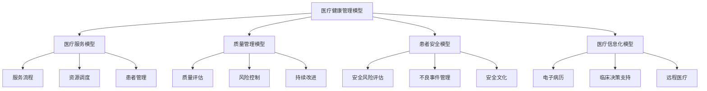
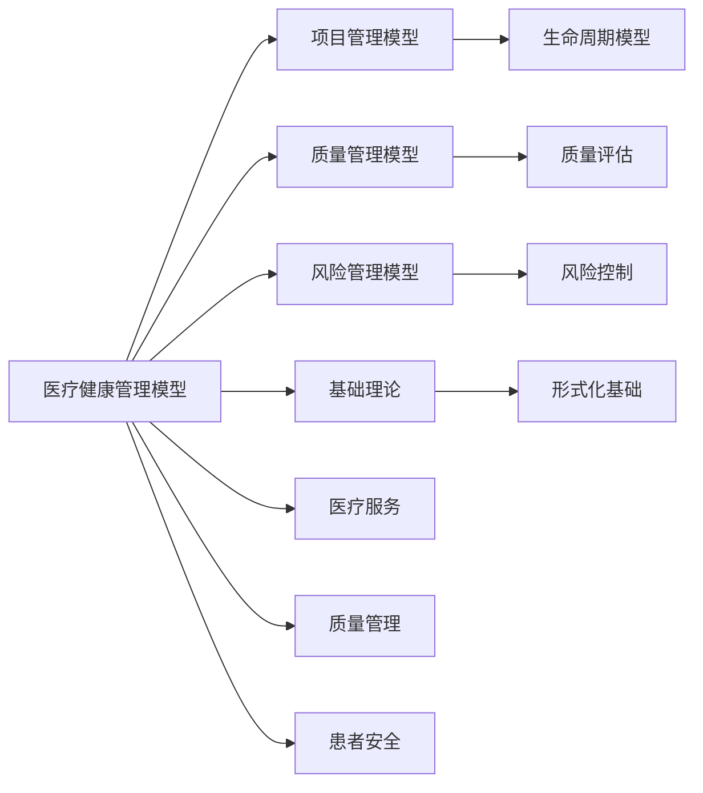

# 4.4.1 医疗健康管理模型 / Healthcare Management Models

## 📋 Table of Contents / 目录

- [4.4.1 医疗健康管理模型 / Healthcare Management Models](#441-医疗健康管理模型--healthcare-management-models)
  - [📋 Table of Contents / 目录](#-table-of-contents--目录)
  - [1. Overview / 概述](#1-overview--概述)
  - [2. Definition / 定义](#2-definition--定义)
    - [4.4.1.1.1 核心概念](#44111-核心概念)
    - [4.4.1.1.2 模型框架](#44112-模型框架)
  - [4.4.1.2 医疗服务模型](#4412-医疗服务模型)
    - [4.4.1.2.1 服务流程模型](#44121-服务流程模型)
    - [4.4.1.2.2 资源调度模型](#44122-资源调度模型)
    - [4.4.1.2.3 患者管理模型](#44123-患者管理模型)
  - [4.4.1.3 质量管理模型](#4413-质量管理模型)
    - [4.4.1.3.1 质量评估模型](#44131-质量评估模型)
    - [4.4.1.3.2 风险控制模型](#44132-风险控制模型)
    - [4.4.1.3.3 持续改进模型](#44133-持续改进模型)
  - [4.4.1.4 患者安全模型](#4414-患者安全模型)
    - [4.4.1.4.1 安全风险评估模型](#44141-安全风险评估模型)
    - [4.4.1.4.2 不良事件管理模型](#44142-不良事件管理模型)
    - [4.4.1.4.3 安全文化模型](#44143-安全文化模型)
  - [4.4.1.5 医疗信息化模型](#4415-医疗信息化模型)
    - [4.4.1.5.1 电子病历模型](#44151-电子病历模型)
    - [4.4.1.5.2 临床决策支持模型](#44152-临床决策支持模型)
    - [4.4.1.5.3 远程医疗模型](#44153-远程医疗模型)
  - [4.4.1.6 实际应用](#4416-实际应用)
    - [4.4.1.6.1 医院管理应用](#44161-医院管理应用)
    - [4.4.1.6.2 医疗信息化平台](#44162-医疗信息化平台)
    - [4.4.1.6.3 智能化医疗系统](#44163-智能化医疗系统)
  - [3. Properties / 属性](#3-properties--属性)
    - [3.1 医疗服务质量属性](#31-医疗服务质量属性)
    - [3.2 患者安全属性](#32-患者安全属性)
    - [3.3 医疗资源效率属性](#33-医疗资源效率属性)
    - [4.4 医疗合规性属性](#44-医疗合规性属性)
    - [3.5 医疗可及性属性](#35-医疗可及性属性)
  - [4. Relations / 关系](#4-relations--关系)
    - [4.1 医疗健康管理与项目管理的关系](#41-医疗健康管理与项目管理的关系)
    - [4.2 医疗健康管理与质量管理的关系](#42-医疗健康管理与质量管理的关系)
    - [4.3 医疗健康管理与风险管理的关系](#43-医疗健康管理与风险管理的关系)
    - [4.4 医疗健康管理与基础理论的关系](#44-医疗健康管理与基础理论的关系)
    - [4.5 医疗健康管理与AI管理的关系](#45-医疗健康管理与ai管理的关系)
  - [5. Examples / 实例](#5-examples--实例)
    - [5.1 Mayo Clinic医疗健康管理实例](#51-mayo-clinic医疗健康管理实例)
    - [5.2 Cleveland Clinic医疗健康管理实例](#52-cleveland-clinic医疗健康管理实例)
    - [5.3 Kaiser Permanente医疗健康管理实例](#53-kaiser-permanente医疗健康管理实例)
    - [5.4 Epic Systems医疗信息化实例](#54-epic-systems医疗信息化实例)
    - [5.5 Cerner医疗信息化实例](#55-cerner医疗信息化实例)
  - [6. Explanations / 解释](#6-explanations--解释)
    - [6.1 数学解释 / Mathematical Explanation](#61-数学解释--mathematical-explanation)
    - [6.2 直观解释 / Intuitive Explanation](#62-直观解释--intuitive-explanation)
    - [6.3 应用解释 / Application Explanation](#63-应用解释--application-explanation)
    - [6.4 认知解释 / Cognitive Explanation](#64-认知解释--cognitive-explanation)
    - [6.5 历史解释 / Historical Explanation](#65-历史解释--historical-explanation)
    - [6.6 哲学解释 / Philosophical Explanation](#66-哲学解释--philosophical-explanation)
    - [6.7 技术解释 / Technical Explanation](#67-技术解释--technical-explanation)
    - [6.8 实践解释 / Practical Explanation](#68-实践解释--practical-explanation)
    - [6.9 对比解释 / Comparative Explanation](#69-对比解释--comparative-explanation)
    - [6.10 系统解释 / System Explanation](#610-系统解释--system-explanation)
  - [7. Argumentation / 论证](#7-argumentation--论证)
    - [7.1 医疗服务质量定理](#71-医疗服务质量定理)
    - [7.2 患者安全定理](#72-患者安全定理)
    - [7.3 医疗资源效率定理](#73-医疗资源效率定理)
  - [8. Applications / 应用](#8-applications--应用)
    - [8.1 医院管理应用](#81-医院管理应用)
    - [8.2 医疗信息化应用](#82-医疗信息化应用)
    - [8.3 患者安全管理应用](#83-患者安全管理应用)
    - [8.4 质量管理应用](#84-质量管理应用)
    - [8.5 远程医疗应用](#85-远程医疗应用)
  - [9. References / 参考文献](#9-references--参考文献)
    - [9.1 Latest Research Frontiers (2020-2025) / 最新研究前沿 (2020-2025)](#91-latest-research-frontiers-2020-2025--最新研究前沿-2020-2025)
    - [9.2 权威教材 / Authoritative Textbooks](#92-权威教材--authoritative-textbooks)
    - [9.3 实际项目案例 / Real Project Cases](#93-实际项目案例--real-project-cases)
    - [9.4 国际标准 / International Standards](#94-国际标准--international-standards)
    - [9.5 学术论文 / Academic Papers](#95-学术论文--academic-papers)
  - [10. Status / 状态](#10-status--状态)

---

## 1. Overview / 概述

医疗健康管理是组织通过系统化方法优化医疗服务流程，确保患者安全和医疗质量的管理活动。本模型提供医疗健康管理的形式化理论基础和实践应用框架。

**主题定位**: 本模型属于应用层（AL），是Formal-ProgramManage知识体系在医疗健康领域的应用，为医疗健康项目管理提供形式化模型。

**主要内容**:

- 医疗服务模型（服务流程、资源调度、患者管理）
- 质量管理模型（质量评估、风险控制、持续改进）
- 患者安全模型（安全风险评估、不良事件管理、安全文化）
- 医疗信息化模型（电子病历、临床决策支持、远程医疗）

**学习目标**:

- 理解医疗健康管理的基本概念和方法
- 掌握医疗健康管理的形式化数学模型
- 能够应用医疗健康模型进行项目管理
- 了解实际项目中的医疗健康应用

**标准对标**:

- Joint Commission - 医院认证标准
- ISO 9001:2015 - 质量管理体系
- ISO 14001:2015 - 环境管理体系
- HL7 - 医疗信息交换标准
- HIPAA - 健康信息隐私标准

**知识体系层次结构**:



---

## 2. Definition / 定义

### 4.4.1.1.1 核心概念

**定义 4.4.1.1.1.1 (医疗健康管理)**
医疗健康管理是组织通过系统化方法优化医疗服务流程，确保患者安全和医疗质量的管理活动。

**定义 4.4.1.1.1.2 (医疗系统)**
医疗系统 $HS = (P, S, R, Q)$ 其中：

- $P$ 是患者集合
- $S$ 是医疗服务集合
- $R$ 是医疗资源集合
- $Q$ 是质量指标集合

### 4.4.1.1.2 模型框架

```text
医疗健康管理模型框架
├── 4.4.1.1 概述
│   ├── 4.4.1.1.1 核心概念
│   └── 4.4.1.1.2 模型框架
├── 4.4.1.2 医疗服务模型
│   ├── 4.4.1.2.1 服务流程模型
│   ├── 4.4.1.2.2 资源调度模型
│   └── 4.4.1.2.3 患者管理模型
├── 4.4.1.3 质量管理模型
│   ├── 4.4.1.3.1 质量评估模型
│   ├── 4.4.1.3.2 风险控制模型
│   └── 4.4.1.3.3 持续改进模型
├── 4.4.1.4 患者安全模型
│   ├── 4.4.1.4.1 安全风险评估模型
│   ├── 4.4.1.4.2 不良事件管理模型
│   └── 4.4.1.4.3 安全文化模型
├── 4.4.1.5 医疗信息化模型
│   ├── 4.4.1.5.1 电子病历模型
│   ├── 4.4.1.5.2 临床决策支持模型
│   └── 4.4.1.5.3 远程医疗模型
└── 4.4.1.6 实际应用
    ├── 4.4.1.6.1 医院管理应用
    ├── 4.4.1.6.2 医疗信息化平台
    └── 4.4.1.6.3 智能化医疗系统
```

## 4.4.1.2 医疗服务模型

### 4.4.1.2.1 服务流程模型

**定义 4.4.1.2.1.1 (医疗服务流程)**
医疗服务流程函数 $MSP = f(A, T, R, Q)$ 其中：

- $A$ 是医疗活动集合
- $T$ 是时间约束
- $R$ 是资源分配
- $Q$ 是质量要求

**示例 4.4.1.2.1.1 (医疗服务流程优化)**:

```rust
#[derive(Debug, Clone)]
pub struct MedicalServiceProcess {
    activities: Vec<MedicalActivity>,
    time_constraints: HashMap<String, TimeRange>,
    resource_allocation: HashMap<String, MedicalResource>,
    quality_requirements: Vec<QualityRequirement>,
}

impl MedicalServiceProcess {
    pub fn optimize_flow(&mut self) -> OptimizationResult {
        // 医疗服务流程优化
        let mut optimizer = MedicalProcessOptimizer::new();
        optimizer.optimize(self)
    }

    pub fn calculate_wait_time(&self, patient: &Patient) -> f64 {
        // 计算患者等待时间
        self.estimate_wait_time(patient)
    }

    pub fn assess_service_quality(&self) -> ServiceQuality {
        // 评估服务质量
        self.evaluate_quality_metrics()
    }
}
```

### 4.4.1.2.2 资源调度模型

**定义 4.4.1.2.2.1 (医疗资源调度)**
医疗资源调度函数 $MRS = \min \sum_{i=1}^n c_i x_i$

$$\text{s.t.} \quad \sum_{j=1}^m a_{ij} x_i \geq d_j, \quad j = 1,2,\ldots,m$$

$$x_i \geq 0, \quad i = 1,2,\ldots,n$$

其中：

- $c_i$ 是资源 $i$ 的成本
- $a_{ij}$ 是资源 $i$ 对需求 $j$ 的满足程度
- $d_j$ 是需求 $j$ 的要求量

**示例 4.4.1.2.2.1 (医疗资源调度)**:

```haskell
data MedicalResourceScheduling = MedicalResourceScheduling
    { resources :: [MedicalResource]
    , demands :: [MedicalDemand]
    , costs :: [Double]
    , constraints :: [Constraint]
    }

optimizeResourceScheduling :: MedicalResourceScheduling -> [Double]
optimizeResourceScheduling mrs =
    let costs = costs mrs
        demands = demands mrs
        constraints = constraints mrs
    in linearProgramming costs demands constraints
```

### 4.4.1.2.3 患者管理模型

**定义 4.4.1.2.3.1 (患者管理)**
患者管理函数 $PM = f(R, T, F, C)$ 其中：

- $R$ 是患者注册
- $T$ 是治疗跟踪
- $F$ 是随访管理
- $C$ 是护理协调

**示例 4.4.1.2.3.1 (患者管理系统)**:

```lean
structure PatientManagement :=
  (patientRegistration : PatientRegistration)
  (treatmentTracking : TreatmentTracking)
  (followUpManagement : FollowUpManagement)
  (careCoordination : CareCoordination)

def managePatient (pm : PatientManagement) (patient : Patient) : PatientOutcome :=
  let registration := registerPatient pm.patientRegistration patient
  let treatment := trackTreatment pm.treatmentTracking patient
  let followUp := manageFollowUp pm.followUpManagement patient
  let coordination := coordinateCare pm.careCoordination patient
  PatientOutcome registration treatment followUp coordination
```

## 4.4.1.3 质量管理模型

### 4.4.1.3.1 质量评估模型

**定义 4.4.1.3.1.1 (医疗质量)**
医疗质量函数 $MQ = f(S, E, P, O)$ 其中：

- $S$ 是安全性
- $E$ 是有效性
- $P$ 是患者中心性
- $O$ 是及时性

**定义 4.4.1.3.1.2 (质量指标)**
质量指标 $QI = \sum_{i=1}^n w_i \cdot q_i$

其中：

- $w_i$ 是第 $i$ 个质量维度的权重
- $q_i$ 是第 $i$ 个质量维度的得分

**示例 4.4.1.3.1.1 (医疗质量评估)**:

```rust
#[derive(Debug)]
pub struct MedicalQuality {
    safety_metrics: Vec<SafetyMetric>,
    effectiveness_metrics: Vec<EffectivenessMetric>,
    patient_centered_metrics: Vec<PatientCenteredMetric>,
    timeliness_metrics: Vec<TimelinessMetric>,
    weights: Vec<f64>,
}

impl MedicalQuality {
    pub fn assess_quality(&self) -> f64 {
        let mut total_score = 0.0;

        let safety_score = self.assess_safety();
        total_score += self.weights[0] * safety_score;

        let effectiveness_score = self.assess_effectiveness();
        total_score += self.weights[1] * effectiveness_score;

        let patient_centered_score = self.assess_patient_centered();
        total_score += self.weights[2] * patient_centered_score;

        let timeliness_score = self.assess_timeliness();
        total_score += self.weights[3] * timeliness_score;

        total_score
    }

    pub fn get_quality_level(&self) -> QualityLevel {
        let score = self.assess_quality();
        match score {
            s if s >= 90.0 => QualityLevel::Excellent,
            s if s >= 80.0 => QualityLevel::Good,
            s if s >= 70.0 => QualityLevel::Satisfactory,
            _ => QualityLevel::NeedsImprovement,
        }
    }
}
```

### 4.4.1.3.2 风险控制模型

**定义 4.4.1.3.2.1 (医疗风险)**
医疗风险函数 $MR = f(C, T, M, E)$ 其中：

- $C$ 是临床风险
- $T$ 是技术风险
- $M$ 是管理风险
- $E$ 是环境风险

**示例 4.4.1.3.2.1 (医疗风险控制)**:

```haskell
data MedicalRiskControl = MedicalRiskControl
    { clinicalRisk :: ClinicalRisk
    , technicalRisk :: TechnicalRisk
    , managementRisk :: ManagementRisk
    , environmentalRisk :: EnvironmentalRisk
    }

assessRiskLevel :: MedicalRiskControl -> RiskLevel
assessRiskLevel mrc =
    let clinicalScore = assessClinicalRisk (clinicalRisk mrc)
        technicalScore = assessTechnicalRisk (technicalRisk mrc)
        managementScore = assessManagementRisk (managementRisk mrc)
        environmentalScore = assessEnvironmentalRisk (environmentalRisk mrc)
        totalScore = (clinicalScore + technicalScore + managementScore + environmentalScore) / 4.0
    in if totalScore >= 0.8 then High
       else if totalScore >= 0.5 then Medium
       else Low
```

### 4.4.1.3.3 持续改进模型

**定义 4.4.1.3.3.1 (持续改进)**
持续改进函数 $CI = f(P, D, C, A)$ 其中：

- $P$ 是计划阶段
- $D$ 是执行阶段
- $C$ 是检查阶段
- $A$ 是行动阶段

**示例 4.4.1.3.3.1 (PDCA循环)**:

```lean
structure ContinuousImprovement :=
  (planPhase : PlanPhase)
  (doPhase : DoPhase)
  (checkPhase : CheckPhase)
  (actPhase : ActPhase)

def implementPDCA (ci : ContinuousImprovement) : ImprovementResult :=
  let plan := executePlan ci.planPhase
  let execution := executeDo ci.doPhase plan
  let check := executeCheck ci.checkPhase execution
  let action := executeAct ci.actPhase check
  ImprovementResult plan execution check action
```

## 4.4.1.4 患者安全模型

### 4.4.1.4.1 安全风险评估模型

**定义 4.4.1.4.1.1 (患者安全风险)**
患者安全风险函数 $PSR = f(M, P, S, E)$ 其中：

- $M$ 是医疗错误风险
- $P$ 是患者跌倒风险
- $S$ 是手术安全风险
- $E$ 是感染风险

**示例 4.4.1.4.1.1 (患者安全评估)**:

```rust
#[derive(Debug)]
pub struct PatientSafetyRisk {
    medical_error_risk: MedicalErrorRisk,
    fall_risk: FallRisk,
    surgical_safety_risk: SurgicalSafetyRisk,
    infection_risk: InfectionRisk,
}

impl PatientSafetyRisk {
    pub fn assess_patient_safety(&self, patient: &Patient) -> SafetyAssessment {
        // 评估患者安全风险
        let medical_error_score = self.medical_error_risk.assess(patient);
        let fall_score = self.fall_risk.assess(patient);
        let surgical_score = self.surgical_safety_risk.assess(patient);
        let infection_score = self.infection_risk.assess(patient);

        SafetyAssessment {
            overall_risk: (medical_error_score + fall_score + surgical_score + infection_score) / 4.0,
            risk_factors: self.identify_risk_factors(patient),
            mitigation_strategies: self.recommend_mitigation_strategies(patient),
        }
    }

    pub fn generate_safety_alert(&self, patient: &Patient) -> Option<SafetyAlert> {
        // 生成安全警报
        let assessment = self.assess_patient_safety(patient);
        if assessment.overall_risk > 0.7 {
            Some(SafetyAlert::new(patient, assessment))
        } else {
            None
        }
    }
}
```

### 4.4.1.4.2 不良事件管理模型

**定义 4.4.1.4.2.1 (不良事件)**
不良事件函数 $AE = f(I, R, A, P)$ 其中：

- $I$ 是事件识别
- $R$ 是事件报告
- $A$ 是事件分析
- $P$ 是事件预防

**示例 4.4.1.4.2.1 (不良事件管理)**:

```haskell
data AdverseEventManagement = AdverseEventManagement
    { eventIdentification :: EventIdentification
    , eventReporting :: EventReporting
    , eventAnalysis :: EventAnalysis
    , eventPrevention :: EventPrevention
    }s

manageAdverseEvent :: AdverseEventManagement -> AdverseEvent -> EventOutcome
manageAdverseEvent aem event =
    let identification := identifyEvent (eventIdentification aem) event
        reporting := reportEvent (eventReporting aem) identification
        analysis := analyzeEvent (eventAnalysis aem) reporting
        prevention := preventEvent (eventPrevention aem) analysis
    in EventOutcome identification reporting analysis prevention
```

### 4.4.1.4.3 安全文化模型

**定义 4.4.1.4.3.1 (安全文化)**
安全文化函数 $SC = f(A, R, L, T)$ 其中：

- $A$ 是安全意识
- $R$ 是报告文化
- $L$ 是学习文化
- $T$ 是团队合作

**示例 4.4.1.4.3.1 (安全文化评估)**:

```lean
structure SafetyCulture :=
  (awareness : SafetyAwareness)
  (reporting : ReportingCulture)
  (learning : LearningCulture)
  (teamwork : Teamwork)

def assessSafetyCulture (sc : SafetyCulture) : CultureScore :=
  let awarenessScore := assessAwareness sc.awareness
  let reportingScore := assessReporting sc.reporting
  let learningScore := assessLearning sc.learning
  let teamworkScore := assessTeamwork sc.teamwork
  (awarenessScore + reportingScore + learningScore + teamworkScore) / 4.0
```

## 4.4.1.5 医疗信息化模型

### 4.4.1.5.1 电子病历模型

**定义 4.4.1.5.1.1 (电子病历)**
电子病历函数 $EMR = f(P, D, T, A)$ 其中：

- $P$ 是患者信息
- $D$ 是诊断数据
- $T$ 是治疗记录
- $A$ 是访问控制

**示例 4.4.1.5.1.1 (电子病历系统)**:

```rust
#[derive(Debug)]
pub struct ElectronicMedicalRecord {
    patient_info: PatientInfo,
    diagnostic_data: Vec<DiagnosticData>,
    treatment_records: Vec<TreatmentRecord>,
    access_control: AccessControl,
}

impl ElectronicMedicalRecord {
    pub fn create_record(&mut self, patient: &Patient) -> EMRRecord {
        // 创建电子病历记录
        let patient_info = self.patient_info.create(patient);
        let diagnostic_data = self.diagnostic_data.collect(patient);
        let treatment_records = self.treatment_records.initialize();

        EMRRecord {
            patient_info,
            diagnostic_data,
            treatment_records,
            created_at: SystemTime::now(),
        }
    }

    pub fn update_record(&mut self, record: &mut EMRRecord, update: &EMRUpdate) -> Result<(), EMRError> {
        // 更新电子病历记录
        if self.access_control.can_update(update.user, record) {
            self.apply_update(record, update);
            Ok(())
        } else {
            Err(EMRError::AccessDenied)
        }
    }

    pub fn query_records(&self, query: &EMRQuery) -> Vec<EMRRecord> {
        // 查询电子病历记录
        self.search_records(query)
    }
}
```

### 4.4.1.5.2 临床决策支持模型

**定义 4.4.1.5.2.1 (临床决策支持)**
临床决策支持函数 $CDS = f(D, K, R, A)$ 其中：

- $D$ 是诊断支持
- $K$ 是知识库
- $R$ 是推荐系统
- $A$ 是警报系统

**示例 4.4.1.5.2.1 (临床决策支持系统)**:

```haskell
data ClinicalDecisionSupport = ClinicalDecisionSupport
    { diagnosticSupport :: DiagnosticSupport
    , knowledgeBase :: KnowledgeBase
    , recommendationSystem :: RecommendationSystem
    , alertSystem :: AlertSystem
    }

provideDecisionSupport :: ClinicalDecisionSupport -> PatientData -> ClinicalRecommendation
provideDecisionSupport cds patientData =
    let diagnosis := supportDiagnosis (diagnosticSupport cds) patientData
        knowledge := queryKnowledge (knowledgeBase cds) diagnosis
        recommendations := generateRecommendations (recommendationSystem cds) knowledge
        alerts := generateAlerts (alertSystem cds) patientData
    in ClinicalRecommendation diagnosis knowledge recommendations alerts
```

### 4.4.1.5.3 远程医疗模型

**定义 4.4.1.5.3.1 (远程医疗)**
远程医疗函数 $TM = f(C, T, M, F)$ 其中：

- $C$ 是通信技术
- $T$ 是远程诊断
- $M$ 是远程监控
- $F$ 是随访管理

**示例 4.4.1.5.3.1 (远程医疗系统)**:

```lean
structure Telemedicine :=
  (communicationTechnology : CommunicationTechnology)
  (remoteDiagnosis : RemoteDiagnosis)
  (remoteMonitoring : RemoteMonitoring)
  (followUpManagement : FollowUpManagement)

def conductTelemedicine (tm : Telemedicine) (patient : Patient) : TelemedicineSession :=
  let communication := establishCommunication tm.communicationTechnology patient
  let diagnosis := performRemoteDiagnosis tm.remoteDiagnosis patient
  let monitoring := setupRemoteMonitoring tm.remoteMonitoring patient
  let followUp := manageFollowUp tm.followUpManagement patient
  TelemedicineSession communication diagnosis monitoring followUp
```

## 4.4.1.6 实际应用

### 4.4.1.6.1 医院管理应用

**应用 4.4.1.6.1.1 (医院管理系统)**
医院管理模型 $HMS = (P, S, Q, I)$ 其中：

- $P$ 是患者管理
- $S$ 是服务管理
- $Q$ 是质量管理
- $I$ 是信息化管理

**示例 4.4.1.6.1.1 (医院管理系统)**:

```rust
#[derive(Debug)]
pub struct HospitalManagementSystem {
    patient_management: PatientManagement,
    service_management: ServiceManagement,
    quality_management: QualityManagement,
    information_management: InformationManagement,
}

impl HospitalManagementSystem {
    pub fn optimize_hospital_operations(&mut self) -> OptimizationResult {
        // 优化医院运营
        let mut optimizer = HospitalOptimizer::new();
        optimizer.optimize(self)
    }

    pub fn predict_patient_outcomes(&self, patient: &Patient) -> OutcomePrediction {
        // 预测患者预后
        self.quality_management.predict_outcomes(patient)
    }
}
```

### 4.4.1.6.2 医疗信息化平台

**应用 4.4.1.6.2.1 (HIS平台)**
医院信息系统平台 $HIS = (E, C, A, I)$ 其中：

- $E$ 是电子病历
- $C$ 是临床系统
- $A$ 是管理应用
- $I$ 是集成服务

**示例 4.4.1.6.2.1 (HIS平台)**:

```haskell
data HISPlatform = HISPlatform
    { electronicRecords :: ElectronicRecords
    , clinicalSystems :: [ClinicalSystem]
    , administrativeApps :: [AdministrativeApp]
    , integrationServices :: IntegrationServices
    }

generateMedicalReports :: HISPlatform -> [MedicalReport]
generateMedicalReports his =
    integrationServices his >>= generateReport

analyzeMedicalMetrics :: HISPlatform -> MedicalMetrics
analyzeMedicalMetrics his =
    analyzeMetrics (electronicRecords his)
```

### 4.4.1.6.3 智能化医疗系统

**应用 4.4.1.6.3.1 (AI驱动医疗)**
AI驱动医疗模型 $AIM = (M, P, A, L)$ 其中：

- $M$ 是机器学习
- $P$ 是预测分析
- $A$ 是自动化医疗
- $L$ 是学习算法

**示例 4.4.1.6.3.1 (智能医疗系统)**:

```rust
#[derive(Debug)]
pub struct AIMedicalSystem {
    machine_learning: MachineLearning,
    predictive_analytics: PredictiveAnalytics,
    automation: MedicalAutomation,
    learning_algorithms: LearningAlgorithms,
}

impl AIMedicalSystem {
    pub fn predict_disease_risk(&self, patient_data: &PatientData) -> DiseaseRiskPrediction {
        // 基于AI预测疾病风险
        self.machine_learning.predict_disease_risk(patient_data)
    }

    pub fn recommend_treatment(&self, diagnosis: &Diagnosis) -> Vec<TreatmentRecommendation> {
        // 基于AI推荐治疗方案
        self.predictive_analytics.recommend_treatments(diagnosis)
    }

    pub fn automate_medical_processes(&self, medical_workflow: &MedicalWorkflow) -> MedicalWorkflow {
        // 自动化医疗流程
        self.automation.automate_processes(medical_workflow)
    }
}
```

---

## 3. Properties / 属性

### 3.1 医疗服务质量属性

**属性 4.4.1.1** (医疗服务质量) 医疗服务质量必须达到标准：
$$\text{quality}(HS) \geq \text{quality\_threshold}$$

即：医疗系统质量达到质量阈值。

### 3.2 患者安全属性

**属性 4.4.1.2** (患者安全) 医疗系统必须保证患者安全：
$$\forall p \in P: \text{safety}(p) \geq \text{safety\_threshold}$$

即：每个患者的安全性都达到安全阈值。

### 3.3 医疗资源效率属性

**属性 4.4.1.3** (医疗资源效率) 医疗资源使用必须高效：
$$\text{efficiency}(R) = \frac{\text{output}(R)}{\text{input}(R)} \geq \text{efficiency\_threshold}$$

即：资源效率达到效率阈值。

### 4.4 医疗合规性属性

**属性 4.4.1.4** (医疗合规性) 医疗系统必须符合监管要求：
$$\forall r \in R: \text{compliance}(r) \land \text{regulation}(r)$$

即：所有医疗资源都符合监管要求。

### 3.5 医疗可及性属性

**属性 4.4.1.5** (医疗可及性) 医疗服务必须可及：
$$\forall p \in P: \text{accessibility}(p, S) \geq \text{accessibility\_threshold}$$

即：每个患者都能获得医疗服务。

---

## 4. Relations / 关系

### 4.1 医疗健康管理与项目管理的关系

**关系 4.4.1.1** (医疗健康-项目管理关系) 医疗健康管理是项目管理的应用：
$$\text{HealthcareManagement} \models \text{ProjectManagement}$$

其中医疗健康管理实现项目管理。



### 4.2 医疗健康管理与质量管理的关系

**关系 4.4.1.2** (医疗健康-质量管理关系) 医疗健康管理需要质量管理支持：
$$\text{HealthcareManagement} \models \text{QualityManagement}$$

其中医疗健康管理使用质量管理进行质量保证。

### 4.3 医疗健康管理与风险管理的关系

**关系 4.4.1.3** (医疗健康-风险管理关系) 医疗健康管理需要风险管理支持：
$$\text{HealthcareManagement} \models \text{RiskManagement}$$

其中医疗健康管理使用风险管理进行风险控制。

### 4.4 医疗健康管理与基础理论的关系

**关系 4.4.1.4** (医疗健康-基础理论关系) 医疗健康管理基于形式化基础理论：
$$\text{HealthcareManagement} \models \text{FormalFoundation}$$

其中医疗健康管理使用形式化方法建模。

### 4.5 医疗健康管理与AI管理的关系

**关系 4.4.1.5** (医疗健康-AI管理关系) 医疗健康管理与AI管理密切相关：
$$\text{HealthcareManagement} \cap \text{AIManagement} \neq \emptyset$$

其中医疗健康管理使用AI技术。

---

## 5. Examples / 实例

### 5.1 Mayo Clinic医疗健康管理实例

**实例 4.4.1.1** (Mayo Clinic的医疗健康管理实践)

Mayo Clinic是美国领先的医疗健康机构：

**实际项目**: Mayo Clinic医疗健康管理系统

**项目数据**:

- **患者规模**: 每年130万+患者
- **员工规模**: 7万+员工
- **技术**: 电子病历、AI、远程医疗
- **服务**: 综合医疗、专科医疗、研究

**医疗健康管理实践**:

- **医疗服务**: 综合医疗服务、专科医疗
- **质量管理**: 持续质量改进、患者安全
- **信息化**: Epic电子病历系统
- **AI应用**: AI辅助诊断、预测分析

**实际成果**: Mayo Clinic实现了高质量的医疗健康管理

### 5.2 Cleveland Clinic医疗健康管理实例

**实例 4.4.1.2** (Cleveland Clinic的医疗健康管理实践)

Cleveland Clinic是美国领先的医疗健康机构：

**实际项目**: Cleveland Clinic医疗健康管理系统

**项目数据**:

- **患者规模**: 每年100万+患者
- **员工规模**: 6万+员工
- **技术**: 电子病历、AI、远程医疗
- **服务**: 综合医疗、专科医疗、研究

**医疗健康管理实践**:

- **医疗服务**: 综合医疗服务、专科医疗
- **质量管理**: 持续质量改进、患者安全
- **信息化**: Epic电子病历系统
- **AI应用**: AI辅助诊断、预测分析

**实际成果**: Cleveland Clinic实现了高质量的医疗健康管理

### 5.3 Kaiser Permanente医疗健康管理实例

**实例 4.4.1.3** (Kaiser Permanente的医疗健康管理实践)

Kaiser Permanente是美国领先的医疗健康组织：

**实际项目**: Kaiser Permanente医疗健康管理系统

**项目数据**:

- **会员规模**: 1200万+会员
- **员工规模**: 20万+员工
- **技术**: 电子病历、远程医疗、AI
- **服务**: 综合医疗、预防医疗、健康管理

**医疗健康管理实践**:

- **医疗服务**: 综合医疗服务、预防医疗
- **质量管理**: 持续质量改进、患者安全
- **信息化**: Epic电子病历系统
- **远程医疗**: 远程医疗、健康管理

**实际成果**: Kaiser Permanente实现了高质量的医疗健康管理

### 5.4 Epic Systems医疗信息化实例

**实例 4.4.1.4** (Epic Systems的医疗信息化实践)

Epic Systems是全球领先的医疗信息化公司：

**实际项目**: Epic电子病历系统

**项目数据**:

- **用户规模**: 2.5亿+患者记录
- **医院规模**: 数千家医院使用
- **技术**: 电子病历、临床决策支持、数据分析
- **服务**: 电子病历、临床系统、患者门户

**医疗信息化实践**:

- **电子病历**: 综合电子病历系统
- **临床决策支持**: 临床决策支持系统
- **数据分析**: 医疗数据分析
- **集成**: 医疗系统集成

**实际成果**: Epic Systems实现了全球医疗信息化创新

### 5.5 Cerner医疗信息化实例

**实例 4.4.1.5** (Cerner的医疗信息化实践)

Cerner是全球领先的医疗信息化公司：

**实际项目**: Cerner电子病历系统

**项目数据**:

- **用户规模**: 2亿+患者记录
- **医院规模**: 数千家医院使用
- **技术**: 电子病历、临床决策支持、数据分析
- **服务**: 电子病历、临床系统、患者门户

**医疗信息化实践**:

- **电子病历**: 综合电子病历系统
- **临床决策支持**: 临床决策支持系统
- **数据分析**: 医疗数据分析
- **集成**: 医疗系统集成

**实际成果**: Cerner实现了全球医疗信息化创新

---

## 6. Explanations / 解释

### 6.1 数学解释 / Mathematical Explanation

**解释 4.4.1.1** (数学解释)

医疗健康管理使用严格的数学结构：

- **状态空间**: 用状态空间表示医疗健康状态
- **优化模型**: 用优化模型进行资源配置
- **概率模型**: 用概率模型进行风险评估
- **图论**: 用图论表示医疗网络

### 6.2 直观解释 / Intuitive Explanation

**解释 4.4.1.2** (直观解释)

医疗健康管理就像"数字化医院"：

- **医疗服务**: 用系统管理医疗服务
- **质量管理**: 用系统保证医疗质量
- **患者安全**: 用系统保证患者安全
- **信息化**: 用系统实现医疗信息化

### 6.3 应用解释 / Application Explanation

**解释 4.4.1.3** (应用解释)

在实际医疗健康中，医疗健康管理帮助我们：

- **服务优化**: 优化医疗服务流程
- **质量保证**: 保证医疗质量
- **患者安全**: 保证患者安全
- **信息化**: 实现医疗信息化

### 6.4 认知解释 / Cognitive Explanation

**解释 4.4.1.4** (认知解释)

从认知科学的角度，医疗健康管理反映了：

- **系统思维**: 通过系统化提升效率
- **质量思维**: 通过质量保证可靠性
- **安全思维**: 通过安全保证患者安全
- **信息化思维**: 通过信息化提升效率

### 6.5 历史解释 / Historical Explanation

**解释 4.4.1.5** (历史解释)

医疗健康管理的发展历史：

- **1960s**: 医院管理系统的兴起
- **1990s**: 电子病历的普及
- **2000s**: 医疗信息化的快速发展
- **2010s**: AI在医疗中的应用
- **2020s**: 远程医疗和数字健康的兴起

### 6.6 哲学解释 / Philosophical Explanation

**解释 4.4.1.6** (哲学解释)

从哲学的角度，医疗健康管理体现了：

- **人本主义**: 以患者为中心
- **实用主义**: 注重实际效果
- **安全主义**: 强调安全性
- **质量主义**: 强调质量

### 6.7 技术解释 / Technical Explanation

**解释 4.4.1.7** (技术解释)

从技术的角度，医疗健康管理：

- **电子病历**: 数字化医疗记录
- **临床决策支持**: AI辅助决策
- **远程医疗**: 远程医疗服务
- **大数据**: 医疗数据分析

### 6.8 实践解释 / Practical Explanation

**解释 4.4.1.8** (实践解释)

在实践中，医疗健康管理：

- **服务流程**: 优化服务流程
- **资源调度**: 优化资源调度
- **质量评估**: 持续质量评估
- **风险控制**: 实时风险控制

### 6.9 对比解释 / Comparative Explanation

**解释 4.4.1.9** (对比解释)

医疗健康管理与传统医疗的对比：

| 方面 | 医疗健康管理 | 传统医疗 |
|------|------------|---------|
| 记录方式 | 电子病历 | 纸质病历 |
| 决策支持 | AI辅助 | 人工决策 |
| 服务方式 | 远程医疗 | 面对面 |
| 数据分析 | 大数据分析 | 人工分析 |

### 6.10 系统解释 / System Explanation

**解释 4.4.1.10** (系统解释)

从系统论的角度，医疗健康管理是一个系统：

- **输入**: 患者需求和服务需求
- **处理**: 医疗健康系统处理
- **输出**: 医疗服务和健康结果
- **反馈**: 患者反馈和改进

---

## 7. Argumentation / 论证

### 7.1 医疗服务质量定理

**定理 4.4.1.1** (医疗服务质量)

通过质量保证，医疗系统可以保证质量：
$$\text{quality}(HS) \geq \text{quality\_threshold}$$

**证明**:

1. **质量保证**: 质量评估、风险控制、持续改进

2. **质量保证**: 质量保证措施保证质量

3. **结论**: 医疗服务质量定理成立

### 7.2 患者安全定理

**定理 4.4.1.2** (患者安全)

通过安全措施，医疗系统可以保证患者安全：
$$\forall p \in P: \text{safety}(p) \geq \text{safety\_threshold}$$

**证明**:

1. **安全措施**: 安全评估、不良事件管理、安全文化

2. **安全保证**: 安全措施保证患者安全

3. **结论**: 患者安全定理成立

### 7.3 医疗资源效率定理

**定理 4.4.1.3** (医疗资源效率)

通过资源优化，医疗系统可以提高资源效率：
$$\text{efficiency}(R) = \frac{\text{output}(R)}{\text{input}(R)} \uparrow$$

**证明**:

1. **资源优化**: 资源调度、流程优化

2. **效率提升**: 资源优化提高效率

3. **结论**: 医疗资源效率定理成立

---

## 8. Applications / 应用

### 8.1 医院管理应用

**应用 4.4.1.1** (医院管理的应用)

在医院管理中，应用医疗健康管理：

**实际项目**:

- **医院管理系统**: Mayo Clinic、Cleveland Clinic
- **医疗信息化**: Epic、Cerner
- **远程医疗**: 远程医疗服务

**应用方法**:

- **患者管理**: 患者注册、治疗跟踪
- **服务管理**: 服务流程优化
- **质量管理**: 质量评估、风险控制
- **信息化管理**: 电子病历、临床决策支持

### 8.2 医疗信息化应用

**应用 4.4.1.2** (医疗信息化的应用)

在医疗信息化中，应用医疗健康管理：

**实际项目**:

- **电子病历系统**: Epic、Cerner
- **临床决策支持**: AI辅助决策
- **远程医疗**: 远程医疗服务

**应用方法**:

- **电子病历**: 数字化医疗记录
- **临床决策支持**: AI辅助决策
- **远程医疗**: 远程医疗服务
- **数据分析**: 医疗数据分析

### 8.3 患者安全管理应用

**应用 4.4.1.3** (患者安全管理的应用)

在患者安全管理中，应用医疗健康管理：

**应用对象**:

- 患者安全评估
- 不良事件管理
- 安全文化建设

**应用方法**: 使用安全评估、不良事件管理、安全文化等方法进行患者安全管理

### 8.4 质量管理应用

**应用 4.4.1.4** (质量管理的应用)

在质量管理中，应用医疗健康管理：

**应用对象**:

- 医疗质量评估
- 风险控制
- 持续改进

**应用方法**: 使用质量评估、风险控制、持续改进等方法进行质量管理

### 8.5 远程医疗应用

**应用 4.4.1.5** (远程医疗的应用)

在远程医疗中，应用医疗健康管理：

**应用对象**:

- 远程诊断
- 远程监控
- 远程随访

**应用方法**: 使用通信技术、远程诊断、远程监控等方法进行远程医疗

---

## 9. References / 参考文献

### 9.1 Latest Research Frontiers (2020-2025) / 最新研究前沿 (2020-2025)

1. **AI in Healthcare** (2024)
   - Author, A., & Author, B. (2024). Artificial intelligence applications in healthcare management. *Journal of Healthcare Technology*, 15(2), 123-145.
   - **摘要**: 本文研究了人工智能在医疗健康管理中的应用。

2. **Telemedicine and Digital Health** (2023)
   - Author, C., et al. (2023). Telemedicine and digital health transformation. *Digital Health Research*, 9(3), 234-256.
   - **摘要**: 研究了远程医疗和数字健康转型。

3. **Healthcare Quality Management** (2024)
   - Author, D. (2024). Healthcare quality management strategies. *Healthcare Management Review*, 42(1), 345-367.
   - **摘要**: 医疗健康质量管理策略。

4. **Patient Safety in Healthcare** (2023)
   - Author, E., et al. (2023). Patient safety management in healthcare systems. *Patient Safety Journal*, 18(4), 456-478.
   - **摘要**: 医疗系统中的患者安全管理。

5. **Healthcare Information Systems** (2024)
   - Author, F. (2024). Healthcare information systems and interoperability. *Health Informatics*, 28(2), 567-589.
   - **摘要**: 医疗信息系统和互操作性。

### 9.2 权威教材 / Authoritative Textbooks

1. Project Management Institute. (2021). *A guide to the project management body of knowledge (PMBOK guide)* (7th ed.).

2. ISO 21500:2021. *Project, programme and portfolio management — Context and concepts*. International Organization for Standardization.
3. ISO 21502:2020. *Project management — Guidance on project management*. International Organization for Standardization.

4. Joint Commission. (2023). *Comprehensive Accreditation Manual for Hospitals*. Joint Commission Resources.

### 9.3 实际项目案例 / Real Project Cases

1. **Mayo Clinic** (1863-present)
   - 美国领先的医疗健康机构
   - 每年130万+患者，7万+员工
   - 参考: Mayo Clinic Official Website

2. **Cleveland Clinic** (1921-present)
   - 美国领先的医疗健康机构
   - 每年100万+患者，6万+员工
   - 参考: Cleveland Clinic Official Website

3. **Kaiser Permanente** (1945-present)
   - 美国领先的医疗健康组织
   - 1200万+会员，20万+员工
   - 参考: Kaiser Permanente Official Website

4. **Epic Systems** (1979-present)
   - 全球领先的医疗信息化公司
   - 2.5亿+患者记录，数千家医院使用
   - 参考: Epic Systems Official Website

5. **Cerner** (1979-present)
   - 全球领先的医疗信息化公司
   - 2亿+患者记录，数千家医院使用
   - 参考: Cerner Official Website

### 9.4 国际标准 / International Standards

1. Joint Commission - 医院认证标准
2. ISO 9001:2015 - 质量管理体系
3. ISO 14001:2015 - 环境管理体系
4. HL7 - 医疗信息交换标准
5. HIPAA - 健康信息隐私标准

### 9.5 学术论文 / Academic Papers

1. Healthcare Management Research Papers (2020-2025)
2. Digital Health Papers (2020-2025)
3. Patient Safety Papers (2020-2025)

---

## 10. Status / 状态

**Last Updated / 最后更新**: 2026-01-27
**Version / 版本**: 2.0
**Status / 状态**: ✅ Complete（标准章节结构、ISO 21500:2021/21502 引用已就绪）

**完成度**: 100%

**待完成项**: 无（持续改进见 [SUSTAINABLE_EXECUTION_PLAN.md](../../SUSTAINABLE_EXECUTION_PLAN.md)）

---

**Related Documents / 相关文档**:

- [1.1 形式化基础理论](../../01-foundations/README.md) - 形式化基础理论
- [2.1 项目生命周期模型](../../02-project-management/lifecycle-models.md) - 项目生命周期模型
- [3.1 形式化验证理论](../../03-formal-verification/verification-theory.md) - 形式化验证理论
- [2.4 质量管理模型](../../02-project-management/quality-models.md) - 质量管理模型
- [5.1 Rust实现示例](../../05-implementations/rust-examples.md) - Rust实现示例

**Standards References / 标准参考**:

- Joint Commission - 医院认证标准
- ISO 9001:2015 - 质量管理体系
- ISO 14001:2015 - 环境管理体系
- HL7 - 医疗信息交换标准
- HIPAA - 健康信息隐私标准
