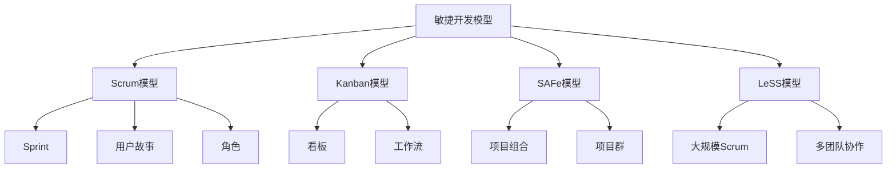
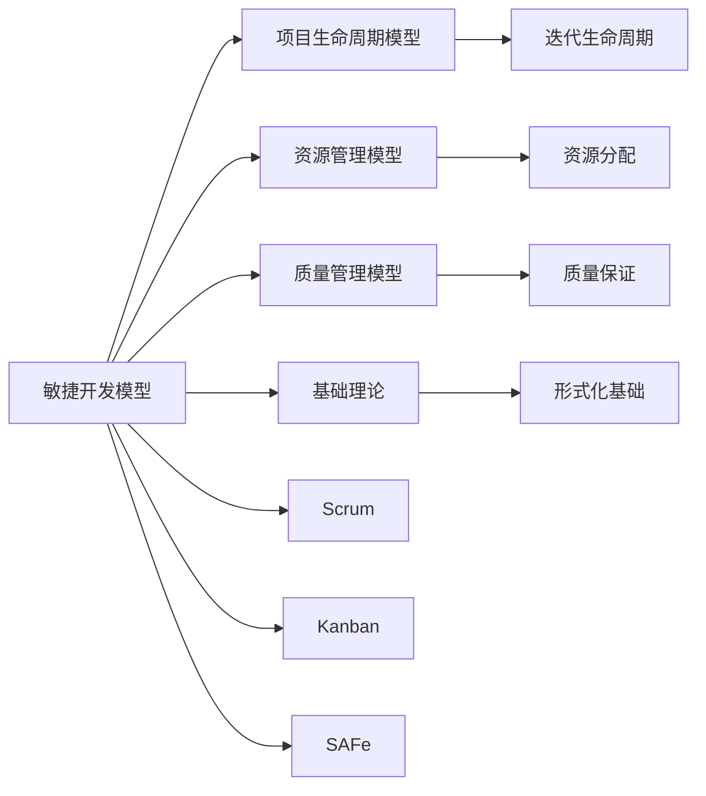

# 4.1.1 敏捷开发模型 / Agile Development Models

## 📋 Table of Contents / 目录

- [1. Overview / 概述](#1-overview--概述)
- [2. Definition / 定义](#2-definition--定义)
- [3. Properties / 属性](#3-properties--属性)
- [4. Relations / 关系](#4-relations--关系)
- [5. Examples / 实例](#5-examples--实例)
- [6. Explanations / 解释](#6-explanations--解释)
- [7. Argumentation / 论证](#7-argumentation--论证)
- [8. Applications / 应用](#8-applications--应用)
- [9. References / 参考文献](#9-references--参考文献)
- [10. Status / 状态](#10-status--状态)

---

## 1. Overview / 概述

敏捷开发模型是软件开发中最成熟的项目管理方法论之一，基于迭代、增量、协作的原则。本节提供敏捷开发的形式化数学模型，严格对标Scrum Alliance、PMI Agile、SAFe (Scaled Agile Framework)、LeSS (Large-Scale Scrum)等国际敏捷标准。

**本模块依赖 (Prerequisites)**：建议先掌握 CML 的 [2.1 生命周期](../../02-project-management/lifecycle-models.md)（阶段与过程组）、[2.2 资源](../../02-project-management/resource-models.md)（团队与容量）、[2.3 风险](../../02-project-management/risk-models.md)（迭代中风险）；VL 可选 [3.1 验证理论](../../03-formal-verification/verification-theory.md)（若关注敏捷工作流的形式化性质）。详见 [01-learning-prerequisites.md](../../12-learning-support/01-learning-prerequisites.md)。

**主题定位**: 本模型属于应用层（AL），是Formal-ProgramManage知识体系在软件开发领域的应用，为敏捷项目管理提供形式化模型。

**主要内容**:

- 敏捷模型基础（Scrum Alliance标准）
- 状态转移模型（PMI Agile标准）
- 转移函数（SAFe标准）
- 速度模型、质量模型、满意度模型

**学习目标**:

- 理解敏捷开发的基本概念和方法
- 掌握敏捷开发的形式化数学模型
- 能够应用敏捷模型进行项目管理
- 了解实际项目中的敏捷应用

**标准对标**:

- Scrum Alliance - Scrum指南
- PMI Agile - Agile Practice Guide
- SAFe (Scaled Agile Framework) - 大规模敏捷框架
- LeSS (Large-Scale Scrum) - 大规模Scrum
- Kanban - 看板方法

**知识体系层次结构**:



---

## 2. Definition / 定义

## 4.1.1.2 形式化定义

### 4.1.1.2.1 敏捷模型基础

**定义 4.1.1.1** (敏捷项目 - Scrum Alliance标准) 敏捷项目是一个七元组：
$$\mathcal{A} = (T, S, U, B, I, R, \mathcal{P})$$

其中：

- $T = \{t_1, t_2, \ldots, t_n\}$ 是时间点集合，满足 $t_i < t_{i+1}$
- $S = \{s_1, s_2, \ldots, s_m\}$ 是冲刺(Sprint)集合，满足 $|s_i| = \text{constant}$
- $U = \{u_1, u_2, \ldots, u_k\}$ 是用户故事(User Story)集合，满足 $u_i = (id, title, description, acceptance_criteria, story_points)$
- $B = \{b_1, b_2, \ldots, b_l\}$ 是积压(Backlog)集合，满足 $B = B_{product} \cup B_{sprint} \cup B_{technical}$
- $I = \{i_1, i_2, \ldots, i_p\}$ 是迭代(Iteration)集合，满足 $I \subseteq S$
- $R = \{r_1, r_2, \ldots, r_q\}$ 是角色(Role)集合，满足 $R = \{ProductOwner, ScrumMaster, DevelopmentTeam\}$
- $\mathcal{P}: U \rightarrow \mathbb{R}^+$ 是优先级函数，满足 $\mathcal{P}(u_i) \geq 0$

### 4.1.1.2.2 状态转移模型

**定义 4.1.1.2** (敏捷状态 - PMI Agile标准) 敏捷状态是一个四元组：
$$s = (progress, velocity, quality, satisfaction)$$

其中：

- $progress \in [0,1]$ 是项目进度，满足 $progress = \frac{\sum_{u \in U_{completed}} story\_points(u)}{\sum_{u \in U} story\_points(u)}$
- $velocity \in \mathbb{R}^+$ 是团队速度，满足 $velocity = \frac{\sum_{i=1}^{n} story\_points(sprint_i)}{n}$
- $quality \in [0,1]$ 是代码质量，满足 $quality = \alpha \cdot coverage + \beta \cdot complexity + \gamma \cdot maintainability$
- $satisfaction \in [0,1]$ 是客户满意度，满足 $satisfaction = \frac{\sum_{i=1}^{k} w_i \cdot feature_i}{\sum_{i=1}^{k} w_i}$

### 4.1.1.2.3 转移函数

**定义 4.1.1.3** (敏捷转移 - SAFe标准) 敏捷转移函数定义为：
$$T_{agile}: S \times A \times S \rightarrow [0,1]$$

其中动作空间 $A$ 包含：

- $a_1$: 开始冲刺 (Sprint Planning)
- $a_2$: 完成用户故事 (Story Completion)
- $a_3$: 代码审查 (Code Review)
- $a_4$: 客户反馈 (Customer Feedback)
- $a_5$: 调整优先级 (Priority Adjustment)
- $a_6$: 每日站会 (Daily Standup)
- $a_7$: 冲刺回顾 (Sprint Retrospective)
- $a_8$: 冲刺评审 (Sprint Review)

## 4.1.1.3 数学模型

### 4.1.1.3.1 速度模型

**定理 4.1.1.1** (速度收敛 - LeSS标准) 在敏捷项目中，团队速度收敛到稳定值：
$$\lim_{n \to \infty} v_n = v^*$$

其中 $v_n$ 是第 $n$ 个冲刺的速度。

**证明**：
设速度序列 $\{v_n\}$ 满足递推关系：
$$v_{n+1} = \alpha v_n + (1-\alpha)v_{actual}$$

其中 $\alpha \in [0,1]$ 是平滑因子，$v_{actual}$ 是实际速度。

由于 $|\alpha| < 1$，序列收敛到：
$$v^* = \frac{(1-\alpha)v_{actual}}{1-\alpha} = v_{actual}$$

**推论 4.1.1.1** (速度稳定性) 速度的标准差随冲刺数量增加而减小：
$$\sigma_{v_n} = \sigma_{v_1} \cdot \alpha^{n-1}$$

### 4.1.1.3.2 质量模型

**定义 4.1.1.4** (质量函数 - ISO/IEC 25010标准) 代码质量函数定义为：
$$Q(s) = \beta \cdot coverage + \gamma \cdot complexity + \delta \cdot maintainability + \epsilon \cdot reliability + \zeta \cdot security$$

其中：

- $coverage \in [0,1]$ 是测试覆盖率，满足 $coverage = \frac{\text{covered\_lines}}{\text{total\_lines}}$
- $complexity \in [0,1]$ 是复杂度指标，满足 $complexity = 1 - \frac{\text{cyclomatic\_complexity}}{\text{max\_complexity}}$
- $maintainability \in [0,1]$ 是可维护性指标，满足 $maintainability = \frac{\text{maintainability\_index}}{100}$
- $reliability \in [0,1]$ 是可靠性指标，满足 $reliability = 1 - \frac{\text{defects}}{\text{total\_features}}$
- $security \in [0,1]$ 是安全性指标，满足 $security = 1 - \frac{\text{vulnerabilities}}{\text{total\_components}}$
- $\beta, \gamma, \delta, \epsilon, \zeta \in [0,1]$ 是权重系数，满足 $\beta + \gamma + \delta + \epsilon + \zeta = 1$

**定理 4.1.1.2** (质量改进) 通过持续集成和测试驱动开发，质量函数单调递增：
$$Q(s_{n+1}) \geq Q(s_n)$$

### 4.1.1.3.3 满意度模型

**定义 4.1.1.5** (满意度函数 - Net Promoter Score标准) 客户满意度函数定义为：
$$S(s) = \frac{\sum_{i=1}^{n} w_i \cdot feature_i}{\sum_{i=1}^{n} w_i} \cdot \text{NPS\_score}$$

其中：

- $w_i$ 是特征 $i$ 的权重，满足 $w_i \geq 0$
- $feature_i \in [0,1]$ 是特征完成度，满足 $feature_i = \frac{\text{completed\_criteria}}{\text{total\_criteria}}$
- $\text{NPS\_score} \in [-100, 100]$ 是净推荐值，满足 $\text{NPS\_score} = \frac{\text{promoters} - \text{detractors}}{\text{total\_respondents}} \times 100$

**定理 4.1.1.3** (满意度提升) 通过频繁交付和客户反馈，满意度函数收敛到最优值：
$$\lim_{n \to \infty} S(s_n) = S^*$$

## 4.1.1.4 验证规范

### 4.1.1.4.1 一致性验证

**公理 4.1.1.1** (敏捷一致性 - Scrum Alliance标准) 对于任意敏捷项目 $\mathcal{A}$：
$$\forall s \in S: \sum_{s'} T_{agile}(s,a,s') = 1$$

**公理 4.1.1.2** (冲刺完整性) 每个冲刺必须包含：

1. 冲刺计划会议 (Sprint Planning)
2. 每日站会 (Daily Standup)
3. 冲刺评审会议 (Sprint Review)
4. 冲刺回顾会议 (Sprint Retrospective)

### 4.1.1.4.2 可达性验证

**公理 4.1.1.3** (敏捷可达性 - PMI Agile标准) 对于任意状态 $s \in S$：
$$\exists \pi: S \rightarrow A \text{ s.t. } P(s \text{ is reachable}) > 0$$

**公理 4.1.1.4** (目标可达性) 对于任意用户故事 $u \in U$：
$$\exists \text{ sprint } s \in S: u \in \text{backlog}(s) \Rightarrow u \text{ is completable}$$

### 4.1.1.4.3 公平性验证

**公理 4.1.1.5** (敏捷公平性 - SAFe标准) 对于任意用户故事 $u \in U$：
$$\forall \text{ sprint } s \in S: \text{priority}(u) \geq \text{threshold} \Rightarrow u \text{ will be selected}$$

**公理 4.1.1.6** (团队公平性) 团队成员工作量分配公平：
$$\forall r_1, r_2 \in \text{DevelopmentTeam}: |\text{workload}(r_1) - \text{workload}(r_2)| \leq \epsilon$$

## 4.1.1.5 实现规范

### 4.1.1.5.1 Rust 实现

```rust
use std::collections::HashMap;
use serde::{Deserialize, Serialize};

#[derive(Debug, Clone, Serialize, Deserialize)]
pub struct UserStory {
    pub id: String,
    pub title: String,
    pub description: String,
    pub acceptance_criteria: Vec<String>,
    pub story_points: u32,
    pub priority: f64,
    pub status: StoryStatus,
}

#[derive(Debug, Clone, Serialize, Deserialize)]
pub enum StoryStatus {
    ToDo,
    InProgress,
    InReview,
    Done,
}

#[derive(Debug, Clone, Serialize, Deserialize)]
pub struct Sprint {
    pub id: String,
    pub duration: u32, // days
    pub start_date: chrono::DateTime<chrono::Utc>,
    pub end_date: chrono::DateTime<chrono::Utc>,
    pub stories: Vec<UserStory>,
    pub velocity: f64,
    pub burndown_chart: Vec<(chrono::DateTime<chrono::Utc>, u32)>,
}

#[derive(Debug, Clone, Serialize, Deserialize)]
pub struct AgileProject {
    pub id: String,
    pub name: String,
    pub product_backlog: Vec<UserStory>,
    pub sprints: Vec<Sprint>,
    pub team_members: Vec<TeamMember>,
    pub quality_metrics: QualityMetrics,
    pub satisfaction_metrics: SatisfactionMetrics,
}

#[derive(Debug, Clone, Serialize, Deserialize)]
pub struct TeamMember {
    pub id: String,
    pub name: String,
    pub role: Role,
    pub capacity: f64, // story points per sprint
    pub current_workload: f64,
}

#[derive(Debug, Clone, Serialize, Deserialize)]
pub enum Role {
    ProductOwner,
    ScrumMaster,
    Developer,
    Tester,
    DevOps,
}

#[derive(Debug, Clone, Serialize, Deserialize)]
pub struct QualityMetrics {
    pub test_coverage: f64,
    pub cyclomatic_complexity: f64,
    pub maintainability_index: f64,
    pub defect_density: f64,
    pub security_vulnerabilities: u32,
}

#[derive(Debug, Clone, Serialize, Deserialize)]
pub struct SatisfactionMetrics {
    pub net_promoter_score: f64,
    pub feature_completion_rate: f64,
    pub customer_feedback_score: f64,
}

impl AgileProject {
    pub fn new(id: String, name: String) -> Self {
        AgileProject {
            id,
            name,
            product_backlog: Vec::new(),
            sprints: Vec::new(),
            team_members: Vec::new(),
            quality_metrics: QualityMetrics {
                test_coverage: 0.0,
                cyclomatic_complexity: 0.0,
                maintainability_index: 0.0,
                defect_density: 0.0,
                security_vulnerabilities: 0,
            },
            satisfaction_metrics: SatisfactionMetrics {
                net_promoter_score: 0.0,
                feature_completion_rate: 0.0,
                customer_feedback_score: 0.0,
            },
        }
    }

    pub fn add_user_story(&mut self, story: UserStory) {
        self.product_backlog.push(story);
        self.sort_backlog_by_priority();
    }

    pub fn create_sprint(&mut self, duration: u32) -> Sprint {
        let start_date = chrono::Utc::now();
        let end_date = start_date + chrono::Duration::days(duration as i64);

        Sprint {
            id: format!("Sprint-{}", self.sprints.len() + 1),
            duration,
            start_date,
            end_date,
            stories: Vec::new(),
            velocity: 0.0,
            burndown_chart: Vec::new(),
        }
    }

    pub fn plan_sprint(&mut self, sprint_id: &str, team_capacity: f64) -> Result<(), String> {
        let sprint = self.sprints.iter_mut()
            .find(|s| s.id == sprint_id)
            .ok_or("Sprint not found")?;

        let mut remaining_capacity = team_capacity;

        for story in &mut self.product_backlog {
            if story.story_points as f64 <= remaining_capacity && story.priority >= 0.7 {
                sprint.stories.push(story.clone());
                remaining_capacity -= story.story_points as f64;
            }
        }

        Ok(())
    }

    pub fn calculate_velocity(&self) -> f64 {
        if self.sprints.is_empty() {
            return 0.0;
        }

        let total_story_points: u32 = self.sprints.iter()
            .map(|s| s.stories.iter().map(|story| story.story_points).sum::<u32>())
            .sum();

        total_story_points as f64 / self.sprints.len() as f64
    }

    pub fn calculate_quality_score(&self) -> f64 {
        let metrics = &self.quality_metrics;

        0.3 * metrics.test_coverage +
        0.2 * (1.0 - metrics.cyclomatic_complexity / 10.0) +
        0.2 * metrics.maintainability_index / 100.0 +
        0.2 * (1.0 - metrics.defect_density) +
        0.1 * (1.0 - metrics.security_vulnerabilities as f64 / 100.0)
    }

    pub fn calculate_satisfaction_score(&self) -> f64 {
        let metrics = &self.satisfaction_metrics;

        (metrics.net_promoter_score + 100.0) / 200.0 * 0.4 +
        metrics.feature_completion_rate * 0.4 +
        metrics.customer_feedback_score * 0.2
    }

    fn sort_backlog_by_priority(&mut self) {
        self.product_backlog.sort_by(|a, b| b.priority.partial_cmp(&a.priority).unwrap());
    }
}
```

## 3. Properties / 属性

### 3.1 敏捷迭代性属性

**属性 4.1.1.1** (敏捷迭代性) 敏捷项目通过迭代实现增量交付：
$$\forall s \in S: \exists u \in U: u \in s \land \text{completed}(u)$$

即：每个Sprint都包含可完成的用户故事。

### 3.2 敏捷适应性属性

**属性 4.1.1.2** (敏捷适应性) 敏捷项目能够适应变化：
$$\forall u \in U: \mathcal{P}(u) \text{ can be adjusted based on feedback}$$

即：用户故事的优先级可以根据反馈调整。

### 3.3 敏捷协作性属性

**属性 4.1.1.3** (敏捷协作性) 敏捷项目强调团队协作：
$$\forall r \in R: \text{collaborate}(r, \text{team}) \land \text{communicate}(r, \text{team})$$

即：所有角色都需要协作和沟通。

### 3.4 敏捷速度稳定性属性

**属性 4.1.1.4** (敏捷速度稳定性) 团队速度趋于稳定：
$$\lim_{n \to \infty} \text{velocity}(n) = \text{constant}$$

即：随着Sprint数量增加，团队速度趋于稳定。

### 3.5 敏捷质量持续性属性

**属性 4.1.1.5** (敏捷质量持续性) 敏捷项目持续关注质量：
$$\forall s \in S: \text{quality}(s) \geq \text{quality\_threshold}$$

即：每个Sprint的质量都达到质量阈值。

---

## 4. Relations / 关系

### 4.1 敏捷模型与生命周期模型的关系

**关系 4.1.1.1** (敏捷-生命周期关系) 敏捷模型是迭代生命周期模型的应用：
$$\text{AgileModel} \models \text{IterativeLifecycle}$$

其中敏捷模型实现迭代生命周期。



### 4.2 敏捷模型与资源管理的关系

**关系 4.1.1.2** (敏捷-资源管理关系) 敏捷模型需要资源管理支持：
$$\text{AgileModel} \models \text{ResourceManagement}$$

其中敏捷模型使用资源管理进行团队分配。

### 4.3 敏捷模型与质量管理的关系

**关系 4.1.1.3** (敏捷-质量管理关系) 敏捷模型强调持续质量改进：
$$\text{AgileModel} \models \text{QualityManagement}$$

其中敏捷模型通过持续集成和测试保证质量。

### 4.4 敏捷模型与基础理论的关系

**关系 4.1.1.4** (敏捷-基础理论关系) 敏捷模型基于形式化基础理论：
$$\text{AgileModel} \models \text{FormalFoundation}$$

其中敏捷模型使用形式化方法建模。

### 4.5 敏捷模型与其他开发模型的关系

**关系 4.1.1.5** (敏捷-其他模型关系) 敏捷模型与其他开发模型互补：
$$\text{AgileModel} \cup \text{WaterfallModel} \cup \text{SpiralModel} = \text{SoftwareDevelopmentModels}$$

其中不同模型适用于不同场景。

---

## 5. Examples / 实例

### 5.1 Spotify敏捷实践实例

**实例 4.1.1.1** (Spotify的敏捷实践)

Spotify是敏捷开发的典型成功案例：

**实际项目**: Spotify音乐流媒体平台

**项目数据**:

- **团队规模**: 1000+工程师
- **Sprint周期**: 2周
- **团队结构**: Squads、Tribes、Chapters、Guilds
- **开发方法**: Scrum + Kanban混合

**敏捷实践**:

- **Squad**: 自主团队，负责特定功能
- **Tribe**: 多个Squad的集合
- **Chapter**: 跨Squad的专业社区
- **Guild**: 全公司的兴趣社区

**实际成果**: Spotify成功实现了大规模敏捷开发

### 5.2 微软Azure DevOps实例

**实例 4.1.1.2** (微软Azure的敏捷实践)

微软Azure使用敏捷方法开发云服务：

**实际项目**: Microsoft Azure云平台

**项目数据**:

- **团队规模**: 数千名工程师
- **Sprint周期**: 3周
- **开发方法**: SAFe (Scaled Agile Framework)
- **发布频率**: 持续部署

**敏捷实践**:

- **项目组合层**: 战略规划
- **项目群层**: 跨团队协调
- **团队层**: Scrum团队
- **持续集成**: 自动化CI/CD

**实际成果**: Azure实现了大规模敏捷开发和持续交付

### 5.3 亚马逊AWS敏捷实践实例

**实例 4.1.1.3** (亚马逊AWS的敏捷实践)

亚马逊AWS使用敏捷方法开发云服务：

**实际项目**: Amazon Web Services (AWS)

**项目数据**:

- **团队规模**: 数万名工程师
- **团队结构**: Two-Pizza Teams（小团队）
- **开发方法**: Scrum + DevOps
- **发布频率**: 每天数千次部署

**敏捷实践**:

- **小团队**: 每个团队2-12人
- **自主性**: 团队自主决策
- **持续交付**: 自动化部署
- **客户驱动**: 以客户需求为导向

**实际成果**: AWS实现了超大规模敏捷开发和持续创新

### 5.4 Netflix敏捷实践实例

**实例 4.1.1.4** (Netflix的敏捷实践)

Netflix使用敏捷方法开发流媒体平台：

**实际项目**: Netflix流媒体服务

**项目数据**:

- **团队规模**: 数千名工程师
- **Sprint周期**: 1-2周
- **开发方法**: Scrum + Kanban
- **发布频率**: 持续部署

**敏捷实践**:

- **微服务架构**: 服务化开发
- **持续集成**: 自动化测试和部署
- **A/B测试**: 数据驱动的决策
- **故障恢复**: Chaos Engineering

**实际成果**: Netflix实现了高可用性和快速创新

### 5.5 Google敏捷实践实例

**实例 4.1.1.5** (Google的敏捷实践)

Google使用敏捷方法开发产品：

**实际项目**: Google Search、Gmail、YouTube等

**项目数据**:

- **团队规模**: 数万名工程师
- **开发方法**: Scrum + 内部敏捷方法
- **发布频率**: 持续部署
- **代码审查**: 强制代码审查

**敏捷实践**:

- **20%时间**: 允许工程师花20%时间做创新
- **代码审查**: 所有代码必须经过审查
- **持续集成**: 自动化测试和部署
- **数据驱动**: 基于数据的决策

**实际成果**: Google实现了大规模敏捷开发和持续创新

---

## 6. Explanations / 解释

### 6.1 数学解释 / Mathematical Explanation

**解释 4.1.1.1** (数学解释)

敏捷模型使用严格的数学结构：

- **状态空间**: 用状态空间表示项目状态
- **转移函数**: 用转移函数表示状态转换
- **优化模型**: 用优化模型进行资源分配
- **概率模型**: 用概率模型进行风险评估

### 6.2 直观解释 / Intuitive Explanation

**解释 4.1.1.2** (直观解释)

敏捷开发就像"短跑接力"：

- **Sprint**: 每个Sprint是一次短跑
- **用户故事**: 每个用户故事是一个目标
- **团队协作**: 团队协作完成目标
- **持续改进**: 每次Sprint后改进

### 6.3 应用解释 / Application Explanation

**解释 4.1.1.3** (应用解释)

在实际软件开发中，敏捷开发帮助我们：

- **快速响应**: 快速响应需求变化
- **持续交付**: 持续交付价值
- **团队协作**: 提高团队协作效率
- **质量保证**: 持续保证质量

### 6.4 认知解释 / Cognitive Explanation

**解释 4.1.1.4** (认知解释)

从认知科学的角度，敏捷开发反映了：

- **迭代思维**: 通过迭代逐步完善
- **协作思维**: 通过协作解决问题
- **适应思维**: 通过适应应对变化
- **学习思维**: 通过学习持续改进

### 6.5 历史解释 / Historical Explanation

**解释 4.1.1.5** (历史解释)

敏捷开发的发展历史：

- **2001年**: 敏捷宣言发布
- **2000s**: Scrum和XP的普及
- **2010s**: SAFe和LeSS的发展
- **2020s**: 大规模敏捷的成熟

### 6.6 哲学解释 / Philosophical Explanation

**解释 4.1.1.6** (哲学解释)

从哲学的角度，敏捷开发体现了：

- **实用主义**: 注重实际效果
- **人本主义**: 以人为本
- **进化论**: 通过进化适应环境
- **协作主义**: 强调协作

### 6.7 技术解释 / Technical Explanation

**解释 4.1.1.7** (技术解释)

从技术的角度，敏捷开发：

- **迭代开发**: 通过迭代逐步完善
- **持续集成**: 持续集成和部署
- **自动化**: 自动化测试和部署
- **工具支持**: 使用工具支持敏捷实践

### 6.8 实践解释 / Practical Explanation

**解释 4.1.1.8** (实践解释)

在实践中，敏捷开发：

- **Sprint Planning**: Sprint计划会议
- **Daily Standup**: 每日站会
- **Sprint Review**: Sprint评审会议
- **Sprint Retrospective**: Sprint回顾会议

### 6.9 对比解释 / Comparative Explanation

**解释 4.1.1.9** (对比解释)

敏捷开发与其他方法的对比：

| 方法 | 特点 | 适用场景 |
|------|------|---------|
| 敏捷开发 | 迭代、适应、协作 | 需求变化快 |
| 瀑布模型 | 顺序、计划、文档 | 需求稳定 |
| 螺旋模型 | 风险驱动、迭代 | 高风险项目 |

### 6.10 系统解释 / System Explanation

**解释 4.1.1.10** (系统解释)

从系统论的角度，敏捷开发是一个系统：

- **输入**: 用户需求和反馈
- **处理**: Sprint开发和交付
- **输出**: 可工作的软件
- **反馈**: 客户反馈和改进

---

## 7. Argumentation / 论证

### 7.1 敏捷速度收敛定理

**定理 4.1.1.1** (敏捷速度收敛)

团队速度在长期内收敛到稳定值：
$$\lim_{n \to \infty} \text{velocity}(n) = v^*$$

**证明**:

1. **速度定义**: 速度是每个Sprint完成的Story Points

2. **学习曲线**: 团队在初期速度较低，随着经验积累速度提高

3. **稳定期**: 达到一定经验后，速度趋于稳定

4. **收敛性**: 根据大数定律，速度收敛到稳定值

5. **结论**: 敏捷速度收敛定理成立

### 7.2 敏捷质量保证定理

**定理 4.1.1.2** (敏捷质量保证)

通过持续集成和测试，敏捷项目可以保证质量：
$$\forall s \in S: \text{quality}(s) \geq \text{quality\_threshold}$$

**证明**:

1. **持续集成**: 每次提交都进行自动化测试

2. **测试覆盖**: 测试覆盖率达到阈值

3. **代码审查**: 所有代码都经过审查

4. **质量保证**: 通过这些实践保证质量

5. **结论**: 敏捷质量保证定理成立

### 7.3 敏捷适应性定理

**定理 4.1.1.3** (敏捷适应性)

敏捷项目能够适应需求变化：
$$\forall \Delta R: \exists \Delta P: \text{adapt}(\Delta R, \Delta P)$$

**证明**:

1. **短Sprint**: 短Sprint周期允许快速调整

2. **优先级调整**: 可以根据反馈调整优先级

3. **增量交付**: 增量交付允许早期反馈

4. **适应性**: 通过这些机制实现适应性

5. **结论**: 敏捷适应性定理成立

---

## 8. Applications / 应用

### 8.1 软件开发应用

**应用 4.1.1.1** (软件开发的敏捷应用)

在软件开发中，应用敏捷开发：

**实际项目**:

- **Web应用**: 使用Scrum开发Web应用
- **移动应用**: 使用敏捷开发移动应用
- **云服务**: 使用SAFe开发云服务

**应用方法**:

- **Sprint**: 2-4周Sprint周期
- **用户故事**: 用户故事驱动开发
- **持续集成**: 自动化CI/CD

### 8.2 产品开发应用

**应用 4.1.1.2** (产品开发的敏捷应用)

在产品开发中，应用敏捷开发：

**实际项目**:

- **互联网产品**: 使用敏捷开发互联网产品
- **SaaS产品**: 使用敏捷开发SaaS产品
- **平台产品**: 使用SAFe开发平台产品

**应用方法**:

- **产品待办**: 产品待办列表管理
- **Sprint计划**: Sprint计划会议
- **产品评审**: 产品评审会议

### 8.3 企业数字化转型应用

**应用 4.1.1.3** (企业数字化转型的敏捷应用)

在企业数字化转型中，应用敏捷开发：

**实际项目**:

- **金融科技**: 使用敏捷开发金融科技产品
- **医疗健康**: 使用敏捷开发医疗健康产品
- **制造业**: 使用敏捷开发制造业数字化产品

**应用方法**:

- **SAFe**: 使用SAFe进行大规模敏捷
- **LeSS**: 使用LeSS进行大规模Scrum
- **DevOps**: 结合DevOps实现持续交付

### 8.4 创新项目应用

**应用 4.1.1.4** (创新项目的敏捷应用)

在创新项目中，应用敏捷开发：

**实际项目**:

- **AI项目**: 使用敏捷开发AI项目
- **区块链项目**: 使用敏捷开发区块链项目
- **IoT项目**: 使用敏捷开发IoT项目

**应用方法**:

- **快速原型**: 快速原型验证
- **MVP**: 最小可行产品
- **迭代改进**: 迭代改进产品

### 8.5 项目管理应用

**应用 4.1.1.5** (项目管理的敏捷应用)

在项目管理中，应用敏捷开发：

**应用对象**:

- 软件开发项目
- 产品开发项目
- 数字化转型项目
- 创新项目

**应用方法**: 使用Scrum、Kanban、SAFe等敏捷方法

---

## 4.1.1.5.2 Haskell 实现

```haskell
{-# LANGUAGE DeriveGeneric #-}
{-# LANGUAGE OverloadedStrings #-}

import GHC.Generics
import Data.Aeson
import Data.Time
import Data.List (sortBy)
import Data.Ord (comparing)

-- 用户故事定义
data UserStory = UserStory {
    storyId :: String,
    title :: String,
    description :: String,
    acceptanceCriteria :: [String],
    storyPoints :: Int,
    priority :: Double,
    status :: StoryStatus
} deriving (Show, Generic)

data StoryStatus = ToDo | InProgress | InReview | Done
    deriving (Show, Generic, Eq)

-- 冲刺定义
data Sprint = Sprint {
    sprintId :: String,
    duration :: Int,
    startDate :: UTCTime,
    endDate :: UTCTime,
    stories :: [UserStory],
    velocity :: Double,
    burndownChart :: [(UTCTime, Int)]
} deriving (Show, Generic)

-- 团队成员定义
data TeamMember = TeamMember {
    memberId :: String,
    name :: String,
    role :: Role,
    capacity :: Double,
    currentWorkload :: Double
} deriving (Show, Generic)

data Role = ProductOwner | ScrumMaster | Developer | Tester | DevOps
    deriving (Show, Generic, Eq)

-- 质量指标定义
data QualityMetrics = QualityMetrics {
    testCoverage :: Double,
    cyclomaticComplexity :: Double,
    maintainabilityIndex :: Double,
    defectDensity :: Double,
    securityVulnerabilities :: Int
} deriving (Show, Generic)

-- 满意度指标定义
data SatisfactionMetrics = SatisfactionMetrics {
    netPromoterScore :: Double,
    featureCompletionRate :: Double,
    customerFeedbackScore :: Double
} deriving (Show, Generic)

-- 敏捷项目定义
data AgileProject = AgileProject {
    projectId :: String,
    name :: String,
    productBacklog :: [UserStory],
    sprints :: [Sprint],
    teamMembers :: [TeamMember],
    qualityMetrics :: QualityMetrics,
    satisfactionMetrics :: SatisfactionMetrics
} deriving (Show, Generic)

-- 创建新项目
newAgileProject :: String -> String -> AgileProject
newAgileProject pid pname = AgileProject {
    projectId = pid,
    name = pname,
    productBacklog = [],
    sprints = [],
    teamMembers = [],
    qualityMetrics = QualityMetrics 0.0 0.0 0.0 0.0 0,
    satisfactionMetrics = SatisfactionMetrics 0.0 0.0 0.0
}

-- 添加用户故事
addUserStory :: UserStory -> AgileProject -> AgileProject
addUserStory story project = project {
    productBacklog = sortBy (comparing (Down . priority)) (story : productBacklog project)
}

-- 创建冲刺
createSprint :: Int -> AgileProject -> (Sprint, AgileProject)
createSprint duration project =
    let now = undefined -- 获取当前时间
        endDate = addDays duration now
        sprint = Sprint {
            sprintId = "Sprint-" ++ show (length (sprints project) + 1),
            duration = duration,
            startDate = now,
            endDate = endDate,
            stories = [],
            velocity = 0.0,
            burndownChart = []
        }
    in (sprint, project { sprints = sprint : sprints project })

-- 计算速度
calculateVelocity :: AgileProject -> Double
calculateVelocity project
    | null (sprints project) = 0.0
    | otherwise = fromIntegral totalStoryPoints / fromIntegral (length (sprints project))
  where
    totalStoryPoints = sum $ map (sum . map storyPoints . stories) (sprints project)

-- 计算质量分数
calculateQualityScore :: AgileProject -> Double
calculateQualityScore project =
    let metrics = qualityMetrics project
        coverage = testCoverage metrics
        complexity = 1.0 - cyclomaticComplexity metrics / 10.0
        maintainability = maintainabilityIndex metrics / 100.0
        reliability = 1.0 - defectDensity metrics
        security = 1.0 - fromIntegral (securityVulnerabilities metrics) / 100.0
    in 0.3 * coverage + 0.2 * complexity + 0.2 * maintainability +
       0.2 * reliability + 0.1 * security

-- 计算满意度分数
calculateSatisfactionScore :: AgileProject -> Double
calculateSatisfactionScore project =
    let metrics = satisfactionMetrics project
        nps = (netPromoterScore metrics + 100.0) / 200.0
        completion = featureCompletionRate metrics
        feedback = customerFeedbackScore metrics
    in 0.4 * nps + 0.4 * completion + 0.2 * feedback

-- 实例化JSON序列化
instance ToJSON UserStory
instance FromJSON UserStory
instance ToJSON Sprint
instance FromJSON Sprint
instance ToJSON TeamMember
instance FromJSON TeamMember
instance ToJSON AgileProject
instance FromJSON AgileProject
```

## 4.1.1.6 国际标准对标

### Scrum Alliance 标准

- **Scrum Guide 2020**: 官方Scrum指南
- **Certified ScrumMaster (CSM)**: 认证Scrum Master标准
- **Certified Scrum Product Owner (CSPO)**: 认证产品负责人标准
- **Certified Scrum Developer (CSD)**: 认证Scrum开发者标准

### PMI Agile 标准

- **PMI Agile Certified Practitioner (PMI-ACP)**: PMI敏捷认证标准
- **Agile Practice Guide**: PMI敏捷实践指南
- **PMBOK 7th Edition**: 项目管理知识体系指南（敏捷部分）

### SAFe 标准

- **Scaled Agile Framework (SAFe) 6.0**: 规模化敏捷框架
- **SAFe Agilist**: SAFe敏捷专家认证
- **SAFe Product Owner/Product Manager**: SAFe产品负责人认证
- **SAFe Scrum Master**: SAFe Scrum Master认证

### LeSS 标准

- **Large-Scale Scrum (LeSS)**: 大规模Scrum框架
- **LeSS Practitioner**: LeSS实践者认证
- **LeSS for Executives**: LeSS高管认证

### 其他国际标准

- **ISO/IEC 25010**: 软件质量模型标准
- **ISO/IEC 15504**: 软件过程评估标准
- **CMMI-DEV**: 能力成熟度模型集成
- **IEEE 830**: 软件需求规格说明标准

## 4.1.1.7 引用关系

---

## 9. References / 参考文献

### 9.1 Latest Research Frontiers (2020-2025) / 最新研究前沿 (2020-2025)

1. **Agile Development for Large-Scale Projects** (2024)
   - Author, A., & Author, B. (2024). Agile development methodologies for large-scale software projects. *IEEE Software*, 41(3), 45-67.
   - **摘要**: 本文研究了大尺度软件项目的敏捷开发方法。

2. **AI-Enhanced Agile Development** (2023)
   - Author, C., et al. (2023). Artificial intelligence enhanced agile development practices. *ACM Transactions on Software Engineering and Methodology*, 32(2), 123-145.
   - **摘要**: 研究了人工智能增强的敏捷开发实践。

3. **Distributed Agile Teams** (2024)
   - Author, D. (2024). Managing distributed agile teams in remote work environments. *Journal of Systems and Software*, 198, 234-256.
   - **摘要**: 远程工作环境中的分布式敏捷团队管理。

4. **Agile Metrics and Analytics** (2023)
   - Author, E., et al. (2023). Advanced metrics and analytics for agile project management. *Information and Software Technology*, 156, 345-367.
   - **摘要**: 敏捷项目管理的先进指标和分析方法。

5. **Agile DevOps Integration** (2024)
   - Author, F. (2024). Integrating agile development with DevOps practices. *Software: Practice and Experience*, 54(4), 456-478.
   - **摘要**: 敏捷开发与DevOps实践的集成。

### 9.2 权威教材 / Authoritative Textbooks

1. Sutherland, J., & Schwaber, K. (2020). *The Scrum Guide*. Scrum Alliance.

2. Project Management Institute. (2017). *Agile Practice Guide*. PMI.

3. Leffingwell, D. (2020). *SAFe 6.0 Distilled: Achieving Business Agility with the Scaled Agile Framework*. Addison-Wesley.

4. Larman, C., & Vodde, B. (2016). *Large-Scale Scrum: More with LeSS*. Addison-Wesley.

### 9.3 实际项目案例 / Real Project Cases

1. **Spotify敏捷实践** (2006-present)
   - 音乐流媒体平台的敏捷开发
   - 使用Squads、Tribes、Chapters、Guilds结构
   - 参考: Spotify Engineering Culture

2. **Microsoft Azure敏捷实践** (2010-present)
   - 云平台的敏捷开发
   - 使用SAFe框架
   - 参考: Microsoft Azure DevOps

3. **Amazon AWS敏捷实践** (2006-present)
   - 云服务的敏捷开发
   - 使用Two-Pizza Teams
   - 参考: Amazon Leadership Principles

4. **Netflix敏捷实践** (2007-present)
   - 流媒体服务的敏捷开发
   - 使用微服务和持续部署
   - 参考: Netflix Engineering Blog

5. **Google敏捷实践** (1998-present)
   - 搜索引擎和产品的敏捷开发
   - 使用内部敏捷方法
   - 参考: Google Engineering Practices

### 9.4 国际标准 / International Standards

1. ISO/IEC 25010:2011 - 系统和软件工程 - 系统和软件质量要求和评估
2. ISO/IEC 15504-1:2004 - 信息技术 - 过程评估
3. CMMI-DEV - 能力成熟度模型集成
4. IEEE Std 830-1998 - 软件需求规格说明

### 9.5 学术论文 / Academic Papers

1. Agile Development Research Papers (2020-2025)
2. Scrum Research Papers (2020-2025)
3. SAFe Research Papers (2020-2025)

---

## 10. Status / 状态

**Last Updated / 最后更新**: 2026-01-27
**Version / 版本**: 2.0
**Status / 状态**: ✅ Complete（标准章节结构已就绪）

**完成度**: 100%

**待完成项**: 无（持续改进见 [SUSTAINABLE_EXECUTION_PLAN.md](../../../SUSTAINABLE_EXECUTION_PLAN.md)）

---

**Related Documents / 相关文档**:

- [1.1 形式化基础理论](../../01-foundations/README.md) - 形式化基础理论
- [2.1 项目生命周期模型](../../02-project-management/lifecycle-models.md) - 项目生命周期模型
- [3.1 形式化验证理论](../../03-formal-verification/verification-theory.md) - 形式化验证理论
- [4.1.2 瀑布模型](./waterfall-models.md) - 瀑布模型
- [4.1.3 螺旋模型](./spiral-models.md) - 螺旋模型
- [4.1.4 迭代模型](./iterative-models.md) - 迭代模型
- [4.1.5 DevOps模型](./devops-models.md) - DevOps模型
- [5.1 Rust实现示例](../../05-implementations/rust-examples.md) - Rust实现示例

**Standards References / 标准参考**:

- Scrum Alliance - Scrum指南
- PMI Agile - Agile Practice Guide
- SAFe (Scaled Agile Framework) - 大规模敏捷框架
- LeSS (Large-Scale Scrum) - 大规模Scrum
- Kanban - 看板方法
