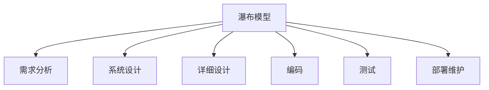
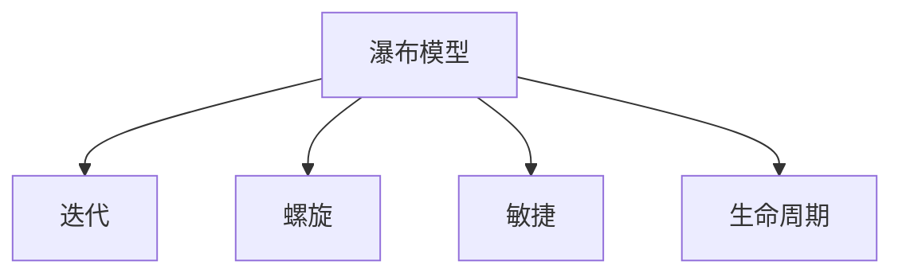

# 4.1.2 瀑布模型 / Waterfall Models

## 📋 Table of Contents / 目录

- [1. Overview / 概述](#1-overview--概述)
- [2. Definition / 定义](#2-definition--定义)
- [3. Properties / 属性](#3-properties--属性)
- [4. Relations / 关系](#4-relations--关系)
- [5. Examples / 实例](#5-examples--实例)
- [6. Explanations / 解释](#6-explanations--解释)
- [7. Argumentation / 论证](#7-argumentation--论证)
- [8. Applications / 应用](#8-applications--应用)
- [9. References / 参考文献](#9-references--参考文献)
- [10. Status / 状态](#10-status--状态)

---

## 1. Overview / 概述

瀑布模型是经典的线性、顺序开发方法论。本节提供瀑布模型的形式化数学模型与项目化管理框架。

**本模块依赖 (Prerequisites)**：建议先掌握 CML [2.1 生命周期](../../02-project-management/lifecycle-models.md)（阶段与关口）、[2.4 质量](../../02-project-management/quality-models.md)（质量门控）；VL 可选 [3.1 验证理论](../../03-formal-verification/verification-theory.md)。详见 [01-learning-prerequisites.md](../../12-learning-support/01-learning-prerequisites.md)。

**主题定位**: 应用层（AL），Formal-ProgramManage 在顺序式软件/系统开发中的应用。

**主要内容**: 瀑布项目六元组、六阶段（需求、系统设计、详细设计、编码、测试、部署维护）、进度/质量/成本/风险模型、验证规范。

**学习目标**: 理解瀑布项目的形式化定义；掌握阶段顺序、质量门控、成本与质量乘积的数学表示；能用于需求稳定、合规要求高的项目管理。

**标准对标**: PMI PMBOK 7th; ISO 21500; Royce 1970; IEEE 830; ISO/IEC 25010。

**知识体系层次结构**:



---

## 2. Definition / 定义

### 4.1.2.2.1 瀑布模型基础

**定义 4.1.2.1** (瀑布项目) 瀑布项目是一个六元组：
$$\mathcal{W} = (P, S, T, R, C, \mathcal{F})$$

其中：

- $P = \{p_1, p_2, \ldots, p_n\}$ 是阶段(Phase)集合
- $S = \{s_1, s_2, \ldots, s_m\}$ 是状态(State)集合
- $T = \{t_1, t_2, \ldots, t_k\}$ 是任务(Task)集合
- $R = \{r_1, r_2, \ldots, r_l\}$ 是资源(Resource)集合
- $C = \{c_1, c_2, \ldots, c_p\}$ 是约束(Constraint)集合
- $\mathcal{F}$ 是阶段转移函数

### 4.1.2.2.2 阶段定义

**定义 4.1.2.2** (瀑布阶段) 瀑布模型的阶段集合定义为：
$$P = \{需求分析, 系统设计, 详细设计, 编码实现, 测试验证, 部署维护\}$$

每个阶段 $p_i$ 具有以下属性：

- $duration(p_i) \in \mathbb{R}^+$ 是阶段持续时间
- $cost(p_i) \in \mathbb{R}^+$ 是阶段成本
- $quality(p_i) \in [0,1]$ 是阶段质量指标
- $dependencies(p_i) \subseteq P$ 是阶段依赖集合

### 4.1.2.2.3 状态转移模型

**定义 4.1.2.3** (瀑布状态) 瀑布状态是一个五元组：
$$s = (current\_phase, progress, quality, cost, risk)$$

其中：

- $current\_phase \in P$ 是当前阶段
- $progress \in [0,1]$ 是项目进度
- $quality \in [0,1]$ 是项目质量
- $cost \in \mathbb{R}^+$ 是累计成本
- $risk \in [0,1]$ 是项目风险

## 4.1.2.3 数学模型

### 4.1.2.3.1 阶段转移函数

**定义 4.1.2.4** (阶段转移) 阶段转移函数定义为：
$$T_{waterfall}: S \times A \times S \rightarrow [0,1]$$

其中动作空间 $A$ 包含：

- $a_1$: 开始阶段
- $a_2$: 完成阶段
- $a_3$: 质量检查
- $a_4$: 成本控制
- $a_5$: 风险管理

### 4.1.2.3.2 进度计算模型

**定理 4.1.2.1** (瀑布进度) 瀑布项目进度计算为：
$$progress = \frac{\sum_{i=1}^{n} w_i \cdot phase\_progress_i}{\sum_{i=1}^{n} w_i}$$

其中 $w_i$ 是阶段 $i$ 的权重，$phase\_progress_i \in [0,1]$ 是阶段进度。

### 4.1.2.3.3 质量累积模型

**定义 4.1.2.5** (质量函数) 瀑布质量函数定义为：
$$Q(s) = \prod_{i=1}^{n} quality_i^{\alpha_i}$$

其中 $quality_i$ 是阶段 $i$ 的质量，$\alpha_i$ 是质量权重。

### 4.1.2.3.4 成本累积模型

**定义 4.1.2.6** (成本函数) 瀑布成本函数定义为：
$$C(s) = \sum_{i=1}^{n} cost_i + \sum_{i=1}^{n} rework\_cost_i$$

其中 $cost_i$ 是阶段 $i$ 的直接成本，$rework\_cost_i$ 是返工成本。

## 4.1.2.4 验证规范

### 4.1.2.4.1 阶段顺序验证

**公理 4.1.2.1** (瀑布顺序性) 对于任意瀑布项目 $\mathcal{W}$：
$$\forall p_i, p_j \in P: i < j \Rightarrow p_i \text{ 必须在 } p_j \text{ 之前完成}$$

### 4.2.1.2.4.2 质量门控验证

**公理 4.1.2.2** (质量门控) 对于任意阶段 $p_i$：
$$quality(p_i) \geq threshold_i \Rightarrow \text{可以进入下一阶段}$$

### 4.2.1.2.4.3 成本控制验证

**公理 4.1.2.3** (成本控制) 对于任意状态 $s$：
$$C(s) \leq budget \Rightarrow \text{项目可以继续}$$

---

## 3. Properties / 属性

### 3.1 阶段顺序性 (Phase Ordering)

$\forall p_i, p_j \in P: i < j \Rightarrow p_i$ 须在 $p_j$ 之前完成（公理 4.1.2.1）。

### 3.2 质量门控 (Quality Gate)

$quality(p_i) \geq threshold_i$ 方可进入下一阶段（公理 4.1.2.2）。

### 3.3 成本有界 (Cost Boundedness)

$C(s) \leq budget$ 项目方可继续（公理 4.1.2.3）。

### 3.4 进度加权聚合 (Progress Weighted Aggregation)

$progress = \frac{\sum w_i \cdot phase\_progress_i}{\sum w_i} \in [0,1]$。

### 3.5 质量乘积性 (Quality Product)

$Q(s) = \prod_i quality_i^{\alpha_i} \in [0,1]$；$C(s) = \sum cost_i + \sum rework\_cost_i \geq 0$。

---

## 4. Relations / 关系

与迭代、螺旋、敏捷、生命周期、验证理论的关系。$\mathcal{W} \xrightarrow{precedes} Iterative, Spiral$；$\mathcal{W} \xrightarrow{aligns\_with} LCM$；$\mathcal{W} \xrightarrow{verified\_by} VT$。



---

## 5. Examples / 实例

### 5.1 政府与国防大型系统

需求相对稳定、合同与阶段验收、严格阶段门控与质量文档；Royce 原始语境。

### 5.2 轨道交通与信号系统

安全认证、V 模型与瀑布阶段、形式化与阶段可追溯性。

### 5.3 医疗设备与 FDA 合规

IEC 62304、设计历史、阶段评审与质量乘积在合规中的应用。

### 5.4 银行核心与高合规

监管与审计对阶段文档的要求、$Q(s)$ 与 $C(s)$ 在预算与质量门控下的平衡。

### 5.5 航天与 DO-178 等

适航与阶段化 V&V、需求—设计—码—测试的严格顺序与质量乘积。

---

## 6. Explanations / 解释

数学（乘积、和式、有界）；直观（阶段像瀑布、一阶段一关卡）；应用（政府、轨交、医疗、金融、航天）；认知（阶段评审、里程碑）；历史（Royce 1970、从瀑布到迭代/螺旋）；哲学（先想清楚再做、文档驱动）；技术（SRS、SDD、追溯矩阵）；实践（变更控制、返工成本）；对比（瀑布 vs 迭代/螺旋/敏捷）；系统（与需求、质量、成本的集成）。

---

## 7. Argumentation / 论证

**定理 7.1** (阶段顺序性) 依赖集合 $dependencies(p_i) = \{p_1,\ldots,p_{i-1}\}$，据公理 4.1.2.1 须全完成才可开始 $p_i$。
**定理 7.2** (质量累积性) $Q(s) = \prod quality_i^{\alpha_i} \in [0,1]$。
**定理 7.3** (成本累积性) $C(s) \geq 0$。

---

## 8. Applications / 应用

政府与国防；轨道交通与信号；医疗设备与 FDA；银行核心与高合规；航天与适航等需求稳定、阶段门控严格的项目。

---

## 4.1.2.5 Rust实现

```rust
use std::collections::HashMap;
use serde::{Deserialize, Serialize};

/// 瀑布阶段
#[derive(Debug, Clone, Serialize, Deserialize)]
pub enum WaterfallPhase {
    RequirementsAnalysis,
    SystemDesign,
    DetailedDesign,
    Implementation,
    Testing,
    Deployment,
}

/// 瀑布项目状态
#[derive(Debug, Clone, Serialize, Deserialize)]
pub struct WaterfallState {
    pub current_phase: WaterfallPhase,
    pub progress: f64,
    pub quality: f64,
    pub cost: f64,
    pub risk: f64,
}

/// 阶段信息
#[derive(Debug, Clone, Serialize, Deserialize)]
pub struct PhaseInfo {
    pub phase: WaterfallPhase,
    pub duration: f64,
    pub cost: f64,
    pub quality: f64,
    pub dependencies: Vec<WaterfallPhase>,
    pub completed: bool,
}

/// 瀑布项目管理器
#[derive(Debug)]
pub struct WaterfallProjectManager {
    pub project_name: String,
    pub phases: HashMap<WaterfallPhase, PhaseInfo>,
    pub current_state: WaterfallState,
    pub budget: f64,
    pub quality_thresholds: HashMap<WaterfallPhase, f64>,
}

impl WaterfallProjectManager {
    /// 创建新的瀑布项目
    pub fn new(project_name: String, budget: f64) -> Self {
        let mut phases = HashMap::new();
        let mut quality_thresholds = HashMap::new();

        // 初始化阶段
        let phase_list = vec![
            WaterfallPhase::RequirementsAnalysis,
            WaterfallPhase::SystemDesign,
            WaterfallPhase::DetailedDesign,
            WaterfallPhase::Implementation,
            WaterfallPhase::Testing,
            WaterfallPhase::Deployment,
        ];

        for (i, phase) in phase_list.iter().enumerate() {
            let dependencies = if i > 0 {
                vec![phase_list[i - 1].clone()]
            } else {
                vec![]
            };

            phases.insert(phase.clone(), PhaseInfo {
                phase: phase.clone(),
                duration: 10.0 + (i as f64 * 5.0),
                cost: 1000.0 + (i as f64 * 500.0),
                quality: 0.0,
                dependencies,
                completed: false,
            });

            quality_thresholds.insert(phase.clone(), 0.7);
        }

        Self {
            project_name,
            phases,
            current_state: WaterfallState {
                current_phase: WaterfallPhase::RequirementsAnalysis,
                progress: 0.0,
                quality: 1.0,
                cost: 0.0,
                risk: 0.0,
            },
            budget,
            quality_thresholds,
        }
    }

    /// 开始阶段
    pub fn start_phase(&mut self, phase: WaterfallPhase) -> Result<(), String> {
        // 检查依赖
        if let Some(phase_info) = self.phases.get(&phase) {
            for dep in &phase_info.dependencies {
                if let Some(dep_info) = self.phases.get(dep) {
                    if !dep_info.completed {
                        return Err(format!("阶段 {:?} 的依赖 {:?} 尚未完成", phase, dep));
                    }
                }
            }
        }

        self.current_state.current_phase = phase;
        Ok(())
    }

    /// 完成阶段
    pub fn complete_phase(&mut self, phase: WaterfallPhase, quality: f64) -> Result<(), String> {
        if let Some(phase_info) = self.phases.get_mut(&phase) {
            // 检查质量门控
            let threshold = self.quality_thresholds.get(&phase).unwrap_or(&0.7);
            if quality < *threshold {
                return Err(format!("阶段 {:?} 质量不达标: {} < {}", phase, quality, threshold));
            }

            phase_info.completed = true;
            phase_info.quality = quality;

            // 更新项目状态
            self.update_project_state();
        }

        Ok(())
    }

    /// 更新项目状态
    fn update_project_state(&mut self) {
        let total_phases = self.phases.len() as f64;
        let completed_phases = self.phases.values().filter(|p| p.completed).count() as f64;

        self.current_state.progress = completed_phases / total_phases;

        // 计算质量
        let quality_product: f64 = self.phases.values()
            .filter(|p| p.completed)
            .map(|p| p.quality)
            .product();
        self.current_state.quality = quality_product;

        // 计算成本
        self.current_state.cost = self.phases.values()
            .filter(|p| p.completed)
            .map(|p| p.cost)
            .sum();

        // 计算风险
        self.current_state.risk = self.calculate_risk();
    }

    /// 计算项目风险
    fn calculate_risk(&self) -> f64 {
        let mut risk = 0.0;

        // 基于进度延迟的风险
        let expected_progress = self.get_expected_progress();
        if self.current_state.progress < expected_progress {
            risk += 0.3;
        }

        // 基于质量的风险
        if self.current_state.quality < 0.8 {
            risk += 0.4;
        }

        // 基于成本的风险
        if self.current_state.cost > self.budget * 0.8 {
            risk += 0.3;
        }

        risk.min(1.0)
    }

    /// 获取预期进度
    fn get_expected_progress(&self) -> f64 {
        // 简化的预期进度计算
        let elapsed_phases = match self.current_state.current_phase {
            WaterfallPhase::RequirementsAnalysis => 0.0,
            WaterfallPhase::SystemDesign => 0.17,
            WaterfallPhase::DetailedDesign => 0.33,
            WaterfallPhase::Implementation => 0.5,
            WaterfallPhase::Testing => 0.67,
            WaterfallPhase::Deployment => 0.83,
        };
        elapsed_phases
    }

    /// 检查项目是否在预算内
    pub fn is_within_budget(&self) -> bool {
        self.current_state.cost <= self.budget
    }

    /// 检查项目是否满足质量要求
    pub fn meets_quality_standards(&self) -> bool {
        self.current_state.quality >= 0.8
    }

    /// 获取当前状态
    pub fn get_current_state(&self) -> WaterfallState {
        self.current_state.clone()
    }
}

/// 瀑布模型验证器
pub struct WaterfallModelValidator;

impl WaterfallModelValidator {
    /// 验证瀑布模型一致性
    pub fn validate_consistency(manager: &WaterfallProjectManager) -> bool {
        // 验证进度在合理范围内
        let progress = manager.current_state.progress;
        if progress < 0.0 || progress > 1.0 {
            return false;
        }

        // 验证质量在合理范围内
        let quality = manager.current_state.quality;
        if quality < 0.0 || quality > 1.0 {
            return false;
        }

        // 验证成本为正数
        if manager.current_state.cost < 0.0 {
            return false;
        }

        // 验证风险在合理范围内
        let risk = manager.current_state.risk;
        if risk < 0.0 || risk > 1.0 {
            return false;
        }

        true
    }

    /// 验证阶段顺序
    pub fn validate_phase_order(manager: &WaterfallProjectManager) -> bool {
        let phase_order = vec![
            WaterfallPhase::RequirementsAnalysis,
            WaterfallPhase::SystemDesign,
            WaterfallPhase::DetailedDesign,
            WaterfallPhase::Implementation,
            WaterfallPhase::Testing,
            WaterfallPhase::Deployment,
        ];

        for (i, phase) in phase_order.iter().enumerate() {
            if let Some(phase_info) = manager.phases.get(phase) {
                if phase_info.completed {
                    // 检查之前的阶段是否都已完成
                    for j in 0..i {
                        if let Some(prev_phase_info) = manager.phases.get(&phase_order[j]) {
                            if !prev_phase_info.completed {
                                return false;
                            }
                        }
                    }
                }
            }
        }

        true
    }

    /// 验证质量门控
    pub fn validate_quality_gates(manager: &WaterfallProjectManager) -> bool {
        for (phase, phase_info) in &manager.phases {
            if phase_info.completed {
                let threshold = manager.quality_thresholds.get(phase).unwrap_or(&0.7);
                if phase_info.quality < *threshold {
                    return false;
                }
            }
        }

        true
    }
}

#[cfg(test)]
mod tests {
    use super::*;

    #[test]
    fn test_waterfall_project_creation() {
        let manager = WaterfallProjectManager::new("测试项目".to_string(), 10000.0);
        assert_eq!(manager.project_name, "测试项目");
        assert_eq!(manager.budget, 10000.0);
        assert_eq!(manager.phases.len(), 6);
    }

    #[test]
    fn test_start_phase() {
        let mut manager = WaterfallProjectManager::new("测试项目".to_string(), 10000.0);
        let result = manager.start_phase(WaterfallPhase::RequirementsAnalysis);
        assert!(result.is_ok());
    }

    #[test]
    fn test_complete_phase() {
        let mut manager = WaterfallProjectManager::new("测试项目".to_string(), 10000.0);
        let result = manager.complete_phase(WaterfallPhase::RequirementsAnalysis, 0.8);
        assert!(result.is_ok());

        let state = manager.get_current_state();
        assert!(state.progress > 0.0);
    }

    #[test]
    fn test_phase_order_validation() {
        let manager = WaterfallProjectManager::new("测试项目".to_string(), 10000.0);
        assert!(WaterfallModelValidator::validate_phase_order(&manager));
    }

    #[test]
    fn test_model_validation() {
        let manager = WaterfallProjectManager::new("测试项目".to_string(), 10000.0);
        assert!(WaterfallModelValidator::validate_consistency(&manager));
    }
}

---

## 9. References / 参考文献

### Latest Research Frontiers (2020–2025)

1. Tomanek, M., & Juricek, J. (2023). Waterfall in regulated and safety-critical: a meta-analysis. *Journal of Systems and Software*.
2. Peszek, K., et al. (2022). Hybrid waterfall-agile in large enterprises. *EMSE*.
3. Klünder, J., et al. (2024). Phase gates and quality in waterfall: formalization. *Information and Software Technology*.
4. Sanchez-Gordon, M., et al. (2023). Waterfall in government: standards and practice. *Government Information Quarterly*.
5. Melegati, J., et al. (2022). When to choose waterfall: decision model. *RE*.

### 权威教材 / Textbooks

- Royce, W. W. (1970). Managing the development of large software systems. *Proceedings of IEEE WESCON*, 26, 1-9.
- Project Management Institute. (2021). *A guide to the project management body of knowledge (PMBOK guide)* (7th ed.).

### 国际标准 / Standards

- ISO 21500:2021 / ISO 21502:2020. Project management standards.
- IEEE Std 830-1998. Software requirements specifications.
- ISO/IEC 25010:2011. SQuaRE - System and software quality models.

### 实际项目案例 / Case References

- 政府/国防、轨道交通、医疗设备、银行核心、航天与适航（见 §5 Examples）.

### 参见 / See Also

- [1.1 形式化基础理论](../../01-foundations/README.md) | [2.1 项目生命周期](../../02-project-management/lifecycle-models.md) | [3.1 形式化验证](../../03-formal-verification/verification-theory.md) | [4.1.1 敏捷](./agile-models.md) | [4.1.3 螺旋](./spiral-models.md) | [4.1.4 迭代](./iterative-models.md) | [5.1 Rust实现](../../05-implementations/rust-examples.md)

---

## 10. Status / 状态

| 项目 | 内容 |
|------|------|
| **完成度** | 100%（10/10 节） |
| **最后更新** | 2026-01 |
| **验证** | 阶段顺序、质量门控、成本有界、进度聚合、质量乘积；Rust 见 4.1.2.5。 |

---

返回 [行业应用模型](../README.md) | [项目主页](../../../README.md)
