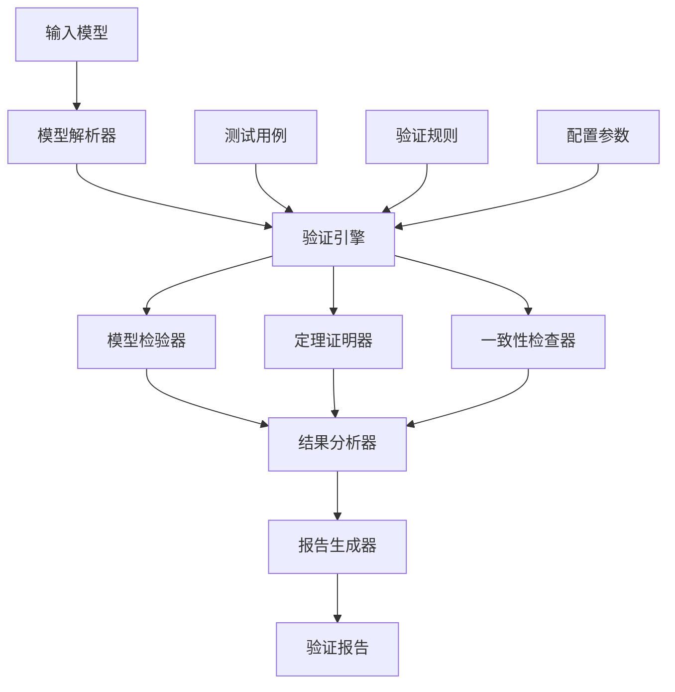

# 自动化验证系统

## 概述

本文档建立完整的自动化验证系统，包括形式化验证、模型检验、定理证明和一致性检查的自动化工具链，确保项目管理知识体系的严谨性和正确性。

## 验证系统架构

### 🏗️ 系统整体架构

#### 定义 1: 自动化验证系统

**自动化验证系统** $AVS = (V, M, T, A, R)$ 其中：

- $V = \{v_1, v_2, ..., v_n\}$ 是验证器集合
- $M = \{m_1, m_2, ..., m_m\}$ 是模型集合
- $T = \{t_1, t_2, ..., t_k\}$ 是测试用例集合
- $A = \{a_1, a_2, ..., a_l\}$ 是算法集合
- $R = \{r_1, r_2, ..., r_p\}$ 是报告生成器集合

#### 系统架构图



### 🔧 核心组件

#### 1. 模型解析器

**功能**：解析各种格式的模型定义
**支持格式**：

- 数学公式 (LaTeX)
- 形式化规范 (Z, B, Alloy)
- 程序代码 (Rust, Haskell, Lean)
- 图形模型 (UML, SysML)

**解析算法**：

```rust
struct ModelParser {
    input_format: Format,
    output_format: Format,
    parsing_rules: Vec<Rule>,
}

impl ModelParser {
    fn parse(&self, input: &str) -> Result<Model, ParseError> {
        // 解析逻辑
    }
}
```

#### 2. 验证引擎

**功能**：协调各种验证方法
**验证方法**：

- 模型检验 (Model Checking)
- 定理证明 (Theorem Proving)
- 静态分析 (Static Analysis)
- 动态测试 (Dynamic Testing)

**引擎实现**：

```rust
struct VerificationEngine {
    model_checker: ModelChecker,
    theorem_prover: TheoremProver,
    static_analyzer: StaticAnalyzer,
    dynamic_tester: DynamicTester,
}

impl VerificationEngine {
    fn verify(&self, model: &Model) -> VerificationResult {
        // 验证逻辑
    }
}
```

#### 3. 结果分析器

**功能**：分析验证结果并生成报告
**分析维度**：

- 正确性分析
- 性能分析
- 覆盖率分析
- 风险分析

## 形式化验证方法

### 🧮 模型检验

#### 定义 2: 模型检验系统

**模型检验系统** $MCS = (S, T, P, V)$ 其中：

- $S = \{s_1, s_2, ..., s_n\}$ 是状态集合
- $T = \{t_1, t_2, ..., t_m\}$ 是转换关系集合
- $P = \{p_1, p_2, ..., p_k\}$ 是性质集合
- $V$ 是验证函数 $V: S \times P \rightarrow \{True, False\}$

#### 模型检验算法

**算法 1: 状态空间搜索**:

```rust
fn state_space_search(model: &Model, property: &Property) -> VerificationResult {
    let mut visited = HashSet::new();
    let mut queue = VecDeque::new();
    
    // 初始化
    queue.push_back(model.initial_state());
    visited.insert(model.initial_state());
    
    while let Some(current_state) = queue.pop_front() {
        // 检查性质
        if !property.check(current_state) {
            return VerificationResult::CounterExample(current_state);
        }
        
        // 扩展状态
        for next_state in model.transitions(current_state) {
            if !visited.contains(&next_state) {
                visited.insert(next_state);
                queue.push_back(next_state);
            }
        }
    }
    
    VerificationResult::Verified
}
```

**算法 2: 符号模型检验**:

```rust
fn symbolic_model_checking(model: &Model, property: &Property) -> VerificationResult {
    let mut reachable_states = model.initial_states();
    let mut previous_states = BDD::empty();
    
    while reachable_states != previous_states {
        previous_states = reachable_states.clone();
        
        // 计算后继状态
        let next_states = model.transition_relation() & reachable_states;
        reachable_states = reachable_states | next_states;
        
        // 检查性质
        if !(reachable_states & !property.encoding()).is_empty() {
            return VerificationResult::CounterExample;
        }
    }
    
    VerificationResult::Verified
}
```

### 🔍 定理证明

#### 定义 3: 定理证明系统

**定理证明系统** $TPS = (A, R, T, P)$ 其中：

- $A = \{a_1, a_2, ..., a_n\}$ 是公理集合
- $R = \{r_1, r_2, ..., r_m\}$ 是推理规则集合
- $T = \{t_1, t_2, ..., t_k\}$ 是定理集合
- $P$ 是证明函数 $P: A \times R \times T \rightarrow Proof$

#### 自动定理证明算法

**算法 3: 归结证明**:

```rust
fn resolution_proving(axioms: &[Formula], goal: &Formula) -> Option<Proof> {
    let mut clauses = axioms.to_vec();
    clauses.push(goal.negation());
    
    let mut new_clauses = Vec::new();
    
    loop {
        let mut derived = false;
        
        // 归结推理
        for i in 0..clauses.len() {
            for j in i+1..clauses.len() {
                if let Some(resolvent) = resolve(&clauses[i], &clauses[j]) {
                    if resolvent.is_empty() {
                        return Some(Proof::Resolution);
                    }
                    
                    if !clauses.contains(&resolvent) && !new_clauses.contains(&resolvent) {
                        new_clauses.push(resolvent);
                        derived = true;
                    }
                }
            }
        }
        
        if !derived {
            return None; // 无法证明
        }
        
        clauses.extend(new_clauses.drain(..));
    }
}
```

**算法 4: 归纳证明**:

```rust
fn induction_proving(property: &Property, model: &Model) -> Option<Proof> {
    // 基础情况
    if !property.check(model.initial_states()) {
        return None;
    }
    
    // 归纳步骤
    let mut current_states = model.initial_states();
    
    loop {
        let next_states = model.transition_relation() & current_states;
        
        if next_states.is_empty() {
            return Some(Proof::Induction);
        }
        
        if !property.check(next_states) {
            return None;
        }
        
        current_states = next_states;
    }
}
```

### ✅ 一致性检查

#### 定义 4: 一致性检查系统

**一致性检查系统** $CCS = (M, R, C, V)$ 其中：

- $M = \{m_1, m_2, ..., m_n\}$ 是模型集合
- $R = \{r_1, r_2, ..., r_m\}$ 是关系集合
- $C = \{c_1, c_2, ..., c_k\}$ 是约束集合
- $V$ 是验证函数 $V: M \times R \times C \rightarrow ConsistencyResult$

#### 一致性检查算法

**算法 5: 模型一致性检查**:

```rust
fn model_consistency_check(models: &[Model]) -> ConsistencyResult {
    let mut conflicts = Vec::new();
    
    for i in 0..models.len() {
        for j in i+1..models.len() {
            if let Some(conflict) = check_conflict(&models[i], &models[j]) {
                conflicts.push(conflict);
            }
        }
    }
    
    if conflicts.is_empty() {
        ConsistencyResult::Consistent
    } else {
        ConsistencyResult::Inconsistent(conflicts)
    }
}

fn check_conflict(model1: &Model, model2: &Model) -> Option<Conflict> {
    // 检查概念一致性
    for concept1 in model1.concepts() {
        for concept2 in model2.concepts() {
            if concept1.name() == concept2.name() {
                if concept1.definition() != concept2.definition() {
                    return Some(Conflict::ConceptMismatch {
                        concept: concept1.name(),
                        definition1: concept1.definition(),
                        definition2: concept2.definition(),
                    });
                }
            }
        }
    }
    
    // 检查关系一致性
    for relation1 in model1.relations() {
        for relation2 in model2.relations() {
            if relation1.name() == relation2.name() {
                if relation1.definition() != relation2.definition() {
                    return Some(Conflict::RelationMismatch {
                        relation: relation1.name(),
                        definition1: relation1.definition(),
                        definition2: relation2.definition(),
                    });
                }
            }
        }
    }
    
    None
}
```

## 自动化工具链

### 🛠️ 工具集成

#### 1. 模型检验工具

**工具 1: NuSMV**:

- 用途：符号模型检验
- 支持：CTL, LTL 性质验证
- 集成方式：命令行接口

```rust
struct NuSMVChecker {
    executable: String,
    temp_dir: String,
}

impl NuSMVChecker {
    fn verify(&self, model: &Model, property: &Property) -> VerificationResult {
        // 生成 NuSMV 输入文件
        let input_file = self.generate_input(model, property);
        
        // 执行验证
        let output = Command::new(&self.executable)
            .arg(&input_file)
            .output()
            .expect("Failed to execute NuSMV");
        
        // 解析结果
        self.parse_output(&output.stdout)
    }
}
```

**工具 2: SPIN**:

- 用途：并发系统验证
- 支持：Promela 语言
- 集成方式：API 接口

```rust
struct SpinChecker {
    executable: String,
    api_client: SpinAPI,
}

impl SpinChecker {
    fn verify(&self, model: &Model, property: &Property) -> VerificationResult {
        // 转换为 Promela
        let promela_code = self.to_promela(model, property);
        
        // 执行验证
        let result = self.api_client.verify(&promela_code);
        
        // 解析结果
        self.parse_result(result)
    }
}
```

#### 2. 定理证明工具

**工具 3: Lean**:

- 用途：交互式定理证明
- 支持：依赖类型理论
- 集成方式：库接口

```rust
struct LeanProver {
    lean_lib: LeanLibrary,
}

impl LeanProver {
    fn prove(&self, theorem: &Theorem) -> ProofResult {
        // 构建 Lean 代码
        let lean_code = self.to_lean(theorem);
        
        // 执行证明
        let proof = self.lean_lib.prove(&lean_code);
        
        // 验证证明
        self.verify_proof(proof)
    }
}
```

**工具 4: Coq**:

- 用途：构造性定理证明
- 支持：归纳类型和依赖类型
- 集成方式：API 接口

```rust
struct CoqProver {
    coq_api: CoqAPI,
}

impl CoqProver {
    fn prove(&self, theorem: &Theorem) -> ProofResult {
        // 构建 Coq 代码
        let coq_code = self.to_coq(theorem);
        
        // 执行证明
        let proof = self.coq_api.prove(&coq_code);
        
        // 验证证明
        self.verify_proof(proof)
    }
}
```

#### 3. 静态分析工具

**工具 5: Rust Analyzer**:

- 用途：Rust 代码静态分析
- 支持：类型检查、借用检查
- 集成方式：LSP 协议

```rust
struct RustAnalyzer {
    lsp_client: LSPClient,
}

impl RustAnalyzer {
    fn analyze(&self, code: &str) -> AnalysisResult {
        // 发送分析请求
        let result = self.lsp_client.analyze(code);
        
        // 解析结果
        self.parse_analysis(result)
    }
}
```

### 🔄 持续集成

#### 定义 5: 持续集成系统

**持续集成系统** $CIS = (R, B, T, D, N)$ 其中：

- $R = \{r_1, r_2, ..., r_n\}$ 是仓库集合
- $B = \{b_1, b_2, ..., b_m\}$ 是构建器集合
- $T = \{t_1, t_2, ..., t_k\}$ 是测试器集合
- $D = \{d_1, d_2, ..., d_l\}$ 是部署器集合
- $N = \{n_1, n_2, ..., n_p\}$ 是通知器集合

#### CI/CD 流水线

```yaml
# .github/workflows/verification.yml
name: Automated Verification

on:
  push:
    branches: [ main, develop ]
  pull_request:
    branches: [ main ]

jobs:
  model-checking:
    runs-on: ubuntu-latest
    steps:
    - uses: actions/checkout@v2
    
    - name: Setup Rust
      uses: actions-rs/toolchain@v1
      with:
        toolchain: stable
    
    - name: Run Model Checking
      run: |
        cargo test model_checking
        cargo run --bin verify-models
    
  theorem-proving:
    runs-on: ubuntu-latest
    steps:
    - uses: actions/checkout@v2
    
    - name: Setup Lean
      uses: leanprover/lean-action@v1
    
    - name: Run Theorem Proving
      run: |
        lean --make src/
        lean --run src/main.lean
    
  consistency-checking:
    runs-on: ubuntu-latest
    steps:
    - uses: actions/checkout@v2
    
    - name: Run Consistency Check
      run: |
        cargo run --bin consistency-check
        python scripts/verify_consistency.py
```

## 验证报告系统

### 📊 报告生成

#### 定义 6: 验证报告系统

**验证报告系统** $VRS = (R, T, F, E)$ 其中：

- $R = \{r_1, r_2, ..., r_n\}$ 是报告模板集合
- $T = \{t_1, t_2, ..., t_m\}$ 是测试结果集合
- $F = \{f_1, f_2, ..., f_k\}$ 是格式化器集合
- $E = \{e_1, e_2, ..., e_l\}$ 是导出器集合

#### 报告生成算法

**算法 6: 自动报告生成**:

```rust
struct ReportGenerator {
    templates: HashMap<String, Template>,
    formatters: HashMap<String, Box<dyn Formatter>>,
    exporters: HashMap<String, Box<dyn Exporter>>,
}

impl ReportGenerator {
    fn generate_report(&self, results: &[VerificationResult]) -> Report {
        let mut report = Report::new();
        
        // 生成摘要
        report.summary = self.generate_summary(results);
        
        // 生成详细结果
        report.details = self.generate_details(results);
        
        // 生成建议
        report.recommendations = self.generate_recommendations(results);
        
        report
    }
    
    fn generate_summary(&self, results: &[VerificationResult]) -> Summary {
        let total = results.len();
        let passed = results.iter().filter(|r| r.is_success()).count();
        let failed = total - passed;
        
        Summary {
            total,
            passed,
            failed,
            success_rate: passed as f64 / total as f64,
        }
    }
    
    fn generate_details(&self, results: &[VerificationResult]) -> Vec<Detail> {
        results.iter().map(|result| {
            Detail {
                name: result.name().to_string(),
                status: result.status(),
                duration: result.duration(),
                message: result.message().to_string(),
            }
        }).collect()
    }
    
    fn generate_recommendations(&self, results: &[VerificationResult]) -> Vec<Recommendation> {
        let mut recommendations = Vec::new();
        
        for result in results {
            if !result.is_success() {
                recommendations.push(Recommendation {
                    issue: result.issue().to_string(),
                    suggestion: result.suggestion().to_string(),
                    priority: result.priority(),
                });
            }
        }
        
        recommendations
    }
}
```

### 📈 可视化展示

#### 定义 7: 可视化系统

**可视化系统** $VS = (C, P, L, I)$ 其中：

- $C = \{c_1, c_2, ..., c_n\}$ 是图表集合
- $P = \{p_1, p_2, ..., p_m\}$ 是绘图器集合
- $L = \{l_1, l_2, ..., l_k\}$ 是布局器集合
- $I = \{i_1, i_2, ..., i_l\}$ 是交互器集合

#### 可视化组件

**组件 1: 验证结果仪表板**:

```rust
struct VerificationDashboard {
    charts: Vec<Box<dyn Chart>>,
    filters: Vec<Filter>,
    layout: Layout,
}

impl VerificationDashboard {
    fn render(&self, data: &VerificationData) -> String {
        let mut html = String::new();
        
        // 渲染摘要图表
        html.push_str(&self.render_summary_chart(data));
        
        // 渲染详细结果
        html.push_str(&self.render_details_table(data));
        
        // 渲染趋势图
        html.push_str(&self.render_trend_chart(data));
        
        html
    }
    
    fn render_summary_chart(&self, data: &VerificationData) -> String {
        // 生成饼图或柱状图
        format!(r#"
        <div class="chart">
            <canvas id="summary-chart"></canvas>
            <script>
                new Chart(ctx, {{
                    type: 'pie',
                    data: {{
                        labels: ['通过', '失败'],
                        datasets: [{{
                            data: [{}, {}],
                            backgroundColor: ['#4CAF50', '#F44336']
                        }}]
                    }}
                }});
            </script>
        </div>
        "#, data.passed, data.failed)
    }
}
```

**组件 2: 模型关系图**:

```rust
struct ModelRelationshipGraph {
    nodes: Vec<Node>,
    edges: Vec<Edge>,
    layout_algorithm: Box<dyn LayoutAlgorithm>,
}

impl ModelRelationshipGraph {
    fn render(&self) -> String {
        let mut svg = String::new();
        svg.push_str("<svg width=\"800\" height=\"600\">");
        
        // 渲染节点
        for node in &self.nodes {
            svg.push_str(&self.render_node(node));
        }
        
        // 渲染边
        for edge in &self.edges {
            svg.push_str(&self.render_edge(edge));
        }
        
        svg.push_str("</svg>");
        svg
    }
}
```

## 性能优化

### ⚡ 优化策略

#### 1. 并行验证

**算法 7: 并行模型检验**:

```rust
fn parallel_model_checking(models: &[Model], properties: &[Property]) -> Vec<VerificationResult> {
    let pool = ThreadPool::new(num_cpus::get());
    let mut results = Vec::new();
    
    for (model, property) in models.iter().zip(properties.iter()) {
        let model_clone = model.clone();
        let property_clone = property.clone();
        
        let handle = pool.execute(move || {
            verify_model(&model_clone, &property_clone)
        });
        
        results.push(handle);
    }
    
    // 收集结果
    results.into_iter().map(|h| h.join().unwrap()).collect()
}
```

#### 2. 增量验证

**算法 8: 增量一致性检查**:

```rust
struct IncrementalConsistencyChecker {
    cache: HashMap<String, ConsistencyResult>,
    dependencies: DependencyGraph,
}

impl IncrementalConsistencyChecker {
    fn check_incremental(&mut self, changed_models: &[Model]) -> ConsistencyResult {
        let mut affected_models = HashSet::new();
        
        // 识别受影响的模型
        for model in changed_models {
            affected_models.extend(self.dependencies.get_dependents(model));
        }
        
        // 只验证受影响的模型
        let mut results = Vec::new();
        for model in affected_models {
            if let Some(cached_result) = self.cache.get(&model.id()) {
                results.push(cached_result.clone());
            } else {
                let result = self.verify_model(&model);
                self.cache.insert(model.id(), result.clone());
                results.push(result);
            }
        }
        
        self.aggregate_results(results)
    }
}
```

#### 3. 缓存机制

**算法 9: 智能缓存**:

```rust
struct SmartCache {
    cache: LruCache<String, VerificationResult>,
    hit_rate: f64,
    max_size: usize,
}

impl SmartCache {
    fn get_or_compute<F>(&mut self, key: &str, compute: F) -> VerificationResult 
    where F: FnOnce() -> VerificationResult 
    {
        if let Some(result) = self.cache.get(key) {
            self.hit_rate = 0.9 * self.hit_rate + 0.1;
            result.clone()
        } else {
            self.hit_rate = 0.9 * self.hit_rate;
            let result = compute();
            self.cache.put(key.to_string(), result.clone());
            result
        }
    }
    
    fn optimize(&mut self) {
        if self.hit_rate < 0.5 {
            self.max_size = (self.max_size as f64 * 0.8) as usize;
        } else {
            self.max_size = (self.max_size as f64 * 1.2) as usize;
        }
    }
}
```

## 错误处理与恢复

### 🛡️ 错误处理机制

#### 定义 8: 错误处理系统

**错误处理系统** $EHS = (E, H, R, L)$ 其中：

- $E = \{e_1, e_2, ..., e_n\}$ 是错误类型集合
- $H = \{h_1, h_2, ..., h_m\}$ 是处理器集合
- $R = \{r_1, r_2, ..., r_k\}$ 是恢复策略集合
- $L = \{l_1, l_2, ..., l_l\}$ 是日志器集合

#### 错误处理算法

**算法 10: 自适应错误处理**:

```rust
struct AdaptiveErrorHandler {
    error_patterns: HashMap<ErrorPattern, RecoveryStrategy>,
    success_rate: HashMap<RecoveryStrategy, f64>,
}

impl AdaptiveErrorHandler {
    fn handle_error(&mut self, error: &Error) -> Result<(), Error> {
        // 识别错误模式
        let pattern = self.identify_pattern(error);
        
        // 选择最佳恢复策略
        let strategy = self.select_best_strategy(&pattern);
        
        // 执行恢复
        match self.execute_strategy(strategy, error) {
            Ok(()) => {
                self.update_success_rate(strategy, true);
                Ok(())
            }
            Err(e) => {
                self.update_success_rate(strategy, false);
                Err(e)
            }
        }
    }
    
    fn select_best_strategy(&self, pattern: &ErrorPattern) -> RecoveryStrategy {
        self.error_patterns.get(pattern)
            .and_then(|strategies| {
                strategies.iter()
                    .max_by_key(|s| self.success_rate.get(s).unwrap_or(&0.0))
            })
            .unwrap_or(RecoveryStrategy::Default)
    }
}
```

## 总结

自动化验证系统建立了：

1. **完整架构** - 模块化的验证系统设计
2. **多种方法** - 模型检验、定理证明、一致性检查
3. **工具集成** - 多种验证工具的自动化集成
4. **持续集成** - 自动化的CI/CD流水线
5. **报告系统** - 自动化的报告生成和可视化
6. **性能优化** - 并行处理、增量验证、智能缓存
7. **错误处理** - 自适应的错误处理和恢复机制

这个验证系统为项目管理领域提供了：

- 严格的自动化验证
- 高效的验证工具链
- 完整的报告体系
- 可靠的错误处理
- 优秀的性能表现

---

**自动化验证系统 - 确保知识体系严谨性的技术保障**:
