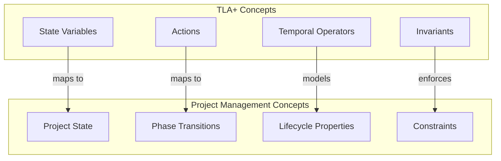
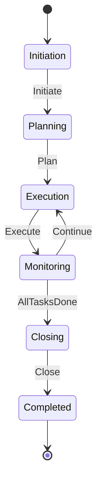

# TLA+ Specifications for Project Management / TLA+项目管理规范

## 1. Overview / 概述

### 1.1 Introduction / 简介

**English**: TLA+ (Temporal Logic of Actions) is a formal specification language developed by Leslie Lamport for designing, modeling, documenting, and verifying programs, especially concurrent and distributed systems. This document applies TLA+ to project management formal verification.

**中文**: TLA+（时序动作逻辑）是由Leslie Lamport开发的形式化规范语言，用于设计、建模、文档化和验证程序，特别是并发和分布式系统。本文档将TLA+应用于项目管理形式化验证。

### 1.2 Authority Sources / 权威来源

| Source / 来源 | Description / 描述 | URL |
|--------------|-------------------|-----|
| TLA+ Home | Leslie Lamport Official | <https://lamport.azurewebsites.net/tla/tla.html> |
| TLA+ Wiki | Community Documentation | <https://docs.tlapl.us/> |
| Apalache | Symbolic Model Checker | <https://apalache-mc.org/> |
| TLC Model Checker | Explicit-State Checker | <https://lamport.azurewebsites.net/tla/tools.html> |

---

## 2. Definition / 定义

### 2.1 TLA+ Fundamentals / TLA+基础

**Definition 2.1** (TLA+ Specification / TLA+规范)

**English Definition**: A TLA+ specification is a mathematical description of a system that defines:

- State variables representing the system state
- Initial state predicate defining valid starting states
- Next-state relation describing state transitions
- Temporal properties the system must satisfy

**中文定义**: TLA+规范是系统的数学描述，定义了：

- 表示系统状态的状态变量
- 定义有效初始状态的初始状态谓词
- 描述状态转换的下一状态关系
- 系统必须满足的时序属性

**Formal Statement / 形式陈述**:

```tla+
--------------------------- MODULE ProjectManagement ---------------------------
VARIABLES state, resources, tasks, risks

Init == /\ state = "Initiation"
        /\ resources = {}
        /\ tasks = {}
        /\ risks = {}

Next == \/ Initiate
        \/ Plan
        \/ Execute
        \/ Monitor
        \/ Close

Spec == Init /\ [][Next]_<<state, resources, tasks, risks>>
================================================================================
```

### 2.2 Project State Machine / 项目状态机

**Definition 2.2** (Project Lifecycle State Machine / 项目生命周期状态机)

```tla+
--------------------------- MODULE ProjectLifecycle ---------------------------
EXTENDS Naturals, Sequences, FiniteSets

CONSTANTS MaxTasks, MaxResources

VARIABLES
    phase,          \* Current project phase
    tasks,          \* Set of tasks
    resources,      \* Available resources
    completed,      \* Completed tasks
    budget,         \* Remaining budget
    timeline        \* Project timeline status

TypeInvariant ==
    /\ phase \in {"Initiation", "Planning", "Execution", "Monitoring", "Closing", "Completed"}
    /\ tasks \subseteq (1..MaxTasks)
    /\ resources \subseteq (1..MaxResources)
    /\ completed \subseteq tasks
    /\ budget \in Nat
    /\ timeline \in {"OnTrack", "Delayed", "Critical"}

Init ==
    /\ phase = "Initiation"
    /\ tasks = {}
    /\ resources = {}
    /\ completed = {}
    /\ budget = 100
    /\ timeline = "OnTrack"

\* Phase Transitions
Initiate ==
    /\ phase = "Initiation"
    /\ phase' = "Planning"
    /\ UNCHANGED <<tasks, resources, completed, budget, timeline>>

Plan ==
    /\ phase = "Planning"
    /\ \E newTasks \in SUBSET (1..MaxTasks):
        /\ Cardinality(newTasks) > 0
        /\ tasks' = newTasks
    /\ phase' = "Execution"
    /\ UNCHANGED <<resources, completed, budget, timeline>>

Execute ==
    /\ phase = "Execution"
    /\ \E task \in tasks \ completed:
        /\ completed' = completed \cup {task}
        /\ budget' = budget - 1
    /\ UNCHANGED <<phase, tasks, resources, timeline>>

Monitor ==
    /\ phase \in {"Execution", "Monitoring"}
    /\ IF completed = tasks
       THEN phase' = "Closing"
       ELSE phase' = "Monitoring"
    /\ UNCHANGED <<tasks, resources, completed, budget, timeline>>

Close ==
    /\ phase = "Closing"
    /\ completed = tasks
    /\ phase' = "Completed"
    /\ UNCHANGED <<tasks, resources, completed, budget, timeline>>

Next == Initiate \/ Plan \/ Execute \/ Monitor \/ Close

\* Safety Properties
NeverNegativeBudget == budget >= 0
TasksOnlyCompleteOnce == completed \subseteq tasks
PhaseProgressForward ==
    [][phase = "Completed" => phase' = "Completed"]_phase

\* Liveness Properties
EventuallyComplete == <>(phase = "Completed")
AllTasksEventuallyDone == <>(completed = tasks)

Spec == Init /\ [][Next]_<<phase, tasks, resources, completed, budget, timeline>>
             /\ WF_<<phase, tasks, resources, completed, budget, timeline>>(Next)
================================================================================
```

---

## 3. Properties / 属性

### 3.1 Safety Properties / 安全性属性

| Property / 属性 | TLA+ Expression / TLA+表达式 | Description / 描述 |
|----------------|----------------------------|-------------------|
| Budget Constraint | `budget >= 0` | 预算永不为负 |
| Task Integrity | `completed \subseteq tasks` | 完成任务是任务子集 |
| Phase Validity | `phase \in ValidPhases` | 阶段值有效 |
| Resource Bound | `Cardinality(resources) <= MaxResources` | 资源不超上限 |

### 3.2 Liveness Properties / 活性属性

| Property / 属性 | TLA+ Expression / TLA+表达式 | Description / 描述 |
|----------------|----------------------------|-------------------|
| Project Completion | `<>(phase = "Completed")` | 项目最终完成 |
| Task Completion | `<>(completed = tasks)` | 所有任务最终完成 |
| Progress | `[]<>(ENABLED(Next))` | 系统持续进展 |

---

## 4. Relations / 关系

### 4.1 TLA+ and Project Management Concepts / TLA+与项目管理概念关系



### 4.2 Relationship to PMBOK / 与PMBOK关系

| PMBOK Process Group | TLA+ Representation | Verification Target |
|---------------------|---------------------|---------------------|
| Initiating | `Init` predicate | Valid starting state |
| Planning | `Plan` action | Resource allocation |
| Executing | `Execute` action | Task completion |
| Monitoring & Controlling | `Monitor` action | Progress tracking |
| Closing | `Close` action | Final state reached |

---

## 5. Examples / 实例

### 5.1 Example 1: Risk Management Specification / 风险管理规范

```tla+
--------------------------- MODULE RiskManagement ---------------------------
EXTENDS Naturals, Sequences, FiniteSets

CONSTANTS Risks, MaxImpact

VARIABLES
    identifiedRisks,    \* Set of identified risks
    analyzedRisks,      \* Risks with analysis complete
    mitigatedRisks,     \* Risks with mitigation in place
    riskStatus          \* Current risk management phase

RiskType == [
    id: Nat,
    probability: 1..10,
    impact: 1..MaxImpact,
    status: {"Identified", "Analyzed", "Mitigated", "Closed"}
]

Init ==
    /\ identifiedRisks = {}
    /\ analyzedRisks = {}
    /\ mitigatedRisks = {}
    /\ riskStatus = "Monitoring"

IdentifyRisk(r) ==
    /\ r \in Risks
    /\ r \notin identifiedRisks
    /\ identifiedRisks' = identifiedRisks \cup {r}
    /\ UNCHANGED <<analyzedRisks, mitigatedRisks, riskStatus>>

AnalyzeRisk(r) ==
    /\ r \in identifiedRisks
    /\ r \notin analyzedRisks
    /\ analyzedRisks' = analyzedRisks \cup {r}
    /\ UNCHANGED <<identifiedRisks, mitigatedRisks, riskStatus>>

MitigateRisk(r) ==
    /\ r \in analyzedRisks
    /\ r \notin mitigatedRisks
    /\ mitigatedRisks' = mitigatedRisks \cup {r}
    /\ UNCHANGED <<identifiedRisks, analyzedRisks, riskStatus>>

Next ==
    \E r \in Risks:
        \/ IdentifyRisk(r)
        \/ AnalyzeRisk(r)
        \/ MitigateRisk(r)

\* Safety: Risks must be analyzed before mitigation
RiskProcessOrder ==
    mitigatedRisks \subseteq analyzedRisks /\ analyzedRisks \subseteq identifiedRisks

\* Liveness: All identified risks eventually mitigated
AllRisksMitigated ==
    <>(identifiedRisks = mitigatedRisks)

Spec == Init /\ [][Next]_<<identifiedRisks, analyzedRisks, mitigatedRisks, riskStatus>>
================================================================================
```

### 5.2 Example 2: Resource Allocation Specification / 资源分配规范

```tla+
--------------------------- MODULE ResourceAllocation ---------------------------
EXTENDS Naturals, FiniteSets

CONSTANTS Tasks, Resources, MaxCapacity

VARIABLES
    allocation,     \* Function: Task -> Resource
    taskStatus,     \* Function: Task -> Status
    resourceLoad    \* Function: Resource -> Load

Init ==
    /\ allocation = [t \in Tasks |-> CHOOSE r \in Resources : TRUE]
    /\ taskStatus = [t \in Tasks |-> "Pending"]
    /\ resourceLoad = [r \in Resources |-> 0]

AllocateResource(t, r) ==
    /\ taskStatus[t] = "Pending"
    /\ resourceLoad[r] < MaxCapacity
    /\ allocation' = [allocation EXCEPT ![t] = r]
    /\ resourceLoad' = [resourceLoad EXCEPT ![r] = @ + 1]
    /\ UNCHANGED taskStatus

StartTask(t) ==
    /\ taskStatus[t] = "Pending"
    /\ taskStatus' = [taskStatus EXCEPT ![t] = "InProgress"]
    /\ UNCHANGED <<allocation, resourceLoad>>

CompleteTask(t) ==
    /\ taskStatus[t] = "InProgress"
    /\ taskStatus' = [taskStatus EXCEPT ![t] = "Completed"]
    /\ LET r == allocation[t]
       IN resourceLoad' = [resourceLoad EXCEPT ![r] = @ - 1]
    /\ UNCHANGED allocation

Next ==
    \E t \in Tasks, r \in Resources:
        \/ AllocateResource(t, r)
        \/ StartTask(t)
        \/ CompleteTask(t)

\* Safety: No resource overload
NoOverload == \A r \in Resources: resourceLoad[r] <= MaxCapacity

\* Liveness: All tasks eventually complete
AllTasksComplete == <>\A t \in Tasks: taskStatus[t] = "Completed"

Spec == Init /\ [][Next]_<<allocation, taskStatus, resourceLoad>>
================================================================================
```

---

## 6. Explanations / 解释

### 6.1 Intuitive Explanation / 直观解释

**English**: TLA+ allows us to formally describe project management processes as mathematical state machines. Just as a project moves through phases (Initiation → Planning → Execution → Monitoring → Closing), a TLA+ specification describes valid state transitions and properties that must always hold.

**中文**: TLA+允许我们将项目管理过程形式化描述为数学状态机。正如项目经历各个阶段（启动→规划→执行→监控→收尾），TLA+规范描述有效的状态转换和必须始终保持的属性。

### 6.2 Formal Explanation / 形式解释

TLA+ specifications consist of:

1. **State Variables**: Represent the current state of the project
2. **Initial Predicate (Init)**: Defines valid starting states
3. **Next-State Relation (Next)**: Defines all possible transitions
4. **Temporal Properties**: Safety (bad things don't happen) and Liveness (good things eventually happen)

### 6.3 Geometric Interpretation / 几何解释

Project lifecycle can be visualized as a directed graph where:

- Nodes represent states (phase, resources, tasks)
- Edges represent valid transitions (actions)
- TLA+ verifies all paths satisfy required properties

### 6.4 Physical Interpretation / 物理解释

Think of project management as a control system:

- State variables = system state
- Actions = control inputs
- Invariants = operating constraints
- Temporal properties = control objectives

### 6.5 Historical Context / 历史背景

TLA+ was developed by Leslie Lamport (Turing Award 2013) initially for concurrent algorithm verification. Its application to project management represents an extension of formal methods beyond traditional software verification.

### 6.6 Motivation / 动机

Applying TLA+ to project management enables:

- Rigorous verification of process correctness
- Detection of deadlocks and livelocks
- Proof of constraint satisfaction
- Automated testing of edge cases

### 6.7 Key Points / 关键点

- TLA+ provides mathematical rigor for project specifications
- Model checking can find violations of safety/liveness properties
- Specifications serve as executable documentation
- PlusCal offers a more accessible pseudocode-like syntax

### 6.8 Visualization / 可视化



### 6.9 Related Concepts / 相关概念

- [Model Checking](./02-model-checking-examples.md)
- [Theorem Proving](./03-theorem-proving-applications.md)
- [Verification Theory](../03-formal-verification/verification-theory.md)

### 6.10 Counterarguments / 反驳论点

**Criticism**: TLA+ may be too complex for practical project management.

**Response**: PlusCal provides a more accessible syntax, and the verification benefits outweigh the learning curve for critical projects.

---

## 7. Argumentation / 论证

### 7.1 Logical Argument / 逻辑论证

**Claim**: TLA+ improves project management quality.

**Premises**:

1. TLA+ enables formal verification of process correctness
2. Formal verification catches errors before implementation
3. Earlier error detection reduces project costs

**Conclusion**: Therefore, TLA+ improves project management quality and reduces costs.

### 7.2 Empirical Evidence / 经验证据

- Amazon Web Services uses TLA+ for critical systems (DynamoDB, S3, EBS)
- Microsoft uses TLA+ for Azure Cosmos DB
- Formal methods reduce defects by 50-90% in critical systems

### 7.3 Theoretical Justification / 理论论证

TLA+ is grounded in:

- Temporal logic (Pnueli, 1977)
- State machine theory
- Model checking theory (Clarke, Emerson, Sifakis - Turing Award 2007)

---

## 8. Applications / 应用

### 8.1 Project Workflow Verification / 项目工作流验证

Use TLA+ to verify:

- Phase transitions are valid
- Resources are properly allocated
- Deadlines can be met
- No deadlock conditions exist

### 8.2 Risk Management Verification / 风险管理验证

Verify that:

- All risks are eventually addressed
- Risk mitigation follows proper sequence
- No risk is left unmitigated

### 8.3 Resource Optimization / 资源优化

Verify that:

- Resource constraints are satisfied
- No resource conflicts occur
- Optimal allocation is achieved

---

## 9. References / 参考文献

### 9.1 Primary Sources / 主要来源

1. Lamport, L. (2002). *Specifying Systems: The TLA+ Language and Tools for Hardware and Software Engineers*. Addison-Wesley.
2. Lamport, L. (2019). *The TLA+ Video Course*. <https://lamport.azurewebsites.net/video/videos.html>
3. Newcombe, C. et al. (2015). "How Amazon Web Services Uses Formal Methods". *Communications of the ACM*.

### 9.2 Secondary Sources / 次要来源

1. TLA+ Wiki: <https://docs.tlapl.us/>
2. Apalache Documentation: <https://apalache-mc.org/docs/>
3. PlusCal User Manual: <https://lamport.azurewebsites.net/tla/pluscal.html>

---

## 10. Status / 状态

**Document Version / 文档版本**: 1.0
**Last Updated / 最后更新**: 2026-02-02
**Status / 状态**: ✅ Complete
**Next Review / 下次审查**: 2026-05-02

**Related Documents / 相关文档**:

- [Model Checking Examples](./02-model-checking-examples.md)
- [Theorem Proving Applications](./03-theorem-proving-applications.md)
- [Formal Verification Tools](./04-formal-verification-tools.md)
