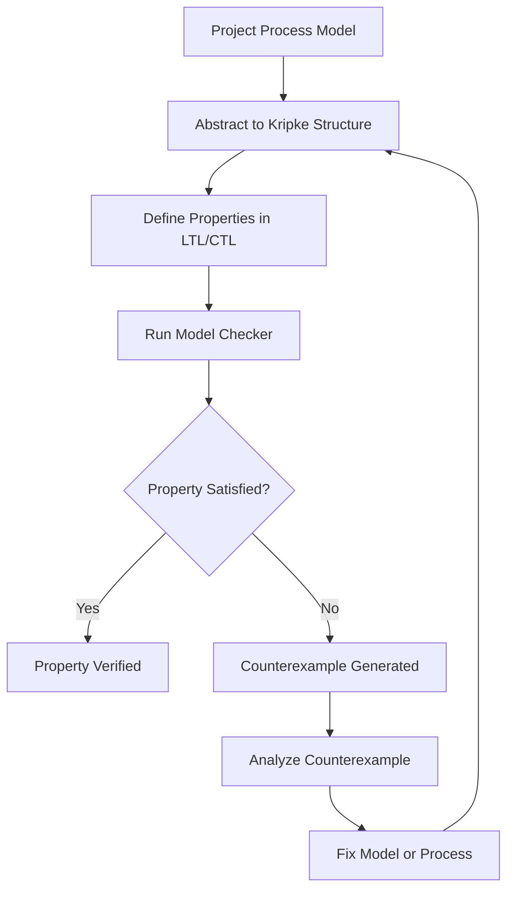
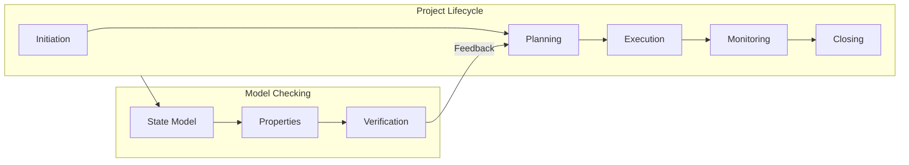
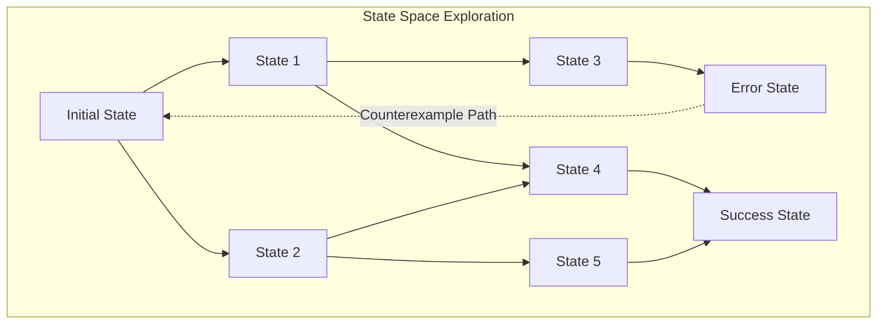

# Model Checking Examples for Project Management / 项目管理模型检验实例

## 1. Overview / 概述

### 1.1 Introduction / 简介

**English**: Model checking is an automated technique for verifying that a system model satisfies specified properties. This document provides practical examples of applying model checking to project management scenarios.

**中文**: 模型检验是一种自动化技术，用于验证系统模型是否满足指定的属性。本文档提供了将模型检验应用于项目管理场景的实际案例。

### 1.2 Authority Sources / 权威来源

| Source / 来源 | Description / 描述 | Reference |
|--------------|-------------------|-----------|
| Clarke et al. | Model Checking (MIT Press) | Standard textbook |
| Baier & Katoen | Principles of Model Checking | Comprehensive theory |
| SPIN Model Checker | Verification tool | https://spinroot.com |
| NuSMV | Symbolic model checker | https://nusmv.fbk.eu |

---

## 2. Definition / 定义

### 2.1 Model Checking Fundamentals / 模型检验基础

**Definition 2.1** (Model Checking / 模型检验)

**English Definition**: Model checking is a technique that systematically explores all possible states of a system model to verify whether it satisfies a given specification, typically expressed in temporal logic (LTL or CTL).

**中文定义**: 模型检验是一种系统地探索系统模型所有可能状态的技术，以验证其是否满足给定的规范，该规范通常用时序逻辑（LTL或CTL）表达。

**Formal Statement / 形式陈述**:

Given:
- $M$: Kripke structure (system model)
- $\phi$: Temporal logic formula (specification)

Model checking answers: $M \models \phi$ ?

$$M = (S, S_0, R, L)$$

Where:
- $S$: Set of states
- $S_0 \subseteq S$: Initial states
- $R \subseteq S \times S$: Transition relation
- $L: S \rightarrow 2^{AP}$: Labeling function

### 2.2 Temporal Logic for Project Management / 项目管理时序逻辑

**Definition 2.2** (LTL for Projects / 项目LTL)

Linear Temporal Logic operators applied to project management:

| Operator | Symbol | Project Meaning / 项目含义 |
|----------|--------|-------------------------|
| Next | $\bigcirc$ | In the next phase... |
| Eventually | $\Diamond$ | At some future point... |
| Always | $\square$ | Throughout the project... |
| Until | $\mathcal{U}$ | Until milestone reached... |

**Example Properties / 示例属性**:

```
□(budget ≥ 0)                    -- Budget never negative
◇(phase = "Completed")           -- Project eventually completes
□(risk_identified → ◇risk_mitigated)  -- Risks eventually addressed
□(task_started → ◇task_completed)     -- Started tasks complete
```

---

## 3. Properties / 属性

### 3.1 Property Classification / 属性分类

| Property Type | Description | Example |
|--------------|-------------|---------|
| **Safety** | Bad things don't happen | No budget overrun |
| **Liveness** | Good things eventually happen | Project completes |
| **Fairness** | Resources fairly allocated | Each team gets turns |
| **Deadlock-freedom** | System never gets stuck | Always progress possible |

### 3.2 Project Management Properties Matrix / 项目管理属性矩阵

| PMBOK Area | Safety Property | Liveness Property |
|------------|-----------------|-------------------|
| Scope | No scope creep | Deliverables completed |
| Schedule | No deadline violation | Milestones achieved |
| Cost | No budget overrun | Payments processed |
| Quality | Standards maintained | Reviews completed |
| Risk | Risks identified | Risks mitigated |
| Resources | No overallocation | Tasks assigned |

---

## 4. Relations / 关系

### 4.1 Model Checking Process Flow / 模型检验流程



### 4.2 Relationship to Project Lifecycle / 与项目生命周期关系



---

## 5. Examples / 实例

### 5.1 Example 1: Project Deadline Verification / 项目截止日期验证

**Context / 上下文**: Verify that a project with dependencies will complete by deadline.

**PROMELA Model (SPIN) / PROMELA模型**:

```promela
/* Project Deadline Verification */
#define NUM_TASKS 5
#define DEADLINE 100

int time = 0;
bool task_done[NUM_TASKS];
int task_start[NUM_TASKS];
int task_duration[NUM_TASKS];

/* Task dependencies: task i depends on tasks in deps[i] */
bool deps[NUM_TASKS][NUM_TASKS];

proctype Task(int id) {
    /* Wait for dependencies */
    int i;
    for (i : 0 .. NUM_TASKS-1) {
        if
        :: deps[id][i] -> (task_done[i]);
        :: !deps[id][i] -> skip;
        fi
    }
    
    /* Execute task */
    task_start[id] = time;
    time = time + task_duration[id];
    task_done[id] = true;
}

init {
    /* Initialize task durations */
    task_duration[0] = 10;
    task_duration[1] = 20;
    task_duration[2] = 15;
    task_duration[3] = 25;
    task_duration[4] = 10;
    
    /* Initialize dependencies */
    deps[1][0] = true;  /* Task 1 depends on Task 0 */
    deps[2][0] = true;  /* Task 2 depends on Task 0 */
    deps[3][1] = true;  /* Task 3 depends on Task 1 */
    deps[3][2] = true;  /* Task 3 depends on Task 2 */
    deps[4][3] = true;  /* Task 4 depends on Task 3 */
    
    /* Run all tasks concurrently */
    atomic {
        run Task(0);
        run Task(1);
        run Task(2);
        run Task(3);
        run Task(4);
    }
}

/* LTL Property: Project completes within deadline */
ltl deadline_met { <> (task_done[NUM_TASKS-1] && time <= DEADLINE) }

/* LTL Property: All tasks eventually complete */
ltl all_complete { <> (task_done[0] && task_done[1] && task_done[2] && 
                        task_done[3] && task_done[4]) }
```

### 5.2 Example 2: Resource Conflict Detection / 资源冲突检测

**Context / 上下文**: Detect potential resource conflicts in parallel task execution.

**NuSMV Model / NuSMV模型**:

```nusmv
MODULE main
VAR
    resource : {free, task1, task2, task3};
    task1_status : {waiting, running, done};
    task2_status : {waiting, running, done};
    task3_status : {waiting, running, done};

ASSIGN
    init(resource) := free;
    init(task1_status) := waiting;
    init(task2_status) := waiting;
    init(task3_status) := waiting;
    
    next(resource) := case
        resource = free & task1_status = waiting : {free, task1};
        resource = free & task2_status = waiting : {free, task2};
        resource = free & task3_status = waiting : {free, task3};
        resource = task1 & task1_status = running : {free, task1};
        resource = task2 & task2_status = running : {free, task2};
        resource = task3 & task3_status = running : {free, task3};
        TRUE : resource;
    esac;
    
    next(task1_status) := case
        task1_status = waiting & resource = task1 : running;
        task1_status = running & resource = free : done;
        TRUE : task1_status;
    esac;
    
    next(task2_status) := case
        task2_status = waiting & resource = task2 : running;
        task2_status = running & resource = free : done;
        TRUE : task2_status;
    esac;
    
    next(task3_status) := case
        task3_status = waiting & resource = task3 : running;
        task3_status = running & resource = free : done;
        TRUE : task3_status;
    esac;

-- Safety: No two tasks use resource simultaneously
SPEC AG !(resource = task1 & resource = task2)
SPEC AG !(resource = task1 & resource = task3)
SPEC AG !(resource = task2 & resource = task3)

-- Liveness: All tasks eventually complete
SPEC AF (task1_status = done)
SPEC AF (task2_status = done)
SPEC AF (task3_status = done)

-- No deadlock
SPEC AG EF (task1_status = done & task2_status = done & task3_status = done)
```

### 5.3 Example 3: Risk Escalation Workflow / 风险升级工作流

**Context / 上下文**: Verify risk escalation follows proper protocol.

**TLA+ Model with TLC Verification / TLA+模型与TLC验证**:

```tla+
--------------------------- MODULE RiskEscalation ---------------------------
EXTENDS Naturals, Sequences

CONSTANTS 
    Risks,          \* Set of all risks
    PM,             \* Project Manager
    Sponsor,        \* Project Sponsor
    SteeringComm    \* Steering Committee

VARIABLES
    riskLevel,      \* Risk -> Level (Low, Medium, High, Critical)
    owner,          \* Risk -> Owner
    escalated,      \* Risk -> Boolean
    resolved        \* Risk -> Boolean

RiskLevels == {"Low", "Medium", "High", "Critical"}
Owners == {PM, Sponsor, SteeringComm}

TypeOK == 
    /\ riskLevel \in [Risks -> RiskLevels]
    /\ owner \in [Risks -> Owners]
    /\ escalated \in [Risks -> BOOLEAN]
    /\ resolved \in [Risks -> BOOLEAN]

Init == 
    /\ riskLevel = [r \in Risks |-> "Low"]
    /\ owner = [r \in Risks |-> PM]
    /\ escalated = [r \in Risks |-> FALSE]
    /\ resolved = [r \in Risks |-> FALSE]

\* Risk level increases
IncreaseRiskLevel(r) == 
    /\ ~resolved[r]
    /\ \/ /\ riskLevel[r] = "Low"
          /\ riskLevel' = [riskLevel EXCEPT ![r] = "Medium"]
       \/ /\ riskLevel[r] = "Medium"
          /\ riskLevel' = [riskLevel EXCEPT ![r] = "High"]
       \/ /\ riskLevel[r] = "High"
          /\ riskLevel' = [riskLevel EXCEPT ![r] = "Critical"]
    /\ UNCHANGED <<owner, escalated, resolved>>

\* Escalation based on level
Escalate(r) == 
    /\ ~resolved[r]
    /\ ~escalated[r]
    /\ \/ /\ riskLevel[r] = "High"
          /\ owner[r] = PM
          /\ owner' = [owner EXCEPT ![r] = Sponsor]
       \/ /\ riskLevel[r] = "Critical"
          /\ owner[r] = Sponsor
          /\ owner' = [owner EXCEPT ![r] = SteeringComm]
    /\ escalated' = [escalated EXCEPT ![r] = TRUE]
    /\ UNCHANGED <<riskLevel, resolved>>

\* Risk resolution
Resolve(r) == 
    /\ ~resolved[r]
    /\ resolved' = [resolved EXCEPT ![r] = TRUE]
    /\ UNCHANGED <<riskLevel, owner, escalated>>

Next == 
    \E r \in Risks:
        \/ IncreaseRiskLevel(r)
        \/ Escalate(r)
        \/ Resolve(r)

\* PROPERTIES

\* Safety: High risks must have sponsor or higher as owner
HighRiskOwnership == 
    \A r \in Risks: 
        riskLevel[r] \in {"High", "Critical"} => 
            owner[r] \in {Sponsor, SteeringComm}

\* Safety: Critical risks must have steering committee as owner
CriticalRiskOwnership == 
    \A r \in Risks:
        riskLevel[r] = "Critical" => owner[r] = SteeringComm

\* Liveness: All risks eventually resolved
AllRisksResolved == 
    <>(\A r \in Risks: resolved[r])

Spec == Init /\ [][Next]_<<riskLevel, owner, escalated, resolved>>
================================================================================
```

---

## 6. Explanations / 解释

### 6.1 Intuitive Explanation / 直观解释

**English**: Model checking is like having an exhaustive tester that explores every possible way your project could unfold. Instead of hoping nothing goes wrong, it mathematically proves your process handles all scenarios correctly.

**中文**: 模型检验就像拥有一个详尽的测试者，它会探索项目可能展开的每一种方式。与其希望不会出错，不如用数学方法证明你的流程正确处理了所有场景。

### 6.2 Formal Explanation / 形式解释

Model checking algorithms:
1. **Explicit-State**: Enumerate all reachable states (SPIN, TLC)
2. **Symbolic**: Use BDDs to represent state sets (NuSMV)
3. **Bounded**: Check up to depth k (SAT-based)

Complexity: PSPACE-complete for LTL, PTIME for CTL

### 6.3 Geometric Interpretation / 几何解释

Think of the state space as a directed graph:
- Nodes = states (project configurations)
- Edges = transitions (actions)
- Properties = path constraints
- Model checking = graph traversal

### 6.4 Physical Interpretation / 物理解释

Like testing a physical system under all operating conditions:
- State = system configuration
- Transition = state change
- Property = safety requirement
- Counterexample = failure scenario

### 6.5 Historical Context / 历史背景

Model checking developed from:
- 1981: Clarke & Emerson propose CTL model checking
- 1986: Vardi & Wolper develop LTL model checking
- 2007: Turing Award to Clarke, Emerson, Sifakis

### 6.6 Motivation / 动机

Why model check project management?
- Automated verification of complex workflows
- Detection of subtle process errors
- Proof of compliance with standards
- Risk-free exploration of scenarios

### 6.7 Key Points / 关键点

1. Model checking provides exhaustive verification
2. Counterexamples pinpoint exact failure scenarios
3. State explosion is the main challenge
4. Abstraction techniques manage complexity

### 6.8 Visualization / 可视化



### 6.9 Related Concepts / 相关概念

- [TLA+ Specifications](./01-tla-plus-specifications.md)
- [Theorem Proving](./03-theorem-proving-applications.md)
- [Verification Theory](../03-formal-verification/verification-theory.md)

### 6.10 Counterarguments / 反驳论点

**Criticism**: State explosion makes model checking impractical for real projects.

**Response**: 
- Abstraction techniques reduce state space
- Bounded model checking handles large systems
- Partial verification still valuable

---

## 7. Argumentation / 论证

### 7.1 Logical Argument / 逻辑论证

**Claim**: Model checking improves project process reliability.

**Premises**:
1. Model checking verifies all possible execution paths
2. Counterexamples reveal hidden process flaws
3. Fixed flaws prevent real project failures

**Conclusion**: Model checking improves project process reliability.

### 7.2 Empirical Evidence / 经验证据

| Industry | Application | Benefit |
|----------|-------------|---------|
| Aerospace | NASA Mars Rover | Critical bug detection |
| Finance | Trading systems | Compliance verification |
| Healthcare | Medical devices | Safety certification |
| IT | Cloud services (AWS) | Reliability assurance |

### 7.3 Theoretical Justification / 理论论证

Based on:
- Automata theory (Büchi automata for LTL)
- Fixed-point computation (CTL algorithms)
- Computational complexity theory

---

## 8. Applications / 应用

### 8.1 Workflow Verification / 工作流验证

Verify project workflows:
- Approval processes
- Change management
- Release procedures

### 8.2 Compliance Checking / 合规检查

Verify compliance with:
- ISO 21500 processes
- PMBOK guidelines
- Industry regulations

### 8.3 Risk Analysis / 风险分析

Automated discovery of:
- Deadlock conditions
- Resource conflicts
- Schedule violations

---

## 9. References / 参考文献

### 9.1 Primary Sources / 主要来源

1. Clarke, E. M., Grumberg, O., & Peled, D. A. (2018). *Model Checking* (2nd ed.). MIT Press.
2. Baier, C., & Katoen, J. P. (2008). *Principles of Model Checking*. MIT Press.
3. Holzmann, G. J. (2003). *The SPIN Model Checker*. Addison-Wesley.

### 9.2 Secondary Sources / 次要来源

1. SPIN Documentation: https://spinroot.com/spin/Doc/
2. NuSMV User Manual: https://nusmv.fbk.eu/NuSMV/userman/
3. TLA+ Toolbox: https://lamport.azurewebsites.net/tla/toolbox.html

---

## 10. Status / 状态

**Document Version / 文档版本**: 1.0
**Last Updated / 最后更新**: 2026-02-02
**Status / 状态**: ✅ Complete
**Next Review / 下次审查**: 2026-05-02

**Related Documents / 相关文档**:
- [TLA+ Specifications](./01-tla-plus-specifications.md)
- [Theorem Proving Applications](./03-theorem-proving-applications.md)
- [Formal Verification Tools](./04-formal-verification-tools.md)
