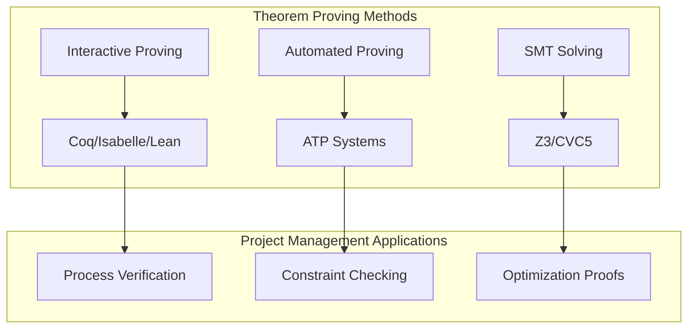
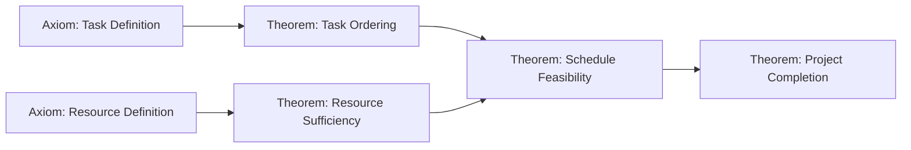
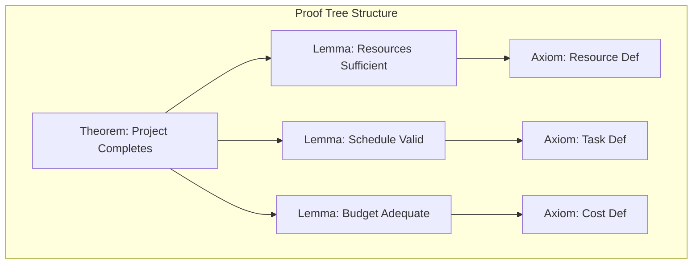

# Theorem Proving Applications for Project Management / 项目管理定理证明应用

## 1. Overview / 概述

### 1.1 Introduction / 简介

**English**: Theorem proving is a formal method that uses mathematical logic to prove properties about systems. This document explores applications of theorem proving to verify project management processes and constraints.

**中文**: 定理证明是一种使用数学逻辑来证明系统属性的形式化方法。本文档探讨了定理证明在验证项目管理过程和约束方面的应用。

### 1.2 Authority Sources / 权威来源

| Tool / 工具 | Type / 类型 | URL |
|------------|------------|-----|
| Coq | Interactive Proof Assistant | https://coq.inria.fr/ |
| Isabelle/HOL | Generic Proof Assistant | https://isabelle.in.tum.de/ |
| Lean | Mathematical Proof Language | https://leanprover.github.io/ |
| Z3 | SMT Solver | https://github.com/Z3Prover/z3 |

---

## 2. Definition / 定义

### 2.1 Theorem Proving Fundamentals / 定理证明基础

**Definition 2.1** (Theorem Proving / 定理证明)

**English Definition**: Theorem proving is a technique that uses logical deduction to establish that certain properties (theorems) follow from a set of axioms and definitions. Unlike model checking, theorem proving can handle infinite state spaces.

**中文定义**: 定理证明是一种使用逻辑推理来建立某些属性（定理）从公理和定义集合中推导出来的技术。与模型检验不同，定理证明可以处理无限状态空间。

**Formal Statement / 形式陈述**:

$$\Gamma \vdash \phi$$

Where:
- $\Gamma$: Set of axioms and hypotheses (assumptions)
- $\phi$: Property to prove (theorem)
- $\vdash$: Derivability relation

### 2.2 Types of Theorem Proving / 定理证明类型

| Type / 类型 | Description / 描述 | Use Case / 用例 |
|------------|-------------------|----------------|
| Interactive | Human-guided proofs | Complex properties |
| Automated | Automatic proof search | Simple properties |
| SMT-based | Satisfiability solving | Constraint checking |

---

## 3. Properties / 属性

### 3.1 Project Management Theorems / 项目管理定理

**Theorem 3.1** (Resource Sufficiency / 资源充分性)

$$\forall t \in Tasks: \exists r \in Resources: allocate(r, t) \implies complete(t)$$

**Proof Strategy**: Prove by construction that resource allocation policy ensures task completion.

**Theorem 3.2** (Schedule Consistency / 进度一致性)

$$\forall t_1, t_2 \in Tasks: depends(t_1, t_2) \implies end(t_1) \leq start(t_2)$$

**Proof Strategy**: Induction on dependency graph structure.

**Theorem 3.3** (Budget Conservation / 预算守恒)

$$\sum_{t \in Tasks} cost(t) \leq TotalBudget \implies \neg BudgetOverrun$$

**Proof Strategy**: Algebraic proof using cost function properties.

---

## 4. Relations / 关系

### 4.1 Relationship Between Proving Methods / 证明方法关系



### 4.2 Proof Dependencies / 证明依赖关系



---

## 5. Examples / 实例

### 5.1 Example 1: Project Schedule Proof in Lean / 项目进度证明（Lean）

**Context / 上下文**: Prove that a valid schedule respects task dependencies.

```lean
-- Project Management in Lean 4

-- Define basic types
structure Task where
  id : Nat
  duration : Nat
  start_time : Nat
  deriving Repr

def end_time (t : Task) : Nat := t.start_time + t.duration

-- Define dependency relation
def depends_on (t1 t2 : Task) : Prop := 
  -- t1 depends on t2 (t2 must complete before t1 starts)
  end_time t2 ≤ t1.start_time

-- Define valid schedule
def valid_schedule (tasks : List Task) (deps : List (Task × Task)) : Prop :=
  ∀ (t1 t2 : Task), (t1, t2) ∈ deps → depends_on t1 t2

-- Theorem: If schedule is valid, no circular dependencies exist
theorem no_circular_deps 
  (tasks : List Task) 
  (deps : List (Task × Task))
  (h_valid : valid_schedule tasks deps) :
  ∀ t : Task, ¬ depends_on t t := by
  intro t
  intro h_self_dep
  -- Self-dependency would require end_time t ≤ t.start_time
  -- But end_time t = t.start_time + t.duration > t.start_time (when duration > 0)
  unfold depends_on at h_self_dep
  unfold end_time at h_self_dep
  omega -- Contradiction: n + d ≤ n impossible for d > 0

-- Theorem: Tasks complete in order
theorem task_order_preserved
  (t1 t2 : Task)
  (h_dep : depends_on t1 t2) :
  end_time t2 ≤ t1.start_time := by
  exact h_dep
```

### 5.2 Example 2: Resource Allocation Proof in Coq / 资源分配证明（Coq）

**Context / 上下文**: Prove that resource allocation satisfies constraints.

```coq
(* Resource Allocation Verification in Coq *)

Require Import Coq.Lists.List.
Require Import Coq.Arith.Arith.
Import ListNotations.

(* Define types *)
Definition ResourceId := nat.
Definition TaskId := nat.
Definition Capacity := nat.

Record Resource := mkResource {
  res_id : ResourceId;
  res_capacity : Capacity
}.

Record Task := mkTask {
  task_id : TaskId;
  task_demand : Capacity
}.

Record Allocation := mkAllocation {
  alloc_task : TaskId;
  alloc_resource : ResourceId;
  alloc_amount : Capacity
}.

(* Calculate total allocation to a resource *)
Fixpoint total_allocated (res : ResourceId) (allocs : list Allocation) : Capacity :=
  match allocs with
  | [] => 0
  | a :: rest => 
      if Nat.eqb (alloc_resource a) res 
      then alloc_amount a + total_allocated res rest
      else total_allocated res rest
  end.

(* Property: No resource is over-allocated *)
Definition no_overallocation (resources : list Resource) (allocs : list Allocation) : Prop :=
  forall r : Resource, 
    In r resources -> 
    total_allocated (res_id r) allocs <= res_capacity r.

(* Theorem: Empty allocation satisfies constraint *)
Theorem empty_allocation_valid : 
  forall resources : list Resource,
    no_overallocation resources [].
Proof.
  unfold no_overallocation.
  intros resources r H_in.
  simpl. 
  apply Nat.le_0_l.
Qed.

(* Theorem: Adding allocation within capacity preserves validity *)
Theorem add_allocation_preserves_validity :
  forall (resources : list Resource) (allocs : list Allocation) (new_alloc : Allocation),
    no_overallocation resources allocs ->
    (forall r : Resource, 
      res_id r = alloc_resource new_alloc -> 
      In r resources ->
      total_allocated (res_id r) allocs + alloc_amount new_alloc <= res_capacity r) ->
    no_overallocation resources (new_alloc :: allocs).
Proof.
  unfold no_overallocation.
  intros resources allocs new_alloc H_valid H_fits r H_in.
  simpl.
  destruct (Nat.eqb (alloc_resource new_alloc) (res_id r)) eqn:E.
  - (* Resource matches new allocation *)
    apply Nat.eqb_eq in E.
    rewrite E.
    apply H_fits.
    + symmetry. exact E.
    + exact H_in.
  - (* Resource doesn't match *)
    apply H_valid. exact H_in.
Qed.
```

### 5.3 Example 3: Budget Constraint Proof with Z3 / 预算约束证明（Z3）

**Context / 上下文**: Verify budget constraints using SMT solving.

```python
# Budget Constraint Verification with Z3

from z3 import *

def verify_project_budget():
    """
    Verify that project budget constraints are satisfiable
    and find valid allocations.
    """
    
    # Create solver
    s = Solver()
    
    # Define project parameters
    num_tasks = 5
    total_budget = 100000
    
    # Task costs (variables)
    task_costs = [Int(f'cost_{i}') for i in range(num_tasks)]
    
    # Task durations
    task_durations = [Int(f'duration_{i}') for i in range(num_tasks)]
    
    # Constraints
    
    # 1. All costs must be positive
    for cost in task_costs:
        s.add(cost > 0)
    
    # 2. Total cost must not exceed budget
    s.add(Sum(task_costs) <= total_budget)
    
    # 3. Minimum cost per task (based on duration)
    for i in range(num_tasks):
        s.add(task_durations[i] >= 1)
        s.add(task_costs[i] >= task_durations[i] * 1000)  # $1000/day minimum
    
    # 4. Specific task constraints
    # Task 0: Planning - at least 10 days
    s.add(task_durations[0] >= 10)
    
    # Task 1: Development - at least 30 days
    s.add(task_durations[1] >= 30)
    
    # Task 2: Testing - at least 15 days
    s.add(task_durations[2] >= 15)
    
    # Task 3: Deployment - at least 5 days
    s.add(task_durations[3] >= 5)
    
    # Task 4: Documentation - at least 10 days
    s.add(task_durations[4] >= 10)
    
    # 5. Cost efficiency constraint
    # Average cost per day should not exceed $1500
    total_duration = Sum(task_durations)
    total_cost = Sum(task_costs)
    s.add(total_cost <= total_duration * 1500)
    
    # Check satisfiability
    if s.check() == sat:
        m = s.model()
        print("Budget constraints are satisfiable!")
        print("\nValid allocation found:")
        
        total = 0
        for i in range(num_tasks):
            cost = m.evaluate(task_costs[i]).as_long()
            duration = m.evaluate(task_durations[i]).as_long()
            total += cost
            print(f"  Task {i}: Cost=${cost:,}, Duration={duration} days")
        
        print(f"\nTotal project cost: ${total:,}")
        print(f"Budget remaining: ${total_budget - total:,}")
        
        return True
    else:
        print("Budget constraints are UNSATISFIABLE!")
        print("Project cannot be completed within budget.")
        return False

def prove_budget_theorem():
    """
    Prove: If all individual task budgets are met,
    then total budget constraint is satisfied.
    """
    
    # Create solver for proof
    s = Solver()
    
    # Symbolic values
    budget = Int('total_budget')
    task_budgets = [Int(f'task_budget_{i}') for i in range(3)]
    task_costs = [Int(f'task_cost_{i}') for i in range(3)]
    
    # Hypothesis: Each task stays within its budget
    for i in range(3):
        s.add(task_costs[i] <= task_budgets[i])
        s.add(task_costs[i] >= 0)
        s.add(task_budgets[i] >= 0)
    
    # Hypothesis: Task budgets sum to total budget
    s.add(Sum(task_budgets) == budget)
    s.add(budget >= 0)
    
    # Negation of theorem (try to find counterexample)
    # Theorem: Total cost <= Total budget
    s.add(Sum(task_costs) > budget)
    
    if s.check() == unsat:
        print("THEOREM PROVED: If each task stays within budget,")
        print("then total project cost stays within total budget.")
        return True
    else:
        print("Counterexample found - theorem is FALSE")
        return False

if __name__ == "__main__":
    print("=" * 60)
    print("Project Budget Verification")
    print("=" * 60)
    
    verify_project_budget()
    
    print("\n" + "=" * 60)
    print("Budget Theorem Proof")
    print("=" * 60)
    
    prove_budget_theorem()
```

---

## 6. Explanations / 解释

### 6.1 Intuitive Explanation / 直观解释

**English**: Theorem proving is like writing a mathematical proof that your project process is correct. Instead of testing examples, you prove that the process works for ALL possible cases.

**中文**: 定理证明就像撰写一个数学证明，证明你的项目过程是正确的。与其测试示例，不如证明该过程适用于所有可能的情况。

### 6.2 Formal Explanation / 形式解释

Theorem proving uses:
- **Axioms**: Basic assumptions about the system
- **Inference Rules**: Valid reasoning steps
- **Tactics**: Proof strategies and automation
- **Lemmas**: Intermediate results

### 6.3 Geometric Interpretation / 几何解释

Proofs can be visualized as trees:
- Root = theorem to prove
- Branches = subgoals
- Leaves = axioms or proven lemmas

### 6.4 Physical Interpretation / 物理解释

Like deriving physical laws from first principles:
- Axioms = fundamental laws
- Theorems = derived properties
- Proofs = logical derivations

### 6.5 Historical Context / 历史背景

- 1960s: First automated theorem provers
- 1970s: Interactive proof assistants (LCF)
- 1980s: Coq development begins
- 2010s: Lean language developed

### 6.6 Motivation / 动机

Why use theorem proving for projects?
- Prove properties for infinite scenarios
- Mathematical certainty of correctness
- Reusable proof libraries
- Documentation as proofs

### 6.7 Key Points / 关键点

1. Theorem proving handles infinite state spaces
2. Interactive provers require human guidance
3. SMT solvers automate constraint checking
4. Proofs serve as verified documentation

### 6.8 Visualization / 可视化



### 6.9 Related Concepts / 相关概念

- [TLA+ Specifications](./01-tla-plus-specifications.md)
- [Model Checking Examples](./02-model-checking-examples.md)
- [Verification Theory](../03-formal-verification/verification-theory.md)

### 6.10 Counterarguments / 反驳论点

**Criticism**: Theorem proving requires too much expertise.

**Response**: 
- Modern tools have better automation
- SMT solvers require minimal proof expertise
- Libraries provide reusable verified components

---

## 7. Argumentation / 论证

### 7.1 Logical Argument / 逻辑论证

**Claim**: Theorem proving provides strongest verification guarantees.

**Premises**:
1. Theorem proving covers infinite state spaces
2. Proofs are mathematically rigorous
3. Verified properties hold for all executions

**Conclusion**: Theorem proving provides strongest verification guarantees.

### 7.2 Empirical Evidence / 经验证据

| Project | Tool | Achievement |
|---------|------|-------------|
| CompCert | Coq | Verified C compiler |
| seL4 | Isabelle | Verified OS kernel |
| CertiKOS | Coq | Verified concurrent OS |
| Fiat Crypto | Coq | Verified cryptography |

### 7.3 Theoretical Justification / 理论论证

Based on:
- Curry-Howard correspondence (proofs as programs)
- Type theory foundations
- Constructive logic

---

## 8. Applications / 应用

### 8.1 Process Correctness / 过程正确性

Prove that project processes:
- Follow required sequences
- Respect constraints
- Achieve goals

### 8.2 Contract Verification / 合同验证

Verify that:
- Deliverables match specifications
- Obligations are met
- SLAs are satisfied

### 8.3 Optimization Proofs / 优化证明

Prove that:
- Resource allocation is optimal
- Schedule is minimal
- Costs are minimized

---

## 9. References / 参考文献

### 9.1 Primary Sources / 主要来源

1. Bertot, Y., & Castéran, P. (2004). *Interactive Theorem Proving and Program Development: Coq'Art*. Springer.
2. Nipkow, T., Paulson, L. C., & Wenzel, M. (2002). *Isabelle/HOL: A Proof Assistant for Higher-Order Logic*. Springer.
3. de Moura, L., & Bjørner, N. (2008). "Z3: An Efficient SMT Solver". *TACAS*.

### 9.2 Secondary Sources / 次要来源

1. Lean 4 Documentation: https://lean-lang.org/lean4/doc/
2. Coq Reference Manual: https://coq.inria.fr/refman/
3. Isabelle Documentation: https://isabelle.in.tum.de/documentation.html

---

## 10. Status / 状态

**Document Version / 文档版本**: 1.0
**Last Updated / 最后更新**: 2026-02-02
**Status / 状态**: ✅ Complete
**Next Review / 下次审查**: 2026-05-02

**Related Documents / 相关文档**:
- [TLA+ Specifications](./01-tla-plus-specifications.md)
- [Model Checking Examples](./02-model-checking-examples.md)
- [Formal Verification Tools](./04-formal-verification-tools.md)
