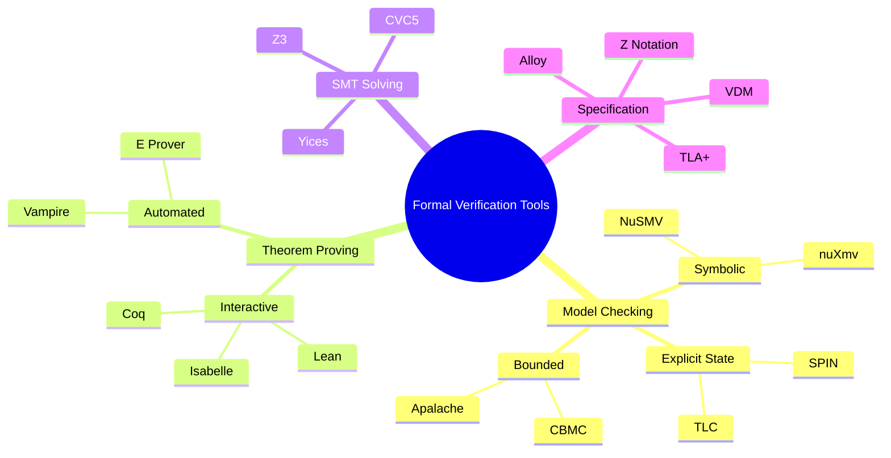
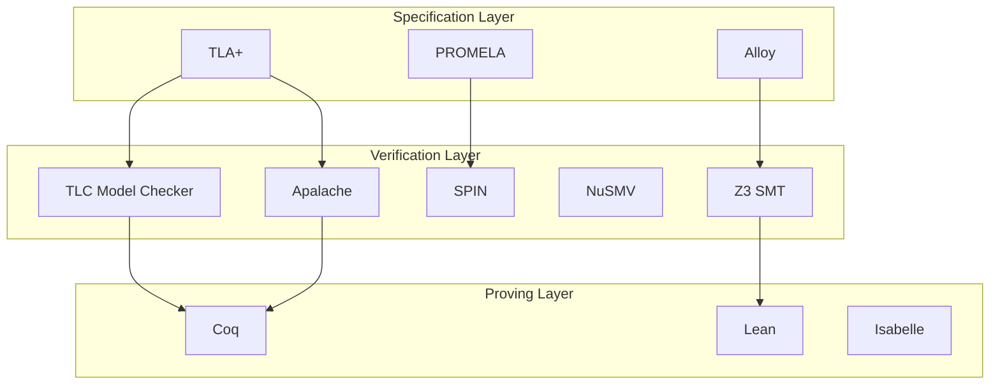
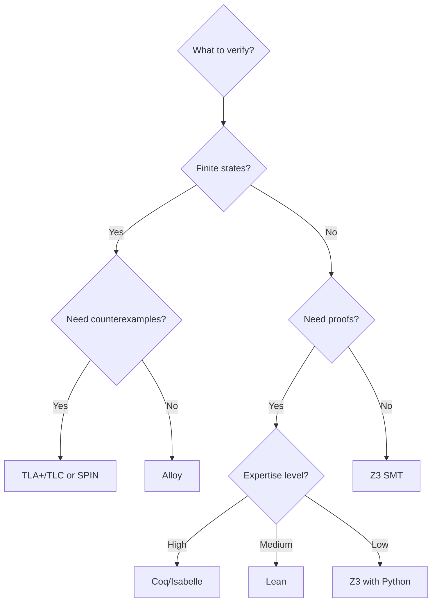
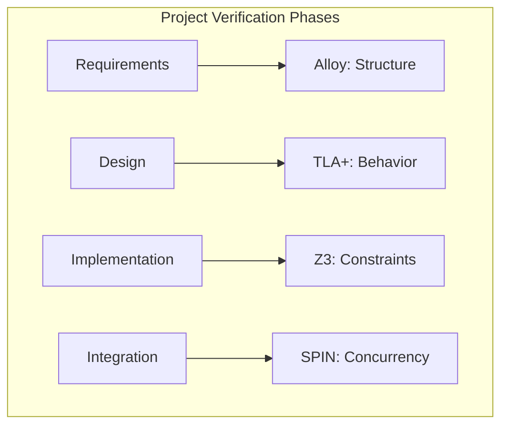
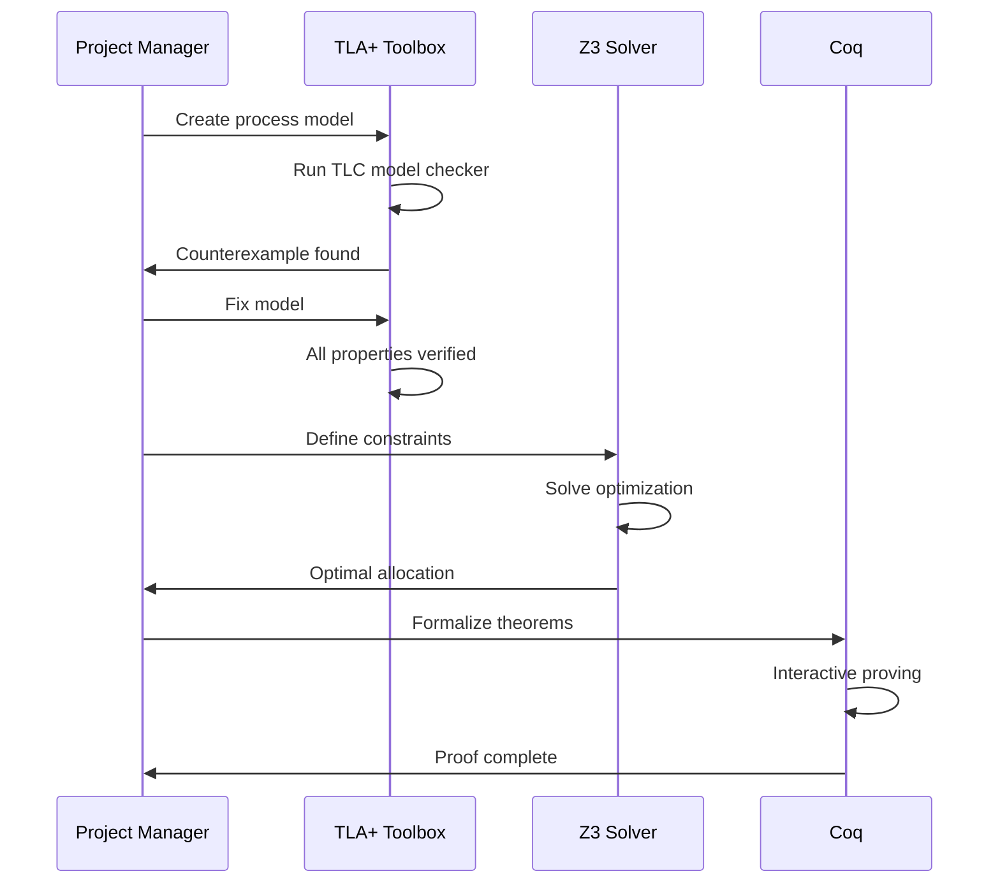

# Formal Verification Tools for Project Management / 项目管理形式化验证工具

## 1. Overview / 概述

### 1.1 Introduction / 简介

**English**: This document provides a comprehensive guide to formal verification tools applicable to project management. It covers model checkers, theorem provers, specification languages, and their practical applications.

**中文**: 本文档提供了适用于项目管理的形式化验证工具综合指南。涵盖模型检验器、定理证明器、规范语言及其实际应用。

### 1.2 Tool Categories / 工具分类

| Category / 类别 | Purpose / 用途 | Examples / 示例 |
|----------------|---------------|----------------|
| Model Checkers | State space exploration | SPIN, NuSMV, TLC |
| Theorem Provers | Mathematical proofs | Coq, Isabelle, Lean |
| SMT Solvers | Constraint solving | Z3, CVC5, Yices |
| Specification Languages | Formal modeling | TLA+, Alloy, Z |

---

## 2. Definition / 定义

### 2.1 Tool Classification Matrix / 工具分类矩阵



---

## 3. Properties / 属性

### 3.1 Tool Comparison Matrix / 工具对比矩阵

| Tool | Type | Language | State Space | Learning Curve | PM Suitability |
|------|------|----------|-------------|----------------|----------------|
| **TLA+/TLC** | Model Checker | TLA+ | Finite | Medium | High |
| **SPIN** | Model Checker | PROMELA | Finite | Medium | High |
| **NuSMV** | Model Checker | SMV | Finite (BDD) | Medium | Medium |
| **Apalache** | Symbolic MC | TLA+ | Symbolic | Medium | High |
| **Coq** | Theorem Prover | Gallina | Infinite | High | Medium |
| **Lean** | Theorem Prover | Lean | Infinite | Medium | Medium |
| **Isabelle** | Theorem Prover | Isar | Infinite | High | Medium |
| **Z3** | SMT Solver | SMT-LIB | Symbolic | Low | High |
| **Alloy** | Model Finder | Alloy | Bounded | Low | High |

### 3.2 Feature Comparison / 功能对比

| Feature | TLA+/TLC | SPIN | Coq | Z3 | Alloy |
|---------|----------|------|-----|-----|-------|
| Safety Properties | ✅ | ✅ | ✅ | ✅ | ✅ |
| Liveness Properties | ✅ | ✅ | ✅ | ❌ | ❌ |
| Infinite State | ❌ | ❌ | ✅ | ✅ | ❌ |
| Counterexamples | ✅ | ✅ | ❌ | ✅ | ✅ |
| Proof Generation | ❌ | ❌ | ✅ | ❌ | ❌ |
| GUI Support | ✅ | ✅ | ✅ | ❌ | ✅ |
| Industry Adoption | High | High | Medium | High | Medium |

---

## 4. Relations / 关系

### 4.1 Tool Integration Architecture / 工具集成架构



### 4.2 Tool Selection Decision Tree / 工具选择决策树



---

## 5. Examples / 实例

### 5.1 Tool 1: TLA+ Toolbox / TLA+工具箱

**Description / 描述**: Integrated development environment for TLA+ specifications.

**Installation / 安装**:

```bash
# Download from: https://github.com/tlaplus/tlaplus/releases
# Or use VS Code extension: vscode-tlaplus
```

**Project Management Example / 项目管理示例**:

```tla+
----------------------- MODULE SimpleProject -----------------------
EXTENDS Integers, Sequences, FiniteSets

CONSTANTS Tasks, Resources, Budget

VARIABLES
    taskStatus,
    resourceAllocation,
    spentBudget

vars == <<taskStatus, resourceAllocation, spentBudget>>

TypeOK ==
    /\ taskStatus \in [Tasks -> {"pending", "active", "done"}]
    /\ resourceAllocation \in [Tasks -> Resources \cup {NONE}]
    /\ spentBudget \in 0..Budget

Init ==
    /\ taskStatus = [t \in Tasks |-> "pending"]
    /\ resourceAllocation = [t \in Tasks |-> NONE]
    /\ spentBudget = 0

StartTask(t) ==
    /\ taskStatus[t] = "pending"
    /\ \E r \in Resources:
        /\ \A t2 \in Tasks: resourceAllocation[t2] # r
        /\ resourceAllocation' = [resourceAllocation EXCEPT ![t] = r]
    /\ taskStatus' = [taskStatus EXCEPT ![t] = "active"]
    /\ spentBudget' = spentBudget + 10
    /\ spentBudget' <= Budget

CompleteTask(t) ==
    /\ taskStatus[t] = "active"
    /\ taskStatus' = [taskStatus EXCEPT ![t] = "done"]
    /\ resourceAllocation' = [resourceAllocation EXCEPT ![t] = NONE]
    /\ UNCHANGED spentBudget

Next == \E t \in Tasks: StartTask(t) \/ CompleteTask(t)

Spec == Init /\ [][Next]_vars /\ WF_vars(Next)

\* Properties
BudgetNeverExceeded == spentBudget <= Budget
AllTasksEventuallyComplete == <>(\A t \in Tasks: taskStatus[t] = "done")
NoResourceConflict == \A t1, t2 \in Tasks:
    t1 # t2 /\ resourceAllocation[t1] # NONE =>
        resourceAllocation[t1] # resourceAllocation[t2]
====================================================================
```

### 5.2 Tool 2: Alloy Analyzer / Alloy分析器

**Description / 描述**: Lightweight formal method for software modeling.

**Project Structure Model / 项目结构模型**:

```alloy
// Project Management Model in Alloy

sig Resource {}

sig Task {
    depends: set Task,
    assigned: lone Resource,
    status: one Status
}

abstract sig Status {}
one sig Pending, Active, Complete extends Status {}

sig Project {
    tasks: set Task,
    resources: set Resource,
    budget: Int
}

// Facts (Constraints)

// No self-dependency
fact NoSelfDependency {
    no t: Task | t in t.depends
}

// No circular dependencies
fact NoCyclicDependency {
    no t: Task | t in t.^depends
}

// Resource can only be assigned to one active task
fact OneTaskPerResource {
    all r: Resource |
        lone t: Task | t.assigned = r and t.status = Active
}

// Active task must have resource
fact ActiveTaskHasResource {
    all t: Task | t.status = Active implies some t.assigned
}

// Completed dependencies for active tasks
fact DependenciesComplete {
    all t: Task | t.status = Active implies
        all d: t.depends | d.status = Complete
}

// Predicates

pred validProject[p: Project] {
    all t: p.tasks | t.assigned in p.resources
    #p.tasks <= p.budget
}

pred canStart[t: Task] {
    t.status = Pending
    all d: t.depends | d.status = Complete
}

pred startTask[t, t': Task] {
    canStart[t]
    t'.status = Active
    t'.depends = t.depends
}

// Assertions

assert NoDeadlock {
    all p: Project |
        some t: p.tasks | t.status = Pending implies
            some t2: p.tasks | canStart[t2]
}

// Commands

run validProject for 5 Task, 3 Resource, 1 Project

check NoDeadlock for 10 Task, 5 Resource, 1 Project
```

### 5.3 Tool 3: Z3 Python API / Z3 Python接口

**Description / 描述**: High-performance SMT solver with Python bindings.

**Resource Optimization Example / 资源优化示例**:

```python
"""
Project Resource Optimization using Z3
"""

from z3 import *

def optimize_resource_allocation():
    """
    Find optimal resource allocation for project tasks.
    """

    # Problem parameters
    num_tasks = 5
    num_resources = 3

    # Create optimizer
    opt = Optimize()

    # Decision variables
    # allocation[i][j] = 1 if task i uses resource j
    allocation = [[Bool(f'alloc_{i}_{j}')
                   for j in range(num_resources)]
                  for i in range(num_tasks)]

    # Duration variables (depends on resource)
    durations = [Int(f'duration_{i}') for i in range(num_tasks)]

    # Start times
    start_times = [Int(f'start_{i}') for i in range(num_tasks)]

    # Resource efficiency (affects duration)
    resource_efficiency = [1.0, 0.8, 1.2]  # Resource 0 is fastest

    # Constraints

    # 1. Each task assigned to exactly one resource
    for i in range(num_tasks):
        opt.add(Sum([If(allocation[i][j], 1, 0)
                     for j in range(num_resources)]) == 1)

    # 2. Base task durations (modified by resource efficiency)
    base_durations = [10, 20, 15, 25, 10]
    for i in range(num_tasks):
        for j in range(num_resources):
            opt.add(Implies(allocation[i][j],
                           durations[i] == int(base_durations[i] / resource_efficiency[j])))

    # 3. Start times non-negative
    for i in range(num_tasks):
        opt.add(start_times[i] >= 0)

    # 4. Task dependencies
    dependencies = [(1, 0), (2, 0), (3, 1), (3, 2), (4, 3)]
    for (t1, t2) in dependencies:
        opt.add(start_times[t1] >= start_times[t2] + durations[t2])

    # 5. Resource conflict avoidance
    # Two tasks on same resource cannot overlap
    for i in range(num_tasks):
        for k in range(i+1, num_tasks):
            for j in range(num_resources):
                opt.add(Implies(
                    And(allocation[i][j], allocation[k][j]),
                    Or(start_times[i] >= start_times[k] + durations[k],
                       start_times[k] >= start_times[i] + durations[i])
                ))

    # Objective: Minimize makespan (project completion time)
    makespan = Int('makespan')
    for i in range(num_tasks):
        opt.add(makespan >= start_times[i] + durations[i])

    opt.minimize(makespan)

    # Solve
    if opt.check() == sat:
        m = opt.model()
        print("Optimal schedule found!")
        print(f"Total project duration: {m.evaluate(makespan)} days")
        print("\nTask allocations:")

        for i in range(num_tasks):
            for j in range(num_resources):
                if is_true(m.evaluate(allocation[i][j])):
                    start = m.evaluate(start_times[i]).as_long()
                    dur = m.evaluate(durations[i]).as_long()
                    print(f"  Task {i}: Resource {j}, Start: Day {start}, Duration: {dur} days")

        return True
    else:
        print("No feasible schedule found!")
        return False

def verify_schedule_properties():
    """
    Verify properties of any valid schedule.
    """

    s = Solver()

    # Symbolic schedule
    num_tasks = 3
    start = [Int(f's_{i}') for i in range(num_tasks)]
    duration = [Int(f'd_{i}') for i in range(num_tasks)]
    end = [Int(f'e_{i}') for i in range(num_tasks)]

    # Basic constraints
    for i in range(num_tasks):
        s.add(start[i] >= 0)
        s.add(duration[i] > 0)
        s.add(end[i] == start[i] + duration[i])

    # Dependencies: 0 -> 1 -> 2
    s.add(start[1] >= end[0])
    s.add(start[2] >= end[1])

    # Property to verify: makespan >= sum of critical path
    makespan = Int('makespan')
    s.add(makespan == end[2])

    critical_path_length = duration[0] + duration[1] + duration[2]

    # Try to find counterexample where makespan < critical path
    s.add(makespan < critical_path_length)

    if s.check() == unsat:
        print("VERIFIED: Makespan is always >= critical path length")
        return True
    else:
        print("Counterexample found (unexpected)")
        return False

if __name__ == "__main__":
    print("=" * 60)
    print("Resource Allocation Optimization")
    print("=" * 60)
    optimize_resource_allocation()

    print("\n" + "=" * 60)
    print("Schedule Property Verification")
    print("=" * 60)
    verify_schedule_properties()
```

### 5.4 Tool 4: SPIN Model Checker / SPIN模型检验器

**Description / 描述**: Verification tool for distributed software systems.

**Workflow Verification Example / 工作流验证示例**:

```promela
/* Project Approval Workflow in PROMELA */

#define NUM_APPROVERS 3
#define APPROVAL_THRESHOLD 2

mtype = { PENDING, APPROVED, REJECTED, ESCALATED };

mtype project_status = PENDING;
int approvals = 0;
int rejections = 0;
bool escalated = false;

/* Approver process */
proctype Approver(int id) {
    mtype decision;

    /* Wait for project to be pending */
    project_status == PENDING;

    /* Make decision */
    if
    :: decision = APPROVED; approvals++;
    :: decision = REJECTED; rejections++;
    fi;

    printf("Approver %d: %e\n", id, decision);
}

/* Escalation process */
proctype EscalationManager() {
    /* Check if escalation needed */
    (approvals + rejections == NUM_APPROVERS);

    if
    :: (approvals >= APPROVAL_THRESHOLD) ->
        project_status = APPROVED;
        printf("Project APPROVED with %d votes\n", approvals);
    :: (rejections > NUM_APPROVERS - APPROVAL_THRESHOLD) ->
        project_status = REJECTED;
        printf("Project REJECTED with %d votes\n", rejections);
    :: else ->
        escalated = true;
        project_status = ESCALATED;
        printf("Project ESCALATED for review\n");
    fi;
}

init {
    atomic {
        run Approver(0);
        run Approver(1);
        run Approver(2);
        run EscalationManager();
    }
}

/* LTL Properties */

/* Eventually a decision is made */
ltl decision_made { <> (project_status != PENDING) }

/* If approved, had enough votes */
ltl valid_approval {
    [] (project_status == APPROVED -> approvals >= APPROVAL_THRESHOLD)
}

/* If rejected, had too many rejections */
ltl valid_rejection {
    [] (project_status == REJECTED -> rejections > NUM_APPROVERS - APPROVAL_THRESHOLD)
}

/* No decision without all votes */
ltl complete_voting {
    [] ((project_status != PENDING) ->
        (approvals + rejections == NUM_APPROVERS))
}
```

---

## 6. Explanations / 解释

### 6.1 Intuitive Explanation / 直观解释

**English**: Formal verification tools are like having a perfect, tireless reviewer who checks every possible way your project process could execute. They mathematically guarantee correctness.

**中文**: 形式化验证工具就像拥有一个完美、不知疲倦的审查员，检查项目过程可能执行的每一种方式。它们在数学上保证正确性。

### 6.2 Tool Selection Guidelines / 工具选择指南

| Scenario / 场景 | Recommended Tool / 推荐工具 | Reason / 原因 |
|----------------|---------------------------|---------------|
| Workflow verification | TLA+/TLC | Strong temporal logic |
| Resource constraints | Z3 | Efficient constraint solving |
| Structure modeling | Alloy | Visual, relational |
| Critical proofs | Coq/Lean | Mathematical rigor |
| Concurrent processes | SPIN | LTL, deadlock detection |

### 6.3 Key Points / 关键点

1. Choose tools based on verification needs
2. Combine tools for comprehensive verification
3. Start with simpler tools (Alloy, Z3)
4. Use model checking before theorem proving

### 6.4 Visualization / 可视化



---

## 7. Argumentation / 论证

### 7.1 Logical Argument / 逻辑论证

**Claim**: Formal verification tools are essential for critical projects.

**Premises**:

1. Critical projects require high reliability
2. Testing cannot cover all scenarios
3. Formal verification provides mathematical guarantees

**Conclusion**: Formal verification tools are essential for critical projects.

### 7.2 Empirical Evidence / 经验证据

| Company | Tool | Application |
|---------|------|-------------|
| Amazon | TLA+ | AWS services |
| Microsoft | TLA+, Z3 | Azure, Windows |
| Intel | SMT solvers | Hardware verification |
| Airbus | Coq | Flight software |

---

## 8. Applications / 应用

### 8.1 Tool Integration Workflow / 工具集成工作流



### 8.2 Best Practices / 最佳实践

1. **Start Small**: Begin with simple models
2. **Iterate**: Refine models based on findings
3. **Combine Tools**: Use multiple tools for completeness
4. **Document**: Keep specification documentation
5. **Automate**: Integrate into CI/CD pipelines

---

## 9. References / 参考文献

### 9.1 Primary Sources / 主要来源

1. Lamport, L. (2002). *Specifying Systems*. Addison-Wesley.
2. Clarke, E. M. et al. (2018). *Model Checking* (2nd ed.). MIT Press.
3. Holzmann, G. J. (2003). *The SPIN Model Checker*. Addison-Wesley.
4. Jackson, D. (2012). *Software Abstractions* (2nd ed.). MIT Press.

### 9.2 Tool Documentation / 工具文档

| Tool | Documentation URL |
|------|-------------------|
| TLA+ | <https://lamport.azurewebsites.net/tla/tla.html> |
| SPIN | <https://spinroot.com/spin/Doc/> |
| Alloy | <https://alloytools.org/documentation.html> |
| Z3 | <https://z3prover.github.io/api/html/> |
| Coq | <https://coq.inria.fr/refman/> |
| Lean | <https://lean-lang.org/lean4/doc/> |

---

## 10. Status / 状态

**Document Version / 文档版本**: 1.0
**Last Updated / 最后更新**: 2026-02-02
**Status / 状态**: ✅ Complete
**Next Review / 下次审查**: 2026-05-02

**Related Documents / 相关文档**:

- [TLA+ Specifications](./01-tla-plus-specifications.md)
- [Model Checking Examples](./02-model-checking-examples.md)
- [Theorem Proving Applications](./03-theorem-proving-applications.md)
