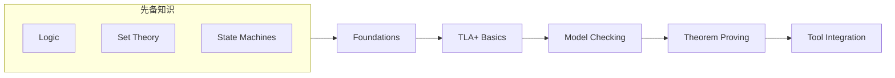

# Formal Methods Practice / 形式化方法实践

## Overview / 概述

This module provides practical guidance and examples for applying formal verification methods to project management. It bridges the gap between theoretical foundations and real-world application.

本模块提供了将形式化验证方法应用于项目管理的实践指导和示例。它弥合了理论基础与实际应用之间的差距。

## Contents / 内容

| Document | Description | 描述 |
|----------|-------------|------|
| [01-tla-plus-specifications.md](./01-tla-plus-specifications.md) | TLA+ for Project Management | TLA+项目管理规范 |
| [02-model-checking-examples.md](./02-model-checking-examples.md) | Model Checking Examples | 模型检验实例 |
| [03-theorem-proving-applications.md](./03-theorem-proving-applications.md) | Theorem Proving Applications | 定理证明应用 |
| [04-formal-verification-tools.md](./04-formal-verification-tools.md) | Formal Verification Tools | 形式化验证工具 |

## Authority Sources / 权威来源

### Primary References / 主要参考

| Source | Type | URL |
|--------|------|-----|
| Leslie Lamport | TLA+ Creator | https://lamport.azurewebsites.net/tla/tla.html |
| SPIN Project | Model Checker | https://spinroot.com |
| Apalache | Symbolic MC | https://apalache-mc.org |
| Alloy | Model Finder | https://alloytools.org |
| Z3 | SMT Solver | https://github.com/Z3Prover/z3 |
| Coq | Proof Assistant | https://coq.inria.fr |
| Lean | Proof Language | https://leanprover.github.io |

### Academic References / 学术参考

1. Clarke, E. M., Grumberg, O., & Peled, D. A. (2018). *Model Checking* (2nd ed.). MIT Press.
2. Baier, C., & Katoen, J. P. (2008). *Principles of Model Checking*. MIT Press.
3. Lamport, L. (2002). *Specifying Systems*. Addison-Wesley.
4. Jackson, D. (2012). *Software Abstractions* (2nd ed.). MIT Press.

## Learning Path / 学习路径

## Key Concepts / 关键概念

### 1. TLA+ (Temporal Logic of Actions)
- Formal specification language
- State machine modeling
- Temporal property verification

### 2. Model Checking
- Exhaustive state space exploration
- Safety and liveness verification
- Counterexample generation

### 3. Theorem Proving
- Mathematical proof construction
- Infinite state space handling
- Interactive and automated provers

### 4. SMT Solving
- Satisfiability checking
- Constraint optimization
- Automated reasoning

## Application Areas / 应用领域

| Area | Formal Method | Benefit |
|------|---------------|---------|
| Workflow Verification | TLA+, SPIN | Deadlock detection |
| Resource Optimization | Z3 | Optimal allocation |
| Risk Analysis | Model Checking | Complete coverage |
| Compliance | Alloy | Structure verification |
| Contract Verification | Coq, Lean | Mathematical proof |

## Relationship to Other Modules / 与其他模块关系

- **Prerequisites**: [01-foundations](../01-foundations/) - Mathematical foundations
- **Theory**: [03-formal-verification](../03-formal-verification/) - Verification theory
- **Applications**: [04-industry-applications](../04-industry-applications/) - Industry use cases

---

**Last Updated / 最后更新**: 2026-02-02
**Version / 版本**: 1.0
**Status / 状态**: ✅ Complete
