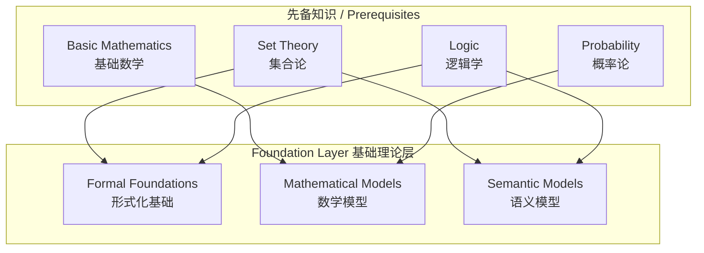
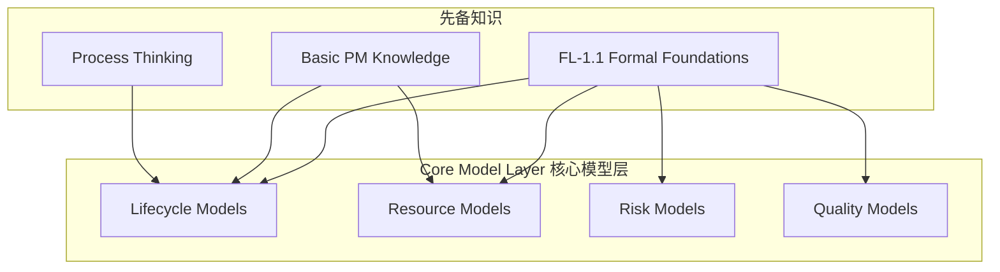
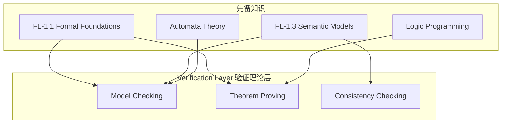
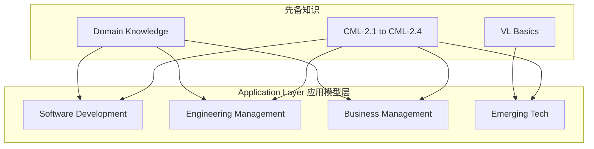
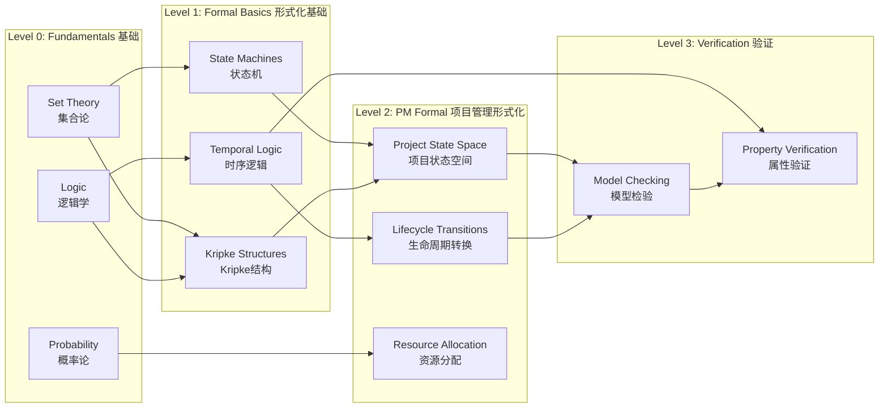
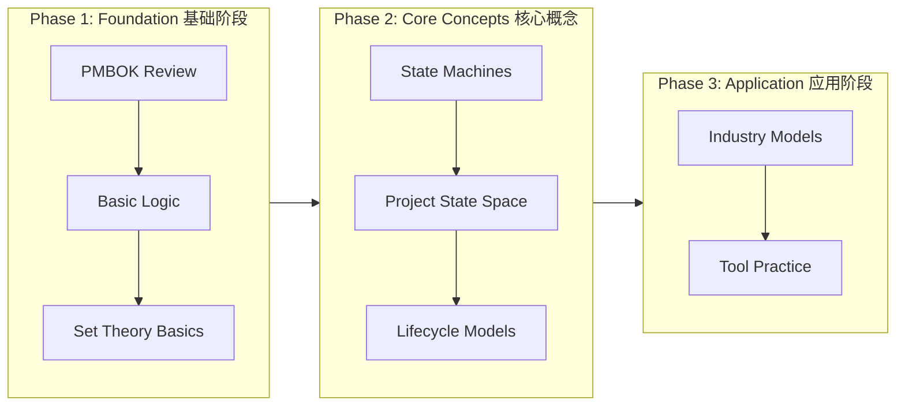
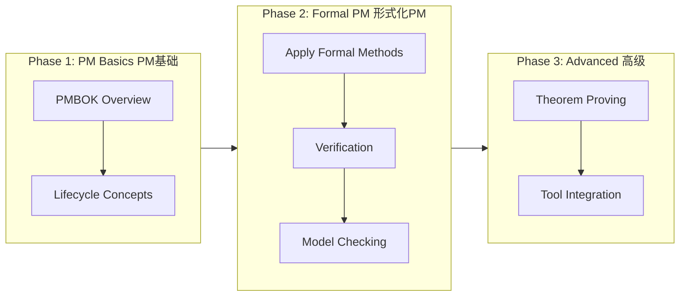
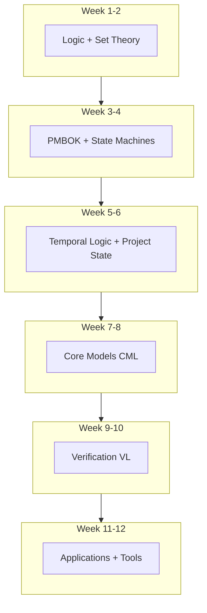

# Learning Prerequisites Map / 先备知识地图

## 1. Overview / 概述

### 1.1 Introduction / 简介

**English**: This document provides a comprehensive prerequisite knowledge map for the Formal-ProgramManage knowledge system. It defines the foundational knowledge required before studying each topic area, helping learners efficiently plan their learning path.

**中文**: 本文档为Formal-ProgramManage知识体系提供全面的先备知识地图。它定义了学习每个主题领域之前所需的基础知识，帮助学习者高效规划学习路径。

### 1.2 Theoretical Basis / 理论基础

Based on:

- **Bloom's Taxonomy** (Anderson & Krathwohl, 2001): Learning hierarchy
- **Zone of Proximal Development** (Vygotsky): Optimal learning challenge
- **Cognitive Load Theory** (Sweller): Working memory constraints
- **Prerequisite Learning** (Gagné): Learning sequences

---

## 2. Knowledge Layer Prerequisites / 知识层次先备知识

### 2.1 Foundation Layer (FL) Prerequisites / 基础理论层先备知识

| FL Topic / FL主题 | Prerequisites / 先备知识 | Difficulty / 难度 |
|-------------------|-------------------------|-------------------|
| FL-1.1 Formal Foundations | Set theory, Propositional logic, Predicate logic | High |
| FL-1.2 Mathematical Models | Linear algebra basics, Calculus, Probability | High |
| FL-1.3 Semantic Models | Formal languages, Automata theory | High |
| FL-1.4 Quantum Theory | Quantum mechanics basics, Linear algebra | Very High |
| FL-1.5 Bio-inspired Theory | Biology basics, Optimization theory | Medium |

### 2.2 Core Model Layer (CML) Prerequisites / 核心模型层先备知识

| CML Topic / CML主题 | Prerequisites / 先备知识 | Difficulty / 难度 |
|---------------------|-------------------------|-------------------|
| CML-2.1 Lifecycle Models | FL-1.1, PMBOK basics, State machines | Medium |
| CML-2.2 Resource Models | FL-1.2, Optimization basics | Medium |
| CML-2.3 Risk Models | FL-1.2, Probability, Statistics | Medium |
| CML-2.4 Quality Models | FL-1.1, Statistical process control | Medium |

### 2.3 Verification Layer (VL) Prerequisites / 验证理论层先备知识

| VL Topic / VL主题 | Prerequisites / 先备知识 | Difficulty / 难度 |
|-------------------|-------------------------|-------------------|
| VL-3.1 Model Checking | Temporal logic (LTL, CTL), Kripke structures | High |
| VL-3.2 Theorem Proving | Proof theory, Type theory | Very High |
| VL-3.3 Consistency | Model theory, First-order logic | High |

### 2.4 Application Layer (AL) Prerequisites / 应用模型层先备知识

| AL Topic / AL主题 | Prerequisites / 先备知识 | Difficulty / 难度 |
|-------------------|-------------------------|-------------------|
| AL-4.1 Software Development | CML, Agile/Scrum basics | Medium |
| AL-4.2 Engineering Management | CML, Systems engineering | Medium |
| AL-4.3 Business Management | CML, Business fundamentals | Medium |
| AL-4.4+ Emerging Tech | CML, VL, Domain expertise | High |

---

## 3. Concept-Level Prerequisites / 概念级先备知识

### 3.1 Core Concept Dependency Graph / 核心概念依赖图

### 3.2 Detailed Concept Prerequisites / 详细概念先备知识

| Concept / 概念 | Direct Prerequisites / 直接先备知识 | Indirect Prerequisites / 间接先备知识 |
|----------------|-----------------------------------|--------------------------------------|
| Kripke Structure | Set theory, Binary relations | Logic |
| LTL Formulas | Propositional logic, Path semantics | Set theory |
| CTL Formulas | Tree semantics, State branching | Logic, Set theory |
| MDP | Probability theory, State machines | Calculus |
| Resource Allocation | Optimization, Constraints | Linear algebra |
| Risk Matrix | Probability, Impact assessment | Statistics |
| Model Checking | Kripke structures, Temporal logic | All above |

---

## 4. Learning Path Recommendations / 学习路径推荐

### 4.1 Path A: For PM Practitioners / 路径A：项目管理从业者

**Duration / 时长**: 8-12 weeks

### 4.2 Path B: For Computer Scientists / 路径B：计算机科学背景

**Duration / 时长**: 6-10 weeks

### 4.3 Path C: Comprehensive / 路径C：综合学习

**Duration / 时长**: 12 weeks

---

## 5. Self-Assessment Checklist / 自我评估清单

### 5.1 Foundation Prerequisites / 基础先备知识

Check your readiness for Foundation Layer (FL):

- [ ] Can define and work with sets, subsets, unions, intersections
- [ ] Understand propositional logic (AND, OR, NOT, IMPLIES)
- [ ] Can write and evaluate predicate logic formulas
- [ ] Understand basic probability concepts (P(A), P(A|B), Bayes)
- [ ] Familiar with functions and relations
- [ ] Can read and understand basic mathematical notation

### 5.2 Core Model Prerequisites / 核心模型先备知识

Check your readiness for Core Model Layer (CML):

- [ ] Completed FL-1.1 (Formal Foundations)
- [ ] Understand project lifecycle phases (Initiation → Closing)
- [ ] Familiar with PMBOK or equivalent framework
- [ ] Can model systems as state machines
- [ ] Understand optimization concepts

### 5.3 Verification Prerequisites / 验证先备知识

Check your readiness for Verification Layer (VL):

- [ ] Understand Kripke structures
- [ ] Can write LTL/CTL formulas
- [ ] Familiar with proof techniques
- [ ] Have programming experience

---

## 6. Resources for Prerequisites / 先备知识资源

### 6.1 Mathematics / 数学

| Topic | Resource | Type |
|-------|----------|------|
| Set Theory | MIT OCW 18.510 | Course |
| Logic | Stanford Encyclopedia of Philosophy | Reference |
| Probability | Khan Academy Probability | Video |

### 6.2 Formal Methods / 形式化方法

| Topic | Resource | Type |
|-------|----------|------|
| Automata | Introduction to Automata (Hopcroft) | Textbook |
| Model Checking | Principles of Model Checking (Baier) | Textbook |
| TLA+ | TLA+ Video Course (Lamport) | Video |

### 6.3 Project Management / 项目管理

| Topic | Resource | Type |
|-------|----------|------|
| PMBOK | PMI PMBOK Guide 7th Edition | Standard |
| Agile | Agile Practice Guide (PMI) | Standard |
| Risk | ISO 31000:2018 | Standard |

---

## 7. Status / 状态

**Document Version / 文档版本**: 1.0
**Last Updated / 最后更新**: 2026-02-02
**Status / 状态**: ✅ Complete
**Next Review / 下次审查**: 2026-05-02

**Related Documents / 相关文档**:

- [Spaced Repetition Schedule](./02-spaced-repetition-schedule.md)
- [Retrieval Practice Questions](./03-retrieval-practice-questions.md)
- [Concept Difficulty Ranking](./04-concept-difficulty-ranking.md)
