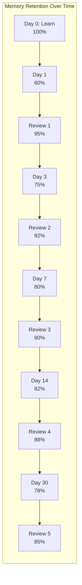
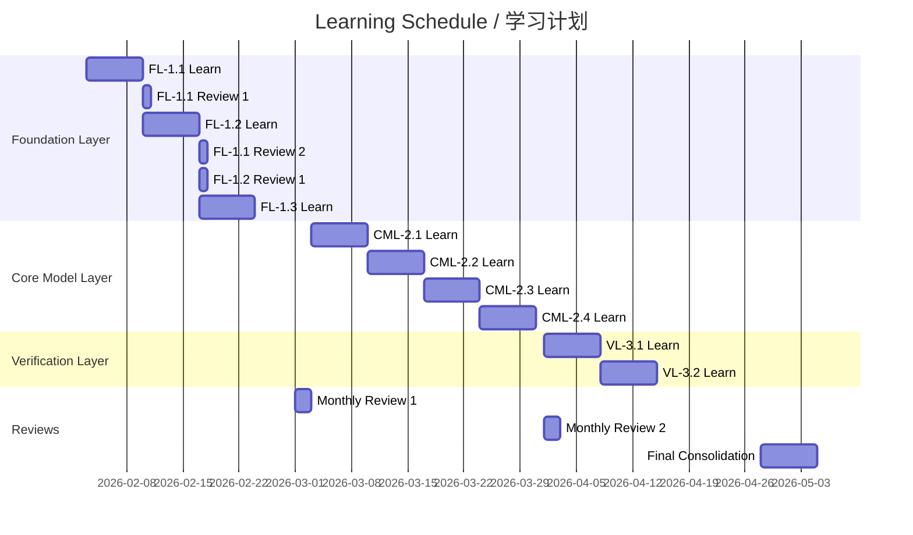

# Spaced Repetition Schedule / 间隔重复学习计划

## 1. Overview / 概述

### 1.1 Introduction / 简介

**English**: This document provides a scientifically-designed spaced repetition schedule for learning the Formal-ProgramManage knowledge system. Based on cognitive science research, it optimizes long-term retention through strategically timed review sessions.

**中文**: 本文档为学习Formal-ProgramManage知识体系提供基于科学设计的间隔重复学习计划。基于认知科学研究，通过战略性的定时复习来优化长期记忆保持。

### 1.2 Theoretical Basis / 理论基础

Based on:

- **Ebbinghaus Forgetting Curve** (1885): Memory decay over time
- **Spacing Effect** (Cepeda et al., 2006): Distributed practice superiority
- **Retrieval Practice** (Roediger & Karpicke, 2006): Testing enhances learning
- **Neural Consolidation** (Nature, 2025): Time-dependent memory stabilization

---

## 2. Core Principles / 核心原则

### 2.1 Optimal Spacing Intervals / 最佳间隔

Research-based review intervals:

| Review # | Interval | Retention Target |
|----------|----------|------------------|
| 1st | 1 day | 90% → 95% |
| 2nd | 3 days | 85% → 92% |
| 3rd | 7 days | 80% → 90% |
| 4th | 14 days | 75% → 88% |
| 5th | 30 days | 70% → 85% |
| 6th | 60 days | 65% → 82% |
| 7th | 120 days | 60% → 80% |

### 2.2 Forgetting Curve Visualization / 遗忘曲线可视化



---

## 3. Learning Schedules / 学习计划

### 3.1 Foundation Layer (FL) Schedule / 基础理论层计划

**Duration**: 4 weeks initial + 8 weeks consolidation

| Week | New Content | Review Content | Activities |
|------|-------------|----------------|------------|
| 1 | FL-1.1 Formal Foundations | - | Read, Notes, Examples |
| 2 | FL-1.2 Mathematical Models | FL-1.1 (Day 7) | Read, Problems |
| 3 | FL-1.3 Semantic Models | FL-1.1 (Day 14), FL-1.2 (Day 7) | Read, Diagrams |
| 4 | Consolidation | All FL (Day 21/14/7) | Practice, Self-test |
| 5-6 | - | FL-1.1 (Day 30), FL-1.2 (Day 21), FL-1.3 (Day 14) | Deep review |
| 7-8 | - | All FL (Day 60/45/30) | Application practice |
| 9-12 | - | Monthly reviews | Long-term consolidation |

### 3.2 Core Model Layer (CML) Schedule / 核心模型层计划

**Duration**: 4 weeks initial + 8 weeks consolidation

| Week | New Content | Review Content | Activities |
|------|-------------|----------------|------------|
| 1 | CML-2.1 Lifecycle Models | FL review | Read, Map lifecycle |
| 2 | CML-2.2 Resource Models | CML-2.1 (Day 7), FL | Read, Allocation practice |
| 3 | CML-2.3 Risk Models | CML-2.1 (Day 14), CML-2.2 (Day 7) | Read, Risk analysis |
| 4 | CML-2.4 Quality Models | CML-2.1-2.3 reviews | Read, Quality metrics |
| 5-8 | - | Systematic CML reviews | Case studies |

### 3.3 Complete 12-Week Schedule / 完整12周计划



---

## 4. Daily Study Protocol / 每日学习协议

### 4.1 New Material Protocol / 新材料学习协议

**Time**: 45-60 minutes per session

```
1. Preview (5 min)
   - Scan headings and structure
   - Activate prior knowledge

2. Active Reading (25 min)
   - Read with questions in mind
   - Take sparse notes
   - Mark unclear sections

3. Elaboration (10 min)
   - Explain concept in own words
   - Connect to prior knowledge
   - Create mental images

4. Initial Practice (10 min)
   - Work through examples
   - Attempt practice problems

5. Reflection (5 min)
   - Summarize key points
   - Note questions for review
```

### 4.2 Review Session Protocol / 复习协议

**Time**: 20-30 minutes per session

```
1. Retrieval Attempt (10 min)
   - Close materials
   - Try to recall main concepts
   - Write from memory

2. Check and Correct (5 min)
   - Compare with source
   - Identify gaps
   - Mark errors

3. Focused Re-study (10 min)
   - Study forgotten/incorrect items
   - Add new connections

4. Self-Test (5 min)
   - Answer practice questions
   - Assess confidence
```

---

## 5. Concept-Specific Schedules / 概念专项计划

### 5.1 High-Difficulty Concepts / 高难度概念

For concepts marked "High" or "Very High" difficulty:

| Concept | Initial Study | Review 1 | Review 2 | Review 3 | Review 4 | Review 5 |
|---------|---------------|----------|----------|----------|----------|----------|
| Kripke Structures | Day 0 | Day 1 | Day 3 | Day 7 | Day 14 | Day 30 |
| Temporal Logic LTL | Day 0 | Day 1 | Day 3 | Day 7 | Day 14 | Day 30 |
| Model Checking | Day 0 | Day 1 | Day 2 | Day 5 | Day 10 | Day 21 |
| Theorem Proving | Day 0 | Day 1 | Day 2 | Day 5 | Day 10 | Day 21 |

### 5.2 Medium-Difficulty Concepts / 中等难度概念

| Concept | Initial Study | Review 1 | Review 2 | Review 3 | Review 4 |
|---------|---------------|----------|----------|----------|----------|
| Lifecycle Models | Day 0 | Day 1 | Day 4 | Day 10 | Day 25 |
| Resource Models | Day 0 | Day 1 | Day 4 | Day 10 | Day 25 |
| Risk Models | Day 0 | Day 2 | Day 5 | Day 12 | Day 30 |
| Quality Models | Day 0 | Day 2 | Day 5 | Day 12 | Day 30 |

---

## 6. Weekly Planning Template / 每周计划模板

### 6.1 Week Template / 周模板

| Day | Morning (30 min) | Evening (30 min) |
|-----|------------------|------------------|
| Monday | New Concept A | Review Previous Week |
| Tuesday | New Concept A Practice | New Concept A Review 1 |
| Wednesday | New Concept B | New Concept A Review 2 |
| Thursday | New Concept B Practice | Mixed Review |
| Friday | Consolidation | Self-Test |
| Saturday | Deep Practice | - |
| Sunday | Rest | Light Review |

### 6.2 Monthly Review Checklist / 月度复习清单

- [ ] All FL concepts reviewed at least once
- [ ] All CML concepts reviewed at least once
- [ ] VL concepts reviewed (if started)
- [ ] Practice problems completed
- [ ] Self-assessment quiz taken
- [ ] Gaps identified and addressed

---

## 7. Tracking Tools / 跟踪工具

### 7.1 Review Log Template / 复习日志模板

```markdown
## Review Log - [Concept Name]

### Session 1: [Date]
- **Retention Rate**: ____%
- **Confident Areas**:
- **Weak Areas**:
- **Next Review**: [Date]

### Session 2: [Date]
- **Retention Rate**: ____%
- **Improvement**:
- **Still Weak**:
- **Next Review**: [Date]
```

### 7.2 Spaced Repetition Tracker / 间隔重复跟踪表

| Concept | Learned | R1 | R2 | R3 | R4 | R5 | Status |
|---------|---------|-----|-----|-----|-----|-----|--------|
| FL-1.1 | ☐ | ☐ | ☐ | ☐ | ☐ | ☐ | - |
| FL-1.2 | ☐ | ☐ | ☐ | ☐ | ☐ | ☐ | - |
| FL-1.3 | ☐ | ☐ | ☐ | ☐ | ☐ | ☐ | - |
| CML-2.1 | ☐ | ☐ | ☐ | ☐ | ☐ | ☐ | - |
| CML-2.2 | ☐ | ☐ | ☐ | ☐ | ☐ | ☐ | - |
| CML-2.3 | ☐ | ☐ | ☐ | ☐ | ☐ | ☐ | - |
| CML-2.4 | ☐ | ☐ | ☐ | ☐ | ☐ | ☐ | - |
| VL-3.1 | ☐ | ☐ | ☐ | ☐ | ☐ | ☐ | - |

---

## 8. Adaptive Strategies / 自适应策略

### 8.1 If Retention is Low (< 70%) / 如果保持率低

1. **Shorten Intervals**: Review more frequently
2. **Elaborate More**: Add more connections
3. **Use Multiple Modalities**: Add diagrams, examples
4. **Break Down Further**: Smaller chunks

### 8.2 If Retention is High (> 90%) / 如果保持率高

1. **Lengthen Intervals**: Review less frequently
2. **Increase Difficulty**: Harder problems
3. **Add Connections**: Link to new concepts
4. **Teach Others**: Explain concepts

---

## 9. References / 参考文献

### 9.1 Primary Sources / 主要来源

1. Ebbinghaus, H. (1885). *Memory: A Contribution to Experimental Psychology*.
2. Cepeda, N. J., et al. (2006). "Distributed practice in verbal recall tasks". *Psychological Bulletin*.
3. Roediger, H. L., & Karpicke, J. D. (2006). "The Power of Testing Memory". *Perspectives on Psychological Science*.
4. Nature (2025). "Time-dependent consolidation mechanisms of durable memory in spaced learning".

---

## 10. Status / 状态

**Document Version / 文档版本**: 1.0
**Last Updated / 最后更新**: 2026-02-02
**Status / 状态**: ✅ Complete
**Next Review / 下次审查**: 2026-05-02

**Related Documents / 相关文档**:

- [Learning Prerequisites](./01-learning-prerequisites.md)
- [Retrieval Practice Questions](./03-retrieval-practice-questions.md)
- [Interleaved Learning Paths](./05-interleaved-learning-paths.md)
