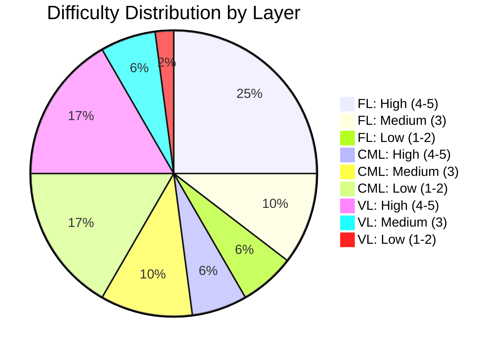
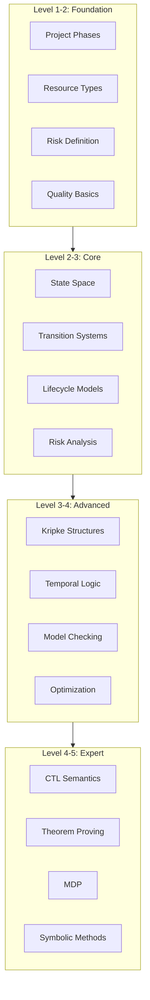

# Concept Difficulty Ranking / 概念难度分级

## 1. Overview / 概述

### 1.1 Introduction / 简介

**English**: This document provides a systematic difficulty ranking of all concepts in the Formal-ProgramManage knowledge system. Rankings are based on cognitive complexity, prerequisite depth, and abstraction level.

**中文**: 本文档为Formal-ProgramManage知识体系中的所有概念提供系统的难度分级。分级基于认知复杂度、先备知识深度和抽象程度。

### 1.2 Difficulty Scale / 难度等级

| Level | Name | Description | Study Time | Prerequisites |
|-------|------|-------------|------------|---------------|
| 1 | Beginner | Basic concepts, concrete | 1-2 hours | None/Minimal |
| 2 | Easy | Simple formal concepts | 2-4 hours | Level 1 |
| 3 | Medium | Moderate complexity | 4-8 hours | Level 1-2 |
| 4 | Hard | High abstraction | 8-16 hours | Level 1-3 |
| 5 | Expert | Very high complexity | 16+ hours | All levels |

---

## 2. Foundation Layer (FL) Difficulty Ranking / 基础理论层难度分级

### 2.1 FL-1.1 Formal Foundations / 形式化基础

| Concept | Difficulty | Justification |
|---------|------------|---------------|
| Project Definition | 2 | Basic formal representation |
| State Space | 3 | Requires set theory understanding |
| Transition Systems | 3 | Abstract but visualizable |
| Kripke Structures | 4 | High abstraction, multiple components |
| LTL Temporal Logic | 4 | Modal logic, path semantics |
| CTL Temporal Logic | 5 | Branching semantics, complex operators |
| Model-Theoretic Semantics | 5 | Deep mathematical foundations |

### 2.2 FL-1.2 Mathematical Models / 数学模型

| Concept | Difficulty | Justification |
|---------|------------|---------------|
| Set Theory Basics | 2 | Foundation, relatively intuitive |
| Graph Theory | 3 | Visual, moderate complexity |
| Probability Basics | 3 | Concrete applications |
| Markov Chains | 4 | Stochastic processes |
| MDP | 5 | Combines probability, optimization |
| Value Functions | 5 | Recursive definitions, convergence |

### 2.3 FL-1.3 Semantic Models / 语义模型

| Concept | Difficulty | Justification |
|---------|------------|---------------|
| Syntax vs Semantics | 2 | Conceptual distinction |
| Operational Semantics | 4 | Execution-based interpretation |
| Denotational Semantics | 5 | Mathematical function theory |
| Axiomatic Semantics | 5 | Proof-based reasoning |

### 2.4 FL-1.4+ Advanced Theories / 高级理论

| Concept | Difficulty | Justification |
|---------|------------|---------------|
| Quantum PM Theory | 5 | Requires quantum mechanics |
| Bio-inspired PM | 3 | Intuitive analogies |
| Holographic PM | 4 | Abstract information theory |
| Interstellar PM | 3 | Conceptual extension |

---

## 3. Core Model Layer (CML) Difficulty Ranking / 核心模型层难度分级

### 3.1 CML-2.1 Lifecycle Models / 生命周期模型

| Concept | Difficulty | Justification |
|---------|------------|---------------|
| Project Phases | 1 | Concrete, experiential |
| PMBOK Process Groups | 2 | Standard framework |
| Phase Transitions | 2 | State machine concept |
| Formal Lifecycle Model | 3 | Mathematical representation |
| Lifecycle Optimization | 4 | Optimization theory needed |

### 3.2 CML-2.2 Resource Models / 资源管理模型

| Concept | Difficulty | Justification |
|---------|------------|---------------|
| Resource Types | 1 | Concrete categorization |
| Resource Allocation | 2 | Basic assignment |
| Resource Constraints | 3 | Constraint satisfaction |
| Scheduling Algorithms | 4 | Combinatorial optimization |
| Multi-project Resources | 4 | Complex interactions |

### 3.3 CML-2.3 Risk Models / 风险管理模型

| Concept | Difficulty | Justification |
|---------|------------|---------------|
| Risk Definition | 1 | Intuitive concept |
| Risk Identification | 2 | Systematic process |
| Qualitative Analysis | 2 | Categorical assessment |
| Quantitative Analysis | 3 | Statistical methods |
| Monte Carlo Simulation | 4 | Simulation techniques |
| Decision Trees | 3 | Visual decision-making |

### 3.4 CML-2.4 Quality Models / 质量管理模型

| Concept | Difficulty | Justification |
|---------|------------|---------------|
| Quality Definition | 1 | Basic understanding |
| QA vs QC | 2 | Conceptual distinction |
| Quality Metrics | 2 | Measurable attributes |
| SPC (Statistical Process Control) | 3 | Statistical methods |
| Six Sigma | 4 | Advanced methodology |

---

## 4. Verification Layer (VL) Difficulty Ranking / 验证理论层难度分级

### 4.1 VL-3.1 Model Checking / 模型检验

| Concept | Difficulty | Justification |
|---------|------------|---------------|
| Model Checking Problem | 3 | Core concept definition |
| State Space Exploration | 3 | Algorithm understanding |
| LTL Model Checking | 4 | Automata theory needed |
| CTL Model Checking | 4 | Fixed-point computation |
| Symbolic Model Checking | 5 | BDD representation |
| Bounded Model Checking | 4 | SAT-based approach |

### 4.2 VL-3.2 Theorem Proving / 定理证明

| Concept | Difficulty | Justification |
|---------|------------|---------------|
| Proof Basics | 3 | Logical reasoning |
| Natural Deduction | 3 | Proof rules |
| Proof by Induction | 4 | Mathematical induction |
| Interactive Provers | 4 | Tool-based proving |
| Type Theory | 5 | Advanced foundations |
| Dependent Types | 5 | Very advanced |

### 4.3 VL-3.3 Consistency / 一致性

| Concept | Difficulty | Justification |
|---------|------------|---------------|
| Consistency Definition | 2 | Basic logical concept |
| Model Consistency | 3 | Cross-model checking |
| Soundness | 4 | Proof-theoretic property |
| Completeness | 4 | Semantic property |

---

## 5. Application Layer (AL) Difficulty Ranking / 应用模型层难度分级

### 5.1 Software Development / 软件开发

| Concept | Difficulty | Justification |
|---------|------------|---------------|
| Agile Basics | 2 | Widely known |
| Scrum Framework | 2 | Structured process |
| DevOps | 3 | Tool integration |
| Formal Agile | 4 | Combining formal + agile |

### 5.2 Emerging Technologies / 新兴技术

| Concept | Difficulty | Justification |
|---------|------------|---------------|
| AI PM | 3 | Domain-specific |
| Blockchain PM | 3 | Technology understanding |
| Quantum PM | 5 | Quantum computing |
| IoT PM | 3 | Technical integration |

---

## 6. Difficulty Distribution Visualization / 难度分布可视化

### 6.1 By Layer / 按层次分布

### 6.2 Learning Sequence / 学习顺序

---

## 7. Study Time Estimates / 学习时间估计

### 7.1 By Difficulty Level / 按难度等级

| Difficulty | Concepts Count | Study Time Each | Total Time |
|------------|----------------|-----------------|------------|
| Level 1 | ~8 | 1-2 hours | 8-16 hours |
| Level 2 | ~12 | 2-4 hours | 24-48 hours |
| Level 3 | ~15 | 4-8 hours | 60-120 hours |
| Level 4 | ~12 | 8-16 hours | 96-192 hours |
| Level 5 | ~8 | 16+ hours | 128+ hours |

### 7.2 Complete Study Estimate / 完整学习估计

**Minimum**: ~316 hours (focused study)
**Average**: ~500 hours (normal pace)
**Comprehensive**: ~700+ hours (deep understanding)

---

## 8. Adaptive Learning Recommendations / 自适应学习建议

### 8.1 If Struggling with Level N / 如果难以掌握N级

1. Review Level N-1 prerequisites
2. Increase practice time
3. Seek additional explanations
4. Use more visual aids
5. Break into smaller chunks

### 8.2 If Mastering Level N Quickly / 如果快速掌握N级

1. Proceed to Level N+1
2. Try harder practice problems
3. Attempt teaching others
4. Explore edge cases

---

## 9. Status / 状态

**Document Version / 文档版本**: 1.0
**Last Updated / 最后更新**: 2026-02-02
**Status / 状态**: ✅ Complete
**Total Concepts Ranked / 总分级概念数**: 55+
**Next Review / 下次审查**: 2026-05-02

**Related Documents / 相关文档**:

- [Learning Prerequisites](./01-learning-prerequisites.md)
- [Spaced Repetition Schedule](./02-spaced-repetition-schedule.md)
- [Interleaved Learning Paths](./05-interleaved-learning-paths.md)
