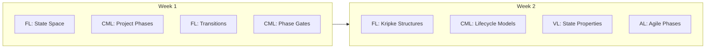
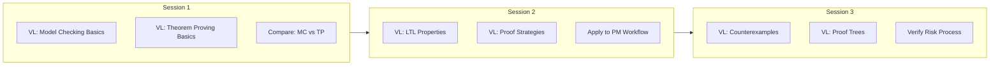
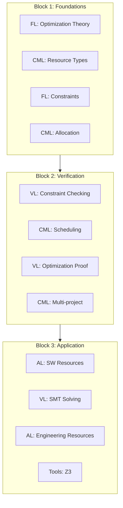

# Interleaved Learning Paths / 交错学习路径

## 1. Overview / 概述

### 1.1 Introduction / 简介

**English**: This document provides interleaved learning paths that mix related concepts from different layers and topics. Research shows interleaving improves long-term retention and transfer by requiring learners to discriminate between concepts.

**中文**: 本文档提供将不同层次和主题的相关概念混合的交错学习路径。研究表明，交错学习通过要求学习者区分概念来提高长期保持和迁移。

### 1.2 Theoretical Basis / 理论基础

Based on:

- **Interleaving Effect** (Rohrer & Taylor, 2007): Mixed practice beats blocked practice
- **Discriminative Contrast** (Kang & Pashler, 2012): Comparison aids learning — interleaving works by requiring discrimination between concepts, not by rest periods (unlike spacing).
- **Desirable Difficulties** (Bjork, 1994): Productive struggle enhances retention

**Spacing vs Interleaving**: This document covers **interleaving** — mixing different topics *within* a session to improve discrimination (e.g. LTL vs CTL). **Spaced repetition** is reviewing the *same* topic at *different* times; see [02-spaced-repetition-schedule.md](./02-spaced-repetition-schedule.md). Use both: space reviews over time and interleave related concepts within study sessions.

---

## 2. Interleaving Principles / 交错原则

### 2.1 What to Interleave / 交错什么

| Interleave | Don't Interleave |
|------------|------------------|
| Related concepts | Completely unrelated topics |
| Similar problem types | Basic vs advanced (initially) |
| Cross-layer connections | Prerequisites not yet learned |
| Theory and application | Content requiring sequence |

### 2.2 Interleaving Ratio / 交错比例

Recommended: 3-4 related concepts per session

```
Session Pattern:
[Concept A1] → [Concept B1] → [Concept C1] → [Concept A2] → [Concept B2] → ...
```

---

## 3. Interleaved Paths / 交错路径

### 3.1 Path 1: State & Lifecycle Integration / 状态与生命周期整合

**Themes**: Formal states + PM lifecycle phases



**Daily Schedule**:

| Day | Morning | Afternoon |
|-----|---------|-----------|
| Mon | FL: State Space | CML: Project Phases |
| Tue | CML: Phase Gates | FL: Transitions |
| Wed | FL: Kripke | CML: Lifecycle |
| Thu | CML: PMBOK Groups | FL: State Properties |
| Fri | Mixed Practice | Integration Exercise |

### 3.2 Path 2: Verification Integration / 验证整合路径

**Themes**: Model checking + Theorem proving + Application



### 3.3 Path 3: Multi-Layer Risk / 多层次风险路径

**Themes**: Risk across all layers

| Session | FL Concept | CML Concept | VL Concept | AL Concept |
|---------|------------|-------------|------------|------------|
| 1 | Probability | Risk Definition | Safety Properties | SW Risk |
| 2 | Uncertainty | Risk Analysis | Verification | AI Risk |
| 3 | Stochastic Models | Risk Response | Model Checking | Blockchain Risk |
| 4 | Integration | Risk Monitoring | Property Check | Combined |

### 3.4 Path 4: Resource Optimization / 资源优化路径

**Themes**: Resource management across perspectives



---

## 4. Concept Interleaving Sets / 概念交错集

### 4.1 Set A: Temporal Concepts / 时序概念集

Interleave these concepts within sessions:

| Concept 1 | Concept 2 | Concept 3 | Connection |
|-----------|-----------|-----------|------------|
| LTL | CTL | PMBOK Timeline | Temporal reasoning |
| Safety | Liveness | Project Success | Property types |
| Next (○) | Eventually (◇) | Milestone | Future states |

### 4.2 Set B: State Concepts / 状态概念集

| Concept 1 | Concept 2 | Concept 3 | Connection |
|-----------|-----------|-----------|------------|
| Kripke State | Project Phase | Resource Status | System state |
| Transition | Phase Gate | State Change | Changes |
| Initial State | Project Initiation | Baseline | Starting point |

### 4.3 Set C: Verification Concepts / 验证概念集

| Concept 1 | Concept 2 | Concept 3 | Connection |
|-----------|-----------|-----------|------------|
| Model Checking | QA Audit | Code Review | Finding issues |
| Counterexample | Risk Event | Bug Report | Failure evidence |
| Theorem | Quality Standard | Requirement | Must-hold property |

**易混概念显式交错（推荐）**：

- **模型检验 vs 定理证明 (Model Checking vs Theorem Proving)**：模型检验适用于有限状态、自动穷举、输出反例；定理证明可处理无限状态、常需交互、输出证明。在 [03-retrieval-practice-questions.md](./03-retrieval-practice-questions.md) §4.2 有比较题；混合练习见 §5.2 Mixed Problem Set 2 Q1。
- **LTL vs CTL**：见 Set A（时序概念集）；Path 2 验证整合路径。

### 4.4 Set D: Risk Analysis Concepts / 风险分析概念集

| Concept 1 | Concept 2 | Concept 3 | Connection |
|-----------|-----------|-----------|------------|
| 风险定性分析 | 风险定量分析 | 风险暴露 | 识别→评估→量化 |
| Qualitative Risk | Quantitative Risk | Monte Carlo | 概率与影响 |
| 风险登记册 | 概率–影响矩阵 | 应对策略 | CML 风险管理 |

**易混概念显式交错（推荐）**：

- **风险定性 vs 定量 (Qualitative vs Quantitative Risk Analysis)**：定性用概率–影响矩阵、等级排序；定量用数值概率、EMV、蒙特卡洛。两者互补，先定性筛选再定量对关键风险。对应 [risk-models.md](../02-project-management/risk-models.md)；混合练习见 [03-retrieval-practice-questions.md](./03-retrieval-practice-questions.md) §3.3。

---

## 5. Interleaved Practice Problems / 交错练习题

### 5.1 Mixed Problem Set 1 / 混合问题集1

Solve in order (don't reorder by topic):

1. **(CML)** List the five PMBOK process groups.
2. **(FL)** Define a Kripke structure.
3. **(VL)** Write LTL for "task eventually completes".
4. **(CML)** What's the difference between QA and QC?
5. **(FL)** What is an MDP?
6. **(VL)** What does a counterexample show?
7. **(AL)** Name three Scrum ceremonies.
8. **(FL)** Define a state transition.

### 5.2 Mixed Problem Set 2 / 混合问题集2

1. **(VL)** When would you use model checking vs theorem proving?
2. **(CML)** Calculate risk exposure: P=0.4, Impact=$50K
3. **(FL)** Draw state machine for 3-phase project
4. **(AL)** How does DevOps differ from traditional?
5. **(CML)** What is earned value (EV)?
6. **(VL)** Write CTL for "always can reach completion"
7. **(FL)** Explain safety vs liveness
8. **(CML)** What are resource constraints?

---

## 6. Interleaved Study Sessions / 交错学习会话

### 6.1 60-Minute Interleaved Session / 60分钟交错会话

```
0-10 min: Review Concept A (FL topic)
10-20 min: Review Concept B (CML topic)
20-30 min: Compare A and B, find connections
30-40 min: Practice Problem Set (mixed)
40-50 min: New Concept C (VL topic)
50-60 min: Connect C to A and B
```

### 6.2 Weekly Interleaved Schedule / 每周交错计划

| Day | Topic 1 (30min) | Topic 2 (30min) | Integration (15min) |
|-----|-----------------|-----------------|---------------------|
| Mon | FL: State | CML: Lifecycle | Connection mapping |
| Tue | CML: Risk | VL: Safety | Property writing |
| Wed | VL: MC | FL: Logic | Tool practice |
| Thu | AL: Agile | CML: Quality | Case study |
| Fri | Mixed review | Mixed problems | Synthesis |

---

## 7. Comparative Learning Exercises / 比较学习练习

### 7.1 Comparison Matrix Template / 比较矩阵模板

Complete this matrix by comparing concepts:

| Aspect | Concept A | Concept B | Concept C |
|--------|-----------|-----------|-----------|
| Definition | | | |
| Purpose | | | |
| Example | | | |
| Relation to PM | | | |
| Difficulty | | | |

### 7.2 Sample Comparison: Verification Methods

| Aspect | Model Checking | Theorem Proving | Testing |
|--------|----------------|-----------------|---------|
| Completeness | Complete (finite) | Complete | Incomplete |
| Automation | Automatic | Semi-automatic | Automatic |
| State Space | Finite | Infinite | Sampled |
| Output | Counterexample | Proof | Pass/Fail |
| Effort | Low-Medium | High | Low |

---

## 8. Interleaving Best Practices / 交错最佳实践

### 8.1 Do's / 该做的

- Mix related concepts within sessions
- Include comparison/contrast activities
- Practice mixed problem sets
- Connect theory to application
- Review in interleaved order

### 8.2 Don'ts / 不该做的

- Don't mix unrelated topics
- Don't skip prerequisites
- Don't interleave too many at once (max 4)
- Don't abandon struggling—interleaving is harder!
- Don't expect immediate high performance

### 8.3 Handling Difficulty / 处理困难

When interleaving feels hard:

1. **Normal**: It's supposed to be harder—this is desirable
2. **Persist**: Short-term difficulty = long-term gain
3. **Adapt**: If too hard, reduce to 2 concepts
4. **Review**: Ensure prerequisites are solid

---

## 9. Progress Tracking / 进度跟踪

### 9.1 Interleaving Log Template / 交错日志模板

```markdown
## Interleaving Session Log

**Date**: ____
**Duration**: ____

### Concepts Interleaved:
1. ____
2. ____
3. ____

### Connections Discovered:
- ____
- ____

### Difficulty Level (1-5): ____

### Key Insights:
- ____

### Questions for Next Session:
- ____
```

---

## 10. Status / 状态

**Document Version / 文档版本**: 1.0
**Last Updated / 最后更新**: 2026-02-02
**Status / 状态**: ✅ Complete
**Next Review / 下次审查**: 2026-05-02

**Related Documents / 相关文档**:

- [Learning Prerequisites](./01-learning-prerequisites.md)
- [Spaced Repetition Schedule](./02-spaced-repetition-schedule.md)
- [Retrieval Practice Questions](./03-retrieval-practice-questions.md)
- [Concept Difficulty Ranking](./04-concept-difficulty-ranking.md)
