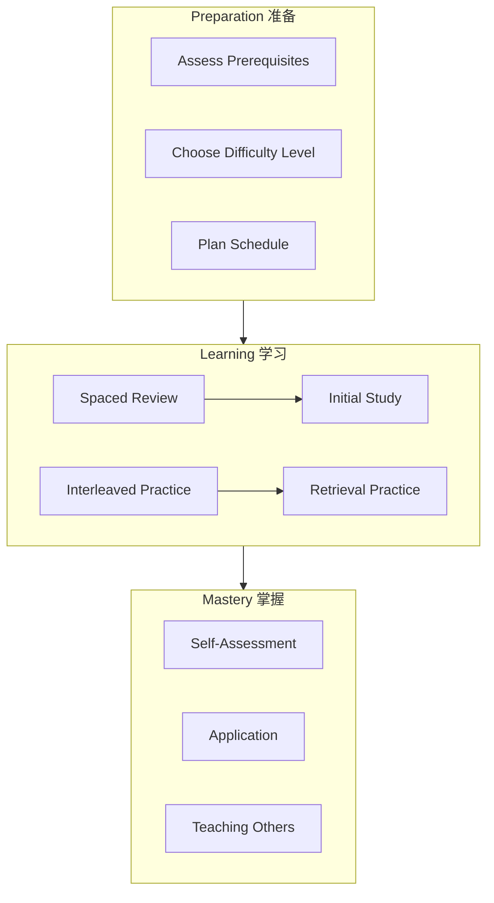

# Learning Support Module / 认知学习支持模块

## Overview / 概述

This module provides evidence-based learning support materials for the Formal-ProgramManage knowledge system. All content is grounded in cognitive science research on effective learning.

本模块为Formal-ProgramManage知识体系提供基于证据的学习支持材料。所有内容都基于有效学习的认知科学研究。

## Contents / 内容

| Document | Description | 描述 |
|----------|-------------|------|
| [01-learning-prerequisites.md](./01-learning-prerequisites.md) | Prerequisite knowledge map | 先备知识地图 |
| [02-spaced-repetition-schedule.md](./02-spaced-repetition-schedule.md) | Spaced repetition learning plan | 间隔重复学习计划 |
| [03-retrieval-practice-questions.md](./03-retrieval-practice-questions.md) | Retrieval practice question bank | 检索练习问题库 |
| [04-concept-difficulty-ranking.md](./04-concept-difficulty-ranking.md) | Concept difficulty rankings | 概念难度分级 |
| [05-interleaved-learning-paths.md](./05-interleaved-learning-paths.md) | Interleaved learning paths | 交错学习路径 |

## Theoretical Foundations / 理论基础

### Cognitive Science Principles / 认知科学原则

| Principle | Description | Application |
|-----------|-------------|-------------|
| **Spaced Repetition** | Distributed practice enhances retention | Review schedules |
| **Retrieval Practice** | Testing improves memory | Question banks |
| **Interleaving** | Mixed practice aids discrimination | Learning paths |
| **Elaboration** | Deep processing aids understanding | Explanations |
| **Dual Coding** | Text + visuals enhance learning | Diagrams |

### Key Research / 关键研究

1. Ebbinghaus (1885): Forgetting curve and spacing effect
2. Roediger & Karpicke (2006): Testing effect
3. Dunlosky et al. (2013): Effective learning strategies meta-analysis
4. Bjork (1994): Desirable difficulties
5. Nature (2025): Neural consolidation in spaced learning

## Learning Path Overview / 学习路径概述

## Quick Start Guide / 快速开始指南

### Step 1: Assess Your Level / 评估你的水平

1. Review [Learning Prerequisites](./01-learning-prerequisites.md)
2. Complete self-assessment checklist
3. Identify gaps to address

### Step 2: Create Your Schedule / 创建你的计划

1. Use [Spaced Repetition Schedule](./02-spaced-repetition-schedule.md)
2. Set realistic daily study time
3. Plan review sessions

### Step 3: Active Learning / 主动学习

1. Study new material with elaboration
2. Practice with [Retrieval Questions](./03-retrieval-practice-questions.md)
3. Follow [Interleaved Paths](./05-interleaved-learning-paths.md)

### Step 4: Monitor Progress / 监控进度

1. Track mastery using logs
2. Adjust based on [Difficulty Rankings](./04-concept-difficulty-ranking.md)
3. Celebrate milestones

## Recommended Study Schedule / 推荐学习时间表

| Session Type | Duration | Frequency |
|--------------|----------|-----------|
| New Material | 45-60 min | Daily |
| Retrieval Practice | 20-30 min | Daily |
| Spaced Review | 30-45 min | Every 2-3 days |
| Interleaved Practice | 60 min | Weekly |
| Self-Assessment | 30 min | Weekly |

## Integration with Main Content / 与主内容整合

This module supports learning across all knowledge layers:

- **FL (Foundations)**: Prerequisite paths, difficulty rankings
- **CML (Core Models)**: Practice questions, review schedules
- **VL (Verification)**: Advanced practice, interleaved paths
- **AL (Applications)**: Application exercises, case studies

---

**Last Updated / 最后更新**: 2026-02-02
**Version / 版本**: 1.0
**Status / 状态**: ✅ Complete
