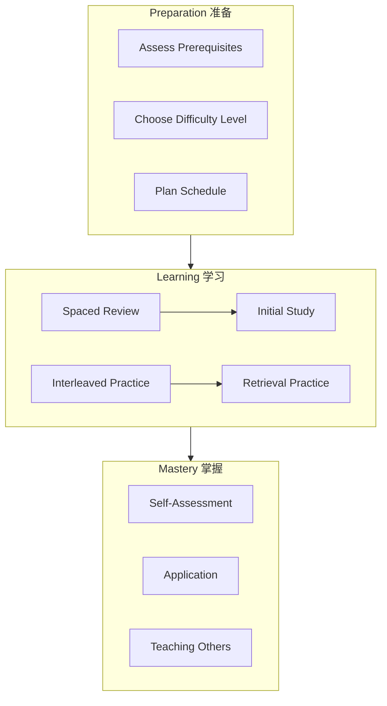

# Learning Support Module / 认知学习支持模块

## Overview / 概述

This module provides evidence-based learning support materials for the Formal-ProgramManage knowledge system. All content is grounded in cognitive science research on effective learning.

本模块为Formal-ProgramManage知识体系提供基于证据的学习支持材料。所有内容都基于有效学习的认知科学研究。

## Contents / 内容

| Document | Description | 描述 |
|----------|-------------|------|
| [01-learning-prerequisites.md](./01-learning-prerequisites.md) | Prerequisite knowledge map | 先备知识地图 |
| [02-spaced-repetition-schedule.md](./02-spaced-repetition-schedule.md) | Spaced repetition learning plan | 间隔重复学习计划 |
| [03-retrieval-practice-questions.md](./03-retrieval-practice-questions.md) | Retrieval practice question bank | 检索练习问题库 |
| [04-concept-difficulty-ranking.md](./04-concept-difficulty-ranking.md) | Concept difficulty rankings | 概念难度分级 |
| [05-interleaved-learning-paths.md](./05-interleaved-learning-paths.md) | Interleaved learning paths | 交错学习路径 |

## Theoretical Foundations / 理论基础

### Cognitive Science Principles / 认知科学原则

| Principle | Description | Application |
|-----------|-------------|-------------|
| **Spaced Repetition** | Distributed practice enhances retention | Review schedules |
| **Retrieval Practice** | Testing improves memory | Question banks |
| **Interleaving** | Mixed practice aids discrimination | Learning paths |
| **Elaboration** | Deep processing aids understanding | Explanations |
| **Dual Coding** | Text + visuals enhance learning | Diagrams |

### Key Research / 关键研究

本模块设计所依据的权威研究（便于读者溯源与学术严谨性）：

1. **Ebbinghaus (1885)**：遗忘曲线与间隔效应。
2. **Roediger, H. L., & Karpicke, J. D. (2006). Test-enhanced learning: Taking memory tests improves long-term retention. *Psychological Science*, 17(3), 249–255.** — 测试效应：检索练习比重复阅读更促进长期保持。DOI 与全文见各大学图书馆或 [Psychological Science](https://journals.sagepub.com/doi/10.1111/j.1467-9280.2006.01693.x)。
3. **Dunlosky, J., Rawson, K. A., Marsh, E. J., Nathan, M. J., & Willingham, D. T. (2013). Improving students' learning with effective learning techniques: Promising directions from cognitive and educational psychology. *Psychological Science in the Public Interest*, 14(1), 4–58.** — 10 种学习技术的元分析；**practice testing** 与 **distributed practice (spacing)** 获最高效用评级。DOI 与全文见 [PSPI](https://journals.sagepub.com/doi/10.1177/1529100612453266) 或 JSTOR。
4. **Bjork (1994)**：Desirable difficulties — 适度难度促进长期保持（间隔、检索、交错等）。
5. **Rohrer & Taylor (2007)**、**Kang & Pashler (2012)**：交错学习与区分对比。见 [05-interleaved-learning-paths.md](./05-interleaved-learning-paths.md) 理论基础。
6. **Nature / 认知神经科学**：间隔学习与记忆巩固；可结合各年度综述检索。

### Spacing vs Interleaving / 间隔与交错的区分

| Aspect | Spaced Repetition (间隔重复) | Interleaving (交错学习) |
|--------|------------------------------|---------------------------|
| **Definition** | Same topic reviewed with rest periods in between | Different topics mixed within a session |
| **Mechanism** | Cognitive load / working-memory recovery during rest (Cepeda et al.; spacing effect) | Discriminative contrast — helps distinguish similar concepts (Rohrer & Taylor) |
| **When to use** | Consolidate a single concept over time | When learning similar concepts (e.g. LTL vs CTL; lifecycle models) |
| **In this project** | [02-spaced-repetition-schedule.md](./02-spaced-repetition-schedule.md) — review intervals by concept | [05-interleaved-learning-paths.md](./05-interleaved-learning-paths.md) — mixed practice paths |

### Desirable Difficulties / 期望难度

Bjork (1994): Desirable difficulties — challenges that slow apparent learning but improve long-term retention (e.g. spacing, retrieval practice, interleaving). The [Concept Difficulty Ranking](./04-concept-difficulty-ranking.md) and [Spaced Repetition Schedule](./02-spaced-repetition-schedule.md) (including the difficulty–interval mapping) are designed to create *optimal* difficulty: enough to consolidate, not so much as to overload (Cognitive Load Theory).

## Learning Path Overview / 学习路径概述

## Quick Start Guide / 快速开始指南

### Step 1: Assess Your Level / 评估你的水平

1. Review [Learning Prerequisites](./01-learning-prerequisites.md)
2. Complete self-assessment checklist
3. Identify gaps to address

### Step 2: Create Your Schedule / 创建你的计划

1. Use [Spaced Repetition Schedule](./02-spaced-repetition-schedule.md)
2. Set realistic daily study time
3. Plan review sessions

### Step 3: Active Learning / 主动学习

1. Study new material with elaboration
2. Practice with [Retrieval Questions](./03-retrieval-practice-questions.md)
3. Follow [Interleaved Paths](./05-interleaved-learning-paths.md)

### Step 4: Monitor Progress / 监控进度

1. Track mastery using logs
2. Adjust based on [Difficulty Rankings](./04-concept-difficulty-ranking.md)
3. Celebrate milestones

## 学习进度自查表 / Learning Progress Self-Check

按层自评，用于元认知与复习规划。每项自评 1–5 分（1=未掌握，5=熟练）；需复习时链到对应文档与 [02-spaced-repetition-schedule.md](./02-spaced-repetition-schedule.md)。

### FL 基础理论层

- [ ] 能用自己话解释项目四元组与状态转换系统
- [ ] 能画出简单状态转换图并标出安全/活性
- [ ] 理解 LTL/CTL 直观含义及集合论、图论在 PM 中的用法
- [ ] 能识别实际项目的状态空间与阶段转换

**自评 _____ / 5** | **需复习**：________________

### CML 核心模型层

- [ ] 能描述五阶段生命周期及每阶段 2–3 个关键活动
- [ ] 能做基本风险识别、定性分析与应对策略选择
- [ ] 理解资源分配与约束的数学模型（含关键路径思路）
- [ ] 能将质量管理原则（规划/保证/控制）对应到实际项目

**自评 _____ / 5** | **需复习**：________________

### VL 验证理论层

- [ ] 能区分模型检验与定理证明的适用场景
- [ ] 理解 Kripke 结构、LTL/CTL 在验证中的角色
- [ ] 能阅读简单形式化规范（前置/后置条件、不变式）
- [ ] 知道 NuSMV/SPIN、Lean/Coq 等工具的典型用途

**自评 _____ / 5** | **需复习**：________________

## 反思性问题 / Reflection Questions

每学完一个主题或一层后，可自问（用于深化理解与迁移）：

1. **关联**：这个概念如何与我已知的知识联系起来？
2. **举例**：我能否用一个实际项目或日常例子解释它？
3. **难点**：我在哪里卡住了？可能是什么原因（先备知识、符号、抽象度）？
4. **应用**：我在工作或学习中哪里可以用上这个知识？
5. **延伸**：还有哪些相关概念或文档我应该接着读？

## 难度与间隔的绑定 / Difficulty–Interval Binding

复习间隔应与概念难度一致：**难度越高，首次复习越早、复习次数越多**。[概念难度分级](./04-concept-difficulty-ranking.md) 中 1–5 级对应 [间隔重复计划](./02-spaced-repetition-schedule.md) 中的建议如下：

| 难度等级 | 首次复习 | 建议复习次数（12 周内） | 说明 |
|----------|----------|--------------------------|------|
| 1–2（低） | 2–3 天 | 4–5 次 | 按通用间隔表即可 |
| 3（中） | 1–2 天 | 5–6 次 | 适当缩短首间隔 |
| 4–5（高） | 1 天 | 6–7 次 | 首日复习 + 加密前几轮 |

具体每概念的难度见 [04-concept-difficulty-ranking.md](./04-concept-difficulty-ranking.md) §2（FL）、§3（CML）、§4（VL）；间隔表见 [02-spaced-repetition-schedule.md](./02-spaced-repetition-schedule.md) 第 3 节。

## Recommended Study Schedule / 推荐学习时间表

| Session Type | Duration | Frequency |
|--------------|----------|-----------|
| New Material | 45-60 min | Daily |
| Retrieval Practice | 20-30 min | Daily |
| Spaced Review | 30-45 min | Every 2-3 days |
| Interleaved Practice | 60 min | Weekly |
| Self-Assessment | 30 min | Weekly |

## Integration with Main Content / 与主内容整合

This module supports learning across all knowledge layers. Links to main content:

- **FL**: [01-foundations/README.md](../01-foundations/README.md), [mathematical-models.md](../01-foundations/mathematical-models.md), [semantic-models.md](../01-foundations/semantic-models.md)
- **CML**: [lifecycle-models.md](../02-project-management/lifecycle-models.md), [resource-models.md](../02-project-management/resource-models.md), [risk-models.md](../02-project-management/risk-models.md), [quality-models.md](../02-project-management/quality-models.md)
- **VL**: [verification-theory.md](../03-formal-verification/verification-theory.md), [model-checking.md](../03-formal-verification/model-checking.md), [theorem-proving.md](../03-formal-verification/theorem-proving.md)
- **AL**: [04-industry-applications/README.md](../04-industry-applications/README.md)

- **FL (Foundations)**: Prerequisite paths, difficulty rankings
- **CML (Core Models)**: Practice questions, review schedules
- **VL (Verification)**: Advanced practice, interleaved paths
- **AL (Applications)**: Application exercises, case studies

---

**Last Updated / 最后更新**: 2026-02-02
**Version / 版本**: 1.0
**Status / 状态**: ✅ Complete
