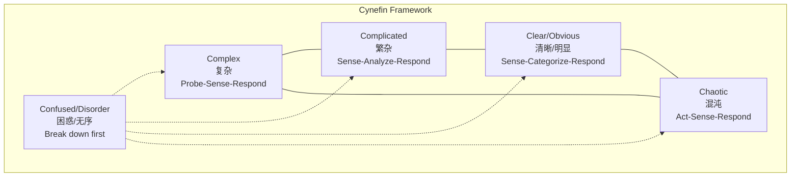
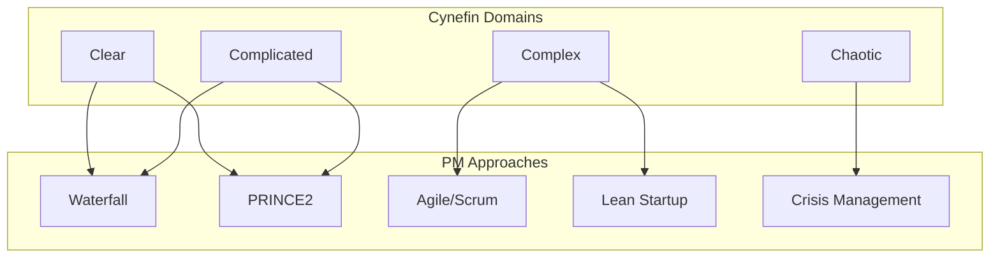
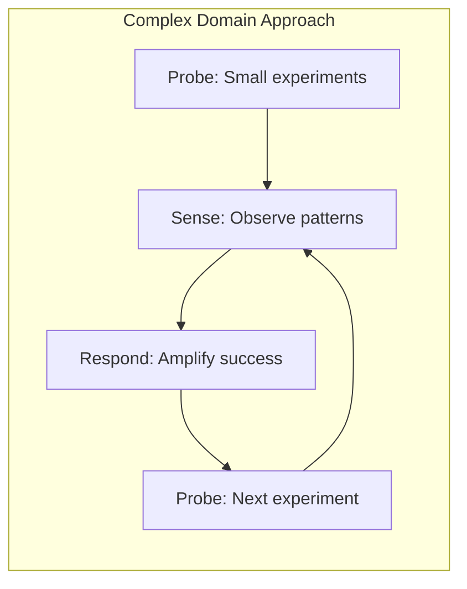
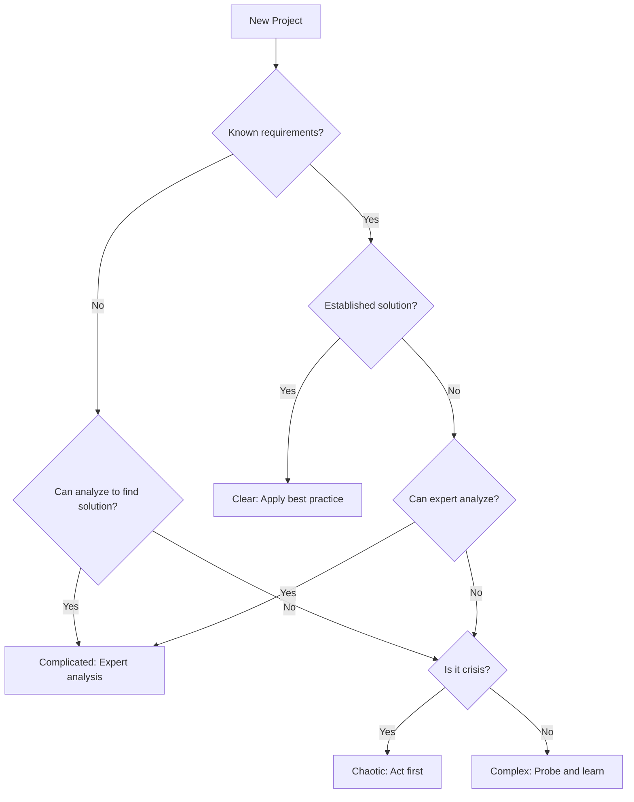

# Cynefin Framework for Project Management / 项目管理Cynefin框架

## 1. Overview / 概述

### 1.1 Introduction / 简介

**English**: The Cynefin Framework, developed by Dave Snowden in 1999, is a decision-making framework that helps leaders understand the context they're operating in and choose appropriate responses. It is essential for project management in complex environments.

**中文**: Cynefin框架由Dave Snowden于1999年开发，是一个帮助领导者理解所处环境并选择适当响应的决策框架。它对于复杂环境中的项目管理至关重要。

### 1.2 Authority Sources / 权威来源

| Source | Type | Reference |
|--------|------|-----------|
| Dave Snowden | Creator | <https://thecynefin.co/> |
| Cynefin.io | Official Wiki | <https://cynefin.io/> |
| HBR 2007 | Publication | "A Leader's Framework for Decision Making" |
| Cognitive Edge | Consulting | <https://cognitive-edge.com/> |

---

## 2. Definition / 定义

### 2.1 The Five Domains / 五个领域

**Definition 2.1** (Cynefin Framework / Cynefin框架)

**English Definition**: Cynefin is a sense-making framework that categorizes problems into five domains based on the relationship between cause and effect, each requiring different management approaches.

**中文定义**: Cynefin是一个意义构建框架，根据因果关系将问题分为五个领域，每个领域需要不同的管理方法。

### 2.2 Domain Definitions / 领域定义

| Domain | Cause-Effect | Approach | PM Example |
|--------|--------------|----------|------------|
| **Clear** | Obvious, predictable | Sense → Categorize → Respond | Routine tasks, standard procedures |
| **Complicated** | Discoverable, requires expertise | Sense → Analyze → Respond | Engineering projects, expert decisions |
| **Complex** | Emergent, unpredictable | Probe → Sense → Respond | Innovation, organizational change |
| **Chaotic** | No apparent relationship | Act → Sense → Respond | Crisis management, emergencies |
| **Confused** | Unknown which domain | Break down, determine domain | Unclear situations |

---

## 3. Properties / 属性

### 3.1 Domain Characteristics / 领域特征

| Characteristic | Clear | Complicated | Complex | Chaotic |
|----------------|-------|-------------|---------|---------|
| **Predictability** | High | Medium | Low | None |
| **Expertise Need** | Low | High | Diverse | Immediate action |
| **Planning** | Detailed | Analytical | Adaptive | Reactive |
| **Best Practice** | Apply | Discover | Emerge | Novel |
| **Decision Making** | Rule-based | Expert-based | Experimental | Instinctive |
| **Feedback Loop** | Delayed OK | Analysis needed | Immediate | Critical |

### 3.2 Project Type Mapping / 项目类型映射

| Project Type | Likely Domain | Characteristics |
|--------------|---------------|-----------------|
| Construction (standard) | Clear | Established methods, known outcomes |
| Software (new platform) | Complicated | Requires expertise, analyzable |
| AI/ML Research | Complex | Emergent outcomes, experimentation needed |
| Crisis Response | Chaotic | Immediate action required |
| Organizational Transformation | Complex | Human dynamics, unpredictable |
| Routine Maintenance | Clear | Standard procedures |

---

## 4. Relations / 关系

### 4.1 Cynefin and Project Management Frameworks / Cynefin与项目管理框架关系

### 4.2 When to Use Formal Methods vs Cynefin / 何时用形式化方法 vs Cynefin

| Cynefin 域 | 形式化方法适用性 | 说明 |
|------------|------------------|------|
| **Clear** | 高 | 因果关系明确，可用状态机、LTL/CTL、模型检验严格验证（见 [形式化基础理论](../01-foundations/README.md)、[形式化验证理论](../03-formal-verification/verification-theory.md)）。 |
| **Complicated** | 中–高 | 需专家分析后可形式化；分析阶段用 Sense–Analyze–Respond，规范确定后可用形式化验证。 |
| **Complex** | 低（先探针） | 涌现、不可预测；宜 Probe–Sense–Respond，待模式显现后再考虑局部形式化。 |
| **Chaotic** | 低（先稳定） | 先 Act–Sense–Respond 稳定局面，再归类到其他域；稳定后可引入形式化。 |

本项目的 [形式化验证](../03-formal-verification/verification-theory.md) 与 [基础理论](../01-foundations/README.md) 主要针对 Clear/Complicated 情境；复杂与混沌情境下应结合本模块的 Cynefin、系统动力学与 CAS 选择方法。

### 4.3 Cynefin and PMBOK / Cynefin与PMBOK关系

| PMBOK Principle | Clear | Complicated | Complex | Chaotic |
|-----------------|-------|-------------|---------|---------|
| Stewardship | Standard | Expert judgment | Adaptive | Protective |
| Team | Directive | Expert-led | Self-organizing | Command |
| Stakeholders | Inform | Consult | Collaborate | Direct |
| Value | Defined | Optimized | Emergent | Preserved |
| Systems Thinking | Linear | Analytical | Holistic | Reactive |
| Tailoring | Minimal | Analytical | Extensive | Rapid |
| Quality | Standards | Best practice | Good enough | Survival |
| Complexity | Low | Medium | High | Extreme |
| Risk | Known | Analyzable | Emergent | Immediate |
| Adaptability | Low need | Planned | Continuous | Instant |
| Change | Controlled | Managed | Embraced | Forced |

---

## 5. Examples / 实例

### 5.1 Example 1: Software Project Assessment / 软件项目评估

**Context**: New web application development

**Assessment Process**:

1. **Initial Classification**:
   - Requirements: Partially defined → Not Clear
   - Technology: Known stack → Not Chaotic
   - Team: Experienced → Could be Complicated or Complex

2. **Deeper Analysis**:
   - User needs: Still discovering → Complex element
   - Technical architecture: Established patterns → Complicated element
   - Market: Uncertain → Complex element

3. **Conclusion**: Mixed Complicated-Complex
   - Use Agile for Complex aspects (user discovery)
   - Use structured design for Complicated aspects (architecture)

### 5.2 Example 2: Crisis Response / 危机响应

**Context**: Production system outage

**Phase 1 - Chaotic**:

- Act: Immediate rollback
- Sense: Check if service restored
- Respond: Communicate to stakeholders

**Phase 2 - Complicated** (post-crisis):

- Sense: Gather logs and data
- Analyze: Root cause analysis
- Respond: Implement fix, create runbook

**Phase 3 - Clear** (prevention):

- Sense: Monitor for similar patterns
- Categorize: Match to known issues
- Respond: Apply standard fix

### 5.3 Example 3: Organizational Transformation / 组织变革

**Context**: Digital transformation initiative

**Assessment**: Complex domain

- Human behavior unpredictable
- Outcomes emergent
- No best practice (only emerging practice)

**Approach**:

1. **Probe**: Small pilot projects
2. **Sense**: Gather feedback, observe patterns
3. **Respond**: Scale what works, abandon what doesn't

---

## 6. Explanations / 解释

### 6.1 Intuitive Explanation / 直观解释

**English**: Cynefin helps you avoid the trap of treating all problems the same way. Just as you wouldn't use a hammer for every job, different project situations require different approaches.

**中文**: Cynefin帮助你避免用相同方式处理所有问题的陷阱。就像你不会用锤子做所有工作一样，不同的项目情况需要不同的方法。

### 6.2 Key Insights / 关键洞察

1. **Context Matters**: The same approach won't work for all projects
2. **Dynamics**: Projects can move between domains
3. **Boundaries**: The boundary between Complex and Chaotic is a cliff (sudden transition)
4. **Disorder**: Not knowing which domain you're in is the most dangerous state
5. **Expertise**: Different domains require different types of expertise

### 6.3 Common Mistakes / 常见错误

| Mistake | Consequence | Correction |
|---------|-------------|------------|
| Treating Complex as Complicated | Analysis paralysis, missed opportunities | Use experiments instead of analysis |
| Treating Complicated as Clear | Poor decisions, ignored expertise | Engage experts, analyze |
| Staying in Chaotic too long | Burnout, unsustainable | Stabilize, move to other domains |
| Ignoring domain dynamics | Wrong approach as context changes | Continuously reassess |

### 6.4 Historical Context / 历史背景

- **1999**: Dave Snowden develops Cynefin at IBM
- **2007**: HBR publishes "A Leader's Framework for Decision Making"
- **2010s**: Adoption in Agile and DevOps communities
- **2020s**: Increasing use in complex project environments, AI projects

---

## 7. Argumentation / 论证

### 7.1 Logical Argument / 逻辑论证

**Claim**: Different project contexts require different management approaches.

**Premises**:

1. Cause-effect relationships vary across project types
2. Predictability varies across project types
3. Effective decision-making depends on understanding context

**Conclusion**: A framework like Cynefin that distinguishes contexts improves project management.

### 7.2 Empirical Evidence / 经验证据

- Agile succeeds in Complex domains but struggles in Clear domains
- Waterfall succeeds in Clear domains but struggles in Complex domains
- Crisis management protocols work in Chaotic but fail in Complex

### 7.3 Theoretical Justification / 理论论证

Based on:

- Complexity theory (Stacey Matrix)
- Systems thinking
- Cognitive psychology (pattern matching)
- Organizational learning theory

---

## 8. Applications / 应用

### 8.1 Project Selection / 项目选择方法

### 8.2 Approach Selection / 方法选择

| Domain | Recommended Approach | Tools |
|--------|---------------------|-------|
| Clear | Waterfall, Standard PM | Checklists, templates |
| Complicated | PRINCE2, Expert analysis | Decision trees, simulations |
| Complex | Agile, Lean Startup | Experiments, retrospectives |
| Chaotic | Crisis protocols | Rapid response, communication |

### 8.3 Integration with Formal Methods / 与形式化方法集成

| Domain | Formal Method Application |
|--------|--------------------------|
| Clear | Full specification, verification |
| Complicated | Partial specification, model checking |
| Complex | Lightweight specification, property testing |
| Chaotic | Post-hoc analysis only |

---

## 9. References / 参考文献

### 9.1 Primary Sources / 主要来源

1. Snowden, D. J., & Boone, M. E. (2007). "A Leader's Framework for Decision Making". *Harvard Business Review*.
2. Snowden, D. J. (2010). "Cynefin Framework Introduction". Cognitive Edge.
3. Kurtz, C. F., & Snowden, D. J. (2003). "The new dynamics of strategy". *IBM Systems Journal*.

### 9.2 Secondary Sources / 次要来源

1. Cynefin Wiki: <https://cynefin.io/>
2. The Cynefin Company: <https://thecynefin.co/>
3. Cognitive Edge: <https://cognitive-edge.com/>

---

## 10. Status / 状态

**Document Version / 文档版本**: 1.0
**Last Updated / 最后更新**: 2026-02-02
**Status / 状态**: ✅ Complete
**Next Review / 下次审查**: 2026-05-02

**Related Documents / 相关文档**:

- [Systems Dynamics](./02-systems-dynamics.md)
- [Complex Adaptive Systems](./03-complex-adaptive-systems.md)
- [Emergence and Project Management](./04-emergence-project-management.md)
