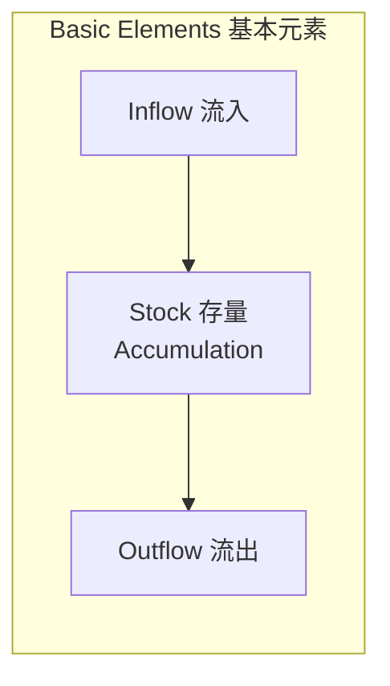
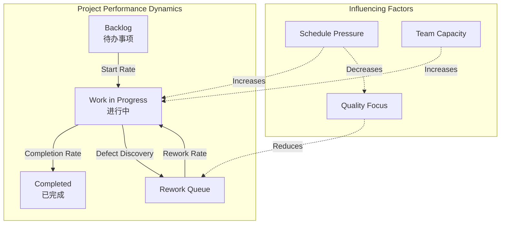
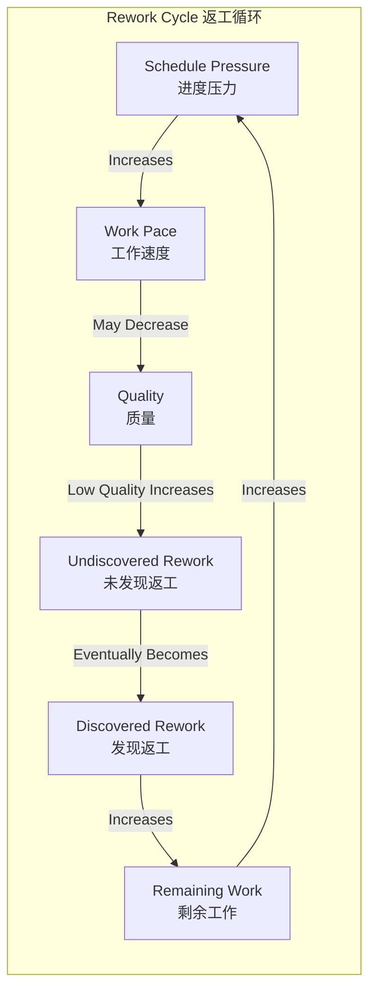
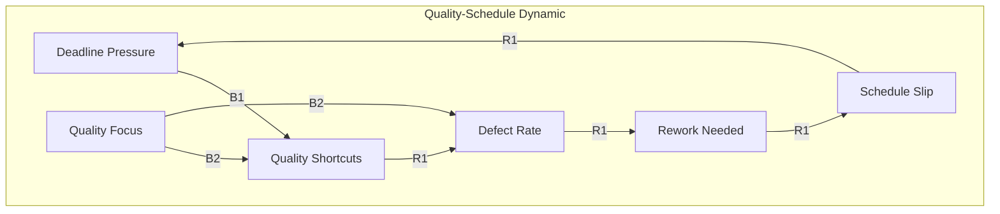

# Systems Dynamics for Project Management / 项目管理系统动力学

## 1. Overview / 概述

### 1.1 Introduction / 简介

**English**: Systems Dynamics is a methodology for understanding the behavior of complex systems over time. Founded by Jay Forrester at MIT, it uses stocks, flows, and feedback loops to model how projects evolve and how interventions affect outcomes.

**中文**: 系统动力学是一种理解复杂系统随时间演变行为的方法论。由MIT的Jay Forrester创立，它使用存量、流量和反馈循环来建模项目如何演变以及干预如何影响结果。

### 1.2 Authority Sources / 权威来源

| Source | Type | Reference |
|--------|------|-----------|
| MIT Sloan | Academic | System Dynamics Group |
| Jay Forrester | Founder | "Industrial Dynamics" (1961) |
| John Sterman | Leading Scholar | "Business Dynamics" (2000) |
| System Dynamics Society | Professional Org | <https://systemdynamics.org/> |

---

## 2. Definition / 定义

### 2.1 Core Concepts / 核心概念

**Definition 2.1** (Systems Dynamics / 系统动力学)

**English Definition**: Systems Dynamics is an approach to understanding complex systems through modeling the underlying structure of stocks, flows, feedback loops, and time delays that determine system behavior.

**中文定义**: 系统动力学是一种通过建模存量、流量、反馈循环和时间延迟的底层结构来理解复杂系统行为的方法。

### 2.2 Basic Elements / 基本元素



| Element | Symbol | Description | PM Example |
|---------|--------|-------------|------------|
| **Stock** | Rectangle | Accumulation | Backlog, completed tasks, team members |
| **Flow** | Valve/Arrow | Rate of change | Task completion rate, hiring rate |
| **Feedback Loop** | Circular arrow | Causal loop | Quality-rework loop |
| **Delay** | Double line | Time lag | Learning curve, review cycle |

### 2.3 Feedback Loop Types / 反馈循环类型

| Type | Also Called | Behavior | PM Example |
|------|-------------|----------|------------|
| **Reinforcing (R)** | Positive, Amplifying | Exponential growth/collapse | Success breeds success |
| **Balancing (B)** | Negative, Stabilizing | Goal-seeking | Resource leveling |

---

## 3. Properties / 属性

### 3.1 System Archetypes in PM / 项目管理中的系统原型

| Archetype | Description | PM Manifestation |
|-----------|-------------|------------------|
| **Fixes that Fail** | Short-term fix worsens problem | Overtime leading to burnout |
| **Shifting the Burden** | Addressing symptoms, not root cause | Heroic efforts vs process improvement |
| **Limits to Growth** | Growth hits constraint | Project velocity plateau |
| **Tragedy of Commons** | Shared resource overuse | Shared team overload |
| **Growth and Underinvestment** | Not investing in capacity | Technical debt accumulation |
| **Success to Successful** | Resources flow to winners | Star projects get more resources |
| **Escalation** | Competitive escalation | Feature wars |

### 3.2 Key Project Dynamics / 关键项目动态

| Dynamic | Stocks | Flows | Feedback |
|---------|--------|-------|----------|
| **Task Completion** | Backlog, In Progress, Done | Start rate, Completion rate | Quality-Rework (B) |
| **Team Productivity** | Experience, Motivation | Learning, Fatigue | Learning curve (R), Burnout (B) |
| **Scope Management** | Requirements, Scope | Discovery, Creep | Scope-Schedule (B) |
| **Quality** | Defects, Technical Debt | Creation, Resolution | Quality-Rework (B) |

---

## 4. Relations / 关系

### 4.1 Project Performance Dynamics / 项目绩效动态



### 4.2 Rework Cycle (Classic PM Dynamic) / 返工循环



---

## 5. Examples / 实例

### 5.1 Example 1: Brooks's Law Model / 布鲁克斯定律模型

**Context**: Adding people to a late project makes it later.

**Stock-Flow Diagram**:

```
[Experienced Staff] ---> Training ---> [New Staff]
                    <---

[Remaining Work] ---> Completion ---> [Completed Work]
                 <--- Rework <---
```

**Dynamics**:

1. New staff require training (flow from experienced to training)
2. Training reduces productivity of experienced staff
3. New staff initially have lower productivity
4. Communication overhead increases with team size

**Equation**:

```
Productivity = BaseProductivity × ExperienceMultiplier - TrainingOverhead - CommunicationOverhead
CommunicationOverhead = k × n(n-1)/2  (where n = team size)
```

### 5.2 Example 2: Quality-Schedule Tradeoff / 质量-进度权衡

**Context**: Rushing to meet deadline affects quality.



**Key Insight**: The reinforcing loop (R1) means cutting quality to save time often leads to needing MORE time due to rework.

### 5.3 Example 3: Technical Debt Accumulation / 技术债务积累

**Model**:

```
Stocks:
- Clean Code: Amount of well-designed code
- Technical Debt: Amount of shortcuts/hacks

Flows:
- Good Development: Adds to Clean Code
- Quick Fixes: Adds to Technical Debt
- Refactoring: Moves from Debt to Clean
- Decay: Clean Code becomes Debt over time

Feedback:
- More Debt → Lower Productivity → More Pressure → More Debt (R)
- Refactoring → Higher Productivity → More Capacity for Refactoring (R)
```

---

## 6. Explanations / 解释

### 6.1 Intuitive Explanation / 直观解释

**English**: Think of a project like a bathtub. The backlog is the water level, work starting is water flowing in, completion is water draining. If inflow > outflow, the tub overflows (project delays). Feedback loops are like a thermostat - they can stabilize or destabilize the system.

**中文**: 把项目想象成一个浴缸。待办事项是水位，开始工作是水流入，完成是水流出。如果流入>流出，浴缸就会溢出（项目延迟）。反馈循环就像恒温器——它们可以稳定或破坏系统稳定性。

### 6.2 Key Insights / 关键洞察

1. **Delays are Critical**: Most project problems involve time delays between action and effect
2. **Nonlinear Behavior**: Small changes can have disproportionate effects
3. **Counter-intuitive**: Obvious solutions often worsen problems
4. **Structure Drives Behavior**: Changing people won't help if structure is wrong
5. **Feedback Dominance**: Different loops dominate at different times

### 6.3 Common Mistakes / 常见错误

| Mistake | Why It Happens | Consequence |
|---------|----------------|-------------|
| Ignoring delays | Focus on immediate | Oscillation, overshoot |
| Linear thinking | Simpler to understand | Underestimate complexity |
| Event focus | Visible triggers | Miss underlying structure |
| Blame | Easier than system analysis | No real improvement |

---

## 7. Argumentation / 论证

### 7.1 Logical Argument / 逻辑论证

**Claim**: Systems dynamics improves project management.

**Premises**:

1. Projects are complex systems with stocks, flows, and feedback
2. Intuition often fails in complex systems
3. Modeling reveals counter-intuitive dynamics

**Conclusion**: Systems dynamics provides insights that improve project decisions.

### 7.2 Empirical Evidence / 经验证据

- Brooks's Law validated by systems dynamics models
- Software project dynamics well-documented (Abdel-Hamid & Madnick)
- Construction project dynamics modeled (Sterman)

### 7.3 Theoretical Justification / 理论论证

Based on:

- Control theory (feedback systems)
- Calculus (rates of change)
- Nonlinear dynamics (chaos theory basics)

---

## 8. Applications / 应用

### 8.1 Project Planning / 项目规划

Use systems dynamics to:

- Model staffing decisions
- Understand schedule dynamics
- Plan for rework
- Set realistic expectations

### 8.2 Risk Analysis / 风险分析

Model risks as:

- Stock: Potential impact
- Flow: Risk realization rate
- Feedback: Cascade effects

### 8.3 Process Improvement / 过程改进

Identify:

- Reinforcing loops to leverage
- Balancing loops to strengthen
- Delays to reduce
- Archetypes to avoid

### 8.4 Integration with Formal Methods / 与形式化方法集成

| Systems Dynamics | Formal Methods Equivalent |
|-----------------|---------------------------|
| Stock | State variable |
| Flow | Transition function |
| Feedback loop | Invariant/property |
| Archetype | Design pattern |

---

## 9. Tools / 工具

### 9.1 Modeling Tools / 建模工具

| Tool | Type | Availability |
|------|------|--------------|
| Vensim | Professional | Commercial/Free PLE |
| Stella | Professional | Commercial |
| InsightMaker | Web-based | Free |
| PySD | Python library | Open source |

### 9.2 Sample PySD Model / PySD模型示例

```python
"""
Simple Project Model using PySD
"""

from pysd import functions

def project_model():
    """
    Stock-flow model of project completion
    """

    # Initial conditions
    initial_backlog = 100  # tasks
    initial_wip = 10  # tasks
    initial_completed = 0  # tasks

    # Parameters
    start_rate = 5  # tasks/day
    base_completion_rate = 4  # tasks/day
    defect_rate = 0.1  # 10% of completed work has defects
    rework_rate = 2  # tasks/day

    # Stocks
    backlog = initial_backlog
    wip = initial_wip
    completed = initial_completed
    rework_queue = 0

    # Simulation
    dt = 1  # 1 day time step
    simulation_time = 60  # days

    results = []

    for t in range(simulation_time):
        # Calculate flows
        actual_start = min(start_rate, backlog)
        actual_completion = min(base_completion_rate, wip)
        defects_found = actual_completion * defect_rate
        actual_rework = min(rework_rate, rework_queue)

        # Update stocks
        backlog -= actual_start
        wip += actual_start - actual_completion + actual_rework
        completed += actual_completion - defects_found
        rework_queue += defects_found - actual_rework

        results.append({
            'time': t,
            'backlog': backlog,
            'wip': wip,
            'completed': completed,
            'rework': rework_queue
        })

    return results
```

---

## 10. Status / 状态

**Document Version / 文档版本**: 1.0
**Last Updated / 最后更新**: 2026-02-02
**Status / 状态**: ✅ Complete
**Next Review / 下次审查**: 2026-05-02

**Related Documents / 相关文档**:

- [Cynefin Framework](./01-cynefin-framework.md)
- [Complex Adaptive Systems](./03-complex-adaptive-systems.md)
- [Emergence and Project Management](./04-emergence-project-management.md)
