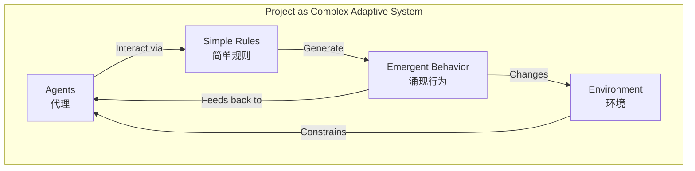
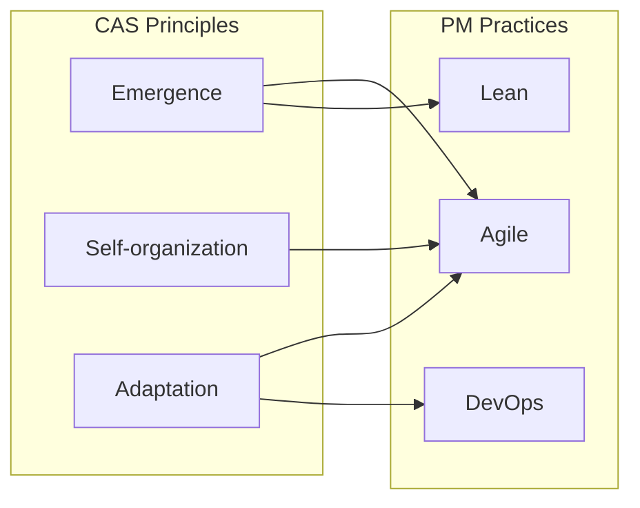
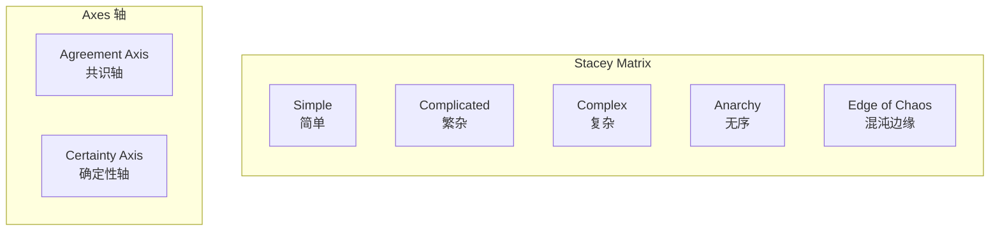
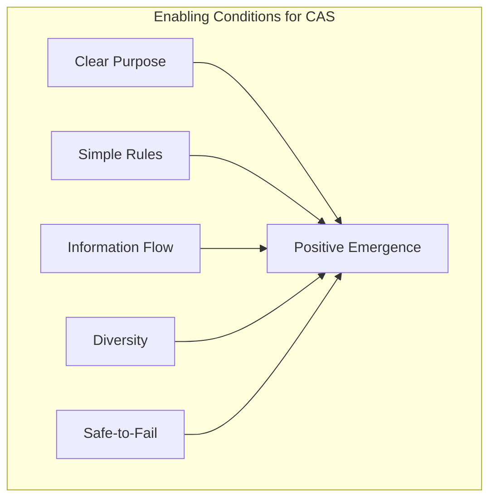

# Complex Adaptive Systems in Project Management / 项目管理中的复杂适应系统

## 1. Overview / 概述

### 1.1 Introduction / 简介

**English**: Complex Adaptive Systems (CAS) theory provides a framework for understanding projects as living systems that adapt, self-organize, and evolve. This perspective is crucial for managing projects in uncertain, rapidly changing environments.

**中文**: 复杂适应系统（CAS）理论为理解项目作为适应、自组织和演化的生命系统提供了框架。这一视角对于在不确定、快速变化环境中管理项目至关重要。

### 1.2 Authority Sources / 权威来源

| Source | Type | Reference |
|--------|------|-----------|
| Santa Fe Institute | Research Center | <https://www.santafe.edu/> |
| Holland, J. | Pioneer | "Hidden Order" (1995) |
| Kauffman, S. | Theorist | "At Home in the Universe" (1995) |
| Stacey, R. | PM Application | "Complexity and Management" (2000) |

---

## 2. Definition / 定义

### 2.1 CAS Fundamentals / CAS基础

**Definition 2.1** (Complex Adaptive System / 复杂适应系统)

**English Definition**: A Complex Adaptive System is a dynamic network of many interacting agents (people, processes, components) acting in parallel, constantly reacting to what other agents are doing, which in turn influences their behavior and the behavior of the whole system.

**中文定义**: 复杂适应系统是一个由许多相互作用的代理（人员、过程、组件）组成的动态网络，这些代理并行行动，不断对其他代理的行为做出反应，这反过来又影响它们的行为和整个系统的行为。

### 2.2 CAS Properties / CAS属性

| Property | Description | PM Manifestation |
|----------|-------------|------------------|
| **Emergence** | Global patterns from local interactions | Team culture, project velocity |
| **Self-organization** | Order without central control | Agile team dynamics |
| **Adaptation** | Learning and evolving | Retrospective improvements |
| **Nonlinearity** | Small changes, big effects | Butterfly effect in projects |
| **Co-evolution** | Mutual adaptation | Team-client evolution |
| **Edge of Chaos** | Optimal zone between order and chaos | Innovation sweet spot |

---

## 3. Properties / 属性

### 3.1 Project as CAS / 项目作为CAS

### 3.2 CAS Levels in Projects / 项目中的CAS层次

| Level | Agents | Interactions | Emergent Properties |
|-------|--------|--------------|---------------------|
| **Individual** | Team members | Communication, collaboration | Skills, relationships |
| **Team** | Sub-teams, pairs | Coordination, handoffs | Team culture, velocity |
| **Project** | Teams, stakeholders | Integration, feedback | Project outcome, quality |
| **Organization** | Projects, departments | Resource sharing, learning | Organizational capability |
| **Ecosystem** | Organizations, market | Competition, partnership | Industry practices |

### 3.3 Simple Rules for Project Teams / 项目团队简单规则

| Rule Category | Example Rules | Purpose |
|---------------|---------------|---------|
| **Communication** | "Share blockers daily" | Information flow |
| **Quality** | "Test before commit" | Quality emergence |
| **Collaboration** | "Pair on complex tasks" | Knowledge sharing |
| **Focus** | "Complete before starting new" | WIP limits |
| **Learning** | "Reflect after each sprint" | Adaptation |

---

## 4. Relations / 关系

### 4.1 CAS and Project Management Approaches / CAS与项目管理方法

### 4.2 Stacey Matrix / Stacey矩阵

| Zone | Agreement | Certainty | Approach |
|------|-----------|-----------|----------|
| Simple | High | High | Standard processes |
| Complicated | Medium-High | Medium-High | Expert analysis |
| Complex | Low-Medium | Low-Medium | CAS approaches |
| Edge of Chaos | Medium | Low-Medium | Innovation zone |
| Anarchy | Low | Low | Avoid or exit |

---

## 5. Examples / 实例

### 5.1 Example 1: Agile Team as CAS / 敏捷团队作为CAS

**Context**: A Scrum team developing software

**CAS Analysis**:

| CAS Element | Manifestation |
|-------------|---------------|
| **Agents** | Developers, PO, SM, stakeholders |
| **Simple Rules** | Sprint commitments, daily standups, definition of done |
| **Interactions** | Pair programming, code reviews, sprint planning |
| **Emergence** | Team velocity, code quality, team culture |
| **Adaptation** | Retrospectives, backlog refinement |
| **Environment** | Organization, market, technology |

**Observation**: Team velocity is an emergent property—it cannot be predicted from individual performance, only observed and optimized through adaptation.

### 5.2 Example 2: Failed Centralized Control / 失败的集中控制

**Context**: Large organization attempting to standardize all project processes

**Problem**:

- Treated projects as simple systems
- Imposed detailed procedures
- Removed local decision-making

**CAS Perspective**:

- Removed self-organization capability
- Blocked adaptation
- Prevented beneficial emergence

**Result**: Process compliance but poor outcomes

**Alternative**: Provide simple rules, enable self-organization, measure outcomes not activities

### 5.3 Example 3: Enabling Conditions / 使能条件

**Context**: Creating conditions for positive emergence

**Enabling Conditions**:

| Condition | How to Create | PM Practice |
|-----------|---------------|-------------|
| Clear Purpose | Vision, goals | North Star metric |
| Simple Rules | Minimal constraints | Team agreements |
| Information Flow | Transparency | Dashboards, standups |
| Diversity | Different skills/perspectives | Cross-functional teams |
| Safe-to-Fail | Psychological safety | Blameless postmortems |

---

## 6. Explanations / 解释

### 6.1 Intuitive Explanation / 直观解释

**English**: A project is like a flock of birds—each bird follows simple rules (stay close, don't collide, match speed), and the beautiful, coordinated flock behavior emerges without a "leader bird" orchestrating it. Projects work the same way with the right conditions.

**中文**: 项目就像一群鸟——每只鸟遵循简单规则（保持接近、不碰撞、匹配速度），美丽协调的群体行为就会涌现，而不需要"领头鸟"来协调。在适当条件下，项目也是如此运作的。

### 6.2 Key Insights / 关键洞察

1. **Control is Limited**: Cannot fully control CAS, only influence
2. **Emergence is Real**: Team/project properties cannot be reduced to individuals
3. **Diversity Matters**: Homogeneity reduces adaptability
4. **Edge of Chaos**: Best performance near the edge, not in order or chaos
5. **Attractors**: Systems tend toward certain patterns (attractors)

### 6.3 Leader's Role in CAS / CAS中领导者的角色

| Traditional View | CAS View |
|------------------|----------|
| Command and control | Create conditions |
| Detailed planning | Set direction and boundaries |
| Predict outcomes | Sense and respond |
| Remove variability | Embrace healthy variation |
| Standardize | Enable diversity |
| Solve problems | Surface problems |

---

## 7. Argumentation / 论证

### 7.1 Logical Argument / 逻辑论证

**Claim**: Projects should be managed as Complex Adaptive Systems.

**Premises**:

1. Projects involve many interacting agents
2. Project behavior often cannot be predicted from parts
3. Projects adapt to changing conditions
4. Emergent properties affect project success

**Conclusion**: CAS principles improve project management in complex contexts.

### 7.2 Empirical Evidence / 经验证据

- Agile success in complex software projects
- Self-organizing teams outperform command-controlled teams
- Innovation emerges at the "edge of chaos"

---

## 8. Applications / 应用

### 8.1 Practical Applications / 实际应用

| Application | CAS Approach |
|-------------|--------------|
| Team formation | Enable self-selection, diversity |
| Process design | Simple rules, not detailed procedures |
| Planning | Adaptive, rolling wave |
| Problem solving | Probe-Sense-Respond |
| Performance | Measure emergence, not activities |
| Change | Small experiments, not big rollouts |

### 8.2 CAS Design Principles for Projects / 项目CAS设计原则

1. **Define Purpose, Not Process**: Clear goals, flexible methods
2. **Simple Rules**: Minimum necessary constraints
3. **Enable Interactions**: Communication, collaboration
4. **Allow Self-Organization**: Trust teams to organize
5. **Embrace Adaptation**: Learn and evolve
6. **Monitor Emergence**: Watch for patterns
7. **Perturb When Stuck**: Safe-to-fail experiments

---

## 9. References / 参考文献

### 9.1 Primary Sources / 主要来源

1. Holland, J. H. (1995). *Hidden Order: How Adaptation Builds Complexity*. Addison-Wesley.
2. Kauffman, S. A. (1995). *At Home in the Universe*. Oxford University Press.
3. Stacey, R. D. (2000). *Complexity and Management*. Routledge.

### 9.2 Secondary Sources / 次要来源

1. Santa Fe Institute: <https://www.santafe.edu/>
2. Complexity Labs: <https://complexitylabs.io/>
3. Agile and CAS: Various Agile community resources

---

## 10. Status / 状态

**Document Version / 文档版本**: 1.0
**Last Updated / 最后更新**: 2026-02-02
**Status / 状态**: ✅ Complete
**Next Review / 下次审查**: 2026-05-02

**Related Documents / 相关文档**:

- [Cynefin Framework](./01-cynefin-framework.md)
- [Systems Dynamics](./02-systems-dynamics.md)
- [Emergence and Project Management](./04-emergence-project-management.md)
