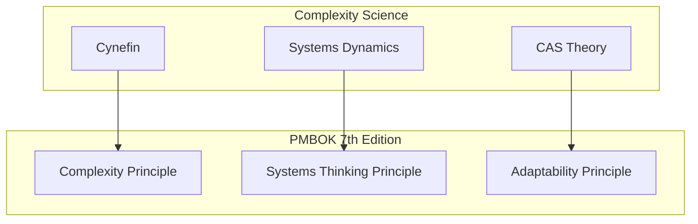

# Complexity and Systems Thinking Module / 复杂性与系统思维模块

## Overview / 概述

This module provides frameworks and theories for understanding and managing projects as complex systems. It bridges traditional project management with complexity science.

本模块提供理解和管理项目作为复杂系统的框架和理论。它将传统项目管理与复杂性科学联系起来。

## Contents / 内容

| Document | Description | 描述 |
|----------|-------------|------|
| [01-cynefin-framework.md](./01-cynefin-framework.md) | Cynefin decision framework | Cynefin决策框架 |
| [02-systems-dynamics.md](./02-systems-dynamics.md) | Systems dynamics modeling | 系统动力学建模 |
| [03-complex-adaptive-systems.md](./03-complex-adaptive-systems.md) | CAS theory for projects | 项目CAS理论 |

## Key Concepts / 关键概念

### Cynefin Framework

- Five domains: Clear, Complicated, Complex, Chaotic, Confused
- Context-appropriate decision making
- Domain-specific management approaches

### Systems Dynamics

- Stocks, flows, and feedback loops
- System archetypes in projects
- Counter-intuitive behavior modeling

### Complex Adaptive Systems

- Emergence and self-organization
- Simple rules and adaptation
- Edge of chaos optimization

## Relationship to PM Standards / 与PM标准关系

## When to Use / 何时使用

| Situation | Framework |
|-----------|-----------|
| Choosing management approach | Cynefin |
| Understanding project dynamics | Systems Dynamics |
| Designing team structures | CAS |
| Analyzing feedback loops | Systems Dynamics |
| Managing uncertainty | Cynefin + CAS |

## Authority Sources / 权威来源

- Dave Snowden (Cynefin)
- Jay Forrester, John Sterman (Systems Dynamics)
- Santa Fe Institute, John Holland (CAS)
- Ralph Stacey (Complexity and Management)

---

**Last Updated / 最后更新**: 2026-02-02
**Version / 版本**: 1.0
**Status / 状态**: ✅ Complete
