# Formal-ProgramManage 概念知识图谱

## 概述

本文档提供Formal-ProgramManage项目的完整概念知识图谱，展示各概念之间的层次关系、依赖关系和引用关系。

## 1. 核心概念层次结构

### 1.1 基础概念层

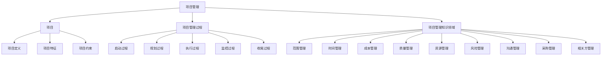

### 1.2 形式化概念层

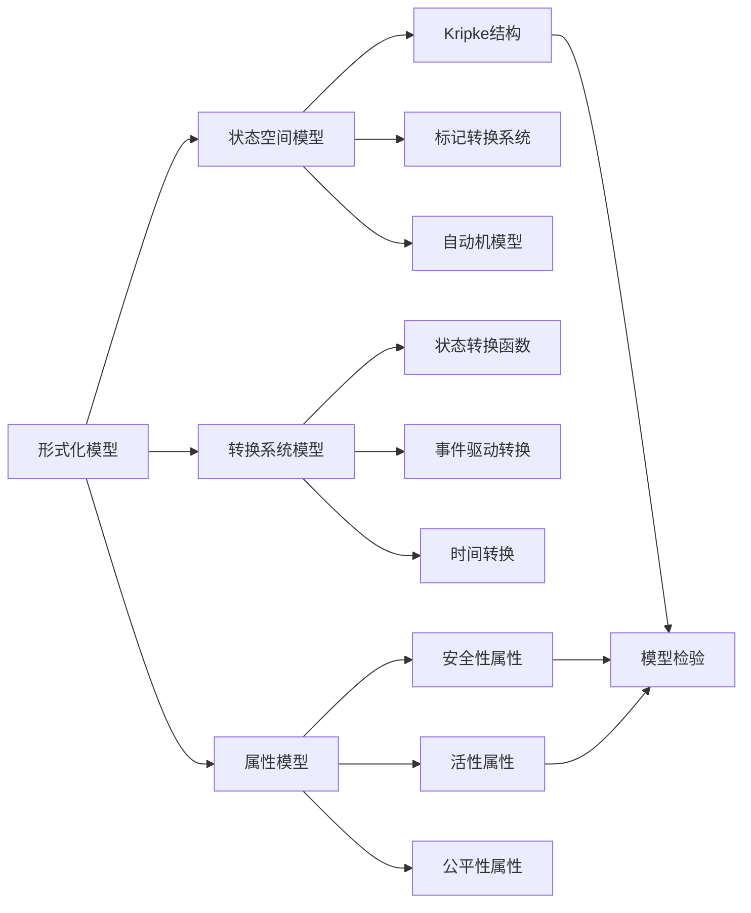

### 1.3 验证概念层

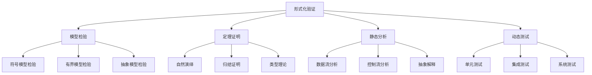

## 2. 理论依赖关系

### 2.1 基础理论依赖

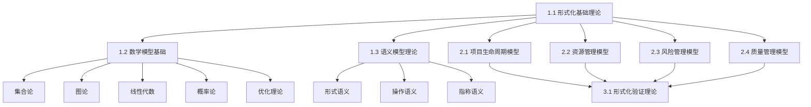

### 2.2 应用模型依赖

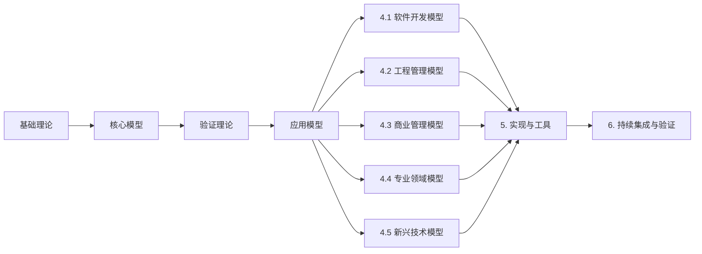

## 3. 概念关联网络

### 3.1 项目管理概念网络

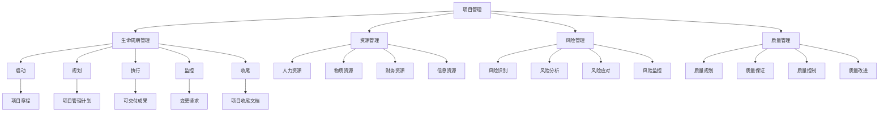

### 3.2 形式化验证概念网络

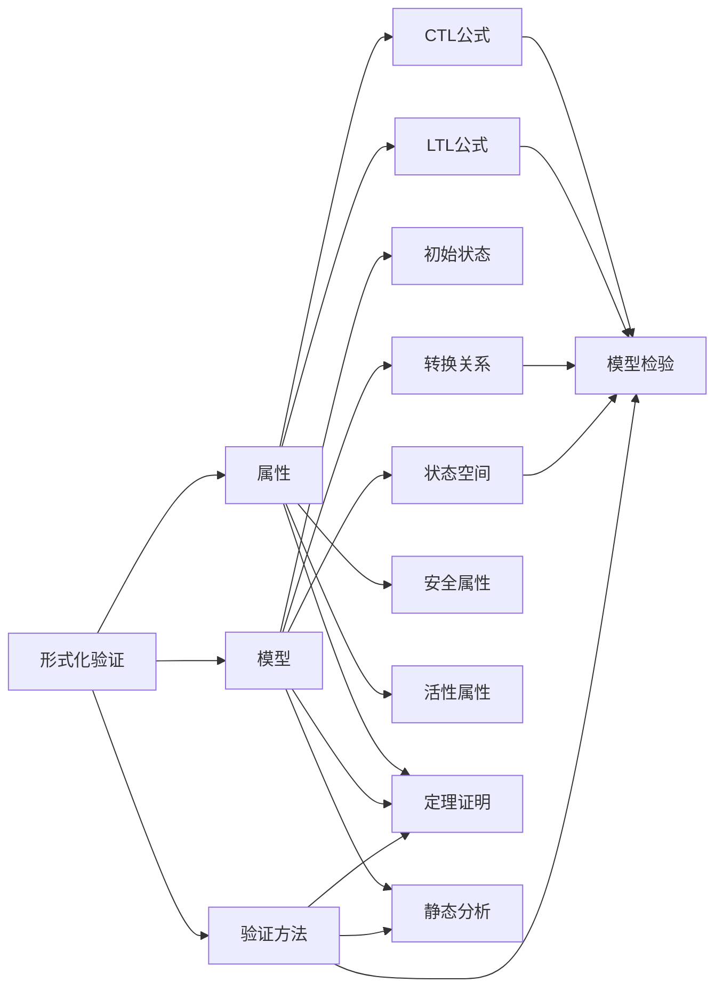

## 4. 标准对标关系

### 4.1 国际标准映射

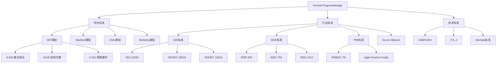

## 5. 实现技术关系

### 5.1 编程语言与工具关系

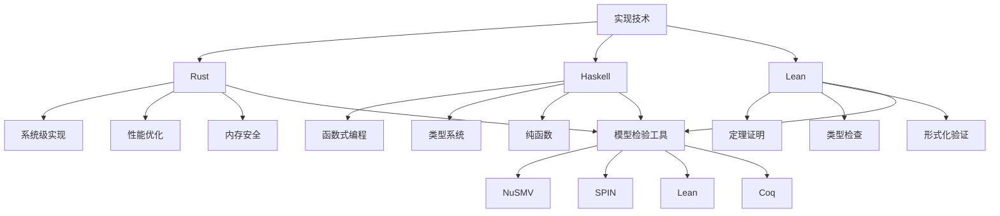

## 6. 行业应用关系

### 6.1 行业模型分类关系

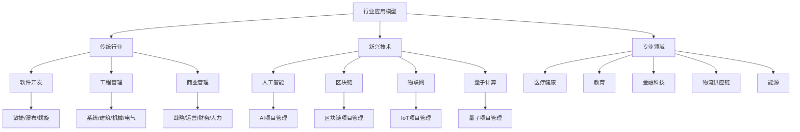

## 7. 概念属性矩阵

### 7.1 核心概念属性表

| 概念 | 类型 | 复杂度 | 成熟度 | 应用范围 | 验证方法 |
|------|------|--------|--------|---------|---------|
| 项目管理 | 核心概念 | 高 | 很高 | 全行业 | 多种 |
| 形式化模型 | 理论概念 | 很高 | 高 | 软件/系统 | 模型检验 |
| 状态空间 | 数学概念 | 高 | 很高 | 全领域 | 可达性分析 |
| 模型检验 | 验证方法 | 高 | 高 | 软件/系统 | 自动化 |
| 定理证明 | 验证方法 | 很高 | 中等 | 理论验证 | 半自动化 |
| 生命周期模型 | 应用模型 | 中等 | 很高 | 全行业 | 经验验证 |
| 资源管理模型 | 应用模型 | 中等 | 高 | 全行业 | 优化验证 |
| 风险管理模型 | 应用模型 | 中等 | 高 | 全行业 | 统计分析 |
| 质量管理模型 | 应用模型 | 中等 | 很高 | 全行业 | 标准验证 |

## 8. 概念演化关系

### 8.1 理论发展脉络

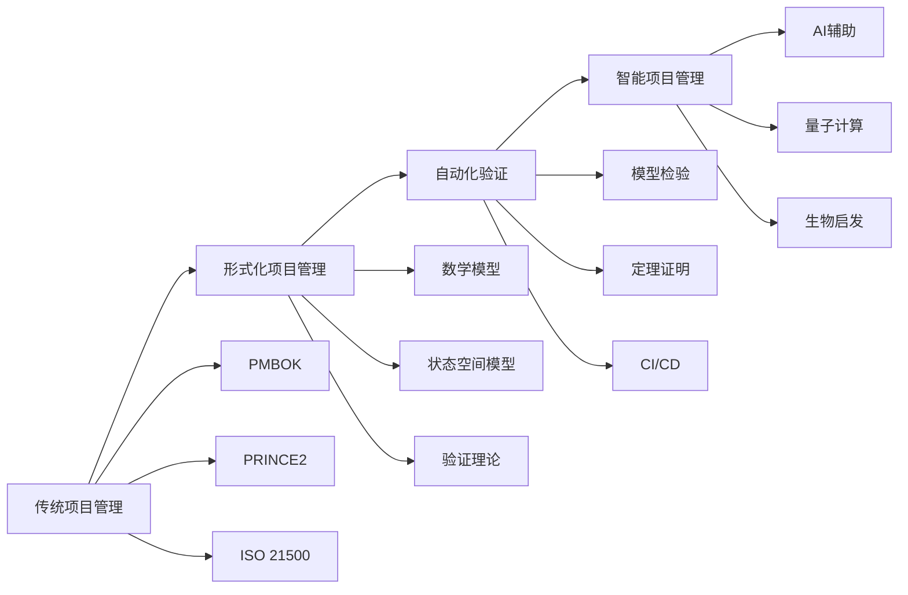

## 9. 交叉引用关系

### 9.1 文档间引用网络

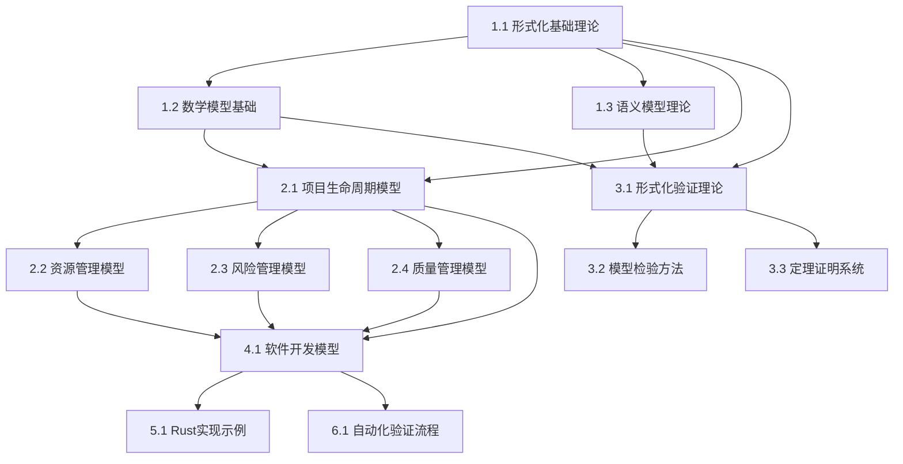

## 10. 概念分类体系

### 10.1 按抽象层次分类

- **抽象层**：数学基础、逻辑基础、语义基础
- **模型层**：状态空间模型、转换系统模型、属性模型
- **应用层**：生命周期模型、资源模型、风险模型、质量模型
- **实现层**：Rust实现、Haskell实现、Lean实现
- **验证层**：模型检验、定理证明、静态分析、动态测试

### 10.2 按应用领域分类

- **通用领域**：项目管理核心模型
- **软件开发**：敏捷、瀑布、螺旋、迭代、DevOps
- **工程管理**：系统、建筑、机械、电气
- **商业管理**：战略、运营、财务、人力、创新、知识、变革
- **专业领域**：医疗、教育、金融、物流、能源
- **新兴技术**：AI、区块链、IoT、量子计算

## 11. 概念度量指标

### 11.1 概念重要性矩阵

| 概念 | 核心度 | 依赖度 | 引用度 | 应用度 | 综合评分 |
|------|--------|--------|--------|--------|---------|
| 项目管理 | 10 | 10 | 10 | 10 | 10.0 |
| 形式化模型 | 9 | 9 | 9 | 8 | 8.75 |
| 状态空间 | 8 | 9 | 8 | 7 | 8.0 |
| 模型检验 | 8 | 8 | 8 | 8 | 8.0 |
| 生命周期模型 | 9 | 8 | 9 | 10 | 9.0 |
| 资源管理模型 | 8 | 7 | 8 | 9 | 8.0 |
| 风险管理模型 | 8 | 7 | 8 | 9 | 8.0 |
| 质量管理模型 | 8 | 7 | 8 | 9 | 8.0 |

## 12. 概念关系总结

### 12.1 核心关系链

1. **理论基础链**：数学基础 → 形式化基础 → 语义基础 → 验证理论
2. **应用模型链**：基础理论 → 核心模型 → 行业应用 → 实现验证
3. **验证方法链**：模型定义 → 属性定义 → 验证方法 → 验证工具
4. **标准对标链**：学术标准 → 行业标准 → 技术标准 → 实践标准

### 12.2 关键依赖关系

- 所有应用模型依赖于基础理论模型
- 所有验证方法依赖于形式化模型定义
- 所有实现依赖于理论模型和验证方法
- 所有标准对标依赖于理论模型和应用模型

---

**最后更新**：2025-01-XX
**维护者**：Formal-ProgramManage团队
