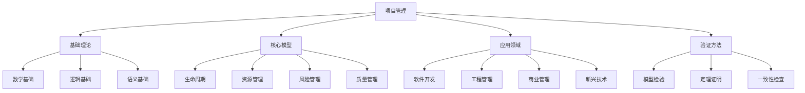

# 项目管理知识关联网络

## 概述

本文档建立了项目管理领域的完整知识关联网络，展示各理论、模型、方法之间的逻辑关系和相互影响。

## 知识网络结构

### 🕸️ 核心知识节点



### 🔗 理论关联关系

#### 1. 基础理论关联

**数学基础 → 逻辑基础**
- 集合论为逻辑推理提供基础
- 图论支持逻辑关系建模
- 概率论为不确定性逻辑提供工具

**逻辑基础 → 语义基础**
- 形式逻辑定义语义规则
- 时序逻辑描述动态语义
- 模态逻辑表达可能性语义

#### 2. 核心模型关联

**生命周期 ↔ 资源管理**
- 生命周期阶段决定资源需求
- 资源可用性影响生命周期规划
- 资源约束限制项目进度

**风险管理 ↔ 质量管理**
- 质量风险是风险管理的重要组成部分
- 质量保证措施降低项目风险
- 风险缓解策略影响质量目标

#### 3. 应用领域关联

**软件开发 ↔ 工程管理**
- 软件工程借鉴系统工程方法
- 建筑工程管理影响软件开发流程
- 机械工程为软件架构提供参考

**商业管理 ↔ 新兴技术**
- 传统商业模型与AI技术融合
- 区块链改变传统商业模式
- IoT技术优化商业运营

## 知识层次结构

### 📊 抽象层次

```
抽象层次结构
├── L1: 哲学层次 (Philosophical Level)
│   ├── 存在论 - 项目管理的本质
│   ├── 认识论 - 项目管理知识获取
│   └── 价值论 - 项目管理的价值判断
├── L2: 理论层次 (Theoretical Level)
│   ├── 基础理论 - 数学、逻辑、语义
│   ├── 核心理论 - 生命周期、资源、风险、质量
│   └── 应用理论 - 各行业特定理论
├── L3: 模型层次 (Model Level)
│   ├── 概念模型 - 抽象概念关系
│   ├── 逻辑模型 - 形式化逻辑结构
│   └── 计算模型 - 可计算的数学模型
├── L4: 方法层次 (Method Level)
│   ├── 方法论 - 一般性方法原则
│   ├── 技术方法 - 具体技术手段
│   └── 工具方法 - 实用工具应用
└── L5: 实践层次 (Practice Level)
    ├── 最佳实践 - 经验总结
    ├── 案例分析 - 具体案例研究
    └── 实施指导 - 实际操作指南
```

### 🔄 层次转换关系

**L1 → L2 转换**
- 哲学思考指导理论构建
- 价值判断影响理论选择
- 认识论决定知识获取方法

**L2 → L3 转换**
- 理论概念映射为模型元素
- 理论关系转换为模型关系
- 理论约束体现为模型约束

**L3 → L4 转换**
- 模型结构指导方法设计
- 模型参数决定方法参数
- 模型验证要求方法验证

**L4 → L5 转换**
- 方法原则指导实践操作
- 技术方法提供实践工具
- 工具方法支持实践实施

## 知识关联矩阵

### 📈 关联强度矩阵

| 知识领域 | 基础理论 | 核心模型 | 软件开发 | 工程管理 | 商业管理 | 新兴技术 |
|---------|---------|---------|---------|---------|---------|---------|
| 基础理论 | 1.0 | 0.8 | 0.6 | 0.7 | 0.5 | 0.6 |
| 核心模型 | 0.8 | 1.0 | 0.9 | 0.8 | 0.7 | 0.8 |
| 软件开发 | 0.6 | 0.9 | 1.0 | 0.7 | 0.6 | 0.8 |
| 工程管理 | 0.7 | 0.8 | 0.7 | 1.0 | 0.6 | 0.7 |
| 商业管理 | 0.5 | 0.7 | 0.6 | 0.6 | 1.0 | 0.8 |
| 新兴技术 | 0.6 | 0.8 | 0.8 | 0.7 | 0.8 | 1.0 |

### 🔍 关联类型分析

**强关联 (0.8-1.0)**
- 基础理论 ↔ 核心模型
- 核心模型 ↔ 软件开发
- 核心模型 ↔ 工程管理
- 新兴技术 ↔ 商业管理

**中等关联 (0.6-0.8)**
- 基础理论 ↔ 工程管理
- 软件开发 ↔ 新兴技术
- 工程管理 ↔ 新兴技术

**弱关联 (0.5-0.6)**
- 基础理论 ↔ 商业管理
- 软件开发 ↔ 商业管理
- 工程管理 ↔ 商业管理

## 知识推理路径

### 🧠 推理规则

**规则 1: 传递性推理**
如果 A 关联 B，B 关联 C，则 A 可以推理到 C

**规则 2: 层次性推理**
高层知识可以指导低层知识，低层知识可以验证高层知识

**规则 3: 交叉性推理**
不同领域的知识可以交叉验证和相互补充

### 📋 推理示例

**示例 1: 生命周期 → 资源管理 → 风险管理**
```
项目生命周期阶段 → 资源需求分析 → 资源约束识别 → 风险评估
```

**示例 2: 软件开发 → 工程管理 → 质量管理**
```
软件开发生命周期 → 系统工程方法 → 质量保证体系
```

**示例 3: 新兴技术 → 传统行业 → 最佳实践**
```
AI技术 → 传统项目管理 → 智能化最佳实践
```

## 知识验证机制

### ✅ 一致性检查

**模型一致性**
$$\forall m_1, m_2 \in M: Consistency(m_1, m_2) \rightarrow Valid(m_1 \cap m_2)$$

**理论一致性**
$$\forall t_1, t_2 \in T: TheoryConsistency(t_1, t_2) \rightarrow Compatible(t_1, t_2)$$

### 🔬 形式化验证

**模型检验**
- 状态空间搜索验证模型可达性
- 性质验证确保模型满足要求
- 反例生成发现模型缺陷

**定理证明**
- 自动证明验证理论正确性
- 交互证明支持复杂推理
- 证明检查确保推理严谨

## 知识演化规律

### 📈 演化路径

**线性演化**
基础理论 → 核心模型 → 应用模型 → 实践方法

**循环演化**
实践反馈 → 方法改进 → 模型优化 → 理论发展

**并行演化**
多个领域同时发展，相互影响和促进

### 🔄 演化机制

**知识扩散**
- 理论概念在不同领域传播
- 方法技术在行业间转移
- 最佳实践跨领域应用

**知识融合**
- 传统理论与新兴技术结合
- 不同学科知识交叉整合
- 多领域方法综合应用

**知识创新**
- 新理论突破传统边界
- 新技术创造新方法
- 新实践产生新知识

## 知识应用指导

### 🎯 应用原则

1. **关联性原则** - 考虑知识间的相互影响
2. **层次性原则** - 从抽象到具体的层次应用
3. **一致性原则** - 确保应用知识的一致性
4. **适应性原则** - 根据具体情境调整应用

### 📋 应用方法

**方法 1: 关联分析**
- 识别相关知识和影响关系
- 分析知识间的依赖关系
- 评估知识应用的优先级

**方法 2: 层次映射**
- 将抽象理论映射到具体应用
- 在不同层次间建立对应关系
- 确保层次转换的正确性

**方法 3: 验证确认**
- 验证应用知识的一致性
- 确认应用方法的正确性
- 检查应用结果的有效性

## 总结

项目管理知识关联网络建立了完整的知识体系，通过：

1. **关联性论证** - 建立知识间的逻辑关系
2. **层次化建模** - 构建从抽象到具体的层次结构
3. **形式化验证** - 确保知识体系的严谨性
4. **跨域整合** - 实现不同领域知识的融合

这个知识网络为项目管理领域提供了：
- 完整的理论框架
- 清晰的逻辑关系
- 严格的验证方法
- 实用的应用指导

---

**知识关联网络 - 项目管理知识体系的完整映射** 