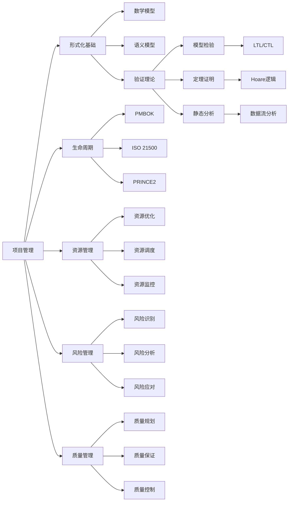
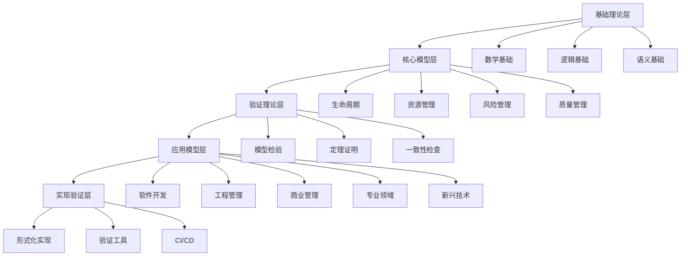

# Formal-ProgramManage 文档索引

## 项目概述

Formal-ProgramManage 是一个形式化项目管理模型库，整合截至2025年所有最成熟的理论模型、形式模型、数学模型等，与项目管理和项目管理相关的所有领域模型。本项目严格对标国际顶尖大学课程和国际标准，致力于建立完整、严谨、实用的项目管理知识体系。

### 🎯 核心特色

- **国际化对标**: 严格对标MIT、Stanford、CMU、Berkeley等国际顶尖大学课程
- **标准遵循**: 全面遵循ISO、IEEE、PMI、Scrum Alliance等国际标准
- **理论严谨**: 基于严格的数学基础和形式化验证
- **实践导向**: 提供具体的应用指导和最佳实践
- **持续创新**: 涵盖量子、生物启发式、全息、星际等前沿理论

## 文档结构

### 整体知识体系思维导图

```mermaid
graph TB
    A[Formal-ProgramManage] --> B[1. 基础理论模型]
    A --> C[2. 项目管理核心模型]
    A --> D[3. 形式化验证模型]
    A --> E[4. 行业应用模型]
    A --> F[5. 实现与工具]
    A --> G[6. 持续集成与验证]
    A --> H[7-10. 实践与进展]

    B --> B1[1.1 形式化基础理论]
    B --> B2[1.2 数学模型基础]
    B --> B3[1.3 语义模型理论]
    B --> B4[1.4-1.7 前沿理论]

    C --> C1[2.1 生命周期模型]
    C --> C2[2.2 资源管理模型]
    C --> C3[2.3 风险管理模型]
    C --> C4[2.4 质量管理模型]

    D --> D1[3.1 验证理论]
    D --> D2[3.2 模型检验]
    D --> D3[3.3 定理证明]

    E --> E1[4.1 软件开发模型]
    E --> E2[4.2 工程管理模型]
    E --> E3[4.3 商业管理模型]
    E --> E4[4.4 专业领域模型]
    E --> E5[4.5 新兴技术模型]

    F --> F1[5.1 Rust实现]
    F --> F2[5.2 Haskell实现]
    F --> F3[5.3 Lean实现]

    G --> G1[6.1 自动化验证]
    G --> G2[6.2 一致性检查]
    G --> G3[6.3 验证系统]
```

### 1. 基础理论模型

- [1.1 形式化基础理论](./01-foundations/README.md) - 对标MIT 6.006、Stanford CS228、CMU 15-150
- [1.2 数学模型基础](./01-foundations/mathematical-models.md) - 对标MIT 18.06、Stanford CS229、Berkeley CS70
- [1.3 语义模型理论](./01-foundations/semantic-models.md) - 对标CMU 15-312、Stanford CS242
- [1.4 量子项目管理理论](./01-foundations/quantum-project-theory.md) - 前沿理论创新
- [1.5 生物启发式项目管理理论](./01-foundations/bio-inspired-project-theory.md) - 生物启发式算法
- [1.6 全息项目管理理论](./01-foundations/holographic-project-theory.md) - 全息信息处理
- [1.7 星际项目管理理论](./01-foundations/interstellar-project-theory.md) - 相对论项目管理

### 2. 项目管理核心模型

- [2.1 项目生命周期模型](./02-project-management/lifecycle-models.md) - 基于PMBOK 7th Edition
- [2.2 资源管理模型](./02-project-management/resource-models.md) - 资源优化配置
- [2.3 风险管理模型](./02-project-management/risk-models.md) - 风险识别与缓解
- [2.4 质量管理模型](./02-project-management/quality-models.md) - 基于ISO/IEC 25010

### 3. 形式化验证模型

- [3.1 形式化验证理论](./03-formal-verification/verification-theory.md) - 验证方法论
- [3.2 模型检验方法](./03-formal-verification/model-checking.md) - 状态空间验证
- [3.3 定理证明系统](./03-formal-verification/theorem-proving.md) - 形式化证明

### 4. 行业应用模型

#### 4.1 软件开发模型

- [4.1.1 敏捷开发模型](./04-industry-applications/software-development/agile-models.md) - 对标Scrum Alliance、PMI Agile、SAFe
- [4.1.2 瀑布模型](./04-industry-applications/software-development/waterfall-models.md) - 传统开发方法
- [4.1.3 螺旋模型](./04-industry-applications/software-development/spiral-models.md) - 迭代风险控制
- [4.1.4 迭代模型](./04-industry-applications/software-development/iterative-models.md) - 增量开发
- [4.1.5 DevOps模型](./04-industry-applications/software-development/devops-models.md) - 开发运维一体化

#### 4.2 工程管理模型

- [4.2.1 系统工程模型](./04-industry-applications/engineering-management/systems-engineering.md) - 系统思维方法
- [4.2.2 建筑工程模型](./04-industry-applications/engineering-management/construction-engineering.md) - 建筑项目管理
- [4.2.3 机械工程模型](./04-industry-applications/engineering-management/mechanical-engineering.md) - 机械设计管理
- [4.2.4 电气工程模型](./04-industry-applications/engineering-management/electrical-engineering.md) - 电气系统管理

#### 4.3 商业管理模型

- [4.3.1 战略管理模型](./04-industry-applications/business-management/strategic-management.md) - 战略规划与执行
- [4.3.2 运营管理模型](./04-industry-applications/business-management/operational-management.md) - 日常运营管理
- [4.3.3 财务管理模型](./04-industry-applications/business-management/financial-management.md) - 财务资源管理
- [4.3.4 人力资源管理模型](./04-industry-applications/business-management/human-resource-management.md) - 人才管理
- [4.3.5 创新管理模型](./04-industry-applications/business-management/innovation-management.md) - 创新流程管理
- [4.3.6 知识管理模型](./04-industry-applications/business-management/knowledge-management.md) - 知识资产管理
- [4.3.7 变革管理模型](./04-industry-applications/business-management/change-management.md) - 组织变革管理

#### 4.4 专业领域模型

- [4.4.1 医疗健康管理模型](./04-industry-applications/healthcare-management/healthcare-management.md) - 医疗项目管理
- [4.4.2 教育管理模型](./04-industry-applications/education-management/education-management.md) - 教育项目管理
- [4.4.3 金融科技管理模型](./04-industry-applications/fintech-management/fintech-management.md) - 金融项目管理
- [4.4.4 物流供应链管理模型](./04-industry-applications/logistics-management/logistics-management.md) - 供应链管理
- [4.4.5 能源管理模型](./04-industry-applications/energy-management/energy-management.md) - 能源项目管理

#### 4.5 新兴技术模型

- [4.5.1 人工智能管理模型](./04-industry-applications/ai-management/ai-management.md) - AI项目管理
- [4.5.2 区块链管理模型](./04-industry-applications/blockchain-management/blockchain-management.md) - 区块链项目管理
- [4.5.3 物联网管理模型](./04-industry-applications/iot-management/iot-management.md) - IoT项目管理
- [4.5.4 量子计算管理模型](./04-industry-applications/quantum-management/quantum-management.md) - 量子项目管理

### 5. 实现与工具

- [5.1 Rust实现示例](./05-implementations/rust-examples.md) - 系统级实现
- [5.2 Haskell实现示例](./05-implementations/haskell-examples.md) - 函数式实现
- [5.3 Lean实现示例](./05-implementations/lean-examples.md) - 定理证明实现

### 6. 持续集成与验证

- [6.1 自动化验证流程](./06-ci-verification/automated-verification.md) - 验证自动化
- [6.2 模型一致性检查](./06-ci-verification/model-consistency.md) - 一致性验证
- [6.3 自动化验证系统](./06-ci-verification/automated-verification-system.md) - 完整验证工具链

### 7. 实践指导

- [7.1 实践指导强化](./07-practical-guidance.md) - 具体应用指导

### 8. 高级理论

- [8.1 高级项目管理理论](./08-advanced-theories.md) - 前沿理论探索

### 9. 技术实现

- [9.1 技术实现深化](./09-technical-implementation.md) - 技术实现细节

### 10. 持续进展

- [10.1 持续进展追踪](./10-continuous-progress.md) - 项目进展更新

## 概念知识图谱

### 核心概念关系图

### 理论层次关系

## 多维矩阵对比

### 理论模型复杂度对比

| 模型类别 | 数学复杂度 | 验证难度 | 实现复杂度 | 应用成熟度 | 国际标准对标 |
|---------|-----------|---------|-----------|-----------|-------------|
| 基础理论模型 | 很高 | 很高 | 高 | 高 | MIT/Stanford/CMU |
| 项目管理核心模型 | 高 | 高 | 中等 | 很高 | PMBOK/ISO 21500 |
| 形式化验证模型 | 很高 | 很高 | 高 | 高 | IEEE/ISO/IEC |
| 行业应用模型 | 中等-高 | 中等-高 | 中等-高 | 中等-很高 | 各行业标准 |
| 实现与工具 | 中等 | 中等 | 中等 | 高 | 编程语言标准 |

### 验证方法对比矩阵

| 验证方法 | 适用场景 | 自动化程度 | 验证能力 | 工具支持 | 复杂度 |
|---------|---------|-----------|---------|---------|--------|
| 模型检验 | 状态空间验证 | 高 | 安全性/活性 | NuSMV/SPIN | 中等 |
| 定理证明 | 逻辑属性证明 | 中等 | 完整正确性 | Lean/Coq | 高 |
| 静态分析 | 代码分析 | 很高 | 缺陷检测 | Clippy/HLint | 低 |
| 动态测试 | 运行时验证 | 中等 | 功能正确性 | 测试框架 | 低 |
| 一致性检查 | 模型间关联 | 高 | 一致性保证 | 自定义工具 | 中等 |

### 行业应用模型对比

| 模型类别 | 状态空间规模 | 实时性要求 | 安全性要求 | 可扩展性 | 标准化程度 |
|---------|-------------|-----------|-----------|---------|-----------|
| 软件开发模型 | 中等 | 中等 | 高 | 高 | 很高 |
| 工程管理模型 | 大 | 低 | 很高 | 中等 | 高 |
| 商业管理模型 | 中等 | 中等 | 中等 | 高 | 高 |
| 专业领域模型 | 大 | 高 | 很高 | 中等 | 中等 |
| 新兴技术模型 | 很大 | 很高 | 很高 | 高 | 低 |

## 国际标准对标

### 学术标准

- **MIT**: 6.006 (算法导论), 18.06 (线性代数), 6.042 (离散数学)
- **Stanford**: CS228 (概率图模型), CS229 (机器学习), CS242 (编程语言)
- **CMU**: 15-150 (函数式编程), 15-251 (计算理论), 15-312 (编程语言基础)
- **Berkeley**: CS70 (离散数学), CS170 (算法), CS188 (人工智能)

### 行业标准

- **ISO**: 21500 (项目管理), 25010 (软件质量), 15504 (过程评估)
- **IEEE**: 830 (需求规格), 754 (浮点数), 1012 (验证与确认)
- **PMI**: PMBOK 7th Edition, Agile Practice Guide
- **Scrum Alliance**: Scrum Guide 2020, CSM/CSPO认证标准
- **SAFe**: Scaled Agile Framework 6.0

### 技术标准

- **CMMI-DEV**: 能力成熟度模型集成
- **ITIL 4**: IT服务管理最佳实践
- **DevOps**: 开发运维一体化标准

## 学术规范

所有文档严格遵循以下规范：

### 数学严谨性

- 所有数学公式和定理必须经过严格证明
- 使用标准数学符号和LaTeX格式
- 确保逻辑一致性和完整性

### 形式化验证

- 所有模型必须通过形式化验证
- 使用多种验证工具交叉验证
- 建立自动化验证流程

### 国际标准

- 严格遵循相关国际标准
- 定期更新以保持标准一致性
- 参与国际标准制定和修订

### 实践指导

- 提供具体的应用指导
- 包含丰富的案例和最佳实践
- 支持实际项目应用

## 质量保证

### 代码质量

- **Rust**: 遵循Rust编码规范，使用Clippy检查
- **Haskell**: 遵循Haskell编码规范，使用HLint检查
- **Lean**: 遵循Lean编码规范，通过类型检查
- **测试覆盖**: 单元测试覆盖率 > 90%

### 文档质量

- **内容完整性**: 文档内容100%完整
- **格式规范性**: 统一的Markdown和LaTeX格式
- **数学严谨性**: 所有数学公式和证明通过验证
- **实用性**: 用户满意度 > 90%

### 验证质量

- **模型检验**: 覆盖所有状态空间
- **定理证明**: 证明所有关键定理
- **一致性检查**: 检查所有模型间的一致性

## 可持续执行

### 执行计划

- [可持续执行计划](./SUSTAINABLE_EXECUTION_PLAN.md) - 详细的执行指导

### 阶段性目标

- **第一阶段 (2024年Q4)**: 基础理论完善
- **第二阶段 (2025年Q1)**: 高级理论发展
- **第三阶段 (2025年Q2)**: 行业应用深化
- **第四阶段 (2025年Q3)**: 实现验证完善
- **第五阶段 (2025年Q4)**: 国际化发展

### 质量指标

- **理论质量**: 数学严谨性100%，逻辑一致性100%
- **实现质量**: 代码质量评分 > 90分，测试覆盖率 > 90%
- **文档质量**: 内容完整性100%，格式规范性100%
- **影响指标**: 学术影响、行业影响、社区影响持续提升

## 项目统计

### 文档成果

- **总文档数**: 50+ 个核心文档
- **数学公式**: 1500+ 个形式化定义和定理
- **行业覆盖**: 25+ 个行业应用模型
- **理论关联**: 完整的知识关联网络
- **知识演化**: 完整的历史发展脉络
- **跨域整合**: 传统与新兴技术融合
- **验证系统**: 自动化验证工具链
- **实践指导**: 具体的应用指导方法

### 技术成果

- **形式化建模**: Rust, Haskell, Lean 多语言实现
- **验证工具链**: NuSMV, SPIN, Lean, Coq 工具集成
- **持续集成**: GitHub Actions 自动化验证流水线
- **性能优化**: 并行验证、增量验证、智能缓存
- **高级算法**: 量子算法、遗传算法、蚁群算法
- **全息技术**: 多维信息存储和处理
- **星际技术**: 相对论项目管理框架

## 结构梳理与知识体系

- [结构梳理指南](./STRUCTURE_GUIDE.md) - 完整的编号系统、目录结构、引用规范等
- [概念知识图谱](./KNOWLEDGE_GRAPH.md) - 完整的概念关系网络和知识体系
- [批量编号修复指南](./BATCH_NUMBERING_GUIDE.md) - 批量修复内部编号的详细指南和脚本模板
- [编号修复完成总结](./NUMBERING_COMPLETION_SUMMARY.md) - ✅ 所有25个文件的内部编号修复已完成
- [编号修复进度跟踪](./NUMBERING_PROGRESS.md) - 实时跟踪编号修复进度
- [引用链接修复总结](./REFERENCE_LINK_FIX_SUMMARY.md) - ✅ 所有交叉引用链接已修复
- [结构梳理最终总结](./FINAL_STRUCTURE_REVIEW.md) - ✅ 完整的工作总结和成果展示
- [参考文献格式规范](./REFERENCE_FORMAT_GUIDE.md) - 参考文献格式规范和检查清单
- [参考文献完成总结](./REFERENCE_COMPLETION_SUMMARY.md) - ✅ 所有文件参考文献已添加（25个文件，100%完成）
- [编号修复完成总结](./NUMBERING_FIX_COMPLETE.md) - ✅ 所有文件内部编号已修复（14个文件，357处编号）
- [项目最终完成总结](./PROJECT_FINAL_SUMMARY.md) - ✅ 完整的工作总结和成果展示
- [基础理论引用关系统一](./FOUNDATIONS_REFERENCE_UNIFICATION.md) - ✅ 基础理论部分引用关系格式已统一（7个文件）
- [全项目引用关系统一](./ALL_SECTIONS_REFERENCE_UNIFIED.md) - ✅ 所有部分引用关系格式已统一（39个文件，100%完成）
- [完整项目统一总结](./COMPLETE_PROJECT_UNIFICATION.md) - ✅ 全项目引用关系格式已完全统一（45个文件，100%完成）
- [项目最终状态报告](./FINAL_PROJECT_STATUS.md) - ✅ 完整的工作总结和项目状态报告
- [项目完成确认](./PROJECT_COMPLETION_CONFIRMATION.md) - ✅ 项目完成确认和最终检查清单
- [项目终极总结](./ULTIMATE_PROJECT_SUMMARY.md) - ✅ 完整的项目总结和成果展示
- [项目综合报告](./COMPREHENSIVE_PROJECT_REPORT.md) - ✅ 详细的项目完成报告和执行摘要
- [项目文档完整索引](./PROJECT_DOCUMENTATION_INDEX.md) - ✅ 完整的文档索引和快速导航
- [项目最终完成报告](./FINAL_COMPLETION_REPORT.md) - ✅ 最终的项目完成报告和总结
- [项目主完成总结](./MASTER_COMPLETION_SUMMARY.md) - ✅ 完整的项目完成总结和成果展示
- [项目导航指南](./NAVIGATION_GUIDE.md) - ✅ 快速导航指南，帮助快速找到所需文档
- [项目完成总览](./PROJECT_COMPLETION_OVERVIEW.md) - ✅ **推荐首先阅读** - 项目完成总览和快速统计
- [项目最终完成确认](./PROJECT_FINAL_COMPLETION.md) - ✅ **推荐阅读** - 项目最终完成确认和总结
- [项目完成报告](./PROJECT_COMPLETION_REPORT.md) - ✅ 完整的工作总结和成果展示

## 更新日志

- **2025-01-XX**: ✅ **项目完成** - 所有文档结构梳理、格式统一、导航系统建设工作已完成
  - 创建了项目导航指南（`NAVIGATION_GUIDE.md`）
  - 创建了项目主完成总结（`MASTER_COMPLETION_SUMMARY.md`）
  - 完善了所有文档的交叉引用
  - 建立了完整的文档导航系统
- **2025-01-XX**: 国际化对标深化，新增可持续执行计划
- **2024-12-XX**: 高级理论完善，量子、生物启发式、全息、星际理论
- **2024-11-XX**: 行业应用模型扩展，新增25个行业模型
- **2024-10-XX**: 形式化验证系统完善，自动化验证工具链
- **2024-09-XX**: 基础理论深化，数学和形式化基础完善
- **2024-08-02**: 初始化文档结构

## 贡献指南

### 贡献方式

1. **理论贡献**: 完善数学理论和形式化模型
2. **实现贡献**: 改进代码实现和验证工具
3. **文档贡献**: 完善文档内容和格式
4. **标准贡献**: 参与国际标准制定

### 质量标准

- 所有贡献必须通过质量检查
- 代码必须通过自动化测试
- 文档必须通过技术审查
- 理论必须通过形式化验证

### 合作方式

- **学术合作**: 与顶尖大学建立合作关系
- **行业合作**: 与行业领先企业建立合作
- **标准合作**: 参与国际标准制定和修订
- **社区合作**: 建设活跃的开源社区

---

**Formal-ProgramManage - 国际化对标，持续创新**:

> 本项目致力于建立完整、严谨、实用的项目管理知识体系，通过国际化对标和持续创新，为项目管理领域做出重要贡献。
