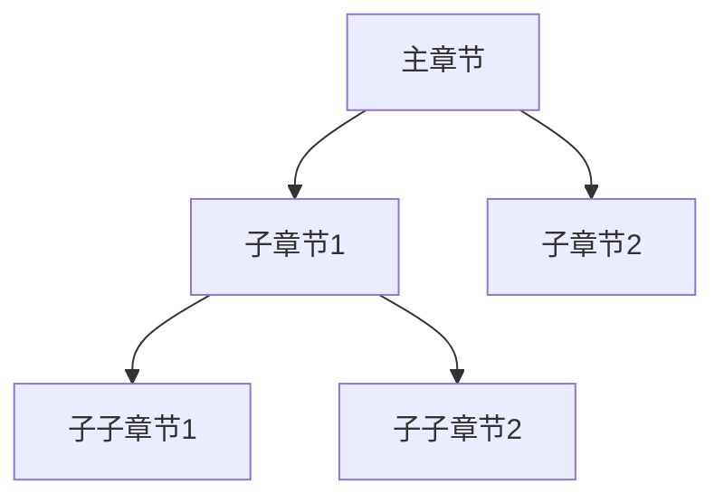
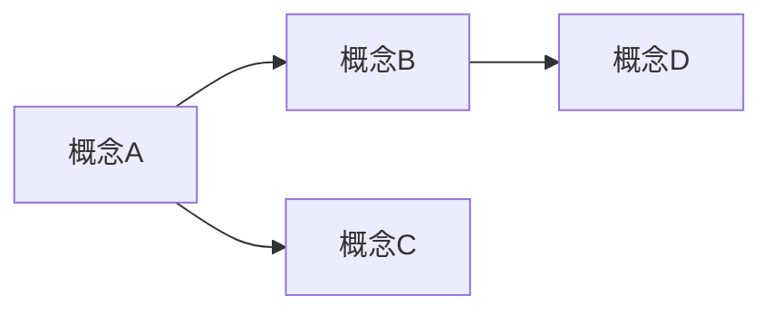

# Formal-ProgramManage 结构梳理指南

## 概述

本文档提供Formal-ProgramManage项目的完整结构梳理指南，包括编号系统、目录结构、引用规范等，确保整个项目保持结构一致性。

## 1. 编号系统规范

### 1.1 章节编号规则

#### 主章节编号

- 使用单数字：`1`, `2`, `3`, `4`, `5`, `6`, `7`, `8`, `9`, `10`
- 对应目录：`01-foundations`, `02-project-management`, `03-formal-verification`, `04-industry-applications`, `05-implementations`, `06-ci-verification`, `07-practical-guidance`, `08-advanced-theories`, `09-technical-implementation`, `10-continuous-progress`

#### 一级子章节编号

- 格式：`X.Y`，其中 `X` 是主章节号，`Y` 是子章节号（从1开始）
- 示例：`1.1`, `1.2`, `2.1`, `3.1`

#### 二级子章节编号

- 格式：`X.Y.Z`，其中 `Z` 是二级子章节号（从1开始）
- 示例：`1.1.1`, `1.1.2`, `2.1.1`

#### 三级子章节编号

- 格式：`X.Y.Z.W`，其中 `W` 是三级子章节号（从1开始）
- 示例：`1.1.1.1`, `4.1.1.1`

### 1.2 定义编号规则

- 格式：`定义 X.Y.Z`，其中 `X.Y.Z` 对应章节编号
- 示例：`定义 1.1.1`, `定义 2.1.1`, `定义 3.1.1`
- 如果同一章节有多个定义，使用序号：`定义 1.1.1`, `定义 1.1.2`, `定义 1.1.3`

### 1.3 定理编号规则

- 格式：`定理 X.Y.Z`，其中 `X.Y.Z` 对应章节编号
- 示例：`定理 1.1.1`, `定理 2.1.1`
- 如果同一章节有多个定理，使用序号：`定理 1.1.1`, `定理 1.1.2`

### 1.4 算法编号规则

- 格式：`算法 X.Y.Z`，其中 `X.Y.Z` 对应章节编号
- 示例：`算法 3.1.1`, `算法 3.2.1`

### 1.5 规则编号规则

- 格式：`规则 X.Y.Z`，其中 `X.Y.Z` 对应章节编号
- 示例：`规则 3.3.1`, `规则 3.3.2`

### 1.6 公理编号规则

- 格式：`公理 X.Y.Z`，其中 `X.Y.Z` 对应章节编号
- 示例：`公理 1.1.1`, `公理 1.1.2`

## 2. 目录结构规范

### 2.1 目录命名规范

- 使用小写字母和连字符：`01-foundations`, `02-project-management`
- 目录名与章节编号对应
- 子目录使用描述性名称：`software-development`, `engineering-management`

### 2.2 文件命名规范

- 使用小写字母和连字符：`verification-theory.md`, `lifecycle-models.md`
- 文件名应描述文件内容
- README文件用于目录索引

### 2.3 文件组织规范

```
docs/
├── 01-foundations/          # 基础理论
│   ├── README.md            # 1.1 形式化基础理论
│   ├── mathematical-models.md  # 1.2 数学模型基础
│   └── ...
├── 02-project-management/   # 项目管理核心模型
│   ├── lifecycle-models.md  # 2.1 项目生命周期模型
│   └── ...
├── 03-formal-verification/  # 形式化验证模型
│   ├── verification-theory.md  # 3.1 形式化验证理论
│   └── ...
└── ...
```

## 3. 引用规范

### 3.1 内部引用格式

- 章节引用：`[X.Y 章节名称](./path/to/file.md)`
- 定义引用：`参见 [定义 X.Y.Z](./path/to/file.md#定义-xyz)`
- 定理引用：`参见 [定理 X.Y.Z](./path/to/file.md#定理-xyz)`

### 3.2 外部引用格式

- 学术论文：`Author, A. (Year). Title. Journal, Volume(Issue), Pages.`
- 标准文档：`ISO 21500:2021. Title. Organization.` 或 `ISO 21502:2020. Title. Organization.`（见 [STANDARDS_ALIGNMENT.md](./STANDARDS_ALIGNMENT.md)）
- 书籍：`Author, A. (Year). Title. Publisher.`

### 3.3 参考文献格式

所有文档应在末尾包含"参考文献"部分，格式如下：

```markdown
## 参考文献

1. Author, A. (Year). Title. Journal, Volume(Issue), Pages.
2. ISO 21500:2021 或 ISO 21502:2020. Title. Organization.
```

## 4. 内容结构规范

### 4.1 标准文档结构

每个文档应包含以下部分（按顺序）：

1. **标题**：`# X.Y 章节名称`
2. **概述**：介绍章节内容和目标
3. **主要内容**：按子章节组织
4. **思维导图**（可选）：使用Mermaid格式
5. **多维矩阵对比**（可选）：对比表格
6. **相关链接**：内部引用
7. **参考文献**：外部引用

**直观/应用解释规范**：为降低认知负荷、支持应用优先阅读，建议每章（尤其 04-industry-applications 与长文档）包含 **§ 直观解释** 或 **§ 应用场景/应用解释** 至少其一；若已有 §6 Explanations，其中应含「直观解释」「应用解释」子节。后续审阅时逐步补全缺失章节。详见 [THREE_LAYER_EXPLANATIONS.md](./THREE_LAYER_EXPLANATIONS.md)、[LEARNING_PATHS.md](./LEARNING_PATHS.md) 应用优先路径。

### 4.2 章节内容要求

- **概述**：每个主要章节必须有概述部分
- **形式化定义**：所有模型必须有形式化数学定义
- **验证方法**：所有模型应包含验证方法
- **实现示例**：提供代码实现示例（Rust/Haskell/Lean）
- **国际标准对标**：标注对标的国际标准
- **术语引用**：核心概念首次出现时应链接至 [GLOSSARY.md](./GLOSSARY.md) 或 [术语表（Glossary）](../templates_and_standards/术语表-Glossary.md)；季度审查时检查术语与各文档交叉引用一致性（见 [SUSTAINABLE_EXECUTION_PLAN.md](./SUSTAINABLE_EXECUTION_PLAN.md)）。

### 4.3 五类链接模板（核心文档推荐）

在核心文档开头或「相关链接」处，建议按需包含以下五类链接，便于依赖与导航（详见 [LEARNING_PATHS.md](./LEARNING_PATHS.md)、[THREE_LAYER_EXPLANATIONS.md](./THREE_LAYER_EXPLANATIONS.md)）：

```markdown
**前置知识 (Prerequisites)**： [FL-1.1 形式化基础](./01-foundations/README.md)（必需）、[FL-1.2 数学模型](./01-foundations/mathematical-models.md)（推荐）。详见 [01-learning-prerequisites.md](./12-learning-support/01-learning-prerequisites.md)。

**应用 (Application)**： [4.1 软件开发模型](./04-industry-applications/software-development/)、[4.2 工程管理](./04-industry-applications/engineering-management/)。

**相关 (Related)**： [2.2 资源管理](./02-project-management/resource-models.md)、[2.3 风险管理](./02-project-management/risk-models.md)。

**深化 (Deep Dive)**： Level 1 概念 → Level 2 定量模型 → Level 3 形式化验证（见各章内锚点）。

**对比 (Comparison)**： [PMBOK 8th 对标](./PMBOK_8_ALIGNMENT_PLAN.md)、[STANDARDS_ALIGNMENT.md](./STANDARDS_ALIGNMENT.md)。
```

### 4.4 认知分块规范（Cognitive Chunking）

为控制认知负荷、符合工作记忆限制（约 5–7 个组块），建议：

- **一级标题下**：子概念或子节数量以 **5–7 个** 为佳。
- **每个概念下**：要点或子点以 **3–5 个** 为佳。
- **三级及以下**：以具体实例、步骤或细节为主，避免单节过长。

详见 [12-learning-support/README.md](./12-learning-support/README.md) 与 [LEARNING_PATHS.md](./LEARNING_PATHS.md)。

### 4.5 概念卡片（Concept Card）模板

为支持图式构建与快速检索，核心概念可采用「概念卡片」统一结构（What/How/When），并链到 [GLOSSARY.md](./GLOSSARY.md) 与 [THREE_LAYER_EXPLANATIONS.md](./THREE_LAYER_EXPLANATIONS.md)：

| 区块 | 内容 |
|------|------|
| **What（是什么）** | 一句话定义；3–5 个关键要素；可选图示或类比 |
| **How（怎么做/如何用）** | 应用步骤或判定方法；可链到具体章节与工具 |
| **When（何时用）** | 适用场景；与相似概念的区分（可链到交错学习路径） |
| **形式化/延伸** | 链到正式定义（定义 X.Y.Z）、[THREE_LAYER_EXPLANATIONS](./THREE_LAYER_EXPLANATIONS.md)、术语表 |

示例：见 [THREE_LAYER_EXPLANATIONS.md](./THREE_LAYER_EXPLANATIONS.md) 中各概念的一句话/段落/形式化三层及 [12-learning-support/README.md](./12-learning-support/README.md) 学习进度自查表。

## 5. 思维导图规范

### 5.1 Mermaid格式

使用Mermaid格式创建思维导图：



### 5.2 思维导图位置

- 主要章节的README文件应包含整体思维导图
- 子章节可在概述后包含局部思维导图

## 6. 多维矩阵对比规范

### 6.1 对比表格格式

使用Markdown表格格式：

```markdown
| 维度1 | 维度2 | 维度3 | 维度4 |
|------|------|------|------|
| 值1  | 值2  | 值3  | 值4  |
```

### 6.2 常见对比维度

- **复杂度对比**：状态空间复杂度、验证难度、实现复杂度
- **方法对比**：模型检验、定理证明、静态分析、动态测试
- **标准对标**：ISO、IEEE、PMI、Scrum Alliance
- **应用场景**：适用领域、成熟度、实践案例

## 7. 概念知识图谱规范

### 7.1 知识图谱结构

知识图谱应展示：

- 概念之间的层次关系
- 概念之间的依赖关系
- 概念之间的引用关系

### 7.2 知识图谱格式

使用Mermaid格式或专门的图谱文档：



## 8. 编号一致性检查清单

### 8.1 文件级别检查

- [ ] 所有文件标题编号符合规范
- [ ] 所有目录README编号正确
- [ ] 主README中的链接编号正确

### 8.2 内容级别检查

- [ ] 所有定义编号符合规范
- [ ] 所有定理编号符合规范
- [ ] 所有算法编号符合规范
- [ ] 所有规则编号符合规范
- [ ] 所有公理编号符合规范

### 8.3 引用级别检查

- [ ] 所有内部引用链接正确
- [ ] 所有交叉引用编号正确
- [ ] 所有外部引用格式正确

## 9. 结构梳理流程

### 9.1 初始梳理

1. 检查所有文件标题编号
2. 统一目录结构
3. 修复编号不一致问题

### 9.2 深度梳理

1. 检查所有内容编号（定义、定理等）
2. 修复所有引用链接
3. 添加思维导图和知识图谱
4. 添加多维矩阵对比

### 9.3 持续维护

1. 新文件遵循编号规范
2. 定期检查编号一致性
3. 更新引用链接

## 10. 编号映射表

### 10.1 04-industry-applications 编号映射

| 旧编号 | 新编号 | 文件 |
|-------|-------|------|
| 4.2.1.1 | 4.1.1 | 敏捷开发模型 |
| 4.2.1.2 | 4.1.2 | 瀑布模型 |
| 4.2.1.3 | 4.1.3 | 螺旋模型 |
| 4.2.1.4 | 4.1.4 | 迭代模型 |
| 4.2.1.5 | 4.1.5 | DevOps模型 |
| 4.2.2.1 | 4.2.1 | 系统工程模型 |
| 4.2.2.2 | 4.2.2 | 建筑工程模型 |
| 4.2.2.3 | 4.2.3 | 机械工程模型 |
| 4.2.2.4 | 4.2.4 | 电气工程模型 |
| 4.2.3.1 | 4.3.1 | 战略管理模型 |
| 4.2.3.2 | 4.3.2 | 运营管理模型 |
| 4.2.3.3 | 4.3.3 | 财务管理模型 |
| 4.2.3.4 | 4.3.4 | 人力资源管理模型 |
| 4.2.4.1 | 4.3.5 | 创新管理模型 |
| 4.2.4.2 | 4.3.6 | 知识管理模型 |
| 4.2.4.3 | 4.3.7 | 变革管理模型 |
| 4.2.5.1 | 4.4.1 | 医疗健康管理模型 |
| 4.2.5.2 | 4.4.2 | 教育管理模型 |
| 4.2.5.3 | 4.4.3 | 金融科技管理模型 |
| 4.2.5.4 | 4.4.4 | 物流供应链管理模型 |
| 4.2.5.5 | 4.4.5 | 能源管理模型 |
| 4.2.6.1 | 4.5.1 | 人工智能管理模型 |
| 4.2.6.2 | 4.5.2 | 区块链管理模型 |
| 4.2.6.3 | 4.5.3 | 物联网管理模型 |
| 4.2.6.4 | 4.5.4 | 量子计算管理模型 |

## 11. 后续工作

### 11.1 待完成任务

1. **内部编号统一**：修复所有文件内部的子章节编号、定义编号等
2. **引用链接修复**：更新所有交叉引用链接
3. **思维导图添加**：为主要章节添加思维导图
4. **知识图谱创建**：创建完整的概念知识图谱
5. **多维矩阵完善**：添加更多对比矩阵

### 11.2 自动化工具

建议开发自动化工具：

- 编号检查工具
- 引用链接验证工具
- 结构一致性检查工具

---

**最后更新**：2025-01-XX
**维护者**：Formal-ProgramManage团队
