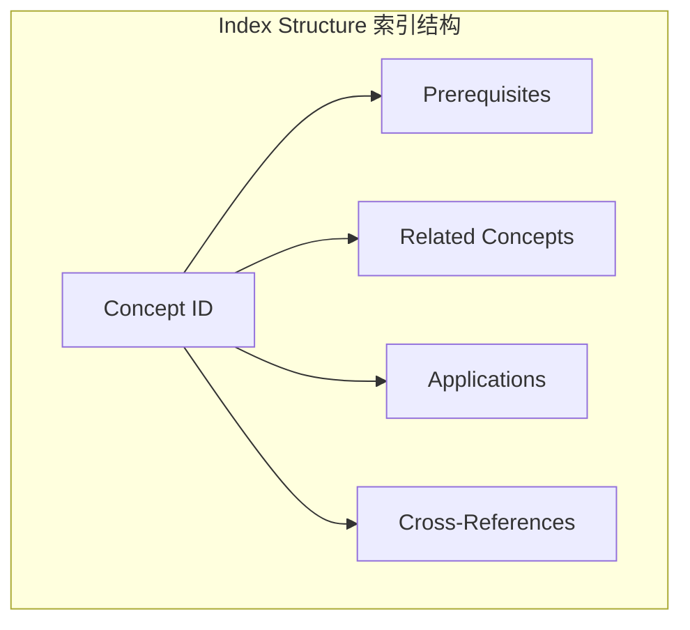
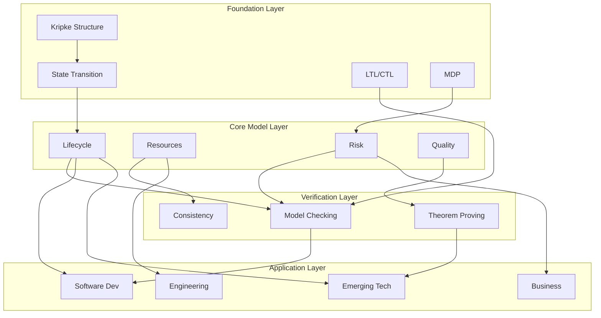

# Concept Linking Index / 概念链接索引

## 1. Overview / 概述

### 1.1 Introduction / 简介

**English**: This document provides a comprehensive concept linking index for the Formal-ProgramManage knowledge system. It maps relationships between concepts, defines prerequisite dependencies, and enables navigation across the knowledge structure.

**中文**: 本文档为Formal-ProgramManage知识体系提供全面的概念链接索引。它映射概念之间的关系，定义先备知识依赖，并支持在知识结构中导航。

### 1.2 Index Structure / 索引结构

---

## 2. Foundation Layer (FL) Concept Links / 基础理论层概念链接

### 2.1 FL-1.1 Formal Foundations / 形式化基础

#### Concept: Kripke Structure / Kripke结构

| Attribute | Value |
|-----------|-------|
| **ID** | FL-1.1.1 |
| **Name** | Kripke Structure / Kripke结构 |
| **Definition Location** | `docs/01-foundations/README.md` |
| **Prerequisites** | Set theory (external), Binary relations (external), Propositional logic (external) |
| **Leads To** | Model Checking (VL-3.1.1), State Space (FL-1.1.2) |
| **Related Concepts** | State Transition System (FL-1.1.2), LTL (FL-1.1.3), CTL (FL-1.1.4) |
| **Applications** | Project State Modeling (CML-2.1), Workflow Verification (VL-3.1) |

#### Concept: State Transition System / 状态转换系统

| Attribute | Value |
|-----------|-------|
| **ID** | FL-1.1.2 |
| **Name** | State Transition System / 状态转换系统 |
| **Definition Location** | `docs/01-foundations/README.md` |
| **Prerequisites** | Kripke Structure (FL-1.1.1), Set theory (external) |
| **Leads To** | Project State Space (CML-2.1.1), Lifecycle Models (CML-2.1) |
| **Related Concepts** | Kripke Structure (FL-1.1.1), Automata (external) |
| **Applications** | Project Lifecycle (CML-2.1), Phase Transitions (CML-2.1.2) |

#### Concept: LTL (Linear Temporal Logic) / 线性时序逻辑

| Attribute | Value |
|-----------|-------|
| **ID** | FL-1.1.3 |
| **Name** | LTL / 线性时序逻辑 |
| **Definition Location** | `docs/01-foundations/README.md` |
| **Prerequisites** | Propositional logic (external), Path semantics (external) |
| **Leads To** | Model Checking (VL-3.1.1), Property Specification (VL-3.1.2) |
| **Related Concepts** | CTL (FL-1.1.4), Safety Properties (VL-3.1.3), Liveness (VL-3.1.4) |
| **Applications** | Workflow Verification (VL-3.1), Schedule Verification (CML-2.1) |

#### Concept: CTL (Computation Tree Logic) / 计算树逻辑

| Attribute | Value |
|-----------|-------|
| **ID** | FL-1.1.4 |
| **Name** | CTL / 计算树逻辑 |
| **Definition Location** | `docs/01-foundations/README.md` |
| **Prerequisites** | LTL (FL-1.1.3), Tree semantics (external), State branching (external) |
| **Leads To** | CTL Model Checking (VL-3.2.2), Branching Analysis (VL-3.1) |
| **Related Concepts** | LTL (FL-1.1.3), Kripke Structure (FL-1.1.1) |
| **Applications** | Decision Point Analysis (CML-2.1), Risk Branching (CML-2.3) |

### 2.2 FL-1.2 Mathematical Models / 数学模型

#### Concept: Markov Decision Process (MDP) / 马尔可夫决策过程

| Attribute | Value |
|-----------|-------|
| **ID** | FL-1.2.1 |
| **Name** | MDP / 马尔可夫决策过程 |
| **Definition Location** | `docs/01-foundations/mathematical-models.md` |
| **Prerequisites** | Probability theory (external), State machines (FL-1.1.2), Optimization (external) |
| **Leads To** | Risk Quantification (CML-2.3.2), Decision Analysis (CML-2.3.4) |
| **Related Concepts** | Markov Chains (external), Value Functions (FL-1.2.2) |
| **Applications** | Project Decision Making (CML-2.3), Resource Optimization (CML-2.2) |

#### Concept: Value Function / 价值函数

| Attribute | Value |
|-----------|-------|
| **ID** | FL-1.2.2 |
| **Name** | Value Function / 价值函数 |
| **Definition Location** | `docs/01-foundations/mathematical-models.md` |
| **Prerequisites** | MDP (FL-1.2.1), Bellman Equation (external) |
| **Leads To** | Optimal Policy (FL-1.2.3), Decision Optimization (CML-2.3) |
| **Related Concepts** | MDP (FL-1.2.1), Reward Functions (external) |
| **Applications** | Project Valuation (CML-2.3), ROI Analysis (AL-4.3) |

---

## 3. Core Model Layer (CML) Concept Links / 核心模型层概念链接

### 3.1 CML-2.1 Lifecycle Models / 生命周期模型

#### Concept: Project Lifecycle / 项目生命周期

| Attribute | Value |
|-----------|-------|
| **ID** | CML-2.1.1 |
| **Name** | Project Lifecycle / 项目生命周期 |
| **Definition Location** | `docs/02-project-management/lifecycle-models.md` |
| **Prerequisites** | State Transition System (FL-1.1.2), PMBOK basics (external) |
| **Leads To** | Phase Management (CML-2.1.2), Lifecycle Verification (VL-3.1) |
| **Related Concepts** | PMBOK Process Groups (CML-2.1.3), Agile Lifecycles (AL-4.1.1) |
| **Applications** | All project types, Industry Applications (AL-4.x) |

#### Concept: Phase Transition / 阶段转换

| Attribute | Value |
|-----------|-------|
| **ID** | CML-2.1.2 |
| **Name** | Phase Transition / 阶段转换 |
| **Definition Location** | `docs/02-project-management/lifecycle-models.md` |
| **Prerequisites** | Project Lifecycle (CML-2.1.1), State Transitions (FL-1.1.2) |
| **Leads To** | Gate Reviews (CML-2.1.4), Transition Verification (VL-3.1) |
| **Related Concepts** | Milestone (CML-2.1.5), Deliverable (CML-2.4) |
| **Applications** | Phase-gate projects, Waterfall (AL-4.1.2) |

### 3.2 CML-2.2 Resource Models / 资源管理模型

#### Concept: Resource Allocation / 资源分配

| Attribute | Value |
|-----------|-------|
| **ID** | CML-2.2.1 |
| **Name** | Resource Allocation / 资源分配 |
| **Definition Location** | `docs/02-project-management/resource-models.md` |
| **Prerequisites** | Resource Types (CML-2.2.2), Constraints (FL-1.2.3) |
| **Leads To** | Resource Optimization (CML-2.2.3), Scheduling (CML-2.2.4) |
| **Related Concepts** | Capacity Planning (CML-2.2.5), Resource Leveling (CML-2.2.6) |
| **Applications** | All projects, Multi-project Management (AL-4.x) |

#### Concept: Resource Constraints / 资源约束

| Attribute | Value |
|-----------|-------|
| **ID** | CML-2.2.2 |
| **Name** | Resource Constraints / 资源约束 |
| **Definition Location** | `docs/02-project-management/resource-models.md` |
| **Prerequisites** | Set theory (external), Optimization (external) |
| **Leads To** | Constraint Verification (VL-3.3), Scheduling (CML-2.2.4) |
| **Related Concepts** | Budget Constraints (CML-2.2.7), Time Constraints (CML-2.1) |
| **Applications** | Resource Planning, SMT Verification (VL-3.3) |

### 3.3 CML-2.3 Risk Models / 风险管理模型

#### Concept: Risk Identification / 风险识别

| Attribute | Value |
|-----------|-------|
| **ID** | CML-2.3.1 |
| **Name** | Risk Identification / 风险识别 |
| **Definition Location** | `docs/02-project-management/risk-models.md` |
| **Prerequisites** | Risk Definition (CML-2.3.0), Domain Knowledge (external) |
| **Leads To** | Risk Analysis (CML-2.3.2), Risk Register (CML-2.3.5) |
| **Related Concepts** | Uncertainty (FL-1.2.4), Probability (FL-1.2.1) |
| **Applications** | All projects, ISO 31000 Compliance (external) |

#### Concept: Risk Analysis / 风险分析

| Attribute | Value |
|-----------|-------|
| **ID** | CML-2.3.2 |
| **Name** | Risk Analysis / 风险分析 |
| **Definition Location** | `docs/02-project-management/risk-models.md` |
| **Prerequisites** | Risk Identification (CML-2.3.1), Probability (FL-1.2.1), Statistics (external) |
| **Leads To** | Risk Response (CML-2.3.3), Risk Quantification (CML-2.3.6) |
| **Related Concepts** | Monte Carlo (CML-2.3.7), Decision Trees (CML-2.3.8) |
| **Applications** | Quantitative Risk Analysis, AI Risk (AL-4.4) |

### 3.4 CML-2.4 Quality Models / 质量管理模型

#### Concept: Quality Assurance / 质量保证

| Attribute | Value |
|-----------|-------|
| **ID** | CML-2.4.1 |
| **Name** | Quality Assurance / 质量保证 |
| **Definition Location** | `docs/02-project-management/quality-models.md` |
| **Prerequisites** | Quality Definition (CML-2.4.0), Process Understanding (CML-2.1) |
| **Leads To** | Quality Control (CML-2.4.2), Continuous Improvement (CML-2.4.4) |
| **Related Concepts** | QC (CML-2.4.2), Auditing (CML-2.4.5) |
| **Applications** | ISO 9001, CMMI (external) |

---

## 4. Verification Layer (VL) Concept Links / 验证理论层概念链接

### 4.1 VL-3.1 Model Checking / 模型检验

#### Concept: Model Checking Problem / 模型检验问题

| Attribute | Value |
|-----------|-------|
| **ID** | VL-3.1.1 |
| **Name** | Model Checking / 模型检验 |
| **Definition Location** | `docs/03-formal-verification/model-checking.md` |
| **Prerequisites** | Kripke Structure (FL-1.1.1), LTL (FL-1.1.3), CTL (FL-1.1.4) |
| **Leads To** | Property Verification (VL-3.1.2), Counterexample Analysis (VL-3.1.3) |
| **Related Concepts** | Theorem Proving (VL-3.2), State Space (FL-1.1.2) |
| **Applications** | Workflow Verification, Schedule Verification, TLA+ Practice (11-1) |

#### Concept: Counterexample / 反例

| Attribute | Value |
|-----------|-------|
| **ID** | VL-3.1.2 |
| **Name** | Counterexample / 反例 |
| **Definition Location** | `docs/03-formal-verification/model-checking.md` |
| **Prerequisites** | Model Checking (VL-3.1.1), Path semantics (external) |
| **Leads To** | Bug Detection (VL-3.1.4), Model Refinement (VL-3.1.5) |
| **Related Concepts** | Safety Violation (VL-3.1.6), Liveness Violation (VL-3.1.7) |
| **Applications** | Process Debugging, Risk Detection |

### 4.2 VL-3.2 Theorem Proving / 定理证明

#### Concept: Theorem Proving / 定理证明

| Attribute | Value |
|-----------|-------|
| **ID** | VL-3.2.1 |
| **Name** | Theorem Proving / 定理证明 |
| **Definition Location** | `docs/03-formal-verification/theorem-proving.md` |
| **Prerequisites** | Logic (external), Proof Theory (external), Type Theory (external) |
| **Leads To** | Proof Verification (VL-3.2.2), Certified Systems (VL-3.2.3) |
| **Related Concepts** | Model Checking (VL-3.1.1), Coq/Lean Practice (11-3) |
| **Applications** | Critical Systems, Contract Verification |

---

## 5. Application Layer (AL) Concept Links / 应用模型层概念链接

### 5.1 AL-4.1 Software Development / 软件开发

#### Concept: Agile Development / 敏捷开发

| Attribute | Value |
|-----------|-------|
| **ID** | AL-4.1.1 |
| **Name** | Agile Development / 敏捷开发 |
| **Definition Location** | `docs/04-industry-applications/software-development/agile-models.md` |
| **Prerequisites** | Lifecycle Models (CML-2.1), Iterative Process (external) |
| **Leads To** | Scrum (AL-4.1.2), Kanban (AL-4.1.3), DevOps (AL-4.1.5) |
| **Related Concepts** | Waterfall (AL-4.1.4), Hybrid (AL-4.1.6) |
| **Applications** | Software Projects, IT Projects |

### 5.2 AL-4.4+ Emerging Technologies / 新兴技术

#### Concept: AI Project Management / AI项目管理

| Attribute | Value |
|-----------|-------|
| **ID** | AL-4.4.1 |
| **Name** | AI Project Management / AI项目管理 |
| **Definition Location** | `docs/04-industry-applications/ai-management/ai-management.md` |
| **Prerequisites** | CML Core Models (CML-2.x), AI/ML basics (external) |
| **Leads To** | ML Lifecycle (AL-4.4.2), AI Ethics (AL-4.4.3) |
| **Related Concepts** | Data Management (AL-4.4.4), Model Governance (AL-4.4.5) |
| **Applications** | AI/ML Projects, Data Science Projects |

---

## 6. Cross-Layer Dependency Graph / 跨层次依赖图

---

## 7. Quick Reference Links / 快速参考链接

### 7.1 By Starting Point / 按起点

| If you're starting from... | Go to... |
|---------------------------|----------|
| Set Theory | FL-1.1.1 (Kripke), FL-1.2.x (Math Models) |
| PMBOK Knowledge | CML-2.x (Core Models) |
| Programming | VL-3.x (Verification), IL-5.x (Implementation) |
| Industry Domain | AL-4.x (Applications) |

### 7.2 By Goal / 按目标

| If your goal is... | Focus on... |
|-------------------|-------------|
| Understand formal PM | FL-1.x → CML-2.x |
| Verify processes | CML-2.x → VL-3.x |
| Apply to industry | CML-2.x → AL-4.x |
| Build tools | VL-3.x → IL-5.x |

---

## 8. Status / 状态

**Document Version / 文档版本**: 1.0
**Last Updated / 最后更新**: 2026-02-02
**Status / 状态**: ✅ Complete
**Total Concepts Indexed / 总索引概念数**: 30+
**Next Review / 下次审查**: 2026-05-02

**Related Documents / 相关文档**:

- [Learning Prerequisites](../docs/12-learning-support/01-learning-prerequisites.md)
- [Theme Hierarchy Master](../templates_and_standards/THEME_HIERARCHY_MASTER.md)
- [Concept Index](./CONCEPT_INDEX.md)
