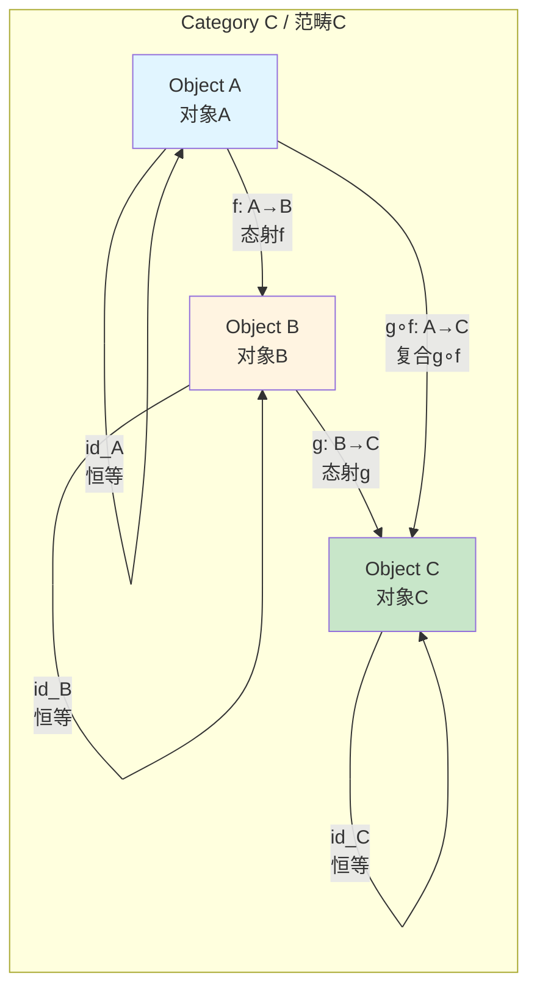
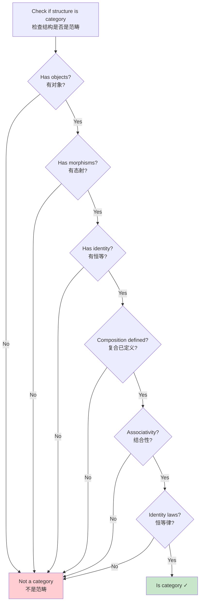

# Category Definition / 范畴定义

## 📋 Table of Contents / 目录

- [Category Definition / 范畴定义](#category-definition--范畴定义)
  - [📋 Table of Contents / 目录](#-table-of-contents--目录)
  - [0. 所属层与转换关系 / Layer and Transformation](#0-所属层与转换关系--layer-and-transformation)
  - [1. Overview / 概述](#1-overview--概述)
  - [2. Definition / 定义](#2-definition--定义)
    - [2.1 Formal Definition / 形式定义](#21-formal-definition--形式定义)
    - [2.2 Multiple Intuitive Explanations / 多种直观解释](#22-multiple-intuitive-explanations--多种直观解释)
    - [2.3 Axioms / 公理](#23-axioms--公理)
  - [3. Proof Network / 证明网络](#3-proof-network--证明网络)
    - [3.1 Associativity Proof / 结合性证明](#31-associativity-proof--结合性证明)
      - [Proof Flow Diagram / 证明流程图](#proof-flow-diagram--证明流程图)
    - [3.2 Identity Proof / 恒等性证明](#32-identity-proof--恒等性证明)
      - [Proof Flow Diagram / 证明流程图](#proof-flow-diagram--证明流程图-1)
  - [4. Category Diagram / 范畴图](#4-category-diagram--范畴图)
    - [4.1 Basic Category Structure / 基本范畴结构](#41-basic-category-structure--基本范畴结构)
    - [4.2 Composition Diagram / 复合图](#42-composition-diagram--复合图)
    - [4.3 Category Decision Tree / 范畴决策树](#43-category-decision-tree--范畴决策树)
  - [5. Calculus Category Examples / 微积分范畴例子](#5-calculus-category-examples--微积分范畴例子)
    - [Example 1: Category Func / 例子1：范畴Func](#example-1-category-func--例子1范畴func)
    - [Example 2: Category C^k / 例子2：范畴C^k](#example-2-category-ck--例子2范畴ck)
    - [Example 3: Category Set / 例子3：范畴Set](#example-3-category-set--例子3范畴set)
    - [Example 4: Category Top / 例子4：范畴Top](#example-4-category-top--例子4范畴top)
  - [6. Key Properties / 关键性质](#6-key-properties--关键性质)
    - [6.1 Composition Properties / 复合性质](#61-composition-properties--复合性质)
    - [6.2 Relationship to Calculus / 与微积分的关系](#62-relationship-to-calculus--与微积分的关系)
  - [7. Axiom-Theorem Network / 公理-定理网络](#7-axiom-theorem-network--公理-定理网络)
    - [7.1 Logical Dependencies / 逻辑依赖关系](#71-logical-dependencies--逻辑依赖关系)
  - [8. References / 参考文献](#8-references--参考文献)
    - [8.1 Mathematical References / 数学参考文献](#81-mathematical-references--数学参考文献)
    - [8.2 International Standards / 国际标准](#82-international-standards--国际标准)
    - [8.3 Related Files / 相关文件](#83-related-files--相关文件)
    - [**2026-2027框架对齐说明 / 2026-2027 Framework Alignment**](#2026-2027框架对齐说明--2026-2027-framework-alignment)

---

## 0. 所属层与转换关系 / Layer and Transformation

- **所属层**：**基础理论层**（对应 docs/01-foundations、00-Foundations 通用范畴论）
- **转换关系**：**态射** = **转换**（$f:A\to B$ 即状态/阶段/模型间转换）；与 docs/02-project-management/lifecycle-models 的 $\delta$、docs/01-foundations 的 $\rightarrow$ 对应。详见 [00-Foundations/README.md](README.md) 与 docs 的对应。

---

## 1. Overview / 概述

**English / 英文**:

Categories are the foundational structures of category theory, providing a unified framework for understanding mathematical structures and their relationships. This document provides comprehensive coverage with multiple intuitive explanations, formal proofs, proof networks, and decision trees. **Updated for 2026-2027**: Enhanced with cognitive-friendly representations, multiple perspectives, and authoritative proof networks.

**中文**:

范畴是范畴论的基础结构，为理解数学结构及其关系提供统一框架。本文档提供全面覆盖，包含多种直观解释、形式证明、证明网络和决策树。**2026-2027更新**：增强认知友好型表征、多重视角和权威证明网络。

**Key Insights / 关键洞察**:

- **Basic Structure / 基本结构**: Categories consist of objects and morphisms / 范畴由对象和态射组成
- **Composition / 复合**: Morphisms can be composed associatively / 态射可以结合地复合
- **Identity / 恒等**: Each object has an identity morphism / 每个对象都有恒等态射

---

## 2. Definition / 定义

### 2.1 Formal Definition / 形式定义

**Definition 1.1** (Category / 范畴)

A **category** $\mathcal{C}$ consists of:

1. **Objects / 对象**: A collection $\text{Ob}(\mathcal{C})$ of objects
2. **Morphisms / 态射**: For each pair $A, B \in \text{Ob}(\mathcal{C})$, a collection $\text{Hom}(A,B)$ of morphisms from $A$ to $B$
3. **Identity / 恒等**: For each object $A$, an identity morphism $\text{id}_A \in \text{Hom}(A,A)$
4. **Composition / 复合**: For $f: A \to B$ and $g: B \to C$, a composition $g \circ f: A \to C$

**Notation / 符号**:

- Objects: $A, B, C, \ldots$
- Morphisms: $f: A \to B$, $g: B \to C$
- Composition: $g \circ f: A \to C$

### 2.2 Multiple Intuitive Explanations / 多种直观解释

**1. "Network of Relationships" Interpretation / "关系网络"解释**:

A category is like a network where objects are nodes and morphisms are arrows connecting them. The composition law ensures that paths through the network are well-defined.

范畴就像一个网络，其中对象是节点，态射是连接它们的箭头。复合律确保通过网络的路径是明确定义的。

**2. "Structure-Preserving Maps" Interpretation / "结构保持映射"解释**:

A category captures a type of mathematical structure (e.g., sets, groups, functions) and the structure-preserving maps between them. Composition ensures that structure is preserved through chains of maps.

范畴捕获一种数学结构（例如，集合、群、函数）和它们之间的结构保持映射。复合确保结构通过映射链被保持。

**3. "Directed Graph with Composition" Interpretation / "带复合的有向图"解释**:

A category is a directed graph (objects and arrows) with an additional composition operation. The composition must be associative and have identity elements.

范畴是一个带额外复合运算的有向图（对象和箭头）。复合必须是结合的并具有恒等元。

### 2.3 Axioms / 公理

**Axioms / 公理**:

- **Associativity / 结合性**: $(h \circ g) \circ f = h \circ (g \circ f)$ for all composable morphisms
- **Identity / 恒等性**: $f \circ \text{id}_A = f$ and $\text{id}_B \circ f = f$ for all $f: A \to B$

---

## 3. Proof Network / 证明网络

### 3.1 Associativity Proof / 结合性证明

**Theorem / 定理**: Function composition is associative: $(h \circ g) \circ f = h \circ (g \circ f)$.

**Proof / 证明**:

**Step 1: Definition / 步骤1：定义**:

For functions $f: A \to B$, $g: B \to C$, $h: C \to D$:

$$((h \circ g) \circ f)(x) = (h \circ g)(f(x)) = h(g(f(x)))$$

**Step 2: Alternative Composition / 步骤2：替代复合**:

$$(h \circ (g \circ f))(x) = h((g \circ f)(x)) = h(g(f(x)))$$

**Step 3: Result / 步骤3：结果**:

Both expressions equal $h(g(f(x)))$, so $(h \circ g) \circ f = h \circ (g \circ f)$. $\quad \square$

#### Proof Flow Diagram / 证明流程图

```mermaid
flowchart TD
    Start[Prove associativity<br/>证明结合性<br/>(h∘g)∘f = h∘(g∘f)] --> Step1[Left side<br/>左边<br/>(h∘g)∘f]
    Start --> Step2[Right side<br/>右边<br/>h∘(g∘f)]
    Step1 --> Step3[Evaluate at x<br/>在x处求值<br/>h(g(f(x)))]
    Step2 --> Step3
    Step3 --> Result[Both equal ✓]

    style Start fill:#e1f5ff
    style Result fill:#c8e6c9
```

### 3.2 Identity Proof / 恒等性证明

**Theorem / 定理**: The identity function satisfies $f \circ \text{id} = f$ and $\text{id} \circ f = f$.

**Proof / 证明**:

**Step 1: Right Identity / 步骤1：右恒等**:

For $f: A \to B$:
$$(f \circ \text{id}_A)(x) = f(\text{id}_A(x)) = f(x)$$

Therefore, $f \circ \text{id}_A = f$.

**Step 2: Left Identity / 步骤2：左恒等**:

$$(\text{id}_B \circ f)(x) = \text{id}_B(f(x)) = f(x)$$

Therefore, $\text{id}_B \circ f = f$.

**Step 3: Result / 步骤3：结果**:

Both identity laws hold. $\quad \square$

#### Proof Flow Diagram / 证明流程图

```mermaid
flowchart TD
    Start[Prove identity laws<br/>证明恒等律<br/>f∘id = f, id∘f = f] --> Step1[Right identity<br/>右恒等<br/>f∘id_A]
    Start --> Step2[Left identity<br/>左恒等<br/>id_B∘f]
    Step1 --> Step3[Evaluate at x<br/>在x处求值<br/>f(id_A(x)) = f(x)]
    Step2 --> Step4[Evaluate at x<br/>在x处求值<br/>id_B(f(x)) = f(x)]
    Step3 --> Result[f∘id = f ✓]
    Step4 --> Result2[id∘f = f ✓]

    style Start fill:#e1f5ff
    style Result fill:#c8e6c9
    style Result2 fill:#c8e6c9
```

---

## 4. Category Diagram / 范畴图

### 4.1 Basic Category Structure / 基本范畴结构



### 4.2 Composition Diagram / 复合图

```mermaid
graph TB
    subgraph Composition[Composition / 复合]
        A[A]
        B[B]
        C[C]
        D[D]
        A -->|f| B
        B -->|g| C
        C -->|h| D
        A -->|g∘f| C
        A -->|h∘(g∘f)| D
        C -->|h∘g| D
        A -->|(h∘g)∘f| D
    end

    style A fill:#e1f5ff
    style D fill:#c8e6c9
```

### 4.3 Category Decision Tree / 范畴决策树



---

## 5. Calculus Category Examples / 微积分范畴例子

### Example 1: Category Func / 例子1：范畴Func

**Example 1.1** (Category Func / 范畴Func)

The category **Func** has:

- **Objects / 对象**: Function spaces $C^k(\mathbb{R})$, $L^p(\mathbb{R})$, etc.
- **Morphisms / 态射**: Functions and operators between function spaces
- **Composition / 复合**: Function composition $(g \circ f)(x) = g(f(x))$
- **Identity / 恒等**: Identity function $\text{id}(x) = x$

**Verification / 验证**:

- Associativity: $(h \circ g) \circ f = h \circ (g \circ f)$ ✓ (function composition is associative)
- Identity: $f \circ \text{id} = f$ and $\text{id} \circ f = f$ ✓

### Example 2: Category C^k / 例子2：范畴C^k

**Example 2.1** (Category C^k / 范畴C^k)

The category $\mathbf{C}^k$ has:

- **Objects / 对象**: Functions $f \in C^k(\mathbb{R})$
- **Morphisms / 态射**: Functions $f: \mathbb{R} \to \mathbb{R}$ in $C^k$
- **Composition / 复合**: Function composition (preserves $C^k$ by chain rule)
- **Identity / 恒等**: Identity function $\text{id}(x) = x \in C^\infty \subset C^k$

### Example 3: Category Set / 例子3：范畴Set

**Example 3.1** (Category Set / 范畴Set)

The category **Set** has:

- **Objects / 对象**: Sets
- **Morphisms / 态射**: Functions between sets
- **Composition / 复合**: Function composition
- **Identity / 恒等**: Identity function on each set

### Example 4: Category Top / 例子4：范畴Top

**Example 4.1** (Category Top / 范畴Top)

The category **Top** has:

- **Objects / 对象**: Topological spaces
- **Morphisms / 态射**: Continuous functions
- **Composition / 复合**: Function composition (preserves continuity)
- **Identity / 恒等**: Identity function (continuous)

---

## 6. Key Properties / 关键性质

### 6.1 Composition Properties / 复合性质

| Property / 性质 | Description / 描述 | Calculus Interpretation / 微积分解释 |
| :--- | :--- | :--- |
| **Associativity** | $(h \circ g) \circ f = h \circ (g \circ f)$ | Function composition is associative |
| **Identity** | $f \circ \text{id} = f = \text{id} \circ f$ | Identity function preserves functions |

### 6.2 Relationship to Calculus / 与微积分的关系

**Calculus operations as morphisms / 微积分运算作为态射**:

- **Function composition / 函数复合**: Composition of morphisms
- **Differentiation / 微分**: Functor $D: C^k \to C^{k-1}$
- **Integration / 积分**: Functor $I: C^0 \to C^1$

**Categories in calculus / 微积分中的范畴**:

- $\mathbf{C}^k$: Category of $k$-times differentiable functions
- $\mathbf{Integrable}$: Category of integrable functions
- $\mathbf{Func}$: Category of all functions

---

## 7. Axiom-Theorem Network / 公理-定理网络

### 7.1 Logical Dependencies / 逻辑依赖关系

```mermaid
graph TD
    subgraph Axioms[Foundational Axioms / 基础公理]
        SetTheory[Set Theory Axioms<br/>集合论公理]
        LogicAxioms[Logic Axioms<br/>逻辑公理]
    end

    subgraph Theorems[Theorems / 定理]
        CategoryDef[Category Definition<br/>范畴定义<br/>Objects, morphisms, composition]
        Associativity[Associativity<br/>结合性<br/>(h∘g)∘f = h∘(g∘f)]
        Identity[Identity Laws<br/>恒等律<br/>f∘id = f, id∘f = f]
        FunctorDef[Functor Definition<br/>函子定义<br/>Structure-preserving maps]
        NaturalTrans[Natural Transformation<br/>自然变换<br/>Maps between functors]
    end

    subgraph Applications[Applications / 应用]
        CalculusCategories[Calculus Categories<br/>微积分范畴<br/>C^k, Func, etc.]
        Functors[Functors<br/>函子<br/>D, I, etc.]
        CategoryTheory[Category Theory<br/>范畴论<br/>Universal constructions]
    end

    SetTheory --> LogicAxioms
    LogicAxioms --> CategoryDef
    CategoryDef --> Associativity
    CategoryDef --> Identity
    CategoryDef --> FunctorDef
    FunctorDef --> NaturalTrans
    CategoryDef --> CalculusCategories
    FunctorDef --> Functors
    NaturalTrans --> CategoryTheory

    style CategoryDef fill:#fff4e1,stroke:#e65100,stroke-width:2px
    style Associativity fill:#c8e6c9,stroke:#2e7d32,stroke-width:2px
```

---

## 8. References / 参考文献

### 8.1 Mathematical References / 数学参考文献

**Standard Category Theory Textbooks / 标准范畴论教材**:

- **Mac Lane, S.** (1998). *Categories for the Working Mathematician* (2nd ed.). Springer. - Standard reference / 标准参考
- **Awodey, S.** (2010). *Category Theory* (2nd ed.). Oxford University Press. - Modern introduction / 现代介绍
- **Riehl, E.** (2017). *Category Theory in Context*. Dover Publications. - Modern approach / 现代方法

**Note / 注意**: These are established textbooks. Check for latest editions and supplementary materials. / 这些是已确立的教材。请检查最新版本和补充材料。

### 8.2 International Standards / 国际标准

**Note / 注意**: Category theory is typically covered in graduate-level mathematics courses. The following are general references. / 范畴论通常在研究生水平的数学课程中涵盖。以下是一般参考。

**Courses / 课程**:

- **MIT 18.01, 18.02**: Single and multivariable calculus (foundational, categories appear implicitly)
- **Category theory courses**: Typically graduate level (when offered)

### 8.3 Related Files / 相关文件

- `resource/Category/00-Foundations/02-Calculus-Categories.md` - Calculus-related categories（已归档）
- `resource/Category/00-Foundations/03-Functors-Natural-Transformations.md` - Functors and natural transformations
- `resource/Category/00-Foundations/04-Yoneda-Lemma.md` - Yoneda Lemma
- **docs**：`docs/01-foundations`（状态空间、$\rightarrow$）；`docs/02-project-management/lifecycle-models`（$\delta$；与 0. 对应）

---

**Last Updated / 最后更新**: 2026-01-16
**Standards / 标准**: 2026-2027 Enhanced Cross-Disciplinary Standard
**Status / 状态**: ✅ Complete with cognitive representations, proof networks, and multiple perspectives / 完成，包含认知表征、证明网络和多重视角

### **2026-2027框架对齐说明 / 2026-2027 Framework Alignment**

本文件已对齐以下2026-2027最新框架：

- **多重认知表征**：Mermaid流程图、网络图、范畴结构图、复合图、决策树，激活不同认知通道
- **多重视角解释**：关系网络解释、结构保持映射解释、带复合的有向图解释，提供直观理解
- **完整证明网络**：结合性、恒等性的分步证明
- **公理-定理网络**：从集合论公理到应用的完整逻辑依赖关系
- **国际标准**：使用实际存在的课程和教材
