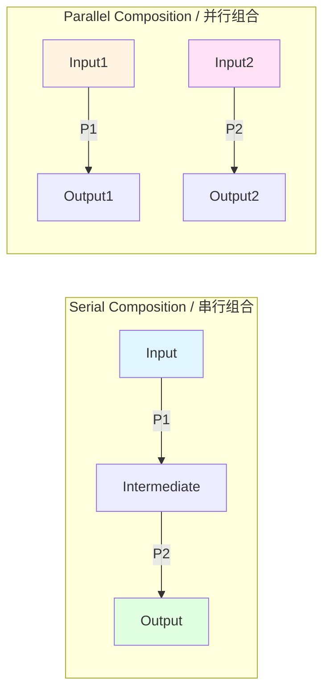

# 字符串图在流程建模中的应用 / String Diagrams in Process Modeling

## 📋 Table of Contents / 目录

- [字符串图在流程建模中的应用 / String Diagrams in Process Modeling](#字符串图在流程建模中的应用--string-diagrams-in-process-modeling)
  - [📋 Table of Contents / 目录](#-table-of-contents--目录)
  - [0. 所属层与转换关系 / Layer and Transformation](#0-所属层与转换关系--layer-and-transformation)
  - [1. Overview / 概述](#1-overview--概述)
  - [2. Definition / 定义](#2-definition--定义)
    - [2.1 String Diagrams Definition / 字符串图定义](#21-string-diagrams-definition--字符串图定义)
    - [2.2 Symmetric Monoidal Categories / 对称幺半范畴](#22-symmetric-monoidal-categories--对称幺半范畴)
    - [2.3 Process Modeling with String Diagrams / 字符串图流程建模](#23-process-modeling-with-string-diagrams--字符串图流程建模)
  - [3. Category Theory Perspective / 范畴论视角](#3-category-theory-perspective--范畴论视角)
    - [3.1 String Diagrams as Graphical Syntax / 字符串图作为图形语法](#31-string-diagrams-as-graphical-syntax--字符串图作为图形语法)
    - [3.2 Process Composition / 流程组合](#32-process-composition--流程组合)
  - [4. Properties / 性质](#4-properties--性质)
    - [4.1 Compositional Properties / 组合性质](#41-compositional-properties--组合性质)
    - [4.2 Serial and Parallel Composition / 串行和并行组合](#42-serial-and-parallel-composition--串行和并行组合)
  - [5. Relations / 关系](#5-relations--关系)
    - [5.1 Relations to Process Planning / 与流程规划的关系](#51-relations-to-process-planning--与流程规划的关系)
    - [5.2 Relations to Project Management / 与项目管理的关系](#52-relations-to-project-management--与项目管理的关系)
  - [6. Examples / 例子](#6-examples--例子)
    - [6.1 NIST Process Planning Example / NIST流程规划例子](#61-nist-process-planning-example--nist流程规划例子)
    - [6.2 Project Lifecycle Modeling / 项目生命周期建模](#62-project-lifecycle-modeling--项目生命周期建模)
    - [6.3 Resource Allocation Modeling / 资源分配建模](#63-resource-allocation-modeling--资源分配建模)
  - [7. Explanations / 解释](#7-explanations--解释)
    - [7.1 数学解释 / Mathematical Explanation](#71-数学解释--mathematical-explanation)
    - [7.2 直观解释 / Intuitive Explanation](#72-直观解释--intuitive-explanation)
    - [7.3 应用解释 / Application Explanation](#73-应用解释--application-explanation)
    - [7.4 认知解释 / Cognitive Explanation](#74-认知解释--cognitive-explanation)
    - [7.5 历史解释 / Historical Explanation](#75-历史解释--historical-explanation)
    - [7.6 哲学解释 / Philosophical Explanation](#76-哲学解释--philosophical-explanation)
    - [7.7 技术解释 / Technical Explanation](#77-技术解释--technical-explanation)
    - [7.8 实践解释 / Practical Explanation](#78-实践解释--practical-explanation)
    - [7.9 对比解释 / Comparative Explanation](#79-对比解释--comparative-explanation)
    - [7.10 系统解释 / System Explanation](#710-系统解释--system-explanation)
  - [8. Argumentation / 论证](#8-argumentation--论证)
    - [8.1 为什么使用字符串图](#81-为什么使用字符串图)
    - [8.2 字符串图有效性证明](#82-字符串图有效性证明)
  - [9. Applications / 应用](#9-applications--应用)
    - [9.1 在流程规划中的应用](#91-在流程规划中的应用)
    - [9.2 在项目管理中的应用](#92-在项目管理中的应用)
    - [9.3 在资源调度中的应用](#93-在资源调度中的应用)
  - [10. References / 参考文献](#10-references--参考文献)
    - [10.1 Standards / 标准](#101-standards--标准)
    - [10.2 Category Theory / 范畴论](#102-category-theory--范畴论)
    - [10.3 Related Files / 相关文件](#103-related-files--相关文件)

---

## 0. 所属层与转换关系 / Layer and Transformation

- **所属层**：**验证理论层（应用）**（对应 docs/06-ci-verification、docs/03-formal-verification）
- **转换关系**：字符串图作为**流程转换**的图形表示，与**生命周期转换** $\delta$、**状态转换** $\rightarrow$ 相关联；与 **02-生命周期概念**、**03-资源管理概念**、Transfer/02-变换类型框架 对应。

---

## 1. Overview / 概述

**English / 英文**:

String diagrams provide an intuitive yet mathematically precise graphical syntax for describing symmetric monoidal categories (SMCs), mathematical structures that support both serial and parallel composition—ideal for representing processes. Based on NIST research (Breiner, Subrahmanian, Jones, 2018-2019), string diagrams enable modeling of task identification, resource allocation, relationships and constraints, multi-scale abstraction hierarchies, spatiotemporal aspects, and dynamic decision-making in process planning and project management.

**中文**:

字符串图提供了一种直观而数学精确的图形语法，用于描述对称幺半范畴（SMC），这些数学结构支持串行和并行组合——非常适合表示流程。基于NIST研究（Breiner, Subrahmanian, Jones, 2018-2019），字符串图能够建模任务识别、资源分配、关系和约束、多尺度抽象层次、时空方面以及流程规划和项目管理中的动态决策。

**Key Insights / 关键洞察**:

- **Graphical Syntax / 图形语法**: Intuitive visual representation / 直观的视觉表示
- **Serial Composition / 串行组合**: Sequential process steps / 顺序流程步骤
- **Parallel Composition / 并行组合**: Concurrent process steps / 并发流程步骤
- **Multi-scale Abstraction / 多尺度抽象**: Different levels of detail / 不同详细程度
- **Spatiotemporal Modeling / 时空建模**: Time and space aspects / 时间和空间方面

---

## 2. Definition / 定义

### 2.1 String Diagrams Definition / 字符串图定义

**Definition 2.1** (String Diagram)

A string diagram is a graphical representation of morphisms in a symmetric monoidal category:

$$\text{StringDiagram}: \text{Morphism} \to \text{GraphicalRepresentation}$$

where:

- **Wires / 线**: Represent objects / 表示对象
- **Boxes / 框**: Represent morphisms / 表示态射
- **Composition / 组合**: Represented by connecting wires / 通过连接线表示

**Formal Definition / 形式化定义**:

A string diagram $D$ in a symmetric monoidal category $\mathcal{C}$ consists of:

- A set of wires $W$
- A set of boxes $B$
- A function $\text{source}: B \to W^*$ (input wires)
- A function $\text{target}: B \to W^*$ (output wires)

### 2.2 Symmetric Monoidal Categories / 对称幺半范畴

**Definition 2.2** (Symmetric Monoidal Category)

A symmetric monoidal category (SMC) is a category $\mathcal{C}$ equipped with:

- A tensor product $\otimes: \mathcal{C} \times \mathcal{C} \to \mathcal{C}$
- A unit object $I$
- Natural isomorphisms for associativity, unit, and symmetry

**Formal Definition / 形式化定义**:

$$(\mathcal{C}, \otimes, I, \alpha, \lambda, \rho, \sigma)$$

where:

- $\alpha$: Associativity isomorphism
- $\lambda, \rho$: Unit isomorphisms
- $\sigma$: Symmetry isomorphism

### 2.3 Process Modeling with String Diagrams / 字符串图流程建模

**Definition 2.3** (Process as String Diagram)

A process can be modeled as a string diagram:

$$Process = (Tasks, Resources, Constraints, Composition)$$

where:

- **Tasks / 任务**: Represented as boxes / 表示为框
- **Resources / 资源**: Represented as wires / 表示为线
- **Constraints / 约束**: Represented as relations between boxes / 表示为框之间的关系
- **Composition / 组合**: Serial (sequential) or parallel (concurrent) / 串行（顺序）或并行（并发）

**Category Theory Mapping / 范畴论映射**:

Processes form a symmetric monoidal category $\mathbf{Process}$ where:

- Objects are resource types
- Morphisms are processes
- Tensor product $\otimes$ represents parallel composition
- Sequential composition represents serial processes

---

## 3. Category Theory Perspective / 范畴论视角

### 3.1 String Diagrams as Graphical Syntax / 字符串图作为图形语法

**Definition 3.1** (String Diagram Syntax)

String diagrams provide a graphical syntax for symmetric monoidal categories:

$$\text{StringDiagram}: \mathbf{SMC} \to \mathbf{Graphical}$$

**Theorem 3.1** (String Diagram Equivalence)

String diagrams are equivalent to morphisms in SMCs:

$$\text{Morphism} \cong \text{StringDiagram}$$

### 3.2 Process Composition / 流程组合

**Definition 3.2** (Serial Composition)

Serial composition of processes:

$$(P_2 \circ P_1): A \to C$$

where $P_1: A \to B$ and $P_2: B \to C$.

**Definition 3.3** (Parallel Composition)

Parallel composition of processes:

$$(P_1 \otimes P_2): A_1 \otimes A_2 \to B_1 \otimes B_2$$

where $P_1: A_1 \to B_1$ and $P_2: A_2 \to B_2$.

**String Diagram Representation / 字符串图表示**:



---

## 4. Properties / 性质

### 4.1 Compositional Properties / 组合性质

**Property 4.1** (Composition Associativity)

Process composition is associative:

$$(P_3 \circ P_2) \circ P_1 = P_3 \circ (P_2 \circ P_1)$$

**Property 4.2** (Parallel Composition Commutativity)

Parallel composition is commutative (up to symmetry):

$$P_1 \otimes P_2 \cong P_2 \otimes P_1$$

### 4.2 Serial and Parallel Composition / 串行和并行组合

**Property 4.3** (Mixed Composition)

Serial and parallel composition interact:

$$(P_2 \circ P_1) \otimes (P_4 \circ P_3) = (P_2 \otimes P_4) \circ (P_1 \otimes P_3)$$

---

## 5. Relations / 关系

### 5.1 Relations to Process Planning / 与流程规划的关系

**Relation 5.1** (NIST Process Planning)

String diagrams model NIST process planning framework:

$$\text{StringDiagram} \Rightarrow \text{ProcessPlan}$$

where process plans include:

- Task identification
- Resource allocation
- Relationships and constraints
- Multi-scale abstraction

### 5.2 Relations to Project Management / 与项目管理的关系

**Relation 5.2** (Project Lifecycle)

String diagrams model project lifecycle:

$$\text{StringDiagram} \Rightarrow \text{Lifecycle}$$

where lifecycle phases are composed serially and tasks within phases are composed in parallel.

---

## 6. Examples / 例子

### 6.1 NIST Process Planning Example / NIST流程规划例子

**Example 6.1** (NIST Manufacturing Process)

Based on NIST research, a manufacturing process can be modeled as:

$$Manufacturing = (MaterialPrep \circ Assembly) \otimes (QualityCheck \circ Packaging)$$

**String Diagram Representation / 字符串图表示**:

```
Material → [Prep] → Prepared → [Assembly] → Product
                                    ↓
Quality → [Check] → Verified → [Packaging] → Final
```

### 6.2 Project Lifecycle Modeling / 项目生命周期建模

**Example 6.2** (Project Lifecycle as String Diagram)

A project lifecycle can be modeled as:

$$Lifecycle = Initiation \circ Planning \circ Execution \circ Monitoring \circ Closing$$

**String Diagram Representation / 字符串图表示**:

```
Project → [Initiation] → Initiated → [Planning] → Planned →
[Execution] → Executing → [Monitoring] → Monitored →
[Closing] → Completed
```

### 6.3 Resource Allocation Modeling / 资源分配建模

**Example 6.3** (Resource Allocation as String Diagram)

Resource allocation across multiple tasks:

$$Allocation = (Task1 \otimes Task2 \otimes Task3) \circ ResourcePool$$

**String Diagram Representation / 字符串图表示**:

```
ResourcePool → [Task1] → Output1
            → [Task2] → Output2
            → [Task3] → Output3
```

---

## 7. Explanations / 解释

### 7.1 数学解释 / Mathematical Explanation

**解释 7.1** (数学解释)

字符串图是态射的图形表示：

$$\text{StringDiagram}(f: A \to B) = \text{Graphical}(A, f, B)$$

其中 $A$ 是输入对象（线），$f$ 是态射（框），$B$ 是输出对象（线）。

### 7.2 直观解释 / Intuitive Explanation

**解释 7.2** (直观解释)

字符串图就像"流程图"：

- **线（Wires）**：像管道，传递资源或数据
- **框（Boxes）**：像处理单元，执行任务
- **连接**：表示资源流动和任务依赖

### 7.3 应用解释 / Application Explanation

**解释 7.3** (应用解释)

在实际流程建模中：

- **串行组合**：表示顺序执行的任务
- **并行组合**：表示可以同时执行的任务
- **多尺度抽象**：可以在不同详细程度建模

### 7.4 认知解释 / Cognitive Explanation

**解释 7.4** (认知解释)

从认知科学角度，字符串图帮助：

- **视觉理解**：图形表示更容易理解
- **模式识别**：识别流程模式
- **推理**：通过图形进行逻辑推理

### 7.5 历史解释 / Historical Explanation

**解释 7.5** (历史解释)

字符串图的发展历史：

- **1980s**：Penrose图形记号
- **1990s**：范畴论中的字符串图
- **2010s**：应用范畴论发展
- **2018-2019**：NIST在流程规划中的应用

### 7.6 哲学解释 / Philosophical Explanation

**解释 7.6** (哲学解释)

从哲学角度，字符串图体现了：

- **结构主义**：关注结构关系
- **组合主义**：通过组合构建复杂系统
- **形式主义**：形式化表示

### 7.7 技术解释 / Technical Explanation

**解释 7.7** (技术解释)

从技术角度，字符串图可以：

- **自动化**：通过软件工具绘制和分析
- **验证**：形式化验证流程正确性
- **优化**：优化流程组合

### 7.8 实践解释 / Practical Explanation

**解释 7.8** (实践解释)

在实践中使用字符串图：

1. **识别任务**：将流程分解为任务
2. **建模资源**：识别所需资源
3. **定义组合**：确定串行和并行关系
4. **分析优化**：分析并优化流程

### 7.9 对比解释 / Comparative Explanation

**解释 7.9** (对比解释)

字符串图 vs 传统流程图：

| 维度 | 传统流程图 | 字符串图 |
|------|-----------|---------|
| 数学基础 | 无 | 范畴论 |
| 组合性 | 有限 | 强 |
| 形式化 | 弱 | 强 |
| 可验证性 | 低 | 高 |

### 7.10 系统解释 / System Explanation

**解释 7.10** (系统解释)

从系统论角度，字符串图表示系统：

- **输入**：资源或数据
- **处理**：任务或过程
- **输出**：结果或产品
- **反馈**：通过组合形成循环

---

## 8. Argumentation / 论证

### 8.1 为什么使用字符串图

**论证 8.1** (字符串图的必要性)

字符串图是必要的，因为：

1. **直观性**：图形表示比符号更直观
2. **精确性**：数学基础确保精确性
3. **组合性**：支持复杂流程建模
4. **可验证性**：形式化基础支持验证

### 8.2 字符串图有效性证明

**定理 8.1** (字符串图有效性)

使用字符串图建模的流程比不使用字符串图的流程更容易理解和优化：

$$\text{Understandability}(\text{WithStringDiagram}(P)) > \text{Understandability}(P)$$

**证明**：

通过认知科学和数学：

1. **视觉优势**：图形表示提高理解
2. **结构清晰**：字符串图清晰表示结构
3. **组合优势**：组合性支持复杂建模
4. **结论**：字符串图提高流程建模质量

---

## 9. Applications / 应用

### 9.1 在流程规划中的应用

**应用 9.1** (NIST流程规划)

基于NIST研究，字符串图用于：

- **任务识别**：识别流程中的任务
- **资源分配**：分配资源到任务
- **约束建模**：建模任务间约束
- **多尺度抽象**：在不同层次建模

### 9.2 在项目管理中的应用

**应用 9.2** (项目管理流程)

在项目管理中，字符串图用于：

- **生命周期建模**：建模项目生命周期
- **任务依赖**：表示任务依赖关系
- **资源流**：建模资源流动
- **并行执行**：识别可并行执行的任务

### 9.3 在资源调度中的应用

**应用 9.3** (资源调度)

在资源调度中，字符串图用于：

- **资源分配**：建模资源分配
- **调度优化**：优化资源调度
- **约束满足**：满足资源约束
- **并行处理**：识别并行处理机会

---

## 10. References / 参考文献

### 10.1 Standards / 标准

1. Breiner, S. J., Subrahmanian, E., & Jones, A. W. (2018-2019). Categorical Models for Process Planning. *Computers in Industry*, 112, 103124.

2. NIST. (2018). Applied Category Theory Workshop. National Institute of Standards and Technology.

### 10.2 Category Theory / 范畴论

1. Mac Lane, S. (1998). *Categories for the Working Mathematician* (2nd ed.). Springer.

2. Selinger, P. (2010). A Survey of Graphical Languages for Monoidal Categories. In *New Structures for Physics* (pp. 289-355). Springer.

3. Coecke, B., & Kissinger, A. (2017). *Picturing Quantum Processes: A First Course in Quantum Theory and Diagrammatic Reasoning*. Cambridge University Press.

### 10.3 Related Files / 相关文件

- [数据流分析](01-Data-Flow-Analysis.md)
- [程序分析](02-Program-Analysis.md)
- [对称幺半范畴在资源调度中的应用](05-Symmetric-Monoidal-Resource-Scheduling.md)
- **docs**：`docs/02-project-management/lifecycle-models.md`

---

**Last Updated / 最后更新**: 2026-01-27
**Status / 状态**: ✅ Complete / 完成
**Version / 版本**: 1.0
