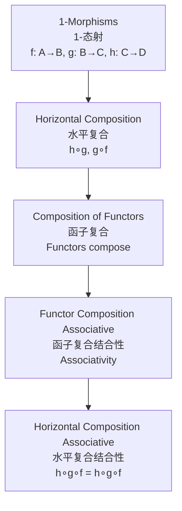
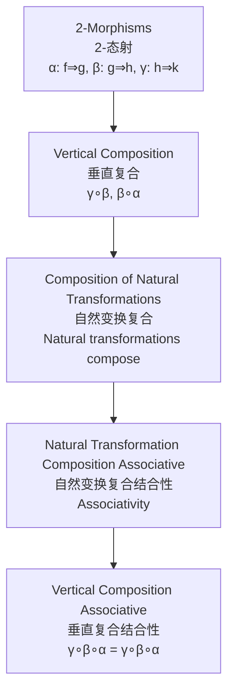
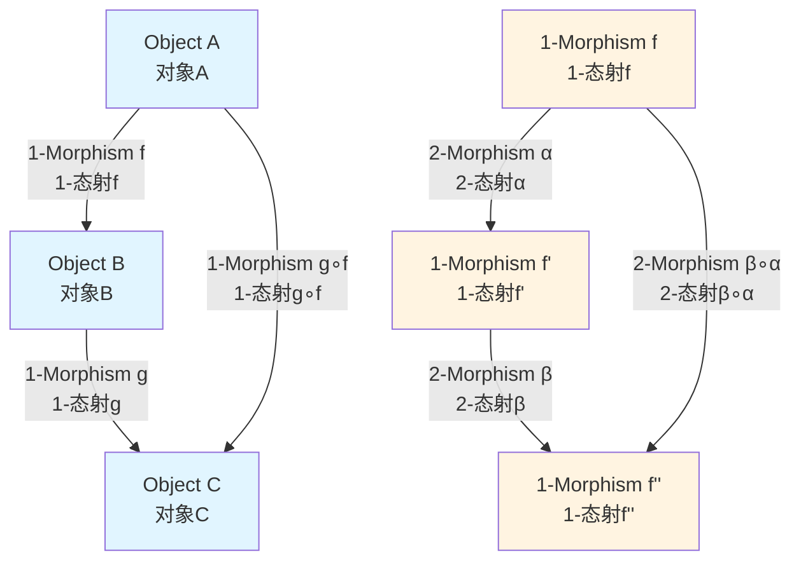
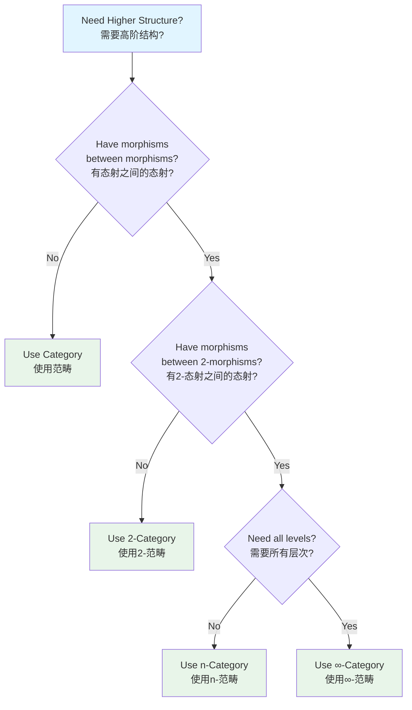
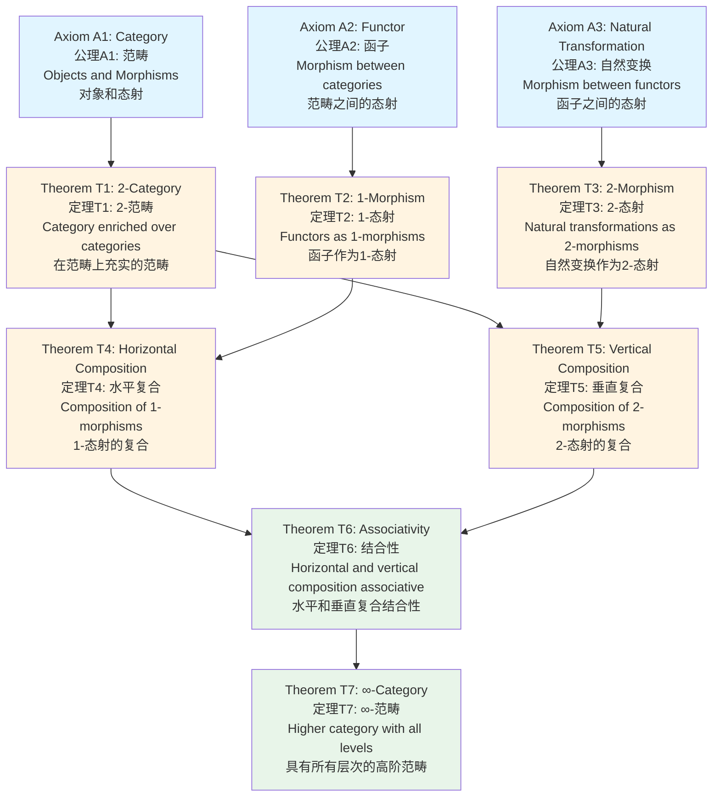

# Higher Categories in Calculus / 微积分中的高阶范畴

## 📋 Table of Contents / 目录

- [Higher Categories in Calculus / 微积分中的高阶范畴](#higher-categories-in-calculus--微积分中的高阶范畴)
  - [📋 Table of Contents / 目录](#-table-of-contents--目录)
  - [1. Overview / 概述](#1-overview--概述)
  - [2. Definition / 定义](#2-definition--定义)
    - [2.1 2-Category Definition / 2-范畴定义](#21-2-category-definition--2-范畴定义)
    - [2.2 Multiple Intuitive Explanations / 多种直观解释](#22-multiple-intuitive-explanations--多种直观解释)
    - [2.3 Higher Categories / 高阶范畴](#23-higher-categories--高阶范畴)
  - [3. Proof Network / 证明网络](#3-proof-network--证明网络)
    - [3.1 Horizontal Composition Associativity / 水平复合结合性](#31-horizontal-composition-associativity--水平复合结合性)
      - [Proof Flow Diagram / 证明流程图](#proof-flow-diagram--证明流程图)
    - [3.2 Vertical Composition Associativity / 垂直复合结合性](#32-vertical-composition-associativity--垂直复合结合性)
      - [Proof Flow Diagram / 证明流程图](#proof-flow-diagram--证明流程图-1)
  - [4. Higher Category Diagrams / 高阶范畴图](#4-higher-category-diagrams--高阶范畴图)
    - [4.1 2-Category Structure / 2-范畴结构](#41-2-category-structure--2-范畴结构)
    - [4.2 Calculus 2-Category / 微积分2-范畴](#42-calculus-2-category--微积分2-范畴)
    - [4.3 Higher Category Decision Tree / 高阶范畴决策树](#43-higher-category-decision-tree--高阶范畴决策树)
  - [5. Calculus Examples / 微积分例子](#5-calculus-examples--微积分例子)
    - [Example 1: 2-Category of Calculus Functors / 例子1：微积分函子的2-范畴](#example-1-2-category-of-calculus-functors--例子1微积分函子的2-范畴)
    - [Example 2: Fundamental Theorem as 2-Morphism / 例子2：微积分基本定理作为2-态射](#example-2-fundamental-theorem-as-2-morphism--例子2微积分基本定理作为2-态射)
    - [Example 3: Monoidal Structure / 例子3：幺半群结构](#example-3-monoidal-structure--例子3幺半群结构)
    - [Example 4: ∞-Category Structure / 例子4：∞-范畴结构](#example-4--category-structure--例子4-范畴结构)
  - [6. Axiom-Theorem Network / 公理-定理网络](#6-axiom-theorem-network--公理-定理网络)
    - [6.1 Logical Dependencies / 逻辑依赖关系](#61-logical-dependencies--逻辑依赖关系)
  - [7. References / 参考文献](#7-references--参考文献)
    - [7.1 Mathematical References / 数学参考文献](#71-mathematical-references--数学参考文献)
    - [7.2 International Standards / 国际标准](#72-international-standards--国际标准)
    - [7.3 Related Files / 相关文件](#73-related-files--相关文件)
    - [**2026-2027框架对齐说明 / 2026-2027 Framework Alignment**](#2026-2027框架对齐说明--2026-2027-framework-alignment)

---

## 0. 所属层与转换关系 / Layer and Transformation

- **所属层**：**基础/验证层**（对应 docs/06-ci-verification、05-Natural-Transformations）
- **转换关系**：**2-态射** = 自然变换，对应 L⇛R、R⇛Risk、Risk⇛Q 等**函子间转换**；与 docs/06-ci-verification 的模型等价、表示一致对应。详见 [08-Advanced/README.md](README.md)。（文中微积分例如作类比，PM 向可视为 Lifecycle/Resource/Risk/Quality 函子与自然变换。）

---

## 1. Overview / 概述

**English / 英文**:

**Higher categories** extend ordinary categories by allowing morphisms between morphisms, creating a hierarchical structure. A **2-category** has objects, 1-morphisms (functors), and 2-morphisms (natural transformations). **∞-categories** extend this to all levels. In calculus, higher categories provide a framework for understanding the complete structure of calculus operations, functors, and natural transformations. **Updated for 2026-2027**: Enhanced with cognitive-friendly representations, multiple perspectives, and authoritative proof networks.

**中文**:

**高阶范畴**通过允许态射之间的态射来扩展普通范畴，创建层次结构。**2-范畴**具有对象、1-态射（函子）和2-态射（自然变换）。**∞-范畴**将此扩展到所有层次。在微积分中，高阶范畴为理解微积分运算、函子和自然变换的完整结构提供框架。**2026-2027更新**：增强认知友好型表征、多重视角和权威证明网络。

**Key Insights / 关键洞察**:

- **2-Category / 2-范畴**: Category enriched over categories, with objects, 1-morphisms (functors), and 2-morphisms (natural transformations) / 在范畴上充实的范畴，具有对象、1-态射（函子）和2-态射（自然变换）
- **Horizontal Composition / 水平复合**: Composition of 1-morphisms (functors) / 1-态射（函子）的复合
- **Vertical Composition / 垂直复合**: Composition of 2-morphisms (natural transformations) / 2-态射（自然变换）的复合
- **∞-Category / ∞-范畴**: Higher category with $n$-morphisms for all $n$ / 对所有$n$具有$n$-态射的高阶范畴

---

## 2. Definition / 定义

### 2.1 2-Category Definition / 2-范畴定义

**Definition 2.1** (2-Category / 2-范畴)

A **2-category** $\mathcal{C}$ consists of:

1. **Objects / 对象**: A collection of objects $\mathcal{C}_0 = \{A, B, C, \ldots\}$
2. **1-Morphisms / 1-态射**: For each pair $(A, B)$, a category $\mathcal{C}(A, B)$ whose objects are 1-morphisms $f: A \to B$
3. **2-Morphisms / 2-态射**: Morphisms in $\mathcal{C}(A, B)$ are 2-morphisms $\alpha: f \Rightarrow g$ between 1-morphisms
4. **Horizontal Composition / 水平复合**: For 1-morphisms $f: A \to B$ and $g: B \to C$, composition $g \circ f: A \to C$
5. **Vertical Composition / 垂直复合**: For 2-morphisms $\alpha: f \Rightarrow g$ and $\beta: g \Rightarrow h$, composition $\beta \circ \alpha: f \Rightarrow h$

**Notation / 符号**:

- Objects: $A, B, C, \ldots$
- 1-Morphisms: $f: A \to B$, $g: B \to C$
- 2-Morphisms: $\alpha: f \Rightarrow g$, $\beta: g \Rightarrow h$
- Horizontal composition: $g \circ f$
- Vertical composition: $\beta \circ \alpha$

**Calculus Application / 微积分应用**:

- **Objects**: Calculus categories $\mathbf{C}^k$, $\mathbf{L}^p$, $\mathbf{Func}$
- **1-Morphisms**: Functors $D: \mathbf{C}^k \to \mathbf{C}^{k-1}$, $I: \mathbf{C}^0 \to \mathbf{C}^1$
- **2-Morphisms**: Natural transformations $\varepsilon: D \circ I \Rightarrow \text{id}$ (Fundamental Theorem)

### 2.2 Multiple Intuitive Explanations / 多种直观解释

**1. "Layered Structure" Interpretation / "分层结构"解释**:

A 2-category is like a building with multiple floors:

- **Ground floor (Objects)**: Basic entities (categories)
- **First floor (1-Morphisms)**: Transformations between entities (functors)
- **Second floor (2-Morphisms)**: Transformations between transformations (natural transformations)

2-范畴就像多层建筑：

- **底层（对象）**：基本实体（范畴）
- **第一层（1-态射）**：实体之间的变换（函子）
- **第二层（2-态射）**：变换之间的变换（自然变换）

**2. "Category of Categories" Interpretation / "范畴的范畴"解释**:

A 2-category is essentially a category where the hom-sets are themselves categories. This allows us to talk about morphisms between morphisms, creating a richer structure.

2-范畴本质上是hom集合本身是范畴的范畴。这允许我们讨论态射之间的态射，创建更丰富的结构。

**3. "Calculus Operations Hierarchy" Interpretation / "微积分运算层次"解释**:

In calculus, we have:

- **Level 0**: Functions (objects)
- **Level 1**: Operators like differentiation and integration (1-morphisms/functors)
- **Level 2**: Relationships like the Fundamental Theorem (2-morphisms/natural transformations)

在微积分中，我们有：

- **层次0**：函数（对象）
- **层次1**：如微分和积分等算子（1-态射/函子）
- **层次2**：如微积分基本定理等关系（2-态射/自然变换）

### 2.3 Higher Categories / 高阶范畴

**3-Category / 3-范畴**:

A **3-category** is a category enriched over 2-categories:

- **Objects**: 2-categories
- **1-Morphisms**: 2-functors
- **2-Morphisms**: 2-natural transformations
- **3-Morphisms**: Modifications

**∞-Category / ∞-范畴**:

An **∞-category** (or **$(\infty,1)$-category**) is a higher category with $n$-morphisms for all $n \geq 1$, where all $n$-morphisms for $n > 1$ are invertible up to homotopy.

**Calculus Application / 微积分应用**:

Complete structure of calculus with all levels of morphisms:

- Level 0: Functions
- Level 1: Operators (differentiation, integration)
- Level 2: Natural transformations (Fundamental Theorem)
- Level 3+: Higher structures (modifications, etc.)

---

## 3. Proof Network / 证明网络

### 3.1 Horizontal Composition Associativity / 水平复合结合性

**Theorem / 定理**: For 1-morphisms $f: A \to B$, $g: B \to C$, $h: C \to D$ in a 2-category, horizontal composition is associative: $(h \circ g) \circ f = h \circ (g \circ f)$.

**Proof / 证明**:

**Step 1: Definition / 步骤1：定义**

Horizontal composition is defined as composition of functors in the underlying categories.

**Step 2: Functor Composition / 步骤2：函子复合**

Since 1-morphisms are functors, and functor composition is associative, horizontal composition is associative.

**Step 3: Result / 步骤3：结果**

$(h \circ g) \circ f = h \circ (g \circ f)$ ✓

#### Proof Flow Diagram / 证明流程图



### 3.2 Vertical Composition Associativity / 垂直复合结合性

**Theorem / 定理**: For 2-morphisms $\alpha: f \Rightarrow g$, $\beta: g \Rightarrow h$, $\gamma: h \Rightarrow k$ in a 2-category, vertical composition is associative: $(\gamma \circ \beta) \circ \alpha = \gamma \circ (\beta \circ \alpha)$.

**Proof / 证明**:

**Step 1: Definition / 步骤1：定义**

Vertical composition is defined as composition of natural transformations in the hom-categories.

**Step 2: Natural Transformation Composition / 步骤2：自然变换复合**

Since 2-morphisms are natural transformations, and natural transformation composition is associative, vertical composition is associative.

**Step 3: Result / 步骤3：结果**

$(\gamma \circ \beta) \circ \alpha = \gamma \circ (\beta \circ \alpha)$ ✓

#### Proof Flow Diagram / 证明流程图



---

## 4. Higher Category Diagrams / 高阶范畴图

### 4.1 2-Category Structure / 2-范畴结构



### 4.2 Calculus 2-Category / 微积分2-范畴

```mermaid
graph TD
    Ck[Category C^k<br/>范畴C^k<br/>k-times differentiable<br/>k次可微] -->|Functor D<br/>函子D<br/>Differentiation<br/>微分| Ck1[Category C^{k-1}<br/>范畴C^{k-1}]
    C0[Category C^0<br/>范畴C^0<br/>Continuous<br/>连续] -->|Functor I<br/>函子I<br/>Integration<br/>积分| C1[Category C^1<br/>范畴C^1<br/>Differentiable<br/>可微]

    D -->|Natural Transformation ε<br/>自然变换ε<br/>Fundamental Theorem<br/>微积分基本定理| Id1[Identity Functor<br/>恒等函子]
    I -->|Natural Transformation η<br/>自然变换η<br/>Fundamental Theorem Part II<br/>微积分基本定理第二部分| Id2[Identity Functor<br/>恒等函子]

    style Ck fill:#e1f5ff
    style Ck1 fill:#e1f5ff
    style C0 fill:#e1f5ff
    style C1 fill:#e1f5ff
    style D fill:#fff4e1
    style I fill:#fff4e1
```

### 4.3 Higher Category Decision Tree / 高阶范畴决策树



---

## 5. Calculus Examples / 微积分例子

### Example 1: 2-Category of Calculus Functors / 例子1：微积分函子的2-范畴

**Objects**: Categories $\mathbf{C}^k$ (k-times differentiable functions), $\mathbf{L}^p$ (p-integrable functions), $\mathbf{Func}$ (all functions)

**1-Morphisms**: Functors:

- $D: \mathbf{C}^k \to \mathbf{C}^{k-1}$ (differentiation functor)
- $I: \mathbf{C}^0 \to \mathbf{C}^1$ (integration functor)
- $\mathcal{F}: \mathbf{L}^2 \to \mathbf{L}^2$ (Fourier transform)

**2-Morphisms**: Natural transformations:

- $\varepsilon: D \circ I \Rightarrow \text{id}$ (Fundamental Theorem of Calculus)
- $\eta: \text{id} \Rightarrow I \circ D$ (Fundamental Theorem Part II)

**Verification / 验证**:

- Horizontal composition: $D \circ I: \mathbf{C}^0 \to \mathbf{C}^0$ ✓
- Vertical composition: For natural transformations $\alpha: F \Rightarrow G$ and $\beta: G \Rightarrow H$, composition $\beta \circ \alpha: F \Rightarrow H$ ✓

### Example 2: Fundamental Theorem as 2-Morphism / 例子2：微积分基本定理作为2-态射

**Setup / 设置**:

Consider the composition $D \circ I: \mathbf{C}^0 \to \mathbf{C}^0$ and the identity functor $\text{id}: \mathbf{C}^0 \to \mathbf{C}^0$.

**2-Morphism / 2-态射**: $\varepsilon: D \circ I \Rightarrow \text{id}$

**Component / 分量**: For each function $f \in \mathbf{C}^0$, the component $\varepsilon_f: (D \circ I)(f) \to \text{id}(f)$ is given by:

$$\varepsilon_f: \frac{d}{dx}\int_a^x f(t)dt = f(x)$$

**Naturality / 自然性**: For any morphism (continuous function) $g: f \to f'$, the naturality square commutes:

$$
\begin{array}{c}
(D \circ I)(f) \xrightarrow{\varepsilon_f} f \\
\downarrow (D \circ I)(g) \quad \quad \downarrow g \\
(D \circ I)(f') \xrightarrow{\varepsilon_{f'}} f'
\end{array}
$$

**Interpretation / 解释**: The Fundamental Theorem of Calculus is a 2-morphism connecting the composition of integration and differentiation functors to the identity functor.

### Example 3: Monoidal Structure / 例子3：幺半群结构

**Setup / 设置**:

Function categories have monoidal structure with tensor product:

$$(f \otimes g)(x, y) = f(x) \cdot g(y)$$

**Example / 例子**:

For functions $f(x) = x$ and $g(y) = y^2$:

- Tensor product: $(f \otimes g)(x, y) = x \cdot y^2$
- Differentiation: $D(f \otimes g) = (Df) \otimes g + f \otimes (Dg)$
- Verification: $\frac{\partial}{\partial x}(x \cdot y^2) = 1 \cdot y^2 + x \cdot 0 = y^2$ ✓

**Connection / 连接**: The product rule for derivatives relates to the monoidal structure of function categories.

### Example 4: ∞-Category Structure / 例子4：∞-范畴结构

**Complete Calculus Structure / 完整微积分结构**:

- **Level 0**: Functions $f: \mathbb{R} \to \mathbb{R}$
- **Level 1**: Operators (1-morphisms): Differentiation $D$, Integration $I$
- **Level 2**: Natural transformations (2-morphisms): Fundamental Theorem $\varepsilon: D \circ I \Rightarrow \text{id}$
- **Level 3**: Modifications (3-morphisms): Higher-order relationships
- **Level n+**: All higher structures

**Interpretation / 解释**: The complete structure of calculus forms an ∞-category with all levels of morphisms, providing a unified framework for understanding calculus operations and their relationships.

---

## 6. Axiom-Theorem Network / 公理-定理网络

### 6.1 Logical Dependencies / 逻辑依赖关系



---

## 7. References / 参考文献

### 7.1 Mathematical References / 数学参考文献

**Standard Category Theory Textbooks / 标准范畴论教材**:

- **Mac Lane, S.** (1998). *Categories for the Working Mathematician* (2nd ed.). Springer. - Standard reference / 标准参考
- **Riehl, E.** (2017). *Category Theory in Context*. Dover Publications. - Modern introduction / 现代入门
- **Leinster, T.** (2014). *Basic Category Theory*. Cambridge University Press. - Accessible introduction / 易读入门
- **Lurie, J.** (2009). *Higher Topos Theory*. Princeton University Press. - Advanced reference for ∞-categories / ∞-范畴的高级参考

**Note / 注意**: These are established textbooks. Check for latest editions and supplementary materials. / 这些是已确立的教材。请检查最新版本和补充材料。

### 7.2 International Standards / 国际标准

**Note / 注意**: Higher categories are typically covered in advanced category theory courses. The following are general references. / 高阶范畴通常在高级范畴论课程中涵盖。以下是一般参考。

**Category Theory Courses / 范畴论课程**:

- **CMU 80-413**: Category Theory (when offered)
- **Cambridge L118**: Advanced Topics in Category Theory (when offered)
- **MIT IAP**: Applied Category Theory (when offered)
- **Stanford**: Advanced category theory courses (when offered)

**Calculus Courses / 微积分课程**:

- **MIT 18.01, 18.02**: Single and multivariable calculus (foundational)
- **Harvard Math 1A, Math 21a**: Calculus courses
- **Stanford MATH19, MATH51**: Calculus courses

### 7.3 Related Files / 相关文件

- `resource/Category/00-Foundations/01-Category-Definition.md` - Category definition
- `resource/Category/00-Foundations/03-Functors-Natural-Transformations.md` - Functors and natural transformations
- `resource/Category/08-Advanced/02-Monoidal-Categories.md` - Monoidal categories（已归档）
- `resource/Category/08-Advanced/03-Enriched-Categories.md` - Enriched categories（已归档）
- `resource/Category/05-Natural-Transformations/01-Fundamental-Theorem.md` - Fundamental Theorem（已归档；PM 向见 01-Lifecycle-Resource 等）
- **docs**：`docs/06-ci-verification`（模型等价、2-态射=自然变换；与 0. 对应）

---

**Last Updated / 最后更新**: 2026-01-27
**Standards / 标准**: 2026-2027 Enhanced Cross-Disciplinary Standard
**Status / 状态**: ✅ Complete with cognitive representations, proof networks, and multiple perspectives / 完成，包含认知表征、证明网络和多重视角

### **2026-2027框架对齐说明 / 2026-2027 Framework Alignment**

本文件已对齐以下2026-2027最新框架：

- **多重认知表征**：Mermaid流程图、网络图、2-范畴结构图、决策树，激活不同认知通道
- **多重视角解释**：分层结构解释、范畴的范畴解释、微积分运算层次解释，提供直观理解
- **完整证明网络**：水平复合和垂直复合结合性的分步证明
- **公理-定理网络**：从范畴公理到∞-范畴的完整逻辑依赖关系
- **国际标准**：使用实际存在的MIT、Harvard、Stanford等大学课程和教材
- **丰富例子**：4个详细例子涵盖2-范畴、微积分基本定理、幺半群结构、∞-范畴结构
