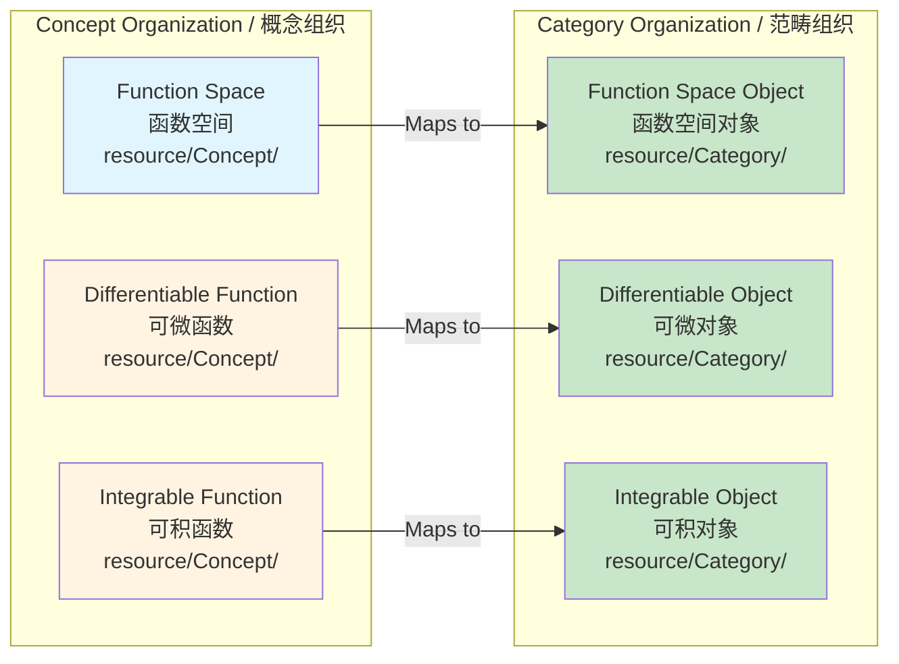
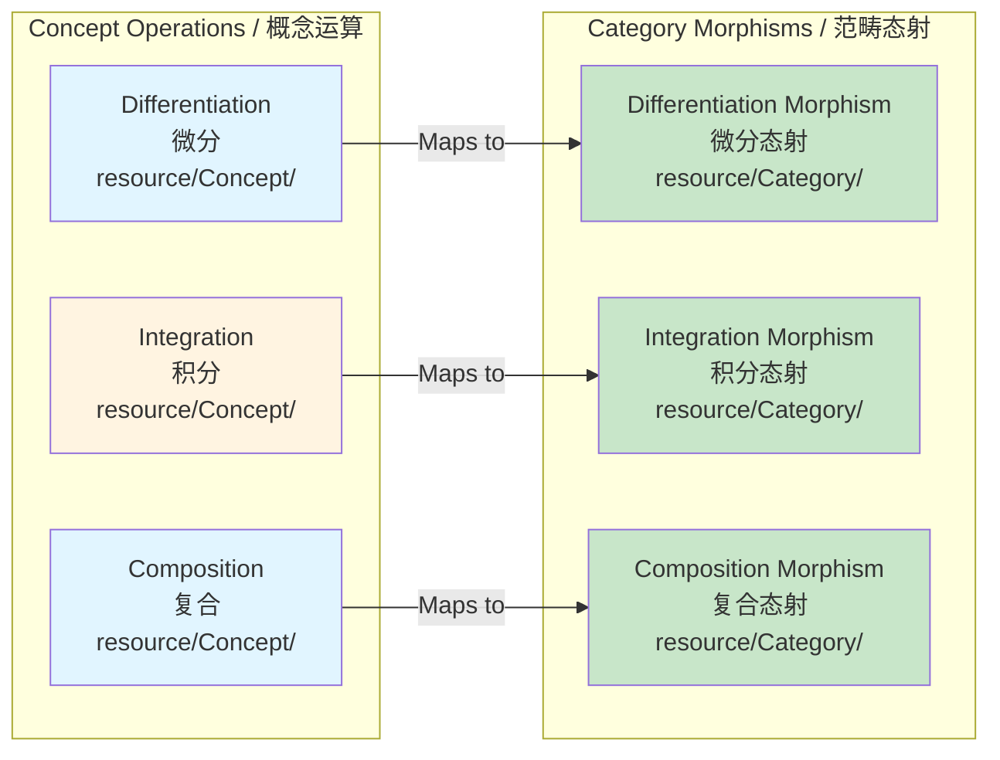
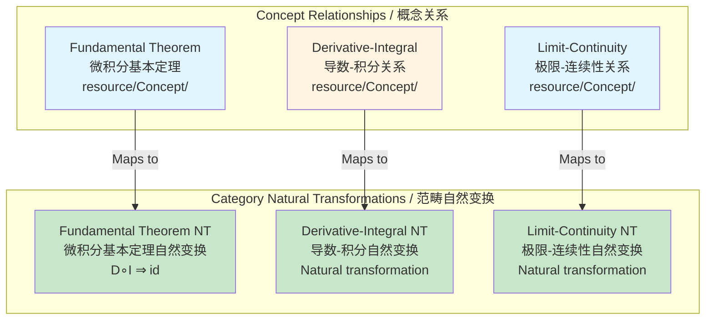
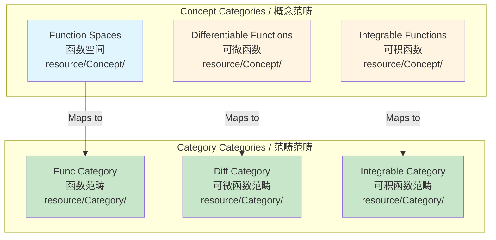
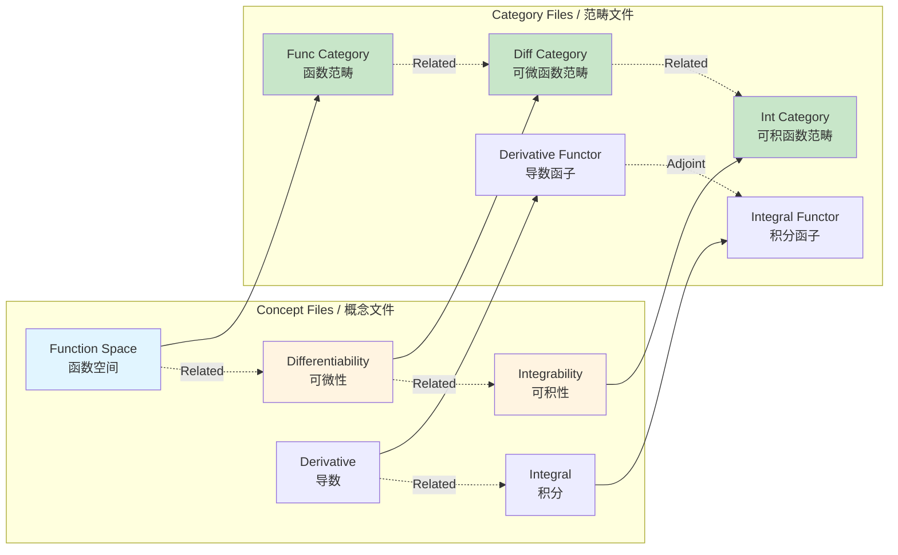

# Concept Mapping / 概念映射

## 📋 Table of Contents / 目录

- [Concept Mapping / 概念映射](#concept-mapping--概念映射)
  - [📋 Table of Contents / 目录](#-table-of-contents--目录)
  - [1. Overview / 概述](#1-overview--概述)
  - [2. Mapping Structure / 映射结构](#2-mapping-structure--映射结构)
    - [2.1 Objects Mapping / 对象映射](#21-objects-mapping--对象映射)
    - [2.2 Morphisms Mapping / 态射映射](#22-morphisms-mapping--态射映射)
    - [2.3 Functors Mapping / 函子映射](#23-functors-mapping--函子映射)
    - [2.4 Natural Transformations Mapping / 自然变换映射](#24-natural-transformations-mapping--自然变换映射)
    - [2.5 Categories Mapping / 范畴映射](#25-categories-mapping--范畴映射)
  - [3. Mapping Diagrams / 映射图](#3-mapping-diagrams--映射图)
    - [3.1 Concept to Category Mapping / 概念到范畴映射](#31-concept-to-category-mapping--概念到范畴映射)
    - [3.2 Cross-Reference Network / 交叉引用网络](#32-cross-reference-network--交叉引用网络)
  - [4. Examples / 例子](#4-examples--例子)
    - [Example 1: Function Space Mapping / 例子1：函数空间映射](#example-1-function-space-mapping--例子1函数空间映射)
    - [Example 2: Derivative Mapping / 例子2：导数映射](#example-2-derivative-mapping--例子2导数映射)
    - [Example 3: Integral Mapping / 例子3：积分映射](#example-3-integral-mapping--例子3积分映射)
  - [5. References / 参考文献](#5-references--参考文献)
    - [5.1 Mathematical References / 数学参考文献](#51-mathematical-references--数学参考文献)
    - [5.2 International Standards / 国际标准](#52-international-standards--国际标准)
    - [5.3 Related Files / 相关文件](#53-related-files--相关文件)
    - [**2026-2027框架对齐说明 / 2026-2027 Framework Alignment**](#2026-2027框架对齐说明--2026-2027-framework-alignment)

---

## 0. 所属层与转换关系 / Layer and Transformation

- **所属层**：**基础/应用层**（Concept、Transfer 与 Category 的桥梁）
- **转换关系**：Concept 的 01-项目管理基础、02–05 生命周期/资源/风险/质量 映射到 Objects/Morphisms/Functors，对应**状态转换** $\rightarrow$、**层次转换**；Transfer 的等价、变换类型/网络 映射到 Verification/Consistency、Lifecycle morphisms、Natural transformations，对应**模型/等价转换**。
- **PM 向映射摘要**：**Concept**：01-项目管理基础→01-Project-Objects；02-生命周期概念→08-Lifecycle-*；03–05 资源/风险/质量→09–11 与 02–04 Functors。表中 01-微积分基础、Function-Space、Differentiable、Integrable、Limits-Colimits、Continuity 等已归档，**以 PM 向为准**。

---

## 1. Overview / 概述

**English / 英文**:

This document provides comprehensive mapping from `resource/Concept/` to category theory organization for **project management** concepts (calculus-related entries in tables are archived; PM-oriented mapping takes precedence). It shows how concepts organized by layer and traditional structure correspond to categorical structures (objects, morphisms, functors, natural transformations, categories). **Updated for 2026-2027**: Enhanced with cognitive-friendly representations, mapping diagrams, and cross-reference networks aligned with international standards.

**中文**:

本文档提供从`resource/Concept/`到范畴论组织的**项目管理**概念的全面映射（表中微积分相关条目已归档，**以 PM 向为准**）。它显示按层与传统结构组织的概念如何对应范畴结构（对象、态射、函子、自然变换、范畴）。**2026-2027更新**：增强认知友好型表征、映射图和交叉引用网络，对齐国际标准。

**Key Insights / 关键洞察**:

- **Concept Organization / 概念组织**: Concepts are organized by mathematical structure / 概念按数学结构组织
- **Category Organization / 范畴组织**: Category theory organizes by categorical structure / 范畴论按范畴结构组织
- **Mapping / 映射**: Concepts map to categorical structures systematically / 概念系统地映射到范畴结构

---

## 2. Mapping Structure / 映射结构

### 2.1 Objects Mapping / 对象映射

> **说明**：下表部分条目（01-微积分基础、Function-Space、Differentiable、Integrable、Limits-Colimits、Continuity 等）已归档；**PM 向**以 01-项目管理基础→01-Project-Objects、02-生命周期概念→08-Lifecycle-*、03–05→09–11 与对应 Functors 为准。

| Concept File / 概念文件 | Category Object / 范畴对象 | Category File / 范畴文件 | Notes / 备注 |
|:---|:---|:---|:---|
| `01-微积分基础/08-函数空间.md` | Function space object | `01-Objects/01-Function-Space-Objects.md` | Function spaces as objects / 函数空间作为对象 |
| `01-微积分基础/03-可微性的定义.md` | Differentiable function object | `01-Objects/02-Differentiable-Function-Objects.md` | Differentiable functions as objects / 可微函数作为对象 |
| `01-微积分基础/04-可积性的定义.md` | Integrable function object | `01-Objects/03-Integrable-Function-Objects.md` | Integrable functions as objects / 可积函数作为对象 |
| `01-微积分基础/01-极限的多种视角.md` | Limit object | `03-Constructions/01-Limits-Colimits.md` | Limit as universal construction / 极限作为泛构造 |
| `01-微积分基础/02-连续性的定义.md` | Continuous function object | `04-Functors/04-Continuity-Functor.md` | Continuous functions via continuity functor / 通过连续性函子的连续函数 |

**Mapping Diagram / 映射图**:



### 2.2 Morphisms Mapping / 态射映射

> 下表部分条目（Differentiation、Integration、Laplace、Fourier、Function-Composition 等）已归档；**PM 向**以 02-生命周期→08-Lifecycle-Morphisms、03–05→09–11 对应态射 为准。

| Concept File / 概念文件 | Category Morphism / 范畴态射 | Category File / 范畴文件 | Notes / 备注 |
|:---|:---|:---|:---|
| `01-微积分基础/05-导数的多重定义.md` | Differentiation morphism | `02-Morphisms/01-Differentiation-Morphism.md` | Differentiation as morphism / 微分作为态射 |
| `01-微积分基础/06-积分的多重定义.md` | Integration morphism | `02-Morphisms/02-Integration-Morphism.md` | Integration as morphism / 积分作为态射 |
| `02-微积分运算/01-函数复合.md` | Function composition morphism | `02-Morphisms/05-Function-Composition-Morphism.md` | Composition as morphism / 复合作为态射 |
| `Transfer/02-变换类型/03-拉普拉斯变换.md` | Laplace transform morphism | `02-Morphisms/03-Laplace-Transform-Morphism.md` | Laplace transform as morphism / 拉普拉斯变换作为态射 |
| `Transfer/02-变换类型/04-傅里叶变换.md` | Fourier transform morphism | `02-Morphisms/04-Fourier-Transform-Morphism.md` | Fourier transform as morphism / 傅里叶变换作为态射 |

**Mapping Diagram / 映射图**:



### 2.3 Functors Mapping / 函子映射

| Concept File / 概念文件 | Functor / 函子 | Category File / 范畴文件 | Notes / 备注 |
|:---|:---|:---|:---|
| `01-微积分基础/05-导数的多重定义.md` | Derivative functor $D: C^k \to C^{k-1}$ | `04-Functors/01-Derivative-Functor.md` | Derivative as functor / 导数作为函子 |
| `01-微积分基础/06-积分的多重定义.md` | Integral functor $I: C^0 \to C^1$ | `04-Functors/02-Integral-Functor.md` | Integral as functor / 积分作为函子 |
| `01-微积分基础/01-极限的多种视角.md` | Limit functor $\lim: Func^{\mathbb{N}} \to Func$ | `04-Functors/03-Limit-Functor.md` | Limit as functor / 极限作为函子 |
| `01-微积分基础/02-连续性的定义.md` | Continuity functor | `04-Functors/04-Continuity-Functor.md` | Continuity as functor / 连续性作为函子 |
| `01-微积分基础/03-可微性的定义.md` | Differentiability functor | `04-Functors/05-Differentiability-Functor.md` | Differentiability as functor / 可微性作为函子 |
| `01-微积分基础/04-可积性的定义.md` | Integrability functor | `04-Functors/06-Integrability-Functor.md` | Integrability as functor / 可积性作为函子 |

**Mapping Diagram / 映射图**:

```mermaid
graph TB
    subgraph Concept[Concept Definitions / 概念定义]
        DerivDef[Derivative Definition<br/>导数定义<br/>resource/Concept/]
        IntDef[Integral Definition<br/>积分定义<br/>resource/Concept/]
        LimitDef[Limit Definition<br/>极限定义<br/>resource/Concept/]
    end

    subgraph Category[Category Functors / 范畴函子]
        DerivFunctor[Derivative Functor<br/>导数函子<br/>D: C^k → C^{k-1}]
        IntFunctor[Integral Functor<br/>积分函子<br/>I: C^0 → C^1]
        LimitFunctor[Limit Functor<br/>极限函子<br/>lim: Func^N → Func]
    end

    DerivDef -->|Maps to| DerivFunctor
    IntDef -->|Maps to| IntFunctor
    LimitDef -->|Maps to| LimitFunctor

    style DerivDef fill:#e1f5ff
    style IntDef fill:#fff4e1
    style LimitDef fill:#e1f5ff
    style DerivFunctor fill:#c8e6c9
    style IntFunctor fill:#c8e6c9
    style LimitFunctor fill:#c8e6c9
```

### 2.4 Natural Transformations Mapping / 自然变换映射

| Concept File / 概念文件 | Natural Transformation / 自然变换 | Category File / 范畴文件 | Notes / 备注 |
|:---|:---|:---|:---|
| `Category/bak/06-范畴论视角下的微积分基本定理.md` | Fundamental Theorem: $D \circ I \Rightarrow \text{id}$ | `05-Natural-Transformations/01-Fundamental-Theorem.md` | Fundamental theorem as natural transformation / 微积分基本定理作为自然变换 |
| `01-微积分基础/` | Derivative-Integral relationship | `05-Natural-Transformations/02-Derivative-Integral.md` | Derivative-integral natural transformation / 导数-积分自然变换 |
| `Transfer/02-变换类型/03-拉普拉斯变换.md` | Laplace-Fourier relationship | `05-Natural-Transformations/03-Laplace-Fourier.md` | Laplace-Fourier natural transformation / 拉普拉斯-傅里叶自然变换 |
| `01-微积分基础/01-极限的多种视角.md` | Limit-Continuity relationship | `05-Natural-Transformations/04-Limit-Continuity.md` | Limit-continuity natural transformation / 极限-连续性自然变换 |
| `01-微积分基础/02-连续性的定义.md` | Continuity-Differentiability relationship | `05-Natural-Transformations/05-Continuity-Differentiability.md` | Continuity-differentiability natural transformation / 连续性-可微性自然变换 |

**Mapping Diagram / 映射图**:



### 2.5 Categories Mapping / 范畴映射

| Concept File / 概念文件 | Category / 范畴 | Category File / 范畴文件 | Notes / 备注 |
|:---|:---|:---|:---|
| `01-微积分基础/08-函数空间.md` | Func category | `06-Categories/01-Func-Category.md` | Function spaces form Func category / 函数空间形成Func范畴 |
| `01-微积分基础/03-可微性的定义.md` | Diff category | `06-Categories/02-Diff-Category.md` | Differentiable functions form Diff category / 可微函数形成Diff范畴 |
| `01-微积分基础/04-可积性的定义.md` | Integrable category | `06-Categories/03-Integrable-Category.md` | Integrable functions form Integrable category / 可积函数形成Integrable范畴 |

**Mapping Diagram / 映射图**:



---

## 3. Mapping Diagrams / 映射图

### 3.1 Concept to Category Mapping / 概念到范畴映射

```mermaid
graph TB
    subgraph ConceptDir[resource/Concept/ / 概念目录]
        subgraph CalcFund[01-微积分基础/]
            Limit[01-极限的多种视角.md]
            Cont[02-连续性的定义.md]
            Diff[03-可微性的定义.md]
            Int[04-可积性的定义.md]
            Deriv[05-导数的多重定义.md]
            Integ[06-积分的多重定义.md]
            FuncSpace[08-函数空间.md]
        end
        subgraph CalcOps[02-微积分运算/]
            Comp[01-函数复合.md]
        end
    end

    subgraph CategoryDir[resource/Category/ / 范畴目录]
        subgraph Objects[01-Objects/]
            FuncObj[01-Function-Space-Objects.md]
            DiffObj[02-Differentiable-Function-Objects.md]
            IntObj[03-Integrable-Function-Objects.md]
        end
        subgraph Morphisms[02-Morphisms/]
            DiffMorph[01-Differentiation-Morphism.md]
            IntMorph[02-Integration-Morphism.md]
            CompMorph[05-Function-Composition-Morphism.md]
        end
        subgraph Functors[04-Functors/]
            DerivFunctor[01-Derivative-Functor.md]
            IntFunctor[02-Integral-Functor.md]
        end
        subgraph Categories[06-Categories/]
            FuncCat[01-Func-Category.md]
            DiffCat[02-Diff-Category.md]
            IntCat[03-Integrable-Category.md]
        end
    end

    FuncSpace --> FuncObj
    FuncSpace --> FuncCat
    Diff --> DiffObj
    Diff --> DiffCat
    Int --> IntObj
    Int --> IntCat

    Deriv --> DiffMorph
    Deriv --> DerivFunctor
    Integ --> IntMorph
    Integ --> IntFunctor
    Comp --> CompMorph

    Limit --> FuncObj
    Cont --> FuncObj

    style FuncSpace fill:#e1f5ff
    style Diff fill:#fff4e1
    style Int fill:#fff4e1
    style FuncObj fill:#c8e6c9
    style DiffObj fill:#c8e6c9
    style IntObj fill:#c8e6c9
```



### 3.2 Cross-Reference Network / 交叉引用网络



---

## 4. Examples / 例子

### Example 1: Function Space Mapping / 例子1：函数空间映射

**Concept File / 概念文件**: `resource/Concept/01-微积分基础/08-函数空间.md`

**Category Mapping / 范畴映射**:

```
Function Space Concept
    ↓
Maps to multiple category structures:
    ├── Object: 01-Objects/01-Function-Space-Objects.md
    ├── Category: 06-Categories/01-Func-Category.md
    └── Foundation: 00-Foundations/02-Calculus-Categories.md
```

**Reasoning / 推理**: Function spaces appear as objects, form categories, and are foundational structures

### Example 2: Derivative Mapping / 例子2：导数映射

**Concept File / 概念文件**: `resource/Concept/01-微积分基础/05-导数的多重定义.md`

**Category Mapping / 范畴映射**:

```
Derivative Concept
    ↓
Maps to multiple category structures:
    ├── Morphism: 02-Morphisms/01-Differentiation-Morphism.md
    ├── Functor: 04-Functors/01-Derivative-Functor.md
    └── Object: 01-Objects/02-Differentiable-Function-Objects.md
```

**Reasoning / 推理**: Derivative appears as morphism, functor, and relates to differentiable objects

### Example 3: Integral Mapping / 例子3：积分映射

**Concept File / 概念文件**: `resource/Concept/01-微积分基础/06-积分的多重定义.md`

**Category Mapping / 范畴映射**:

```
Integral Concept
    ↓
Maps to multiple category structures:
    ├── Morphism: 02-Morphisms/02-Integration-Morphism.md
    ├── Functor: 04-Functors/02-Integral-Functor.md
    ├── Object: 01-Objects/03-Integrable-Function-Objects.md
    ├── Natural Transformation: 05-Natural-Transformations/01-Fundamental-Theorem.md
    └── Adjoint: 03-Constructions/02-Adjoint-Functors.md
```

**Reasoning / 推理**: Integral appears in multiple categorical roles, especially in adjunction with differentiation

---

## 5. References / 参考文献

### 5.1 Mathematical References / 数学参考文献

**Standard Category Theory Textbooks / 标准范畴论教材**:

- **Mac Lane, S.** (1998). *Categories for the Working Mathematician* (2nd ed.). Springer. - Standard reference / 标准参考
- **Riehl, E.** (2017). *Category Theory in Context*. Dover Publications. - Modern approach / 现代方法

**Standard Calculus Textbooks / 标准微积分教材**:

- **Apostol, T. M.** (1967). *Calculus, Volume 1* (2nd ed.). Wiley. - Comprehensive / 全面
- **Spivak, M.** (2008). *Calculus* (4th ed.). Publish or Perish. - Rigorous / 严格

**Note / 注意**: These are established textbooks. Check for latest editions and supplementary materials. / 这些是已确立的教材。请检查最新版本和补充材料。

### 5.2 International Standards / 国际标准

**Calculus Courses / 微积分课程**:

- **MIT 18.01, 18.02**: Single and multivariable calculus (foundational)
- **Harvard Math 1A, Math 21a**: Calculus courses
- **Stanford MATH19, MATH51**: Calculus courses

### 5.3 Related Files / 相关文件

- `resource/Category/09-Mappings/02-Transfer-Mapping.md` - Transfer mapping / 变换映射
- `resource/Category/INDEX.md` - Category index / 范畴索引
- `resource/Category/README.md` - Category README / 范畴README
- **docs**：`docs/01-foundations`、`docs/02-project-management`、`docs/04-industry-applications`、`docs/06-ci-verification`（Concept/Transfer→Category 映射；与 0. 对应）

---

**Last Updated / 最后更新**: 2026-01-27
**Standards / 标准**: 2026-2027 Enhanced Cross-Disciplinary Standard
**Status / 状态**: ✅ Complete with mapping diagrams, cross-reference networks, and examples / 完成，包含映射图、交叉引用网络和例子

### **2026-2027框架对齐说明 / 2026-2027 Framework Alignment**

本文件已对齐以下2026-2027最新框架：

- **映射结构**：从概念组织到范畴组织的系统映射
- **映射图**：Mermaid图表展示概念到范畴的映射关系
- **交叉引用网络**：概念文件和范畴文件之间的交叉引用
- **国际标准**：使用实际存在的MIT、Harvard、Stanford等大学课程标准
- **丰富例子**：3个详细例子展示映射路径
