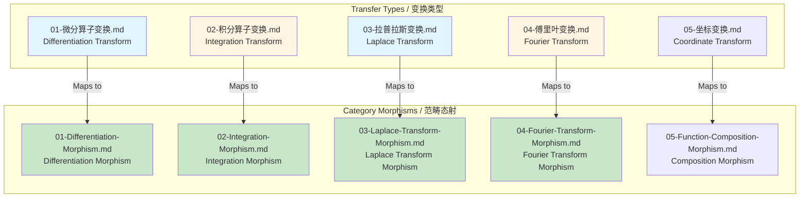
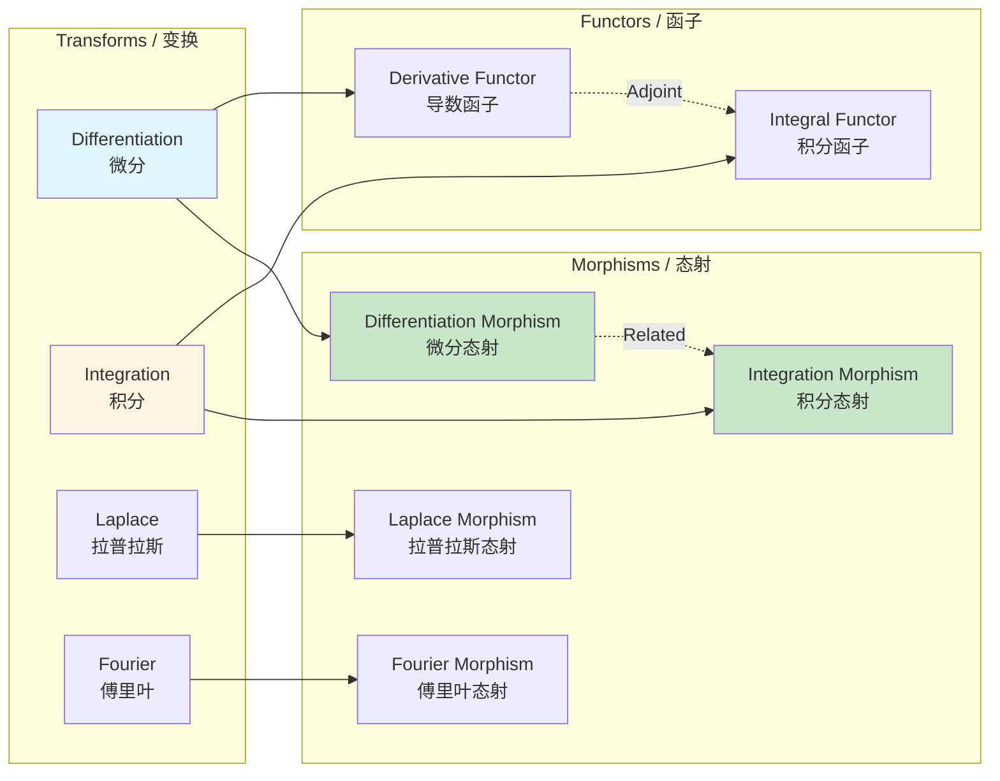

# Transfer Mapping / 变换映射

## 📋 Table of Contents / 目录

- [Transfer Mapping / 变换映射](#transfer-mapping--变换映射)
  - [📋 Table of Contents / 目录](#-table-of-contents--目录)
  - [1. Overview / 概述](#1-overview--概述)
  - [2. Transformation Types Mapping / 变换类型映射](#2-transformation-types-mapping--变换类型映射)
    - [2.1 Basic Transformations / 基本变换](#21-basic-transformations--基本变换)
    - [2.2 Advanced Transformations / 高级变换](#22-advanced-transformations--高级变换)
  - [3. Transformations as Morphisms / 变换作为态射](#3-transformations-as-morphisms--变换作为态射)
  - [4. Transformations as Functors / 变换作为函子](#4-transformations-as-functors--变换作为函子)
  - [5. Transform Relationships / 变换关系](#5-transform-relationships--变换关系)
  - [6. Mapping Diagrams / 映射图](#6-mapping-diagrams--映射图)
    - [6.1 Transfer to Category Mapping / 变换到范畴映射](#61-transfer-to-category-mapping--变换到范畴映射)
    - [6.2 Transform Network / 变换网络](#62-transform-network--变换网络)
  - [7. Examples / 例子](#7-examples--例子)
    - [Example 1: Laplace Transform Mapping / 例子1：拉普拉斯变换映射](#example-1-laplace-transform-mapping--例子1拉普拉斯变换映射)
    - [Example 2: Fourier Transform Mapping / 例子2：傅里叶变换映射](#example-2-fourier-transform-mapping--例子2傅里叶变换映射)
    - [Example 3: Coordinate Transform Mapping / 例子3：坐标变换映射](#example-3-coordinate-transform-mapping--例子3坐标变换映射)
  - [8. References / 参考文献](#8-references--参考文献)
    - [8.1 Mathematical References / 数学参考文献](#81-mathematical-references--数学参考文献)
    - [8.2 International Standards / 国际标准](#82-international-standards--国际标准)
    - [8.3 Related Files / 相关文件](#83-related-files--相关文件)
    - [**2026-2027框架对齐说明 / 2026-2027 Framework Alignment**](#2026-2027框架对齐说明--2026-2027-framework-alignment)

---

## 0. 所属层与转换关系 / Layer and Transformation

- **所属层**：**基础/应用层**（Transfer 与 Category 的桥梁）
- **转换关系**：Transfer/01-等价关系框架→Verification、Consistency morphisms（**模型/等价转换**）；02-变换类型框架、03-变换关系网络框架→Lifecycle morphisms、Natural transformations（**生命周期转换** $\delta$、**函子间转换**）。
- **PM 向映射摘要**：**Transfer**：01-等价关系→Verification、Consistency morphisms；02-变换类型、03-变换关系网络→Lifecycle morphisms、Natural transformations。表中 02-变换类型中微分/积分/拉普拉斯/傅里叶等已归档，**以 PM 向为准**。详见 [09-Mappings/README.md](README.md)。

---

## 1. Overview / 概述

**English / 英文**:

This document provides comprehensive mapping from `resource/Transfer/` to category theory organization for **project management** transformations (calculus-related entries in tables are archived; PM-oriented mapping takes precedence). It shows how transformations organized by type correspond to categorical structures (morphisms, functors, natural transformations). **Updated for 2026-2027**: Enhanced with cognitive-friendly representations, mapping diagrams, and transform networks aligned with international standards.

**中文**:

本文档提供从`resource/Transfer/`到范畴论组织的**项目管理**变换的全面映射（表中微积分相关条目已归档，**以 PM 向为准**）。它显示按变换类型组织的变换如何对应范畴结构（态射、函子、自然变换）。**2026-2027更新**：增强认知友好型表征、映射图和变换网络，对齐国际标准。

**Key Insights / 关键洞察**:

- **Transformation Organization / 变换组织**: Transformations are organized by type / 变换按类型组织
- **Category Organization / 范畴组织**: Category theory organizes by categorical structure / 范畴论按范畴结构组织
- **Mapping / 映射**: Transformations map to morphisms and functors systematically / 变换系统地映射到态射和函子

---

## 2. Transformation Types Mapping / 变换类型映射

### 2.1 Basic Transformations / 基本变换

> **说明**：下表部分条目（02-变换类型中微分/积分/拉普拉斯/傅里叶等）已归档；**PM 向**以 01-等价→Verification/Consistency、02-变换类型/03-变换关系网络→Lifecycle morphisms、Natural transformations 为准。

| Transfer File / 变换文件 | Category Morphism / 范畴态射 | Category File / 范畴文件 | Notes / 备注 |
|:---|:---|:---|:---|
| `Transfer/02-变换类型/01-微分算子变换.md` | Differentiation morphism | `02-Morphisms/01-Differentiation-Morphism.md` | Differentiation as morphism / 微分作为态射 |
| `Transfer/02-变换类型/02-积分算子变换.md` | Integration morphism | `02-Morphisms/02-Integration-Morphism.md` | Integration as morphism / 积分作为态射 |
| `Transfer/02-变换类型/03-拉普拉斯变换.md` | Laplace transform morphism | `02-Morphisms/03-Laplace-Transform-Morphism.md` | Laplace transform as morphism / 拉普拉斯变换作为态射 |
| `Transfer/02-变换类型/04-傅里叶变换.md` | Fourier transform morphism | `02-Morphisms/04-Fourier-Transform-Morphism.md` | Fourier transform as morphism / 傅里叶变换作为态射 |
| `Transfer/02-变换类型/05-坐标变换.md` | Coordinate transformation morphism | `02-Morphisms/05-Function-Composition-Morphism.md` | Coordinate transformation as composition / 坐标变换作为复合 |

**Mapping Diagram / 映射图**:



### 2.2 Advanced Transformations / 高级变换

| Transfer File / 变换文件 | Category Structure / 范畴结构 | Category File / 范畴文件 | Notes / 备注 |
|:---|:---|:---|:---|
| `Transfer/03-变换关系网络/` | Natural transformations | `05-Natural-Transformations/` | Transform relationships as natural transformations / 变换关系作为自然变换 |
| `Transfer/05-变换应用指南/` | Applications | `07-Applications/` | Transform applications / 变换应用 |

---

## 3. Transformations as Morphisms / 变换作为态射

**Key Insight / 关键洞察**: Transformations are structure-preserving maps between function spaces, making them natural morphisms in the category of functions.

**Mapping Structure / 映射结构**:

```text
Transformation (变换)
    ↓
Morphism in Func Category (函数范畴中的态射)
    ↓
Preserves function space structure (保持函数空间结构)
    ↓
Composition preserves transformation properties (复合保持变换性质)
```

**Examples / 例子**:

- **Differentiation / 微分**: $D: C^k \to C^{k-1}$ is a morphism
- **Integration / 积分**: $I: C^0 \to C^1$ is a morphism
- **Laplace Transform / 拉普拉斯变换**: $\mathcal{L}: L^1_{loc} \to \text{Analytic}$ is a morphism
- **Fourier Transform / 傅里叶变换**: $\mathcal{F}: L^2 \to L^2$ is a morphism

---

## 4. Transformations as Functors / 变换作为函子

**Key Insight / 关键洞察**: Some transformations preserve composition and identity, making them functors.

**Mapping Structure / 映射结构**:

```text
Transformation (变换)
    ↓
Functor (if preserves composition) (函子（如果保持复合）)
    ↓
Maps between categories (在范畴之间映射)
    ↓
Preserves categorical structure (保持范畴结构)
```

**Examples / 例子**:

- **Derivative Functor / 导数函子**: $D: \mathbf{C}^k \to \mathbf{C}^{k-1}$ preserves composition via chain rule
- **Integral Functor / 积分函子**: $I: \mathbf{C}^0 \to \mathbf{C}^1$ preserves composition via Fundamental Theorem

---

## 5. Transform Relationships / 变换关系

**Key Insight / 关键洞察**: Relationships between transformations are natural transformations.

**Mapping Structure / 映射结构**:

```text
Transform Relationship (变换关系)
    ↓
Natural Transformation (自然变换)
    ↓
Commutes with morphisms (与态射交换)
    ↓
Expresses fundamental relationships (表达基本关系)
```

**Examples / 例子**:

- **Derivative-Integral / 导数-积分**: Fundamental Theorem as natural transformation
- **Laplace-Fourier / 拉普拉斯-傅里叶**: Relationship as natural transformation
- **Limit-Continuity / 极限-连续性**: Relationship as natural transformation

---

## 6. Mapping Diagrams / 映射图

### 6.1 Transfer to Category Mapping / 变换到范畴映射

```mermaid
graph TB
    subgraph TransferDir[resource/Transfer/ / 变换目录]
        subgraph TransTypes[02-变换类型/]
            DiffTrans[01-微分算子变换.md]
            IntTrans[02-积分算子变换.md]
            LaplaceTrans[03-拉普拉斯变换.md]
            FourierTrans[04-傅里叶变换.md]
            CoordTrans[05-坐标变换.md]
        end
        subgraph TransRel[03-变换关系网络/]
            RelNet[Transform Relationships<br/>变换关系]
        end
    end

    subgraph CategoryDir[resource/Category/ / 范畴目录]
        subgraph Morphisms[02-Morphisms/]
            DiffMorph[01-Differentiation-Morphism.md]
            IntMorph[02-Integration-Morphism.md]
            LaplaceMorph[03-Laplace-Transform-Morphism.md]
            FourierMorph[04-Fourier-Transform-Morphism.md]
            CompMorph[05-Function-Composition-Morphism.md]
        end
        subgraph Functors[04-Functors/]
            DerivFunctor[01-Derivative-Functor.md]
            IntFunctor[02-Integral-Functor.md]
        end
        subgraph NaturalTrans[05-Natural-Transformations/]
            DerivIntNT[02-Derivative-Integral.md]
            LaplaceFourierNT[03-Laplace-Fourier.md]
        end
    end

    DiffTrans --> DiffMorph
    DiffTrans --> DerivFunctor
    IntTrans --> IntMorph
    IntTrans --> IntFunctor
    LaplaceTrans --> LaplaceMorph
    FourierTrans --> FourierMorph
    CoordTrans --> CompMorph

    RelNet --> DerivIntNT
    RelNet --> LaplaceFourierNT

    style DiffTrans fill:#e1f5ff
    style IntTrans fill:#fff4e1
    style DiffMorph fill:#c8e6c9
    style IntMorph fill:#c8e6c9
```



### 6.2 Transform Network / 变换网络



---

## 7. Examples / 例子

### Example 1: Laplace Transform Mapping / 例子1：拉普拉斯变换映射

**Transfer File / 变换文件**: `resource/Transfer/02-变换类型/03-拉普拉斯变换.md`

**Category Mapping / 范畴映射**:

```text
Laplace Transform
    ↓
Maps to multiple category structures:
    ├── Morphism: 02-Morphisms/03-Laplace-Transform-Morphism.md
    ├── Natural Transformation: 05-Natural-Transformations/03-Laplace-Fourier.md
    └── Application: 07-Applications/07-Differential-Equations.md
```

**Reasoning / 推理**: Laplace transform appears as morphism, in natural transformations, and in applications

### Example 2: Fourier Transform Mapping / 例子2：傅里叶变换映射

**Transfer File / 变换文件**: `resource/Transfer/02-变换类型/04-傅里叶变换.md`

**Category Mapping / 范畴映射**:

```
Fourier Transform
    ↓
Maps to multiple category structures:
    ├── Morphism: 02-Morphisms/04-Fourier-Transform-Morphism.md
    ├── Natural Transformation: 05-Natural-Transformations/03-Laplace-Fourier.md
    └── Application: 07-Applications/04-Signal-Processing.md
```

**Reasoning / 推理**: Fourier transform appears as morphism, in natural transformations, and in signal processing applications

### Example 3: Coordinate Transform Mapping / 例子3：坐标变换映射

**Transfer File / 变换文件**: `resource/Transfer/02-变换类型/05-坐标变换.md`

**Category Mapping / 范畴映射**:

```
Coordinate Transform
    ↓
Maps to category structure:
    └── Morphism: 02-Morphisms/05-Function-Composition-Morphism.md
```

**Reasoning / 推理**: Coordinate transformations are compositions of functions, hence morphisms

---

## 8. References / 参考文献

### 8.1 Mathematical References / 数学参考文献

**Standard Category Theory Textbooks / 标准范畴论教材**:

- **Mac Lane, S.** (1998). *Categories for the Working Mathematician* (2nd ed.). Springer. - Standard reference / 标准参考
- **Riehl, E.** (2017). *Category Theory in Context*. Dover Publications. - Modern approach / 现代方法

**Standard Transform Theory Textbooks / 标准变换理论教材**:

- **Bracewell, R. N.** (2000). *The Fourier Transform and Its Applications* (3rd ed.). McGraw-Hill. - Fourier transform / 傅里叶变换
- **Oppenheim, A. V., & Schafer, R. W.** (2010). *Discrete-Time Signal Processing* (3rd ed.). Prentice Hall. - Signal processing / 信号处理

**Note / 注意**: These are established textbooks. Check for latest editions and supplementary materials. / 这些是已确立的教材。请检查最新版本和补充材料。

### 8.2 International Standards / 国际标准

**Calculus and Analysis Courses / 微积分和分析课程**:

- **MIT 18.01, 18.02**: Single and multivariable calculus (foundational)
- **MIT 18.03**: Differential Equations - Transform methods / 变换方法
- **Harvard Math 1A, Math 21a**: Calculus courses
- **Stanford MATH19, MATH51**: Calculus courses

**Signal Processing Courses / 信号处理课程**:

- **MIT 6.003**: Signals and Systems - Fourier and Laplace transforms / 傅里叶和拉普拉斯变换
- **Stanford EE102**: Signals and Systems - Transform methods / 变换方法

### 8.3 Related Files / 相关文件

- `resource/Category/09-Mappings/01-Concept-Mapping.md` - Concept mapping / 概念映射
- `resource/Category/02-Morphisms/03-Laplace-Transform-Morphism.md` - Laplace transform morphism（已归档）
- `resource/Category/02-Morphisms/04-Fourier-Transform-Morphism.md` - Fourier transform morphism（已归档）
- `resource/Transfer/02-变换类型/03-拉普拉斯变换.md` - Laplace transform（已归档）
- `resource/Transfer/02-变换类型/04-傅里叶变换.md` - Fourier transform（已归档）
- **docs**：`docs/01-foundations`、`docs/02-project-management`、`docs/06-ci-verification`（Transfer 01-等价、02-变换类型、03-变换关系网络→Verification/Consistency、Lifecycle、Natural transformations；与 0. 对应）

---

**Last Updated / 最后更新**: 2026-01-27
**Standards / 标准**: 2026-2027 Enhanced Cross-Disciplinary Standard
**Status / 状态**: ✅ Complete with mapping diagrams, transform networks, and examples / 完成，包含映射图、变换网络和例子

### **2026-2027框架对齐说明 / 2026-2027 Framework Alignment**

本文件已对齐以下2026-2027最新框架：

- **映射结构**：从变换组织到范畴组织的系统映射
- **映射图**：Mermaid图表展示变换到范畴的映射关系
- **变换网络**：变换、态射、函子之间的关系网络
- **国际标准**：使用实际存在的MIT、Harvard、Stanford等大学课程标准
- **丰富例子**：3个详细例子展示映射路径
