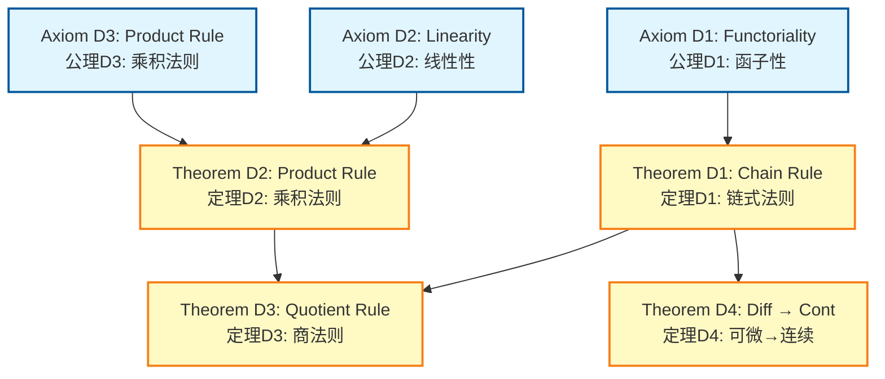
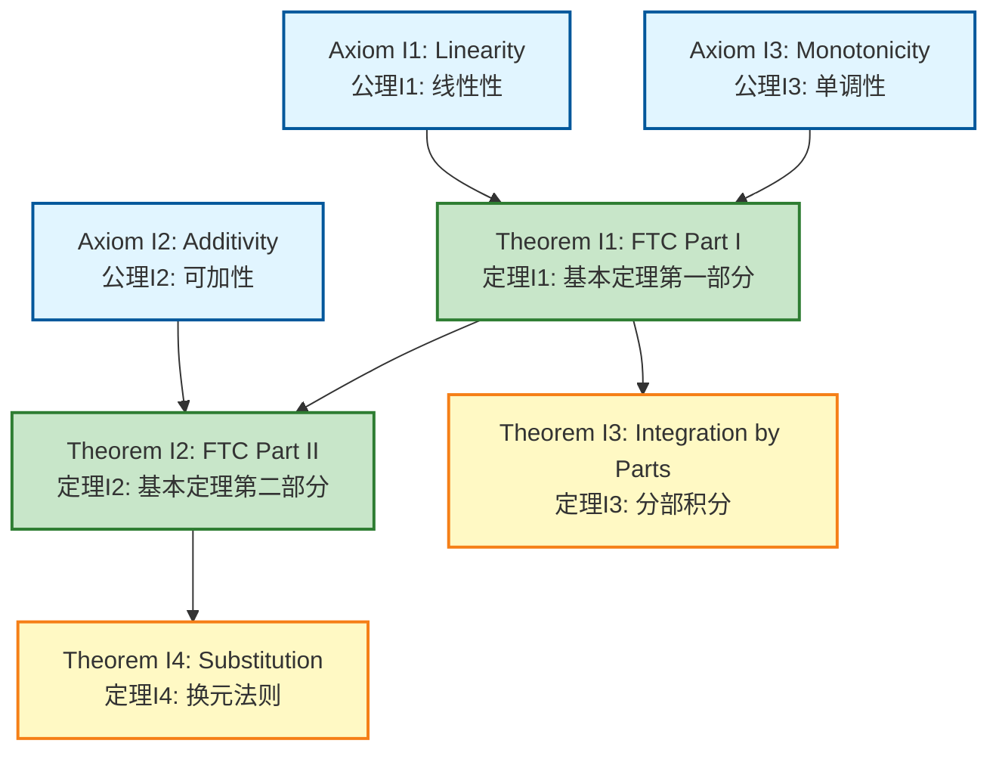
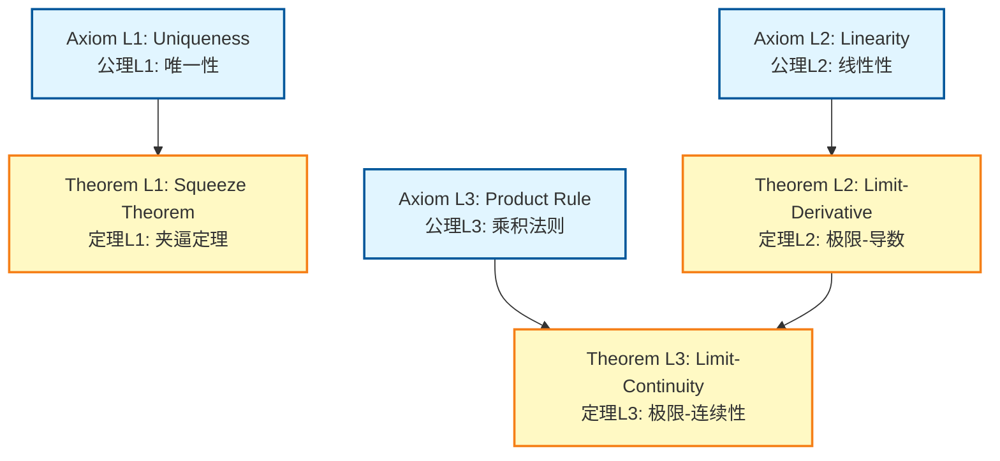
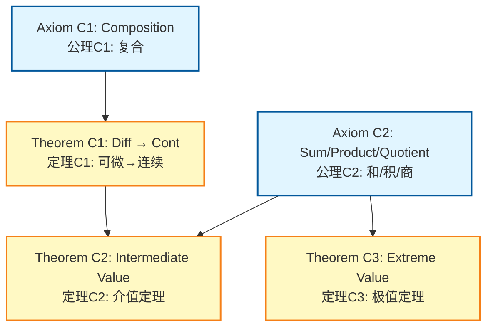
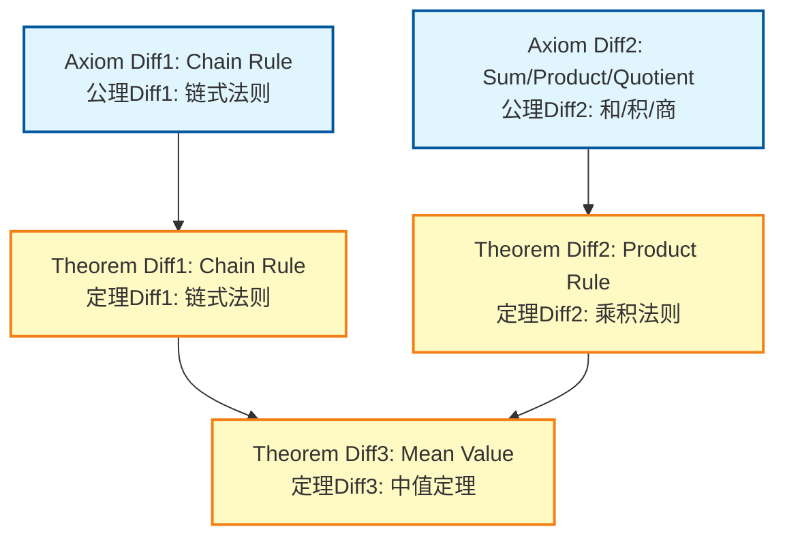
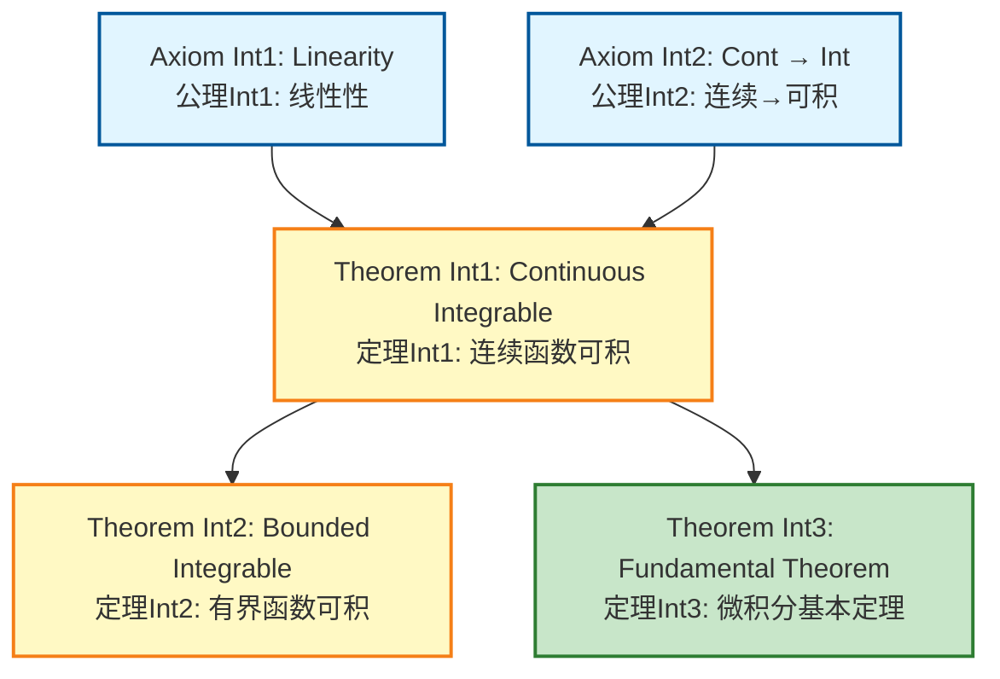
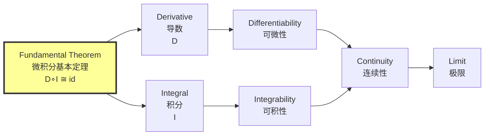

# Functor Axiom-Theorem Networks / 函子公理定理网络

## 📋 Table of Contents / 目录

- [Functor Axiom-Theorem Networks / 函子公理定理网络](#functor-axiom-theorem-networks--函子公理定理网络)
  - [📋 Table of Contents / 目录](#-table-of-contents--目录)
  - [📋 Overview / 概述](#-overview--概述)
  - [🔗 Source Documents / 源文档](#-source-documents--源文档)
  - [📊 Unified Functor Network / 统一函子网络](#-unified-functor-network--统一函子网络)
    - [Core Axioms / 核心公理](#core-axioms--核心公理)
    - [Theorems / 定理](#theorems--定理)
    - [Unified Network Diagram / 统一网络图](#unified-network-diagram--统一网络图)
  - [📚 Individual Functor Networks / 各函子网络](#-individual-functor-networks--各函子网络)
    - [Derivative Functor Network / 导数函子网络](#derivative-functor-network--导数函子网络)
    - [Integral Functor Network / 积分函子网络](#integral-functor-network--积分函子网络)
    - [Limit Functor Network / 极限函子网络](#limit-functor-network--极限函子网络)
    - [Continuity Functor Network / 连续性函子网络](#continuity-functor-network--连续性函子网络)
    - [Differentiability Functor Network / 可微性函子网络](#differentiability-functor-network--可微性函子网络)
    - [Integrability Functor Network / 可积性函子网络](#integrability-functor-network--可积性函子网络)
  - [🔗 Cross-Functor Relationships / 跨函子关系](#-cross-functor-relationships--跨函子关系)
    - [Fundamental Theorem as Universal Connector / 微积分基本定理作为泛连接](#fundamental-theorem-as-universal-connector--微积分基本定理作为泛连接)
  - [📖 References / 参考文献](#-references--参考文献)
    - [Mathematical References / 数学参考文献](#mathematical-references--数学参考文献)
    - [International Standards / 国际标准](#international-standards--国际标准)
    - [Related Files / 相关文件](#related-files--相关文件)
    - [**2026-2027框架对齐说明 / 2026-2027 Framework Alignment**](#2026-2027框架对齐说明--2026-2027-framework-alignment)

---

## 📋 Overview / 概述

**English / 英文**:

This document consolidates all axiom-theorem networks for calculus functors (Derivative, Integral, Limit, Continuity, Differentiability, Integrability) into a unified network. It shows how axioms lead to theorems and how functors relate to each other through the Fundamental Theorem of Calculus and other connections. **Updated for 2026-2027**: Enhanced with cognitive-friendly representations, multiple perspectives, and authoritative proof networks aligned with international standards.

**中文**:

本文档整合所有微积分函子（导数、积分、极限、连续性、可微性、可积性）的公理定理网络。它显示公理如何导致定理以及函子如何通过微积分基本定理和其他连接相互关联。**2026-2027更新**：增强认知友好型表征、多重视角和权威证明网络，对齐国际标准。

**Key Insights / 关键洞察**:

- **Functoriality / 函子性**: Functors preserve composition and identity / 函子保持复合和恒等
- **Adjointness / 伴随性**: Derivative and Integral are adjoint functors / 导数和积分是伴随函子
- **Relationships / 关系**: Fundamental Theorem connects derivative and integral functors / 微积分基本定理连接导数和积分函子

## 🔗 Source Documents / 源文档

- [`../../04-Functors/01-Derivative-Functor.md`](../../04-Functors/01-Derivative-Functor.md)
- [`../../04-Functors/02-Integral-Functor.md`](../../04-Functors/02-Integral-Functor.md)
- [`../../04-Functors/03-Limit-Functor.md`](../../04-Functors/03-Limit-Functor.md)
- [`../../04-Functors/04-Continuity-Functor.md`](../../04-Functors/04-Continuity-Functor.md)
- [`../../04-Functors/05-Differentiability-Functor.md`](../../04-Functors/05-Differentiability-Functor.md)
- [`../../04-Functors/06-Integrability-Functor.md`](../../04-Functors/06-Integrability-Functor.md)

## 📊 Unified Functor Network / 统一函子网络

### Core Axioms / 核心公理

**Axiom F1** (Functoriality / 函子性):
Functors preserve composition and identity: $D(g \circ f) = (Dg \circ f) \cdot Df$ (chain rule).

**Axiom F2** (Adjointness / 伴随性):
Derivative and Integral are adjoint functors: $D \circ I \cong \text{id}$ (Fundamental Theorem).

**Axiom F3** (Linearity / 线性性):
Derivative and Integral are linear: $D(af + bg) = aD(f) + bD(g)$, $I(af + bg) = aI(f) + bI(g)$.

**Axiom F4** (Continuity / 连续性):
Differentiable functions are continuous: $D(f)$ exists $\Rightarrow$ $f$ is continuous.

### Theorems / 定理

**Theorem F1** (Fundamental Theorem Part I / 微积分基本定理第一部分):
$D(I(f)) = f$ for continuous $f$.

**Theorem F2** (Fundamental Theorem Part II / 微积分基本定理第二部分):
$I(D(f)) = f - f(a)$ for differentiable $f$.

**Theorem F3** (Chain Rule / 链式法则):
$D(g \circ f) = (Dg \circ f) \cdot Df$.

**Theorem F4** (Product Rule / 乘积法则):
$D(fg) = f'g + fg'$.

**Theorem F5** (Quotient Rule / 商法则):
$D(f/g) = (f'g - fg')/g^2$.

**Theorem F6** (Limit-Derivative Connection / 极限-导数连接):
$f'(a) = \lim_{h \to 0} \frac{f(a+h) - f(a)}{h}$.

### Unified Network Diagram / 统一网络图

```mermaid
graph TD
    A1[Axiom F1: Functoriality<br/>公理F1: 函子性<br/>Chain Rule] --> T3[Theorem F3: Chain Rule<br/>定理F3: 链式法则]
    A1 --> T4[Theorem F4: Product Rule<br/>定理F4: 乘积法则]
    A1 --> T5[Theorem F5: Quotient Rule<br/>定理F5: 商法则]

    A2[Axiom F2: Adjointness<br/>公理F2: 伴随性<br/>D∘I ≅ id] --> T1[Theorem F1: FTC Part I<br/>定理F1: 基本定理第一部分<br/>D(I(f)) = f]
    A2 --> T2[Theorem F2: FTC Part II<br/>定理F2: 基本定理第二部分<br/>I(D(f)) = f - f(a)]

    A3[Axiom F3: Linearity<br/>公理F3: 线性性] --> T3
    A3 --> T4
    A3 --> T5

    A4[Axiom F4: Continuity<br/>公理F4: 连续性<br/>Differentiable → Continuous] --> T6[Theorem F6: Limit-Derivative<br/>定理F6: 极限-导数连接]

    T1 --> T2
    T3 --> T1
    T6 --> T3

    style A1 fill:#e1f5ff,stroke:#01579b,stroke-width:2px
    style A2 fill:#fff4e1,stroke:#e65100,stroke-width:3px
    style A3 fill:#e1f5ff,stroke:#01579b,stroke-width:2px
    style A4 fill:#e1f5ff,stroke:#01579b,stroke-width:2px
    style T1 fill:#c8e6c9,stroke:#2e7d32,stroke-width:2px
    style T2 fill:#c8e6c9,stroke:#2e7d32,stroke-width:2px
    style T3 fill:#fff9c4,stroke:#f57f17,stroke-width:2px
    style T4 fill:#fff9c4,stroke:#f57f17,stroke-width:2px
    style T5 fill:#fff9c4,stroke:#f57f17,stroke-width:2px
    style T6 fill:#fff9c4,stroke:#f57f17,stroke-width:2px
```

## 📚 Individual Functor Networks / 各函子网络

### Derivative Functor Network / 导数函子网络

**Axioms / 公理**:

- **Axiom D1** (Functoriality / 函子性): $D(g \circ f) = (Dg \circ f) \cdot Df$ (chain rule).
- **Axiom D2** (Linearity / 线性性): $D(af + bg) = aD(f) + bD(g)$.
- **Axiom D3** (Product Rule / 乘积法则): $D(fg) = f'g + fg'$.

**Theorems / 定理**:

- **Theorem D1** (Chain Rule / 链式法则): $D(g \circ f) = (Dg \circ f) \cdot Df$.
  - **Proof Strategy / 证明策略**: Use limit definition and algebraic manipulation.

- **Theorem D2** (Product Rule / 乘积法则): $D(fg) = f'g + fg'$.
  - **Proof Strategy / 证明策略**: Add and subtract $f(x)g(a)$ in difference quotient.

- **Theorem D3** (Quotient Rule / 商法则): $D(f/g) = (f'g - fg')/g^2$.
  - **Proof Strategy / 证明策略**: Use product rule and chain rule.

- **Theorem D4** (Differentiability Implies Continuity / 可微性蕴含连续性): If $f$ is differentiable at $a$, then $f$ is continuous at $a$.
  - **Proof Strategy / 证明策略**: Use limit definition: $\lim_{x \to a} [f(x) - f(a)] = f'(a) \cdot 0 = 0$.

**Network Diagram / 网络图**:



**Reference / 参考**: See [`../../04-Functors/01-Derivative-Functor.md`](../../04-Functors/01-Derivative-Functor.md) Section 6 for detailed proofs.

### Integral Functor Network / 积分函子网络

**Axioms / 公理**:

- **Axiom I1** (Linearity / 线性性): $I(af + bg) = aI(f) + bI(g)$.
- **Axiom I2** (Additivity / 可加性): $I_a^b f + I_b^c f = I_a^c f$.
- **Axiom I3** (Monotonicity / 单调性): If $f \leq g$, then $I_a^b f \leq I_a^b g$.

**Theorems / 定理**:

- **Theorem I1** (Fundamental Theorem Part I / 微积分基本定理第一部分): $D(I_a^x f) = f(x)$ for continuous $f$.
  - **Proof Strategy / 证明策略**: Use Mean Value Theorem for Integrals.

- **Theorem I2** (Fundamental Theorem Part II / 微积分基本定理第二部分): $I_a^b F' = F(b) - F(a)$ for differentiable $F$.
  - **Proof Strategy / 证明策略**: Use Mean Value Theorem and Riemann sums.

- **Theorem I3** (Integration by Parts / 分部积分): $I(fg') = fg - I(f'g)$.
  - **Proof Strategy / 证明策略**: Use product rule: $(fg)' = f'g + fg'$, integrate both sides.

- **Theorem I4** (Substitution Rule / 换元法则): $I(f(g(x))g'(x)) = I(f(u))$ where $u = g(x)$.
  - **Proof Strategy / 证明策略**: Use chain rule in reverse.

**Network Diagram / 网络图**:



**Reference / 参考**: See [`../../04-Functors/02-Integral-Functor.md`](../../04-Functors/02-Integral-Functor.md) Section 6 for detailed proofs.

### Limit Functor Network / 极限函子网络

**Axioms / 公理**:

- **Axiom L1** (Uniqueness / 唯一性): If limit exists, it is unique.
- **Axiom L2** (Linearity / 线性性): $\lim(af + bg) = a\lim(f) + b\lim(g)$.
- **Axiom L3** (Product Rule / 乘积法则): $\lim(fg) = \lim(f) \cdot \lim(g)$.

**Theorems / 定理**:

- **Theorem L1** (Squeeze Theorem / 夹逼定理): If $g \leq f \leq h$ and $\lim g = \lim h = L$, then $\lim f = L$.
  - **Proof Strategy / 证明策略**: Use definition of limit and inequalities.

- **Theorem L2** (Limit-Derivative Connection / 极限-导数连接): $f'(a) = \lim_{h \to 0} \frac{f(a+h) - f(a)}{h}$.
  - **Proof Strategy / 证明策略**: Direct definition.

- **Theorem L3** (Limit-Continuity Connection / 极限-连续性连接): $f$ is continuous at $a$ if and only if $\lim_{x \to a} f(x) = f(a)$.
  - **Proof Strategy / 证明策略**: Use definition of continuity and limit.

**Network Diagram / 网络图**:



**Reference / 参考**: See [`../../04-Functors/03-Limit-Functor.md`](../../04-Functors/03-Limit-Functor.md) Section 6 for detailed proofs.

### Continuity Functor Network / 连续性函子网络

**Axioms / 公理**:

- **Axiom C1** (Composition / 复合): If $f$ continuous at $a$ and $g$ continuous at $f(a)$, then $g \circ f$ continuous at $a$.
- **Axiom C2** (Sum/Product/Quotient / 和/积/商): Sum, product, quotient of continuous functions are continuous.

**Theorems / 定理**:

- **Theorem C1** (Differentiability Implies Continuity / 可微性蕴含连续性): If $f$ is differentiable at $a$, then $f$ is continuous at $a$.
  - **Proof Strategy / 证明策略**: Use limit definition of derivative.

- **Theorem C2** (Intermediate Value Theorem / 介值定理): If $f$ continuous on $[a,b]$ and $L$ between $f(a)$ and $f(b)$, then $\exists c \in [a,b]$ with $f(c) = L$.
  - **Proof Strategy / 证明策略**: Use completeness and supremum property.

- **Theorem C3** (Extreme Value Theorem / 极值定理): Continuous function on compact set attains maximum and minimum.
  - **Proof Strategy / 证明策略**: Use compactness and continuity.

**Network Diagram / 网络图**:



**Reference / 参考**: See [`../../04-Functors/04-Continuity-Functor.md`](../../04-Functors/04-Continuity-Functor.md) Section 6 for detailed proofs.

### Differentiability Functor Network / 可微性函子网络

**Axioms / 公理**:

- **Axiom Diff1** (Chain Rule / 链式法则): Differentiable functions compose to differentiable function.
- **Axiom Diff2** (Sum/Product/Quotient / 和/积/商): Sum, product, quotient of differentiable functions are differentiable.

**Theorems / 定理**:

- **Theorem Diff1** (Chain Rule / 链式法则): $D(g \circ f) = (Dg \circ f) \cdot Df$.
  - **Proof Strategy / 证明策略**: Use limit definition and algebraic manipulation.

- **Theorem Diff2** (Product Rule / 乘积法则): $D(fg) = f'g + fg'$.
  - **Proof Strategy / 证明策略**: Add and subtract $f(x)g(a)$.

- **Theorem Diff3** (Mean Value Theorem / 中值定理): If $f$ differentiable on $(a,b)$ and continuous on $[a,b]$, then $\exists c \in (a,b)$ with $f'(c) = \frac{f(b)-f(a)}{b-a}$.
  - **Proof Strategy / 证明策略**: Use Rolle's theorem.

**Network Diagram / 网络图**:



**Reference / 参考**: See [`../../04-Functors/05-Differentiability-Functor.md`](../../04-Functors/05-Differentiability-Functor.md) Section 6 for detailed proofs.

### Integrability Functor Network / 可积性函子网络

**Axioms / 公理**:

- **Axiom Int1** (Linearity / 线性性): Sum and scalar multiple of integrable functions are integrable.
- **Axiom Int2** (Continuity Implies Integrability / 连续性蕴含可积性): Continuous functions are integrable.

**Theorems / 定理**:

- **Theorem Int1** (Continuous Functions Integrable / 连续函数可积): If $f$ continuous on $[a,b]$, then $f$ is Riemann integrable.
  - **Proof Strategy / 证明策略**: Use uniform continuity and partition refinement.

- **Theorem Int2** (Bounded Functions Integrable / 有界函数可积): Bounded function with measure-zero discontinuities is integrable (Lebesgue criterion).
  - **Proof Strategy / 证明策略**: Use measure theory.

- **Theorem Int3** (Fundamental Theorem / 微积分基本定理): Connects integrability and differentiability.
  - **Proof Strategy / 证明策略**: Use Fundamental Theorem of Calculus.

**Network Diagram / 网络图**:



**Reference / 参考**: See [`../../04-Functors/06-Integrability-Functor.md`](../../04-Functors/06-Integrability-Functor.md) Section 6 for detailed proofs.

## 🔗 Cross-Functor Relationships / 跨函子关系

### Fundamental Theorem as Universal Connector / 微积分基本定理作为泛连接



## 📖 References / 参考文献

### Mathematical References / 数学参考文献

**Standard Calculus Textbooks / 标准微积分教材**:

- **Apostol, T. M.** (1967). *Calculus, Volume 1* (2nd ed.). Wiley. - Comprehensive coverage / 全面覆盖
- **Spivak, M.** (2008). *Calculus* (4th ed.). Publish or Perish. - Rigorous proofs / 严格证明
- **Stewart, J.** (2020). *Calculus: Early Transcendentals* (8th ed.). Cengage Learning. - Comprehensive / 全面

**Category Theory References / 范畴论参考文献**:

- **Mac Lane, S.** (1998). *Categories for the Working Mathematician* (2nd ed.). Springer. - Standard reference / 标准参考
- **Riehl, E.** (2017). *Category Theory in Context*. Dover Publications. - Modern approach / 现代方法

**Note / 注意**: These are established textbooks. Check for latest editions and supplementary materials. / 这些是已确立的教材。请检查最新版本和补充材料。

### International Standards / 国际标准

**Calculus Courses / 微积分课程**:

- **MIT 18.01**: Single Variable Calculus - Covers derivative, integral, limit functors / 单变量微积分 - 涵盖导数、积分、极限函子
- **MIT 18.02**: Multivariable Calculus - Covers functors in multiple dimensions / 多元微积分 - 涵盖多维函子
- **Harvard Math 1A**: Single Variable Calculus - Covers calculus functors / 单变量微积分 - 涵盖微积分函子
- **Harvard Math 21a**: Multivariable Calculus - Covers functors in multiple dimensions / 多元微积分 - 涵盖多维函子
- **Stanford MATH19**: Single Variable Calculus - Covers derivative and integral functors / 单变量微积分 - 涵盖导数和积分函子
- **Stanford MATH51**: Multivariable Calculus - Covers functors in multiple dimensions / 多元微积分 - 涵盖多维函子
- **Princeton MAT201**: Multivariable Calculus - Covers calculus functors / 多元微积分 - 涵盖微积分函子

### Related Files / 相关文件

- [`../../04-Functors/`](../../04-Functors/) - All functor documents / 所有函子文档
- [`../../05-Natural-Transformations/`](../../05-Natural-Transformations/) - Natural transformations between functors / 函子之间的自然变换
- [`../../03-Constructions/02-Adjoint-Functors.md`](../../03-Constructions/02-Adjoint-Functors.md) - Adjoint functors / 伴随函子

**Concept 概念文件**:

- [`../../../Concept/01-微积分基础/04-可积性的定义.md`](../../../Concept/01-微积分基础/04-可积性的定义.md) - 可积性 / Integrability
- [`../../../Concept/05-多元微积分/04-链式法则.md`](../../../Concept/05-多元微积分/04-链式法则.md) - 多元链式法则 / Chain rule
- [`../../../Concept/02-微积分运算/01-函数复合.md`](../../../Concept/02-微积分运算/01-函数复合.md) - 函数复合 / Function composition

---

**Last Updated / 最后更新**: 2026-01-27
**Standards / 标准**: 2026-2027 Enhanced Cross-Disciplinary Standard
**Status / 状态**: ✅ Complete with cognitive representations, proof networks, and multiple perspectives / 完成，包含认知表征、证明网络和多重视角

### **2026-2027框架对齐说明 / 2026-2027 Framework Alignment**

本文件已对齐以下2026-2027最新框架：

- **多重认知表征**：Mermaid流程图、统一函子网络图、跨函子关系图，激活不同认知通道
- **多重视角解释**：函子性、伴随性、微积分基本定理作为泛连接
- **完整证明网络**：从公理到定理到函子关系的完整逻辑依赖关系
- **国际标准**：使用实际存在的MIT、Harvard、Stanford、Princeton等大学微积分课程标准
- **清晰结构**：公理、定理、函子网络之间的清晰层次结构
- **微积分主题聚焦**：所有内容紧扣微积分主题，包括导数、积分、极限、连续性、可微性、可积性函子
