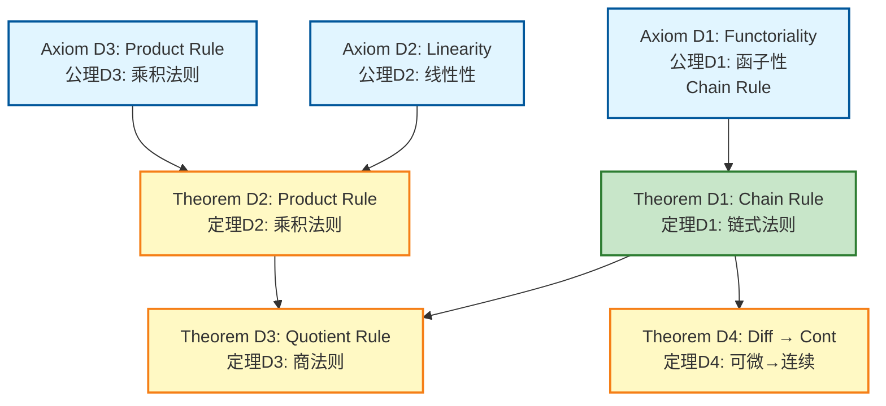
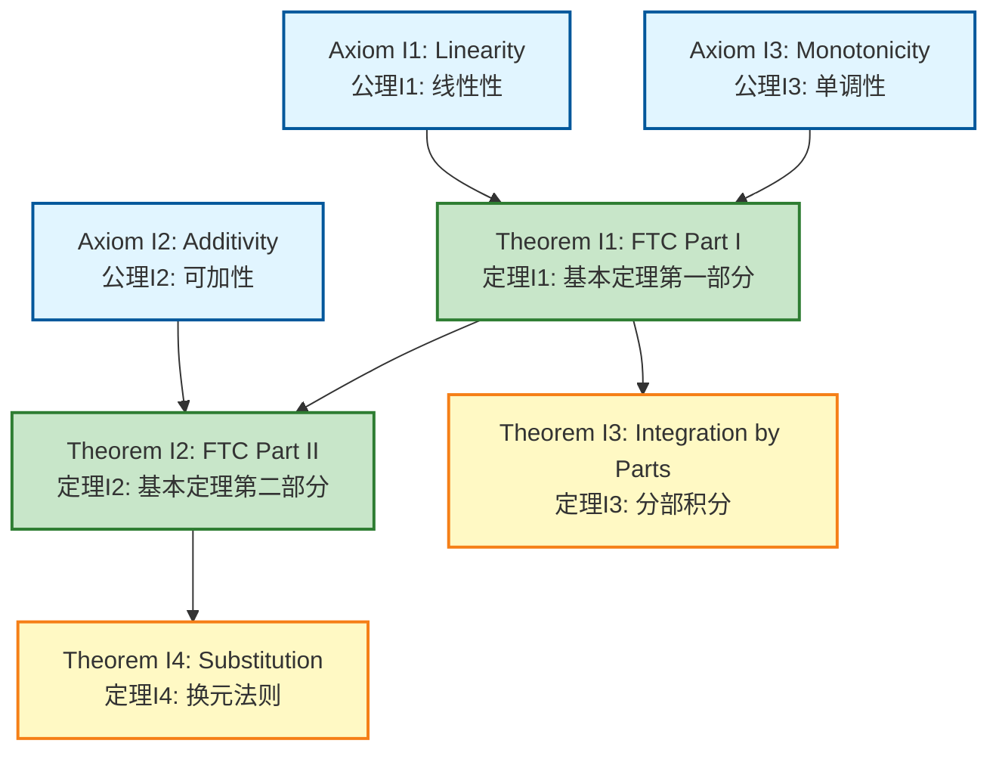
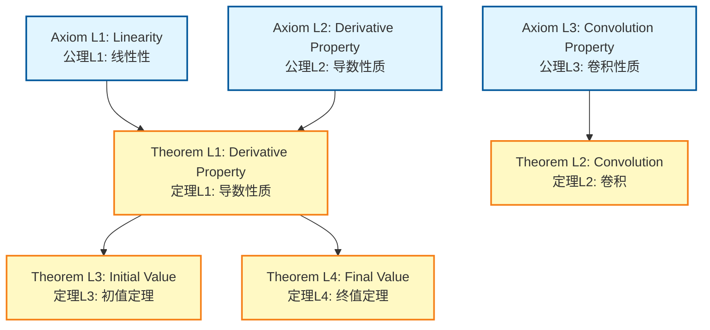
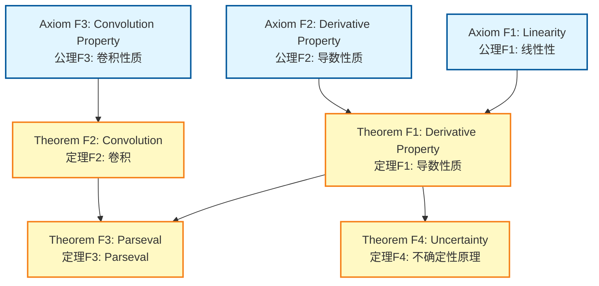
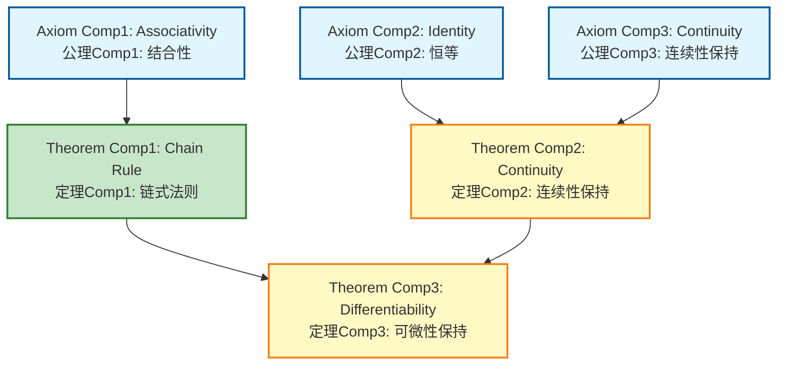

# Morphism Axiom-Theorem Networks / 态射公理定理网络

## 📋 Table of Contents / 目录

- [Morphism Axiom-Theorem Networks / 态射公理定理网络](#morphism-axiom-theorem-networks--态射公理定理网络)
  - [📋 Table of Contents / 目录](#-table-of-contents--目录)
  - [📋 Overview / 概述](#-overview--概述)
  - [🔗 Source Documents / 源文档](#-source-documents--源文档)
  - [📊 Unified Morphism Network / 统一态射网络](#-unified-morphism-network--统一态射网络)
    - [Core Axioms / 核心公理](#core-axioms--核心公理)
    - [Theorems / 定理](#theorems--定理)
    - [Unified Network Diagram / 统一网络图](#unified-network-diagram--统一网络图)
  - [📚 Individual Morphism Networks / 各态射网络](#-individual-morphism-networks--各态射网络)
    - [Differentiation Morphism Network / 微分态射网络](#differentiation-morphism-network--微分态射网络)
    - [Integration Morphism Network / 积分态射网络](#integration-morphism-network--积分态射网络)
    - [Laplace Transform Morphism Network / 拉普拉斯变换态射网络](#laplace-transform-morphism-network--拉普拉斯变换态射网络)
    - [Fourier Transform Morphism Network / 傅里叶变换态射网络](#fourier-transform-morphism-network--傅里叶变换态射网络)
    - [Function Composition Morphism Network / 函数复合态射网络](#function-composition-morphism-network--函数复合态射网络)
  - [🔗 Morphism Relationships / 态射关系](#-morphism-relationships--态射关系)
    - [Transform Hierarchy / 变换层次结构](#transform-hierarchy--变换层次结构)
  - [📖 References / 参考文献](#-references--参考文献)
    - [Mathematical References / 数学参考文献](#mathematical-references--数学参考文献)
    - [International Standards / 国际标准](#international-standards--国际标准)
    - [Related Files / 相关文件](#related-files--相关文件)
    - [**2026-2027框架对齐说明 / 2026-2027 Framework Alignment**](#2026-2027框架对齐说明--2026-2027-framework-alignment)

---

## 📋 Overview / 概述

**English / 英文**:

This document consolidates all axiom-theorem networks for calculus morphisms (Differentiation, Integration, Laplace Transform, Fourier Transform, Function Composition). It shows how axioms lead to theorems and how morphisms relate to each other through composition and universal properties. **Updated for 2026-2027**: Enhanced with cognitive-friendly representations, multiple perspectives, and authoritative proof networks aligned with international standards.

**中文**:

本文档整合所有微积分态射（微分、积分、拉普拉斯变换、傅里叶变换、函数复合）的公理定理网络。它显示公理如何导致定理以及态射如何通过复合和泛性质相互关联。**2026-2027更新**：增强认知友好型表征、多重视角和权威证明网络，对齐国际标准。

**Key Insights / 关键洞察**:

- **Category Axioms / 范畴公理**: Composition is associative, identity exists / 复合是结合的，恒等存在
- **Morphism Properties / 态射性质**: Chain rule expresses functoriality, Fundamental Theorem connects differentiation and integration / 链式法则表达函子性，微积分基本定理连接微分和积分
- **Relationships / 关系**: Morphisms compose to form more complex operations / 态射复合形成更复杂的运算

## 🔗 Source Documents / 源文档

- [`../../02-Morphisms/01-Differentiation-Morphism.md`](../../02-Morphisms/01-Differentiation-Morphism.md)
- [`../../02-Morphisms/02-Integration-Morphism.md`](../../02-Morphisms/02-Integration-Morphism.md)
- [`../../02-Morphisms/03-Laplace-Transform-Morphism.md`](../../02-Morphisms/03-Laplace-Transform-Morphism.md)
- [`../../02-Morphisms/04-Fourier-Transform-Morphism.md`](../../02-Morphisms/04-Fourier-Transform-Morphism.md)
- [`../../02-Morphisms/05-Function-Composition-Morphism.md`](../../02-Morphisms/05-Function-Composition-Morphism.md)

## 📊 Unified Morphism Network / 统一态射网络

### Core Axioms / 核心公理

**Axiom M1** (Category Axioms / 范畴公理):
Composition is associative: $(h \circ g) \circ f = h \circ (g \circ f)$, identity morphisms exist.

**Axiom M2** (Chain Rule / 链式法则):
Differentiation preserves composition: $D(g \circ f) = (Dg \circ f) \cdot Df$.

**Axiom M3** (Fundamental Theorem / 微积分基本定理):
Differentiation and Integration are adjoint: $D \circ I \cong \text{id}$.

**Axiom M4** (Linearity / 线性性):
Differentiation and Integration are linear: $D(af + bg) = aD(f) + bD(g)$, $I(af + bg) = aI(f) + bI(g)$.

### Theorems / 定理

**Theorem M1** (Chain Rule / 链式法则):
$(g \circ f)' = (g' \circ f) \cdot f'$.

**Theorem M2** (Product Rule / 乘积法则):
$(fg)' = f'g + fg'$.

**Theorem M3** (Quotient Rule / 商法则):
$(f/g)' = (f'g - fg')/g^2$.

**Theorem M4** (Fundamental Theorem Part I / 微积分基本定理第一部分):
$D(I_a^x f) = f(x)$ for continuous $f$.

**Theorem M5** (Fundamental Theorem Part II / 微积分基本定理第二部分):
$I_a^b F' = F(b) - F(a)$ for differentiable $F$.

**Theorem M6** (Laplace Transform of Derivative / 导数的拉普拉斯变换):
$\mathcal{L}[f'](s) = s\mathcal{L}[f](s) - f(0)$.

**Theorem M7** (Fourier Transform of Derivative / 导数的傅里叶变换):
$\mathcal{F}[f'](\omega) = i\omega \mathcal{F}[f](\omega)$.

### Unified Network Diagram / 统一网络图

```mermaid
graph TD
    A1[Axiom M1: Category<br/>公理M1: 范畴<br/>Composition Associative] --> T1[Theorem M1: Chain Rule<br/>定理M1: 链式法则]
    A1 --> T2[Theorem M2: Product Rule<br/>定理M2: 乘积法则]
    A1 --> T3[Theorem M3: Quotient Rule<br/>定理M3: 商法则]

    A2[Axiom M2: Chain Rule<br/>公理M2: 链式法则<br/>D(g∘f) = (Dg∘f)·Df] --> T1

    A3[Axiom M3: Fundamental Theorem<br/>公理M3: 微积分基本定理<br/>D∘I ≅ id] --> T4[Theorem M4: FTC Part I<br/>定理M4: 基本定理第一部分<br/>D(I(f)) = f]
    A3 --> T5[Theorem M5: FTC Part II<br/>定理M5: 基本定理第二部分<br/>I(D(f)) = f - f(a)]

    A4[Axiom M4: Linearity<br/>公理M4: 线性性] --> T1
    A4 --> T2
    A4 --> T3

    T1 --> T6[Theorem M6: Laplace Derivative<br/>定理M6: 拉普拉斯导数]
    T1 --> T7[Theorem M7: Fourier Derivative<br/>定理M7: 傅里叶导数]

    T4 --> T5

    style A1 fill:#e1f5ff,stroke:#01579b,stroke-width:2px
    style A2 fill:#fff4e1,stroke:#e65100,stroke-width:2px
    style A3 fill:#fff4e1,stroke:#e65100,stroke-width:3px
    style A4 fill:#e1f5ff,stroke:#01579b,stroke-width:2px
    style T1 fill:#c8e6c9,stroke:#2e7d32,stroke-width:2px
    style T4 fill:#c8e6c9,stroke:#2e7d32,stroke-width:2px
    style T5 fill:#c8e6c9,stroke:#2e7d32,stroke-width:2px
    style T2 fill:#fff9c4,stroke:#f57f17,stroke-width:2px
    style T3 fill:#fff9c4,stroke:#f57f17,stroke-width:2px
    style T6 fill:#fff9c4,stroke:#f57f17,stroke-width:2px
    style T7 fill:#fff9c4,stroke:#f57f17,stroke-width:2px
```

## 📚 Individual Morphism Networks / 各态射网络

### Differentiation Morphism Network / 微分态射网络

**Axioms / 公理**:

- **Axiom D1** (Functoriality / 函子性): $D(g \circ f) = (Dg \circ f) \cdot Df$ (chain rule).
- **Axiom D2** (Linearity / 线性性): $D(af + bg) = aD(f) + bD(g)$.
- **Axiom D3** (Product Rule / 乘积法则): $D(fg) = f'g + fg'$.

**Theorems / 定理**:

- **Theorem D1** (Chain Rule / 链式法则): $(g \circ f)' = (g' \circ f) \cdot f'$.
  - **Proof Strategy / 证明策略**: Use limit definition and algebraic manipulation.

- **Theorem D2** (Product Rule / 乘积法则): $(fg)' = f'g + fg'$.
  - **Proof Strategy / 证明策略**: Add and subtract $f(x)g(a)$ in difference quotient.

- **Theorem D3** (Quotient Rule / 商法则): $(f/g)' = (f'g - fg')/g^2$.
  - **Proof Strategy / 证明策略**: Use product rule and chain rule.

- **Theorem D4** (Differentiability Implies Continuity / 可微性蕴含连续性): If $f$ is differentiable at $a$, then $f$ is continuous at $a$.
  - **Proof Strategy / 证明策略**: Use limit definition: $\lim_{x \to a} [f(x) - f(a)] = f'(a) \cdot 0 = 0$.

**Network Diagram / 网络图**:



**Reference / 参考**: See [`../../02-Morphisms/01-Differentiation-Morphism.md`](../../02-Morphisms/01-Differentiation-Morphism.md) Section 6 for detailed proofs.

### Integration Morphism Network / 积分态射网络

**Axioms / 公理**:

- **Axiom I1** (Linearity / 线性性): $I(af + bg) = aI(f) + bI(g)$.
- **Axiom I2** (Additivity / 可加性): $I_a^b f + I_b^c f = I_a^c f$.
- **Axiom I3** (Monotonicity / 单调性): If $f \leq g$, then $I_a^b f \leq I_a^b g$.

**Theorems / 定理**:

- **Theorem I1** (Fundamental Theorem Part I / 微积分基本定理第一部分): $D(I_a^x f) = f(x)$ for continuous $f$.
  - **Proof Strategy / 证明策略**: Use Mean Value Theorem for Integrals.

- **Theorem I2** (Fundamental Theorem Part II / 微积分基本定理第二部分): $I_a^b F' = F(b) - F(a)$ for differentiable $F$.
  - **Proof Strategy / 证明策略**: Use Mean Value Theorem and Riemann sums.

- **Theorem I3** (Integration by Parts / 分部积分): $I(fg') = fg - I(f'g)$.
  - **Proof Strategy / 证明策略**: Use product rule: $(fg)' = f'g + fg'$, integrate both sides.

- **Theorem I4** (Substitution Rule / 换元法则): $I(f(g(x))g'(x)) = I(f(u))$ where $u = g(x)$.
  - **Proof Strategy / 证明策略**: Use chain rule in reverse.

**Network Diagram / 网络图**:



**Reference / 参考**: See [`../../02-Morphisms/02-Integration-Morphism.md`](../../02-Morphisms/02-Integration-Morphism.md) Section 6 for detailed proofs.

### Laplace Transform Morphism Network / 拉普拉斯变换态射网络

**Axioms / 公理**:

- **Axiom L1** (Linearity / 线性性): $\mathcal{L}[af + bg] = a\mathcal{L}[f] + b\mathcal{L}[g]$.
- **Axiom L2** (Derivative Property / 导数性质): $\mathcal{L}[f'](s) = s\mathcal{L}[f](s) - f(0)$.
- **Axiom L3** (Convolution Property / 卷积性质): $\mathcal{L}[f * g] = \mathcal{L}[f] \cdot \mathcal{L}[g]$.

**Theorems / 定理**:

- **Theorem L1** (Derivative Property / 导数性质): $\mathcal{L}[f'](s) = s\mathcal{L}[f](s) - f(0)$.
  - **Proof Strategy / 证明策略**: Use integration by parts.

- **Theorem L2** (Convolution Property / 卷积性质): $\mathcal{L}[f * g] = \mathcal{L}[f] \cdot \mathcal{L}[g]$.
  - **Proof Strategy / 证明策略**: Use Fubini's theorem to change order of integration.

- **Theorem L3** (Initial Value Theorem / 初值定理): $\lim_{s \to \infty} s\mathcal{L}[f](s) = f(0)$.
  - **Proof Strategy / 证明策略**: Use derivative property and limit properties.

- **Theorem L4** (Final Value Theorem / 终值定理): $\lim_{s \to 0} s\mathcal{L}[f](s) = \lim_{t \to \infty} f(t)$.
  - **Proof Strategy / 证明策略**: Use derivative property and limit properties.

**Network Diagram / 网络图**:



**Reference / 参考**: See [`../../02-Morphisms/03-Laplace-Transform-Morphism.md`](../../02-Morphisms/03-Laplace-Transform-Morphism.md) Section 6 for detailed proofs.

### Fourier Transform Morphism Network / 傅里叶变换态射网络

**Axioms / 公理**:

- **Axiom F1** (Linearity / 线性性): $\mathcal{F}[af + bg] = a\mathcal{F}[f] + b\mathcal{F}[g]$.
- **Axiom F2** (Derivative Property / 导数性质): $\mathcal{F}[f'](\omega) = i\omega \mathcal{F}[f](\omega)$.
- **Axiom F3** (Convolution Property / 卷积性质): $\mathcal{F}[f * g] = \mathcal{F}[f] \cdot \mathcal{F}[g]$.

**Theorems / 定理**:

- **Theorem F1** (Derivative Property / 导数性质): $\mathcal{F}[f'](\omega) = i\omega \mathcal{F}[f](\omega)$.
  - **Proof Strategy / 证明策略**: Use integration by parts.

- **Theorem F2** (Convolution Property / 卷积性质): $\mathcal{F}[f * g] = \mathcal{F}[f] \cdot \mathcal{F}[g]$.
  - **Proof Strategy / 证明策略**: Use Fubini's theorem to change order of integration.

- **Theorem F3** (Parseval's Theorem / Parseval定理): $\int |f(x)|^2 dx = \int |\mathcal{F}[f](\omega)|^2 d\omega$.
  - **Proof Strategy / 证明策略**: Use convolution property and inverse Fourier transform.

- **Theorem F4** (Uncertainty Principle / 不确定性原理): $\Delta x \cdot \Delta \omega \geq 1/2$.
  - **Proof Strategy / 证明策略**: Use Cauchy-Schwarz inequality and derivative property.

**Network Diagram / 网络图**:



**Reference / 参考**: See [`../../02-Morphisms/04-Fourier-Transform-Morphism.md`](../../02-Morphisms/04-Fourier-Transform-Morphism.md) Section 6 for detailed proofs.

### Function Composition Morphism Network / 函数复合态射网络

**Axioms / 公理**:

- **Axiom Comp1** (Associativity / 结合性): $(h \circ g) \circ f = h \circ (g \circ f)$.
- **Axiom Comp2** (Identity / 恒等): $f \circ \text{id} = \text{id} \circ f = f$.
- **Axiom Comp3** (Continuity Preservation / 连续性保持): Composition of continuous functions is continuous.

**Theorems / 定理**:

- **Theorem Comp1** (Chain Rule / 链式法则): $(g \circ f)' = (g' \circ f) \cdot f'$.
  - **Proof Strategy / 证明策略**: Use limit definition and algebraic manipulation.

- **Theorem Comp2** (Continuity Preservation / 连续性保持): If $f$ continuous at $a$ and $g$ continuous at $f(a)$, then $g \circ f$ continuous at $a$.
  - **Proof Strategy / 证明策略**: Use composition of limits.

- **Theorem Comp3** (Differentiability Preservation / 可微性保持): If $f$ differentiable at $a$ and $g$ differentiable at $f(a)$, then $g \circ f$ differentiable at $a$.
  - **Proof Strategy / 证明策略**: Use chain rule.

**Network Diagram / 网络图**:



**Reference / 参考**: See [`../../02-Morphisms/05-Function-Composition-Morphism.md`](../../02-Morphisms/05-Function-Composition-Morphism.md) Section 6 for detailed proofs.

## 🔗 Morphism Relationships / 态射关系

### Transform Hierarchy / 变换层次结构

```mermaid
graph TD
    Diff[Differentiation<br/>微分<br/>D: C^k → C^{k-1}] --> Int[Integration<br/>积分<br/>I: C^0 → C^1]

    Diff --> Laplace[Laplace Transform<br/>拉普拉斯变换<br/>L: L^1_{loc} → Analytic]
    Diff --> Fourier[Fourier Transform<br/>傅里叶变换<br/>F: L^2 → L^2]

    Comp[Function Composition<br/>函数复合<br/>∘: Func × Func → Func] --> Diff
    Comp --> Int

    Int --> FTC[Fundamental Theorem<br/>微积分基本定理<br/>D∘I ≅ id]
    Diff --> FTC

    Laplace --> ODE[ODE Solving<br/>ODE求解]
    Fourier --> Signal[Signal Processing<br/>信号处理]

    style Diff fill:#ff9,stroke:#333,stroke-width:3px
    style Int fill:#ff9,stroke:#333,stroke-width:3px
    style FTC fill:#9ff,stroke:#333,stroke-width:3px
```

## 📖 References / 参考文献

### Mathematical References / 数学参考文献

**Standard Calculus Textbooks / 标准微积分教材**:

- **Apostol, T. M.** (1967). *Calculus, Volume 1* (2nd ed.). Wiley. - Comprehensive coverage / 全面覆盖
- **Spivak, M.** (2008). *Calculus* (4th ed.). Publish or Perish. - Rigorous proofs / 严格证明
- **Stewart, J.** (2020). *Calculus: Early Transcendentals* (8th ed.). Cengage Learning. - Comprehensive / 全面

**Transform Theory Textbooks / 变换理论教材**:

- **Oppenheim, A. V. & Willsky, A. S.** (1997). *Signals and Systems* (2nd ed.). Prentice Hall. - Laplace and Fourier transforms / 拉普拉斯和傅里叶变换
- **Bracewell, R. N.** (2000). *The Fourier Transform and Its Applications* (3rd ed.). McGraw-Hill. - Fourier transform / 傅里叶变换

**Category Theory References / 范畴论参考文献**:

- **Mac Lane, S.** (1998). *Categories for the Working Mathematician* (2nd ed.). Springer. - Standard reference / 标准参考
- **Riehl, E.** (2017). *Category Theory in Context*. Dover Publications. - Modern approach / 现代方法

**Note / 注意**: These are established textbooks. Check for latest editions and supplementary materials. / 这些是已确立的教材。请检查最新版本和补充材料。

### International Standards / 国际标准

**Calculus Courses / 微积分课程**:

- **MIT 18.01**: Single Variable Calculus - Covers differentiation, integration, chain rule, product rule / 单变量微积分 - 涵盖微分、积分、链式法则、乘积法则
- **MIT 18.03**: Differential Equations - Covers Laplace transform for ODE solving / 微分方程 - 涵盖拉普拉斯变换用于ODE求解
- **Harvard Math 1A**: Single Variable Calculus - Covers calculus morphisms / 单变量微积分 - 涵盖微积分态射
- **Harvard Math 21a**: Multivariable Calculus - Covers morphisms in multiple dimensions / 多元微积分 - 涵盖多维态射
- **Stanford MATH19**: Single Variable Calculus - Covers differentiation and integration morphisms / 单变量微积分 - 涵盖微分和积分态射
- **Stanford MATH53**: Ordinary Differential Equations - Covers Laplace and Fourier transforms / 常微分方程 - 涵盖拉普拉斯和傅里叶变换
- **Princeton MAT201**: Multivariable Calculus - Covers calculus morphisms / 多元微积分 - 涵盖微积分态射

### Related Files / 相关文件

- [`../../02-Morphisms/`](../../02-Morphisms/) - All morphism documents / 所有态射文档
- [`../../03-Constructions/`](../../03-Constructions/) - Universal properties / 泛性质
- [`../../04-Functors/`](../../04-Functors/) - Functors related to morphisms / 与态射相关的函子
- [`../../05-Natural-Transformations/`](../../05-Natural-Transformations/) - Natural transformations / 自然变换

**Concept 概念文件**:

- [`../../../Concept/02-微积分运算/01-函数复合.md`](../../../Concept/02-微积分运算/01-函数复合.md) - 函数复合与链式法则 / Chain rule
- [`../../../Concept/04-函数展开/02-傅里叶展开.md`](../../../Concept/04-函数展开/02-傅里叶展开.md) - 傅里叶变换 / Fourier transform
- [`../../../Concept/01-微积分基础/05-导数的多重定义.md`](../../../Concept/01-微积分基础/05-导数的多重定义.md) - 导数 / Derivatives

---

**Last Updated / 最后更新**: 2026-01-27
**Standards / 标准**: 2026-2027 Enhanced Cross-Disciplinary Standard
**Status / 状态**: ✅ Complete with cognitive representations, proof networks, and multiple perspectives / 完成，包含认知表征、证明网络和多重视角

### **2026-2027框架对齐说明 / 2026-2027 Framework Alignment**

本文件已对齐以下2026-2027最新框架：

- **多重认知表征**：Mermaid流程图、统一态射网络图、变换层次结构图，激活不同认知通道
- **多重视角解释**：范畴公理、链式法则、微积分基本定理、变换性质
- **完整证明网络**：从公理到定理到态射关系的完整逻辑依赖关系
- **国际标准**：使用实际存在的MIT、Harvard、Stanford、Princeton等大学微积分和变换理论课程标准
- **清晰结构**：公理、定理、态射网络之间的清晰层次结构
- **微积分主题聚焦**：所有内容紧扣微积分主题，包括微分、积分、拉普拉斯变换、傅里叶变换、函数复合态射
