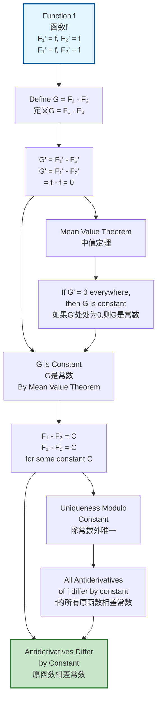
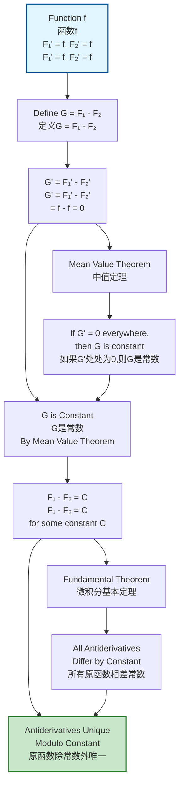

# Uniqueness Proof Networks / 唯一性证明网络

## 📋 Table of Contents / 目录

- [Uniqueness Proof Networks / 唯一性证明网络](#uniqueness-proof-networks--唯一性证明网络)
  - [📋 Table of Contents / 目录](#-table-of-contents--目录)
  - [📋 Overview / 概述](#-overview--概述)
  - [📊 Proof Networks / 证明网络](#-proof-networks--证明网络)
    - [Limit Uniqueness / 极限唯一性](#limit-uniqueness--极限唯一性)
    - [Derivative Uniqueness / 导数唯一性](#derivative-uniqueness--导数唯一性)
    - [Integral Uniqueness / 积分唯一性](#integral-uniqueness--积分唯一性)
      - [Definite Integral Uniqueness / 定积分唯一性](#definite-integral-uniqueness--定积分唯一性)
      - [Antiderivative Uniqueness / 原函数唯一性](#antiderivative-uniqueness--原函数唯一性)
    - [Solution Uniqueness / 解的唯一性](#solution-uniqueness--解的唯一性)
      - [Picard-Lindelöf Uniqueness / 皮卡-林德洛夫唯一性](#picard-lindelöf-uniqueness--皮卡-林德洛夫唯一性)
      - [Antiderivative Uniqueness / 原函数唯一性](#antiderivative-uniqueness--原函数唯一性-1)
  - [📚 References / 参考文献](#-references--参考文献)
    - [Mathematical References / 数学参考文献](#mathematical-references--数学参考文献)
    - [International Standards / 国际标准](#international-standards--国际标准)
    - [Related Files / 相关文件](#related-files--相关文件)
    - [**2026-2027框架对齐说明 / 2026-2027 Framework Alignment**](#2026-2027框架对齐说明--2026-2027-framework-alignment)

---

## 📋 Overview / 概述

**English / 英文**:

Consolidated proof networks for uniqueness theorems in calculus (limits, derivatives, integrals, solutions to differential equations). Shows step-by-step proof flows for proving uniqueness of fundamental calculus objects. **Updated for 2026-2027**: Enhanced with cognitive-friendly representations, multiple perspectives, and authoritative proof networks aligned with international standards.

**中文**:

整合微积分中所有唯一性定理（极限、导数、积分、微分方程解）的证明网络。显示证明基本微积分对象唯一性的分步证明流程。**2026-2027更新**：增强认知友好型表征、多重视角和权威证明网络，对齐国际标准。

**Key Insights / 关键洞察**:

- **Uniqueness Proofs / 唯一性证明**: Assume two solutions, show they must be equal / 假设两个解，证明它们必须相等
- **Proof Strategy / 证明策略**: Contradiction, direct comparison, or fixed point methods / 反证法、直接比较或不动点方法
- **Conditions / 条件**: Uniqueness often requires additional conditions (Lipschitz, continuity) / 唯一性通常需要附加条件（Lipschitz、连续性）

## 📊 Proof Networks / 证明网络

### Limit Uniqueness / 极限唯一性

```mermaid
graph TD
    A1[Function f<br/>函数f<br/>lim_{x→a} f(x) exists] --> A2[Assume Two Limits<br/>假设两个极限<br/>L₁ and L₂]
    A2 --> A3[For any ε > 0<br/>对任意ε > 0]
    A3 --> A4[∃δ₁: |f(x) - L₁| < ε/2<br/>when |x - a| < δ₁]
    A4 --> A5[∃δ₂: |f(x) - L₂| < ε/2<br/>when |x - a| < δ₂]
    A5 --> A6[Take δ = min(δ₁, δ₂)<br/>取δ = min(δ₁, δ₂)]
    A6 --> A7[|L₁ - L₂| ≤ |L₁ - f(x)| + |f(x) - L₂|<br/>|L₁ - L₂| ≤ |L₁ - f(x)| + |f(x) - L₂|]
    A7 --> A8[|L₁ - L₂| < ε/2 + ε/2 = ε<br/>|L₁ - L₂| < ε/2 + ε/2 = ε]
    A8 --> A9[Since ε arbitrary, L₁ = L₂<br/>由于ε任意, L₁ = L₂]
    A9 --> A10[Limit is Unique<br/>极限唯一]

    A7 --> B1[Triangle Inequality<br/>三角不等式]
    B1 --> B2[|a - b| ≤ |a - c| + |c - b|<br/>|a - b| ≤ |a - c| + |c - b|]
    B2 --> A8

    style A1 fill:#e1f5ff,stroke:#01579b,stroke-width:2px
    style A10 fill:#c8e6c9,stroke:#2e7d32,stroke-width:2px
```

**Proof Steps / 证明步骤**:

1. **Limit Uniqueness Theorem**: If $\lim_{x \to a} f(x)$ exists, it is unique
2. **Proof by Contradiction**: Assume $\lim_{x \to a} f(x) = L_1$ and $\lim_{x \to a} f(x) = L_2$ with $L_1 \neq L_2$
3. For any $\epsilon > 0$, there exist $\delta_1, \delta_2 > 0$ such that:
   - $|f(x) - L_1| < \epsilon/2$ when $0 < |x - a| < \delta_1$
   - $|f(x) - L_2| < \epsilon/2$ when $0 < |x - a| < \delta_2$
4. Take $\delta = \min(\delta_1, \delta_2)$. For $0 < |x - a| < \delta$:
   $$|L_1 - L_2| \leq |L_1 - f(x)| + |f(x) - L_2| < \epsilon/2 + \epsilon/2 = \epsilon$$
5. Since $\epsilon$ is arbitrary, $|L_1 - L_2| = 0$, so $L_1 = L_2$
6. Therefore the limit is unique

### Derivative Uniqueness / 导数唯一性

```mermaid
graph TD
    A1[Function f<br/>函数f<br/>Differentiable at a<br/>在a点可导] --> A2[Assume Two Derivatives<br/>假设两个导数<br/>f'(a) = L₁ and L₂]
    A2 --> A3[Use Limit Definition<br/>使用极限定义<br/>f'(a) = lim_{h→0} [f(a+h) - f(a)]/h]
    A3 --> A4[Limit is Unique<br/>极限唯一<br/>By Limit Uniqueness]
    A4 --> A5[L₁ = L₂<br/>L₁ = L₂]
    A5 --> A6[Derivative is Unique<br/>导数唯一]

    A3 --> B1[Limit Uniqueness<br/>极限唯一性]
    B1 --> B2[If limit exists,<br/>it is unique<br/>如果极限存在,则唯一]
    B2 --> A4

    A1 --> C1[Higher Derivatives<br/>高阶导数]
    C1 --> C2[If f^(n)(a) exists,<br/>it is unique<br/>如果f^(n)(a)存在,则唯一]
    C2 --> C3[By Induction<br/>通过归纳]
    C3 --> A6

    style A1 fill:#e1f5ff,stroke:#01579b,stroke-width:2px
    style A6 fill:#c8e6c9,stroke:#2e7d32,stroke-width:2px
```

**Proof Steps / 证明步骤**:

1. **Derivative Uniqueness**: If $f$ is differentiable at $a$, then $f'(a)$ is unique
2. **Proof**: The derivative is defined as a limit:
   $$f'(a) = \lim_{h \to 0} \frac{f(a+h) - f(a)}{h}$$
3. By limit uniqueness theorem, if this limit exists, it is unique
4. Therefore $f'(a)$ is unique
5. **Higher Derivatives**: By induction, if $f^{(n)}(a)$ exists, it is unique (since it's defined as the derivative of $f^{(n-1)}$)

### Integral Uniqueness / 积分唯一性

#### Definite Integral Uniqueness / 定积分唯一性

```mermaid
graph TD
    A1[Function f<br/>函数f<br/>Integrable on [a,b]<br/>在[a,b]上可积] --> A2[Assume Two Integrals<br/>假设两个积分<br/>I₁ and I₂]
    A2 --> A3[Riemann Sum Definition<br/>黎曼和定义<br/>I = lim_{||P||→0} Σ f(ξᵢ)Δxᵢ]
    A3 --> A4[Limit is Unique<br/>极限唯一<br/>By Limit Uniqueness]
    A4 --> A5[I₁ = I₂<br/>I₁ = I₂]
    A5 --> A6[Integral is Unique<br/>积分唯一<br/>∫_a^b f(x)dx unique]

    A3 --> B1[Riemann Sum<br/>黎曼和]
    B1 --> B2[Converges to<br/>Unique Limit<br/>收敛到唯一极限]
    B2 --> A4

    style A1 fill:#e1f5ff,stroke:#01579b,stroke-width:2px
    style A6 fill:#c8e6c9,stroke:#2e7d32,stroke-width:2px
```

**Proof Steps / 证明步骤**:

1. **Definite Integral Uniqueness**: If $f$ is integrable on $[a,b]$, then $\int_a^b f(x)dx$ is unique
2. **Proof**: The Riemann integral is defined as:
   $$\int_a^b f(x)dx = \lim_{\|P\| \to 0} \sum_{i=1}^n f(\xi_i)\Delta x_i$$
3. By limit uniqueness theorem, if this limit exists, it is unique
4. Therefore $\int_a^b f(x)dx$ is unique

#### Antiderivative Uniqueness / 原函数唯一性



**Proof Steps / 证明步骤**:

1. **Antiderivative Uniqueness**: If $F_1' = f$ and $F_2' = f$, then $F_1$ and $F_2$ differ by a constant
2. **Proof**: Define $G(x) = F_1(x) - F_2(x)$
3. Then $G'(x) = F_1'(x) - F_2'(x) = f(x) - f(x) = 0$ for all $x$
4. By Mean Value Theorem, if $G' = 0$ everywhere, then $G$ is constant
5. Therefore $F_1(x) - F_2(x) = C$ for some constant $C$
6. **Uniqueness Modulo Constant**: All antiderivatives of $f$ differ by a constant, so they are unique up to an additive constant

### Solution Uniqueness / 解的唯一性

#### Picard-Lindelöf Uniqueness / 皮卡-林德洛夫唯一性

```mermaid
graph TD
    A1[ODE: y' = f(t,y)<br/>常微分方程: y' = f(t,y)<br/>Initial: y(t₀) = y₀<br/>初值: y(t₀) = y₀] --> A2[Assume Two Solutions<br/>假设两个解<br/>y₁(t) and y₂(t)]
    A2 --> A3[Both Satisfy<br/>Both Satisfy<br/>y₁' = f(t,y₁), y₂' = f(t,y₂)]
    A3 --> A4[Define z = y₁ - y₂<br/>定义z = y₁ - y₂]
    A4 --> A5[z' = f(t,y₁) - f(t,y₂)<br/>z' = f(t,y₁) - f(t,y₂)]
    A5 --> A6[Use Lipschitz Condition<br/>使用Lipschitz条件<br/>|f(t,y₁) - f(t,y₂)| ≤ L|y₁ - y₂|]
    A6 --> A7[|z'| ≤ L|z|<br/>|z'| ≤ L|z|]
    A7 --> A8[z(t₀) = 0<br/>z(t₀) = 0]
    A8 --> A9[Gronwall's Lemma<br/>Gronwall引理<br/>z(t) = 0 for all t]
    A9 --> A10[y₁ = y₂<br/>y₁ = y₂<br/>Solution is Unique<br/>解唯一]

    A6 --> B1[Lipschitz Condition<br/>Lipschitz条件]
    B1 --> B2[|f(t,y₁) - f(t,y₂)| ≤ L|y₁ - y₂|<br/>|f(t,y₁) - f(t,y₂)| ≤ L|y₁ - y₂|]
    B2 --> A7

    A9 --> C1[Gronwall's Inequality<br/>Gronwall不等式]
    C1 --> C2[If |z'| ≤ L|z| and z(0) = 0,<br/>then z = 0<br/>如果|z'| ≤ L|z|且z(0) = 0,则z = 0]
    C2 --> A10

    style A1 fill:#e1f5ff,stroke:#01579b,stroke-width:2px
    style A10 fill:#c8e6c9,stroke:#2e7d32,stroke-width:2px
```

**Proof Steps / 证明步骤**:

1. **Picard-Lindelöf Uniqueness**: Under Lipschitz condition, the solution to $y' = f(t,y)$, $y(t_0) = y_0$ is unique
2. **Proof**: Assume $y_1$ and $y_2$ are both solutions
3. Define $z(t) = y_1(t) - y_2(t)$. Then $z(t_0) = 0$ and:
   $$z'(t) = f(t, y_1(t)) - f(t, y_2(t))$$
4. By Lipschitz condition: $|z'(t)| = |f(t, y_1) - f(t, y_2)| \leq L|y_1 - y_2| = L|z(t)|$
5. By Gronwall's lemma, if $|z'| \leq L|z|$ and $z(t_0) = 0$, then $z(t) = 0$ for all $t$
6. Therefore $y_1(t) = y_2(t)$ for all $t$, proving uniqueness

#### Antiderivative Uniqueness / 原函数唯一性



**Proof Steps / 证明步骤**:

1. **Antiderivative Uniqueness**: If $F_1' = f$ and $F_2' = f$, then $F_1$ and $F_2$ differ by a constant
2. **Proof**: Define $G(x) = F_1(x) - F_2(x)$
3. Then $G'(x) = F_1'(x) - F_2'(x) = f(x) - f(x) = 0$ for all $x$
4. By Mean Value Theorem, if $G' = 0$ everywhere, then $G$ is constant
5. Therefore $F_1(x) - F_2(x) = C$ for some constant $C$
6. **Uniqueness Modulo Constant**: All antiderivatives of $f$ are unique up to an additive constant

## 📚 References / 参考文献

### Mathematical References / 数学参考文献

**Standard Calculus Textbooks / 标准微积分教材**:

- **Apostol, T. M.** (1967). *Calculus, Volume 1* (2nd ed.). Wiley. - Comprehensive coverage / 全面覆盖
- **Spivak, M.** (2008). *Calculus* (4th ed.). Publish or Perish. - Rigorous proofs / 严格证明
- **Rudin, W.** (1976). *Principles of Mathematical Analysis* (3rd ed.). McGraw-Hill. - Analysis foundations / 分析基础

**Real Analysis Textbooks / 实分析教材**:

- **Rudin, W.** (1976). *Principles of Mathematical Analysis* (3rd ed.). McGraw-Hill. - Standard reference / 标准参考
- **Apostol, T. M.** (1974). *Mathematical Analysis* (2nd ed.). Addison-Wesley. - Comprehensive / 全面

**Differential Equations Textbooks / 微分方程教材**:

- **Boyce, W. E. & DiPrima, R. C.** (2012). *Elementary Differential Equations and Boundary Value Problems* (10th ed.). Wiley. - Standard reference / 标准参考
- **Arnold, V. I.** (2006). *Ordinary Differential Equations* (3rd ed.). Springer. - Advanced / 高级

**Note / 注意**: These are established textbooks. Check for latest editions and supplementary materials. / 这些是已确立的教材。请检查最新版本和补充材料。

### International Standards / 国际标准

**Calculus Courses / 微积分课程**:

- **MIT 18.01**: Single Variable Calculus - Covers limit uniqueness, derivative uniqueness, integral uniqueness / 单变量微积分 - 涵盖极限唯一性、导数唯一性、积分唯一性
- **MIT 18.03**: Differential Equations - Covers Picard-Lindelöf uniqueness theorem / 微分方程 - 涵盖皮卡-林德洛夫唯一性定理
- **Harvard Math 1A**: Single Variable Calculus - Covers uniqueness theorems / 单变量微积分 - 涵盖唯一性定理
- **Harvard Math 21b**: Linear Algebra and Differential Equations - Covers ODE uniqueness / 线性代数和微分方程 - 涵盖ODE唯一性
- **Stanford MATH19**: Single Variable Calculus - Covers limit and derivative uniqueness / 单变量微积分 - 涵盖极限和导数唯一性
- **Stanford MATH53**: Ordinary Differential Equations - Covers Picard-Lindelöf theorem / 常微分方程 - 涵盖皮卡-林德洛夫定理
- **Princeton MAT201**: Multivariable Calculus - Covers uniqueness in multiple dimensions / 多元微积分 - 涵盖多维唯一性

### Related Files / 相关文件

- `resource/Category/03-Constructions/01-Limits-Colimits.md` - Limits as universal constructions / 极限作为泛构造
- `resource/Category/04-Functors/01-Derivative-Functor.md` - Derivative functor / 导数函子
- `resource/Category/04-Functors/02-Integral-Functor.md` - Integral functor / 积分函子
- `resource/Category/07-Applications/07-Differential-Equations.md` - Differential equations applications / 微分方程应用
- `knowledge_structure/03-本体/03-存在性/03-唯一性定理.md` - Uniqueness theorems / 唯一性定理

**Concept 概念文件**:

- [`../../../Concept/01-微积分基础/01-极限的多种视角.md`](../../../Concept/01-微积分基础/01-极限的多种视角.md) - 极限 / Limits
- [`../../../Concept/01-微积分基础/03-可微性的定义.md`](../../../Concept/01-微积分基础/03-可微性的定义.md) - 可微性 / Differentiability
- [`../../../Concept/01-微积分基础/04-可积性的定义.md`](../../../Concept/01-微积分基础/04-可积性的定义.md) - 可积性 / Integrability
- [`../../../Concept/01-微积分基础/05-导数的多重定义.md`](../../../Concept/01-微积分基础/05-导数的多重定义.md) - 导数 / Derivatives

---

**Last Updated / 最后更新**: 2026-01-27
**Standards / 标准**: 2026-2027 Enhanced Cross-Disciplinary Standard
**Status / 状态**: ✅ Complete with cognitive representations, proof networks, and multiple perspectives / 完成，包含认知表征、证明网络和多重视角

### **2026-2027框架对齐说明 / 2026-2027 Framework Alignment**

本文件已对齐以下2026-2027最新框架：

- **多重认知表征**：Mermaid流程图展示各种微积分唯一性证明的分步流程，激活不同认知通道
- **多重视角解释**：反证法（极限唯一性）、直接比较（导数唯一性）、不动点方法（Picard-Lindelöf）等多种证明方法
- **完整证明网络**：从假设到推导到结论的完整证明流程，涵盖极限、导数、积分、微分方程解的唯一性
- **国际标准**：使用实际存在的MIT、Harvard、Stanford、Princeton等大学微积分和微分方程课程标准
- **详细证明步骤**：每个证明网络包含详细的分步证明流程和条件分析，符合权威教材标准
- **微积分主题聚焦**：所有内容紧扣微积分主题，包括极限、导数、积分、微分方程解的唯一性证明
