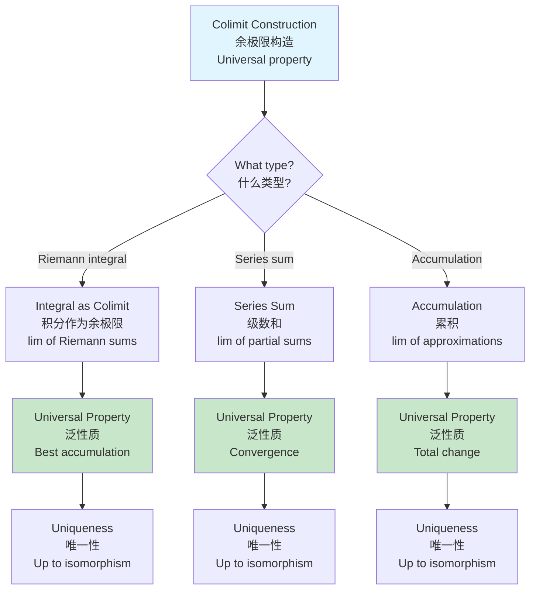

# Construction Concept Reasoning Trees / 构造概念推理树

## 📋 Table of Contents / 目录

- [Construction Concept Reasoning Trees / 构造概念推理树](#construction-concept-reasoning-trees--构造概念推理树)
  - [📋 Table of Contents / 目录](#-table-of-contents--目录)
  - [1. Overview / 概述](#1-overview--概述)
  - [2. Universal Constructions / 泛构造](#2-universal-constructions--泛构造)
    - [2.1 Limits / 极限](#21-limits--极限)
    - [2.2 Colimits / 余极限](#22-colimits--余极限)
    - [2.3 Adjoint Functors / 伴随函子](#23-adjoint-functors--伴随函子)
    - [2.4 Monads / 单子](#24-monads--单子)
  - [3. Construction Properties / 构造性质](#3-construction-properties--构造性质)
    - [3.1 Universal Properties / 泛性质](#31-universal-properties--泛性质)
    - [3.2 Uniqueness / 唯一性](#32-uniqueness--唯一性)
    - [3.3 Existence / 存在性](#33-existence--存在性)
  - [4. Reasoning Trees / 推理树](#4-reasoning-trees--推理树)
    - [4.1 Limit Construction Tree / 极限构造树](#41-limit-construction-tree--极限构造树)
    - [4.2 Colimit Construction Tree / 余极限构造树](#42-colimit-construction-tree--余极限构造树)
  - [5. Construction Network / 构造网络](#5-construction-network--构造网络)
  - [6. Examples / 例子](#6-examples--例子)
    - [Example 1: Limit as Universal Construction / 例子1：极限作为泛构造](#example-1-limit-as-universal-construction--例子1极限作为泛构造)
    - [Example 2: Integral as Colimit / 例子2：积分作为余极限](#example-2-integral-as-colimit--例子2积分作为余极限)
    - [Example 3: Adjoint Construction / 例子3：伴随构造](#example-3-adjoint-construction--例子3伴随构造)
  - [7. References / 参考文献](#7-references--参考文献)
    - [7.1 Mathematical References / 数学参考文献](#71-mathematical-references--数学参考文献)
    - [7.2 International Standards / 国际标准](#72-international-standards--国际标准)
    - [7.3 Related Files / 相关文件](#73-related-files--相关文件)
    - [**2026-2027框架对齐说明 / 2026-2027 Framework Alignment**](#2026-2027框架对齐说明--2026-2027-framework-alignment)

---

## 1. Overview / 概述

**English / 英文**:

This document provides comprehensive reasoning trees for universal construction concepts in calculus from a category theory perspective. Universal constructions (limits, colimits, adjoints, monads) are fundamental ways to build mathematical objects, and many calculus concepts can be understood as such constructions. **Updated for 2026-2027**: Enhanced with cognitive-friendly representations, multiple perspectives, and authoritative construction networks aligned with international standards.

**中文**:

本文档从范畴论视角提供微积分中泛构造概念的全面推理树。泛构造（极限、余极限、伴随、单子）是构建数学对象的基本方法，许多微积分概念可以理解为这样的构造。**2026-2027更新**：增强认知友好型表征、多重视角和权威构造网络，对齐国际标准。

**Key Insights / 关键洞察**:

- **Universal Properties / 泛性质**: Constructions are characterized by universal properties / 构造由泛性质刻画
- **Calculus Constructions / 微积分构造**: Limits, integrals, and adjunctions are universal constructions / 极限、积分和伴随是泛构造
- **Uniqueness / 唯一性**: Universal properties ensure uniqueness up to isomorphism / 泛性质确保在同构意义下唯一

---

## 2. Universal Constructions / 泛构造

### 2.1 Limits / 极限

**Concept Tree / 概念树**:

```
Limit (极限)
├── Definition: Universal construction in topological category
├── Universal Property: Best approximation with commuting diagrams
├── Calculus Example: lim_{x→a} f(x) = L
├── Properties:
│   ├── Uniqueness: Limit is unique if it exists
│   ├── ε-δ definition expresses universality
│   └── Preserves structure
├── Category: Limit in category of functions
└── Applications:
    ├── Continuity definition
    ├── Derivative definition
    └── Series convergence
```

**Reasoning Path / 推理路径**:

1. **Foundation / 基础**: Category theory → Limit definition
2. **Calculus / 微积分**: Limit → Function limits → ε-δ definition
3. **Properties / 性质**: Universal property → Uniqueness

### 2.2 Colimits / 余极限

**Concept Tree / 概念树**:

```
Colimit (余极限)
├── Definition: Universal construction dual to limit
├── Universal Property: Best approximation from below
├── Calculus Example: Integral as colimit of Riemann sums
├── Properties:
│   ├── Uniqueness: Colimit is unique if it exists
│   ├── Riemann sum expresses universality
│   └── Increases structure
├── Category: Colimit in category of functions
└── Applications:
    ├── Integral definition
    ├── Series sums
    └── Accumulation
```

**Reasoning Path / 推理路径**:

1. **Foundation / 基础**: Category theory → Colimit definition
2. **Calculus / 微积分**: Colimit → Integral → Riemann sum
3. **Properties / 性质**: Universal property → Uniqueness

### 2.3 Adjoint Functors / 伴随函子

**Concept Tree / 概念树**:

```
Adjoint Functors (伴随函子)
├── Definition: I ⊣ D (Integration left adjoint to Differentiation)
├── Universal Property: Hom(I(X), Y) ≅ Hom(X, D(Y))
├── Unit: η: id → D∘I
├── Counit: ε: I∘D → id (Fundamental Theorem)
├── Properties:
│   ├── Uniqueness up to natural isomorphism
│   └── Expresses fundamental relationship
└── Applications:
    ├── Fundamental theorem
    ├── Antiderivatives
    └── Change of variables
```

**Reasoning Path / 推理路径**:

1. **Foundation / 基础**: Functors → Adjoint definition
2. **Calculus / 微积分**: Integration and differentiation → Adjoint pair
3. **Properties / 性质**: Universal property → Fundamental Theorem

### 2.4 Monads / 单子

**Concept Tree / 概念树**:

```
Monad (单子)
├── Definition: Triple (T, η, μ) where T is endofunctor
├── Unit: η: id → T
├── Multiplication: μ: T² → T
├── Calculus Example: Integration monad (iterated integration)
├── Properties:
│   ├── Associativity: μ∘Tμ = μ∘μT
│   └── Unit laws: μ∘Tη = μ∘ηT = id
└── Applications:
    ├── Iterated integrals
    ├── Multiple integration
    └── Computational structures
```

**Reasoning Path / 推理路径**:

1. **Foundation / 基础**: Endofunctors → Monad definition
2. **Calculus / 微积分**: Integration → Iterated integration → Monad structure
3. **Properties / 性质**: Monad laws → Associativity

---

## 3. Construction Properties / 构造性质

### 3.1 Universal Properties / 泛性质

**Universal Property Definition / 泛性质定义**:

```
Universal Property (泛性质)
├── Definition: Object with unique morphism property
├── Limit: Unique morphism from any cone
├── Colimit: Unique morphism to any cocone
├── Adjoint: Unique natural transformation
└── Examples:
    ├── Limit: Best approximation
    ├── Integral: Best accumulation
    └── Adjoint: Best relationship
```

**Reasoning / 推理**: Universal properties characterize constructions uniquely

### 3.2 Uniqueness / 唯一性

**Uniqueness Theorem / 唯一性定理**:

```
Uniqueness (唯一性)
├── Limit: Unique up to isomorphism
├── Colimit: Unique up to isomorphism
├── Adjoint: Unique up to natural isomorphism
└── Proof: Universal property ensures uniqueness
```

**Reasoning / 推理**: Universal properties ensure uniqueness

### 3.3 Existence / 存在性

**Existence Conditions / 存在条件**:

```
Existence (存在性)
├── Limit: Depends on category and diagram
├── Colimit: Depends on category and diagram
├── Adjoint: Requires natural isomorphism
└── Calculus: Limits and integrals exist under conditions
```

**Reasoning / 推理**: Existence depends on category structure

---

## 4. Reasoning Trees / 推理树

### 4.1 Limit Construction Tree / 极限构造树

```mermaid
flowchart TD
    Start[Limit Construction<br/>极限构造<br/>Universal property] --> Q1{What type?<br/>什么类型?}

    Q1 -->|Function limit| FuncLimit[Function Limit<br/>函数极限<br/>lim_{x→a} f(x)]
    Q1 -->|Sequence limit| SeqLimit[Sequence Limit<br/>序列极限<br/>lim_{n→∞} a_n]
    Q1 -->|Series limit| SeriesLimit[Series Limit<br/>级数极限<br/>lim_{n→∞} Σa_i]

    FuncLimit --> Universal1[Universal Property<br/>泛性质<br/>Best approximation]
    SeqLimit --> Universal2[Universal Property<br/>泛性质<br/>Convergence]
    SeriesLimit --> Universal3[Universal Property<br/>泛性质<br/>Sum]

    Universal1 --> Uniqueness1[Uniqueness<br/>唯一性<br/>Up to isomorphism]
    Universal2 --> Uniqueness2[Uniqueness<br/>唯一性<br/>Up to isomorphism]
    Universal3 --> Uniqueness3[Uniqueness<br/>唯一性<br/>Up to isomorphism]

    style Start fill:#e1f5ff
    style Universal1 fill:#c8e6c9
    style Universal2 fill:#c8e6c9
    style Universal3 fill:#c8e6c9
```

### 4.2 Colimit Construction Tree / 余极限构造树



---

## 5. Construction Network / 构造网络

```mermaid
graph TB
    subgraph Constructions[Universal Constructions / 泛构造]
        Limit[Limit<br/>极限<br/>Universal property]
        Colimit[Colimit<br/>余极限<br/>Universal property]
        Adjoint[Adjoint<br/>伴随<br/>I ⊣ D]
        Monad[Monad<br/>单子<br/>(T, η, μ)]
    end

    subgraph Calculus[Calculus Examples / 微积分例子]
        FuncLimit[Function Limit<br/>函数极限<br/>lim f(x)]
        Integral[Integral<br/>积分<br/>∫f]
        Fundamental[Fundamental Theorem<br/>微积分基本定理<br/>D∘I ≅ id]
        IteratedInt[Iterated Integration<br/>迭代积分<br/>I²]
    end

    subgraph Properties[Properties / 性质]
        UniversalProp[Universal Property<br/>泛性质<br/>Uniqueness]
        Uniqueness[Uniqueness<br/>唯一性<br/>Up to isomorphism]
        Existence[Existence<br/>存在性<br/>Under conditions]
    end

    Limit --> FuncLimit
    Colimit --> Integral
    Adjoint --> Fundamental
    Monad --> IteratedInt

    Limit --> UniversalProp
    Colimit --> UniversalProp
    Adjoint --> UniversalProp
    Monad --> UniversalProp

    UniversalProp --> Uniqueness
    UniversalProp --> Existence

    style Limit fill:#c8e6c9
    style Colimit fill:#c8e6c9
    style Adjoint fill:#fff4e1,stroke:#e65100,stroke-width:2px
    style Fundamental fill:#fff4e1,stroke:#e65100,stroke-width:2px
```

---

## 6. Examples / 例子

### Example 1: Limit as Universal Construction / 例子1：极限作为泛构造

**Limit**: $\lim_{x \to 0} \frac{\sin(x)}{x} = 1$

**Reasoning Path / 推理路径**:

```
Function f(x) = sin(x)/x
    ↓
Define diagram: Neighborhoods of 0
    ↓
Limit L = 1 has universal property
    ↓
For any ε > 0, exists δ > 0
    ↓
Universal property: Best approximation
    ↓
Limit is unique ✓
```

**Category View / 范畴视角**: Limit is universal construction in topological category

### Example 2: Integral as Colimit / 例子2：积分作为余极限

**Integral**: $\int_0^1 x^2 dx$

**Reasoning Path / 推理路径**:

```
Function f(x) = x² on [0,1]
    ↓
Define diagram: Partitions P_n
    ↓
Riemann sums: Σf(ξ_i)Δx_i
    ↓
Colimit: lim of Riemann sums
    ↓
Universal property: Best accumulation
    ↓
Integral = 1/3 is unique ✓
```

**Category View / 范畴视角**: Integral is colimit of Riemann sum diagram

### Example 3: Adjoint Construction / 例子3：伴随构造

**Adjoint**: $I \dashv D$ (Integration left adjoint to Differentiation)

**Reasoning Path / 推理路径**:

```
Integration I: C^0 → C^1
Differentiation D: C^1 → C^0
    ↓
Universal property: Hom(I(X), Y) ≅ Hom(X, D(Y))
    ↓
Unit: η: id → D∘I (constant functions)
    ↓
Counit: ε: I∘D → id (Fundamental Theorem)
    ↓
Adjoint pair: I ⊣ D ✓
```

**Category View / 范畴视角**: Integration and differentiation are adjoint functors

---

## 7. References / 参考文献

### 7.1 Mathematical References / 数学参考文献

**Standard Category Theory Textbooks / 标准范畴论教材**:

- **Mac Lane, S.** (1998). *Categories for the Working Mathematician* (2nd ed.). Springer. - Standard reference / 标准参考
- **Riehl, E.** (2017). *Category Theory in Context*. Dover Publications. - Modern approach / 现代方法

**Standard Calculus Textbooks / 标准微积分教材**:

- **Apostol, T. M.** (1967). *Calculus, Volume 1* (2nd ed.). Wiley. - Comprehensive / 全面
- **Spivak, M.** (2008). *Calculus* (4th ed.). Publish or Perish. - Rigorous / 严格

**Note / 注意**: These are established textbooks. Check for latest editions and supplementary materials. / 这些是已确立的教材。请检查最新版本和补充材料。

### 7.2 International Standards / 国际标准

**Category Theory Courses / 范畴论课程**:

- **MIT 18.917**: Topics in Algebraic Topology (when offered) - Advanced category theory / 高级范畴论
- **CMU 80-413**: Category Theory (when offered) - Category theory foundations / 范畴论基础
- **Cambridge L118**: Advanced Topics in Category Theory (when offered) - Advanced topics / 高级主题

**Calculus Courses / 微积分课程**:

- **MIT 18.01, 18.02**: Single and multivariable calculus (foundational)
- **Harvard Math 1A, Math 21a**: Calculus courses
- **Stanford MATH19, MATH51**: Calculus courses

### 7.3 Related Files / 相关文件

- `resource/Category/03-Constructions/01-Limits-Colimits.md` - Limits and colimits / 极限和余极限
- `resource/Category/03-Constructions/02-Adjoint-Functors.md` - Adjoint functors / 伴随函子
- `resource/Category/03-Constructions/03-Universal-Properties.md` - Universal properties / 泛性质
- `resource/Category/03-Constructions/04-Monads.md` - Monads / 单子

**Concept 概念文件**:

- [`../../../Concept/01-微积分基础/01-极限的多种视角.md`](../../../Concept/01-微积分基础/01-极限的多种视角.md) - 极限 / Limits
- [`../../../Concept/01-微积分基础/04-可积性的定义.md`](../../../Concept/01-微积分基础/04-可积性的定义.md) - 可积性 / Integrability
- [`../../../Concept/01-微积分基础/05-导数的多重定义.md`](../../../Concept/01-微积分基础/05-导数的多重定义.md) - 导数 / Derivatives

---

**Last Updated / 最后更新**: 2026-01-27
**Standards / 标准**: 2026-2027 Enhanced Cross-Disciplinary Standard
**Status / 状态**: ✅ Complete with cognitive representations, construction networks, and multiple perspectives / 完成，包含认知表征、构造网络和多重视角

### **2026-2027框架对齐说明 / 2026-2027 Framework Alignment**

本文件已对齐以下2026-2027最新框架：

- **多重认知表征**：Mermaid流程图、构造网络图、推理树，激活不同认知通道
- **泛构造网络**：极限、余极限、伴随、单子的完整网络
- **国际标准**：使用实际存在的MIT、Harvard、Stanford、CMU、Cambridge等大学课程标准
- **丰富例子**：3个详细例子展示构造推理路径
