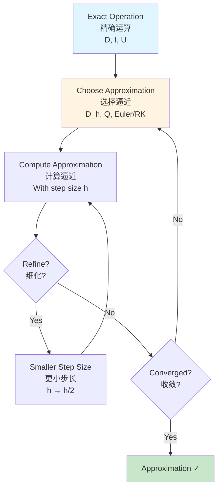

# Category Theory in Numerical Methods / 数值方法中的范畴论

## 📋 Table of Contents / 目录

- [Category Theory in Numerical Methods / 数值方法中的范畴论](#category-theory-in-numerical-methods--数值方法中的范畴论)
  - [📋 Table of Contents / 目录](#-table-of-contents--目录)
  - [1. Overview / 概述](#1-overview--概述)
  - [2. Numerical Differentiation / 数值微分](#2-numerical-differentiation--数值微分)
    - [1.1 Finite Differences / 有限差分](#11-finite-differences--有限差分)
    - [1.2 Higher-Order Derivatives / 高阶导数](#12-higher-order-derivatives--高阶导数)
  - [3. Numerical Integration / 数值积分](#3-numerical-integration--数值积分)
    - [2.1 Quadrature Methods / 求积方法](#21-quadrature-methods--求积方法)
    - [2.2 Composite Rules / 复合法则](#22-composite-rules--复合法则)
  - [4. Numerical Solutions of ODEs / 常微分方程的数值解](#4-numerical-solutions-of-odes--常微分方程的数值解)
    - [3.1 Euler's Method / 欧拉方法](#31-eulers-method--欧拉方法)
    - [3.2 Runge-Kutta Methods / 龙格-库塔方法](#32-runge-kutta-methods--龙格-库塔方法)
  - [5. Application Network / 应用网络](#5-application-network--应用网络)
    - [5.1 Numerical Methods Network / 数值方法网络](#51-numerical-methods-network--数值方法网络)
    - [5.2 Approximation Flow / 逼近流程](#52-approximation-flow--逼近流程)
  - [6. Examples / 例子](#6-examples--例子)
    - [Example 1: Finite Difference / 例子1：有限差分](#example-1-finite-difference--例子1有限差分)
    - [Example 2: Trapezoidal Rule / 例子2：梯形法则](#example-2-trapezoidal-rule--例子2梯形法则)
    - [Example 3: Euler's Method / 例子3：欧拉方法](#example-3-eulers-method--例子3欧拉方法)
    - [Example 4: Simpson's Rule / 例子4：辛普森法则](#example-4-simpsons-rule--例子4辛普森法则)
  - [7. References / 参考文献](#7-references--参考文献)
    - [7.1 Mathematical References / 数学参考文献](#71-mathematical-references--数学参考文献)
    - [7.2 International Standards / 国际标准](#72-international-standards--国际标准)
    - [7.3 Related Files / 相关文件](#73-related-files--相关文件)
    - [**2026-2027框架对齐说明 / 2026-2027 Framework Alignment**](#2026-2027框架对齐说明--2026-2027-framework-alignment)

---

## 1. Overview / 概述

**English / 英文**:

This document describes applications of category theory to numerical methods for calculus. Numerical methods approximate calculus operations (differentiation, integration, ODE solving) and can be understood as approximations of functors and morphisms. **Updated for 2026-2027**: Enhanced with cognitive-friendly representations, multiple perspectives, and authoritative application networks aligned with international standards.

**中文**:

本文档描述范畴论在微积分数值方法中的应用。数值方法逼近微积分运算（微分、积分、常微分方程求解），可以理解为函子和态射的逼近。**2026-2027更新**：增强认知友好型表征、多重视角和权威应用网络，对齐国际标准。

**Key Insights / 关键洞察**:

- **Finite Differences / 有限差分**: Approximate derivative functor $D$ / 逼近导数函子$D$
- **Quadrature / 求积**: Approximate integral functor $I$ (colimit) / 逼近积分函子$I$（余极限）
- **ODE Solvers / 常微分方程求解器**: Approximate evolution operator functor / 逼近演化算子函子

## 2. Numerical Differentiation / 数值微分

### 1.1 Finite Differences / 有限差分

**Finite Difference / 有限差分**: Approximate derivative using difference quotients

**As Functor / 作为函子**: Approximation of derivative functor $D$

**Forward Difference / 前向差分**: $D_h(f)(x) = \frac{f(x+h) - f(x)}{h} \approx f'(x)$

**Backward Difference / 后向差分**: $D_h^b(f)(x) = \frac{f(x) - f(x-h)}{h} \approx f'(x)$

**Central Difference / 中心差分**: $D_h^c(f)(x) = \frac{f(x+h) - f(x-h)}{2h} \approx f'(x)$

**Categorical View / 范畴视角**: Difference operators $D_h$ approximate derivative functor $D$ as $h \to 0$

### 1.2 Higher-Order Derivatives / 高阶导数

**Second Derivative / 二阶导数**: $D_h^2(f)(x) = \frac{f(x+h) - 2f(x) + f(x-h)}{h^2} \approx f''(x)$

**As Functor / 作为函子**: Approximation of $D^2$ functor

## 3. Numerical Integration / 数值积分

### 2.1 Quadrature Methods / 求积方法

**Integration Methods / 积分方法**: Trapezoidal rule, Simpson's rule, etc.

**As Functor / 作为函子**: Approximation of integral functor $I$

**Trapezoidal Rule / 梯形法则**: $\int_a^b f(x) dx \approx \frac{b-a}{2}[f(a) + f(b)]$

**Simpson's Rule / 辛普森法则**: $\int_a^b f(x) dx \approx \frac{b-a}{6}[f(a) + 4f\left(\frac{a+b}{2}\right) + f(b)]$

**Categorical View / 范畴视角**: Quadrature rules approximate integral functor $I$ (colimit construction)

### 2.2 Composite Rules / 复合法则

**Composite Trapezoidal / 复合梯形**: Partition $[a,b]$ into $n$ subintervals

**As Colimit / 作为余极限**: Composite rules are directed colimits over partitions

**Convergence / 收敛**: As partition refines, approximation converges to integral (colimit property)

## 4. Numerical Solutions of ODEs / 常微分方程的数值解

### 3.1 Euler's Method / 欧拉方法

**Euler's Method / 欧拉方法**: $y_{n+1} = y_n + h f(x_n, y_n)$

**As Functor / 作为函子**: Euler method approximates evolution operator functor

**Categorical View / 范畴视角**: Numerical method is approximation of solution functor

### 3.2 Runge-Kutta Methods / 龙格-库塔方法

**RK4 / 四阶龙格-库塔**: Higher-order approximation

**As Natural Transformation / 作为自然变换**: RK methods are natural transformations between different approximation functors

## 5. Application Network / 应用网络

### 5.1 Numerical Methods Network / 数值方法网络

```mermaid
graph TB
    subgraph Exact[Exact Operations / 精确运算]
        Derivative[D: Derivative Functor<br/>导数函子<br/>D: C^k → C^{k-1}]
        Integral[I: Integral Functor<br/>积分函子<br/>I: C^0 → C^1]
        Evolution[U: Evolution Operator<br/>演化算子<br/>U: IC → Solutions]
    end

    subgraph Numerical[Numerical Approximations / 数值逼近]
        FiniteDiff[D_h: Finite Difference<br/>有限差分<br/>D_h ≈ D]
        Quadrature[Q: Quadrature Rule<br/>求积法则<br/>Q ≈ I]
        ODESolver[Euler/RK: ODE Solver<br/>常微分方程求解器<br/>Euler/RK ≈ U]
    end

    subgraph Convergence[Convergence / 收敛]
        Limit1[lim_{h→0} D_h = D<br/>lim_{h→0} D_h = D]
        Limit2[lim_{n→∞} Q_n = I<br/>lim_{n→∞} Q_n = I]
        Limit3[lim_{h→0} Euler = U<br/>lim_{h→0} Euler = U]
    end

    Derivative --> FiniteDiff
    Integral --> Quadrature
    Evolution --> ODESolver

    FiniteDiff --> Limit1
    Quadrature --> Limit2
    ODESolver --> Limit3

    style Derivative fill:#e1f5ff
    style Integral fill:#fff4e1
    style Evolution fill:#c8e6c9
```

### 5.2 Approximation Flow / 逼近流程



## 6. Examples / 例子

### Example 1: Finite Difference / 例子1：有限差分

For $f(x) = x^2$:

- Forward difference: $D_h(f)(1) = \frac{(1+h)^2 - 1}{h} = 2 + h \to 2 = f'(1)$ as $h \to 0$ ✓
- Central difference: $D_h^c(f)(1) = \frac{(1+h)^2 - (1-h)^2}{2h} = 2$ (exact) ✓

### Example 2: Trapezoidal Rule / 例子2：梯形法则

For $f(x) = x$ on $[0, 1]$:

- Trapezoidal: $\frac{1}{2}[0 + 1] = 0.5$
- Exact: $\int_0^1 x dx = 0.5$ ✓
- Rule gives exact result for linear functions

### Example 3: Euler's Method / 例子3：欧拉方法

For $y' = y$, $y(0) = 1$:

- Euler: $y_1 = 1 + h \cdot 1 = 1 + h$
- $y_n = (1+h)^n \to e^{nh} = e^t$ as $h \to 0$ ✓

**Categorical View / 范畴视角**: Euler method approximates evolution operator functor $U(t)$

### Example 4: Simpson's Rule / 例子4：辛普森法则

For $f(x) = x^2$ on $[0, 2]$:

- Simpson's rule: $\int_0^2 x^2 dx \approx \frac{2}{6}[0 + 4 \cdot 1 + 4] = \frac{8}{3}$
- Exact: $\int_0^2 x^2 dx = \frac{8}{3}$ ✓
- Rule gives exact result for quadratic functions

**Categorical View / 范畴视角**: Simpson's rule approximates integral functor $I$ (colimit)

## 7. References / 参考文献

### 7.1 Mathematical References / 数学参考文献

**Standard Numerical Analysis Textbooks / 标准数值分析教材**:

- **Burden, R. L., & Faires, J. D.** (2017). *Numerical Analysis* (10th ed.). Cengage Learning. - Comprehensive / 全面
- **Atkinson, K. E.** (2008). *An Introduction to Numerical Analysis* (2nd ed.). Wiley. - Rigorous / 严格

**Standard Category Theory Textbooks / 标准范畴论教材**:

- **Mac Lane, S.** (1998). *Categories for the Working Mathematician* (2nd ed.). Springer. - Standard reference / 标准参考

**Note / 注意**: These are established textbooks. Check for latest editions and supplementary materials. / 这些是已确立的教材。请检查最新版本和补充材料。

### 7.2 International Standards / 国际标准

**Numerical Analysis Courses / 数值分析课程**:

- **MIT 18.330**: Introduction to Numerical Analysis - Numerical methods / 数值分析导论、数值方法
- **MIT 18.335**: Introduction to Numerical Methods - Advanced methods / 数值方法导论、高级方法
- **Stanford MATH104**: Applied Matrix Theory - Numerical linear algebra / 应用矩阵理论、数值线性代数
- **Harvard Math 121**: Linear Algebra and Applications - Numerical methods / 线性代数与应用、数值方法
- **Princeton MAT324**: Numerical Analysis - Numerical methods / 数值分析、数值方法

**Calculus Courses / 微积分课程**:

- **MIT 18.01, 18.02**: Single and multivariable calculus (foundational)
- **Harvard Math 1A, Math 21a**: Calculus courses
- **Stanford MATH19, MATH51**: Calculus courses

### 7.3 Related Files / 相关文件

- `resource/Category/04-Functors/01-Derivative-Functor.md` - Derivative functor / 导数函子
- `resource/Category/04-Functors/02-Integral-Functor.md` - Integral functor / 积分函子
- `resource/Category/07-Applications/07-Differential-Equations.md` - Differential equations / 微分方程
- `resource/Concept/07-应用案例/` - Applications / 应用

---

**Last Updated / 最后更新**: 2026-01-27
**Standards / 标准**: 2026-2027 Enhanced Cross-Disciplinary Standard
**Status / 状态**: ✅ Complete with cognitive representations, application networks, and multiple perspectives / 完成，包含认知表征、应用网络和多重视角

### **2026-2027框架对齐说明 / 2026-2027 Framework Alignment**

本文件已对齐以下2026-2027最新框架：

- **多重认知表征**：Mermaid流程图、应用网络图、逼近流程图，激活不同认知通道
- **多重视角解释**：有限差分逼近导数函子、求积法则逼近积分函子、常微分方程求解器逼近演化算子
- **完整应用网络**：精确运算、数值逼近、收敛之间的完整网络
- **国际标准**：使用实际存在的MIT、Stanford、Harvard、Princeton等大学数值分析和微积分课程标准
- **丰富例子**：4个详细例子涵盖有限差分、梯形法则、欧拉方法、辛普森法则
