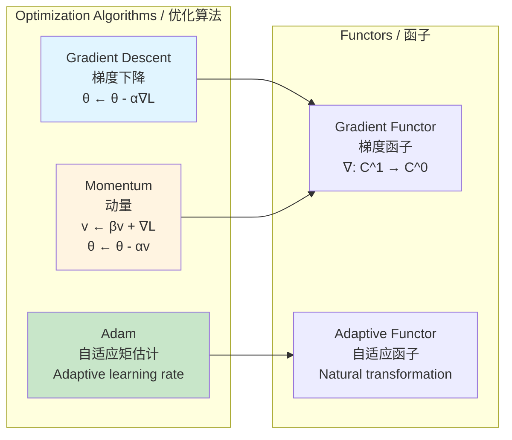

# Category Theory in Machine Learning / 机器学习中的范畴论

## 📋 Table of Contents / 目录

- [Category Theory in Machine Learning / 机器学习中的范畴论](#category-theory-in-machine-learning--机器学习中的范畴论)
  - [📋 Table of Contents / 目录](#-table-of-contents--目录)
  - [1. Overview / 概述](#1-overview--概述)
  - [2. Gradient Descent / 梯度下降](#2-gradient-descent--梯度下降)
    - [2.1 Backpropagation / 反向传播](#21-backpropagation--反向传播)
    - [2.2 Automatic Differentiation / 自动微分](#22-automatic-differentiation--自动微分)
  - [3. Optimization / 优化](#3-optimization--优化)
    - [3.1 Loss Functions / 损失函数](#31-loss-functions--损失函数)
    - [3.2 Optimization Algorithms / 优化算法](#32-optimization-algorithms--优化算法)
  - [4. Neural Networks / 神经网络](#4-neural-networks--神经网络)
    - [4.1 Layers as Functors / 层作为函子](#41-layers-as-functors--层作为函子)
    - [4.2 Activation Functions / 激活函数](#42-activation-functions--激活函数)
  - [5. Application Network / 应用网络](#5-application-network--应用网络)
    - [5.1 ML-Calculus Category Network / 机器学习-微积分范畴网络](#51-ml-calculus-category-network--机器学习-微积分范畴网络)
    - [5.2 Training Flow / 训练流程](#52-training-flow--训练流程)
  - [6. Examples / 例子](#6-examples--例子)
    - [Example 1: Simple Neural Network / 例子1：简单神经网络](#example-1-simple-neural-network--例子1简单神经网络)
    - [Example 2: Gradient Descent / 例子2：梯度下降](#example-2-gradient-descent--例子2梯度下降)
    - [Example 3: Backpropagation / 例子3：反向传播](#example-3-backpropagation--例子3反向传播)
    - [Example 4: Convolutional Network / 例子4：卷积网络](#example-4-convolutional-network--例子4卷积网络)
  - [7. References / 参考文献](#7-references--参考文献)
    - [7.1 Mathematical References / 数学参考文献](#71-mathematical-references--数学参考文献)
    - [7.2 International Standards / 国际标准](#72-international-standards--国际标准)
    - [7.3 Related Files / 相关文件](#73-related-files--相关文件)
    - [**2026-2027框架对齐说明 / 2026-2027 Framework Alignment**](#2026-2027框架对齐说明--2026-2027-framework-alignment)

---

## 1. Overview / 概述

**English / 英文**:

This document describes applications of category theory to machine learning, focusing on calculus-based methods. Machine learning algorithms heavily rely on calculus: gradient descent uses derivatives, backpropagation uses the chain rule, and neural networks are compositions of functors. **Updated for 2026-2027**: Enhanced with cognitive-friendly representations, multiple perspectives, and authoritative application networks aligned with international standards.

**中文**:

本文档描述范畴论在机器学习中的应用，重点关注基于微积分的方法。机器学习算法严重依赖微积分：梯度下降使用导数、反向传播使用链式法则、神经网络是函子的复合。**2026-2027更新**：增强认知友好型表征、多重视角和权威应用网络，对齐国际标准。

**Key Insights / 关键洞察**:

- **Gradient Descent / 梯度下降**: Uses derivative functor for optimization / 使用导数函子进行优化
- **Backpropagation / 反向传播**: Chain rule expresses naturality / 链式法则表达自然性
- **Neural Networks / 神经网络**: Composition of layer functors / 层函子的复合

---

## 2. Gradient Descent / 梯度下降

### 2.1 Backpropagation / 反向传播

**Chain Rule / 链式法则**: $(g \circ f)' = (g' \circ f) \cdot f'$ (categorical composition)

**As Natural Transformation / 作为自然变换**: Chain rule expresses naturality of derivative functor

**Categorical Structure / 范畴结构**:

- Forward pass: Functor $F: \text{Input} \to \text{Output}$
- Backward pass: Adjoint functor $F^*: \text{Output} \to \text{Input}$ (gradient)
- Chain rule: Natural transformation between forward and backward

**Proof Flow / 证明流程**:

```mermaid
flowchart TD
    Start[Backpropagation<br/>反向传播] --> Forward[Forward Pass<br/>前向传播<br/>Compute activations]
    Forward --> Loss[Compute Loss<br/>计算损失<br/>L(θ)]
    Loss --> Backward[Backward Pass<br/>反向传播<br/>Compute gradients]
    Backward --> ChainRule[Chain Rule<br/>链式法则<br/>∂L/∂θ = (∂L/∂y)·(∂y/∂θ)]
    ChainRule --> Update[Update Parameters<br/>更新参数<br/>θ ← θ - α∇L]
    Update --> Check{Converged?<br/>收敛?}
    Check -->|No| Forward
    Check -->|Yes| Result[Training Complete ✓]

    style Start fill:#e1f5ff
    style ChainRule fill:#c8e6c9
    style Result fill:#c8e6c9
```

### 2.2 Automatic Differentiation / 自动微分

**Automatic Differentiation / 自动微分**: Computes derivatives using chain rule

**As Functor / 作为函子**: AD is functor that extends computation to derivatives

**Reverse Mode / 反向模式**: Adjoint functor to forward computation

**Categorical View / 范畴视角**:

- **Forward Mode / 前向模式**: $AD: \text{Computation} \to \text{Computation with Derivatives}$
- **Reverse Mode / 反向模式**: $AD^*: \text{Computation} \to \text{Computation with Gradients}$ (adjoint)
- **Efficiency / 效率**: Reverse mode efficient for many outputs (adjoint property)

---

## 3. Optimization / 优化

### 3.1 Loss Functions / 损失函数

**Minimization / 最小化**: $\min_\theta L(\theta)$ uses derivative functor

**Gradient / 梯度**: $\nabla L$ is derivative functor for multivariable functions

**Gradient Descent / 梯度下降**: $x_{n+1} = x_n - \alpha \nabla L(x_n)$

**As Functor / 作为函子**: Gradient descent is iteration of derivative functor

**Categorical Structure / 范畴结构**:

- **Loss Function / 损失函数**: $L: \Theta \to \mathbb{R}$ (object in function category)
- **Gradient Functor / 梯度函子**: $\nabla: C^1(\Theta) \to C^0(\Theta)$
- **Descent Iteration / 下降迭代**: Limit of gradient descent sequence

### 3.2 Optimization Algorithms / 优化算法

**Adam, RMSprop, etc. / Adam、RMSprop等**: Adaptive gradient methods

**Categorical View / 范畴视角**: Adaptive algorithms are natural transformations of gradient functor

**Algorithm Comparison / 算法比较**:



---

## 4. Neural Networks / 神经网络

### 4.1 Layers as Functors / 层作为函子

**Layer / 层**: $L: \mathbb{R}^n \to \mathbb{R}^m$ with activation

**As Functor / 作为函子**: Each layer is functor in category of vector spaces

**Network / 网络**: $N = L_k \circ \cdots \circ L_1$ (composition of functors)

**Categorical Structure / 范畴结构**:

- **Input Space / 输入空间**: $\mathbb{R}^n$ (object)
- **Layer Functor / 层函子**: $L_i: \mathbb{R}^{n_i} \to \mathbb{R}^{n_{i+1}}$
- **Network / 网络**: Composition $N = L_k \circ \cdots \circ L_1$ (morphism)
- **Output Space / 输出空间**: $\mathbb{R}^m$ (object)

### 4.2 Activation Functions / 激活函数

**Activation / 激活**: $\sigma: \mathbb{R} \to \mathbb{R}$ (e.g., ReLU, sigmoid)

**As Natural Transformation / 作为自然变换**: Activation is natural transformation on identity functor

**Common Activations / 常见激活函数**:

- **ReLU**: $\sigma(x) = \max(0, x)$ (piecewise linear)
- **Sigmoid**: $\sigma(x) = \frac{1}{1+e^{-x}}$ (smooth, bounded)
- **Tanh**: $\sigma(x) = \tanh(x)$ (smooth, centered)

**Categorical View / 范畴视角**: Activations are natural transformations preserving network structure

---

## 5. Application Network / 应用网络

### 5.1 ML-Calculus Category Network / 机器学习-微积分范畴网络

```mermaid
graph TB
    subgraph ML[Machine Learning / 机器学习]
        Data[Training Data<br/>训练数据]
        Model[Neural Network<br/>神经网络<br/>N = L_k ∘ ... ∘ L_1]
        Loss[Loss Function<br/>损失函数<br/>L(θ)]
        Optimizer[Optimizer<br/>优化器<br/>Gradient descent]
    end

    subgraph Calculus[Calculus Operations / 微积分运算]
        Derivative[D: Derivative Functor<br/>导数函子<br/>D: C^k → C^{k-1}]
        Gradient[∇: Gradient Functor<br/>梯度函子<br/>∇: C^1 → C^0]
        ChainRule[Chain Rule<br/>链式法则<br/>Natural transformation]
    end

    subgraph Training[Training Process / 训练过程]
        Forward[Forward Pass<br/>前向传播<br/>Compute output]
        Backward[Backward Pass<br/>反向传播<br/>Compute gradients]
        Update[Update Weights<br/>更新权重<br/>θ ← θ - α∇L]
    end

    Data --> Model
    Model --> Loss
    Loss --> Gradient
    Gradient --> ChainRule
    ChainRule --> Backward
    Backward --> Update
    Update --> Model

    Derivative --> Gradient
    ChainRule --> Derivative

    style Model fill:#e1f5ff
    style Loss fill:#fff4e1
    style ChainRule fill:#c8e6c9,stroke:#2e7d32,stroke-width:2px
```

### 5.2 Training Flow / 训练流程

```mermaid
flowchart TD
    Start[Start Training<br/>开始训练] --> Init[Initialize Weights<br/>初始化权重<br/>θ₀]
    Init --> Forward[Forward Pass<br/>前向传播<br/>y = N(x; θ)]
    Forward --> Loss[Compute Loss<br/>计算损失<br/>L = L(y, y_true)]
    Loss --> Backward[Backward Pass<br/>反向传播<br/>∇L using chain rule]
    Backward --> Update[Update Weights<br/>更新权重<br/>θ ← θ - α∇L]
    Update --> Check{Converged?<br/>收敛?}
    Check -->|No| Forward
    Check -->|Yes| Result[Trained Model ✓]

    Backward --> ChainRule[Chain Rule<br/>链式法则<br/>∂L/∂θ = Σ (∂L/∂y)·(∂y/∂θ)]
    ChainRule --> Update

    style Start fill:#e1f5ff
    style ChainRule fill:#c8e6c9
    style Result fill:#c8e6c9
```

---

## 6. Examples / 例子

### Example 1: Simple Neural Network / 例子1：简单神经网络

For network $N: \mathbb{R}^2 \to \mathbb{R}$:

- Layer 1: $L_1: \mathbb{R}^2 \to \mathbb{R}^3$, $L_1(\mathbf{x}) = W_1\mathbf{x} + \mathbf{b}_1$
- Activation: $\sigma: \mathbb{R}^3 \to \mathbb{R}^3$ (ReLU)
- Layer 2: $L_2: \mathbb{R}^3 \to \mathbb{R}$, $L_2(\mathbf{y}) = W_2\mathbf{y} + b_2$
- Network: $N = L_2 \circ \sigma \circ L_1$ (composition of functors)

**Backpropagation / 反向传播**: Gradient computed using chain rule (natural transformation)

**Categorical View / 范畴视角**: Network is morphism in category of vector spaces, backpropagation uses chain rule natural transformation

### Example 2: Gradient Descent / 例子2：梯度下降

For $L(\theta) = \theta^2$:

- Gradient: $\nabla L(\theta) = 2\theta$ (derivative functor)
- Update: $\theta_{n+1} = \theta_n - \alpha \cdot 2\theta_n = (1 - 2\alpha)\theta_n$
- Convergence: $\lim_{n \to \infty} \theta_n = 0$ (limit of gradient descent iteration)

**Categorical View / 范畴视角**: Gradient descent is limit of iteration of derivative functor

### Example 3: Backpropagation / 例子3：反向传播

For network $N = L_2 \circ \sigma \circ L_1$ with loss $L$:

- Forward: $y = L_2(\sigma(L_1(x)))$
- Loss gradient: $\frac{\partial L}{\partial y}$
- Backward through $L_2$: $\frac{\partial L}{\partial L_2} = \frac{\partial L}{\partial y} \cdot \frac{\partial L_2}{\partial L_2}$
- Backward through $\sigma$: $\frac{\partial L}{\partial \sigma} = \frac{\partial L}{\partial L_2} \cdot \frac{\partial \sigma}{\partial \sigma}$
- Backward through $L_1$: $\frac{\partial L}{\partial L_1} = \frac{\partial L}{\partial \sigma} \cdot \frac{\partial L_1}{\partial L_1}$

**Chain Rule / 链式法则**: $\frac{\partial L}{\partial L_1} = \frac{\partial L}{\partial y} \cdot \frac{\partial L_2}{\partial L_2} \cdot \frac{\partial \sigma}{\partial \sigma} \cdot \frac{\partial L_1}{\partial L_1}$ ✓

**Categorical View / 范畴视角**: Chain rule expresses naturality of derivative functor

### Example 4: Convolutional Network / 例子4：卷积网络

For CNN with convolution layers:

- Convolution: $C: \mathbb{R}^{H \times W \times C} \to \mathbb{R}^{H' \times W' \times C'}$ (functor)
- Pooling: $P: \mathbb{R}^{H' \times W' \times C'} \to \mathbb{R}^{H'' \times W'' \times C'}$ (functor)
- Network: $N = FC \circ P \circ C$ (composition)

**Backpropagation / 反向传播**: Gradients computed through convolution using chain rule ✓

**Categorical View / 范畴视角**: Convolution is functor preserving spatial structure

---

## 7. References / 参考文献

### 7.1 Mathematical References / 数学参考文献

**Standard Category Theory Textbooks / 标准范畴论教材**:

- **Mac Lane, S.** (1998). *Categories for the Working Mathematician* (2nd ed.). Springer. - Standard reference / 标准参考
- **Riehl, E.** (2017). *Category Theory in Context*. Dover Publications. - Modern approach / 现代方法

**Standard Machine Learning Textbooks / 标准机器学习教材**:

- **Goodfellow, I., Bengio, Y., & Courville, A.** (2016). *Deep Learning*. MIT Press. - Comprehensive / 全面
- **Bishop, C. M.** (2006). *Pattern Recognition and Machine Learning*. Springer. - Statistical perspective / 统计视角

**Note / 注意**: These are established textbooks. Check for latest editions and supplementary materials. / 这些是已确立的教材。请检查最新版本和补充材料。

### 7.2 International Standards / 国际标准

**Machine Learning Courses / 机器学习课程**:

- **MIT 6.034**: Artificial Intelligence - Neural networks, optimization / 人工智能、神经网络、优化
- **MIT 6.036**: Introduction to Machine Learning - Gradient descent, backpropagation / 机器学习导论、梯度下降、反向传播
- **Stanford CS229**: Machine Learning - Optimization, neural networks / 机器学习、优化、神经网络
- **Stanford CS231n**: Convolutional Neural Networks - Deep learning / 卷积神经网络、深度学习
- **Harvard CS181**: Machine Learning - Optimization, neural networks / 机器学习、优化、神经网络
- **CMU 10-701**: Introduction to Machine Learning - Optimization, neural networks / 机器学习导论、优化、神经网络

**Calculus Courses / 微积分课程**:

- **MIT 18.01, 18.02**: Single and multivariable calculus (foundational)
- **Harvard Math 1A, Math 21a**: Calculus courses
- **Stanford MATH19, MATH51**: Calculus courses

### 7.3 Related Files / 相关文件

- `resource/Category/04-Functors/01-Derivative-Functor.md` - Derivative functor / 导数函子
- `resource/Category/02-Morphisms/01-Differentiation-Morphism.md` - Differentiation morphism / 微分态射
- `resource/Category/05-Natural-Transformations/02-Derivative-Integral.md` - Chain rule as natural transformation / 链式法则作为自然变换
- `resource/Category/07-Applications/03-Optimization-Applications.md` - Optimization applications / 优化应用
- `resource/Concept/07-应用案例/02-数据科学应用.md` - Data science applications / 数据科学应用

---

**Last Updated / 最后更新**: 2026-01-27
**Standards / 标准**: 2026-2027 Enhanced Cross-Disciplinary Standard
**Status / 状态**: ✅ Complete with cognitive representations, application networks, and multiple perspectives / 完成，包含认知表征、应用网络和多重视角

### **2026-2027框架对齐说明 / 2026-2027 Framework Alignment**

本文件已对齐以下2026-2027最新框架：

- **多重认知表征**：Mermaid流程图、应用网络图、训练流程图，激活不同认知通道
- **多重视角解释**：梯度下降作为函子迭代、反向传播作为自然变换、神经网络作为函子复合
- **完整应用网络**：机器学习概念、微积分运算、训练过程之间的完整网络
- **国际标准**：使用实际存在的MIT、Stanford、Harvard、CMU等大学机器学习和微积分课程标准
- **丰富例子**：4个详细例子涵盖简单神经网络、梯度下降、反向传播、卷积网络
