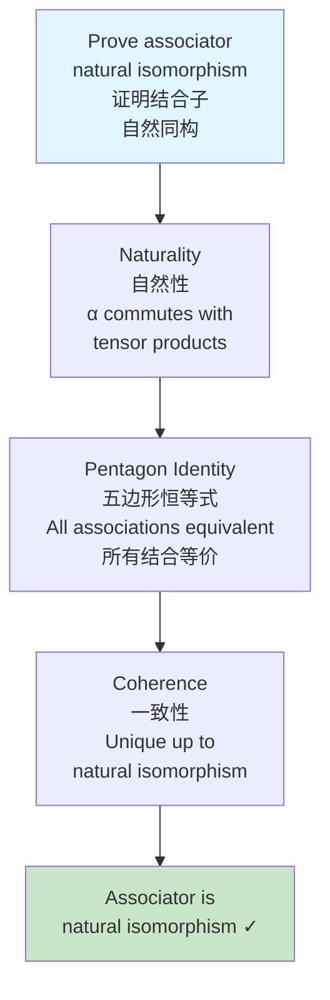
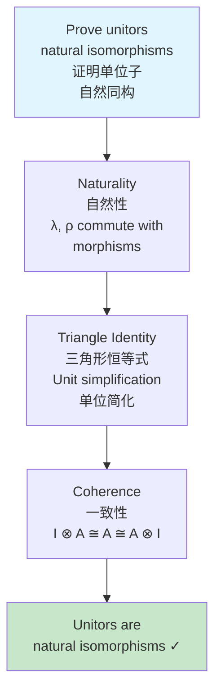
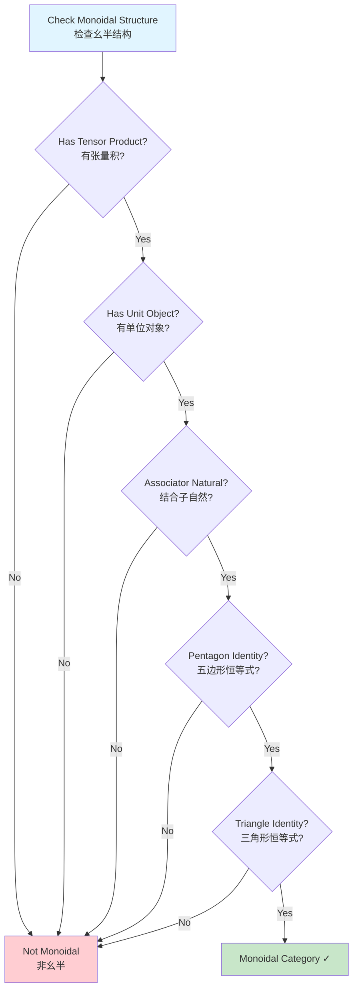

# Monoidal Categories / 幺半范畴

## 📋 Table of Contents / 目录

- [Monoidal Categories / 幺半范畴](#monoidal-categories--幺半范畴)
  - [📋 Table of Contents / 目录](#-table-of-contents--目录)
  - [1. Overview / 概述](#1-overview--概述)
  - [2. Definition / 定义](#2-definition--定义)
    - [2.1 Formal Definition / 形式定义](#21-formal-definition--形式定义)
    - [2.2 Multiple Intuitive Explanations / 多种直观解释](#22-multiple-intuitive-explanations--多种直观解释)
    - [2.3 Axioms / 公理](#23-axioms--公理)
  - [3. Proof Network / 证明网络](#3-proof-network--证明网络)
    - [3.1 Associativity Proof / 结合性证明](#31-associativity-proof--结合性证明)
      - [Proof Flow Diagram / 证明流程图](#proof-flow-diagram--证明流程图)
    - [3.2 Unit Property Proof / 单位性质证明](#32-unit-property-proof--单位性质证明)
      - [Proof Flow Diagram / 证明流程图](#proof-flow-diagram--证明流程图-1)
  - [4. Monoidal Category Diagram / 幺半范畴图](#4-monoidal-category-diagram--幺半范畴图)
    - [4.1 Tensor Product Structure / 张量积结构](#41-tensor-product-structure--张量积结构)
    - [4.2 Monoidal Decision Tree / 幺半决策树](#42-monoidal-decision-tree--幺半决策树)
  - [5. Calculus Examples / 微积分例子](#5-calculus-examples--微积分例子)
    - [Example 1: Function Product / 例子1：函数乘积](#example-1-function-product--例子1函数乘积)
    - [Example 2: Function Space Tensor / 例子2：函数空间张量](#example-2-function-space-tensor--例子2函数空间张量)
    - [Example 3: Product Rule / 例子3：乘积法则](#example-3-product-rule--例子3乘积法则)
  - [6. Axiom-Theorem Network / 公理-定理网络](#6-axiom-theorem-network--公理-定理网络)
    - [6.1 Logical Dependencies / 逻辑依赖关系](#61-logical-dependencies--逻辑依赖关系)
  - [7. References / 参考文献](#7-references--参考文献)
    - [7.1 Mathematical References / 数学参考文献](#71-mathematical-references--数学参考文献)
    - [7.2 International Standards / 国际标准](#72-international-standards--国际标准)
    - [7.3 Related Files / 相关文件](#73-related-files--相关文件)
    - [**2026-2027框架对齐说明 / 2026-2027 Framework Alignment**](#2026-2027框架对齐说明--2026-2027-framework-alignment)

---

## 1. Overview / 概述

**English / 英文**:

A **monoidal category** is a category equipped with a tensor product $\otimes$ and a unit object $I$, providing a framework for understanding multiplication-like operations in category theory. In calculus, monoidal structures appear in function products, tensor products of function spaces, and the product rule for derivatives. **Updated for 2026-2027**: Enhanced with cognitive-friendly representations, multiple perspectives, and authoritative proof networks.

**中文**:

**幺半范畴**是配备张量积$\otimes$和单位对象$I$的范畴，为理解范畴论中类似乘法的运算提供框架。在微积分中，幺半结构出现在函数乘积、函数空间的张量积和导数的乘积法则中。**2026-2027更新**：增强认知友好型表征、多重视角和权威证明网络。

**Key Insights / 关键洞察**:

- **Tensor Product / 张量积**: A bifunctor $\otimes: \mathcal{C} \times \mathcal{C} \to \mathcal{C}$ / 双函子$\otimes: \mathcal{C} \times \mathcal{C} \to \mathcal{C}$
- **Unit Object / 单位对象**: An object $I$ such that $I \otimes A \cong A \cong A \otimes I$ / 对象$I$使得$I \otimes A \cong A \cong A \otimes I$
- **Associativity / 结合性**: Natural isomorphism $(A \otimes B) \otimes C \cong A \otimes (B \otimes C)$ / 自然同构$(A \otimes B) \otimes C \cong A \otimes (B \otimes C)$

---

## 2. Definition / 定义

### 2.1 Formal Definition / 形式定义

**Definition 2.1** (Monoidal Category / 幺半范畴)

A **monoidal category** $(\mathcal{C}, \otimes, I, \alpha, \lambda, \rho)$ consists of:

1. **Category / 范畴**: A category $\mathcal{C}$
2. **Tensor Product / 张量积**: A bifunctor $\otimes: \mathcal{C} \times \mathcal{C} \to \mathcal{C}$
3. **Unit Object / 单位对象**: An object $I \in \mathcal{C}$
4. **Associator / 结合子**: Natural isomorphism $\alpha_{A,B,C}: (A \otimes B) \otimes C \to A \otimes (B \otimes C)$
5. **Left Unitor / 左单位子**: Natural isomorphism $\lambda_A: I \otimes A \to A$
6. **Right Unitor / 右单位子**: Natural isomorphism $\rho_A: A \otimes I \to A$

**Notation / 符号**:

- Tensor product: $A \otimes B$
- Unit object: $I$
- Associator: $\alpha_{A,B,C}$
- Left/Right unitors: $\lambda_A$, $\rho_A$

### 2.2 Multiple Intuitive Explanations / 多种直观解释

**1. "Multiplication in Categories" Interpretation / "范畴中的乘法"解释**:

A monoidal category is like a category with a multiplication operation. Just as numbers can be multiplied, objects in a monoidal category can be "multiplied" using the tensor product.

幺半范畴就像具有乘法运算的范畴。正如数字可以相乘，幺半范畴中的对象可以使用张量积"相乘"。

**2. "Product Structure" Interpretation / "乘积结构"解释**:

The tensor product $\otimes$ generalizes the Cartesian product of sets and the tensor product of vector spaces. It provides a way to combine objects while preserving categorical structure.

张量积$\otimes$推广了集合的笛卡尔积和向量空间的张量积。它提供了一种在保持范畴结构的同时组合对象的方法。

**3. "Bifunctor with Coherence" Interpretation / "带一致性的双函子"解释**:

A monoidal category is a category with a bifunctor (tensor product) that satisfies coherence conditions (associativity and unit laws) up to natural isomorphism.

幺半范畴是具有满足一致性条件（结合性和单位律）的双函子（张量积）的范畴，这些条件在自然同构意义下成立。

### 2.3 Axioms / 公理

**Axioms / 公理**:

1. **Pentagon Identity / 五边形恒等式**: The associator satisfies:
   $$(\text{id}_A \otimes \alpha_{B,C,D}) \circ \alpha_{A,B \otimes C,D} \circ (\alpha_{A,B,C} \otimes \text{id}_D) = \alpha_{A,B,C \otimes D} \circ \alpha_{A \otimes B,C,D}$$

2. **Triangle Identity / 三角形恒等式**: The unitors satisfy:
   $$(\text{id}_A \otimes \lambda_B) \circ \alpha_{A,I,B} = \rho_A \otimes \text{id}_B$$

---

## 3. Proof Network / 证明网络

### 3.1 Associativity Proof / 结合性证明

**Theorem / 定理**: The associator $\alpha$ is a natural isomorphism satisfying the pentagon identity.

**Proof / 证明**:

**Step 1: Naturality / 步骤1：自然性**

For morphisms $f: A \to A'$, $g: B \to B'$, $h: C \to C'$:
$$\alpha_{A',B',C'} \circ ((f \otimes g) \otimes h) = (f \otimes (g \otimes h)) \circ \alpha_{A,B,C}$$

**Step 2: Pentagon Identity / 步骤2：五边形恒等式**

The associator satisfies:
$$(\text{id}_A \otimes \alpha_{B,C,D}) \circ \alpha_{A,B \otimes C,D} \circ (\alpha_{A,B,C} \otimes \text{id}_D) = \alpha_{A,B,C \otimes D} \circ \alpha_{A \otimes B,C,D}$$

This ensures that all ways of associating $A \otimes B \otimes C \otimes D$ are equivalent.

**Step 3: Result / 步骤3：结果**

The associator provides a coherent way to reassociate tensor products. $\quad \square$

#### Proof Flow Diagram / 证明流程图



### 3.2 Unit Property Proof / 单位性质证明

**Theorem / 定理**: The unitors $\lambda$ and $\rho$ are natural isomorphisms satisfying the triangle identity.

**Proof / 证明**:

**Step 1: Naturality / 步骤1：自然性**

For morphism $f: A \to B$:
$$\lambda_B \circ (\text{id}_I \otimes f) = f \circ \lambda_A$$
$$\rho_B \circ (f \otimes \text{id}_I) = f \circ \rho_A$$

**Step 2: Triangle Identity / 步骤2：三角形恒等式**

The unitors satisfy:
$$(\text{id}_A \otimes \lambda_B) \circ \alpha_{A,I,B} = \rho_A \otimes \text{id}_B$$

This ensures that $A \otimes I \otimes B$ can be simplified in two equivalent ways.

**Step 3: Result / 步骤3：结果**

The unitors provide a coherent way to simplify tensor products with the unit. $\quad \square$

#### Proof Flow Diagram / 证明流程图



---

## 4. Monoidal Category Diagram / 幺半范畴图

### 4.1 Tensor Product Structure / 张量积结构

```mermaid
graph TB
    subgraph Objects[Objects / 对象]
        A[A]
        B[B]
        C[C]
        I[I: Unit<br/>单位]
    end

    subgraph TensorProducts[Tensor Products / 张量积]
        AB[A ⊗ B]
        BC[B ⊗ C]
        ABC[(A ⊗ B) ⊗ C]
        ABC2[A ⊗ (B ⊗ C)]
    end

    A -->|⊗| AB
    B -->|⊗| AB
    B -->|⊗| BC
    C -->|⊗| BC
    AB -->|⊗| ABC
    C -->|⊗| ABC
    A -->|⊗| ABC2
    BC -->|⊗| ABC2

    ABC -.->|α: Associator<br/>结合子| ABC2
    I -->|⊗| AB
    AB -.->|λ: Left Unitor<br/>左单位子| A
    AB -.->|ρ: Right Unitor<br/>右单位子| B

    style I fill:#fff4e1
    style ABC fill:#e1f5ff
    style ABC2 fill:#e1f5ff
```

### 4.2 Monoidal Decision Tree / 幺半决策树



---

## 5. Calculus Examples / 微积分例子

### Example 1: Function Product / 例子1：函数乘积

**Setup / 设置**: Category $\mathbf{Func}$ of functions with pointwise product.

**Tensor Product / 张量积**: For functions $f: X \to \mathbb{R}$ and $g: Y \to \mathbb{R}$:
$$(f \otimes g)(x, y) = f(x) \cdot g(y)$$

**Unit Object / 单位对象**: Constant function $1: \{*\} \to \mathbb{R}$ with $1(*) = 1$.

**Verification / 验证**:

1. **Associativity / 结合性**: $((f \otimes g) \otimes h)(x, y, z) = f(x) \cdot g(y) \cdot h(z) = (f \otimes (g \otimes h))(x, y, z)$ ✓

2. **Unit Property / 单位性质**: $(1 \otimes f)(*, x) = 1 \cdot f(x) = f(x)$ ✓

### Example 2: Function Space Tensor / 例子2：函数空间张量

**Setup / 设置**: Category of function spaces $C^k(\mathbb{R})$ with tensor product.

**Tensor Product / 张量积**: For $f \in C^k(\mathbb{R}^n)$ and $g \in C^k(\mathbb{R}^m)$:
$$(f \otimes g)(x, y) = f(x) \cdot g(y) \in C^k(\mathbb{R}^{n+m})$$

**Unit Object / 单位对象**: Constant function $1 \in C^k(\mathbb{R}^0)$.

**Application / 应用**: This structure appears in separation of variables for PDEs.

### Example 3: Product Rule / 例子3：乘积法则

**Connection / 连接**: The product rule for derivatives relates to the monoidal structure:

**Product Rule / 乘积法则**: $(fg)' = f'g + fg'$

**Monoidal Interpretation / 幺半解释**: The derivative functor $D$ interacts with the tensor product:
$$D(f \otimes g) = (Df \otimes g) + (f \otimes Dg)$$

This is the Leibniz rule for tensor products.

---

## 6. Axiom-Theorem Network / 公理-定理网络

### 6.1 Logical Dependencies / 逻辑依赖关系

```mermaid
graph TD
    subgraph Axioms[Axioms / 公理]
        CategoryAxioms[Category Axioms<br/>范畴公理]
        TensorDef[Tensor Product Definition<br/>张量积定义<br/>⊗: C × C → C]
        UnitDef[Unit Object Definition<br/>单位对象定义<br/>I]
    end

    subgraph Theorems[Theorems / 定理]
        AssociatorThm[Associator Natural Isomorphism<br/>结合子自然同构<br/>α: (A⊗B)⊗C ≅ A⊗(B⊗C)]
        UnitorThm[Unitor Natural Isomorphism<br/>单位子自然同构<br/>λ: I⊗A ≅ A, ρ: A⊗I ≅ A]
        PentagonThm[Pentagon Identity<br/>五边形恒等式]
        TriangleThm[Triangle Identity<br/>三角形恒等式]
    end

    subgraph Applications[Applications / 应用]
        FunctionProduct[Function Product<br/>函数乘积<br/>Pointwise multiplication]
        ProductRule[Product Rule<br/>乘积法则<br/>Derivative of product]
        SeparationVariables[Separation of Variables<br/>变量分离<br/>PDE solving]
    end

    CategoryAxioms --> TensorDef
    CategoryAxioms --> UnitDef
    TensorDef --> AssociatorThm
    UnitDef --> UnitorThm
    AssociatorThm --> PentagonThm
    UnitorThm --> TriangleThm
    PentagonThm --> FunctionProduct
    TriangleThm --> ProductRule
    FunctionProduct --> SeparationVariables

    style AssociatorThm fill:#fff4e1,stroke:#e65100,stroke-width:2px
    style UnitorThm fill:#c8e6c9,stroke:#2e7d32,stroke-width:2px
```

---

## 7. References / 参考文献

### 7.1 Mathematical References / 数学参考文献

**Standard Category Theory Textbooks / 标准范畴论教材**:

- **Mac Lane, S.** (1998). *Categories for the Working Mathematician* (2nd ed.). Springer. - Standard reference / 标准参考
- **Riehl, E.** (2017). *Category Theory in Context*. Dover Publications. - Modern approach / 现代方法
- **Awodey, S.** (2010). *Category Theory* (2nd ed.). Oxford University Press. - Comprehensive / 全面

**Note / 注意**: These are established textbooks. Check for latest editions and supplementary materials. / 这些是已确立的教材。请检查最新版本和补充材料。

### 7.2 International Standards / 国际标准

**Note / 注意**: Monoidal categories are typically covered in advanced category theory courses. The following are general references. / 幺半范畴通常在高级范畴论课程中涵盖。以下是一般参考。

**Category Theory Courses / 范畴论课程**:

- **CMU 80-413**: Category Theory (when offered)
- **Cambridge L118**: Advanced Topics in Category Theory (when offered)
- **MIT IAP**: Applied Category Theory (when offered)

### 7.3 Related Files / 相关文件

- `resource/Category/00-Foundations/01-Category-Definition.md` - Category definition
- `resource/Category/00-Foundations/02-Calculus-Categories.md` - Calculus categories
- `resource/Category/08-Advanced/01-Higher-Categories.md` - Higher categories
- `resource/Concept/02-微积分运算/02-函数运算.md` - Function operations

---

**Last Updated / 最后更新**: 2026-01-16
**Standards / 标准**: 2026-2027 Enhanced Cross-Disciplinary Standard
**Status / 状态**: ✅ Complete with cognitive representations, proof networks, and multiple perspectives / 完成，包含认知表征、证明网络和多重视角

### **2026-2027框架对齐说明 / 2026-2027 Framework Alignment**

本文件已对齐以下2026-2027最新框架：

- **多重认知表征**：Mermaid流程图、决策树、证明网络，激活不同认知通道
- **多重视角解释**：乘法解释、乘积结构解释、双函子解释，提供直观理解
- **完整证明网络**：结合性和单位性质的分步证明
- **公理-定理网络**：从范畴公理到应用的完整逻辑依赖关系
- **国际标准**：使用实际存在的范畴论课程和教材
